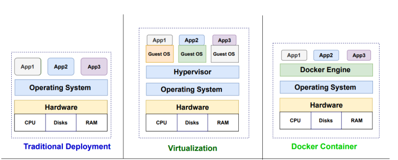
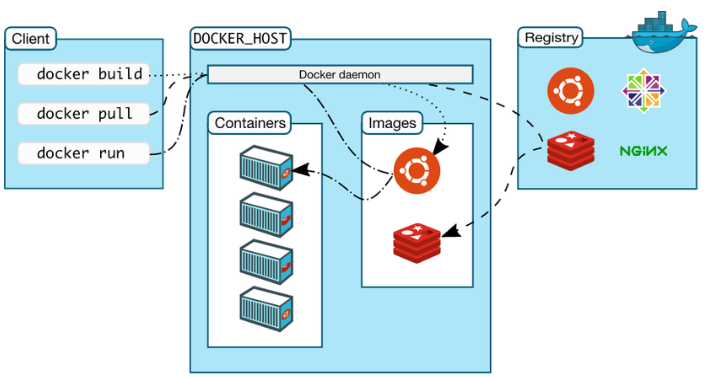
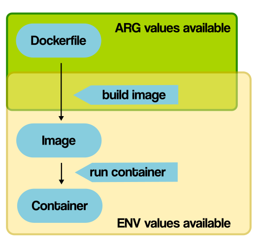
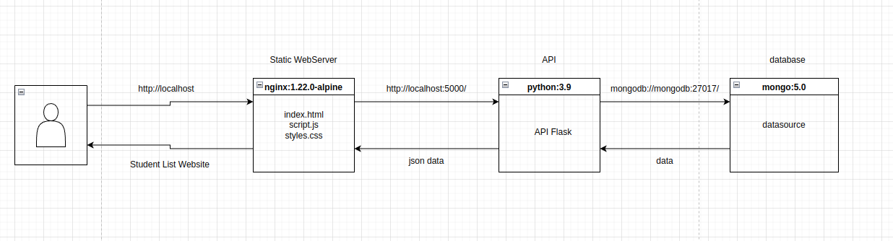
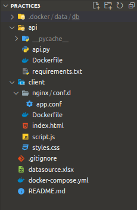
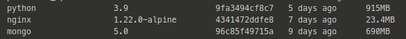
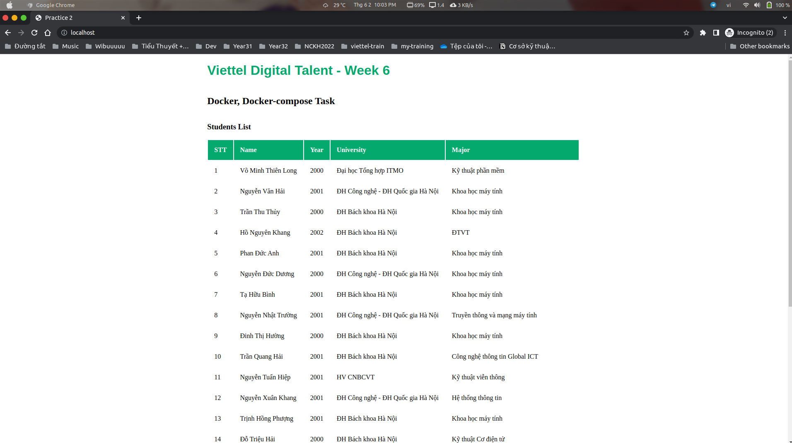

# **Viettel-Digital-Talent-2022: Week 6 - Pratice 3**

## **Task: docker, docker-compose**

## **Mục Lục**

- [**Viettel-Digital-Talent-2022: Week 6 - Pratice 3**](#viettel-digital-talent-2022-week-6---pratice-3)
  - [**Task: docker, docker-compose**](#task-docker-docker-compose)
  - [**Mục Lục**](#mục-lục)
  - [**I. Overview**](#i-overview)
    - [**1. Containerization**](#1-containerization)
    - [**2. Docker**](#2-docker)
    - [**3. Docker-compose**](#3-docker-compose)
  - [**II. Practicing 1**](#ii-practicing-1)
    - [**1. ARG vs ENV**](#1-arg-vs-env)
    - [**2. COPY vs ADD**](#2-copy-vs-add)
    - [**3. CMD vs ENTRYPOINT**](#3-cmd-vs-entrypoint)
  - [**III. Practicing 2**](#iii-practicing-2)
    - [**1. Tổng quan**](#1-tổng-quan)
    - [**2. Cài đặt**](#2-cài-đặt)
      - [**a. Cấu hình API**](#a-cấu-hình-api)
      - [**b. Cấu hình Client**](#b-cấu-hình-client)
      - [**c. Database**](#c-database)
      - [**d. docker-compose**](#d-docker-compose)
  - [**IV. Đánh giá khả năng tối ưu**](#iv-đánh-giá-khả-năng-tối-ưu)
  - [**V. Reference**](#v-reference)

## **I. Overview**

### **1. Containerization**

- Theo IBM định nghĩa: *Containerization is the packaging of software code with just the operating system (OS) libraries and dependencies required to run the code to create a single lightweight executable—called a container—that runs consistently on any infrastructure.*

- Containerization là giải pháp ảo hoá, tự động hóa thế hệ mới kế tiếp sau Hypervisor Virtualization, được các hãng công nghệ hàng đầu thế giới như Google, Facebook, Amazon áp dụng rộng rãi, đem lại hiệu quả đột phá với các ưu điểm vượt trội về tốc độ triển khai, khả năng mở rộng, tính an toàn và trải nghiệm người dùng.

  

### **2. Docker**

- Docker là một nền tảng để cung cấp cách để building, deploying và running ứng dụng dễ dàng hơn bằng cách sử dụng các containers (Trên nền tảng ảo hóa). Ban đầu Docker được viết bằng Python nhưng hiện tại đã chuyển sang Golang.

  

- Một số khái niệm cơ bản:

  - **Docker Engine:** là thành phần chính của Docker, như một công cụ để đóng gói ứng dụng

  - **Docker Hub:** là một “github for docker images”. Trên DockerHub có hàng ngàn public images được tạo bởi cộng đồng cho phép bạn dễ dàng tìm thấy những image mà bạn cần. Và chỉ cần pull về và sử dụng với một số config mà bạn mong muốn.

  - **Images:** là một khuôn mẫu để tạo một container. Thường thì image sẽ dựa trên 1 image có sẵn với những tùy chỉnh thêm. Ví dụ bạn build 1 image dựa trên image Centos mẫu có sẵn để chạy Nginx và những tùy chỉnh, cấu hình để ứng dụng web của bạn có thể chạy được. Bạn có thể tự build một image riêng cho mình hoặc sử dụng những image được chia sẽ từ cộng đồng Docker Hub. Một image sẽ được build dựa trên những chỉ dẫn của Dockerfile.

  - **Container:** là một instance của một image. Bạn có thể create, start, stop, move or delete container dựa trên Docker API hoặc Docker CLI.

  - **Docker Client:** là một công cụ giúp người dùng giao tiếp với Docker host.

  - **Docker Daemon:** lắng nghe các yêu cầu từ Docker Client để quản lý các đối tượng như Container, Image, Network và Volumes thông qua REST API. Các Docker Daemon cũng giao tiếp với nhau để quản lý các Docker Service.

  - **Dockerfile:** là một tập tin bao gồm các chỉ dẫn để build một image .

  - **Volumes:** là phần dữ liệu được tạo ra khi container được khởi tạo.

- *Khi nào cần sử dụng Docker*:

  - Triển khai kiến trúc Microservices.

  - Khi xây dựng ứng dụng và cần scale một cách linh hoạt.

  - Khi bạn muốn không tốn khá nhiều thời gian để config máy local và server cùng một môi trường để chạy được ứng dụng. Bạn chỉ cần build 1 lần chạy ở nhiều nơi mà thôi.

  - Sản phẩm của công ty bạn cần một cách tiếp cận mới về xây dựng, đẩy lên server, thực thi ứng dụng một cách nhanh chóng dễ dàng.

### **3. Docker-compose**

- Docker Compose là một công cụ dùng để định nghĩa và chạy các chương trình Docker sử dụng nhiều container (multi-container). Với Docker Compose, chúng ta sử dụng một file YAML để thiết lập các service cần thiết cho chương trình. Cuối cùng, với một câu lệnh, chúng ta sẽ create và start tất cả service từ các thiết lập đó.

  

- Những lợi ích khi sử dụng Compose:

- **Tạo ra nhiều môi trường độc lập (isolated environments) trong một host:** Compose cô lập môi trường của các project để đảm bảo chúng không bị xung đột lẫn nhau, cũng như dễ dàng tạo những bản sao của một môi trường nào đó.

- **Chỉ tạo lại các container đã thay đổi:** Compose sẽ nhận biết được các service chưa thay đổi và sử dụng lại các container tương ứng với service đó.

- **Điều chỉnh các biến sử dụng cho các môi trường:** Compose sử dụng các biến trong Compose file cho các môi trường. Vì vậy với môi trường hay người dùng khác nhau, có thể điều chỉnh các biến khi sử dụng Compose để thiết lập các service.

## **II. Practicing 1**

- *What are the differences between these instruction?*

  - ARG vs ENV

  - COPY vs ADD

  - CMD vs ENTRYPOINT

### **1. ARG vs ENV**

- `ARG`: Chỉ khả dụng trong quá trình build image (Như trong câu lệnh RUN), không khả dụng sau khi image đã được tạo ra và các container được khởi động từ nó.

- `ENV`: Là các giá trị ENV có sẵn trong container, nhưng cũng có các lệnh RUN được chạy trong quá trình Docker build, bắt đầu xuất hiện và khả năng dùng từ dòng lệnh mà chúng được khai báo. Nếu đặt biến môi trường trong các container trung gian bằng cách sử dụng bash (`RUN export VARI = 5 &&`), thì nó sẽ không tồn tại trong các command tiếp theo.

  

### **2. COPY vs ADD**

- `COPY` và `ADD` cả hai đều là chỉ dẫn lệnh trong Dockerfile và có mục đích tương tự nhau. Chúng cho phép copy files từ một vị trí được khai báo tới một Docker image.

  - `COPY` lấy giá trị là src và destination. Nó chỉ cho phép bạn copy một local file hoặc trực tiếp từ local host (máy thực hiện building Docker image) tới chính bản thân của Docker image.

  - `ADD` cũng cho phép bạn thực hiện giống như COPY nhưng còn hỗ trợ cả 2 loại source khác. Thứ nhất, bạn có thể sử dụng URL thay thế cho một local file/ đường dẫn. Thứ hai, bạn có thể thục hiện giải nén một file tar từ source một cách trực tiếp đến destination.

- Trong hầu hết các trường hợp, nếu bạn sử dụng một URL, bạn sẽ download một file zip và thực hiện sử dụng chỉ dẫn lệnh RUN để xử lý nó. Tuy nhiên, bạn cũng có thể sử dụng chỉ dẫn RUN với curl để thay thế cho chỉ dẫn ADD. Tuy nhiên, nên gộp các chỉ dẫn lệnh RUN xử lý một mục đích lại để giảm kích thước của Docker Image.

- Trường hợp sử dụng hợp lệ của ADD là khi bạn muốn thực hiện giải nén một local tar file tới một đường dẫn khai báo trong Docker Image. Điều này là chính xác với những gì Alpine Image thực hiện với ADD rootfs.tar.gz /.

- Nếu bạn thực hiện copy local files tới Docker image thì hãy thường xuyên sử dụng COPY bởi vì nó tường minh hơn so với ADD.

### **3. CMD vs ENTRYPOINT**

- Về cơ bản:
  
  - `CMD` thực hiện lệnh mặc định khi chúng ta khởi tạo container từ image, lệnh mặc định này có thể được ghi đè từ dòng lệnh khi khởi tại container.
  
  - `ENTRYPOINT` khá giống CMD đều dùng để chạy khi khởi tạo container, nhưng `ENTRYPOINT` không thể ghi đè từ dòng lệnh khi khi khởi tại container.

## **III. Practicing 2**

- *Set up a three-tier web application that displays the course attendees' information on the browser using docker-compose.*

- *Base images*
  
  - *nginx:1.22.0-alpine*
  
  - *python:3.9*
  
  - *mongo:5.0*

### **1. Tổng quan**

- **Mô hình**

  

- Hệ thống được triển khai sử dụng docker, docker-compose.

- Cấu trúc practice sau khi hoàn thành:

  

### **2. Cài đặt**

#### **a. Cấu hình API**

- API được viết bằng framework `Flask` của Python, sử dụng image base python:3.9.

- `requirements.txt` :

  ```txt
  Flask==2.1.2
  Flask-PyMongo==2.2.0
  requests==2.20.1
  flask-cors
  ```

- `api.py`

  ```python
  from flask import Flask, jsonify, request, render_template, json
  from pymongo import MongoClient
  from flask_cors import CORS, cross_origin
  app = Flask(__name__)
  CORS(app, support_credentials=True)
  client = MongoClient('mongodb://mongodb:27017/')
  db = client["GFG"]

  collection = db["students"]

  @app.route('/', methods = ['GET'])
  def index():
      listStudents = db.students.find()

      item = {}
      data = []
      for element in listStudents:
          item = {
              'id': str(element['_id']),
              'stt': str(element['stt']),
              'name': str(element['name']),
              'birth': str(element['birth']),
              'university': str(element['university']),
              'major': str(element['major'])
          }
          data.append(item)

      return jsonify(
          data
      )

  @app.route('/student', methods = ['POST'])
  def student():
      req_data = request.get_json()
      lists = req_data['lists']
      collection.insert_many(lists)

      return 'Saved!', 201
  ```

- `Dockerfile`

  ```yaml
  FROM python:3.9

  WORKDIR /app

  COPY ./requirements.txt .

  RUN pip install -r requirements.txt

  EXPOSE 5000
  ```

#### **b. Cấu hình Client**

- Frontend sử dụng `Nginx` làm *Statics Web Server*, với image base: `nginx:1.22.0-alpine`.

- `nginx/conf.d/app.conf`

  ```ini
  server { 
      listen 80;
      server_name localhost;
      location / {
          root /usr/share/nginx/html;
          try_files $uri /index.html;
      }
  
      location /api {
          proxy_set_header X-Real-IP $remote_addr;
          proxy_set_header X-Forwarded-For $proxy_add_x_forwarded_for;
          proxy_set_header X-NginX-Proxy true;
          proxy_pass http://localhost:5000/;
          proxy_ssl_session_reuse off;
          proxy_set_header Host $http_host;
          proxy_cache_bypass $http_upgrade;
          proxy_redirect off;
      }
  }
  ```

- `Dockerfile`

  ```yaml
  FROM nginx:1.22.0-alpine

  # Set working directory to nginx asset directory
  WORKDIR /usr/share/nginx/html
  # Remove default nginx static assets
  RUN rm -rf ./*
  # Copy static assets over
  COPY ./* ./
  # Containers run nginx with global directives and daemon off
  ENTRYPOINT [ "nginx", "-g", "daemon off;" ]
  ```

- `index.html`
  
  ```html
  <!DOCTYPE html>
  <html lang="en">
      <head>
          <script src="script.js"></script>
          <link rel="stylesheet" href="styles.css" />
          <meta charset="UTF-8" />
          <meta name="viewport" 
                content="width=device-width, initial-scale=1.0" />
          <title>Practice 2</title>
      </head>
      <body>
          <!-- Here a loader is created which 
              loads till response comes -->
          <div class="d-flex justify-content-center">
              <div class="spinner-border" 
                  role="status" id="loading">
                  <span class="sr-only">Loading...</span>
              </div>
          </div>
          <h1>Viettel Digital Talent - Week 6</h1>
          <h2>Docker, Docker-compose Task</h2>
          <h3>Students List</h3>
          <!-- table for showing data -->
          <table id="data"></table>
      </body>
  </html>
  ```

- `script.js`

  ```js
  // api url
  const api_url = 
        "http://localhost:5000";
    
  // Defining async function
  async function getapi(url) {
      
      // Storing response
      const response = await fetch(url);
      
      // Storing data in form of JSON
      var data = await response.json();
      console.log(data);
      if (response) {
          hideloader();
      }
      show(data);
  }
  // Calling that async function
  getapi(api_url);
    
  // Function to hide the loader
  function hideloader() {
      document.getElementById('loading').style.display = 'none';
  }
  // Function to define innerHTML for HTML table
  function show(data) {
      let tab = 
          `<tr>
              <th>STT</th>
              <th>Name</th>
              <th>Year</th>
              <th>University</th>
              <th>Major</th>
          </tr>`;
      
      // Loop to access all rows
      for (let r of data) {
          tab += `<tr>
      <td>${r.stt} </td>
      <td>${r.name} </td>
      <td>${r.birth}</td>
      <td>${r.university}</td> 
      <td>${r.major}</td>          
  </tr>`;
      }
      // Setting innerHTML as tab variable
      document.getElementById("data").innerHTML = tab;
  }
  ```

- `style.css`

  ```css
  body {
    display:flex; flex-direction:column; justify-content:center;
    min-height:100vh;
    max-width: max-content;
    margin: auto;
  }

  h1 {
      font-family: sans-serif;
      color: #04AA6D;
    }

  th, td {
    padding: 15px;
    text-align: left;
  }

  tr:hover {background-color: coral;}
  th {
    background-color: #04AA6D;
    color: white;
  }
  ```

#### **c. Database**

- Do việc sử dụng `mongodb` khá đơn giản và không cần phải cấu hình nên ta sẽ trực tiếp sử dụng image base `mongodb:5.0` vào docker-compose.

#### **d. docker-compose**

- `docker-compose.yml`

  ```yaml
  version: '3.9'

  services:
      api:
          build:
            context: ./api
            dockerfile: Dockerfile
          volumes:
              - ./api/:/app
          ports:
            - 5000:5000
          environment:
              - FLASK_APP=api.py
          command: flask run --host=0.0.0.0

      webserver:
          build:
            context: ./client
            dockerfile: Dockerfile
          ports:
              - 80:80
          volumes:
              - ./client/nginx/conf.d/:/etc/nginx/conf.d/
              - ./client:/usr/share/nginx/html

      mongodb:
          image: mongo:5.0
          volumes:
              - .docker/data/db:/data/db

  ```

## **IV. Đánh giá khả năng tối ưu**

- Thông số các image base:

  

- Trong practice này, ta sử dụng trực tiếp image base `mongo:5.0` nên sẽ chỉ xem xét 2 base còn lại của api và nginx:

  

- Ta thấy dung lượng của image `nginx` (hay `practice3_webserver` sau build) là tương đương. Nguyên nhân do việc sử dụng `nginx` làm static web server gần như không cần cài thêm packet gì, mà chỉ host các file như html, js, css rất nhẹ lên webserver, do vậy việc tối ưu là tương đối tốt.

- Dung lượng của image `python` sau khi build (practice3_api) đã tăng lên khoảng 18Mb. Do đối với API, ta cần cài thêm các packet từ python flask để có thể sử dụng.

- Kết quả:

  

## **V. Reference**

- [1] <https://www.geeksforgeeks.org/how-to-use-the-javascript-fetch-api-to-get-data/>

- [2] <https://github.com/PauGa9/flask-mongodb-nginx-docker>

- [3] <https://geekflare.com/nginx-static-files-node-js/>

- [4] <https://ishmeet1995.medium.com/how-to-create-restful-crud-api-with-python-flask-mongodb-and-docker-8f6ccb73c5bc>

- [5] <https://www.youtube.com/watch?v=oYHxA8HY59M&ab_channel=ElClouddePau-Programaci%C3%B3nWeb>

- [6] <https://viblo.asia/p/dockerfile-references-3P0lPkmpZox>
