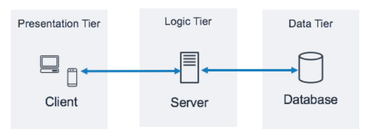
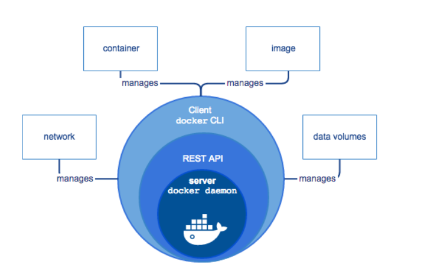
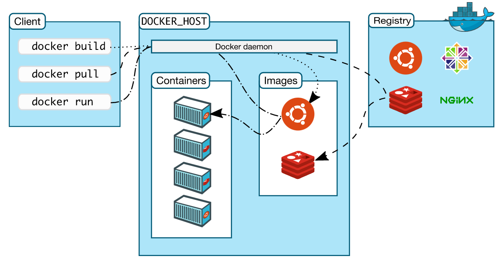
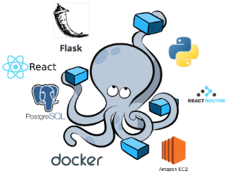
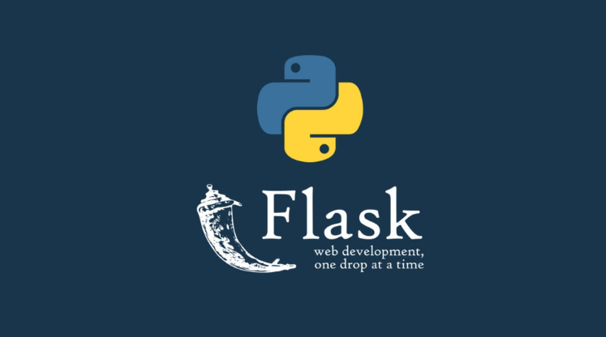
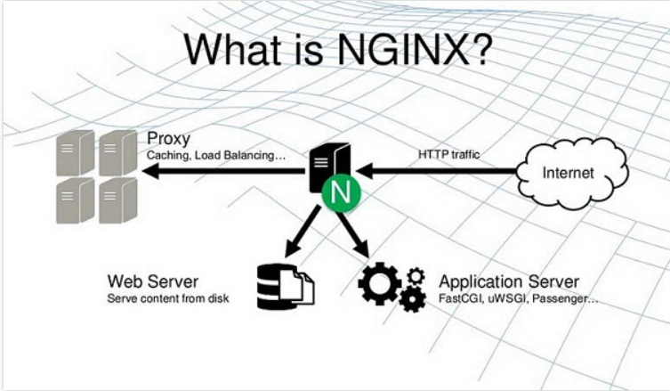
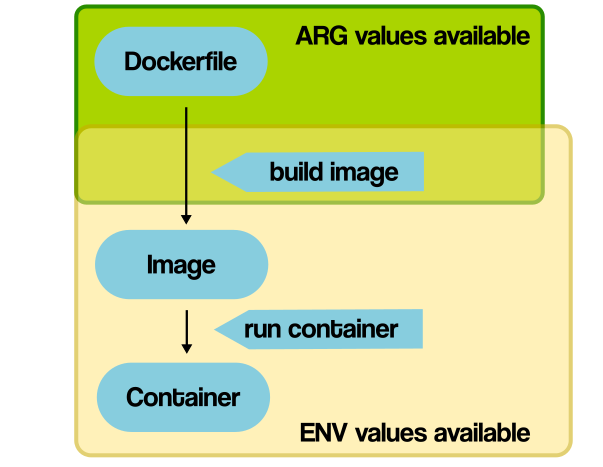
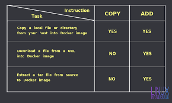

## PRACTICE 3: Set up a three-tier web application using docker-compose.   
----    

## Table of contents      

[I. Yêu cầu](#yeucau)   
[II. Chuẩn bị](#chuanbi)   
- [1. Docker](#docker)     
   - [1.1 Dockerfile](#dockerfile)  
   - [1.2 Docker-compose](#dockercompose)      
- [2. Flask](#flask)  
- [3. Mongodb](#mongodb)      
- [4. Nginx](#nginx)   

[III. Cài đặt Docker trong Ubuntu 20.04 Server](#installdockertrongubuntu20.04Server)      
- [1. Cài đặt Docker Engine](#caidatdockerengine)     
- [2. Cài đặt Docker Compose](#caidatdockercompose)      

[IV. Homework](#baitap)    
- [1. ARG vs ENV](#argvsenv)    
- [2. COPY vs ADD](#copyvsadd)   
- [3. CMD vs ENTRYPOINT](#cmdvsentrypoint)     

[V. Tài liệu tham khảo](#tailieuthamkhao)     

----     

<a name='yeucau'></a>    

## I. Yêu cầu    
- Thiết lập một ứng dụng web three-tier hiển thị thông tin danh sách sinh viên tham gia VDT2022 trên browser sử dụng docker-compose.    
- Base images:   
   - nginx:1.22.0-alpine   
   - python:3.9  
   - mongo:5.0         

   

<div align="center"> Three-tier web architecture</i></div>    

<a name='chuanbi'></a>     

## II. Chuẩn bị     

<a name='docker'></a>    
### 1. Docker      
- Docker là một PaaS (Platform as a Service) cho developing, shipping, and running applications (trên nền tảng ảo hóa).              
- Docker cung cấp khả năng đóng gói và chạy một ứng dụng trong một môi trường cô lập được gọi là `container`. Sự cô lập và bảo mật cho phép bạn chạy nhiều container đồng thời trên một host nhất định.                       

#### Kiến trúc, các thành phần Docker   
- Các thành phần:   
    - `Docker Engine` là một ứng dụng client-server với các thành phần chính sau:   
        - `Server`: hay còn gọi là `docker daemon` chịu trách nhiệm tạo, quản lý các Docker object như: image, containers, networks, volume.      
        - `REST API`: được `docker daemon` sử dụng để cung cấp các api cho client sử dụng để thao tác với docker.   
        - `Client`: là thành phần cuối cùng cung cấp một tập hợp các câu lệnh sử dụng API để người dùng thao tác với Docker.   
        VD: docker image, docker ps, docker network,...    

           
    

- Kiến trúc Docker     

    

- Docker sử dụng kiến trúc client-server. Docker client sẽ giao tiếp với Docker daemon các công việc building, running và distributing các Docker container.       
- Docker client và daemon giao tiếp bằng REST API qua UNIX sockets hoặc một network interface.   
- Docker Registries để cho các docker image đăng ký lưu trữ qua Docker Hub để bạn hoặc người khác có thể pull về một cách dễ dàng.          

<a name='dockerfile'></a>    

## 1.1 Dockerfile   
- Docker image có thể được tạo ra tự động bằng cách đọc các chỉ dẫn trong `Dockerfile`.    
- Sử dụng `docker build` để tạo tự động.    

### Cấu trúc Dockerfile       
- `FROM`: Chỉ định image nào sẽ được dùng làm image cơ sở để quá trình build image thực hiện các câu lệnh tiếp theo.        
```    
# Cú pháp  
FROM [--platform=<platform>] <image> [AS <name>]       

# Example   
FROM ubuntu  
or 
FROM ubuntu:latest   
```        
- `RUN`: dùng để chạy một lệnh nào đó trong quá trình build image và thường là các câu lệnh Linux. Tùy vào image gốc được khai báo trong phần FROM thì sẽ có các câu lệnh tương ứng.      
- RUN có 2 định dạng   
   - Shell Form    
   - Executable Form    
```    
# Shell Form    
RUN <command>      
# Example   
run yum update  
run systemctl start httpd     

# Executable Form   
RUN["executable", "param1", "param2"]       
# Example   
run ["systemctl", "start", "httpd"]    
```       

- `ADD`: sẽ thực hiện sao chép các file, thư mục từ máy đang build hoặc remote file URLs từ `src` và thêm chúng vào filesystem của image `dest`.    
- ADD có 2 định dạng:   
   - Shell Form  
   - Executable Form       
```   
ADD [--chown=<user>:<group>] <src>... <dest>   
ADD [--chown=<user>:<group>] <"<src>",... "<dest>">     
```        
- `COPY`: cũng giống với ADD là copy file, thư mục từ `<src>` và thêm chúng vào `<dest>` của container. Khác với ADD, nó không hỗ trợ thêm các file remote file URLs từ nguồn trên mạng.  
```  
COPY [--chown=<user>:<group>] <src>... <dest>   
COPY [--chown=<user>:<group>] ["<src>"... "<dest>"]       
```
- `EVN` dùng để khai báo các biến môi trường. Các biến này được khai báo dưới dạng key-value bằng các chuỗi. Giá trị của các biến này sẽ có hiện hữu cho các chỉ thị tiếp theo của Dockerfile.   
```   
# Cú pháp  
ENV <key>=<value> ...   
```      
- `ARG`: chỉ khả dụng trong quá trình build docker image (như trong câu lệnh RUN), không khả dụng sau khi image được tạo ra và các container được khởi động từ nó (ENTRYPOINT, CMD) dùng để set giá trị ENV để làm việc trong đó.  
```   
# Cú pháp  
ARG <name>[=<default value>]       
```   
- `CMD` định nghĩa các câu lệnh sẽ được chạy sau khi container được khởi động từ image đã build. Có thể khai báo được nhiều nhưng chỉ có duy nhất CMD cuối cùng được chạy.    
```  
# Cú pháp  
CMD ["executable", "param1", "param2"]  
CMD ["param1", "param2"]  
CMD command param1 param2    
```   
- `ENTRYPOINT` và `CMD` có tác dụng tương tự nhau. Nếu một dockerfile có cả `CMD` và `ENTRYPOINT` thì CMD sẽ thành param cho script ENTRYPOINT.      
```   
# Cú pháp  
ENTRYPOINT ["executable", "param1", "param2"] (exec form)  
ENTRYPONIT command param1 param2 (shell form)   
```     
- `VOLUME`: mount thư mục từ máy host và container    
```  
# Cú pháp  
VOLUME ["/data"]    
```  

<a name='dockercompose'></a>   

## 1.2 Docker Compose   
- Compose là một công cụ để định nghĩa và chạy các chương trình Docker sử dụng nhiều container (multi-container).  
- Với `Docker Compose`, chúng ta sử dụng một file YAML để thiết lập các service cần thiết cho chương trình. 
- Cuối cùng, với một câu lệnh, chúng ta sẽ create và start tất cả các service từ các thiết lập đó.   
   - Khai báo app's environment trong Dockerfile.  
   - Khai báo các services cần thiết để chạy application trong file docker-compose.yml  
   - Run docker-compose up để start và run app.      

   

<div align='center'>Docker-Compose là gì?</i></div>   

<a name='flask'></a>  
## 2.Flask   
- `Flask` là một framework ứng dụng cho website được tạo ra từ ngôn ngữ lập trình web Python. 
- Nó được ứng dụng trong thiết kế website đơn giản và tạo lập các ứng dụng cho những trang web lớn và phức tạp.    
- Nền tảng chính của Flask Python là Werkzeug WSGI và Jinja2.   

   

<div align='center'>Flask python là gì?</i></div>

<a name='mongodb'></a>    

## 3. Mongodb   
- `Mongodb` là một database hướng tài liệu (document), một dạng NoSQL database.    
- `Mongodb` sử dụng lưu trữ dữ liệu dưới dạng Document JSON nên mỗi một collection sẽ có các kích cỡ và các document khác nhau. Các dữ liệu được lưu trữ trong document kiểu JSON nên truy vấn sẽ rất nhanh.   

     

<div align='center'>MongoDB là gì?</i></div>   

<a name='nginx'></a>   
## 4. Nginx    
- `Nginx` là một phần mềm mã nguồn mở cho web serving, reverse proxying, caching, load balancing, media streaming,...
- Nó bắt đầu như một máy chủ web được thiết kế để có hiệu suất và sự ổn định tối đa.   
- Ngoài các khả năng của máy chủ HTTP, Nginx cũng có thể hoạt động như một máy chủ proxy cho email (IMAP, POP3, SMTP) và một trình cân bằng tải và proxy ngược cho các máy chủ HTTP, TCP, UDP.    

   

<div align='center'>Nginx là gì?</i></div>    

<a name='installdockertrongubuntu20.04Server'></a>   

## III. Cài đặt Docker trong Ubuntu 20.04 Server    

<a name='caidatdockerengine'></a>  

### 1. Cài đặt Docker Engine     
- Các bạn hãy thực hiện cài và sử dụng `docker` và `docker-compose` trước khi chạy các lệnh để deploy web application nhé.      

    -  [Install Docker Desktop on Mac](https://docs.docker.com/desktop/mac/install/)  
    - [Install Docker Engine on Ubuntu](https://docs.docker.com/desktop/mac/install/)   
    - [Install Docker Engine for Distro](https://docs.docker.com/engine/install/)     

### 2. Cài đặt Docker Compose  
- Các bạn hãy làm theo [hướng dẫn](https://docs.docker.com/compose/install/) này nhé.       


<a name='baitap'></a>   

## IV. Homework     

<a name='argvsenv'></a>    
### 1. ARG vs ENV    

- `ARG` và `ENV` thì giống nhau, cả hai đều xác định biến (variables).   
- Khác nhau:  
   - `ENV`: cung cấp giá trị mặc định cho biến môi trường sau khi một image built.      
   - `ARG`: là biến built-time chỉ hoạt động trong quá trình build-image. Khi chạy container, chúng không thể truy cập giá trị của các biến ARG, nếu thay đổi lệnh build sẽ lỗi.     

    
 
<div align='center'>ENV vs ARG</i></div>  

<a name='copyvsadd'></a>   
## 2. COPY vs ADD   
- `COPY` thì giống `ADD` nhưng không có xử lý `tar` và `remote URL`    

    

<a name='cmdvsentrypoint'></a>   

## 3. CMD vs ENTRYPOINT  

- `CMD` thực hiện lệnh mặc định khi chúng khởi tạo container từ image, lệnh mặc định này có thể được ghi đè từ dòng lệnh khi khởi tạo container.   
- `ENTRYPOINT` khá giống `CMD` đều dùng để chạy khi khởi tạo container, nhưng ENTRYPOINT không ghi đè từ dòng lệnh khi khởi tại container.   


<a name='tailieuthamkhao'></a>   

## V.Tài liệu tham khảo    

[1] https://docs.docker.com/get-started/overview/    
[2] https://www.tutorialspoint.com/what-is-the-difference-between-cmd-and-entrypoint-in-a-dockerfile#:~:text=The%20ENTRYPOINT%20instruction%20looks%20almost,run%20command%20(CLI%20parameters).     
[3] https://www.guru99.com/what-is-mongodb.html  
[4] https://kinsta.com/knowledgebase/what-is-nginx/     
[5] https://pythonbasics.org/what-is-flask-python/   