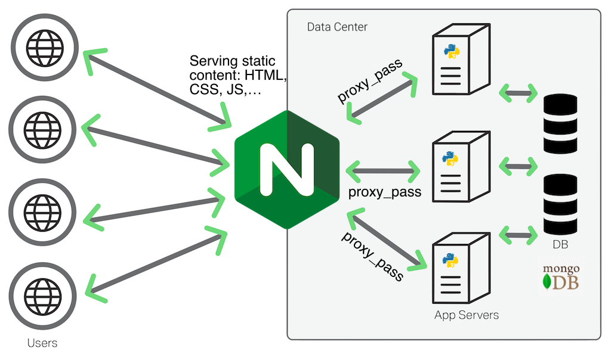
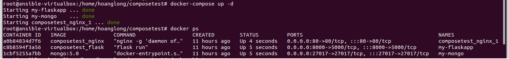
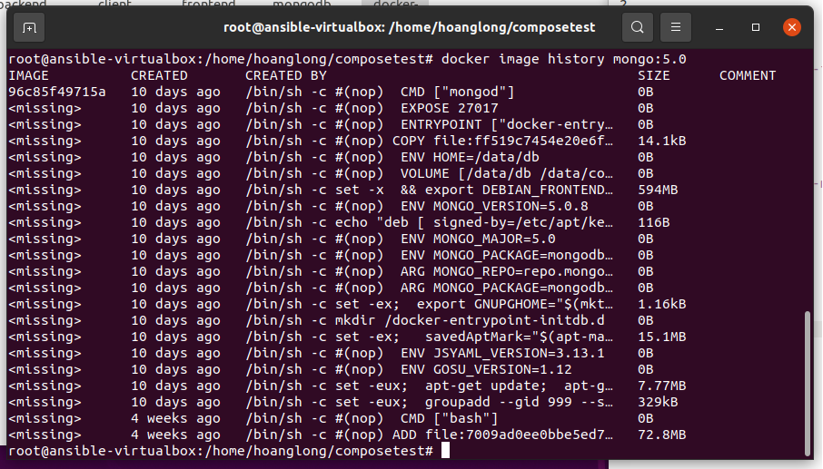
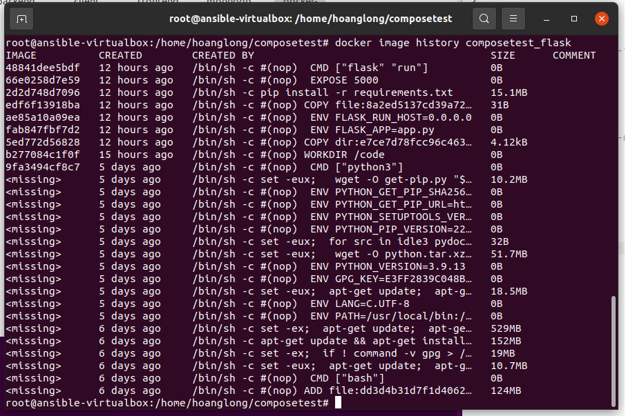
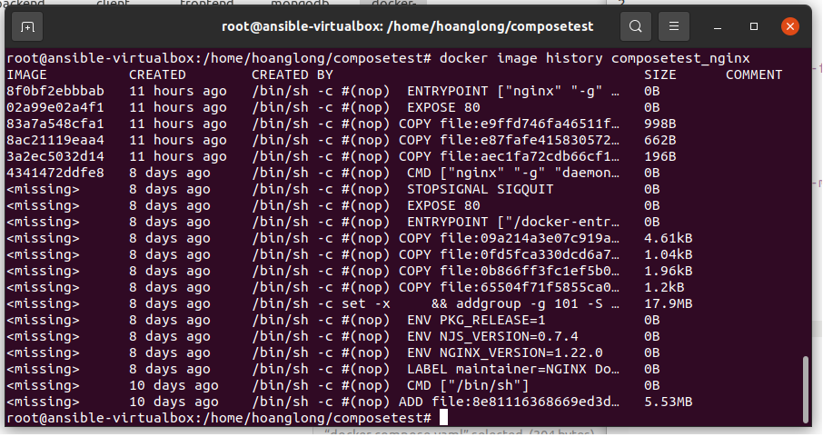

# PRACTICE-3 PRACTICES DOCUMENTATION
## DEPLOY THREE-TIER WEB APPLICATION WITH DOCKER

---

## **Author:** *Phung Hoang Long* 

---

## 1. PHÂN BIỆT CÁC INSTRUCTION 

### 1.1 ARG vs ENV

Trong Docker, ARG và ENV đều được dùng để định nghĩa biến được sử dụng, tuy nhiên chúng được sử dụng trong 2 giai đoạn khác nhau.

**ENV phục vụ cho việc chạy container trong tương lai. ARG sử dụng cho việc build Docker image**

**ENV** cung cấp các giá trị mặc định cho các biến của môi trường, vì vậy khi chạy dockerized applicatioins sẽ làm thay đổi các biến của môi trường.

**ARG** chỉ sử dụng khi build image, sau đó ARG sẽ không được sử dụng nữa.


### 1.2 COPY vs ADD

```
COPY <src> <dest>
ADD <src> <dest>
```

COPY và ADD đều phục vụ mục đích sao chép file từ địa điểm cụ thể vào trong Docker image. Tuy nhiên:

**COPY** chỉ truy cập vào những đường dẫn từ máy host đang thực hiện build image và sao chép chúng vào Docker image.

**ADD** cũng làm được tương tự, ngoài ra ADD còn hỗ trợ thêm 2 nguồn: 
	- Đường dẫn URL có thể được sử dụng để thay thế cho local file/directory
	- Bạn có thể auto-extract tar từ đường dẫn nguồn tới đích

**Tuy nhiên** sử dụng ADD để lấy các remote file không phải là ý tưởng tốt. Đó là do nó có thể làm tăng dung lượng của Docker image, thay vào đó chúng ta nên dùng curl hoặc wget để lấy file về và xóa chúng đi khi không cần thiết nữa.

Sử dụng cho cùng mục đích nhưng việc ADD có thể gây tăng dung lượng cả image cũng như việc sử dụng curl và wget hỗ trợ chúng ta làm việc hầu hết là ở local, vì vậy việc dùng **COPY** là tối ưu hơn. 

### 1.2 CMD vs ENTRYPOINT

CMD và ENTRYPOINT đều phục vụ việc định nghĩa chương trình nào được chạy trong container và thiết lập thứ tự cho các chương trình đó.

Với CMD, bạn có thể thiết lập các tham số mặc định  nhưng nó có thể bị ghi đè bằng CLI khi chạy container.

Khác với CMD, ENTRYPOINT không để các tham số của mình bị ghi đè bởi CLI

## 2. THREE-TIER WEB APPLICATION WITH DOCKER



Đây là một kiến trúc phổ biến của các webapp:
- Tầng trình diễn: Là tầng phục vụ cho người dùng cuối, tầng này biểu diễn các dữ liệu được gửi về cũng như cung cấp các thao tác để người dùng tương tác với webapp. Trong project này ta sẽ sử dụng Nginx để Host các file html, css, js, ... cũng như là một proxy server để pass các request được gửi đến.
- Tầng ứng dụng: Là tầng cung cấp các hoạt động xử lý dữ liệu và logic. Để đơn giản hóa việc lập trình ta sử dụng FLask là framework của python cho việc phát triển webapp. 
- Tâng dữ liệu: Là nơi lưu trữ dữ liệu của hệ thống. Trong project này ta sẽ sử dụng Mongodb.

### 2.1 mongo

Chúng ta sẽ sử dụng mongo:5.0

```
FROM mongo:5.0
```

Sau đó ta sẽ khởi tạo sẵn user/password và database

```
ENV MONGO_INITDB_ROOT_USERNAME = admin
ENV MONGO_INITDB_ROOT_PASSWORD = 12345678
ENV MONGO_INITDB_DATABASE = VDT2022
```

Sau khi khởi tạo xong, chúng ta nên thực hiện seeding dữ liệu vào database, tuy nhiên mình chưa thành công trong việc này nên sẽ phải thực hiện thủ công sau khi build image.

### 2.2 backend

Chúng ta sẽ sử dụng Flask để viết API giao tiếp với Frontend, sử dụng flask_pymongo để kết nối với mongodb.
App này ta sẽ chỉ cần 1 API method=GET để lấy dữ liệu.

```
from flask import Flask, Response
from flask_pymongo import PyMongo
from bson import json_util
from flask_cors import CORS

app = Flask(__name__)
app.config["MONGO_URI"] = "mongodb://localhost:27017/VDT2022"
mongo = PyMongo(app)
CORS(app)

@app.route('/')
def get_homepage():
    return "<h1> hello world </h1>"

@app.route('/attendees', methods=['GET'])
def get_users():
    attendees = mongo.db.attendee.find({})
    response = json_util.dumps(attendees)
    return Response(response, mimetype='applicaion/json')

if __name__ == "__main__":
    app.run(debug=True)
```

Trong quá trình viết API, có một lỗi mà bất kỳ ai cũng sẽ gặp:
> no ‘access-control-allow-origin’ header is present on the requested resource

Lỗi này phát sinh vì **same-origin policy** là một chính sách liên quan đến bảo mật được cài đặt vào toàn bộ các trình duyệt hiện nay. Chính sách này ngăn chặn việc truy cập tài nguyên của các domain khác một cách vô tội vạ. 

Chúng ta sẽ fix bằng cách config enable CORS cho webapi của mình, ở đây mình dùng flask_cors để làm việc đó.

Ta cần khai báo các thư viện liên quan trong file requirements.txt:

```
flask
flask_pymongo
flask_cors
```

Trong Dockerfile, ta sử dụng base image là python:3.9 và tạo workdir

```
 FROM python:3.9
 WORKDIR /code
```

copy requirements.txt và chạy install các thư viện, dùng --no-cache-dir để giảm thời gian build:

```
COPY requirements.txt requirements.txt 
RUN pip install --no-cache-dir -r requirements.txt 
```

Cuối cùng là copy code và config các thông số của webapi

```
COPY app.py . 
ENV FLASK_APP=app.py 
ENV FLASK_RUN_HOST=0.0.0.0 
EXPOSE 5000
CMD ["flask", "run"]
```

### 2.3 frontend

Ta sẽ sử dụng Nginx:1.22.0

Đầu tiên ta phải khai báo các thông số thay đổi so với config mặc định của Nginx

```
server {
    listen       80;
    server_name  localhost;

    location / {
        root   /usr/share/nginx/html;
        index  index.html index.htm;
        try_files $uri /index.html;
    }

}

```

Tiếp sau đó, xây dựng Dockerfile để với base image nginx:1.22.0

```
FROM nginx:1.22.0-alpine
# Copy config file
COPY nginx.conf /etc/nginx/conf.d/default.conf
# Copy source code
COPY index.html /usr/share/nginx/html/index.html
COPY app.js /usr/share/nginx/html/app.js
# Containers run nginx with global directives and daemon off
EXPOSE 80
ENTRYPOINT [ "nginx", "-g", "daemon off;" ]
```

### 2.4 Final deploy

Cuối cùng ta sẽ tạo docker-compose.yaml để thực hiện build image

```
version: '3.3'

services:

  flask: 
    container_name: my-flaskapp
    build: backend/.
    ports:
      - "8000:5000"
  
  mongodb:
    container_name: my-mongo
    build: mongodb/.
      
  nginx:
    build: frontend/.
    ports:
      - 80:80
    links:
      - flask
```

thực hiện

```
docker-compose up -d
```

> kết quả:



Chi tiết các image

> mongo:5.0



> composetest_flask



> composetest_nginx



Kết quả deploy cuối cùng


## 3. REFERENCES

- <a href="https://www.digitalocean.com/community/tutorials/how-to-deploy-a-go-web-application-with-docker-and-nginx-on-ubuntu-18-04">How to deploy a go web application with docker and nginx</a>

- <a href="https://citizix.com/how-to-run-mongodb-with-docker-and-docker-compose/">How to run mongodb with docker and docker compose</a>