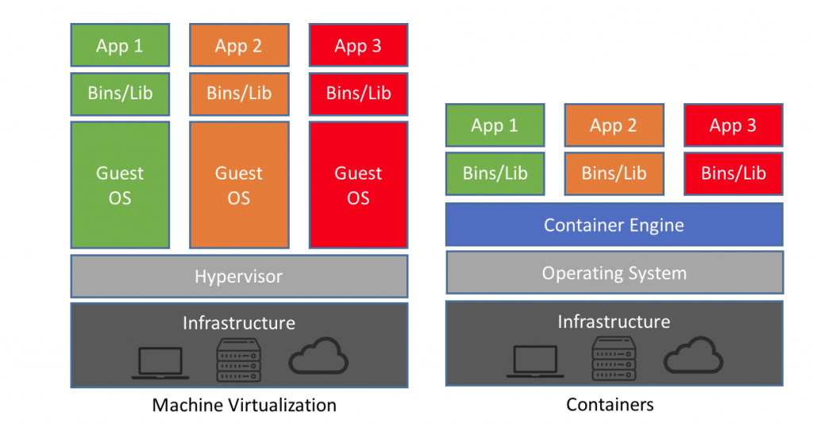
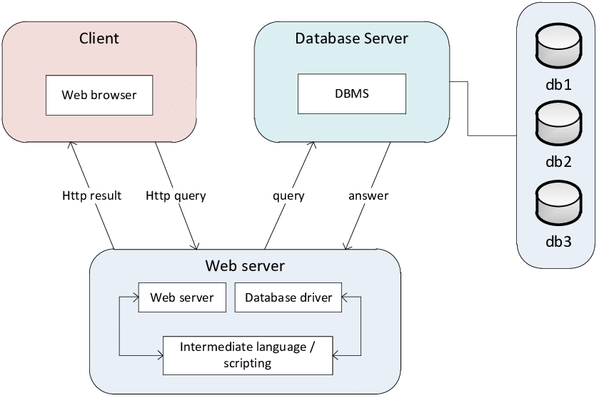
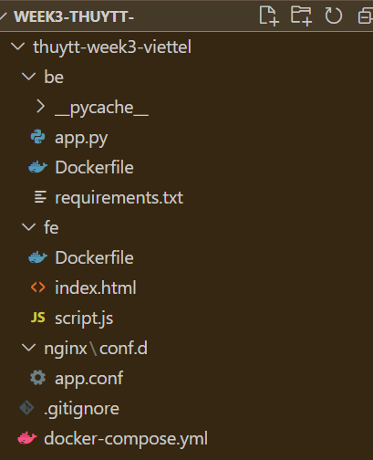
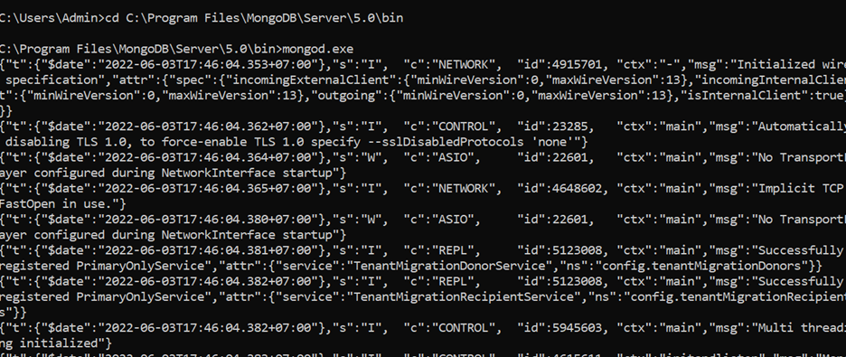
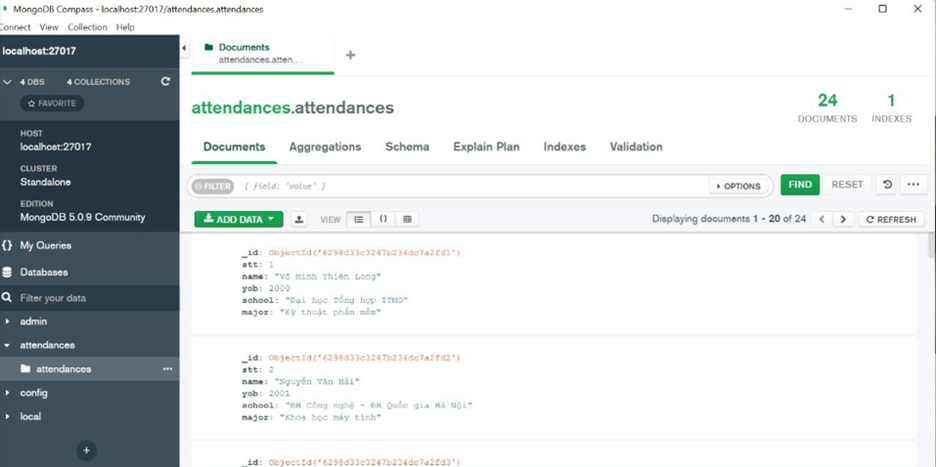
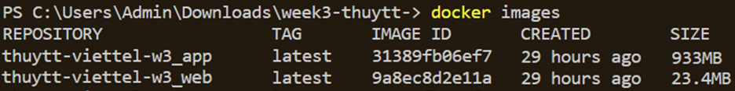

#**SET UP WEB APP USING DOCKER COMPOSE**

#Content
#####I/ Knowledge base

#####1.1 Containerization and VMs
#####1.2 Docker
#####1.3 Docker Compose

#####II/ Pratice 1

#####2.1 ARG and ENV
#####2.2 COPY and ADD
#####2.3 CMD and ENTRYPOINT

#####III/ Pratice 2
#####IV/ Evaluation
#####V/ References

#**I/ Knowledge base**

## 1.1  Containerization and VMs

**When to Use Virtual Machines**

 - Ideal for “lift-and-shift” migrations, virtual machines allow you to quickly move a fully functioning system between locations.
 
 - Virtual machines automatically scale wel, automate and accelerate the process of set up new machines as demand increases
 
 **Disadvantage of VMs**
 
 _Resource cost increases exponentially_. You must pay for all the resources include:
 
 – CPU, disk, RAM, OS, and application licenses, etc. 
 
 – Allocated to the image, even if they are not used.

_A full virtual machine has all the same management overheads of a physical machine_
 
 -The operating system and applications must be regularly updated and patched => adds to the cost and management overhead of operation. 
 
 -Managing the security permissions to execute your apps on the VMs.

**Containerization**

 Containers are lightweight, designed to fulfill a specific task and linked to build a fully functional application or service without the overhead of an operating system.

=> Improves scalability. As demand increases, rather than spinning up a complete virtual machines, you can simply spin up another cluster node to make more containers available. (as well as scale down)

=> Better at limiting cloud resource demands and costs. 

**Disavantages**

However, containers does not offer a native isolation mechanism in the same way that virtual machines running on hypervisors do.

## 1.2 Docker

- Docker is a platform for providing ways to build, deploying and running application easier than using containers (on virtualization platform). 

- Some basic concepts:

  - **Docker Engine:** is the main component of Docker, as a tool for packaging applications

  - **Docker Hub:** is a "github for docker images". On the Dockerhub there are thousands of public images created by the community that allows you to easily find the images you need. 

  - **Images:** is a pattern to create a container. Usually the image will be based on an existing image with additional customization. 
  
  - **Container:** is an instance of an image. You can Create, Start, Stop, Move or Delete Container based on docker API or Docker Cli.

  - **Docker Client:** is a tool to help users communicate with Docker Host.

  - **Docker Daemon:** Listen to the requirements from the Docker Client to manage objects such as containers, image, network and volumes via Rest API. Daemon docker also communicates with each other to manage the docker service.

  - **Dockerfile:** is a file that includes instructions to build an image.

  - **Volumes:** The data is created when the container is initialized.

**When do you need to use docker ?**:

  - Implement microservices architecture.

  - When building applications and need scale flexibly.

  - When you want to not spend a lot of time for Local and Server to config the same environment to run the application. You only need to build once in many places.

  - Products of your company need a new approach to construction, push up the server, execute the application quickly easily

##**1.3. Docker-compose**

Docker Compose is a tool used to define and run docker programs using multiple containers (multi-containers). With Docker Compose, we use a YAML file to set up the necessary services for the program. Finally, with a statement, we will create and start all the services from those settings.

**The benefits of using compose**

- Create many independent environments in a host

- Only recreate changing containers

- Adjust variables used for environments

#**II/ Pratice 1**

Requirements: Compare docker file command 
- ARG and ENV
- ADD and COPY
- CMD and ENTRYPOINT

##2.1 ARG and ENV
 | | ARG | ENV |  
 | ---------- | --------- | --------- |
 | Syntax | ARG < var_name > < value > | ENV < var_name > < value > |
 |  Purpose | ARG for building your Docker image.| ENV is for future running containers|
 |  Defaults value of variable    | Can override ARG values directly from the commandline when building your image| Cannot change ENV directly during the build| 

 The overview of "how it works" as described in picture below
 
 
 
##2.2 COPY and APP

 | | COPY | APP |  
 | ---------- | --------- | --------- |
 | Syntax | COPY <src> <dest> | ADD source destination |
 |  Definitions |Command that copies files from a local source location to a destination in the Docker container. | Command is used to copy files/directories into a Docker image|
 |  Roles   | Duplicate files/directories in a specified location in their existing format | Download an external file and copy it to the wanted destination | 
 | Recommendation | Should use to avoid backward compatibility | Less usable then COPY command|

## 2.3 CMD and ENTRYPOINT

 | | CMD | ENTRYPOINT |  
 | ---------- | --------- | --------- |
 | Syntax |
  |Shell form|CMD < instruction > < command > | ENTRYPOINT < instruction > < command > |
  |Exec form| CMD < instruction > ["executable", "parameter"]| ENTRYPOINT <instruction> ["executable", "parameter"]
 | When specify arguments with Docker run | The arguments specified using the CMD instruction will be ignored ( CLI arguments using the Docker run command will override the arguments specified using the CMD instruction) | Shell form: ENTRYPOINT instruction overrides all arguments / Executable form: may set additional parameters using the CMD instruction |
 | Use-case | Specifies the default parameter | Define the executable |
 
 #III. Practice 2
 

 Requirements: *Set up a three-tier web application that displays the course attendees' information on the browser using docker-compose.*

- *Base images*

  - *nginx:1.22.0-alpine*

  - *python:3.9*

  - *mongo:5.0*
## 2.1 Architecture

A modular architecture of client-server termed as 3 tier application is the one consisting of database tier, application tier and presentation tier. 
While information is stored in the data tier, logic is handled by application tier and the graphical user interface is presentation tier that establishes communication with the remaining two tiers.

The project was written in Visual Studio Code, you can use any other editor platform.

Due to the limit of machine OS, this project was set up using Windows. Thanks for your sympathy :D

My file architecture was shown as below:

## Step by step
 **Create fe folder**

*app.cfg*

First, I create a nginx configuration file, which consists of essential configuration that allows a container listen to python app

In my server block, the listen port is 80, which informs NGINX of the hostname/IP and TCP port.

    server { 
        listen 80;
        server_name localhost;
        location / {
            root /usr/share/nginx/html;
            try_files $uri /index.html;
        }
**FE folder**

*Dockerfile*

Since we have a nginx configuration file, we only to write a Dockerfile to set up these configuration.

In this Dockerfile, we pull nginx:1.22.0-alpine from Dockerhub as requirements. 

Then, copy the previously created configuration file to the directory that contains default nginx.conf file.
    
        FROM nginx:1.22.0-alpine
        
        WORKDIR /usr/share/nginx/html
        
        RUN rm -rf ./*
        
        ENTRYPOINT [ "nginx", "-g", "daemon off;" ]

*Index.html*

    <!DOCTYPE html>
        <html lang="en">
        <head>
            
            <link rel="stylesheet" href="styles.css" />
            <meta charset="UTF-8" />
            <meta name="viewport" 
                  content="width=device-width, initial-scale=1.0" />
          
        </head>
        <body>
            <table>
                <tr>
                    <th>STT</th>
                    <th>Tên</th>
                    <th>Năm sinh</th>
                    <th>Trường</th>
                    <th>Chuyên ngành</th>
                </tr>
                
                <tr>
                    <td>{{ attendee.STT }}</td>
                    <td>{{ attendee.Tên }}</td>
                    <td>{{ attendee.Nămsinh }}</td>
                    <td>{{ attendee.Trường }}</td>
                    <td>{{ attendee.Chuyên ngành }}</td>
                </tr>  
    
                
            </table>
        </body>
        </html>    

**BE folder**

This file defines attributes of mongo database.

Now, we import database to mongodb. First, convert the _datasouce.xsxl_ to Json format attendees.json 

Then I’m gonna start the mongodb on Windows Command Prompt:

    $ mongod.exe
 
 
 
Then, check the status of mongodb on Task Manager to make sure it still running:

 
 
Now I’m gonna connect to Mongo db with 'localhost:27017' and import the converted JSON file 
 
 

*app.py*
 
Create a app.py file:

    from flask import Flask, jsonify, request, render_template, json
    from pymongo import MongoClient
    from flask import request
    from flask_cors import CORS, cross_origin

    client = MongoClient('localhost:27017')
    db = client.attendances

    app = Flask(__name__)
    CORS(app)

    @app.route('/', methods = ['GET'])
    def index():
        attendances = db.attendances.find()

        item = {}
        data = []
        for element in attendances:
            item = {
                'STT': str(element['STT']),
                'Tên ứng viên': str(element['Tên ứng viên']),
                'Năm sinh': str(element['Năm sinh']),
                'Trường': str(element['Trường']),
                'Chuyên ngành': str(element['Chuyên ngành'])
         }
            data.append(item)

        return jsonify(
            data
        )

    @app.route('/attendances', methods = ['POST'])
    def attend():
        req_data = request.get_json()
        lists = req_data['lists']
        collection.insert_many(lists)

        return 'Saved!', 201 

*Dockerfile*
 
 Write a Dockerfile to build container.
 
    FROM python:3.9
    WORKDIR /app
    COPY ./requirements.txt .
    RUN pip install -r requirements.txt
    EXPOSE 5000

*Requirement.txt*

    Flask==2.1.2
    Flask-PyMongo==2.2.0
    requests==2.20.1
    flask-cors

**Docker compose.yml**

    version: '3.9'

    services:
    mongodb:
        image: mongo:5.0
            container_name: mongo
        ports:
        - 27017:27017
    python:
        build: python/
        ports:
        - 5000:5000
    nginx:
        build: nginx/
        restart: always
        ports:
        - 80:80
        depends_on:
        - python

## IV. Evaluation

Docker images:

Results:

    
 ## V. References
 - [3 Tier architecture](https://www.ibm.com/cloud/learn/three-tier-architecture)
 - [Database](https://kanoki.org/2019/09/25/building-a-web-app-using-python-and-mongodb/)
 - [Connect to mongodb in flask using flask-pymongo](https://www.youtube.com/watch?v=3ZS7LEH_XBg)
 - [A mongodb driven flask app in Docker](https://www.youtube.com/watch?v=AAPOCB1U1kg)