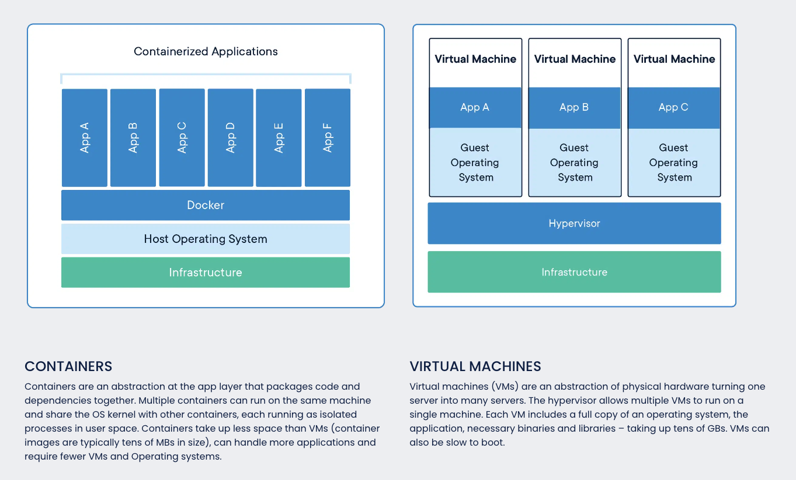

# Practice 3: Set up a three-tier web application using docker-compose.


Author: **Vo Minh Thien Long**
Deployed website: http://54.204.92.132:9333

----        
## Table of contents
[I. Requirement](#requirement)

[II. Prerequisites knowledge](#knowledge)
- [1. Docker](#docker)
- [2. Flask](#flask)
- [3. React](#react)
- [4. MongoDB](#mongodb)
- [5. Nginx](#nginx)

[III. Install Docker](#install)
- [1. Prerequisites system](#prerequisites-system)
- [2. Install Docker on Ubuntu](#install-ubuntu)
- [3. Executing the Docker command without `sudo`](#install-without-sudo)

[IV. Setting up our web application](#setting-up)
- [1. Build image for frontend by `Dockerfile`](#frontend-image)
- [2.  Build image for backend by `Dockerfile`](#backend-image)
- [3.  Create `docker-compose.yml` file](#create-docker-compose)
- [3.  Deployment](#deployment)

[V. References](#references)
---- 

## I. Requirements
<a name='requirement'></a>

Set up a **three-tier** web application that displays the course attendees’ information on the 
browser using `docker-compose`.

Base images:

- For Nginx web server: `nginx:1.22.0-alpine`

- For Python: `python:3.9`

- For MongoDB database: `mongo:5.0`


<div align="center">
  
</div>

<div align="center">
  <i>Homework for practice 3.</i>
</div>

## II. Prerequisites knowledge
<a name='knowledge'></a>

### 1. Docker
<a name='docker'></a>

#### 1.1. Overview

**Docker** is a set of **platform as a service** (_PaaS_) products that use OS-level 
virtualization to deliver software in packages called **containers**. The service 
has both _free_ and _premium_ tiers. The software that hosts the containers is called 
**Docker Engine**. It was first started in 2013 and is developed by **Docker, Inc**.

**Docker** makes development efficient and predictable. **Docker** takes away repetitive, 
mundane configuration tasks and is used throughout the development lifecycle for fast, 
easy and portable application development – desktop and cloud. **Docker**’s comprehensive 
end to end platform includes _UIs_, _CLIs_, _APIs_ and _security_ that are engineered to work 
together across the entire application delivery lifecycle.


<div align="center">
  
</div>

<div align="center">
  <i>Docker logo.</i>
</div>

**Docker** can package an application and its dependencies in a virtual container that can run 
on any _Linux_, _Windows_, or _macOS_ computer. When running on Linux, **Docker** uses the 
resource isolation features of the **Linux kernel** and a union-capable file system to allow c
ontainers to run within a single _Linux_ instance, avoiding the overhead of starting and 
maintaining virtual machines. 

**Note:** Docker on macOS uses a Linux virtual machine to run the containers.

<div align="center">
  
</div>

<div align="center">
  <i>Docker can use different interfaces to access virtualization features of the Linux kernel.</i>
</div>

#### 1.2. Docker architecture (components)

The Docker software as a service offering consists of three components:

- **Software**: 

  - The **Docker daemon**, called `dockerd`, is a persistent process that manages Docker containers 
and handles container objects. The daemon listens for requests sent via the Docker Engine API.
  
  - The **Docker client program**, called `docker`, provides a **command-line interface** (_CLI_), 
that allows users to interact with Docker daemons.


- **Objects**: Docker objects are various entities used to assemble an application in Docker. 
The main classes of Docker objects are **images**, **containers**, and **services**.

  - **Container** is a standardized, encapsulated environment that runs applications. 
A container is managed using the Docker API or CLI.
  
  - **Image** is a _read-only_ template used to build containers. 
Images are used to _store_ and _ship_ applications.
  
  - **Service** allows containers to be scaled across multiple Docker daemons. 
The result is known as a _swarm_, a set of cooperating daemons that communicate through the Docker API.


- **Registries**: A **Docker registry** is a repository for Docker images.


<div align="center">
  
</div>

<div align="center">
  <i>Docker architecture.</i>
</div>

#### 1.3. Containers and Images

> Today, all major cloud providers and leading open source serverless frameworks use our platform, and many are leveraging Docker for their container-native IaaS offerings.

**Containers** are **isolated** from one another and bundle their own software, libraries and
configuration files; they can communicate with each other through well-defined channels.
Because all of the containers share the services of _a single operating system kernel_,
they use **fewer resources** than virtual machines.

Because Docker containers are **lightweight**, a single server or virtual machine can run 
several containers _simultaneously_.

<div align="center">
  
</div>

<div align="center">
  <i>Containers vs Virtual machines.</i>
</div>


A **Docker image** is a file used to _execute code_ in a **Docker container**. **Docker images** act as a 
set of instructions to build a Docker container, like a template. **Docker images** also act 
as the starting point when using Docker. An image is comparable to a _snapshot_ in virtual 
machine environments.

#### 1.4. Docker registry

The **Registry** is a _stateless_, _highly scalable_ server side application that **stores** and 
lets you **distribute** Docker images. Docker clients connect to  registries to download 
(_pull_) images for use or upload (_push_) images that they have built. Registries can be 
_public_ or _private_. 

**Docker Hub** is the default registry where Docker looks for images. 
Docker registries also allow the creation of notifications based on events.


<div align="center">
  
</div>

<div align="center">
  <i>Docker Hub logo.</i>
</div>

#### 1.5. Dockerfile

Docker can build images automatically by reading the instructions from a `Dockerfile`. 
A `Dockerfile` is a text document that contains all the commands a user could call on the 
command line to assemble an image. Using `docker build` users can create an automated build 
that executes several command-line instructions in succession.

**Instructions**:

- `FROM` instruction:

  ```dockerfile
  FROM [--platform=<platform>] <image> [AS <name>]
  ```
  
  The `FROM` instruction initializes a new build stage and sets the **Base Image** for subsequent instructions.
  A _valid **Dockerfile**_ must start with a `FROM` instruction.


- `ARG` (argument) instruction:
  ```dockerfile
  ARG <name>[=<default value>]
  ```
  
  The `ARG` instruction defines a **variable** that users can pass at **build-time** to the builder with the docker build command using the 
`--build-arg <varname>=<value>` flag.


- `ENV` (environment) instruction:

  ```dockerfile
  ENV <key>=<value> ...
  ```

  The `ENV` instruction sets the **environment variable** `key` to the value `value`. This
value will be in the environment for all subsequent instructions in the build stage and can
be _replaced inline_ in many as well.


- `WORKDIR` (working directory) instruction:
  ```dockerfile
  WORKDIR /path/to/workdir
  ```
  
  The `WORKDIR` instruction sets the **working directory** for any `RUN`, `CMD`, `ENTRYPOINT`, 
`COPY` and `ADD` instructions that follow it in the **Dockerfile**. If the `WORKDIR` doesn’t exist, 
it will be created even if it’s not used in any subsequent Dockerfile instruction.

  The `WORKDIR` instruction can be used _multiple times_ in a Dockerfile. If a relative path is 
provided, it will be **relative** to the path of the previous `WORKDIR` instruction.

  
- `USER` instruction:

  ```dockerfile
  USER <user>[:<group>]
  ```
  
  or 
  
  ```dockerfile
  USER <UID>[:<GID>]
  ```
  
  The `USER` instruction sets the **user name** (or _UID_) and optionally the **user group** (or _GID_) 
to use when running the image and for any `RUN`, `CMD` and `ENTRYPOINT` instructions that follow it 
in the `Dockerfile`.


- `RUN` instruction: There 2 forms of `RUN`: _shell_ form and _exac_ form.
  
  The _shell_ form:
  ```dockerfile
  RUN <command>
  ```
  or the _exac_ form (**preferred**):
  ```dockerfile
  RUN ["executable", "param1", "param2"]
  ```

  The `RUN` instruction will **execute any commands** in a new layer on top of the current image and commit the results. 
The resulting committed image will be used _for the next step_ in the `Dockerfile`.

  **Note**: The _exec_ form is parsed as a JSON array, which means that you must use double-quotes `"`
around words not single-quotes `'`. Unlike the _shell_ form, the _exec_ form does not invoke a command shell.


- `ENTRYPOINT` instruction: `ENTRYPOINT` has 2 forms: _shell_ form and _exac_ form  (**preferred**).

  ```dockerfile
  ENTRYPOINT command param1 param2
  ```
  and
  ```dockerfile
  ENTRYPOINT ["executable", "param1", "param2"]
  ```

  An `ENTRYPOINT` allows you to configure a container that will run as an executable. 
Command line _arguments_ to `docker run <image>` will be _appended_ after all elements in 
an exec form `ENTRYPOINT`, and will override all elements specified using `CMD`. 
This allows **arguments to be passed** to the entry point.


- `CMD` instruction: The `CMD` instruction has three forms:

  _exec_ form, this is the **preferred** form
  ```dockerfile
  CMD ["executable","param1","param2"]
  ```
  
  as _default parameters_ to `ENTRYPOINT`
  ```dockerfile
  CMD ["param1","param2"]
  ```

  _shell_ form
  ```dockerfile
  CMD command param1 param2
  ```

  There can only be one `CMD` instruction in a `Dockerfile`. 

  The main purpose of a CMD is to **provide defaults for an executing container**. These defaults 
can include an executable, or they can omit the executable, in which case you must specify an `ENTRYPOINT` instruction as well.


**Note**:

- `ARG` vs `ENV`: 
  - `ENV` is for future running containers. 
  - `ARG` for building your Docker image. 
  - We can’t change `ENV` directly during the build.


  <div align="center">
    
  </div>
  
  <div align="center">
    <i>ARG vs ENV.</i>
  </div>
  
- `COPY` vs `ADD`: `COPY` is same as `ADD`, but without the **tar** and **remote URL** handling.

  - `COPY` doesn't support `src` with URL scheme.
  - `COPY` doesn't unpack compression file.
  - `COPY` support to overwrite build context by `--from` argument.

  A valid use case for `ADD` is when you want to **extract a local tar file** into a specific directory in your Docker image.
If you’re **copying in local files** to your Docker image, always use `COPY` because it’s more explicit.


  <div align="center">
    
  </div>

  <div align="center">
    <i>ARG vs ENV.</i>
  </div>

- `CMD` vs `ENTRYPOINT`: Any **Docker image** must have an `ENTRYPOINT` or `CMD` declaration for a container to start.

  - `CMD` sets default parameters that can be **overridden** from the Docker **CLI** 
when a container is running.
  
  - The best way to use a `CMD` instruction is by specifying default programs that should run when 
users do not **input arguments** in the command line.
  
  - `ENTRYPOINT` is efault parameters that **cannot be overridden** when Docker containers run with 
**CLI** parameters.
  
  - Use `ENTRYPOINT` instructions when building an executable Docker image using commands that **always need to be executed**.

  We can use `CMD` and `ENTRYPOINT` together when we  automate container startup tasks. 
In such a case, the `ENTRYPOINT` instruction can be used to define the **executable** while using `CMD` to define **parameters**.

#### 1.6. Docker compose

**Compose** is a tool for **defining** and **running** _multi-container_ Docker applications. 
With Compose, you use a `YAML` file to configure your application’s services. Then, with 
a single command, you _create_ and _start all_ the services from your configuration.

- Defines and runs **multi-container** applications.
- Manages all containers using a single `docker-compose.yml` file.
- Manages volumes & networks automatically.
- Preserve volume data when containers are created.
- Only recreate containers that have changed
- Variables and moving a composition between environments.

Three-step process of using **Compose**:

1. Define your app’s **environment** with a `Dockerfile` so it can be reproduced anywhere.

2. Define the **services** that make up your app in `docker-compose.yml` so they can be run
together in _an isolated environment_.

3. Run `docker compose up` (or `docker-compose up`) and the **Docker compose command** starts and runs your entire app.

A `docker-compose.yml` looks like this:

```yaml
version: "3.9"  # optional since v1.27.0
services:
  web:
    build: .
    ports:
      - "8000:5000"
    volumes:
      - .:/code
      - logvolume01:/var/log
    links:
      - redis
  redis:
    image: redis
volumes:
  logvolume01: {}
```

### 2. Flask
<a name='flask'></a>

**Flask** is a _micro web framework_ written in **Python**. It **does not require** particular 
_tools_ or _libraries_, and **has no** database abstraction layer, form validation, 
or any other components where pre-existing third-party libraries provide common functions. 

However, **Flask** supports extensions that can add application features. Extensions exist for 
object-relational mappers, form validation, upload handling, 
various open authentication technologies and several common framework related tools.

In this practice, I use **Flask** as a _Backend server_ for **Logic Tier**.

<div align="center">
  
</div>

<div align="center">
  <i>Flask logo.</i>
</div>

### 3. ReactJs
<a name='react-js'></a>

**React** is a _free_ and _open-source_ **front-end JavaScript library** for building user interfaces 
based on UI components. It is maintained by Meta and a community of individual developers and 
companies. 

**React** can be used as a base in the development of _single-page_, _mobile_, 
or _server-rendered_ applications with frameworks. However, **React** is only 
concerned with state management and rendering that state to the `DOM`, so creating **React** 
applications usually requires the use of additional libraries for routing, as well as certain
_client-side_ functionality.

In this practice, I use **React** as a _Frontend UI_ for **Presentation Tier**.

<div align="center">
  
</div>

<div align="center">
  <i>React logo.</i>
</div>

### 4. MongoDB
<a name='mongodb'></a>

MongoDB is a _source-available_, _cross-platform_ **document-oriented database** program. 
Classified as a **NoSQL** database program, MongoDB uses **JSON-like** documents with optional 
schemas. 

MongoDB is developed by MongoDB Inc. and licensed under the 
**Server Side Public License** (_SSPL_).

In this practice, I use **React** as a _Datbase_ for **Data Tier**.

<div align="center">
  
</div>

<div align="center">
  <i>MongoDB logo.</i>
</div>

### 4. Nginx
<a name='nginx'></a>

Nginx (pronounced **engine X**) is a web server that can also be used as a **reverse proxy**, 
**load balancer**, **mail proxy** and **HTTP cache**. The software was created by **Igor Sysoev** and publicly released in **2004**. 

**Nginx** is _free_ and _open-source_ software, released under the terms of the _2-clause BSD license_. 
A large fraction of web servers use **Nginx**, often as a load balancer. 

In this practice, I use **Nginx** to serve web content (by **React**).


<div align="center">
  
</div>

<div align="center">
  <i>Nginx logo.</i>
</div>

## III. Install Docker
<a name='install'></a>

### 1. Prerequisites system
<a name='prerequisites-system'></a>

In this practice, I use Ubuntu `20.04` (LTS version **Focal**) in my virtual machine. 
You can check my [Practice 1](https://github.com/vietstacker/Viettel-Digital-Talent-Program-2022/tree/main/Practice-1/Vo-Minh-Thien-Long/Ubuntu-Virtual-Machine) 
to know how to create a virtual machine by **Parallels Desktop** for device with chip `ARM64`.

<div align="center">
  
</div>

<div align="center">
  <i>My system using in this practice.</i>
</div>


### 2. Install Docker on Ubuntu
<a name='install-macos'></a>

We will install Docker from the official **Docker repository**, to ensure that we get the 
latest version. The reason is that Docker in **Ubuntu repository** may not be the latest.

First, update your existing list of packages by using `apt update`:

```shell
sudo apt update
```

Then we will install prerequisite packages which let `apt` use packages over **HTTPS**:

```shell
sudo apt install apt-transport-https ca-certificates curl software-properties-common
```

The **Docker GPG key** is added to verify the download, the official **Docker repository** 
is added as a new package source.

```shell
curl -fsSL https://download.docker.com/linux/ubuntu/gpg | sudo apt-key add -
```

Add the **Docker repository** to **APT sources**. Because I use **Ubuntu** `20.04` - **Ubuntu Focal** in
a machine using M1 chip (**ARM64** architecture), so I set `arch=arm64` and choose the 
stable version `focal focal`.

```shell
sudo add-apt-repository "deb [arch=arm64] https://download.docker.com/linux/ubuntu focal stable"
```

This will also update our package database with the Docker packages from the newly added repository. 

Make sure you are about to install from the Docker repository instead of the default Ubuntu repository:

```shell
apt-cache policy docker-ce
```

You’ll see output like this (Notice that `docker-ce` is **not installed**).

<div align="center">
  
</div>

<div align="center">
  <i>Homework for practice 3.</i>
</div>

Finally, install Docker:

```shell
sudo apt install docker-ce
```

Docker should now be installed, the daemon started, and the process enabled to start on boot. 
Check that it’s running:

```shell
sudo systemctl status docker
```

The output should be similar to the following:


<div align="center">
  
</div>

<div align="center">
  <i>Check Docker service is active or not.</i>
</div>

### 3. Executing the Docker command without `sudo`
<a name='install-without-sudo'></a>

By default, the `docker` command can only be run the root user or by a **user** in the **docker** group,
which is automatically created during Docker’s installation process. If you want to avoid typing `sudo` 
whenever you run the `docker` command, following these steps:

First, add your username to the `docker` group:

```shell
sudo usermod -aG docker ${USER}
```

To apply the new group membership, use `su` and enter your password:

```shell
su - ${USER}
```

Confirm that we are now added to the `docker` group by typing:

```shell
groups
```

<div align="center">
  
</div>

<div align="center">
  <i>Check is user already added to docker group.</i>
</div>

Finally, try to run `docker` by running image `hello-world`:

```shell
docker run hello-world
```

<div align="center">
  
</div>

<div align="center">
  <i>Our docker is running image hello-world.</i>
</div>

### 4. Install Docker Compose on Ubuntu

We will download **Docker Compose** from its [official Github repository](https://github.com/docker/compose),
to make sure we will get the most _updated version_. 

The latest version is `2.6.0`, so we will download `1.29.2` release and save the executable 
file at `/usr/local/bin/docker-compose`, which will make this software globally accessible as 
`docker-compose`:

```shell
sudo curl -L "https://github.com/docker/compose/releases/download/1.29.2/docker-compose-$(uname -s)-$(uname -m)" -o /usr/local/bin/docker-compose
```

Next, set the permission to `execute` so that the `docker-compose` command is executable:

```shell
sudo chmod +x /usr/local/bin/docker-compose
```

Finally, check our installation by using `docker-compose --version`:

```shell
docker-compose --version
```

<div align="center">
  
</div>

<div align="center">
  <i>Check our installation of docker-compose.</i>
</div>

## IV. Setting up our web application

<a name='setting-up'></a>

### 1. Build image for frontend by `Dockerfile`

<a name='frontend-image'></a>

Before _multi-stage_ builds, we have to create multiple `Dockerfile` for each layer of the image.
However, it is not a best practice to maintain more than one `Dockerfile`. Thanks to _multi-stage_ builds, we can use multiple `FROM` statements in your Dockerfile. 
Each `FROM` instruction can use a different base, and each of them begins a new stage of the build. 

We will use _multi-stage_ build to first build our **React** production application (**build**),
and then use **Nginx** as a webserver for hosting it.

Here is the configuration file `nginx.conf` for **Nginx** web server. This is not the practice's
topic, so I will not deeply explain it here, but basically, I will set up a host server list to 
port `9333`  with content from `/usr/share/nginx/html`.

```text
server {
    listen       9333;
    server_name  localhost;

    location / {
        root   /usr/share/nginx/html;
        index  index.html index.htm;
        try_files $uri /index.html;
    }

    location = /50x.html {
        root   /usr/share/nginx/html;
    }
}
```

First, we will use image `node:18.2.0-alpine` as a base image, and set it as `react-build` for
later use. Image `node:18.2.0-alpine` is a **Docker official image**, using as a JavaScript-based platform
for server-side and networking application.

**Docker official image** are a curated set of Docker repositories hosted on Docker Hub, designed
to provide best practices, documentation and security.

```dockerfile
FROM node:18.2.0-alpine AS react-build
```

Then, set our **working directory** at `/usr/src/app` by using instruction `WORKDIR`. Now, all of our action in the **container**
will be taken place in there.

```dockerfile
WORKDIR /usr/src/app/
```

Use instruction `COPY` to copy all of our source code to the current directory (`/usr/src/app`).

```dockerfile
COPY . .
```

`yarn` is package manager for the **Node.js** JavaScript runtime environment. In this practice 
I use it to manipulate our packages and libraries.

We now run command `yarn` to install all the required package for our application (which are 
stored in `package.json`). We use `RUN` here because we only want to run the intermediate command 
here.

```dockerfile
RUN yarn
```

Then we will build the application using `yarn build` (I have indicated in `package.json` that
this is equivalent with `react-scripts build`).

```dockerfile
RUN yarn build
```

First, we will use image `nginx:1.22.0-alpine` as an image to deploy web server by **Nginx**. It is also a 
**Docker official image**.

```dockerfile
FROM nginx:1.22.0-alpine
```

Then copy our configuration file `nginx.conf` to `/etc/nginx/conf.d/default.conf`. 

```dockerfile
COPY ./nginx.conf /etc/nginx/conf.d/default.conf
```

And copy our **build** application from `react-build` to `/usr/share/nginx/html`.

```dockerfile
COPY --from=react-build /usr/src/app/build /usr/share/nginx/html
```

The `EXPOSE` instruction informs the container listens on the specified _network ports_ 
at runtime (but it **does not** actually publish the port). In here we will use port `9333`
for our **Nginx**.

```dockerfile
EXPOSE 9333
```

Finally, we will use `CMD` to start our **Nginx** service. As from the official document 
of **Nginx** image on DockerHub:

> If you add a custom CMD in the Dockerfile, be sure to include `-g daemon off;` 
> in the CMD in order for nginx to stay in the foreground, so that Docker can track 
> the process properly (otherwise your container will stop immediately after starting)!

So in this last step, we will add:

```dockerfile
CMD ["nginx", "-g", "daemon off;"]
```

And here is our final `frontend/Dockerfile`:

```dockerfile
FROM node:18.2.0-alpine AS react-build
WORKDIR /usr/src/app/
COPY . .
RUN yarn
RUN yarn build

FROM nginx:1.22.0-alpine
COPY ./nginx.conf /etc/nginx/conf.d/default.conf
COPY --from=react-build /usr/src/app/build /usr/share/nginx/html
EXPOSE 9333
CMD ["nginx", "-g", "daemon off;"]
```

### 2. Build image for backend by `Dockerfile`

<a name='backend-image'></a>

We will use image `python:3.9` here.  It is also a **Docker official image**.

```dockerfile
FROM python:3.9
```

Then we set the working directory to `/usr/src/app/`.

```dockerfile
WORKDIR /usr/src/app/
```

Copy all the source code to the current working directory.

```dockerfile
COPY . .
```

Upgrade `pip` to the latest version.

```dockerfile
RUN pip install --upgrade pip
```

Install all the _required_ **packages** and **libraries** from `requirements.txt`.
The `requirement.txt` file is used for specifying what Python packages
are _required_ to run the project. 

```dockerfile
RUN pip install -r requirements.txt
```

So in this last step, we will use `CMD` to execute our application.
To run the application, use the flask command or `python -m flask`:

```dockerfile
CMD ["python3", "-m", "flask", "run", "--host=0.0.0.0"]
```

Here is our final `backend/Dockerfile`:

```dockerfile
FROM python:3.9
WORKDIR /usr/src/app/
COPY . .
RUN pip install --upgrade pip
RUN pip install -r requirements.txt
CMD ["python3", "-m", "flask", "run", "--host=0.0.0.0"]
```

### 3. Create `docker-compose.yml` file
<a name='create-docker-compose'></a>

First, we indicate our `docker-compose.yml` version. In this practice I will use the latest 
version `3.9`

```yaml
version: '3.9'
```

Then we will have 3 services:

#### 3.1. `react` service

We set the context to build in `frontend` directory (where has our `Dockerfile` and source code),
and our `container_name` is `presentation_tier`.

```yaml
build: frontend
container_name: presentation_tier
```

Then we will set the `restart` policy as `unless-stopped`. This policy means Docker **allways** restart the 
container if it stops, except that when the container is stopped (manually or otherwise), it is **not restarted** 
even after **Docker daemon** restarts.

```yaml
restart: unless-stopped
```

Choose the host port and container port `9333`.

```yaml
ports:
  - "9333:9333"
```

Finally, link it to the `flask` service, which we will define later.

```yaml
links:
  - flask
```

#### 3.2. `flask` service

We set the context to build in `backend` directory and the container name as `logic_tier`.

```yaml
build: backend
container_name: logic_tier
```

Then we will set the `restart` policy as `unless-stopped`.

```yaml
restart: unless-stopped
```

Choose the host port and container port `5000`.

```yaml
ports:
  - "5000:5000"
```

Set the environment variable `FLASK_APP` is the path to our `app.py` file.

```yaml
environment:
  - FLASK_APP=backend/app
```

Finally, link it to the `mongodb` service.

```yaml
links:
  - mongodb
```

#### 3.2. `mongdodb` service

We will use the base image `mongo:5.0` here and set the container name as `data_tier`.
The image `mongo:5.0` is also a Docker Official Images.

```yaml
image: mongo:5.0
container_name: data_tier
```

Then we will set the `restart` policy as `unless-stopped`.

```yaml
restart: unless-stopped
```

Set our `hostname` of the service to `mongodb` for connection between **logic tier** and
**data tier**.

```yaml
hostname: mongodb
```

Set the environment variable `MONGO_INITDB_DATABASE` for our database's name, `MONGO_INITDB_ROOT_USERNAME`
for **root user**'s username and `MONGO_INITDB_ROOT_PASSWORD` for password.

```yaml
environment:
  - MONGO_INITDB_DATABASE=vdt2022
  - MONGO_INITDB_ROOT_USERNAME=practice3
  - MONGO_INITDB_ROOT_PASSWORD=practice3
```

Finally, set the host port and container port to `27017`.

```yaml
ports:
  - "27017:27017"
```

#### 3.4. Our final `docker-compose.yml`

Here is our final `docker-compose.yml`:

```yml
version: '3.9'

services:
  react:
    build: frontend
    container_name: presentation_tier
    restart: unless-stopped
    ports:
      - "9333:9333"
    links:
      - flask

  flask:
    build: backend
    container_name: logic_tier
    restart: unless-stopped
    environment:
      - FLASK_APP=backend/app
    ports:
      - "5000:5000"
    links:
      - mongodb

  mongodb:
    image: mongo:5.0
    container_name: data_tier
    restart: unless-stopped
    hostname: mongodb
    environment:
      - MONGO_INITDB_DATABASE=vdt2022
      - MONGO_INITDB_ROOT_USERNAME=practice3
      - MONGO_INITDB_ROOT_PASSWORD=practice3
    ports:
      - "27017:27017"
```

### 4. Deployment

<a name='deployment'></a>

After install it from GitHub, create a `.env` file in `frontend` directory based on `.env_example`.
Our you can use `cp frontend/.env_example frontend/.env`.

Our `frontend/.env` content:

```text
REACT_APP_BACKEND_URL=http://localhost:5000
```

Then build our container with `docker-compose build`.

```shell
docker-compose build
```

Finally, start containerized environment in background mode (with `-d` option):

```shell
docker-compose up -d
```

Our environment is now up and running in the background. To verify that the container is active,
we can run:

```shell
docker-compose ps
```

<div align="center">
  
</div>

<div align="center">
  <i>Our running containers.</i>
</div>

And our deployed project will run at [http://localhost:9333](http://localhost:9333).


<div align="center">
  
</div>

<div align="center">
  <i>Our final result.</i>
</div>

I also use EC2 to deploy the project [here](http://54.204.92.132:9333/dashboard/app).
You can check my previous Practice to know how to init and launch an EC2 instance.

## V. References

[1] [Docker in Wikipedia](https://en.wikipedia.org/wiki/Docker_(software))

[2] [Docker website](https://www.docker.com/)

[3] [Docker documentations](https://docs.docker.com/)

[4] [Docker ARG vs ENV](https://vsupalov.com/docker-arg-vs-env/)

[5] [Docker CMD vs ENTRYPOINT](https://www.bmc.com/blogs/docker-cmd-vs-entrypoint/#:~:text=CMD%20vs%20ENTRYPOINT%3A%20Fundamental%20differences&text=CMD%20commands%20are%20ignored%20by,as%20arguments%20of%20the%20command.)

[6] [Flask in Wikipedia](https://en.wikipedia.org/wiki/Flask_(web_framework))

[7] [React in Wikipedia](https://en.wikipedia.org/wiki/React_(JavaScript_library))

[8] [MongoDB in Wikipedia](https://en.wikipedia.org/wiki/MongoDB)

[9] [Nginx in Wikipedia](https://en.wikipedia.org/wiki/Nginx)

[10] [Install Docker in Ubuntu 20.04](https://www.digitalocean.com/community/tutorials/how-to-install-and-use-docker-on-ubuntu-20-04)

[11] [Install Docker Compose in Ubuntu 20.04](https://www.digitalocean.com/community/tutorials/how-to-install-and-use-docker-compose-on-ubuntu-20-04)
