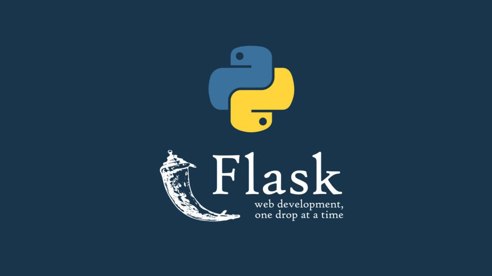
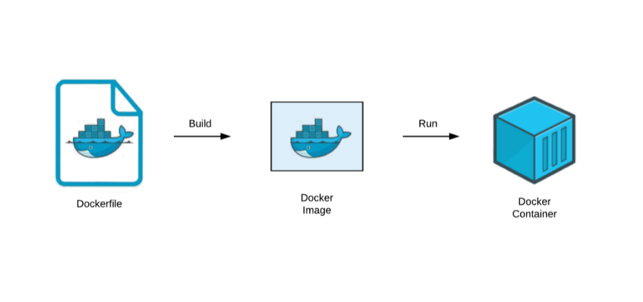
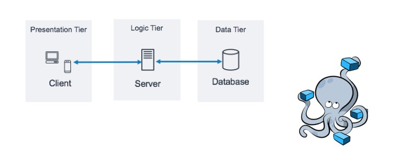
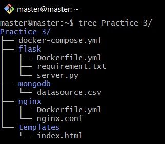

# **Practice 3: Docker and  Docker Compose to build three-tier web application**


## **I.Introduction**

- Là một khuôn khổ web vi mô được xây dựng trên Python,` Flask `cung cấp một cách có thể mở rộng cho các nhà phát triển để phát triển ứng dụng của họ thông qua các phần mở rộng có thể được tích hợp vào các dự án.



- `MongoDB` là một cơ sở dữ liệu `NoSQL` được thiết kế để mở rộng quy mô và hoạt động với những thay đổi thường xuyên.


- Các nhà phát triển có thể sử dụng `Docker` để đơn giản hóa quá trình đóng gói và triển khai ứng dụng.



- `Docker Compose` đã đơn giản hóa hơn nữa môi trường phát triển bằng cách cho phép bạn xác định cơ sở hạ tầng của mình, bao gồm các dịch vụ ứng dụng, network và các liên kết gắn kết trong một tệp duy nhất. Sử dụng `Docker Compose` cung cấp khả năng dễ sử dụng hơn khi chạy nhiều lệnh chạy `docker container`. Nó cho phép bạn xác định tất cả các dịch vụ của mình trong một tệp Soạn duy nhất và với một lệnh duy nhất, bạn tạo và khởi động tất cả các dịch vụ từ cấu hình của mình. Điều này đảm bảo rằng có quyền kiểm soát phiên bản trong toàn bộ cơ sở hạ tầng vùng chứa của bạn. `Docker Compose` sử dụng tên dự án để cách ly các môi trường với nhau, điều này cho phép bạn chạy nhiều môi trường trên một máy chủ duy nhất.

### **Docker file**
#### Dockerfile instructions
### *Question 1*
**What are differences between:**
- `ARG` vs `ENV` :
   

   - `ARG` được dùng để xây dựng Docker image

   - `ARG` không khả dụng sau khi image đã được build . Một container đang chạy sẽ không có quyền truy cập vào giá trị biến ARG.
   - `ENV` được dùng để chạy các containers
   - `ENV` chủ yếu nhằm cung cấp các giá trị mặc định cho các biến môi trường sẽ được chạy.các dockerized app khi chạy có thể truy cập các biến môi trường đó .
- `COPY` vs `ADD` :Mặc dù `ADD` và `COPY` giống nhau về chức năng, nhưng nói chung, `COPY` được ưu tiên hơn. Đó là vì nó rõ ràng hơn `ADD`
  - `COPY`: Hỗ trợ cơ bản sao chép file từ các localfile vào trong container
  - `ADD`: Có thêm đặc điểm hỗ trợ nạp các gói trên URL
- `CMD` vs `ENTRYPOINT` :
  - `CMD` : Chạy các sorfware được chứa trong image với các argument. trong nhiều trường hợp CMD chạy các lệnh môi trường
  - `ENTRYPOINT` :Chạy lệnh chính của image


## **II.Set up a three-tier web application**

### *Practice: Set up a three-tier web application that displays the course attendees’ information on the browser using docker-compose*



### **Base images**:
- nginx:1.22.0-alpine
- python:3.9
- mongo:5.0
### **File Structure**



### **Step by step** 
### **Step 1 - Viết cấu hình file docker-compose.yml**

> Tạo thư mục chứa project và tạo file docker-compose.yml

```
mkdir Practice-3
cd Practice-3
vim docker-compose.yml
```
> file docker-compose.yml
 ```
 version: '3.3'

services:
  web:
    build:
      context: nginx
      dockerfile: Dockerfile.yml
    ports:
      - 80:80
    depends_on:
      - backend
  backend:
    build: 
      context: flask
      dockerfile: Dockerfile.yml
    environment:
      MONGODB_DATABASE: flaskdb
      MONGODB_USERNAME: flaskuser
      MONGODB_PASSWORD: mongodb_password
      MONGODB_HOSTNAME: mongodb
    port: 
    - 5000:5000
    depends_on:
      -  mongo  
  mongo:
    image: mongo:5.0
    container_name: mongodb
    environment:
      MONGO_INITDB_ROOT_USERNAME: mongodbuser
      MONGO_INITDB_ROOT_PASSWORD: mongodb_password
    ports:
    - 27017:27017
 ```

 ### **Step 2 - Viết Dockerfile của Flask**

 >Tạo file Flask và Dockerfile 

 ```
 mkdir flask
 vim flask/Dockerfile.yml
 ```
 >file Dockerfile.yml

 ```
 FROM python:3.9

WORKDIR /src
COPY ./requirement.txt /src/requirements.txt
RUN pip install -r requirement.txt --no-cache-dir

EXPOSE 5000
CMD ["python","0.0.0.0:5000","./server.py"]
 ```

### **Step 3 - Viết Dockerfile của Nginx và cấu hình Nginx server** 

> Tạo file nginx và Dockerfile.yml

```
mkdir nginx
vim nginx/Dockerfile
```
> file Dockerfile

```
FROM nginx:1.22.0-alpine
    
WORKDIR /src
    
RUN rm -rf ./*
    
EXPOSE 80

ENTRYPOINT [ "nginx", "-g", "daemon off;" ]


```

> configuring nginx server 
 ```
 vim nginx/nginx.conf
 ```
> nginx.conf
 ```
 upstream nginx_sever {
  server flask:5000;
}
server {
  listen 80;
  location / {
    proxy_pass http://nginx_server;
  }
}
 ```

 ### **Step 4 - Tạo flask application to GET data from DB và hiển thị trên templates**

> tạo file requirement.txt chứa các thư viện cần cài đặt cho app

```
vim flask/requirement.txt
```
> flask/requirement.txt

```
pymongo
flask
request
```

> tạo file application server.py
```
vim flask/server.py
```

```
import os
from flask import Flask, request, jsonify
from flask_pymongo import PyMongo

application = Flask(__name__)

application.config["MONGO_URI"] = 'mongodb://' + os.environ['MONGODB_USERNAME'] + ':' + os.environ['MONGODB_PASSWORD'] + '@' + os.environ['MONGODB_HOSTNAME'] + ':27017/' + os.environ['MONGODB_DATABASE']

mongo = PyMongo(application)
db = mongo.db


@app.route('/', methods = ['GET'])
def index():
    students = db.students.find()

    item = {}
    data = []
    for student in students:
        item = {
            'id': str(student['_id']),
            'num': str(student['num']),
            'name': str(student['name']),
            'year': str(student['year']),
            'university': str(student['university']),
            'major': str(student['major'])
        }
        data.append(item)

    return jsonify(
        status=True,
        data
    )

@app.route('/', methods=('GET', 'POST'))
def all():
    return render_template('index.html')


if __name__ == "__main__":
    app.run(host='0.0.0.0', port=5000, debug=ENVIRONMENT_DEBUG)
```

### **Step 5 - Build và chạy Containers**
> run command to build images cho application
```
docker-compose up -d
```
> list các containers đang chạy
```
docker ps
```

### **Step 6 - Configuring MongoDB Database**
> lưu định dạng file excel dưới dạng file `.csv`

> khởi tạo DB 
```
docker exec -it mongodb bash
```
> import data từ file csv vào DB
```
mongoimport --type csv -d students -c students --headerline datasource.csv
```

### **Step 7 - Run**
>chạy ứng dụng trong trình duyệt theo đường dẫn 
 ```
 http://localhost:5000
 ```

 ## **III.REFERENCE**

- **https://www.digitalocean.com/community/tutorials/how-to-set-up-flask-with-mongodb-and-docker**

- **https://github.com/docker/awesome-compose/tree/master/nginx-flask-mongo**

- **https://docs.docker.com/develop/develop-images/dockerfile_best-practices/**