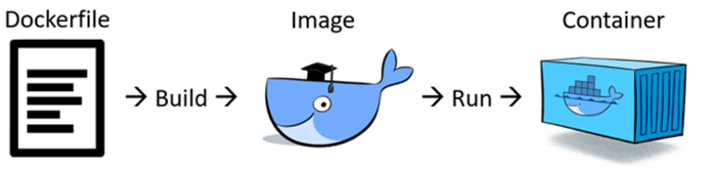
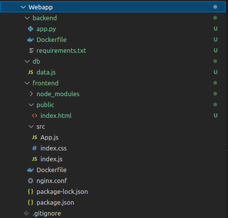
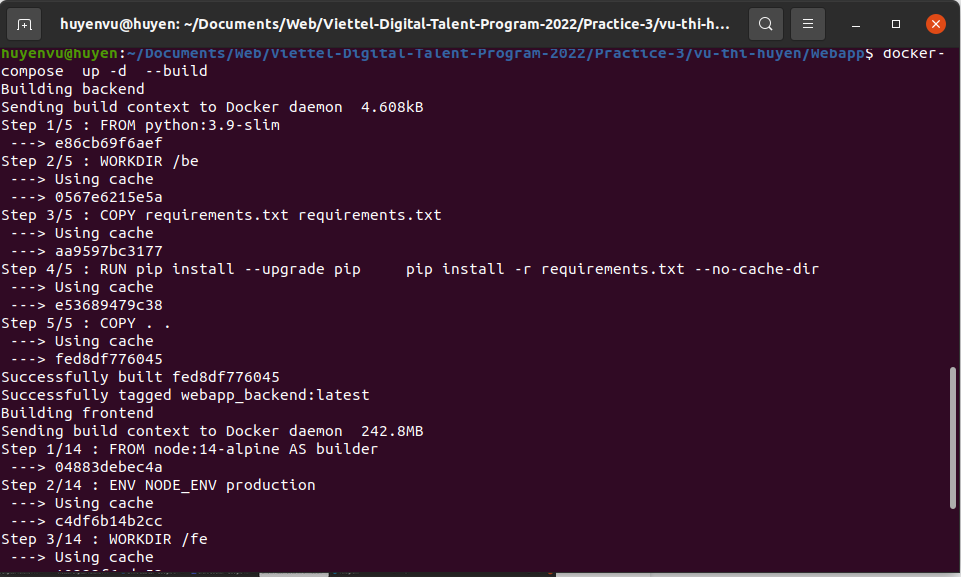
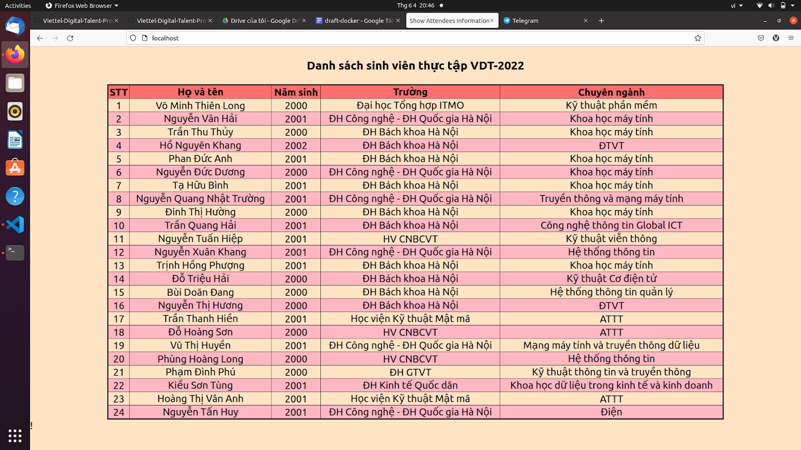

# **Sử dụng Docker-compose xây dựng three-tier website**

## **1. Docker**

### *Docker là gì?*


* Docker là một nền tảng để cung cấp cách để building, deploying và running ứng dụng dễ dàng hơn bằng cách sử dụng các containers (trên nền tảng ảo hóa) - "Build once, run anywhere". 

* Sự khác biệt giữa Docker và Virtual Machine
    - **Docker** : Dùng chung kernel, chạy độc lập trên Host OS và có thể chạy trên bất kì hệ điều hành nào cũng như cloud. Khởi động và làm cho ứng dụng sẵn sàng chạy trong 500ms, mang lại tính khả thi cao cho những dự án cần sự mở rộng nhanh.
    - **Virtual Machine** : Cần thêm một Guest OS cho nên sẽ tốn tài nguyên hơn và làm chậm máy thật khi sử dụng. Thời gian khởi động trung bình là 20s có thể lên đến hàng phút, thay đổi phụ thuộc vào tốc độ của ổ đĩa.

### *Một số khái niệm trong Docker* 



* *Dockerfile*

    `Dockerfile` là một file mô tả ứng dụng, nó chứa các chỉ thị để nói cho docker cách để xây dựng một image. 

    Cú pháp các chỉ thị: 

    ```
    INSTRUCTION arguments
    ```

    * `FROM`

        Là chỉ thị bắt buộc và phải đặt trên cùng `Dockerfile`.

        Chỉ định rằng image nào sẽ được dùng làm image cơ sở để quá trình build image thực thiện các câu lệnh tiếp theo.

    * `EXPOSE` 
        
        Thiết lập cổng mà container lắng nghe, cho phép các container khác trên cùng mạng liên lạc qua cổng này hoặc ánh xạ cổng host vào cổng này.

    * `WORKDIR`

        Thiết lập thư mục làm việc trong container cho các lệnh COPY, ADD, RUN, CMD, và ENTRYPOINT

    * `COPY` và `ADD`

        Chỉ thị `ADD` sẽ copy file, thư mục từ vị trí thư mục đang build trên local client hoặc remote files URL và thêm chúng vào filesystem của image. 
        
        `COPY` cũng giống như `ADD` nhưng không hỗ trợ download các remote file URL từ nguồn web.

    * `RUN`, `CMD` và `ENTRYPOINT`

        Đều dùng để chỉ định và thực thi các lệnh:

        * `RUN` thực thi các lệnh command line và một layer mới. Ví dụ: thường được sử dụng để cài đặt các gói phần mềm.
        * `CMD` thực hiện lệnh mặc định khi chúng ta khởi tạo container từ image, lệnh mặc định này có thể được ghi đè từ dòng lệnh khi khởi tại container.
        * `ENTRYPOINT` khá giống `CMD` đều dùng để chạy khi khởi tạo container, nhưng `ENTRYPOINT` không thể ghi đè từ dòng lệnh khi khi khởi tại container.

    * `ARG` VÀ `ENV`

        `ARG` còn được gọi là biến build-time(chỉ hoạt động trong quá trình build images). Chúng chỉ khả dụng kể từ thời điểm chúng được 'công bố' trong Dockerfile trong câu lệnh `ARG` cho đến khi image được tạo.

        Các biến `ENV` cũng có sẵn trong quá trình xây dựng, ngay khi bạn khai báo chúng với một command của `ENV`. Tuy nhiên, không giống như `ARG`, khi build xong image, các container chạy image có thể truy cập giá trị `ENV` này. Các container chạy từ image có thể ghi đè giá trị của `ENV`.

    * ...
    
* *Docker image*

    Image trong docker còn được gọi là mirror, nó là 1 đơn vị đóng gói chứa mọi thứ cần thiết để 1 ứng dụng chạy. 

    Một image được build dựa trên các chỉ dẫn trong `Dockerfile`, sau đó image lại trở thành một khuôn mẫu để tạo một container. Thường thì image sẽ dựa trên 1 image có sẵn với những tùy chỉnh thêm.

    Image được tạo thành từ nhiều layer xếp chồng lên nhau, bên trong image là 1 hệ điều hành bị cắt giảm và tất cả các phụ thuộc cần thiết để chạy 1 ứng dụng.


* *Docker container*

    Là một instance của một image. Mỗi container bao gồm mọi thứ cần thiết để chạy được nó: code, runtime, system tools, system libraries, setting. Mỗi container như 1 hệ điều hành thực sự, bên trong mỗi container sẽ chạy 1 ứng dụng. Bạn có thể create, start, stop, move hoặc delete container dựa trên Docker API hoặc Docker CLI.

* *Registry*

    Docker Registry là nơi lưu trữ các image với hai chế độ là private và public, là nơi cho phép chia sẻ các image template để sử dụng trong quá trình làm việc với Docker.

* *Quá trình đưa 1 ứng dụng chạy trong container*

    1. Đầu tiên ta bắt đầu với code app và các phụ thuộc của nó
    2. Tạo Dockerfile mô tả ứng dụng, các phụ thuộc và cách chạy ứng dụng đó
    3. Build Dockerfile thành image
    4. Push image mới build vào registry(option)
    5. Chạy container từ image

### *Cài đặt và bắt đầu với Docker*

* Cài đặt Docker trên Ubuntu

    * Update `apt` và cài đặt các packages cho phép `apt` sử dụng repositories qua HTTPS:

        ```
        $ sudo apt-get update
        $ sudo apt-get install \
        ca-certificates \
        curl \
        gnupg \
        lsb-release
        ```
    * Thêm Docker’s official GPG key

        ```
        sudo mkdir -p /etc/apt/keyrings
        curl -fsSL https://download.docker.com/linux/ubuntu/gpg | sudo gpg --dearmor -o /etc/apt/keyrings/docker.gpg
        ```
    * Set up repository

        ```
        echo \
        "deb [arch=$(dpkg --print-architecture) signed-by=/etc/apt/keyrings/docker.gpg] https://download.docker.com/linux/ubuntu \
        $(lsb_release -cs) stable" | sudo tee /etc/apt/sources.list.d/docker.list > /dev/null
        ```
    
    * Cài Docker engine

        ```
        $ sudo apt-get update
        $ sudo apt-get install docker-ce docker-ce-cli containerd.io docker-compose-plugin
        ```

    * Kiểm tra trạng thái

        ```
        $ sudo systemctl status docker
        ```

* Xem thêm [Run docker without sudo](https://docs.docker.com/engine/install/linux-postinstall/)

### *Docker Compose*

Docker Compose là một công cụ dùng để định nghĩa và chạy các chương trình Docker sử dụng nhiều container (multi-container). Với Docker Compose, chúng ta sử dụng một file `YAML` để thiết lập các service cần thiết cho chương trình. Cuối cùng, với một câu lệnh, chúng ta sẽ create và start tất cả service từ các thiết lập đó.

* Compose có những câu lệnh cho phép quản lí lifecycle của chương trình:

    * Start, stop và build lại service.
    * Xem status của các service đang chạy.
    * Xem log output của service đang chạy.

* Các bước sử dụng `docker-compose`

    1. Khai báo các môi trường của chương trình trong Dockerfile.

    2. Khai báo các service cần thiết cho chương trình trong file docker-compose.yml để các service có thể chạy cùng với nhau trong một môi trường.

    3. Chạy câu lệnh docker-compose up để start Compose và chạy chương trình.


## **3. Thực hành: xây dựng website**

Set up a three-tier web application that displays the course attendees’ information on the browser using docker-compose.

* Base images:

    * nginx:1.22.0-alpine
    * python:3.9
    * mongo:5.0

* Khởi tạo dự án

    

* Chạy lệnh 'docker-compose up --build -d`

    

* Kiểm tra lại tại [http:localhost:80](http:localhost:80)

    

