# Sử dụng Ansible, Docker để deploy Prometheus, Exporter, Alertmanager, Grafana


Author: **Bùi Doãn Đang**


## I. Các kiến thức cơ bản 
### 1. Prometheus

**Prometheus** là một bộ công cụ giám sát và cảnh báo hệ thống mã nguồn mở ban đầu được xây dựng bởi công ty SoundCloud. Kể từ khi thành lập vào năm 2012, nhiều công ty và tổ chức đã áp dụng Prometheus vào hệ thống và dự án này có một cộng đồng người dùng và nhà phát triển rất tích cực.


**Một số tính năng**
- Mô hình dữ liệu đa chiều – time series được xác định bởi tên của số liệu (metric) và các cặp khóa – giá trị (key/value).
- Ngôn ngữ truy vấn linh hoạt.
- Hỗ trợ nhiều chế độ biểu đồ.
- Nhiều chương trình tích hợp và hỗ trợ bởi bên thứ 3.
- Hoạt động cảnh báo vấn đề linh động dễ cấu hình.
- Chỉ cần 1 máy chủ là có thể hoạt động được.
- Hỗ trợ Push các time series thông qua một gateway trung gian.
- Các máy chủ/thiết bị giám sát có thể được phát hiện thông qua service discovery hoặc cấu hình tĩnh.
### 2. Node Exporter

**Node Exporter**  là một chương trình exporter viết bằng ngôn ngữ Golang. Exporter là một chương trình được sử dụng với mục đích thu thập, chuyển đổi các metric không ở dạng kiểu dữ liệu chuẩn **Prometheus** sang chuẩn dữ liệu Prometheus

**Node Exporter** tính toán một số `metrics` như:

|   <!-- -->  | <!-- -->                                 |                                                                          
|-------------|------------------------------------------|
| **Memory**  | RAM Total, RAM Used, RAM Cache, RAM Free |
| **Disk**    | Disk Space, IOPS, Mounts                 |
| **CPU**     | CPU Load, CPU Memory Disk                | 
| **Network** | Network traffic, TCP flow, Connections   |

### 3. Grafana
Grafana là một giao diện/dashboard theo dõi hệ thống (opensource), hỗ trợ rất nhiều loại dashboard và các loại graph khác nhau để người quản trị dễ dàng theo dõi.


Grafana là một nền tảng open-source chuyên phục vụ mục đích theo dõi và đánh giá các số liệu thu được. Theo định nghĩa như vậy chúng ta có thể thấy tính ứng dụng của Grafana rất rộng chứ không chỉ trong khối IT.


### 4. Alertmanager

Alertmanager xử lý cảnh báo được gửi bởi ứng dụng như là Prometheus server. Nó có các cơ chế Grouping, inhibition, silence.

* **Grouping**: Phân loại cảnh báo có các tính chất tương tự với nhau. Điều này thực sự hữu ích trong một hệ thống lớn với nhiều thông báo được gửi đồng thời. 
	
	Ví dụ: Một hệ thống với nhiều server mất kết nối đến cơ sở dữ liệu, thay vì rất nhiều cảnh báo được gửi về Alertmanager thì Grouping giuos cho việc giảm số lượng cảnh báo trùng lặp, thay vào đó là một cảnh báo để chúng ta có thể biết được chuyện gì đang xảy ra với hệ thống của bạn. 

* **Inhibition**: là một khái niệm về việc chặn thông báo cho một số cảnh báo nhất định nếu các cảnh báo khác đã được kích hoạt.

	Ví dụ: Một cảnh báo đang kích hoạt, thông báo cluster không thể truy cập (not reachable). Alertmanager có thể được cấu hình là tắt các cảnh báo khác liên quan đến cluster này nếu cảnh báo đó đang kích hoạt. Điều này lọc bớt những cảnh báo không liên quan đến vấn đề hiện tại.

* **Silence**: Silence là một cách đơn giản để tắt cảnh báo trong một thời gian nhất định. Nó được cấu hình dựa trên việc match với các điều kiện thì sẽ không có cảnh báo nào được gửi khi đó.

* **High avability**: Alertmanager hỗ trợ cấu hình để tạo một cluster với độ khả dụng cao.

## I. Chuẩn bị
- Để có thể chạy **Prometheus + Alertmanager** với Ha high availability ta cần 2 node phân biệt là monitor và nodes. Trong bài báo cáo này, 2 node đều sử dụng HĐH ubuntu 20.04, 4G RAM và 64GB. 
- Ansible để deploy các phần mềm cần thiết.

## II. Cài đặt Prometheus + Exporter + Alertmanager + Grafana

### 1. Cài đặt Ansible
Đầu tiên ta chạy câu lệnh:
```
sudo apt update
```
Sau đó chạy các lệnh cài đặt các package cần thiết

```
sudo apt install software-properties-common
```

Tiếp đến ta dùng `add-apt-repository` để thêm **Ubuntu PPA**:
```
sudo add-apt-repository --yes --update ppa:ansible/ansible
```
Chạy câu lệnh cài đặt ansible:
```
sudo apt install ansible
```

### 2. Cấu hình Ansible

Đầu tiên ta tạo file ansible.cfg và cấu hình như sau:

```
[defaults]
host_key_checking = False
inventory = ./.hosts
```

  
### 3. Cấu hình inventory

Trong inventory ta chia làm 2 group: `monitor` and `nodes. Máy monitor sẽ là localhost và máy trạm sẽ là remote host.

Ta sẽ cấu hình file `.hosts` như sau:

```
[monitor]
localhost ansible_connection=local

[nodes]
192.168.56.110 ansible_ssh_user=vm1 ansible_ssh_pass
```

### 4. Xây dựng playbook

Playbook sẽ thực hiện các bước sau

- Install **Docker** cho toàn bộ
- Install **Prometheus** cho `monitor`.
- Install **Grafana** cho `monitor`.
- Install **Node Exporter** cho `nodes`.
- Install **Alertmanager** cho `nodes`.

Chi tiết các bước cài đặt như sao
#### 4.1. Install Docker
Ta đặt 'hosts:all' để có thể cài đặt docker cho toàn bộ các host.
Đầu tiên, ta cài đặt công cụ `aptitude` để giao tiếp với trình quản lý gói Linux và cài đặt các gói hệ thống cần thiết.

```yaml
- name: Install aptitude
  apt:
    name: aptitude
    state: latest
```

Tiếp đến ta cài đặt các package cần thiết:

```yaml
- name: Install required system packages
  apt:
    name:
      - apt-transport-https
      - ca-certificates
      - curl
      - software-properties-common
      - python3-pip
      - virtualenv
      - python3-setuptools
    state: latest
```

Thêm khóa GPG:

```yaml
- name: Add Docker GPG apt Key
  apt_key:
    url: https://download.docker.com/linux/ubuntu/gpg
    state: present
```
Tiếp đến ta download version mới nhất của docker:

```yaml
- name: Add Docker Repository
  apt_repository:
    repo: deb https://download.docker.com/linux/ubuntu focal stable
    state: present
```

 Cài đặt `docker-ce`:

```yaml
- name: Update apt and install docker-ce
  apt:
    name: docker-ce
    state: latest
```

Cuối cùng ta sử dụng 'pip' để cài đặt module cho python

```yaml
- name: Install Docker Module for Python
  pip:
    name: docker
```
#### 4.2. Install Prometheus

Ta đặt `host: monitor` để cài đặt promethues trên host

Trước tiên ta pull image về 
```yaml
- name: Pull Prometheus Docker image
  docker_image:
    name: prom/prometheus:latest
    source: pull
```
Set up cho file prometheus.yml

```yaml
global:
  scrape_interval: 15s

scrape_configs:
- job_name: prometheus
  static_configs:
  - targets:
    - 127.0.0.1:9090

- job_name: node
  static_configs:
  - targets: 
    - 192.168.56.110:9100

alerting:
  alertmanagers:
  - static_configs:
    - targets:
      #- localhost:9093
      - 192.168.56.110:9093

rule_files:
  - "/etc/prometheus/alert.rules.yml"
```
Copy file prometheus.yml vào /tmp

```yaml
- name: Copy alert.rules.yml file to 
    copy:
      src: alert.rules.yml
      dest: /tmp
```
Tiếp đến ta copy file alert.rules.yml để thêm các cảnh báo, chi tiết file sẽ được hướng dẫn ở phần sau.

```yaml
- name: Copy prometheus.yml file to /tmp
  copy:
    src: prometheus.yml
    dest: /tmp
```

Cuối cùng ta chạy image bằng docker trên cổng 9090
```yaml
- name: Run Prometheus Docker image
    docker_container:
      name: prometheus
      image: prom/prometheus:latest
      restart_policy: unless-stopped
      volumes: 
      - /tmp/prometheus.yml:/etc/prometheus/prometheus.yml
      - /tmp/alert.rules.yml:/etc/prometheus/alert.rules.yml
      command:
            - '--config.file=/etc/prometheus/prometheus.yml'
      ports:
      - "9090:9090"
```

#### 4.3. Install Grafana

Tương tự như với Prometheus ta cũng thực hiên pull image.

```yaml
- name: Pull Grafana Docker image
  docker_image:
    name: grafana/grafana-enterprise:latest 
    source: pull
```

Chạy container

```yaml
- name: Run Grafana Docker image
  docker_container:
    name: grafana
    image: grafana/grafana-enterprise:latest
    restart_policy: unless-stopped
    ports:
    - "3000:3000"
```


#### 4.4. Install Node Exporter

Tiếp đến cài đặt Node Exporter trên máy remote.

Thực hiện pull image:

```yaml
- name: Pull Node Exporter Docker image
  docker_image:
    name: prom/node-exporter:latest
    source: pull
```

Chạy container Node Exporter.

```yaml
- name: Run Node Exporter Docker image
  docker_container:
    name: node-exporter
    image: prom/node-exporter:latest
    restart_policy: unless-stopped
    ports: 
    - "9100:9100"
```

#### 4.5. Install Alertmanager
Để đảm bảo tính HA, ta cài Alertmanager trên máy remote.

Thực hiện pull image:

```yaml
- name: Pull Alertmanager Docker image
    docker_image:
      name: prom/alertmanager:latest
      source: pull
```

Copy file alertmanager.yml vào /tmp. Cấu hình của file sẽ được đề cập đến ở phần sau.

```yaml
- name: alertmanager.yml file to /tmp
    copy:
      src: alertmanager.yml
      dest: /tmp
```
Cuối cùng là chạy container.
```yaml
- name: Run Alertmanager Docker image
    docker_container:
      name: alertmanager
      image: prom/alertmanager:latest
      ports:
      - "9093:9093"
      restart_policy: unless-stopped
      volumes:
        - /tmp/alertmanager.yml:/alertmanager.yml
      command:
          - '--config.file=/alertmanager.yml'
```
#### 4.6. Thêm các cảnh báo
Các cảnh báo được thêm trong file alert.rules.yml, để file có thể chạy được ta chú ý thêm dòng lệnh.

```yaml
rule_files:
  - "/etc/prometheus/alert.rules.yml"
```
Tiếp đến ta định nghĩa các rule cần thiết đển monitoring host và container

```yaml
groups:
- name: alert.rules
  rules:
  - alert: InstanceDown
   # Condition for alerting
    expr: up == 0
    for: 1m
   # Annotation - additional informational labels to store more information
    annotations:
      title: 'Instance {{ $labels.instance }} down'
      description: '{{ $labels.instance }} of job {{ $labels.job }} has been down for more than 1 minute.'
   # Labels - additional labels to be attached to the alert
    labels:
        severity: 'critical'

  - alert: HostOutOfMemory
   # Condition for alerting
    expr: node_memory_MemAvailable / node_memory_MemTotal * 100 < 25
    for: 5m
   # Annotation - additional informational labels to store more information
    annotations:
      title: 'Host out of memory (instance {{ $labels.instance }})'
      description: 'Node memory is filling up (< 25% left)\n  VALUE = {{ $value }}\n  LABELS: {{ $labels }}'
   # Labels - additional labels to be attached to the alert
    labels:
        severity: 'warning'

  - alert: HostHighCpuLoad
   # Condition for alerting
    expr: (sum by (instance) (irate(node_cpu{job="node_exporter_metrics",mode="idle"}[5m]))) > 80
    for: 5m
   # Annotation - additional informational labels to store more information
    annotations:
      title: 'Host high CPU load (instance {{ $labels.instance }})'
      description: 'CPU load is > 80%\n  VALUE = {{ $value }}\n  LABELS: {{ $labels }}'
   # Labels - additional labels to be attached to the alert
    labels:
        severity: 'warning'

  - alert: HostOutOfDiskSpace
   # Condition for alerting
    expr: (node_filesystem_avail{mountpoint="/"}  * 100) / node_filesystem_size{mountpoint="/"} < 50
    for: 5m
   # Annotation - additional informational labels to store more information
    annotations:
      title: 'Host out of disk space (instance {{ $labels.instance }})'
      description: 'Disk is almost full (< 50% left)\n  VALUE = {{ $value }}\n  LABELS: {{ $labels }}'
   # Labels - additional labels to be attached to the alert
    labels:
        severity: 'warning'
  
    # This rule can be very noisy in dynamic infra with legitimate container start/stop/deployment.
  - alert: ContainerKilled
    expr: time() - container_last_seen > 60
    for: 0m
    labels:
      severity: warning
    annotations:
      summary: Container killed (instance {{ $labels.instance }})
      description: "A container has disappeared\n  VALUE = {{ $value }}\n  LABELS = {{ $labels }}"


  #Container CPU usage is above 80% 
  - alert: ContainerCpuUsage
    expr: (sum(rate(container_cpu_usage_seconds_total{name!=""}[3m])) BY (instance, name) * 100) > 80
    for: 2m
    labels:
      severity: warning
    annotations:
      summary: Container CPU usage (instance {{ $labels.instance }})
      description: "Container CPU usage is above 80%\n  VALUE = {{ $value }}\n  LABELS = {{ $labels }}"
  
    # Container Memory usage
  - alert: ContainerMemoryUsage
    expr: (sum(container_memory_working_set_bytes{name!=""}) BY (instance, name) / sum(container_spec_memory_limit_bytes > 0) BY (instance, name) * 100) > 80
    for: 2m
    labels:
      severity: warning
    annotations:
      summary: Container Memory usage (instance {{ $labels.instance }})
      description: "Container Memory usage is above 80%\n  VALUE = {{ $value }}\n  LABELS = {{ $labels }}"
```
Ta thêm một vài rules như trên.

#### 4.7 Đẩy cảnh báo lên slack
Đầu tiên ta tạo tài khoản slack và đăng nhập vào.

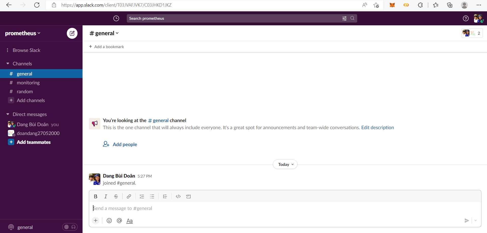

Tiếp đến ta vào Manage app. 

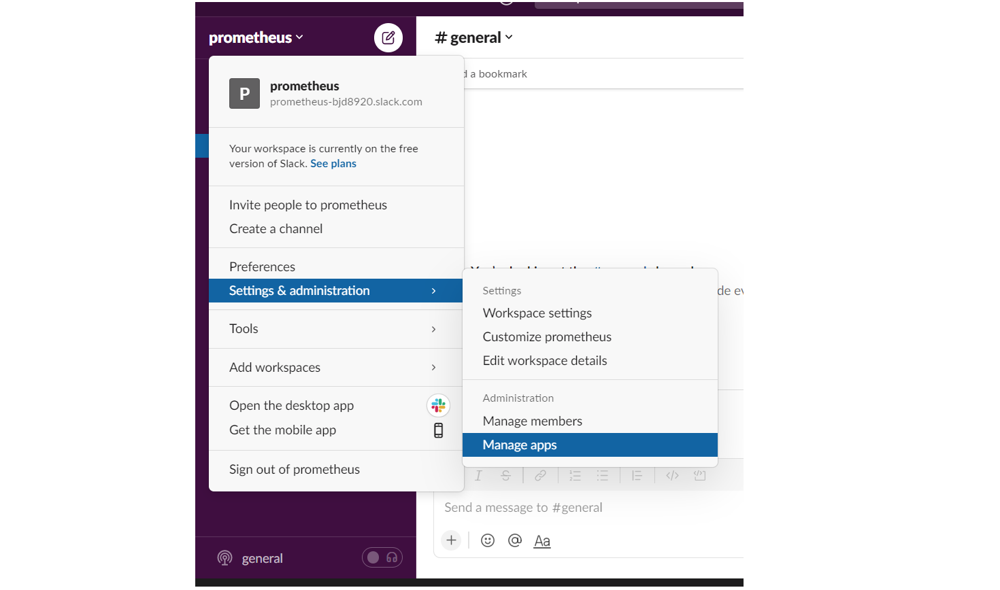

Tìm và thêm Incoming WebHooks. Lấy API URL để thêm vào alertmanager.

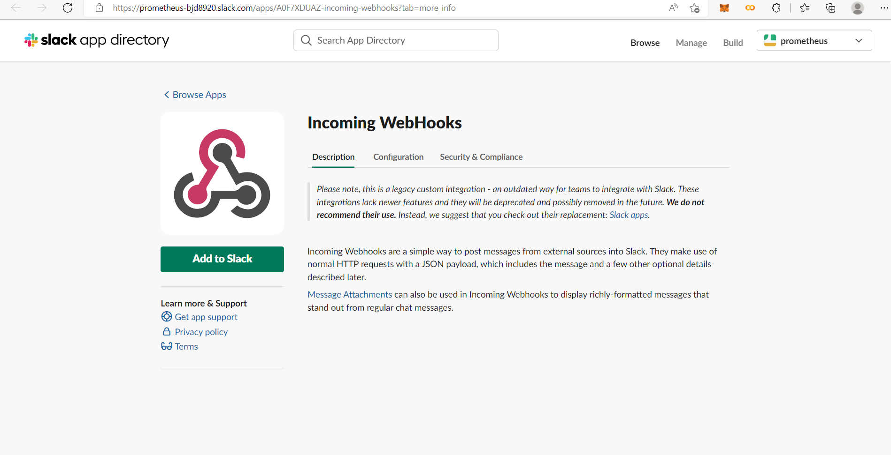

Tiếp đến ta cấu hình Alertmanager như sau.

```yaml
global:
  resolve_timeout: 1m

route:
  group_by: ['alertname']
  group_wait: 10s
  group_interval: 10s
  repeat_interval: 1h
  receiver: 'slack-notifications'
receivers:
- name: 'slack-notifications'
  slack_configs:
  - api_url: "your url"
    channel: "your channel name"
    send_resolved: true
    
inhibit_rules:
  - source_match:
      severity: 'critical'
    target_match:
      severity: 'warning'
    equal: ['alertname', 'dev', 'instance']

```
Với 'api-url' lấy từ Incoming WebHooks.

### 5. Deploy

#### 5.1.  Chạy playbook
Ta ping đến các hosts kiểm tra

```
ansible -i hosts all -m ping
```


Ta có`./playbook.yml` file sẽ như sau:

```yaml
---
- hosts: all
  become: true
  tasks:
  - name: Install aptitude
    apt:
      name: aptitude
      state: latest

  - name: Install required system packages
    apt:
      name:
        - apt-transport-https
        - ca-certificates
        - curl
        - software-properties-common
        - python3-pip
        - virtualenv
        - python3-setuptools
      state: latest

  - name: Add Docker GPG apt Key
    apt_key:
      url: https://download.docker.com/linux/ubuntu/gpg
      state: present

  - name: Add Docker Repository
    apt_repository:
      repo: deb https://download.docker.com/linux/ubuntu focal stable
      state: present

      
  - name: Update apt and install docker-ce
    apt:
      name: docker-ce
      state: latest

  - name: Install Docker Module for Python
    pip:
      name: docker
      
- hosts: monitor
  become: true
  tasks:
  - name: Pull Prometheus Docker image
    docker_image:
      name: prom/prometheus:latest
      source: pull
    
  - name: Copy prometheus.yml file to /tmp
    copy:
      src: prometheus.yml
      dest: /tmp
  
  - name: Copy alert.rules.yml file to 
    copy:
      src: alert.rules.yml
      dest: /tmp

  - name: Run Prometheus Docker image
    docker_container:
      name: prometheus
      image: prom/prometheus:latest
      restart_policy: unless-stopped
      volumes: 
      - /tmp/prometheus.yml:/etc/prometheus/prometheus.yml
      - /tmp/alert.rules.yml:/etc/prometheus/alert.rules.yml
      command:
            - '--config.file=/etc/prometheus/prometheus.yml'
      ports:
      - "9090:9090"

  - name: Pull Grafana Docker image
    docker_image:
      name: grafana/grafana-enterprise
      source: pull
    
  - name: Run Grafana Docker image
    docker_container:
      name: grafana
      image: grafana/grafana-enterprise
      restart_policy: unless-stopped
      ports:
      - "3000:3000"
    
- hosts: nodes
  tasks:
  - name: Pull Node Exporter Docker image
    docker_image:
      name: prom/node-exporter:latest
      source: pull
    
  - name: Run Node Exporter Docker image
    docker_container:
      name: node-exporter
      image: prom/node-exporter:latest
      restart_policy: unless-stopped
      ports: 
      - "9100:9100"

  - name: Pull Alertmanager Docker image
    docker_image:
      name: prom/alertmanager:latest
      source: pull

  - name: alertmanager.yml file to /tmp
    copy:
      src: alertmanager.yml
      dest: /tmp

  - name: Run Alertmanager Docker image
    docker_container:
      name: alertmanager
      image: prom/alertmanager:latest
      ports:
      - "9093:9093"
      restart_policy: unless-stopped
      volumes:
        - /tmp/alertmanager.yml:/alertmanager.yml
      command:
          - '--config.file=/alertmanager.yml'
```

Chạy playbook bằng command:

```shell
ansible-playbook -i .hosts  playbook.yml
```

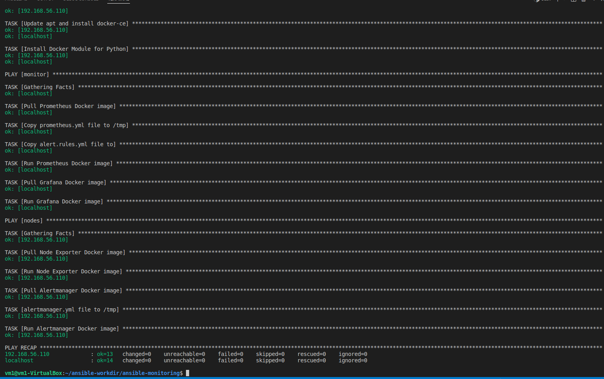

#### 5.2. Prometheus

Truy cập vào `localhost:9090` để sử dụng **Prometheus** và  kiểm tra các Targret.


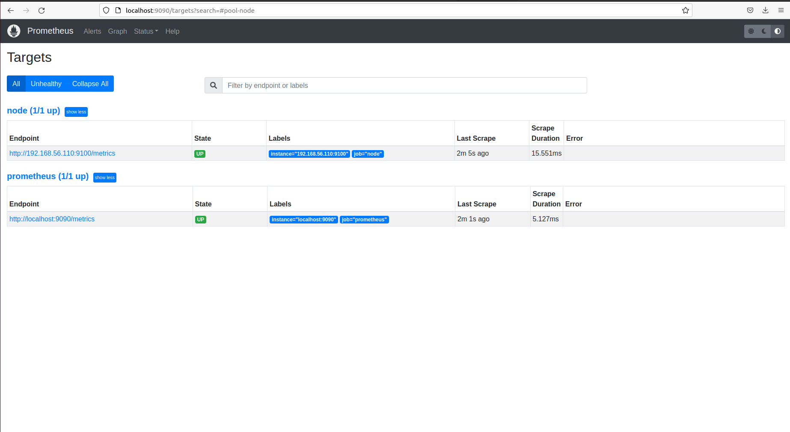


Kiểm tra các Rules.

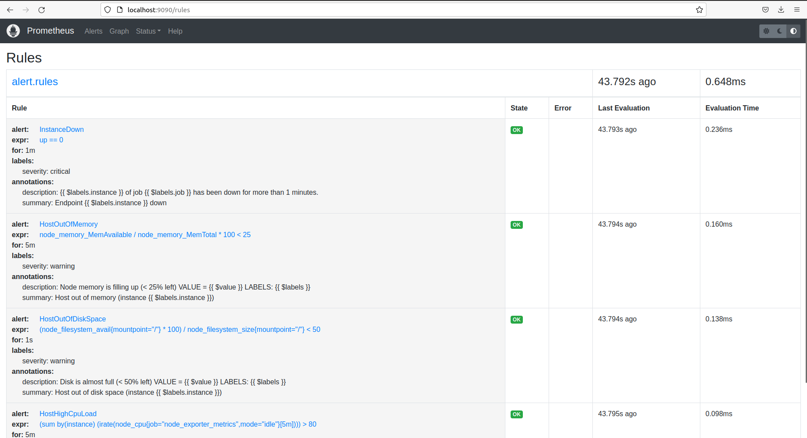

#### 5.3. Alertmanager

Truy cập vào `localhost:9090` để kiểm tra **Alertmanager**.

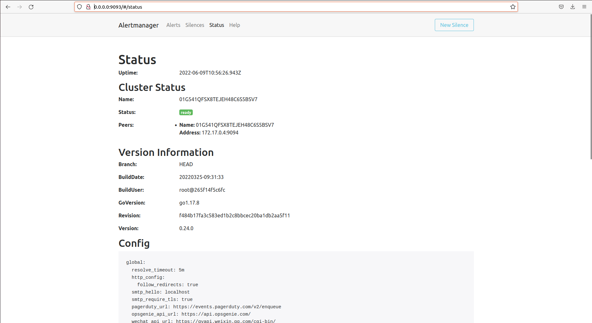

Sử dụng file test để kiểm tra thông báo đến slack. Ta có file test:

```shell
- hosts: nodes
  gather_facts: false
  become: yes
  tasks:
  - name: Stop running containers
    docker_container:
      name: "node-exporter"
      state: stopped
```
Sau khi chạy file ta được kết quả.

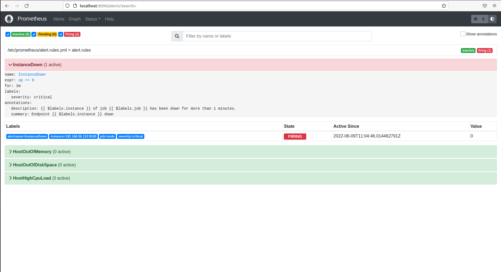

Kiểm tra trong slack thông báo đến.


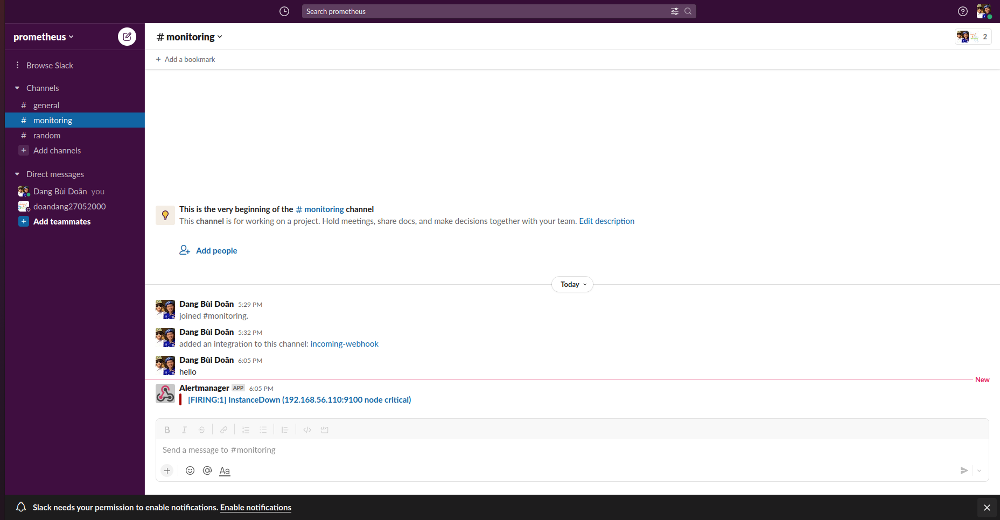

#### 5.4. Using Grafana

Truy cập vào: `localhost:3000` để dùng **Grafana**. Đăng nhập bằng tài khoản admin, mật khẩu admin


Ta thêm dữ liệu từ **Prometheus** vào **Grafana**. Truy cập [vào đây](https://grafana.com/docs/grafana/latest/datasources/add-a-data-source/) để xem hướng dẫn.

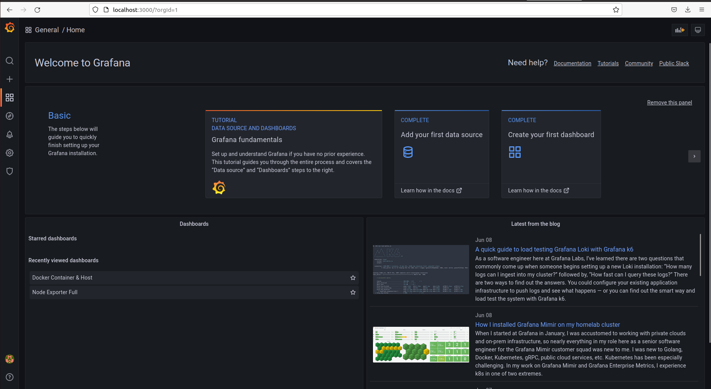

Sau khi thêm **Data sources**, Ta dùng dashboard [Node Exporter Full](https://grafana.com/grafana/dashboards/1860).

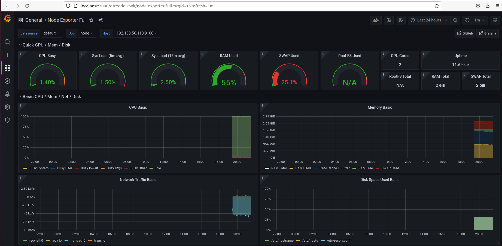

## VI. References


[1] [Prometheus website](https://prometheus.io/)

[2] [Grafana website](https://grafana.com/)

[3] [Install Docker by Ansible](https://www.digitalocean.com/community/tutorials/how-to-use-ansible-to-install-and-set-up-docker-on-ubuntu-20-04)

[4] [Example Ansible](https://github.com/ansible/ansible-examples)

[5] [Pratice-2/Vo-Minh-Thien-Long](https://github.com/vietstacker/Viettel-Digital-Talent-Program-2022/tree/main/Practice-2/Vo-Minh-Thien-Long)
