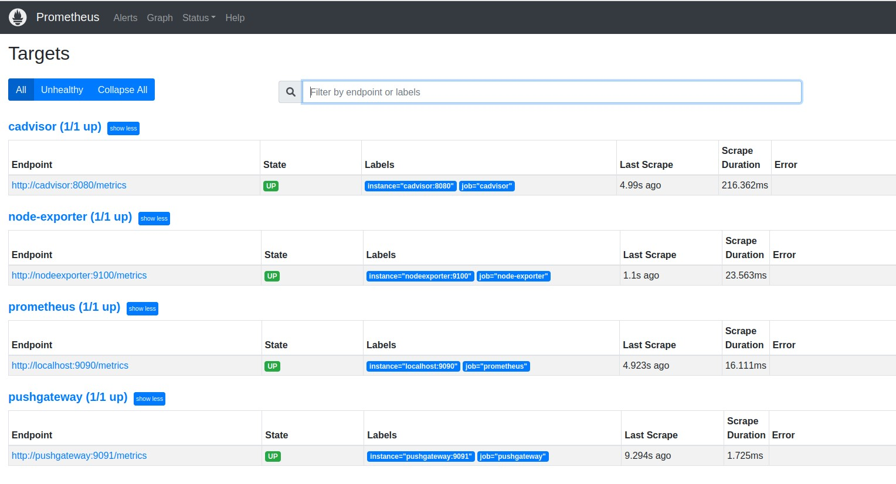
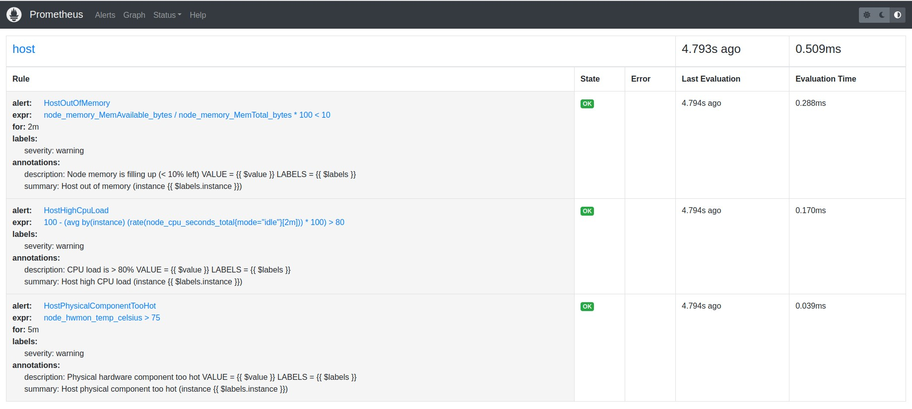
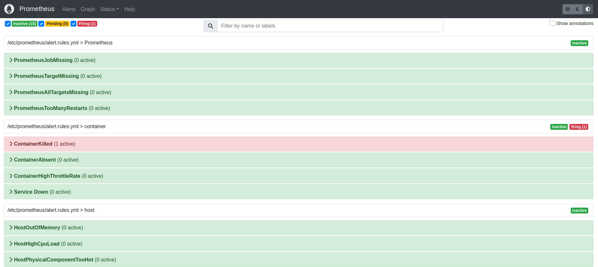
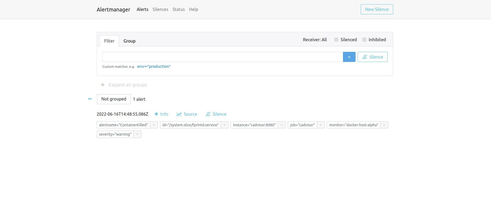
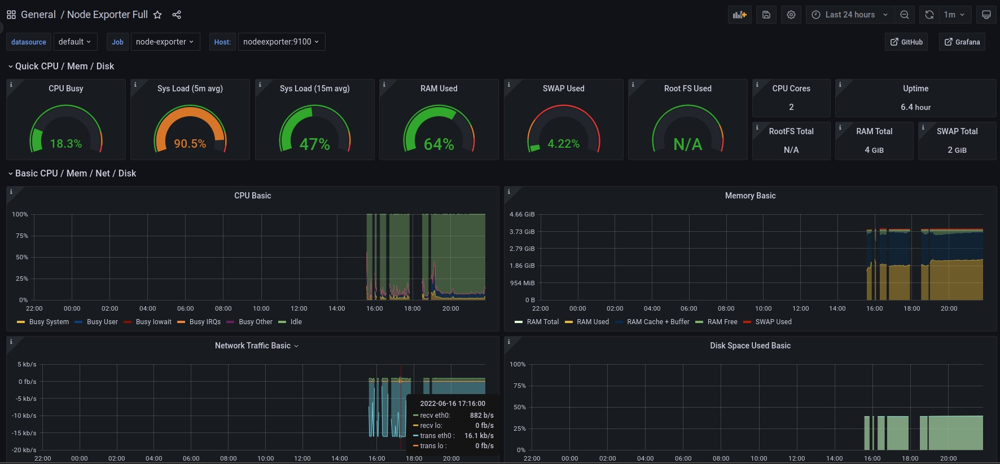
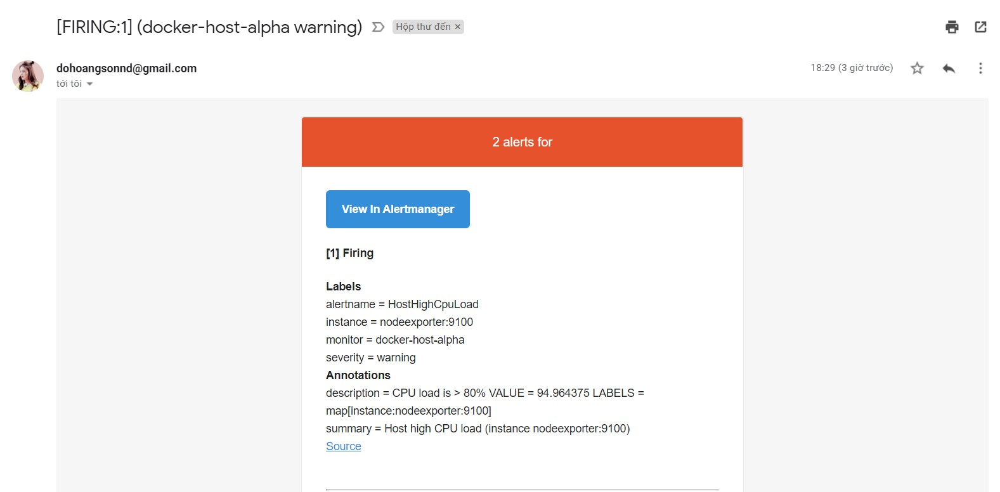

#  **Deploy stack Prometheus + Exporter + Alertmanager + Grafana**
##  **Table of Contents**
[**I. Requirements**]()

[**II. Software**]()
- [**1. Prometheus**]()
	- [**a. Features**]()
	- [**b. Metrics**]()
	- [**c. Components**]()
	- [**d. Architecture**]()
- [**2. Exporter**]()
- [**3. Alertmanager**]()
- [**4. Grafana**]()
- [**5. cAdvisor**]()
- [**6. Pushgateway**]()

[**III. Step-by-step**]()
- [**1. prometheus.yml**]()
- [**2. alert.rules.yml**]()
- [**3. config.yml**]()
- [**4. docker-compose.yml**]()
- [**5. Deploy**]()
- [**6. Result**]()

[**IV. References**]()
##  **I. Requirements**
**Operating System**: Ubuntu Server (Ubuntu Server 22.04 is used in below practices).

**Desktop Hypervisor**: Oracle Virtualbox (Oracle Virtualbox 6.1.34 is used in below practices).
##  **II. Software**
###  **1. Prometheus**
Prometheus  is an open-source systems monitoring and alerting toolkit originally built at SoundCloud. Since its inception in 2012, many companies and organizations have adopted Prometheus, and the project has a very active developer and user community. It is now a standalone open source project and maintained independently of any company. To emphasize this, and to clarify the project's governance structure, Prometheus joined the Cloud Native Computing Foundation in 2016 as the second hosted project, after Kubernetes.

Prometheus collects and stores its metrics as time series data, i.e. metrics information is stored with the timestamp at which it was recorded, alongside optional key-value pairs called labels.
### ***a. Features***
Prometheus's main features are:
-   a multi-dimensional data model with time series data identified by metric name and key/value pairs
-   PromQL, a flexible query language to leverage this dimensionality
-   no reliance on distributed storage; single server nodes are autonomous
-   time series collection happens via a pull model over HTTP
-   pushing time series is supported via an intermediary gateway
-   targets are discovered via service discovery or static configuration
-   multiple modes of graphing and dashboarding support
### ***b. Metrics***
In layperson terms,  _metrics_  are numeric measurements.  _Time series_  means that changes are recorded over time. What users want to measure differs from application to application. For a web server it might be request times, for a database it might be number of active connections or number of active queries etc.

Metrics play an important role in understanding why your application is working in a certain way. Let's assume you are running a web application and find that the application is slow. You will need some information to find out what is happening with your application. For example the application can become slow when the number of requests are high. If you have the request count metric you can spot the reason and increase the number of servers to handle the load.
### ***c. Components***
The Prometheus ecosystem consists of multiple components, many of which are optional:

-   the main Prometheus server which scrapes and stores time series data
-   client libraries for instrumenting application code
-   a push gateway for supporting short-lived jobs
-   special-purpose exporters for services like HAProxy, StatsD, Graphite, etc.
-   an alertmanager to handle alerts
-   various support tools

Most Prometheus components are written in  [Go](https://golang.org/), making them easy to build and deploy as static binaries.
### ***d. Architecture***
This diagram illustrates the architecture of Prometheus and some of its ecosystem components.
<div align="center">
  
</div>
<div align="center">
  <i>Prometheus Architecture</i>
</div>
Prometheus scrapes metrics from instrumented jobs, either directly or via an intermediary push gateway for short-lived jobs. It stores all scraped samples locally and runs rules over this data to either aggregate and record new time series from existing data or generate alerts. Grafana or other API consumers can be used to visualize the collected data.
###  **2. Exporter**
Prometheus exporter for hardware and OS metrics exposed by *NIX kernels, written in Go with pluggable metric collectors.

There is varying support for collectors on each operating system. The tables
below list all existing collectors and the supported systems.

Name | Description | OS
---------|-------------|----
arp | Exposes ARP statistics from `/proc/net/arp`. | Linux
bcache | Exposes bcache statistics from `/sys/fs/bcache/`. | Linux
bonding | Exposes the number of configured and active slaves of Linux bonding interfaces. | Linux
btrfs | Exposes btrfs statistics | Linux
boottime | Exposes system boot time derived from the `kern.boottime` sysctl. | Darwin, Dragonfly, FreeBSD, NetBSD, OpenBSD, Solaris
conntrack | Shows conntrack statistics (does nothing if no `/proc/sys/net/netfilter/` present). | Linux
cpu | Exposes CPU statistics | Darwin, Dragonfly, FreeBSD, Linux, Solaris, OpenBSD
cpufreq | Exposes CPU frequency statistics | Linux, Solaris
diskstats | Exposes disk I/O statistics. | Darwin, Linux, OpenBSD
dmi | Expose Desktop Management Interface (DMI) info from `/sys/class/dmi/id/` | Linux
edac | Exposes error detection and correction statistics. | Linux
entropy | Exposes available entropy. | Linux
exec | Exposes execution statistics. | Dragonfly, FreeBSD
fibrechannel | Exposes fibre channel information and statistics from `/sys/class/fc_host/`. | Linux
filefd | Exposes file descriptor statistics from `/proc/sys/fs/file-nr`. | Linux
filesystem | Exposes filesystem statistics, such as disk space used. | Darwin, Dragonfly, FreeBSD, Linux, OpenBSD
hwmon | Expose hardware monitoring and sensor data from `/sys/class/hwmon/`. | Linux
infiniband | Exposes network statistics specific to InfiniBand and Intel OmniPath configurations. | Linux
ipvs | Exposes IPVS status from `/proc/net/ip_vs` and stats from `/proc/net/ip_vs_stats`. | Linux
loadavg | Exposes load average. | Darwin, Dragonfly, FreeBSD, Linux, NetBSD, OpenBSD, Solaris
mdadm | Exposes statistics about devices in `/proc/mdstat` (does nothing if no `/proc/mdstat` present). | Linux
meminfo | Exposes memory statistics. | Darwin, Dragonfly, FreeBSD, Linux, OpenBSD
netclass | Exposes network interface info from `/sys/class/net/` | Linux
netdev | Exposes network interface statistics such as bytes transferred. | Darwin, Dragonfly, FreeBSD, Linux, OpenBSD
netstat | Exposes network statistics from `/proc/net/netstat`. This is the same information as `netstat -s`. | Linux
nfs | Exposes NFS client statistics from `/proc/net/rpc/nfs`. This is the same information as `nfsstat -c`. | Linux
nfsd | Exposes NFS kernel server statistics from `/proc/net/rpc/nfsd`. This is the same information as `nfsstat -s`. | Linux
nvme | Exposes NVMe info from `/sys/class/nvme/` | Linux
os | Expose OS release info from `/etc/os-release` or `/usr/lib/os-release` | _any_
powersupplyclass | Exposes Power Supply statistics from `/sys/class/power_supply` | Linux
pressure | Exposes pressure stall statistics from `/proc/pressure/`. | Linux (kernel 4.20+ and/or [CONFIG\_PSI](https://www.kernel.org/doc/html/latest/accounting/psi.html))
rapl | Exposes various statistics from `/sys/class/powercap`. | Linux
schedstat | Exposes task scheduler statistics from `/proc/schedstat`. | Linux
sockstat | Exposes various statistics from `/proc/net/sockstat`. | Linux
softnet | Exposes statistics from `/proc/net/softnet_stat`. | Linux
stat | Exposes various statistics from `/proc/stat`. This includes boot time, forks and interrupts. | Linux
tapestats | Exposes statistics from `/sys/class/scsi_tape`. | Linux
textfile | Exposes statistics read from local disk. The `--collector.textfile.directory` flag must be set. | _any_
thermal | Exposes thermal statistics like `pmset -g therm`. | Darwin
thermal\_zone | Exposes thermal zone & cooling device statistics from `/sys/class/thermal`. | Linux
time | Exposes the current system time. | _any_
timex | Exposes selected adjtimex(2) system call stats. | Linux
udp_queues | Exposes UDP total lengths of the rx_queue and tx_queue from `/proc/net/udp` and `/proc/net/udp6`. | Linux
uname | Exposes system information as provided by the uname system call. | Darwin, FreeBSD, Linux, OpenBSD
vmstat | Exposes statistics from `/proc/vmstat`. | Linux
xfs | Exposes XFS runtime statistics. | Linux (kernel 4.4+)
zfs | Exposes [ZFS](http://open-zfs.org/) performance statistics. | [Linux](http://zfsonlinux.org/), Solaris
###  **3. Alertmanager**
The Alertmanager handles alerts sent by client applications such as the Prometheus server. It takes care of deduplicating, grouping, and routing them to the correct receiver integration such as email, PagerDuty, or OpsGenie. It also takes care of silencing and inhibition of alerts.
###  **4. Grafana**
**Grafana**  is a multi-platformopen source analytics and interactive visualization web application. It provides charts, graphs, and alerts for the web when connected to supported data sources. A licensed Grafana Enterprise version with additional capabilities is also available as a self-hosted installation or an account on the Grafana Labs cloud service. It is expandable through a plug-in system. End users can create complex monitoring dashboards using interactive query builders. Grafana is divided into a front end and back end, written in TypeScript and Go, respectively.

As a visualization tool, Grafana is a popular component in monitoring stacks, often used in combination with such as InfluxDB, Prometheus (software) and Graphite; Network monitoring system such as Sensu, Icinga, Checkmk, Zabbix, Netdata, and PRTG; SIEMs such as Elasticsearch and Splunk; and other data sources. The Grafana user interface  was originally based on version 3 of Kibana.
Grafana allows you to query, visualize, alert on and understand your metrics no matter where they are stored. Create, explore, and share dashboards with your team and foster a data-driven culture:
-   **Visualizations:**  Fast and flexible client side graphs with a multitude of options. Panel plugins offer many different ways to visualize metrics and logs.
-   **Dynamic Dashboards:**  Create dynamic & reusable dashboards with template variables that appear as dropdowns at the top of the dashboard.
-   **Explore Metrics:**  Explore your data through ad-hoc queries and dynamic drilldown. Split view and compare different time ranges, queries and data sources side by side.
-   **Explore Logs:**  Experience the magic of switching from metrics to logs with preserved label filters. Quickly search through all your logs or streaming them live.
-   **Alerting:**  Visually define alert rules for your most important metrics. Grafana will continuously evaluate and send notifications to systems like Slack, PagerDuty, VictorOps, OpsGenie.
-   **Mixed Data Sources:**  Mix different data sources in the same graph! You can specify a data source on a per-query basis. This works for even custom datasources.
###  **5. cAdvisor**
cAdvisor (Container Advisor) provides container users an understanding of the resource usage and performance characteristics of their running containers. It is a running daemon that collects, aggregates, processes, and exports information about running containers. Specifically, for each container it keeps resource isolation parameters, historical resource usage, histograms of complete historical resource usage and network statistics. This data is exported by container and machine-wide.

cAdvisor has native support for Docker containers and should support just about any other container type out of the box.
###  **6. Pushgateway**
The Prometheus Pushgateway exists to allow ephemeral and batch jobs to expose their metrics to Prometheus. Since these kinds of jobs may not exist long enough to be scraped, they can instead push their metrics to a Pushgateway. The Pushgateway then exposes these metrics to Prometheus.
##  **III. Step-by-step**
To set up Prometheus, we create three files:
-   prometheus.yml - the actual Prometheus configuration
-   alert.rules.yml - alerts you want Prometheus to check
-   config.yml - the actual alertmanager configuration
-   docker-compose.yml
###  **1. prometheus.yml**
Add the following to `prometheus.yml`
```
global:
	scrape_interval: 15s
	evaluation_interval: 15s
	external_labels:
		monitor: "docker-host-alpha"
rule_files:
	- alert.rules.yml
scrape_configs:
	- job_name: "prometheus"
	  scrape_interval: 10s
	  static_configs:
		- targets: ["localhost:9090"]
	- job_name: "node-exporter"
	  scrape_interval: 5s
	  static_configs:
		- targets: ["nodeexporter:9100"]
	- job_name: "cadvisor"
	  scrape_interval: 5s
	  static_configs:
		- targets: ["cadvisor:8080"]
	- job_name: "pushgateway"
	  scrape_interval: 10s
	  honor_labels: true
	  metrics_path: /metrics
	  static_configs:
		- targets:
			- "pushgateway:9091"
alerting:
	alertmanagers:
		- scheme: http
		  static_configs:
		  - targets:
			- "alertmanager:9093"
```
`scrape_interval`  defines how often to check for new metric values.
`evaluation_interval` How frequently to evaluate rules
`scrape_configs`  tell Prometheus where your applications are. There are four applications: prometheus, nodeexporter, cadvisor, pushgateway
`static_configs`  hard-code some endpoints.  
`targets` where Prometheus monitors
`rule_files`  tells Prometheus where to search for the alert rules.
`targets` The application address, which Prometheus monitors
`alerting`Alerting specifies settings related to the Alertmanager
###  **2. alert.rules.yml**
Add the following to `alert.rules.yml`
```
groups:
- name: Prometheus
  rules:
  - alert: PrometheusJobMissing
	expr: absent(up{job="prometheus"})
	for: 0m
	labels:
		severity: warning
	annotations:
		summary: Prometheus job missing (instance {{ $labels.instance }})
		description: "A Prometheus job has disappeared\n VALUE = {{ $value }}\n LABELS = {{ $labels }}"
  - alert: PrometheusTargetMissing
	expr: up == 0
	for: 0m
	labels:
		severity: critical
	annotations:
		summary: Prometheus target missing (instance {{ $labels.instance }})
		description: "A Prometheus target has disappeared. An exporter might be crashed.\n VALUE = {{ $value }}\n LABELS = {{ $labels }}"
  - alert: PrometheusAllTargetsMissing
	expr: sum by (job) (up) == 0
	for: 0m
	labels:
		severity: critical
	annotations:
		summary: Prometheus all targets missing (instance {{ $labels.instance }})
		description: "A Prometheus job does not have living target anymore.\n VALUE = {{ $value }}\n LABELS = {{ $labels }}"
  - alert: PrometheusTooManyRestarts
	expr: changes(process_start_time_seconds{job=~"prometheus|pushgateway|alertmanager"}[15m]) > 2
	for: 0m
	labels:
		severity: warning
	annotations:
		summary: Prometheus too many restarts (instance {{ $labels.instance }})
		description: "Prometheus has restarted more than twice in the last 15 minutes. It might be crashlooping.\n VALUE = {{ $value }}\n LABELS = {{ $labels }}"
- name: host
  rules:
  - alert: HostOutOfMemory
	expr: node_memory_MemAvailable_bytes / node_memory_MemTotal_bytes * 100 < 10
	for: 2m
	labels:
		severity: warning
	annotations:
		summary: Host out of memory (instance {{ $labels.instance }})
		description: "Node memory is filling up (< 10% left)\n VALUE = {{ $value }}\n LABELS = {{ $labels }}"
  - alert: HostHighCpuLoad
	expr: 100 - (avg by(instance) (rate(node_cpu_seconds_total{mode="idle"}[2m])) * 100) > 80
	for: 0m
	labels:
		severity: warning
	annotations:
		summary: Host high CPU load (instance {{ $labels.instance }})
		description: "CPU load is > 80%\n VALUE = {{ $value }}\n LABELS = {{ $labels }}"
  - alert: HostPhysicalComponentTooHot
	expr: node_hwmon_temp_celsius > 75
	for: 5m
	labels:
		severity: warning
	annotations:
		summary: Host physical component too hot (instance {{ $labels.instance }})
		description: "Physical hardware component too hot\n VALUE = {{ $value }}\n LABELS = {{ $labels }}"
- name: container
  rules:
  - alert: ContainerKilled
	expr: time() - container_last_seen > 60
	for: 0m
	labels:
		severity: warning
	annotations:
		summary: Container killed (instance {{ $labels.instance }})
		description: "A container has disappeared\n VALUE = {{ $value }}\n LABELS = {{ $labels }}"
  - alert: ContainerAbsent
	expr: absent(container_last_seen)
	for: 5m
	labels:
		severity: warning
	annotations:
		summary: Container absent (instance {{ $labels.instance }})
		description: "A container is absent for 5 min\n VALUE = {{ $value }}\n LABELS = {{ $labels }}"
  - alert: ContainerHighThrottleRate
	expr: rate(container_cpu_cfs_throttled_seconds_total[3m]) > 1
	for: 2m
	labels:
		severity: warning
	annotations:
		summary: Container high throttle rate (instance {{ $labels.instance }})
		description: "Container is being throttled\n VALUE = {{ $value }}\n LABELS = {{ $labels }}"
  - alert: Service Down
	expr: up == 0
	for: 30s
	labels:
		severity: critical
	annotations:
		summary: Service (instance {{ $labels.instance }}) is down.
		description: "Service (instance {{ $labels.instance }}) is down."
```
The optional  `for`  clause causes Prometheus to wait for a certain duration between first encountering a new expression output vector element and counting an alert as firing for this element. In this case, Prometheus will check that the alert continues to be active during each evaluation for 10 minutes before firing the alert. Elements that are active, but not firing yet, are in the pending state.

The  `labels`  clause allows specifying a set of additional labels to be attached to the alert. Any existing conflicting labels will be overwritten. The label values can be templated.

The  `annotations`  clause specifies a set of informational labels that can be used to store longer additional information such as alert descriptions or runbook links. The annotation values can be templated.
###  **3. config.yml**
Add the following to `config.yml`. This is Alertmanager configuration file. It helps us to send the alerts via Email and we will use Gmail relay in that case.
```
global:
	resolve_timeout: 1m
route:
	receiver: 'email-notifications'
receivers:
	- name: 'email-notifications'
	  email_configs:
	  - to: dohoangsonnd@gmail.com
		from: dohoangsonnd@gmail.com
		smarthost: smtp.gmail.com:587
		auth_username: dohoangsonnd@gmail.com
		auth_identity: dohoangsonnd@gmail.com
		auth_password: password
		send_resolved: true
```
`ResolveTimeout` is the default value used by alertmanager if the alert does not include EndsAt, after this time passes it can declare the alert as resolved if it has not been updated. This has no impact on alerts from Prometheus, as they always include EndsAt.

`route` A route block defines a node in a routing tree and its children. Its optional configuration parameters are inherited from its parent node if not set.

`receivers` A list of notification receivers

`to`The email address to send notifications to.

`from`The sender's address.

`smarthost`The SMTP host through which emails are sent.

`auth_username, auth_identity, auth_password, auth_password`SMTP authentication information.

`send_resolved`Whether to notify about resolved alerts

###  **4. docker-compose.yml**
Add the following to `docker-compose.yml`
```
version: '3'
services:
	prometheus:
		image: prom/prometheus:latest
		ports:
			- 9090:9090
		container_name: prometheus
		volumes:
			- ./prometheus.yml:/etc/prometheus/prometheus.yml
			- ./alert.rules.yml:/etc/prometheus/alert.rules.yml
		command:
			- '--config.file=/etc/prometheus/prometheus.yml'
	grafana:
		image: grafana/grafana
		ports:
			- 3000:3000
		container_name: grafana
		depends_on:
			- prometheus
	node-exporter:
		image: prom/node-exporter
		container_name: nodeexporter
		ports:
			- 9100:9100
	cadvisor:
		image: gcr.io/cadvisor/cadvisor:v0.39.3
		container_name: cadvisor
		ports:
			- 8080:8080
		volumes:
			- /:/rootfs:ro
			- /var/run:/var/run:rw
			- /sys:/sys:ro
			- /var/lib/docker/:/var/lib/docker:ro
			- /var/run/docker.sock:/var/run/docker.sock:rw
			- /dev/disk/:/dev/disk:ro
	pushgateway:
		image: prom/pushgateway:latest
		container_name: pushgateway
		ports:
			- 9091:9091
	alertmanager:
		image: prom/alertmanager:latest
		container_name: alertmanager
		ports:
			- 9093:9093
		volumes:
			- ./alertmanager/:/etc/alertmanager/
			- ./config.yml:/etc/alertmanager/config.yml
		command:
			- '--config.file=/etc/alertmanager/config.yml'
			- '--storage.path=/alertmanager'
```
###  **5. Deploy**
Clone from Git repo
```
clone https://github.com/nhok8t1/Prometheus.git
```
Run docker-compose
```
cd Prometheus
docker-compose up -d
```
###  **6. Result**
<div align="center">
  
</div>
<div align="center">
  <i>Prometheus Target</i>
</div>
<div align="center">
  
</div>
<div align="center">
  <i>Rules Define</i>
</div>
<div align="center">
  
</div>
<div align="center">
  <i>Alert Define</i>
</div>
<div align="center">
  
</div>
<div align="center">
  <i>Alert Manager</i>
</div>
<div align="center">
  
</div>
<div align="center">
  <i>Grafana Dashboard</i>
</div>
<div align="center">
  
</div>
<div align="center">
  <i>Send Alert via Email</i>
</div>

##  **IV. References**
- [My GitHub Repository](https://github.com/nhok8t1/Prometheus)
- [Real time monitoring stack (Prometheus, Grafana, Node_Exporter, Docker) setup using docker-compose - YouTube](https://www.youtube.com/watch?v=5Ri1KfdBTm4)
- [Prometheus email alerting | Prometheus alertmanager email configuration - YouTube](https://www.youtube.com/watch?v=x2qTvTN8YKI)
- [Overview | Prometheus](https://prometheus.io/docs/introduction/overview/)
