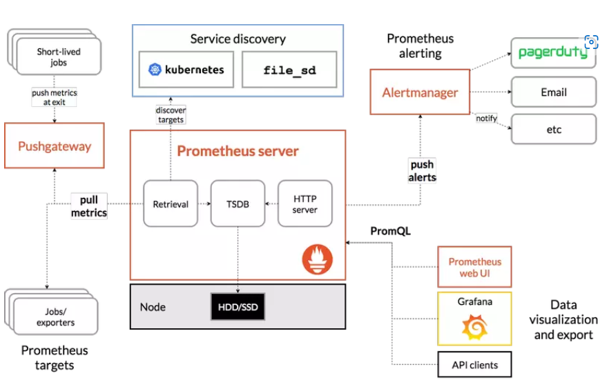
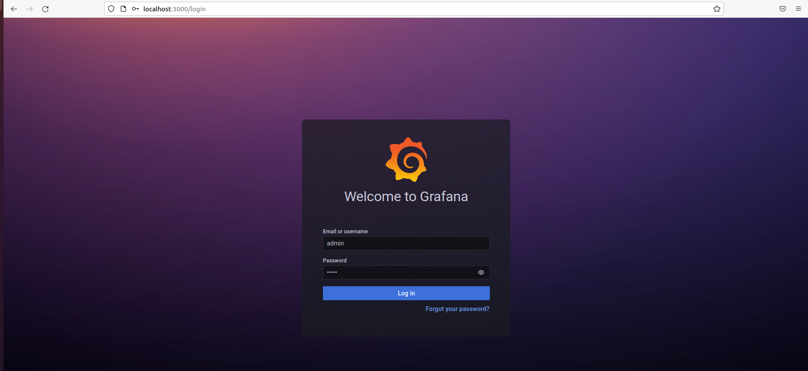

# Bài Thực Hành 4
# Chủ đề: Sử dụng Ansible, Docker để triển khai Prometheus, Exporter, Alertmanager, Grafana 
---
Thực hiện: Nguyễn Tấn Huy 
---

# **Table of Contents:**

## I. Tổng quan

### A. Prometheus

### B. Exporter

### C. Alertmanager

### D. Grafana

## II. Triển khai
- ### A. Chuẩn bị 
- ### B. Triển khai

## III. Tài Liệu Tham Khảo
----------
# **I. Tổng quan**
## **A. Prometheus** 
-  Prometheus là một dịch vụ theo dõi và cảnh báo về hệ thống. Đây là một dịch vụ mã nguồn mở (Open source) hoàn toàn miễn phí. SoundCloud đã khởi đầu xây dựng Prometheus từ năm 2012. Prometheus đã được rất nhiều hệ thống tin tưởng áp dụng. Dự án có một cộng đồng người đóng góp, phát triển rất tích cực.

-  Một số tính năng của Prometheus
 	- Mô hình dữ liệu Time series đặc biệt phù hợp để theo dõi số liệu theo thời gian.
	- Có ngôn ngữ truy vấn riêng PromQL rất mạnh mẽ.
	- Tích hợp tốt với rất nhiềunền tảng ứng dụng.
	- Yêu cầu hạ tầng để triển khai đơn giản.
	- Hỗ trợ Push Gateway (khi làm việc với các dịch vụ tồn tại trong thời gian ngắn và hủy sau khi hoàn thành).
	- Có hỗ trợ Service discovery hoặc cấu hình tĩnh để tìm, nhắm mục tiêu cần theo dõi.
- Kiến trúc Prometheus

	Mô hình Prometheus thường thấy


## **B. Node Exporter** 
- Đây là một exporter chạy được viết trên Golang(Exporter tạm hiểu là các service có khả năng thu thập/xuất ra các thông số của server/vps).

## **C. Aleartmanager**

- Alertmanager xử lý cảnh báo được gửi bởi ứng dụng như là Prometheus server. Nó có các cơ chế Grouping, Inhibition, Silience

	- Grouping :
Phân loại cảnh báo có những tính chất tương tự. Điều này thực sự hữu ích trong một hệ thống lớn với nhiều thông báo được gửi đông thời.
Ví dụ: một hệ thống với nhiều server mất kết nối đến cơ sở dữ liệu, thay vì rất nhiều cảnh báo được gửi về Alertmanager thì Grouping giúp cho việc giảm số lượng cảnh báo trùng lặp, thay vào đó là một cảnh báo để chúng ta có thể biết được chuyện gì đang xảy ra với hệ thống của bạn.

	- Inhibition :
Inhibition là một khái niệm về việc chặn thông báo cho một số cảnh báo nhất định nếu các cảnh báo khác đã được kích hoạt.
Ví dụ: Một cảnh báo đang kích hoạt, thông báo là cluster không thể truy cập (not reachable). Alertmanager có thể được cấu hình là tắt các cảnh báo khác liên quan đến cluster này nếu cảnh báo đó đang kích hoạt. Điều này lọc bớt những cảnh báo không liên quan đến vấn đề hiện tại.

	- Silience :
Silience là tắt cảnh báo trong một thời gian nhất định. Nó được cấu hình dựa trên các match, nếu nó match với các điều kiện thì sẽ không có cảnh báo nào được gửi khi đó.

	- High avability:
Alertmanager hỗ trợ cấu hình để tạo một cluster với độ khả dụng cao.

## **D. Grafana**
Grafana là một nền tảng open-source chuyên phục vụ mục đích theo dõi và đánh giá các số liệu thu được. Theo định nghĩa như vậy chúng ta có thể thấy tính ứng dụng của Grafana rất rộng chứ không chỉ trong khối IT. Bất kì lĩnh vực nào có thể thu được dữ liệu theo dòng thời gian đều có thể hiển thị tối ưu trên Grafana. Ngoài khả năng kết nối đa dạng với các nguồn dữ liệu, phần giao diện của công cụ này rất thân thiền với người dùng. Dễ dàng đưa ra thông tin và cảnh báo.


# **II. Triển khai**
## **A. Chuẩn bị** 
Mục tiêu của em là sẽ deploy stack với tính sẵn sàng cao.
- Em thực hiện deploy trên 2 node riêng biệt `[server1] 10.0.2.15` và `[server2] 192.168.5.117`
- Cả 2 node đều sử dụng hệ điều hành Ubuntu 20.04, 4G RAM và 64GB bộ nhớ.
- Ansible để deploy các phần mềm cần thiết.

## **B. Triển khai**
- Prometheus và Grafana sẽ được triển khai trên `[server1]` 
- Node Exporter và Alertmanager sẽ được triển khai trên `[server2]`
- Trình tự tiến hành như sau:
	- `[1]` Cài đặt Ansible
	- `[2]` Cài đặt Docker cho cả 2 máy.
	- `[3]` Cài đặt Prometheus cho `[server1]`
	- `[4]` Cài đặt Grafana cho `[server1]`
	- `[5]` Cài đặt Node Exporter cho `[server2]`
	- `[6]` Cài đặt Alertmanager cho `[server2]` đẩy thông báo qua Telegram
### 1. Cài đặt Ansible
Đầu tiên ta chạy câu lệnh để cập nhật kho lưu trữ:
```
sudo apt update
```
Sau đó chạy các lệnh cài đặt các package cần thiết

```
sudo apt install software-properties-common
```

Tiếp đến ta dùng `add-apt-repository` để thêm **Ubuntu PPA**:
```
sudo add-apt-repository --yes --update ppa:ansible/ansible
```
Chạy câu lệnh cài đặt ansible:
```
sudo apt install ansible
```
### 2. Cấu hình Ansible

Ta tạo file ansible.cfg và cấu hình như sau:

```
[defaults]
host_key_checking = False
inventory = /etc/ansible/hosts
```
### 3. Cấu hình inventory
Ta sẽ cấu hình file `hosts` như sau:

```
[server1]
10.0.2.15

[server2]
192.168.5.117

[all:vars]
ansible_ssh_user =huy
ansible_ssh_pass =1
ansible_become_pass =1
```
### 4. Role Docker
Các tasks thực hiện cài đặt Docker và các package cần thiết
```
  - name: Install aptitude
    apt:
      name: aptitude
      state: latest
      
  - name: Install required system packages
    apt:
      name:
      - apt-transport-https
      - ca-certificates
      - curl
      - software-properties-common
      - python3-pip
      - virtualenv
      - python3-setuptools
      state: latest
       
  - name: Add Docker GPG apt Key
    apt_key:
      url: https://download.docker.com/linux/ubuntu/gpg
      state: present

  - name: Add Docker Repository
    apt_repository:
      repo: deb https://download.docker.com/linux/ubuntu focal stable
      state: present
        
  - name: Update apt and install docker-ce
    apt:
      name: docker-ce
      state: latest
      update_cache: true

  - name: Install Docker Module for Python
    pip:
      name: docker
```
### 5. Role Prometheus
Để triển khai Prometheus cần thực hiện các tasks:
```
  - name: Pull Prometheus Docker image
    docker_image:
      name: prom/prometheus:latest
      source: pull
    
  - name: Copy prometheus.yml file to /tmp
    copy:
      src: prometheus.yml
      dest: /tmp
  
  - name: Copy alert.rules file to /tmp
    copy:
      src: alert.rules
      dest: /tmp

  - name: Run Prometheus Docker image
    docker_container:
      name: prometheus
      image: prom/prometheus:latest
      restart_policy: unless-stopped
      volumes: 
      - /tmp/prometheus.yml:/etc/prometheus/prometheus.yml
      - /tmp/alert.rules:/etc/prometheus/alert.rules
      command:
      - '--config.file=/etc/prometheus/prometheus.yml'
      ports:
      - "9090:9090"
```
File prometheus.yml chứa cấu hình của Prometheus.
```
global:
  scrape_interval: 15s

scrape_configs:
- job_name: prometheus
  static_configs:
  - targets:
    - localhost:9090

- job_name: node
  static_configs:
  - targets: 
    - 192.168.5.117:9100

alerting:
  alertmanagers:
  - static_configs:
    - targets:
      - 192.168.5.117:9093

rule_files:
  - "/etc/prometheus/alert.rules.yml"
```
Chi tiết file alert.rules
```
groups:
- name: alert.rules
  rules:
  - alert: InstanceDown
   # Condition for alerting
    expr: up == 0
    for: 1m
   # Annotation - additional informational labels to store more information
    annotations:
      title: 'Instance {{ $labels.instance }} down'
      description: '{{ $labels.instance }} of job {{ $labels.job }} has been down for more than 1 minute.'
   # Labels - additional labels to be attached to the alert
    labels:
        severity: 'critical'

  - alert: HostOutOfMemory
   # Condition for alerting
    expr: node_memory_MemAvailable / node_memory_MemTotal * 100 < 25
    for: 5m
   # Annotation - additional informational labels to store more information
    annotations:
      title: 'Host out of memory (instance {{ $labels.instance }})'
      description: 'Node memory is filling up (< 25% left)\n  VALUE = {{ $value }}\n  LABELS: {{ $labels }}'
   # Labels - additional labels to be attached to the alert
    labels:
        severity: 'warning'

  - alert: HostHighCpuLoad
   # Condition for alerting
    expr: (sum by (instance) (irate(node_cpu{job="node_exporter_metrics",mode="idle"}[5m]))) > 80
    for: 5m
   # Annotation - additional informational labels to store more information
    annotations:
      title: 'Host high CPU load (instance {{ $labels.instance }})'
      description: 'CPU load is > 80%\n  VALUE = {{ $value }}\n  LABELS: {{ $labels }}'
   # Labels - additional labels to be attached to the alert
    labels:
        severity: 'warning'

  - alert: HostOutOfDiskSpace
   # Condition for alerting
    expr: (node_filesystem_avail{mountpoint="/"}  * 100) / node_filesystem_size{mountpoint="/"} < 50
    for: 5m
   # Annotation - additional informational labels to store more information
    annotations:
      title: 'Host out of disk space (instance {{ $labels.instance }})'
      description: 'Disk is almost full (< 50% left)\n  VALUE = {{ $value }}\n  LABELS: {{ $labels }}'
   # Labels - additional labels to be attached to the alert
    labels:
        severity: 'warning'
  
    # This rule can be very noisy in dynamic infra with legitimate container start/stop/deployment.
  - alert: ContainerKilled
    expr: time() - container_last_seen > 60
    for: 0m
    labels:
      severity: warning
    annotations:
      summary: Container killed (instance {{ $labels.instance }})
      description: "A container has disappeared\n  VALUE = {{ $value }}\n  LABELS = {{ $labels }}"


  #Container CPU usage is above 80% 
  - alert: ContainerCpuUsage
    expr: (sum(rate(container_cpu_usage_seconds_total{name!=""}[3m])) BY (instance, name) * 100) > 80
    for: 2m
    labels:
      severity: warning
    annotations:
      summary: Container CPU usage (instance {{ $labels.instance }})
      description: "Container CPU usage is above 80%\n  VALUE = {{ $value }}\n  LABELS = {{ $labels }}"
  
    # Container Memory usage
  - alert: ContainerMemoryUsage
    expr: (sum(container_memory_working_set_bytes{name!=""}) BY (instance, name) / sum(container_spec_memory_limit_bytes > 0) BY (instance, name) * 100) > 80
    for: 2m
    labels:
      severity: warning
    annotations:
      summary: Container Memory usage (instance {{ $labels.instance }})
      description: "Container Memory usage is above 80%\n  VALUE = {{ $value }}\n  LABELS = {{ $labels }}"
```
### 6. Role Grafana
Để triển khai Grafana cần thực hiện các tasks:
```
  - name: Pull Grafana Docker image
    docker_image:
      name: grafana/grafana-enterprise:lastest
      source: pull
    
  - name: Run Grafana Docker image
    docker_container:
      name: grafana
      image: grafana/grafana-enterprise:lastest
      restart_policy: unless-stopped
      ports:
      - "3000:3000"
```
### 7. Role Node Exporter
Để triển khai Node Exporter cần thực hiện các tasks:
```
- name: Pull Node Exporter Docker image
    docker_image:
      name: prom/node-exporter:latest
      source: pull
    
  - name: Run Node Exporter Docker image
    docker_container:
      name: node-exporter
      image: prom/node-exporter:latest
      restart_policy: unless-stopped
      ports: 
      - "9100:9100"
```
### 8.Role Alertmanager
Để triển khai Alertmanager cần thực hiện các tasks:
```
  - name: Pull Alertmanager Docker image
    docker_image:
      name: prom/alertmanager:latest
      source: pull

  - name: alertmanager.yml file to /tmp
    copy:
      src: alertmanager.yml
      dest: /tmp

  - name: Run Alertmanager Docker image
    docker_container:
      name: alertmanager
      image: prom/alertmanager:latest
      ports:
      - "9093:9093"
      restart_policy: unless-stopped
      volumes:
        - /tmp/alertmanager.yml:/alertmanager.yml
      command:
          - '--config.file=/alertmanager.yml'
```
Trong đó, file alertmanager.yml dùng để cấu hình Alertmanager đẩy cảnh báo lên Slack.
```
global:
  resolve_timeout: 1m
  slack_api_url: ''

route:
  receiver: 'slack-notifications'

receivers:
- name: 'slack-notifications'
  slack_configs:
  - channel: '#monitoring-instances'
    send_resolved: true
    icon_url: https://avatars3.githubusercontent.com/u/3380462
    title: |-
     [{{ .Status | toUpper }}{{ if eq .Status "firing" }}:{{ .Alerts.Firing | len }}{{ end }}] {{ .CommonLabels.alertname }} for {{ .CommonLabels.job }}
     {{- if gt (len .CommonLabels) (len .GroupLabels) -}}
       {{" "}}(
       {{- with .CommonLabels.Remove .GroupLabels.Names }}
         {{- range $index, $label := .SortedPairs -}}
           {{ if $index }}, {{ end }}
           {{- $label.Name }}="{{ $label.Value -}}"
         {{- end }}
       {{- end -}}
       )
     {{- end }}
    text: >-
     {{ range .Alerts -}}
     *Alert:* {{ .Annotations.title }}{{ if .Labels.severity }} - `{{ .Labels.severity }}`{{ end }}

     *Description:* {{ .Annotations.description }}

     *Details:*
       {{ range .Labels.SortedPairs }} • *{{ .Name }}:* `{{ .Value }}`
       {{ end }}
     {{ end }}
```
Trong đó, `api-url` lấy từ Incoming Webhooks URL.

Mọi người có thể tham khảo cách đẩy cảnh báo tại [Đây](https://grafana.com/blog/2020/02/25/step-by-step-guide-to-setting-up-prometheus-alertmanager-with-slack-pagerduty-and-gmail/)

file `playbook.yml`:
```
---
- hosts: all
  become: true
  tasks:
  - name: Install aptitude
    apt:
      name: aptitude
      state: latest

  - name: Install required system packages
    apt:
      name:
        - apt-transport-https
        - ca-certificates
        - curl
        - software-properties-common
        - python3-pip
        - virtualenv
        - python3-setuptools
      state: latest

  - name: Add Docker GPG apt Key
    apt_key:
      url: https://download.docker.com/linux/ubuntu/gpg
      state: present

  - name: Add Docker Repository
    apt_repository:
      repo: deb https://download.docker.com/linux/ubuntu focal stable
      state: present

      
  - name: Update apt and install docker-ce
    apt:
      name: docker-ce
      state: latest

  - name: Install Docker Module for Python
    pip:
      name: docker
      
- hosts: server1
  become: true
  tasks:
  - name: Pull Prometheus Docker image
    docker_image:
      name: prom/prometheus:latest
      source: pull
    
  - name: Copy prometheus.yml file to /tmp
    copy:
      src: prometheus.yml
      dest: /tmp
  
  - name: Copy alert.rules.yml file to 
    copy:
      src: alert.rules
      dest: /tmp

  - name: Run Prometheus Docker image
    docker_container:
      name: prometheus
      image: prom/prometheus:latest
      restart_policy: unless-stopped
      volumes: 
      - /tmp/prometheus.yml:/etc/prometheus/prometheus.yml
      - /tmp/alert.rules.yml:/etc/prometheus/alert.rules
      command:
            - '--config.file=/etc/prometheus/prometheus.yml'
      ports:
      - "9090:9090"

  - name: Pull Grafana Docker image
    docker_image:
      name: grafana/grafana-enterprise:lastest
      source: pull
    
  - name: Run Grafana Docker image
    docker_container:
      name: grafana
      image: grafana/grafana-enterprise:lastest
      restart_policy: unless-stopped
      ports:
      - "3000:3000"
    
- hosts: server2
  tasks:
  - name: Pull Node Exporter Docker image
    docker_image:
      name: prom/node-exporter:latest
      source: pull
    
  - name: Run Node Exporter Docker image
    docker_container:
      name: node-exporter
      image: prom/node-exporter:latest
      restart_policy: unless-stopped
      ports: 
      - "9100:9100"

  - name: Pull Alertmanager Docker image
    docker_image:
      name: prom/alertmanager:latest
      source: pull

  - name: alertmanager.yml file to /tmp
    copy:
      src: alertmanager.yml
      dest: /tmp

  - name: Run Alertmanager Docker image
    docker_container:
      name: alertmanager
      image: prom/alertmanager:latest
      ports:
      - "9093:9093"
      restart_policy: unless-stopped
      volumes:
        - /tmp/alertmanager.yml:/alertmanager.yml
      command:
          - '--config.file=/alertmanager.yml'
```
Run playbook:

```
ansible-playbook -i inventory playbook.yml
```
### 9. Kết Quả

- Truy cập: localhost:9000 để sử dụng Prometheus


- Truy cập vào: localhost:3000 để dùng Grafana. Đăng nhập bằng tài khoản admin, mật khẩu admin



- Sau khi import data từ Prometheus


- Check thông báo slack:


# **III. Tài liệu tham khảo**
[1] [Prometheus website](https://prometheus.io/)

[2] [Grafana website](https://grafana.com/)

[3] [Install Docker by Ansible](https://www.digitalocean.com/community/tutorials/how-to-use-ansible-to-install-and-set-up-docker-on-ubuntu-20-04)

[4] [Pratice-2/Vo-Minh-Thien-Long](https://github.com/vietstacker/Viettel-Digital-Talent-Program-2022/tree/main/Practice-2/Vo-Minh-Thien-Long)