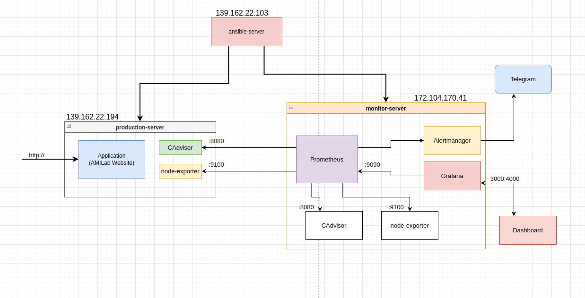
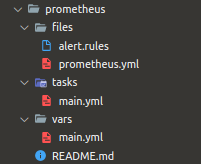
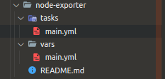
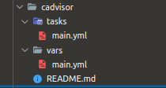
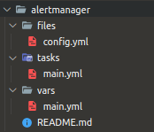
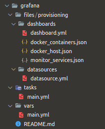
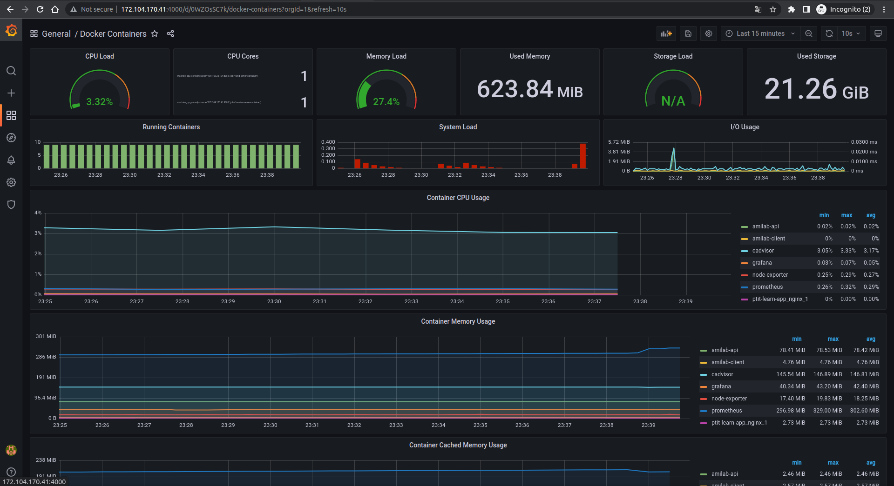
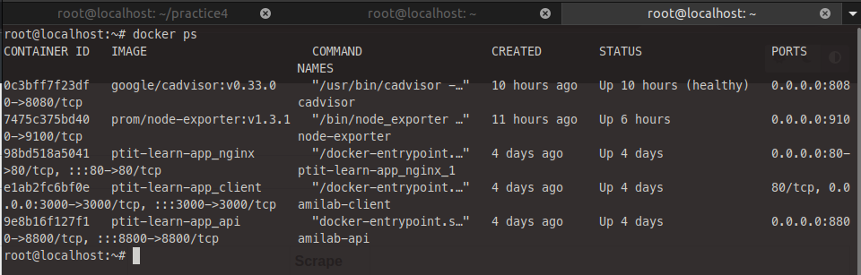
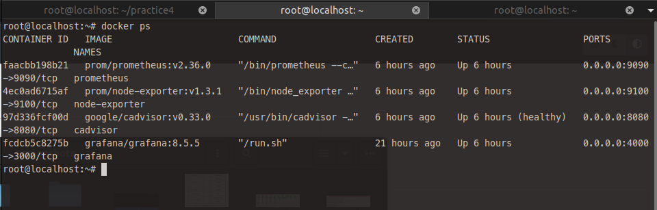

# **Viettel-Digital-Talent-2022: Pratice 4**

## **Task: Deploy stack Prometheus + Exporter + Alertmanager + Granfana**

## **Mục Lục**

- [**Viettel-Digital-Talent-2022: Pratice 4**](#viettel-digital-talent-2022-pratice-4)
  - [**Task: Deploy stack Prometheus + Exporter + Alertmanager + Granfana**](#task-deploy-stack-prometheus--exporter--alertmanager--granfana)
  - [**Mục Lục**](#mục-lục)
  - [**I. Overview**](#i-overview)
    - [**1. Prometheus**](#1-prometheus)
      - [**a. Prometheus là gì?**](#a-prometheus-là-gì)
      - [**b. Kiến trúc Prometheus**](#b-kiến-trúc-prometheus)
      - [**c. Một số khái niệm cơ bản**](#c-một-số-khái-niệm-cơ-bản)
    - [**2. Grafana**](#2-grafana)
    - [**3. Node-Exporter**](#3-node-exporter)
    - [**4. CAdvisor**](#4-cadvisor)
    - [**5. Alertmanager**](#5-alertmanager)
  - [**II. Practicing**](#ii-practicing)
    - [**1. Chuẩn bị**](#1-chuẩn-bị)
      - [**a. Kiến thức**](#a-kiến-thức)
      - [**b. Tài nguyên**](#b-tài-nguyên)
      - [**c. Mô hình triển khai**](#c-mô-hình-triển-khai)
    - [**2. Các bước cài đặt**](#2-các-bước-cài-đặt)
      - [**a. Prometheus**](#a-prometheus)
      - [**b. Node-Exporter**](#b-node-exporter)
      - [**c. CAdvisor**](#c-cadvisor)
      - [**d. Alertmanager**](#d-alertmanager)
      - [**e. Grafana**](#e-grafana)
      - [**f. Playbook to Run**](#f-playbook-to-run)
  - [**IV. Kiểm tra**](#iv-kiểm-tra)
  - [**V. LỜI KẾT**](#v-lời-kết)
  - [**VI. REF**](#vi-ref)

## **I. Overview**

### **1. Prometheus**


#### **a. Prometheus là gì?**

- Prometheus là một bộ công cụ giám sát và cảnh báo hệ thống mã nguồn mở ban đầu được xây dựng bởi công ty `SoundCloud`. Kể từ khi thành lập vào năm 2012, nhiều công ty và tổ chức đã áp dụng Prometheus vào hệ thống và dự án này có một cộng đồng người dùng và nhà phát triển rất tích cực.

- Prometheus bây giờ đã trở thành một dự án mã nguồn mở độc lập và được duy trì độc lập với bất kỳ công ty nào. Prometheus đã tham gia vào tổ chức Cloud Native Computing Foundation vào năm 2016 với tư cách là dự án được ưu tiên phát triển lớn thứ hai, sau Kubernetes (k8s).

- Prometheus có khả năng thu thập thông số/số liệu (metric) từ các mục tiêu được cấu hình theo các khoảng thời gian nhất định, đánh giá các biểu thức quy tắc, hiển thị kết quả và có thể kích hoạt cảnh báo nếu một số điều kiện được thảo mãn yêu cầu.

#### **b. Kiến trúc Prometheus**


- Prometheus thực hiện quá trình lấy các thông số/số liệu (metric) từ các job được chỉ định qua kênh trực tiếp hoặc thông qua dịch vụ Pushgateway trung gian. Sau đấy Prometheus sẽ lưu trữ các dữ liệu thu thập được ở local máy chủ. Tiếp đến sẽ chạy các rule để xử lý các dữ liệu theo nhu cầu cũng như kiểm tra thực hiện các cảnh báo mà bạn mong muốn.

- Các thành phần trong hệ thống Prometheus:
  
  - *Máy chủ Prometheus* đảm nhận việc lấy dữ liệu và lưu trữ dữ liệu time-series.
  
  - Thư việc client cho các ứng dụng.
  
  - *Push Gateway Prometheus:* sử dụng để hỗ trợ các job có thời gian thực hiện ngắn (tạm thời).  Đơn giản là các tác vụ công việc này không tồn tại lâu đủ để Prometheus chủ động lấy dữ liệu. Vì vậy là mà các dữ liệu chỉ số (metric) sẽ được đẩy về Push Gateway rồi đẩy về Prometheus Server.
  
  - Đa dạng *Exporter* hỗ trợ giám sát các dịch vụ hệ thống và gửi về Prometheus theo chuẩn Prometheus mong muốn.
  
  - *AlertManager:* dịch vụ quản lý, xử lý các cảnh báo (alert).
  
  - Và rất nhiều công cụ hỗ trợ khác,..

#### **c. Một số khái niệm cơ bản**

- Time-series Data: là một chuỗi các điểm dữ liệu, thường bao gồm các phép đo liên tiếp được thực hiện từ cùng một nguồn trong một khoảng thời gian.

- Alert : một cảnh báo (alert) là kết quả của việc đạt điều kiện thoả mãn một rule cảnh báo được cấu hình trong Prometheus. Các cảnh báo sẽ được gửi đến dịch vụ Alertmanager.

- Alertmanager: chương trình đảm nhận nhiệm vụ tiếp nhận, xử lý các hoạt động cảnh báo.

- Client Library: một số thư viện hỗ trợ người dùng có thể tự tuỳ chỉnh lập trình phương thức riêng để lấy dữ liệu từ hệ thống và đẩy dữ liệu metric về Prometheus.

- Endpoint: nguồn dữ liệu của các chỉ số (metric) mà Prometheus sẽ đi lấy thông tin.

- Exporter: exporter là một chương trình được sử dụng với mục đích thu thập, chuyển đổi các metric không ở dạng kiểu dữ liệu chuẩn Prometheus sang chuẩn dữ liệu Prometheus. Sau đấy exporter sẽ expose web service api chứa thông tin các metrics hoặc đẩy về Prometheus.

- Instance: một instance là một nhãn (label) dùng để định danh duy nhất cho một target trong một job .

- Job: là một tập hợp các target chung một nhóm mục đích. Ví dụ: giám sát một nhóm các dịch vụ database,… thì ta gọi đó là một job .

- PromQL: promql là viết tắt của Prometheus Query Language, ngôn ngữ này cho phép bạn thực hiện các hoạt động liên quan đến dữ liệu metric.

- Sample: sample là một giá trị đơn lẻ tại một thời điểm thời gian trong khoảng thời gian time series.

- Target: một target là định nghĩa một đối tượng sẽ được Prometheus đi lấy dữ liệu (scrape).Ví dụ như: nhãn nào sẽ được sử dụng cho đối tượng, hình thức chứng thực nào sử dụng hoặc các thông tin cần thiết để quá trình đi lấy dữ liệu ở đối tượng được diễn ra.

### **2. Grafana**


- Grafana là một nền tảng open-source chuyên phục vụ mục đích theo dõi và đánh giá các số liệu thu được, hỗ trợ rất nhiều loại dashboard và các loại graph khác nhau để người quản trị dễ dàng theo dõi.

- Grafana có thể truy xuất dữ liệu từ Graphite, Elasticsearch, OpenTSDB, Prometheus và InfluxDB. Grafana là một công cụ mạnh mẽ để truy xuất và biểu diễn dữ liệu dưới dạng các đồ thị và biểu đồ.

- Bất kì lĩnh vực nào có thể thu được dữ liệu theo dòng thời gian đều có thể hiển thị tối ưu trên Grafana. Ngoài khả năng kết nối đa dạng với các nguồn dữ liệu, phần giao diện của công cụ này rất thân thiền với người dùng. Dễ dàng đưa ra thông tin và cảnh báo.

### **3. Node-Exporter**

### **4. CAdvisor**

  

- cAdvisor là 1 dự án Open source của Google, mục đích để phân tích mức độ sử dụng, hiệu năng, và rất nhiều thông số khác từ các ứng dụng Container, cung cấp cho người dùng cái nhìn tổng quan về toàn bộ các container đang chạy.

### **5. Alertmanager**

## **II. Practicing**

- Assignment:
  - Deploy stack Prometheus + Exporter + Alertmanager + Grafana
    - Using docker, docker-compose, ansible to deploy
    - Bonus: run Prometheus + Alertmanager in a high availability
  - Define alert rules to monitoring host, containers…
  - Configure alertmanager to push alert to mail (or slack, telegram…)
  - Create the dashboards Grafana to monitoring host, container,..

### **1. Chuẩn bị**

#### **a. Kiến thức**

- Ansible: roles, j2, modules, tag, ...
- Docker
- Monitoring Tools: Prometheus, Grafana, Node-Exporter, CAdvisor, Alertmanager,..

#### **b. Tài nguyên**

- Để hoàn thành assignment này, mình sẽ sử dụng một phần kết quả từ assignment của tuần trước, đó là 1 web app full stack đã được containerize và deploy bằng ansible.
  - *Repo:* <https://github.com/ithaquaKr/practice3>
  - or <https://github.com/ithaquaKr/Viettel-Digital-Talent-Program-2022/tree/main/Practice-2/NguyenTuanHiep>

- Sau khi đã có sản phẩm được deploy trên môi trường production, ta sẽ bắt tay vào triển khai hệ thống monitoring.

#### **c. Mô hình triển khai**



### **2. Các bước cài đặt**

- Như đã đề cập, trong assignment này, ta dùng ansible roles, vì vậy trong phần cài đặt này ta sẽ đi viết từng role.

#### **a. Prometheus**

- Cấu trúc role:

  

- `tasks/main.yml`:

  ```yml
  ---
  - name: Copy Prometheus Config File
    copy: 
      src: prometheus.yml
      dest: ~/prometheus/

  - name: Copy Alert Role File
    copy: 
      src: alert.rules
      dest: ~/prometheus/

  - name: Create prometheus containers
    docker_container:
      name: "{{container_name}}"
      image: "{{ docker_images }}"
      volumes: "{{ container_volumes}}"
      command: "{{ container_command}}"
      ports:
        - 9090:9090
  ```

- `vars/main.yml`:

  ```yml
  ---
  container_name: prometheus
  docker_images: prom/prometheus:v2.36.0
  container_command:
    - '--config.file=/etc/prometheus/prometheus.yml'
    - '--storage.tsdb.path=/prometheus'
  container_volumes:
    - ~/prometheus:/etc/prometheus
    - prometheus-db:/prometheus
    - ~/prometheus/alert.rules:/alertmanager/alert.rules

  ```

- Trong prometheus role (và các role sau nữa :<) sử dụng 2 module để thực hiện tạo các container là module `docker_container` và module `copy`.
- Xem thêm về cách sử dụng 2 module trên tại:
- [docker-container] <https://docs.ansible.com/ansible/2.9/modules/docker_container_module.html>
- [copy] <https://docs.ansible.com/ansible/latest/collections/ansible/builtin/copy_module.html>
- Với việc sử dụng module của ansible thì ta không cần viết `dockerfile` nữa =)) chạy xong role là đã có các container hoạt động rồi.

- `files/prometheus.yml`:

  ```yml
  global:
    scrape_interval: 1s
    evaluation_interval: 15s
    external_labels:
      monitor: 'Project-technical-report'

  alerting:
    alertmanagers:
    - static_configs:
      - targets:
        - alertmanager:9093
  # Load and evaluate rules in this file every 'evaluation_interval' seconds.
  rule_files:
    - "alert.rules"

  scrape_configs:
    - job_name: prometheus
      scrape_interval: 5s
      scrape_timeout: 2s
      honor_labels: true
      static_configs:
      - targets: ['localhost:9090']
    
    - job_name: monitor-server-node
      scrape_interval: 5s
      scrape_timeout: 2s
      honor_labels: true
      static_configs:
      - targets: ['172.104.170.41:9100']

    - job_name: monitor-server-container
      scrape_interval: 5s
      scrape_timeout: 2s
      honor_labels: true
      static_configs:
      - targets: ['172.104.170.41:8080']

    - job_name: prod-server-node
      scrape_interval: 5s
      scrape_timeout: 2s
      honor_labels: true
      static_configs:
      - targets: ['139.162.22.194:9100']

    - job_name: prod-server-container
      scrape_interval: 5s
      scrape_timeout: 2s
      honor_labels: true
      static_configs:
      - targets: ['139.162.22.194:8080']

  ```

- Việc config cho Prometheus có thể chia làm 4 phần, bao gồm:
  - `global` : Chứa các config toàn cục cho prome
  - `alerting`: Config về alert (Như trong assign này thì ta dùng alertmanager đề cập ở phía sau)
  - `rule`: cấu hình rule
  - `scrape_config`: Ở đây ta cấu hình các job - (Trong Assign này mình cấu hình bao gồm 5 job, 1 job để theo target vào chính con prome, 2 job để theo dõi container và host cho production-server, 2 job để theo dõi container và host cho chính con server dùng làm monitor).

- `files/alert.rules`

  ```yml
  groups:
  - name: monitor-server
    rules:
    - alert: monitor_service_down
      expr: up == 0
      for: 30s
      labels:
        severity: critical
      annotations:
        summary: "Monitor service non-operational"
        description: "Service {{ $labels.instance }} is down."

    - alert: PrometheusTargetMissing
      expr: up == 0
      for: 0m
      labels:
        severity: critical
      annotations:
        summary: Prometheus target missing (instance {{ $labels.instance }})
        description: "A Prometheus target has disappeared. An exporter might be crashed.\n  VALUE = {{ $value }}\n  LABELS = {{ $labels }}"


  - name: product-server
    rules:
    - alert: HostOutOfMemory
      expr: node_memory_MemAvailable_bytes / node_memory_MemTotal_bytes * 100 < 10
      for: 2m
      labels:
        severity: warning
      annotations:
        summary: Host out of memory (instance {{ $labels.instance }})
        description: "Node memory is filling up (< 10% left)\n  VALUE = {{ $value }}\n  LABELS = {{ $labels }}"
    
    - alert: HostOutOfDiskSpace
      expr: (node_filesystem_avail_bytes * 100) / node_filesystem_size_bytes < 10 and ON (instance, device, mountpoint) node_filesystem_readonly == 0
      for: 2m
      labels:
        severity: warning
      annotations:
        summary: Host out of disk space (instance {{ $labels.instance }})
        description: "Disk is almost full (< 10% left)\n  VALUE = {{ $value }}\n  LABELS = {{ $labels }}"
      
    - alert: HostHighCpuLoad
      expr: 100 - (avg by(instance) (rate(node_cpu_seconds_total{mode="idle"}[2m])) * 100) > 80
      for: 0m
      labels:
        severity: warning
      annotations:
        summary: Host high CPU load (instance {{ $labels.instance }})
        description: "CPU load is > 80%\n  VALUE = {{ $value }}\n  LABELS = {{ $labels }}"

  - name: product-containers
    rules:
    - alert: ContainerCpuUsage
      expr: (sum(rate(container_cpu_usage_seconds_total{name!=""}[3m])) BY (instance, name) * 100) > 80
      for: 2m
      labels:
        severity: warning
      annotations:
        summary: Container CPU usage (instance {{ $labels.instance }})
        description: "Container CPU usage is above 80%\n  VALUE = {{ $value }}\n  LABELS = {{ $labels }}"
    
    - alert: ContainerMemoryUsage
      expr: (sum(container_memory_working_set_bytes{name!=""}) BY (instance, name) / sum(container_spec_memory_limit_bytes > 0) BY (instance, name) * 100) > 80
      for: 2m
      labels:
        severity: warning
      annotations:
        summary: Container Memory usage (instance {{ $labels.instance }})
        description: "Container Memory usage is above 80%\n  VALUE = {{ $value }}\n  LABELS = {{ $labels }}"
    
    - alert: ContainerVolumeUsage
      expr: (1 - (sum(container_fs_inodes_free{name!=""}) BY (instance) / sum(container_fs_inodes_total) BY (instance))) * 100 > 80
      for: 2m
      labels:
        severity: warning
      annotations:
        summary: Container Volume usage (instance {{ $labels.instance }})
        description: "Container Volume usage is above 80%\n  VALUE = {{ $value }}\n  LABELS = {{ $labels }}"

  ```

- File rule này dùng để định nghĩa các cảnh bảo, ở đây mình viết các rule cho container, host và cho chính con prome.
- Việc viết rule có thể tham khảo tại: <https://awesome-prometheus-alerts.grep.to/>

#### **b. Node-Exporter**

- rule này sẽ được cài vào server (Như mô hình) để có thể ghi lại các metrics về hoạt động của server (Như ram, cpu,...).
- Cấu trúc role:

  

- `tasks/main.yml`:

  ```yml
  ---
  - name: Create Node-Exporter containers
    docker_container:
      name: "{{container_name}}"
      image: "{{ docker_images }}"
      command: "{{ container_command}}"
      volumes: "{{ container_volumes}}"
      restart: yes
      ports:
        - 9100:9100
  ```

- `vars/main.yml`

  ```yml
  ---
  container_name: node-exporter
  docker_images: prom/node-exporter:v1.3.1
  container_command:
    - '--path.procfs=/host/proc' 
    - '--path.sysfs=/host/sys'
    - --collector.filesystem.ignored-mount-points
    - "^/(sys|proc|dev|host|etc|rootfs/var/lib/docker/containers|rootfs/var/lib/docker/overlay2|rootfs/run/docker/netns|rootfs/var/lib/docker/aufs)($$|/)"
  container_volumes:
    - /proc:/host/proc:ro
    - /sys:/host/sys:ro
    - /:/rootfs:ro
  ```

#### **c. CAdvisor**

- Giống như `node-exporter`, rule cadvisor này cũng được cài vào server để theo dõi các thông tin của các container đang chạy.
- Cấu trúc role:

  

- `tasks/main.yml`

  ```yml
  ---
  - name: Create Cadvisor containers
    docker_container:
      name: "{{container_name}}"
      image: "{{ docker_images }}"
      volumes: "{{ container_volumes}}"
      ports:
        - 8080:8080
  ```

- `vars/main.yml`

  ```yml
  ---
  container_name: cadvisor
  docker_images: google/cadvisor:v0.33.0
  container_volumes:
    - /:/rootfs:ro
    - /var/run:/var/run:rw
    - /sys:/sys:ro
    - /var/lib/docker/:/var/lib/docker:ro

  ```

#### **d. Alertmanager**

- Cấu trúc role:

  

- `tasks/main.yml`:

  ```yml
  ---
  - name: Copy AlertManager Config file
    copy:
      src: config.yml
      dest: ~/alertmanager/

  - name: Create AlertManager containers
    docker_container:
      name: "{{container_name}}"
      image: "{{ docker_images }}"
      volumes: "{{ container_volumes}}"
      command: "{{ container_command}}"
      restart: yes
      # ports:
      #   - 9093:9093
  ```

- `vars/main.yml`:

  ```yml
  ---
  container_name: alertmanager
  docker_images: prom/alertmanager:v0.24.0
  container_command:
    - '--config.file=/etc/alertmanager/config.yml'
    - '--storage.path=/alertmanager'
  container_volumes:
    - ./alertmanager:/etc/alertmanager
  ```

- `file/config`:

  ```yml
  route:
    receiver: 'telegram'
    group_by: ['alertname']
    repeat_interval: 3h

  receivers:
    - name: 'telegram'
      telegram_configs:
        - send_resolved: true
          api_url: 'https://api.telegram.org'
          bot_token: '5572355106:AAGz-mHulSaaWsj-rXgE-v1ur5KK-t6cj2Y'
          parse_mode: 'Markdown'
  ```

#### **e. Grafana**

- Cấu trúc role:

  

- `tasks/main.yml`:

  ```yml
  ---
  - name: Copy Grafana Config File
    copy: 
      src: provisioning
      dest: ~/grafana/

  - name: Create prometheus containers
    docker_container:
      name: "{{container_name}}"
      image: "{{ docker_images }}"
      volumes: "{{ container_volumes}}"
      restart: yes
      user: "472"
      ports:
        - 4000:3000
  ```

- =)) Ở đây mình có map port là `4000:3000`, cũng không có nguyên nhân gì đặc biệt, chỉ là mình thích mà thôi.

- `vars/main.yml`:

  ```yml
  ---
  container_name: grafana
  docker_images: grafana/grafana:8.5.5
  container_volumes:
    - grafana-db:/var/lib/grafana
    - ./grafana/provisioning/:/etc/grafana/provisioning/
  ```

- `files/provisioning/datasources/datasource.yml`:

  ```yml
  apiVersion: 1
  datasources:
    - name: Prometheus
      type: prometheus
      access: proxy
      orgId: 1
      url: http://172.104.170.41:9090
      basicAuth: false
      isDefault: true
      editable: true
  ```

- File `datasource.yml` này dùng để define nguồn mà grafana sẽ lấy dữ liệu, phần này ta có thể không dùng mà sẽ config trong GUI của grafana sau khi tạo cũng được.

- `files/provisioning/dashboard`:
  - Phần này là vẽ vời cái dashboard của bạn để hiển thị data, ở đây mình tham khảo dashboard từ repo: <https://github.com/Einsteinish/Docker-Compose-Prometheus-and-Grafana>

#### **f. Playbook to Run**

- Sau khi đã hoàn tất các role, việc còn lại là viết playbook để chạy.

- *Sau khi nhận lời khuyên từ mentor Ha Manh Dong trong assignment trước về việc viết playbook dùng tag, mình quyết định áp dụng ngay và luôn vào assignment lần này*

- `mysite.yml`:

  ```yml
  ---
  - name: install & configure docker & docker-compose on Ubuntu
    hosts: all
    become: true
    vars:
      docker_user: root
    roles:
      - docker
    tags: deploy-prod

  - name: deploy production server
    hosts: production
    become: true
    vars:
      github_branch: deploy-ansible
    roles:
      - deploy
    tags: deploy-prod

  - name: deploy monitor to production server
    hosts: production
    become: true
    roles:
      - cadvisor
      - node-exporter
    tags: deploy-monitor

  - name: create monitor server
    hosts: monitor
    become: true
    roles:
      - prometheus
      - grafana
      - alertmanager
      - cadvisor
      - node-exporter
    tags: monitoring
  ```

- Vậy là hoàn tất công đoạn viết code =)) Giờ thì chạy thử để kiểm tra.

## **IV. Kiểm tra**

- Check Prometheus:

  

- Check Grafana:

  

- Check `production-server`:

  

- Check `monitor-server`

  

## **V. LỜI KẾT**

- :(( Lí do có mục Lời kết này là để gửi lời xin lỗi tới các anh mentor và cũng xin lỗi chính mình vì cái assignment sơ sài này.
- Mục tiêu bài tập mình đặt ra khá nhiều nhưng vẫn còn nhiều thiếu sót như việc triển khai HA bằng docker-swarm, hay việc cấu hình chi tiết đầy đủ cho alertmanager để gửi cảnh báo mail, telegram cùng nhiều nhiều config khác.
- Mặc dù bản report báo cáo này sơ sài nhưng mình sẽ cố gắng hoàn thiện đầy đủ hơn sau khi thi xong tại trường :v, nếu khóa sau có đọc guide này của mình thì tìm đến link này: <https://github.com/ithaquaKr/practice4> để có phiên bản hoàn thiện xịn hơn nhé.

## **VI. REF**

<https://github.com/Einsteinish/Docker-Compose-Prometheus-and-Grafana>

<https://viblo.asia/p/monitoring-system-voi-grafana-prometheus-cadvisor-node-exporter-maGK7v6b5j2>

<https://stackoverflow.com/questions/72156056/alertmanager-docker-set-telegram-configs-bot-token-and-chat-id-from-environment>

- Ansible Modules:

<https://docs.ansible.com/ansible/2.9/modules/docker_container_module.html>

<https://docs.ansible.com/ansible/latest/collections/ansible/builtin/copy_module.html>
