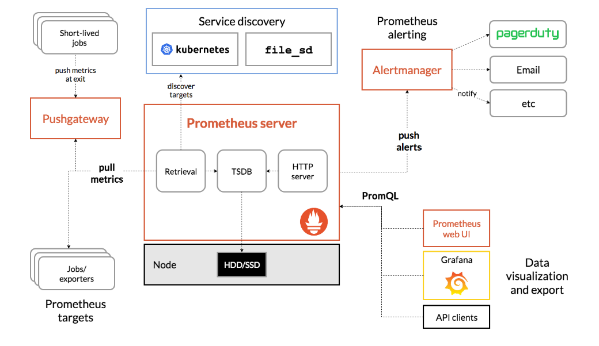
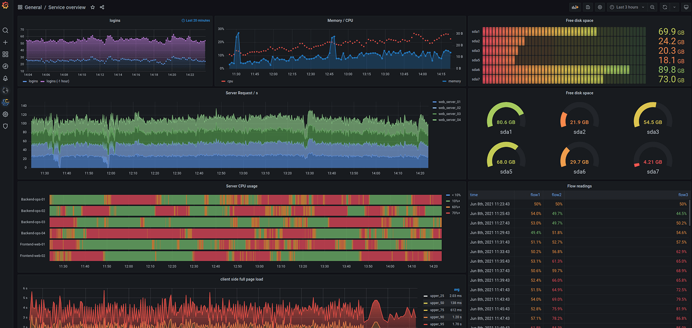
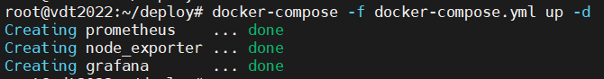
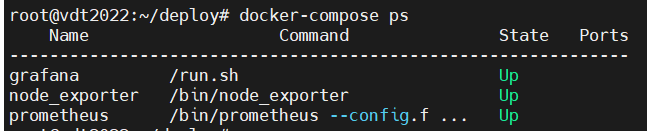
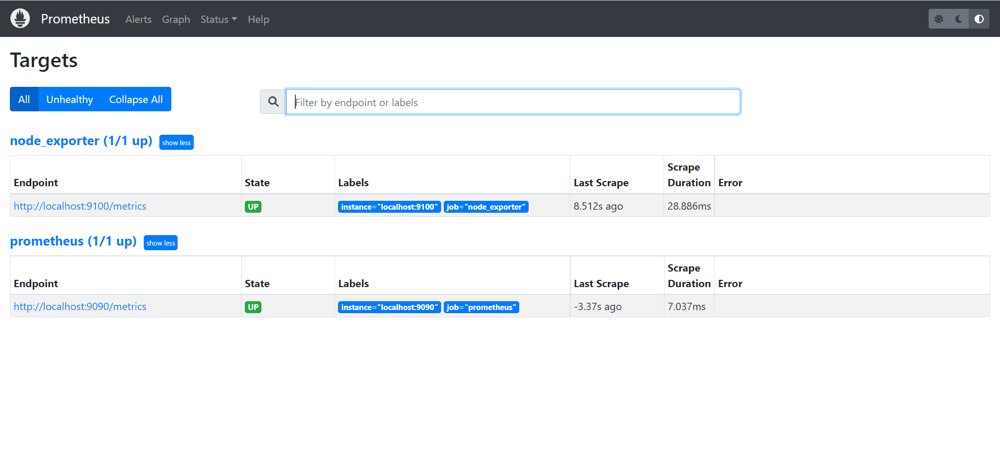
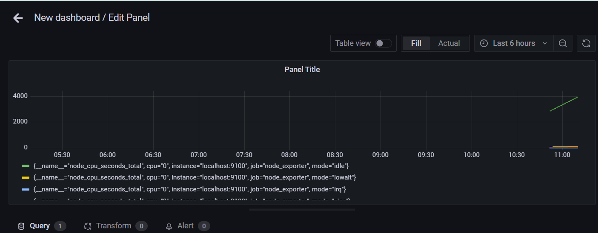

# Practice 4: Monitoring     
----       
## Table of contents   
 [I. Practice](#practice)         
 [II. Prerequisites](#prerequisites)     
 - [1. Prometheus](#prometheus)          
 - [2. Grafana](#grafana)     

 [III. Deploy stack Prometheus + Exporter + Alertmanager + Grafana using Docker-compose](#deploystackprometheus+exporter+alertmanager+grafanausingdocker-compose)   

 [IV. Define alert rules to monitoring host, container..](#definealertrulestomonitoringhostcontainer)    

 [V. Configure alertmanager to push alert to mail (or slack, telegram)...](#configurealertmanagertopushalerttomail)     

 [VI. Create the dashboards Grafana to monitoring host, container,...](#createthedashboardsGrafanatomonitoringhostcontainer)    

## [Tài liệu tham khảo](#tailieuthamkhao)   

----    

<a name='practice'></a>   
## I. Practice       
- Deploy stack Prometheus + Exporter + Alertmanager + Grafana    
   - Using docker, docker-compose, ansible to deploy    
   - Bonus: run Prometheus + Alertmanager in a high availability    
- Define alert rules to monitoring host, container,...   
- Configure alertmanager to push alert to mail (or slack, telegram ...)   
- Create the dashboards Grafana to monitoring host, container, ...   

<a name='prerequisites'></a>    
## II. Prerequisites    
<a name='prometheus'></a>   
### 1. Prometheus    
- Prometheus is an open-source systems monitorning and alerting toolkit originally built at `SoundCloud`.   
- Prometheus collects and stores its metrics as time series data, metrics information is stored with the timestamp at which it was recorded, alongside optional key-value pairs called labels.     
   - Monitoring system and timeseries database  
   - Metrics collection and storage 
   - Querying  
   - Alerting  
   - Dashboard      

- `Prometheus Architecture`   

     


  
### What is Monitor ?  
- OS (CPU, Memory, I/O, Network, Filesystem ...)   
- Hardware (Server, Switch, Storage device ...)   
- Containers (CPU, Memory, I/O ...)   
- Application, services (Throghtput, Latency,...)   

<a name='grafana'></a>  
### 2. Grafana   
- `Grafana` allows you to query, visualize, alert on and understand your metrics no matter where they are stored. Create, explore, and share dashboards with your team.
- `Grafana` open source is open source visualization and analytics software. It allows you to query, visualize, alert on, and explore your metrics, logs, and traces no matter where the are stored. It provides you with tools to turn your time-series database (TSDB) data into insightful graphs and visualizations.  

      

<a name='deploystackprometheus+exporter+alertmanager+grafanausingdocker-compose'></a>   

## III. Deploy stack Prometheus + Exporter + Alertmanager + Grafana using Docker-compose 
- Step 1: Install Prometheus + Exporter + Alert-manager  
    - [Link](https://prometheus.io/download/) download.              
```   
# Install Prometheus   
$ wget https://github.com/prometheus/prometheus/releases/download/v2.36.1/prometheus-2.36.1.linux-amd64.tar.gz  
$ tar -xzf 
 
```  

- Step 2: Create `docker-compose.yml` file which will define our `prometheus`, `node_exporter`, `alertmanager` and `grafana` services.   

```   
version: '2'
services:
  prometheus:
    image: prom/prometheus
    container_name: prometheus
    restart: always
    network_mode: host
    volumes:
      - './prometheus.yml:/etc/prometheus/prometheus.yml'
  grafana:
    image: grafana/grafana
    container_name: grafana
    environment:
      - GF_SECURITY_ADMIN_USER=admin
      - GF_SECURITY_ADMIN_PASSWORD=pass
      - GF_USERS_ALLOW_SIGN_UP=false
    restart: always
    network_mode: host
    depends_on:
      - prometheus
    volumes:
      - './grafana.ini:/etc/grafana/grafana.ini'
  node_exporter:
    image: quay.io/prometheus/node-exporter:latest
    container_name: node_exporter
    restart: unless-stopped
    network_mode: host
    volumes:
      - '/:/host:ro,rslave'

```   

- Step 3: Configuration file Prometheus, which Compose will read from `./prometheus.yml`       
   - `global`: Global Prometheus config defaults.   
   - `scrape_configs`: Defined scrape jobs.   
   - `remote_write`: Configuration for Prometheus to send scraped metrics to a remote endpoint.   

```  
global:
  scrape_interval: 15s # By default, scrape targets every 15 seconds.
  evaluation_interval: 15s # By default, scrape targets every 15 seconds.
  # scrape_timeout is set to the global default (10s).

  # Attach these labels to any time series or alerts when communicating with
  # external systems (federation, remote storage, Alertmanager).
  external_labels:
    monitor: 'example'
#
# # Alertmanager configuration
alerting:
  alertmanagers:
  - static_configs:
      - targets:
         - localhost:9093

# Load and evaluate rules in this file every 'evaluation_interval' seconds.
rule_files:
  - 'alert_rules.yml'

# A scrape configuration containing exactly one endpoint to scrape:
# Here it's Prometheus itself.

scrape_configs:
  - job_name: 'prometheus'
    scrape_interval: 5s
    static_configs:
       - targets: ['localhost:9090']

  # - job_name: 'JMX_Expoter'
  #   scrape_interval: 15s
  #   static_configs:
  #     - targets: ['localhost:7077']

  # - job_name: 'cAdvisor'
  #   scrape_interval: 5s
  #   static_configs:
  #     - targets: ['localhost:5601']
#
  # - job_name: 'spring-boot-angular-jboss'
  #   metrics_path: 'springboot2-jpa-crud-example-0.0.1-SNAPSHOT/actuator/prometheus'
  #   scrape_interval: 15s
  #   static_configs:
  #     - targets: ['localhost:8000']

  - job_name: 'node_exporter'
    scrape_interval: 15s
    static_configs:
       - targets: ['localhost:9100']

```  

- Step 3: Create file `grafana.ini`  
```   
[path]
provisioning = conf/provisioning

```  
- Step 4: Deploy using the `docker-compose` command.     
```  
$ docker-compose -f docker-compose.yml up -d  
```   
- flag `-d`: to run container in the background.    

   

- You can get container status using `docker-compose ps`:   
``` 
$ docker-compose ps    
```   
  

- Step 4: Finish 

   

<a name='definealertrulestomonitoringhostcontainer'></a>   
## IV. Define alert rules to monitoring host, container ...    

- File `alert_rules.yml`   
```   
groups:
- name: alert.rules
  rules:
  - alert: InstanceDown
    expr: up == 0
    for: 1m
    labels:
      severity: "critical"
    annotations:
      summary: "Endpoint {{ $labels.instance }} down"
      description: "{{ $labels.instance }} of job {{ $labels.job }} has been down for more than 1 minutes."
  
  - alert: HostOutOfMemory
    expr: node_memory_MemAvailable / node_memory_MemTotal * 100 < 25
    for: 5m
    labels:
      severity: warning
    annotations:
      summary: "Host out of memory (instance {{ $labels.instance }})"
      description: "Node memory is filling up (< 25% left)\n  VALUE = {{ $value }}\n  LABELS: {{ $labels }}"


  - alert: HostOutOfDiskSpace
    expr: (node_filesystem_avail{mountpoint="/"}  * 100) / node_filesystem_size{mountpoint="/"} < 50
    for: 1s
    labels:
      severity: warning
    annotations:
      summary: "Host out of disk space (instance {{ $labels.instance }})"
      description: "Disk is almost full (< 50% left)\n  VALUE = {{ $value }}\n  LABELS: {{ $labels }}"


  - alert: HostHighCpuLoad
    expr: (sum by (instance) (irate(node_cpu{job="node_exporter_metrics",mode="idle"}[5m]))) > 80
    for: 5m
    labels:
      severity: warning
    annotations:
      summary: "Host high CPU load (instance {{ $labels.instance }})"
      description: "CPU load is > 80%\n  VALUE = {{ $value }}\n  LABELS: {{ $labels }}"
```  


<a name='configurealertmanagertopushalerttomail'></a>     

## V. Configure alertmanager to push alert to mail (or slack, telegram)...    

- File `email_alertmanager.yml`    
```   
global:
 resolve_timeout: 1m

route:
 receiver: 'email-notifications'

receivers:
- name: 'email-notifications'
  email_configs:
  - to: <your_name>@gmail.com
    from: <your_name>@gmail.com
    smarthost: smtp.gmail.com:587
    auth_username: <your_name>@gmail.com
    auth_identity: <your_name>@gmail.com
    auth_password: password
    send_resolved: true
```  

<a name='createthedashboardsGrafanatomonitoringhostcontainer'></a>   

## VI. Create the dashboards Grafana to monitoring host, container, ...   
- Reference [Link](https://prometheus.io/docs/visualization/grafana/) 

   


<a name='tailieuthamkhao'></a>   
## Tài liệu tham khảo

[1] https://awesome-prometheus-alerts.grep.to/rules.html  
[2] https://prometheus.io/docs/visualization/grafana/  