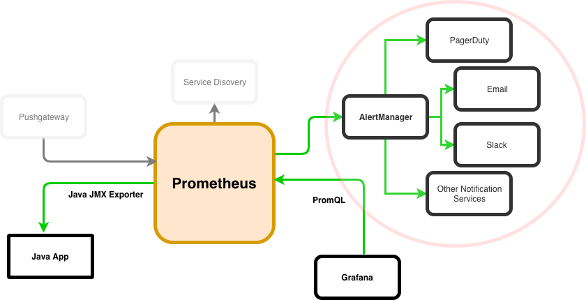
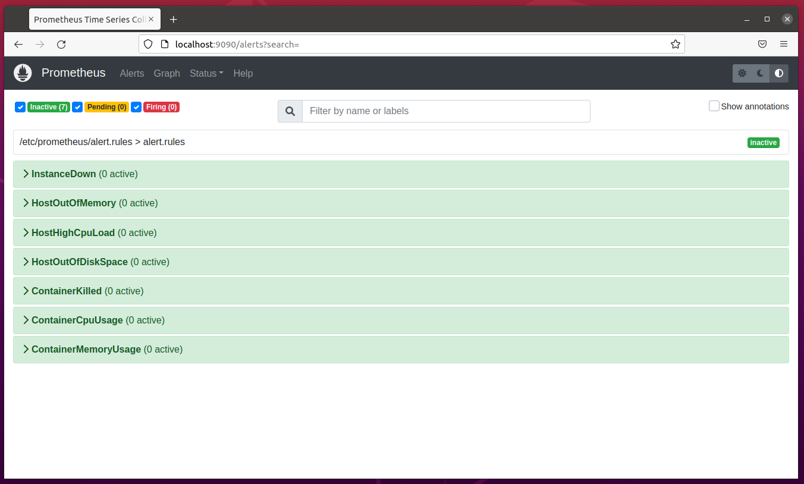
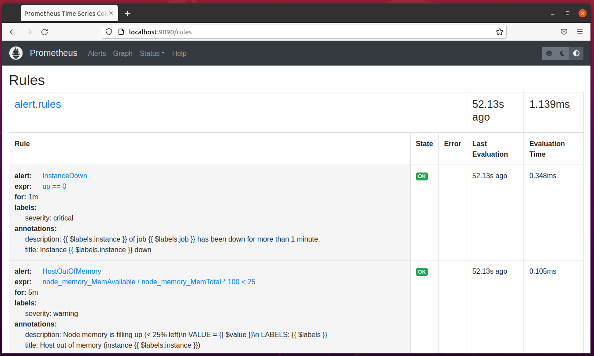
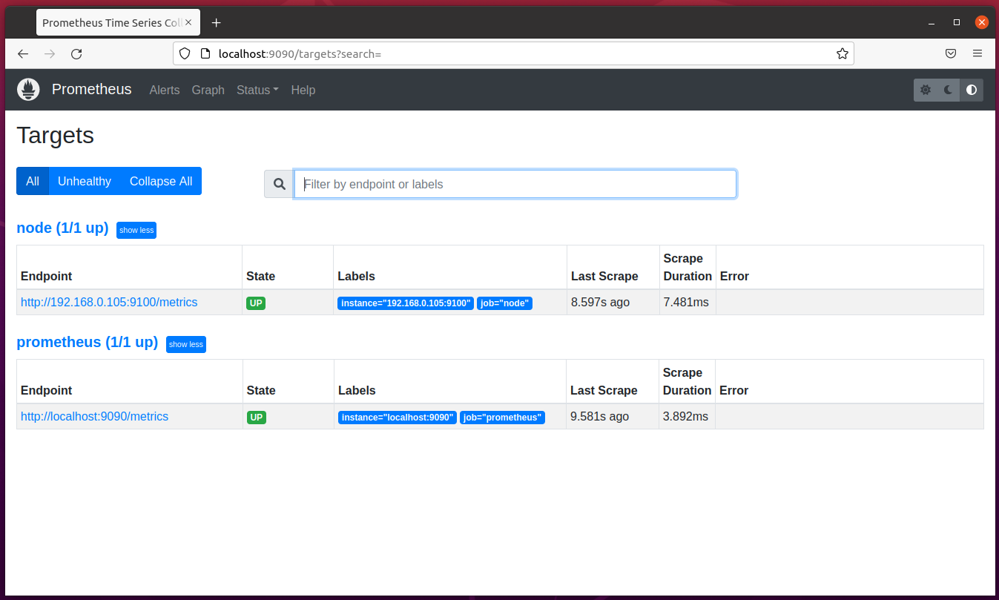
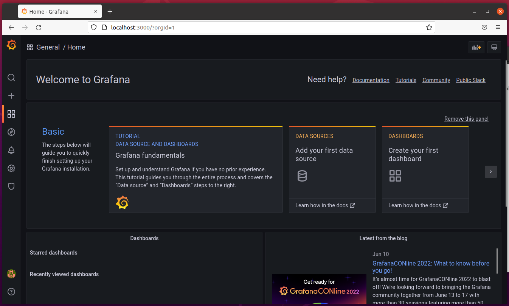
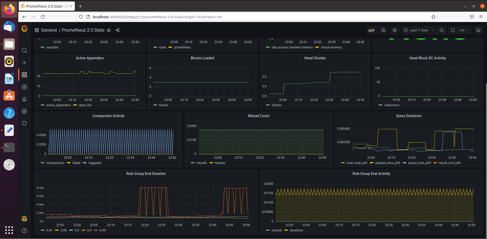
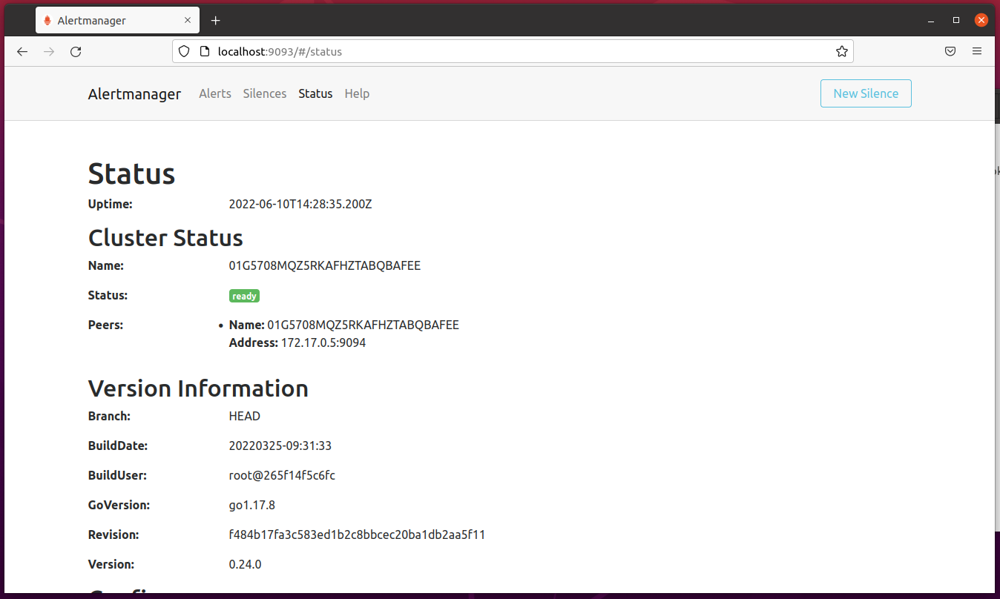
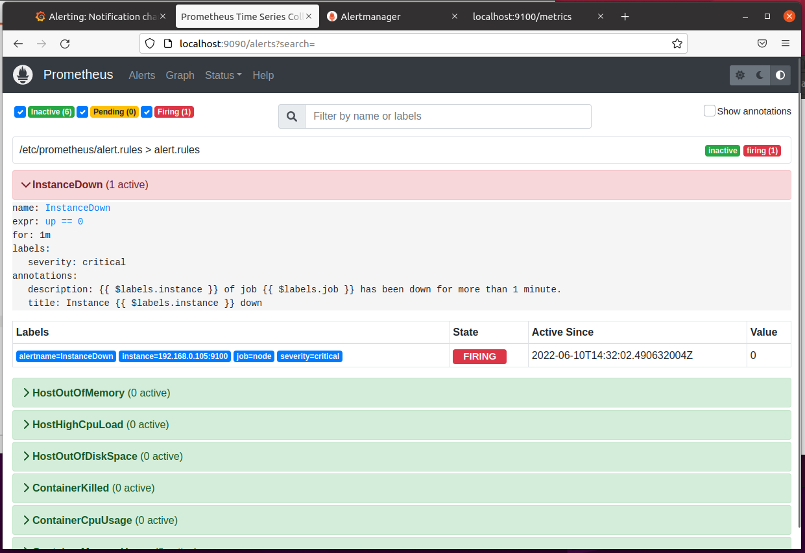

# PRACTICE-4 DEPLOY PROMETHEUS, GRAFANA, EXPORTER, ALERTMANAGER

---

### **Author:** *Phùng Hoàng Long* 

---

## I. Tổng quan

### 1. Prometheus

**Prometheus** là một công cụ khá mạnh về monitoring server được phát triển bởi SoundCloud.


Prometheus sẽ chủ động pull các `metrics` về qua `HTTP` sau mỗi khoảng thời gian được cài đặt trước, các metrics sẽ được biểu diễn dưới dạng `Time Series Database` - một dạng database được tối ưu cho việc lưu trữ dữ liệu theo các mốc thời gian. 

Bản thân các service thì thường không thể tự export được các metrics cho Prometheus mà cần đến các `Instructmentation/Exporter`.
- **Exporter** là những app được viết cho mấy cái thông dụng như Database, Server. Chúng ta chỉ cần chạy nó và nó sẽ export các metrics thu thập được cho mình.
- **Instructmentation** thì ám chỉ nhưng client-libraries được cung cấp bởi Prometheus hoặc một bên thứ 3 nào đó, để mình cài vào ứng dụng của mình, giúp tùy biến những metrics riêng của hệ thống. Kiểu như số lượng người đã login vào website của mình từng giờ chẳng hạn.


Một số exporter mình kể qua như:
- **Prometheus:** chính bản thân prometheus cũng có một built-in exporter, export các metrics về service prometheus ra tại URI: http://<prometheus_host>:<ip | default = 9090>/metrics
- **cAdvisor:** export các metrics của các docker service, các process trên server.
- **Node Exporter:** export các metrics một con node (hiểu là một server) như CPU, RAM của node, dung lượng ổ đĩa, số lượng request tới node đấy, .etc.
- **Postgres Exporte:** giúp đọc dữ liệu từ các bảng trong Postgres và export ra cho Prometheus
- **HAProxy Exporter**

### 2. Grafana


**Grafana** là một nền tảng open-source chuyên phục vụ mục đích theo dõi và đánh giá các số liệu thu được. Theo định nghĩa như vậy chúng ta có thể thấy tính ứng dụng của Grafana rất rộng chứ không chỉ trong khối IT. Bất kì lĩnh vực nào có thể thu được dữ liệu theo dòng thời gian đều có thể hiển thị tối ưu trên Grafana. Ngoài khả năng kết nối đa dạng với các nguồn dữ liệu, phần giao diện của công cụ này rất thân thiền với người dùng. Dễ dàng đưa ra thông tin và cảnh báo.

### 3. Alertmanager

**Alertmanager** là một hệ thống quản lý cảnh báo. Nó xử lý các cảnh báo được gửi bởi client application như Prometheus server và thực hiện kiểm tra trùng lặp, gộp nhóm và điều hướng chúng đến các thiết bị nhận như email, slack, telegram, ...



## II. DEPLOY

Mục tiêu của chúng ta là sẽ deploy stack với tính sẵn sàng cao (HA).

Vì vậy, chúng ta sẽ thực hiện deploy trên 2 node riêng biệt `[server1] 10.0.2.15` và `[server2] 192.168.0.105` 

Prometheus + Grafana sẽ được deploy trên `[server1]`
Node Exporter + Alertmanager sẽ được deploy trên `[server2]`

Trong bài này ta sẽ tiến hành theo thứ tự:
[1] Cài đặt Ansible <br>
[2] Cài đặt Docker <br>
[3] Cài đặt Prometheus<br>
[4] Cài đặt Grafana <br>
[5] Cài đặt Node Exporter<br>
[6] Cài đặt Alertmanager đẩy thông báo qua Telegram <br>
 
### 1. Ansible

Như practice2, ta sẽ thực hiện cài đặt Ansible như sau:
```
sudo apt update
sudo apt install software-properties-common
sudo add-apt-repository --yes --update ppa:ansible/ansible
sudo apt install ansible
```

Cấu hình Ansible bằng ansible.cfg
```
[defaults]
host_key_checking = False
inventory = ~/monitor/hosts

[privilege_escalation]
become = True
become_method = sudo
become_user = root
become_ask_pass = False

[ssh_connection]
pipelining=true
```

Cấu hình inventory được chi tiết trong file hosts
```
[server1]
10.0.2.15

[server2]
192.168.0.105

[all:vars]
ansible_ssh_user = {{your_user}}
ansible_ssh_pass = {{your_pass}}
ansible_become_pass = {{your_pass}}
```

### 2. Role Docker

Các tasks thực hiện cài đặt Docker và các package cần thiết
```
  - name: Install aptitude
    apt:
      name: aptitude
      state: latest
      
  - name: Install required system packages
    apt:
      name:
      - apt-transport-https
      - ca-certificates
      - curl
      - software-properties-common
      - python3-pip
      - virtualenv
      - python3-setuptools
      state: latest
       
  - name: Add Docker GPG apt Key
    apt_key:
      url: https://download.docker.com/linux/ubuntu/gpg
      state: present

  - name: Add Docker Repository
    apt_repository:
      repo: deb https://download.docker.com/linux/ubuntu focal stable
      state: present
        
  - name: Update apt and install docker-ce
    apt:
      name: docker-ce
      state: latest
      update_cache: true

  - name: Install Docker Module for Python
    pip:
      name: docker
```

### 3. Role Prometheus

Thực hiện các tasks sau để deploy Prometheus
```
  - name: Pull Prometheus Docker image
    docker_image:
      name: prom/prometheus:latest
      source: pull
    
  - name: Copy prometheus.yml file to /tmp
    copy:
      src: prometheus.yml
      dest: /tmp
  
  - name: Copy alert.rules file to /tmp
    copy:
      src: alert.rules
      dest: /tmp

  - name: Run Prometheus Docker image
    docker_container:
      name: prometheus
      image: prom/prometheus:latest
      restart_policy: unless-stopped
      volumes: 
      - /tmp/prometheus.yml:/etc/prometheus/prometheus.yml
      - /tmp/alert.rules:/etc/prometheus/alert.rules
      command:
      - '--config.file=/etc/prometheus/prometheus.yml'
      ports:
      - "9090:9090"
```

Cấu hình của Prometheus trong file prometheus.yml
```
global:
  scrape_interval: 15s

scrape_configs:
- job_name: prometheus
  static_configs:
  - targets:
    - localhost:9090

- job_name: node
  static_configs:
  - targets: 
    - 192.168.0.105:9100

alerting:
  alertmanagers:
  - static_configs:
    - targets:
      - 192.168.0.105:9093

rule_files:
  - "/etc/prometheus/alert.rules"
```

Trong đó, alert.rules là file định nghĩa những trường hợp sẽ được cảnh báo lên Prometheus weblocal

Trong đó bao gồm các cảnh báo:
[1] Dịch vụ nào đó đã sập <br>
[2] Máy chủ tràn bộ nhớ RAM <br>
[3] Máy chủ có CPU cao tải <br>
[4] Máy chủ hết dung lượng lưu trữ <br>
[5] Một dịch vụ Container bị sập <br>
[6] Container sử dụng nhiều bộ nhớ <br>
[7] Container sử dụng nhiều CPU (> 80%) <br>

Chi tiết file alert.rules tại <a href="alert.rules">Đây</a>

### 4. Role Grafana

Chạy các tasks sau để deploy Grafana
```
  - name: Pull Grafana Docker image
    docker_image:
      name: grafana/grafana-enterprise
      source: pull
    
  - name: Run Grafana Docker image
    docker_container:
      name: grafana
      image: grafana/grafana-enterprise
      restart_policy: unless-stopped
      ports:
      - "3000:3000"
```

### 5. Role Node Exporter

Thực hiện các tasks sau để deploy Node Exporter
```
- name: Pull Node Exporter Docker image
    docker_image:
      name: prom/node-exporter:latest
      source: pull
    
  - name: Run Node Exporter Docker image
    docker_container:
      name: node-exporter
      image: prom/node-exporter:latest
      restart_policy: unless-stopped
      ports: 
      - "9100:9100"
```

### 6. Role Alertmanager

Thực hiện các tasks sau để deploy Alertmanager
```
  - name: Pull Alertmanager Docker image
    docker_image:
      name: prom/alertmanager:latest
      source: pull

  - name: alertmanager.yml file to /tmp
    copy:
      src: alertmanager.yml
      dest: /tmp

  - name: Run Alertmanager Docker image
    docker_container:
      name: alertmanager
      image: prom/alertmanager:latest
      ports:
      - "9093:9093"
      restart_policy: unless-stopped
      volumes:
        - /tmp/alertmanager.yml:/alertmanager.yml
      command:
          - '--config.file=/alertmanager.yml'
```

Trong đó, file alertmanager.yml dùng để cấu hình Alert manager đẩy cảnh báo về Telegram
```
global:
  resolve_timeout: 1m

route:
  group_by: ['alertname']
  group_wait: 10s
  group_interval: 10s
  repeat_interval: 1h
  receiver: 'telegram-notifications'
receivers:
- name: 'telegram-notifications'
  telegram_configs:
  - bot_token: '{{bot_token}}'
    chat_id: {{your_chat_group_id}}
    send_resolved: true
    api_url: 'https://api.telegram.org'
    parse_mode: 'Markdown'
    
inhibit_rules:
  - source_match:
      severity: 'critical'
    target_match:
      severity: 'warning'
    equal: ['alertname', 'dev', 'instance']
```

Cảnh báo sẽ được gửi tự động bởi Bot của Telegram, để tạo Bot tham khảo tại <a href="https://core.telegram.org/bots">Đây</a> và bot của bạn cũng sẽ được cung cấp một {{bot_token}}.
Sau khi tạo Bot, bạn thực hiện tạo nhóm chat giữa Bot và các thành viên khác, id của nhóm chat đó sẽ là {{your_chat_group_id}}.

### 7. Final deploy

Thực hiện các roles trong file `main.yml`
```
---
- name: install & config Docker
  host: all
  become: true
  roles:
    - docker

- name: deploy monitor server
  host: server1
  become: true
  roles:
    - prometheus
    - grafana

- name: deploy exporter & alertmanager
  host: server2
  become: true
  roles:
    - node-exporter
    - alertmanager
```

Chạy câu lệnh ansible để deploy
```
ansible-playbook -i hosts playbook.yml
```

**Chạy thành công và tiến hành check**

Check Prometheus alert:



Như chúng ta thấy, Prometheus đang lấy Metrics từ chính nó `http://localhost:9090/metrics` và từ `http://192.168.0.105:9100/metrics` chính là Node Exporter


Check Grafana:


Sau khi import data từ Prometheus


Check Alertmanager status


Để check thông báo đẩy về Telegram, ta sẽ thử kill Node Exporter



