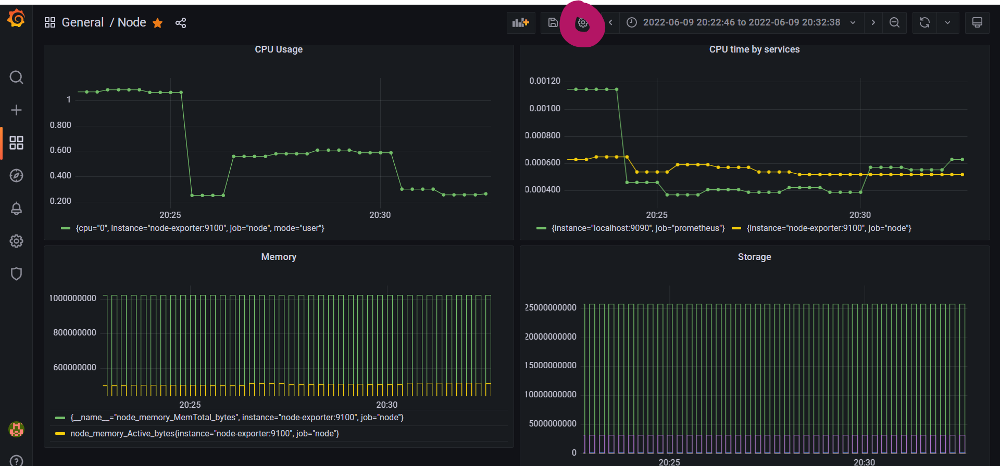
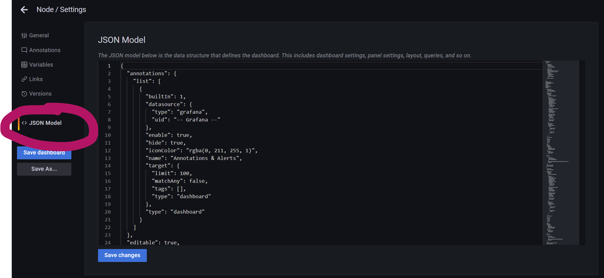
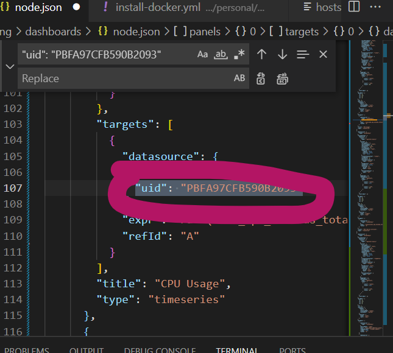

# **MONITORING**


# **Table of contents**

## [1. Build Custom images](#custom-image)
## [2. Build Docker-compose files](#docker-compose)
## [3. Deploy with Ansible](#ansible)


## **TASK**: Deploy Prometheus - Grafana stack

<a name='custom-image'></a>
### **Step 1:**  Build custom images

We need 3 docker containers running, including:
- Node Exporter
- Prometheus
- Grafana

Two of them need custom images
#### **Step 1.1:** Prometheus
We need a custom prometheus.yml file like below:
```
global:
  scrape_interval: 1m

rule_files:
  - "alert.rules"

scrape_configs:
  - job_name: "prometheus"
    scrape_interval: 1m
    static_configs:
    - targets: ["localhost:9090"]

  - job_name: "node"
    static_configs:
    - targets: ["node-exporter:9100"]

alerting:
  alertmanagers:
  - scheme: http
    static_configs:
    - targets: 
      - 'alertmanager:9093'
```
Which means Prometheus will scrape the status of 2 jobs: prometheus and node-exporter each 1m. It will use alert manager at port 9093 also (if two services on the same docker network)

Prometheus dockerfile:
```
FROM prom/prometheus:latest

COPY prometheus.yml /etc/prometheus/prometheus.yml

COPY alert.rules /etc/prometheus/alert.rules
```

#### **Step 1.2:** Grafana
We need two canonical files: dashboard.yml and datasource.yml with the hierarchy like below:
```
grafana
-- dashboards
    -- dashboard.yml
    -- <dashboard_name>.json
-- datasources
    -- datasource.yml
```
Content of datasource.yml file:
```
# config file version
apiVersion: 1

# list of datasources that should be deleted from the database
deleteDatasources:
  - name: Prometheus
    orgId: 1

# list of datasources to insert/update depending
# whats available in the database
datasources:
  # <string, required> name of the datasource. Required
- name: Prometheus
  # <string, required> datasource type. Required
  type: prometheus
  # <string, required> access mode. direct or proxy. Required
  access: proxy
  # <int> org id. will default to orgId 1 if not specified
  orgId: 1
  # <string> url
  url: <REPLACE WITH YOUR SERVICE URL>
  # <string> database password, if used
  password:
  # <string> database user, if used
  user:
  # <string> database name, if used
  database:
  # <bool> enable/disable basic auth
  basicAuth: false
  # <string> basic auth username, if used
  basicAuthUser:
  # <string> basic auth password, if used
  basicAuthPassword:
  # <bool> enable/disable with credentials headers
  withCredentials:
  # <bool> mark as default datasource. Max one per org
  isDefault: true
  # <map> fields that will be converted to json and stored in json_data
  jsonData:
     graphiteVersion: "1.1"
     tlsAuth: false
     tlsAuthWithCACert: false
  # <string> json object of data that will be encrypted.
  secureJsonData:
    tlsCACert: "..."
    tlsClientCert: "..."
    tlsClientKey: "..."
  version: 1
  # <bool> allow users to edit datasources from the UI.
  editable: true
```
Content of dashboard.yml file:
```
apiVersion: 1

providers:
- name: 'Prometheus'
  orgId: 1
  folder: ''
  type: file
  disableDeletion: false
  editable: true
  options:
    path: /etc/grafana/provisioning/dashboards
```

In <dashboard_name>.json file, we have the configs for a dashboard. We can get after deploying grafana container without having any json file and design it later.

### **Step 1.3**: Alert Manager
Prometheus' alert.rules:
```
groups:
- name: alert
  rules:
  - alert: full_storage
    expr: node_filesystem_size_bytes - node_filesystem_free_bytes < 100000
    for: 10s
    labels:
      severity: critical
    annotations:
      summary: "Toang"
      description: "Toang"
- name: alert
  rules:
  - alert: cho_vui
    expr: up{instance="localhost:9090", job="prometheus"} == 1
    for: 10s
    labels:
      severity: critical
    annotations:
      summary: "Còn lâu mới toang, báo cho vui thôi"
      description: "Mệt"
```
Reference: [Setting with Slack](https://grafana.com/blog/2020/02/25/step-by-step-guide-to-setting-up-prometheus-alertmanager-with-slack-pagerduty-and-gmail/)

#### **Substep**: ***Designing a Grafana dashboard and get a json file***

After starting a Grafana container where ever you want with the config above, we access Grafana service with username = admin and password = admin. A web UI like below should appear


We then click "Add panel" to create a chart/illustration for our figures


Customize panels to suit our need:


Save those panels



Get the JSON file



Remove "uid" fields since they are generated values each time Grafana is reconstructed:



<a name='docker-compose'></a>
### **Step 2**: Build Docker-compose files

We are going to use Node-exporter and Prometheus to monitor one server, while Grafana is used in High Availability mode (multinode)

Docker-compose file for node that we are trying to monitor:

```
version: '3'

networks:
  monitoring:
    driver: bridge
    
volumes:
  prometheus_data: {}

services:
  node-exporter:
    image: prom/node-exporter:latest
    container_name: node-exporter
    restart: unless-stopped
    volumes:
      - /proc:/host/proc:ro
      - /sys:/host/sys:ro
      - /:/rootfs:ro
    command:
      - '--path.procfs=/host/proc'
      - '--path.rootfs=/rootfs'
      - '--path.sysfs=/host/sys'
      - '--collector.filesystem.mount-points-exclude=^/(sys|proc|dev|host|etc)($$|/)'
    expose:
      - 9100
    networks:
      - monitoring

  prometheus:
    image: haitranquangofficial/hw4-viettel:prometheus
    container_name: prometheus
    restart: unless-stopped
    command:
      - '--config.file=/etc/prometheus/prometheus.yml'
      - '--storage.tsdb.path=/prometheus'
      - '--web.console.libraries=/etc/prometheus/console_libraries'
      - '--web.console.templates=/etc/prometheus/consoles'
      - '--web.enable-lifecycle'
    expose:
      - 9090
    ports:
      - 9090:9090
    networks:
      - monitoring
```

Docker-compose for Grafana node:
```
version: '3'
services:
  grafana:
    image: haitranquangofficial/hw4-viettel:grafana
    container_name: grafana

      # - grafana_data:/var/lib/grafana
      # - ./grafana/provisioning:/etc/grafana/provisioning
    environment:
      - GF_SECURITY_ADMIN_USER=<Replace with your user name>
      - GF_SECURITY_ADMIN_PASSWORD=<Replace with your password>
      - GF_USERS_ALLOW_SIGN_UP=false
    restart: unless-stopped
    ports:
      - 9192:3000
volumes:
  grafana:
```

<a name='ansible'></a>
### **Step 3**: Deploy with Ansible

Assuming that the local machine has already set up SSH connection with public authentication for all the IP addresses used in this deployment step. This document may be a good reference for it. [Ansible - SSH](https://github.com/haitranquang-official/Viettel-Digital-Talent-Program-2022/blob/main/Practice-2/Tran-Quang-Hai/Ansible.md)

### **Step 3.1**: Create Docker context

Create docker context on local machine for Grafana nodes:
```
- name: Create Docker context for Grafana nodes
  become_user: <your_user_name - usually root>
  shell: docker context create {{item.name}} --docker "host=ssh://root@{{item.ip}}"
  ignore_errors: true
  tags: 
    - local
  loop: 
    - {name: 'context_name', ip: 'ip_address'} 
    - {name: 'context_name', ip: 'ip_address'}
```
Similar for Prometheus node, actually these two files can be combined since there are no difference between them

### **Step 3.2**: Deploy docker-compose files

For all nodes (with Grafana as an example):

```
- name: Deploy Grafana on Grafana nodes
  become_user: haivm
  shell: | 
    docker context use {{item.name}} 
    docker-compose -f {{item.file_path}} pull
    docker-compose -f {{item.file_path}} up -d
  ignore_errors: true
  tags: 
    - local
  loop:
    - {name: 'name_from_previous_step', file_path = 'compose_file_path'}
    - {name: 'name_from_previous_step', file_path = 'compose_file_path'}
```

### **Step 3.3**: Port configuration

Each services will use a specific port, to allow we need to config Linux firewall:

```
- name: Allow Port 'X'
  become: true
  shell: ufw allow 'X' | ufw enable | ufw reload
```

### **Step 3.4**: Assemble and run playbook

Structure of ansible files:


assemble.yml content:

```
- hosts: servers
  become: true
  roles:
    - servers

- hosts: grafana
  become: true
  roles: 
    - grafana

- hosts: prometheus
  become: true
  roles:
    - prometheus

- hosts: ha
  become: true
  roles:
    - ha
  
- hosts: local
  become: true
  roles:
    - local
  tags: 
    - local
```

Run command below:
```
ansible-playbook -i <path_to_hosts_file> <path_to_inventory_file>
```

Final Result:

Login with the credentials in docker-compose file

