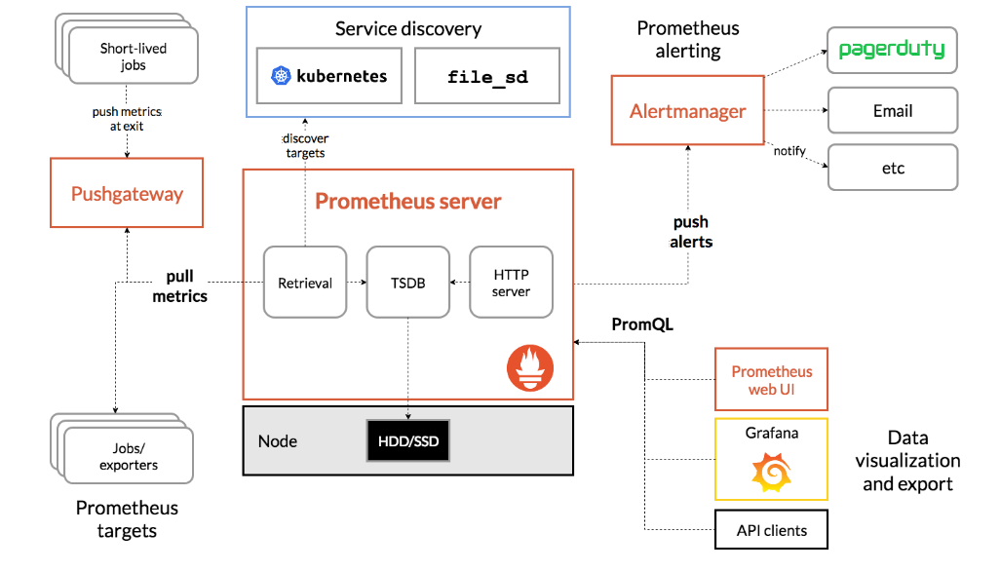
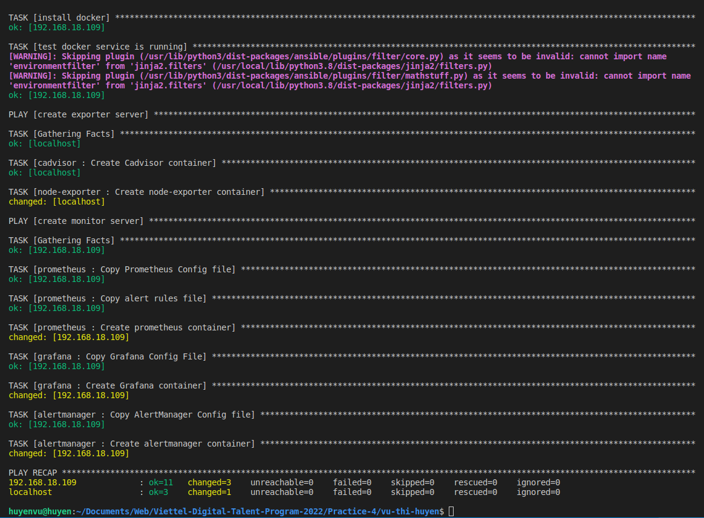
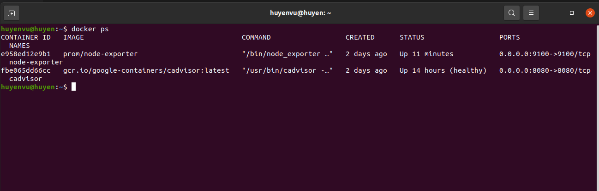
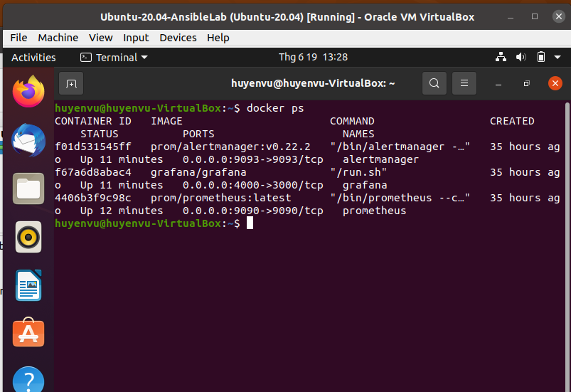
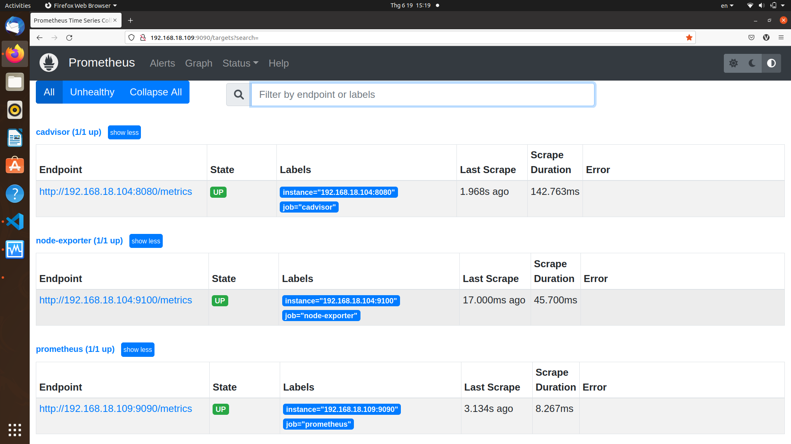
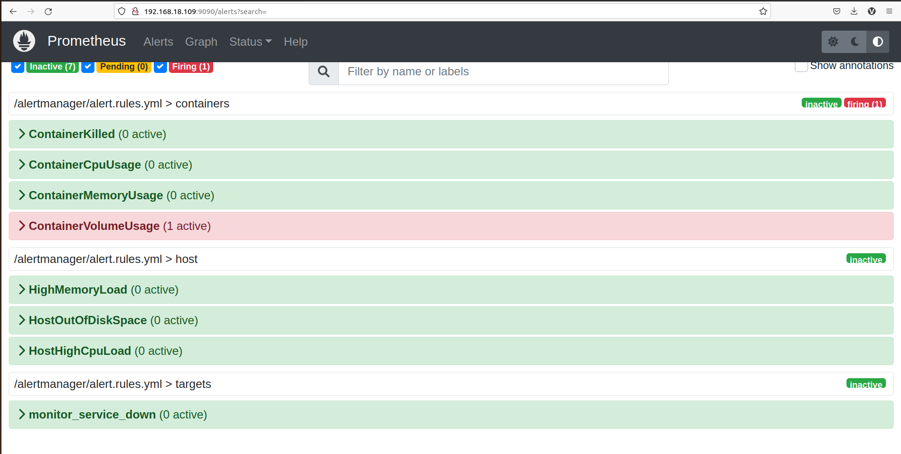
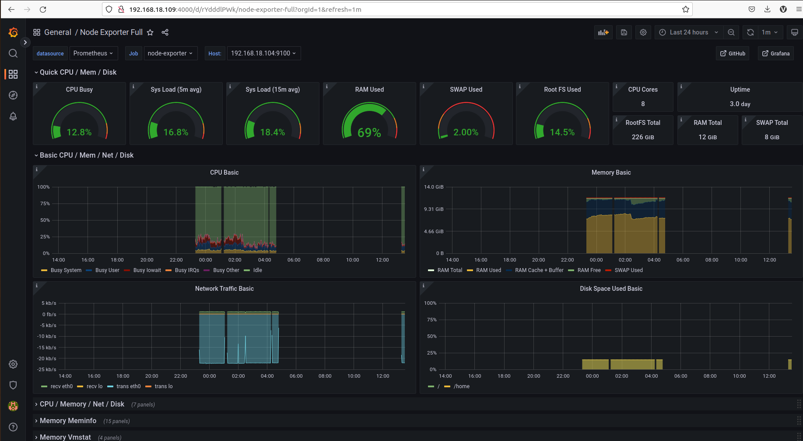
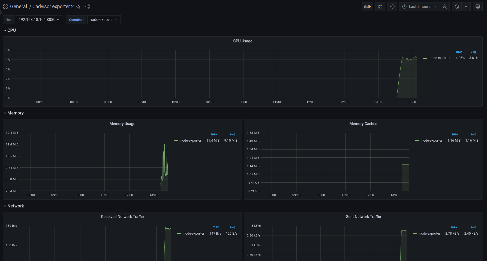
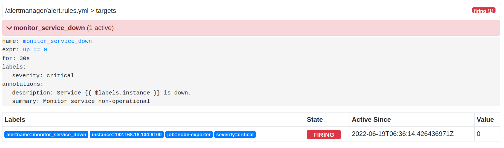
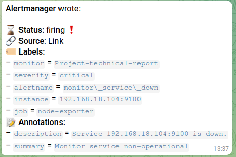

# **Tìm hiểu và thực hành về Prometheus-Grafana**

## **1. Overview**

### *1.1 Prometheus*


* Prometheus là gì?

    Prometheus là một dịch vụ mã nguồn mở giúp theo dõi và cảnh báo về hệ thống. Tính năng quan trọng nhất của Prometheus là thu thập thông số, dữ liệu từ các mục tiêu (dịch vụ) được nhắm đến theo khoảng thời gian nhất định đã được cài đặt trước. 

    Prometheus thu thập và lưu trữ các số liệu (metrics) dưới dạng time-series , tức là các số liệu được lưu trữ cùng với timestamp của thời điểm nó được ghi lại cùng với các cặp key-value gọi là các nhãn (label). Các metrics có thể là lượng RAM, CPU đã dùng của mỗi service, số lượng requests tới server, dung lượng đĩa, ... 

    > Time-series database: là các database chuyên dụng được tối ưu để lưu trữ dữ liệu theo các mốc thời gian, tức là các metrics luôn gắn với timestamp, tạo thành một chuỗi dữ liệu theo thời gian. 

* Một số tính năng của Prometheus

    * Mô hình dữ liệu Time series đặc biệt phù hợp để theo dõi số liệu theo thời gian
    * Có ngôn ngữ truy vấn riêng PromQL rất mạnh mẽ
    * Không phụ thuộc vào lưu trữ phân tán; Các nút máy chủ đơn lẻ là tự trị
    * Thu thập time series bằng cách pull qua HTTP
    * Hỗ trợ Push Gateway (khi làm việc với các dịch vụ tồn tại trong thời gian ngắn và hủy sau khi hoàn thành)
    * Có hỗ trợ Service discovery hoặc cấu hình tĩnh để tìm, nhắm mục tiêu cần theo dõi
    * Nhiều chế độ hỗ trợ biểu đồ và bảng điều khiển

* Kiến trúc của Prometheus

    

    Cái hay của Prometheus đó là nó chủ động đi lấy dữ liệu theo dõi chứ không đợi các dịch vụ trả về. Vì vậy luôn đảm bảo phát hiện sớm những vấn đề có thể gây lỗi nghiêm trọng trong hệ thống. 

    Theo lịch trình đã cài đặt Prometheus sẽ tự động thực hiện quá trình lấy các thông số/số liệu (metric) từ các dịch vụ, mục tiêu được chỉ định qua kết nối trực tiếp hoặc thông qua dịch vụ Pushgateway trung gian. Sau đó Prometheus sẽ lưu trữ các dữ liệu thu thập được ở máy chủ đang chạy. Tiếp đến là kiểm tra các rule đã được cài đặt để xử lý các dữ liệu theo nhu cầu cũng như kiểm tra và thực hiện các cảnh báo.

    * Các thành phần chính

        * Máy chủ Prometheus.
        * Thư viện kết nối đến máy chủ Prometheus cho các ứng dụng. (Có thể sử dụng dạng JSON nếu không có thư viện hỗ trợ)
        * Push Gateway Prometheus: sử dụng để hỗ trợ các job có thời gian thực hiện ngắn (tạm thời). Đơn giản là các tác vụ công việc này không tồn tại lâu đủ để Prometheus chủ động lấy dữ liệu. Vì vậy là mà các dữ liệu chỉ số (metric) sẽ được đẩy về Push Gateway rồi đẩy về Prometheus Server.
        * Exporter hỗ trợ giám sát các dịch vụ hệ thống và gửi về Prometheus theo chuẩn Prometheus mong muốn.
        * AlertManager: dịch vụ quản lý, xử lý các cảnh báo (alert).
        
### *1.2 Grafana*

    

* Grafana là gì ?

    Grafana là một nền tảng open-source chuyên phục vụ mục đích theo dõi và đánh giá các số liệu thu được. Nó cho phép bạn truy vấn, trực quan hóa, cảnh báo và hiểu dữ liệu của bạn bất kể nó được lưu trữ ở đâu. 

### *1.3 Alertmanager*

Alertmanager là một công cụ để tự động gửi Alerts thông qua các dịch vụ khác nhau như email, slack, ms teams hay webhook.cAlertmanager xử lý cảnh báo được gửi bởi ứng dụng như là Prometheus server. Nó có các cơ chế Grouping, Inhibition, Silience.

### *1.4 Cadvisor*

cAdvisor là 1 dự án Open source của Google, mục đích để phân tích mức độ sử dụng, hiệu năng, và rất nhiều thông số khác từ các ứng dụng Container, cung cấp cho người dùng cái nhìn tổng quan về toàn bộ các container đang chạy.

### *1.5 Node-exporter*

Node Exporter cũng là một datasource nhưng nó sẽ thiên về việc lấy các dữ liệu phần cứng từ hệ thống của chúng ta hơn, như các thông số về CPU, RAMnhư các thông số về CPU, RAM.

## **2. Thực hành**

- Deploy stack Prometheus + Exporter + Alertmanager + Grafana
    - Using docker, docker-compose, ansible to deploy
    - Bonus: run Prometheus + Alertmanager in a high availability
- Define alert rules to monitoring host, containers…
- Configure alertmanager to push alert to mail (or slack, telegram…)
- Create the dashboards Grafana to monitoring host, container, ….

* Nội triển khai: 

    Ở bài này em sẽ sử dụng: 
    * Ubuntu 20.04 (`192.168.18.104`): chạy các container Cadvisor (port 8080) và Node-exporter (port 9100)
    * Ubuntu 20.04 VM (`192.168.18.109`): chạy Grafana (port 9090), Prometheus (port 4000) và AlertManager (port 9093)

    Các alert sẽ được gửi tới Telegram thông qua Telepush api như sau:
    ```
    Prometheus --> Alertmanager --> Telepush API --> Telegram
    ```

    Do đó, cần tạo một token từ Telepush, truy cập [Telepush](https://t.me/MiddlemanBot) và gửi `/start` để nhận một token và lưu lại.

    Khi muốn apply các config cho alertmanager cần reload lại như sau:

    ```
    curl -X POST http://192.168.18.109:9093/-/reload
    ```

* Chạy file `playbook.yml` để triển khai:

    

* Kiểm tra xem các container đã chạy hay chưa

    

    

* Kiểm tra các targets của Prometheus

    

* Kiểm tra các alert rules cho Prometheus: 

    

* Dashboards của Grafana:

    

    

* Thử stop container 'node-exporters' để kiểm tra Alertmanager:

    

* Kiểm tra alert đã được gửi tới telegram thông qua Telepush:

    

    