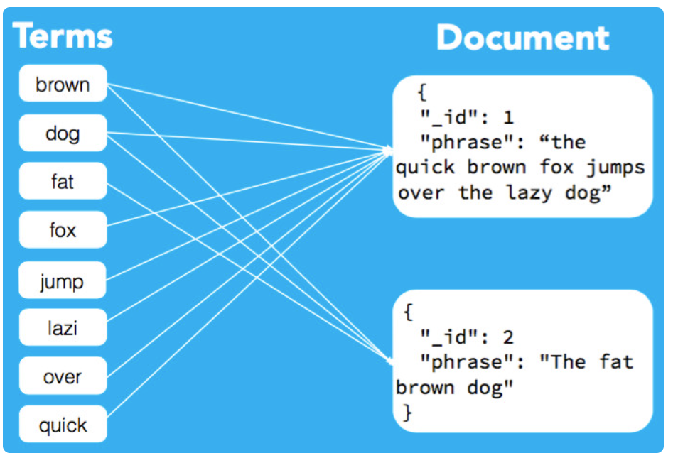

#  Tìm hiểu về Elasticsearch
## Mục lục
- [I. Bài tập 1](#I-Bài-tập-1)
  - [1. Elasticsearch là gì?](#1-Elasticsearch-là-gì?)
  - [2.Cách thức hoạt động Elasticsearch](#2-Cách-thức-hoạt-động-Elasticsearch)
  - [3. Các khái niệm liên quan đến Elasticsearch](#3-Các-khái-niệm-liên-quan-đến-Elasticsearch)
    - [3.1 Document](#31-Document)
    - [3.2 Inverted Index](#32-Inverted-Index)
    - [3.3 Shard h](#33-Shard)
    - [3.4 Node ](#34-Node)
    - [3.5 Cluster](#34-Cluster)
  - [4. Cài đặt Elasticsearch](#4-Cài-đặt-Elasticsearch)
  - [5. Một số câu lệnh phổ biến](#5-Một-số-câu-lệnh-phổ-biến)
    - [5.1 Match query](#51-Match-query)
    - [5.2 String query](#52-String-query)
    - [5.3 Range query](#53-Range-query)
    - [5.4 Multi match query](#54-Multi-match-query)
- [II. Thực hành 1](#II-Thực-hành-1)
  - [1. Kiến thức cơ bản](#1-Kiến-thức-cơ-bản)
    - [1.1 Kibana](#11-Kibana)
    - [1.2 Fluentd](#12-Fluentd)
  - [2. Chuẩn bị](#2-Chuẩn-bị)
  - [3. Tiến hành cài đặt](#3-Tiến-hành-cài-đặt)
    - [3.1 Viết docker-compose.yml ](#31-Viết-docker-compose.yml )
    - [3.2 Viết Dockerfile và file config](#32-Viết-Dockerfile-và-file-config)
    - [3.3 Đẩy log flask và nginx vào fluentd](#33-Đẩy-log-flask-và-nginx-vào-fluentd)
  - [4. Kết quả](#4-Kết-quả)
---


Author: **Bùi Doãn Đang**


## I. Bài tập 1

### 1. Elasticsearch là gì?

**Elasticsearch** là một công cụ tìm kiếm dựa trên nền ```Apache Lucene``` - được phát triển bằng Java và được phát hành dạng nguồn mở theo Apache license.
Công cụ này cung cấp một bộ máy tìm kiếm có dạng phân tán với đầy đủ công cụ với một giao diện web HTTP có hỗ trợ cho các dữ liệu JSON. 


**Tóm lại ta có thể hiểu**
- ```Elasticsearch``` là một search engine.
- ```Elasticsearch``` được kế thừa từ Lucene Apache.
- ```Elasticsearch``` thực chất hoặt động như 1 web server, có khả năng tìm kiếm nhanh chóng (near realtime) thông qua giao thức RESTful.
- ```Elasticsearch``` có khả năng phân tích và thống kê dữ liệu
- ```Elasticsearch``` chạy trên server riêng và đồng thời giao tiếp thông qua RESTful do vậy nên nó không phụ thuộc vào client viết bằng gì hay hệ thống hiện tại của bạn viết bằng gì. Nên việc tích hợp nó vào hệ thống bạn là dễ dàng, bạn chỉ cần gửi request http lên là nó trả về kết quả.
- ```Elasticsearch``` là 1 hệ thống phân tán và có khả năng mở rộng tuyệt vời (horizontal scalability). Lắp thêm node cho nó là nó tự động auto mở rộng cho bạn
- ```Elasticsearch``` là 1 open source được phát triển bằng Java
### 2.Cách thức hoạt động Elasticsearch

Hoạt động của Elasticsearch được hiểu là một server riêng biệt giúp “phục vụ” các nhu cầu tìm kiếm dữ liệu. Sở dĩ  ```Elasticsearch``` được gọi là "search & analyze in real time" là vì nó có khả năng trả về kết quả tìm kiếm một cách nhanh chóng và chính xác trong một nguồn dữ liệu lớn (big data source).


Theo như cách thông thường tìm kiếm trong cơ sở dữ liệu database đều biết thì có hai cách là.
- Lật từng trang để tìm kiếm.(No index)
- Lật tới phần mục lục để tìm kiếm.
Về cơ bản thì ElasticSearch cũng áp dụng giải pháp giống index,Tuy nhiên về mặt cơ chế xử lý và tìm kiếm thì có sự khác biệt, Index trong ```Elasticsearch``` được gọi là inverted index.


### 3. Các khái niệm liên quan đến Elasticsearch
#### 3.1 Document
Document là  một JSON object với một số dữ liệu riêng, đây là basic information unit có trong ES. Bạn có thể hiểu theo một cách cơ bản hơn, đây chính là một đơn vị nhỏ nhất giúp lưu trữ các dữ liệu có trong Elasticsearch. 

#### 3.2 Inverted Index
Kỹ thuật thay vì index theo từng đơn vị row(document) giống như mysql thì chúng ta sẽ biến thành index theo đơn vị term. Cụ thể hơn, Inverted index là một cấu trúc dữ liệu, nhằm mục đích map giữa term và các document chứa term đó. 

Ví dụ ta có 3 văn bản như sau:
```
D1 = "Hom nay troi mua"
D2 = "Hom nay troi nang"
D3 = "Hom nay dep troi"
```
Vậy ```Inverted Index``` của 3 cụm trên sẽ là:

```
Term      D1     D2    D3
----------------------------
Hom     |  X  |  X  |   X
nay     |  X  |  X  |   X
troi    |  X  |  X  |   X
mua     |  X  |     |   
nang    |     |  X  |   
dep     |     |     |   X
-----------------------------
```

Bây giờ, nếu chúng ta muốn tìm kiếm ```mua``` , chúng ta chỉ cần tìm trong các tài liệu trong đó mỗi thuật ngữ có xuất xuất hiện hay không. Kết quả như sau:

```
Term      D1     D2     D3
-------------------------------
 mua    |  X  |     |
-------------------------------
Total   |  1  |  0  |   0
```

Dễ thấy chỉ có D1 tìm đc từ khóa và có trọng số là 1.




#### 3.3 Shard 

- ```Shard``` là đối tượng của ```Lucene``` , là tập con các documents của 1 Index. Một Index có thể được chia thành nhiều shard.
- Mỗi node bao gồm nhiều Shard . Chính vì thế Shard mà là đối tượng nhỏ nhất, hoạt động ở mức thấp nhất, đóng vai trò lưu trữ dữ liệu.
- Chúng ta gần như không bao giờ làm việc trực tiếp với các ```Shard``` vì ```Elasticsearch``` đã support toàn bộ việc giao tiếp cũng như tự động thay đổi các Shard khi cần thiết.
- Có 2 loại Shard là : ```primary shard``` và ```replica shard```.
- 
**Primary shard** là sẽ lưu trữ dữ liệu và đánh index . Sau khi đánh xong dữ liệu sẽ được vận chuyển tới các Replica Shard.

**Replica shard**  là nơi lưu trữ dữ liệu nhân bản của Primary Shard giúp đảm bảo tính toàn vẹn dữ liệu khi Primary Shard xảy ra vấn đề.

#### 3.4 Node 

Node chính là trung tâm hoạt động của Elasticsearch và là nơi giữ nhiệm vụ lưu trữ dữ liệu cũng như tham gia vào thực hiện đánh index của cluster cũng như thực hiện những thao tác tìm kiếm khác. 
Mỗi một node thường sẽ được định danh bằng 1 unique name. 

#### 3.5 Cluster

Cluster là tập hợp các nodes đang hoạt động chung với nhau và chia sẻ cùng thuộc tính cluster.name. Chính vì vậy, Cluster sẽ được xác định bằng 1 “unique name”.
Các node trên cùng một cluster có thể tìm thấy nhau để hoạt động qua giao thức unicast


### 4. Cài đặt Elasticsearch

Để đơn giản quá trình cài đặt, mình sẽ tiến hành cài đặt Elastic Search trên docker. Tạo docker network:

```
docker network create elasticnet
```

Tạo container elaticsearch.

```
docker run -d --name elasticsearch --net elasticnet -p 9200:9200 -e "discovery.type=single-node" elasticsearch:7.8.1
```

Tạo container Kibana.

```
docker run -d --name kibana --net elasticnet -p 5601:5601 kibana:7.8.1
```


Sau khi chạy thì máy khá lag nên em không đẩy được log lên elasticsearch local :((
### 5. Một số câu lệnh phổ biến
#### 5.1 Match query
Ta bắt đầu với câu lệnh truy vấn đơn giản nhất:
 
```
{
    "match" : {
        "title" : "in action"
    }
}
```


#### 5.2 String query
 Để truy vấn một xâu, ta cũng có thể sử dụng match query để tìm kiếm đúng như trong phần trên. Ngoài ra, để truy vấn chỉ một phần nhỏ trong chuỗi, ta có thể dùng một trong các cách sau:
```
{
    "match" : {
        "message" : {
            "query" : "pre",
            "type" : "phrase_prefix"
        }
    }
}

```
Hoặc:
```
{
    "wildcard" : { "name" : "ki*y" }
}
```
#### 5.3 Range query

Với những trường có giá trị số hoặc thời gian như tuổi, ngày tháng năm sinh, đôi khi ta không cần tìm chính xác mà cần tìm kiếm trong một khoảng nào đó. Vì thế, Elastic search cung cấp range query để tìm kiếm các giá trị theo khoảng.

```
{
    "range" : {
        "age" : {
            "gte" : 10,
            "lte" : 20
        }
    }
}

```

Các hàm so sánh:

- ```gte``` - Lớn hơn hoặc bằng
- ```lte``` - Nhỏ hơn hoặc bằng
- ```ge``` - Lớn hơn
- ```le``` - Nhỏ hơn

#### 5.4 Multi match query

Để truy vấn trên nhiều trường, thay vì phải viết query trên từng trường một, ta chỉ cần viết một query duy nhất trên tất cả các trường, đó chính là multi match query.

```
{
    "multi_match" : {
        "query":    "this is a test",
        "fields": ["subject", "message"]
    }
}

```
## II. Thực hành 1
### 1. Kiến thức cơ bản
#### 1.1 Kibana
**Kibana** là một nền tảng phân tích hiển thị dữ liệu từ ```Elasticsearch``` một cách trực quan dễ sử dụng,Kibana cũng là một công cụ mã nguồn mở miễn phí, cho tất cả mọi người sử dụng. Kibana cung cấp các tính năng cho người dùng quản lý như biểu đồ cột, biểu đồ đường, biểu đồ tròn, biểu đồ nhiệt và nhiều loại chart khác nữa.


#### 1.2 Fluentd

**Fluentd** là một bộ thu thập dữ liệu open-souce được thiết kế để thống nhất cơ sở hạ tầng ghi log . Nó được thiết kế để tập hợp các kỹ sư vận hành, kỹ sư ứng dụng và kỹ sư dữ liệu lại với nhau bằng cách làm cho việc thu thập và lưu trữ log trở nên đơn giản và có thể mở rộng.


**Yêu cầu:** Đẩy log của các service đã làm ở Practice-3 vào fluentd, từ fluentd đẩy lên cụm ES.

### 2. Chuẩn bị
Để cài đặt được fluentd và webbapp ta cần chuẩn bị: 
- Máy chủ để build image
- Docker và kiến thức về Docker [(Hướng dẫn cài đặt)](https://vsudo.net/blog/docker-ubuntu.html)
- Docker-compose và kiến thức về Docker-compose [(Hướng dẫn cài đặt)](https://thuanbui.me/huong-dan-cai-dat-docker-docker-compose-tren-ubuntu-20-04/).

### 3. Tiến hành cài đặt
#### 3.1 Viết docker-compose.yml 
Khởi tạo thư mục.
```
mkdir fluentd
```
Di chuyển vào thư mục mới tạo.

```
cd fluentd
```

Tiếp theo, tạo file <code>docker-compose.yml</code>:

```
nano docker-compose.yml
```

Ta thêm nội dung:
```yaml
version: '3'
services:
  fluentd:
      build: .
      container_name: fluentd
      volumes:
        - ./:/fluentd/etc
      ports:
        - "24224:24224"
```
#### 3.2 Viết Dockerfile và file config
Tiếp đến ta xây dựng Dockerfile cho fluentd.

```
nano Dockerfile
```

Thêm nội dung như sau:

```
FROM fluent/fluentd:v1.9
USER root

RUN apk add --no-cache --update --virtual .build-deps \
    sudo build-base ruby-dev \
    && gem install fluent-plugin-elasticsearch \
    && gem sources --clear-all \
    && apk del .build-deps \
    && rm -rf /tmp/* /var/tmp/* /usr/lib/ruby/gems/*/cache/*.gem

USER fluent
```
Cuối cùng ta tạo file config cho fluentd:

```
nano fluent.conf
```

Ghi nôi dung

```
<source>
  @type forward
  port 24224
  bind 0.0.0.0
</source>


<match *.**>
  @type copy
  <store>
    @type elasticsearch
    host  27.71.229.80
    port 9200
    logstash_format true
    logstash_prefix your_prefix
    include_tag_key true
  </store>
  <store>
    @type stdout
  </store>
</match>
```
Chạy câu lệnh để build image:

```
docker-compose up -d
```

Kiểm tra kết quả:


#### 3.3 Đẩy log flask và nginx vào fluentd
Ta vào thư mục chưa flaskapp và thêm longging vào docker-compose.yml khi build image của flask và nginx

```
logging:
      driver: "fluentd"
      options:
        fluentd-address: "0.0.0.0:24224"
        tag: flask or nginx
 ```
 
 Chạy lệnh để build:
 
 ```
docker-compose up -d
 ```

Ta được kết quả:
 
 
 
 

Kiểm tra log:

```
docker logs -f --tail 100 flask
```


### 4. Kết quả

Ta truy cập vào 27.71.229.80:6501 để kiểm tra:


Kiểm tra log đã đẩy lên chưa:


Tạo Data view và xem kết quả:


Đối chiếu với log flask:


So sánh log đẩy lên thông tin khớ với log của flask.
## VI. References


[1] [Elasticsearch](https://github.com/elastic/elasticsearch)

[2] [Elasticsearch là gì?](https://viblo.asia/p/elasticsearch-la-gi-1Je5E8RmlnL)

[3] [How to install elasticsearch](https://www.digitalocean.com/community/tutorials/how-to-install-elasticsearch-logstash-and-kibana-elk-stack-on-ubuntu-14-04)

[4] [Kibana](https://www.elastic.co/kibana/)
