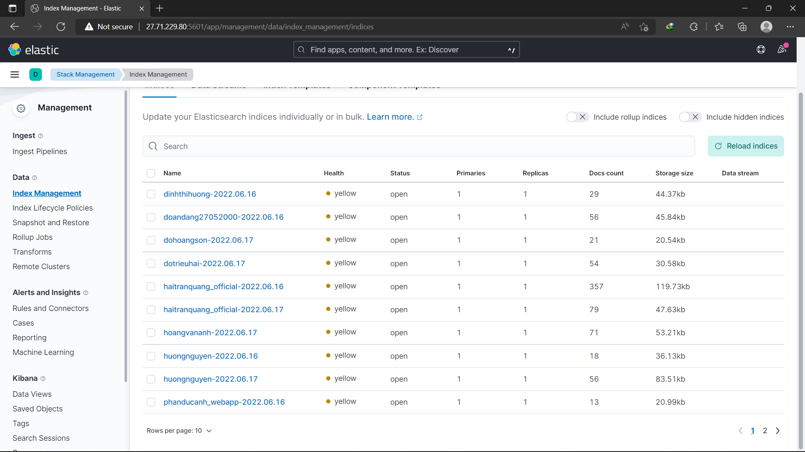

#  **Practice 5**
##  **Table of Contents**
[**I. Requirements**]()

[**II. Software**]()
- [**1. Elasticsearch**]()
- [**2. Fluentd**]()
- [**3. Kibana**]()

[**III. Step-by-step**]()
- [**1. Dockerfile**]()
- [**2. fluent.conf**]()
- [**3. docker-compose-fluent.yml**]()
- [**4. Config nginx to push log**]()
- [**5. Deploy**]()
- [**6. Result**]()

[**IV. References**]()
##  **I. Requirements**
**Operating System**: Ubuntu Server (Ubuntu Server 22.04 is used in below practices).

**Desktop Hypervisor**: Oracle Virtualbox (Oracle Virtualbox 6.1.34 is used in below practices).
##  **II. Software**
###  **1. Elasticsearch**
Elasticsearch is the distributed, RESTful search and analytics engine at the heart of the Elastic Stack. You can use Elasticsearch to store, search, and manage data for:
-   Logs
-   Metrics
-   A search backend
-   Application monitoring
-   Endpoint security
... and more!
<div align="center">
  
</div>
<div align="center">
  <i>Elasticsearch</i>
</div>

###  **2. Fluentd**
**Fluentd** collects events from various data sources and writes them to files, RDBMS, NoSQL, IaaS, SaaS, Hadoop and so on. Fluentd helps you unify your logging infrastructure (Learn more about the Unified Logging Layer).
<div align="center">
  
</div>
<div align="center">
  <i>Fluentd</i>
</div>

###  **3. Kibana**
**Kibana** is a proprietary data visualization dashboard software for Elasticsearch, whose free and open source successor in OpenSearch is OpenSearch Dashboards.
<div align="center">
  
</div>
<div align="center">
  <i>Kibana</i>
</div>

##  **III. Step-by-step**
To push log into Elasticsearch, we create three files:
-   Dockerfile for Fluentd
- fluentd.conf - configuration file for Fluentd
-   docker-compose-fluent.yml
###  **1. Dockerfile**
Add the following to `Dockerfile`
```
FROM fluent/fluentd:v1.9
USER root
RUN apk add --no-cache --update --virtual .build-deps \
	sudo build-base ruby-dev \
	&& gem install fluent-plugin-elasticsearch \
	&& gem sources --clear-all \
	&& apk del .build-deps \
	&& rm -rf /tmp/* /var/tmp/* /usr/lib/ruby/gems/*/cache/*.gem
USER fluent
```
###  **2. fluent.conf**
Add the following to `fluent.conf`
```
<source>
  @type forward
  port 24224
  bind 0.0.0.0
</source>

<match *.**>
  @type copy
  <store>
    @type elasticsearch
    host 27.71.229.80
    port 9200
    logstash_format true
    logstash_prefix dohoangson
    include_tag_key true
  </store>
  <store>
    @type stdout
  </store>
</match>
```
###  **3. docker-compose-fluent.yml**
Add the following to `docker-compose-fluent.yml`
```
version: "3"
services:
  fluentd:
    build: .
    container_name: fluentd
    volumes:
    - ./:/fluentd/etc
    ports:
    - "24224:24224"
```
###  **4. Config nginx to push log**
To push log to Elasticsearch, we add some configuration to nginx container. Add the floowing to `docker-compose.yml`
```
logging:
  driver: "fluentd"
  options:
    fluentd-address: localhost:24224
    tag: nginx.access
```
###  **5. Deploy**
Clone from Git repo
```
git clone https://github.com/nhok8t1/Fluentd.git
```
Run docker-compose-fluent
```
cd Fluentd
docker-compose -f docker-compose-fluent up 
```
Run Project 3
```
git clone https://github.com/nhok8t1/NodeApp.git
cd NodeApp
docker-compose up -d
```
###  **6. Result**
<div align="center">
  
</div>
<div align="center">
  <i>Result</i>
</div>

##  **IV. References**
- [nhok8t1/Fluentd (github.com)](https://github.com/nhok8t1/Fluentd)
