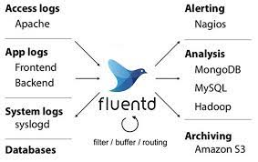
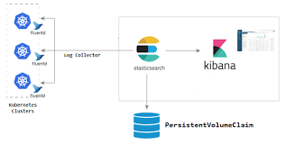
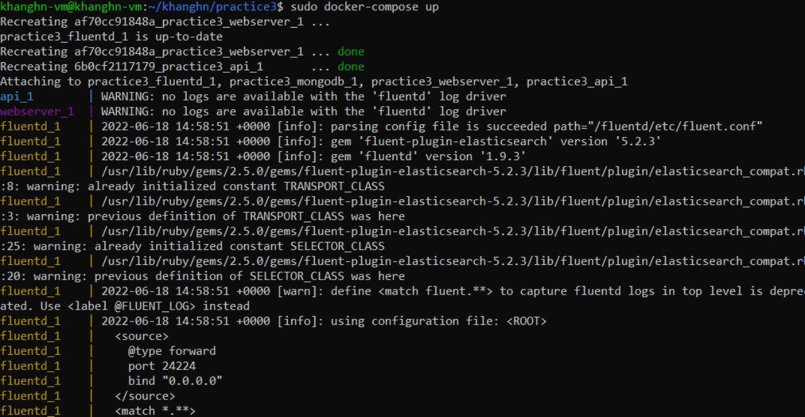
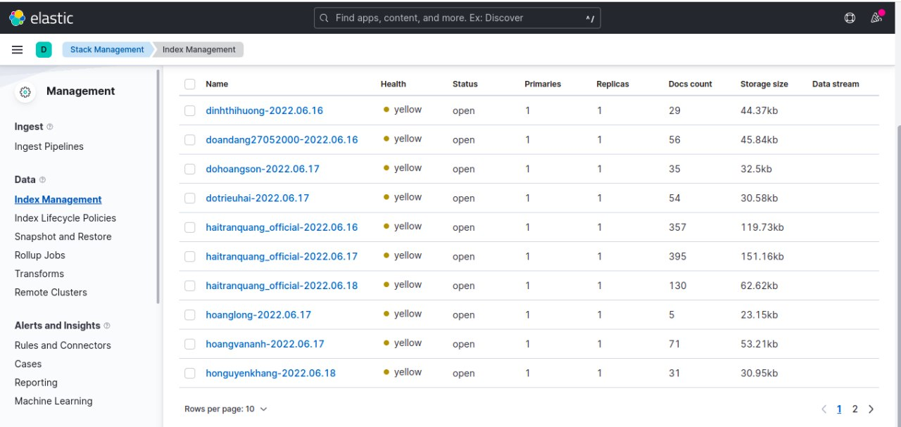

# **Elasticsearch Fluentd Kibana (EFK) STACK**


# Content
##### I/ Base Knowledge
 
##### 1 ElasticSearch

##### 2 Fluentd

##### 3 Kibana

##### 4 EFK stack

##### II/ Implementations:

##### References


# I/ Base Knowledge 
 
## 1 Elasticsearch

### _1.1 What is Elasticsearch?_

- Elasticsearch (sometimes dubbed ES) is a modern search and analytics engine which is based on Apache Lucene

- Completely open source and built with Java, Elasticsearch is a NoSQL database, it stores data in an unstructured way and that you cannot use SQL to query it

- Accessible through extensive and elaborative Restfull API 

 

### _1.2 Why do we need elastic search?_

- Elasticsearch allows us to store and search large volumes of data very quickly.

- It can also handle typos and we can easily write complex queries to search by any criteria we want.

- It also allows us to aggregate data to obtain statistics.

### _1.3 Fundamental Concepts_

#### Node

   - The term node refers to a server that works as part of the cluster. In Elasticsearch, a node is an instance—it is not a machine. This means you can run multiple nodes on a single machine. An Elasticsearch instance consists of one or more cluster-based nodes. By default, when an Elasticsearch instance starts, a node also starts running.
   - Three main options to configure an Elasticsearch node:
      - Master node
      - Data node
      - Client node

#### Cluster

   - It is composed of a group of nodes that store data. You can specify the number of nodes that start running with the cluster, as well as the IP address of the virtual or physical server. You can specify this information in the config/elasticsearch.yml file, which contains all configuration settings .

#### Index

   - It is a collection of different type of documents and their properties. Index also uses the concept of shards to improve the performance. For example, a set of document contains data of a social networking application.

#### Document

   - It is a collection of fields in a specific manner defined in JSON format. Every document belongs to a type and resides inside an index. Every document is associated with a unique identifier called the UID.

#### Shard

   - There is no limit to the number of documents you can store on each index. However, if an index exceeds the storage limits of the hosting server, Elasticsearch might crash. To prevent this issue, indices are split into small pieces called shards.
   - Shards are small and scalable indexing units that serve as the building blocks of the Elasticsearch architecture. Shards enable you to distribute operations and improve overall performance.

#### Replicas

   - Elasticsearch allows a user to create replicas of their indexes and shards. Replication not only helps in increasing the availability of data in case of failure, but also improves the performance of searching by carrying out a parallel search operation in these replicas.

#### Analyzers
   - Analyzers are responsible for parsing phrases and expressions into constituent terms. This occurs during the indexing process. Each analyzer is composed of one tokenizer and several token filters.

When a document is stored, it is indexed. Elasticsearch uses a data structure called an **inverted index** that supports very fast full-text searches. An inverted index lists every unique word that appears in any document and identifies all of the documents each word occurs in.


### _1.4 Advantages_

- Elasticsearch is developed on Java, which makes it compatible on almost every platform.

- Elasticsearch is real time, in other words after one second the added document is searchable in this engine

- Elasticsearch is distributed, which makes it easy to scale and integrate in any big organization.

- Creating full backups are easy by using the concept of gateway, which is present in Elasticsearch.

- Handling multi-tenancy is very easy in Elasticsearch when compared to Apache Solr.

- Elasticsearch uses JSON objects as responses, which makes it possible to invoke the Elasticsearch server with a large number of different programming languages.

- Elasticsearch supports almost every document type except those that do not support text rendering.

#### _1.5 Disadvantages_

- Elasticsearch does not have multi-language support in terms of handling request and response data (only possible in JSON) unlike in Apache Solr, where it is possible in CSV, XML and JSON formats.

- Occasionally, Elasticsearch has a problem of Split brain situations.

## 2 Fluentd

  

- Fluentd is an open-source tool to collect events and logs.

- Fluentd is a great software based on Ruby for reading, processing, and sending logs.
- Fluentd collects events from various data sources and writes them to files, RDBMS, NoSQL, IaaS, SaaS, Hadoop and so on. Fluentd helps you unify your logging infrastructure 

## 3 Kibana

   

 - Kibana is free open-source user interface, a data visualization and management tool for Elasticsearch that provides real-time histograms, line graphs, pie charts, and maps. Kibana also includes advanced applications such as Canvas, which allows users to create custom dynamic infographics based on their data, and Elastic Maps for visualizing geospatial data.

    
## 4 EFK

EFK Stack is a collection of 3 software together including:

- ElasticSearch

- Fluentd

- Kibana

The mechanism of operation of the toolkit is described in the picture below:

 

- First, the log will be taken to the fluorine.

- Fluentd will read these logs, add information such as time, IP, parse data from log (server, severity, log content) and write down to elasticSearch.

- To see the log, we access the Kibana URL. Kibana will read the log information in elasticSearch, displayed on the interface for query users and processing.

# II/ Implementations:

- Firsly, I git clone my practice3 to take the loggings of webserver and Flask API

- All implementations are in directory ```/practice3```

  ```
    $ cd practice 3
  ```
  
- Create Dockerfile to build Fluentd image in ```./fluentd/```:

  ```
  FROM fluent/fluentd:v1.9
  USER root

  RUN apk add --no-cache --update --virtual .build-deps \
      sudo build-base ruby-dev \
      && mkdir -p /fluentd/etc \
      && gem install fluent-plugin-elasticsearch \
      && gem install elasticsearch -v 7.17.0 \
      && gem sources --clear-all \
      && apk del .build-deps \
      && rm -rf /tmp/* /var/tmp/* /usr/lib/ruby/gems/*/cache/*.gem

  USER fluent
  ```
- Then create a config file for fluentd: fluent.conf in ```./fluentd/conf/```

  ```

  <source>
    @type forward
    port 24224
    bind 0.0.0.0
  </source>

  <match *.**>
    @type copy
    <store>
      @type  elasticsearch
      host 27.71.229.80
      port 9200
      logstash_format true
      logstash_prefix HoNguyenKhang
      include_tag_key true
    </store>
    <store>
      @type stdout
    </store>
  </match>
  ```

- Finally, create file docker-compose.yml:

  ```

  version: '3.3'   
  services:                                                                                                                                                                                                                               services:                                                                                                                   
    fluentd:                                                                                                                    
      build: ./fluentd                                                                                                       
      volumes:                                                                                                                  
        - ./fluentd/conf:/fluentd/etc
      ports:                                                                                                                    
        - "24224:24224"
        - "24224:24224/udp"
    api:                                                                                                                        
      build:                                                                                                                   
        context: ./api                                                                                                          
        dockerfile: Dockerfile                                                                                              
      volumes:                                                                                                                   
        - ./api/:/app
      ports:                                                                                                                    
        - 5000:5000                                                                                                           
      environment:                                                                                                              
        - FLASK_APP=api.py
      command: flask run --host=0.0.0.0                                                                                    
      logging:                                                                                                                 
        driver: "fluentd"                                                                                                     
        options:                                                                                                                
          fluentd-address: "0.0.0.0:24224"                                                                                    
          tag: flask   
    webserver:                                                                                                                                                                                                                            webserver:                                                                                                                 
      build:                                                                                                                    
        context: ./client                                                                                                      
        dockerfile: Dockerfile                                                                                              
      ports:                                                                                                                    
        - 80:80
      volumes:                                                                                                                
        - ./client/nginx/conf.d/:/etc/nginx/conf.d/
        - ./client:/usr/share/nginx/html
      logging:                                                                                                                 
        driver: "fluentd"                                                                                                    
        options:                                                                                                               
          fluentd-address: "0.0.0.0:24224"                                                                                     
          tag: webserver                                                                                                                                                                                                                           mongodb:                                                                                                                  
    mongodb
      image: mongo:5.0                                                                                                      
      volumes:                                                                                                                   
        - .docker/data/db:/data/db 

  ```

## Results

- Run Docker-compose and see the result: 

  $ docker-compose up
 
 

Now, access to ```http://27.71.229.80:5601/app/management/data/index_management/indices```  to view the logs have been pushed:

  

 # References
 
 - [Recording of Mentor Dat](https://drive.google.com/drive/u/1/folders/1py534JsCIIqWlUm7YU-t3Cmmzotar_FQ?fbclid=IwAR3e_LC2LS_Rsd_bv3bjp1hXMiJvtSv_MtpEp5FAW-aozVM5szEPphJ-1Gk)