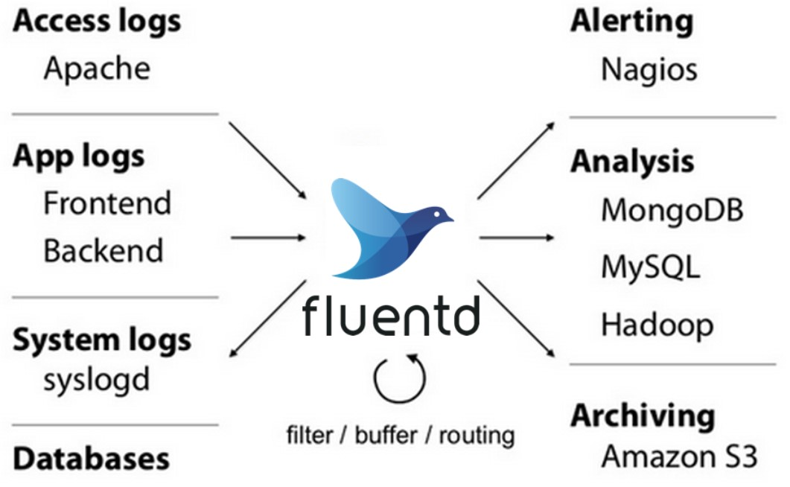
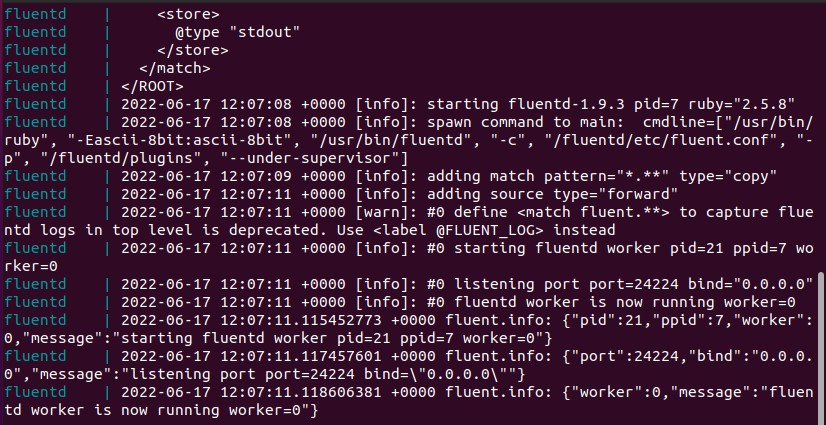
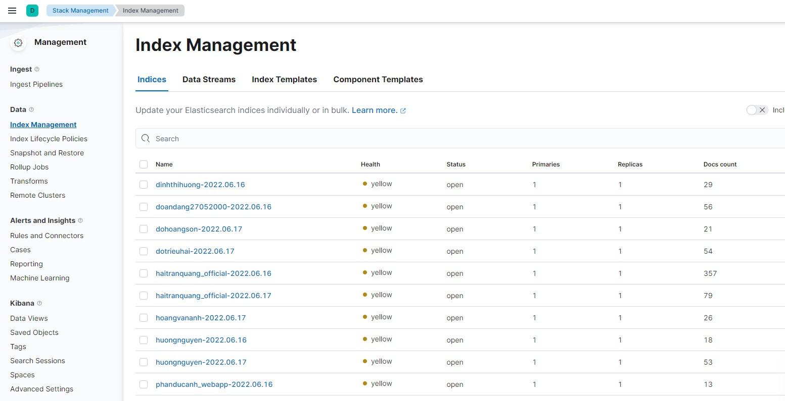

# Đẩy log của các service đã làm ở Practice-3 vào fluentd, từ fluentd đẩy lên cụm ES: 27.71.229.80:9200, Kibana: 27.71.229.80:5601.
---
## **Mục Lục**
  - [**I. Giới thiệu về Logging & Tracing**](#gt)
    - [**1. Elasticsearch**](#1-elasticsearch)
    - [**2. Fluentd**](#2-fluentd)
    - [**3. Kibana**](#3-kibana)
  - [**II. Practice**](#tn)
    - [**1. Cài đặt**](#cd)
    - [**2. Kết quả**](#kq)
  - [**III. Reference**](#re)
---
<a name="gt"></a>
## **I. Giới thiệu về Logging & Tracing**


### **1. Elasticsearch**

- Elasticsearch là một search engine.
- Elasticsearch được kế thừa từ Lucene Apache
- Elasticsearch thực chất hoặt động như 1 web server, có khả năng tìm kiếm nhanh chóng (near realtime) thông qua giao thức RESTful
- Elasticsearch có khả năng phân tích và thống kê dữ liệu
- Elasticsearch chạy trên server riêng và đồng thời giao tiếp thông qua RESTful do vậy nên nó không phụ thuộc vào client viết bằng gì hay hệ thống hiện tại của bạn viết bằng gì. Nên việc tích hợp nó vào hệ thống bạn là dễ dàng, bạn chỉ cần gửi request http lên là nó trả về kết quả.
- Elasticsearch là 1 hệ thống phân tán và có khả năng mở rộng tuyệt vời (horizontal scalability). Lắp thêm node cho nó là nó tự động auto mở rộng cho bạn.
- Elasticsearch là 1 open source được phát triển bằng Java

  

- **Ưu điểm**:
  - Tìm kiếm dữ liệu rất nhanh chóng, mạnh mẽ dựa trên Apache Lucene ( near-realtime searching)
  - Có khả năng phân tích dữ liệu (Analysis data)
  - Khả năng mở rộng theo chiều ngang tuyệt “vòi”
  - Hỗ trợ tìm kiếm mờ (fuzzy), tức là từ khóa tìm kiếm có thể bị sai lỗi chính tả hay không đúng cú pháp thì vẫn có khả năng elasticsearch trả về kết quả tốt.
  - Hỗ trợ Structured Query DSL (Domain-Specific Language ), cung cấp việc đặc tả những câu truy vấn phức tạp một cách cụ thể và rõ ràng bằng JSON.Các bạn có thể tìm hiểu thêm tại đây
  - Hỗ trợ nhiều Elasticsearc client như Java, PhP, Javascript, Ruby, .NET, Python

- **Nhược điểm**:
  - Elasticsearch được thiết kế cho mục đích search. Do vậy với những nhiệm vụ khác ngoài search như CRUD, thì elastic kém thế hơn khi so với những database như Mongodb, Mysql…. Vậy nên người ta ít khi dùng elasticsearch làm database chính, mà thường kết hợp nó với 1 database khác.
  - Trong elasticsearch không có khái niệm database transaction , tức là nó sẽ không đảm bảo được toàn vẹn dữ liệu trong các hoạt độngInsert, Update, Delete.Tức khi chúng ta thực hiện thay đổi nhiều bản ghi nếu xảy ra lỗi thì sẽ làm cho logic của mình bị sai hay dẫn tới mất mát dữ liệu. Đây cũng là 1 phần khiến elasticsearch không nên là database chính.
  - Không thích hợp với những hệ thống thường xuyên cập nhật dữ liệu. Sẽ rất tốn kém cho việc đánh index dữ liệu.

### **2. Fluentd**

- Fluentd là một công cụ thu thập, xử lý và tổng hợp nhật ký mã nguồn mở được tạo ra vào năm 2011 bởi những người tại Treasure Data . 
- Được viết bằng Ruby, Fluentd được tạo ra để hoạt động như một lớp ghi nhật ký thống nhất - một thành phần duy nhất có thể tổng hợp dữ liệu từ nhiều nguồn, thống nhất dữ liệu được định dạng khác nhau thành các đối tượng JSON và định tuyến nó đến các đích đầu ra khác nhau.
- Fluentd đã xuất hiện được một thời gian và đã phát triển một hệ sinh thái phong phú bao gồm hơn 700 plugin khác nhau giúp mở rộng chức năng của nó. 
- Fluentd là trình tổng hợp nhật ký tiêu chuẩn de-facto được sử dụng để đăng nhập Kubernetes và như đã đề cập ở trên, là một trong những hình ảnh Docker được sử dụng rộng rãi.
#### **Fluentd vs Logstash**



### **3. Kibana**

- Kibana là một công cụ hiển thị trực quan và khám phá dữ liệu được sử dụng trong những trường hợp phân tích nhật ký và chuỗi thời gian, giám sát ứng dụng và thông tin kinh doanh. Công cụ này cung cấp những tính năng mạnh mẽ, dễ sử dụng như biểu đồ tần suất, biểu đồ đường, biểu đồ tròn, biểu đồ nhiệt và hỗ trợ không gian địa lý được tích hợp sẵn. Ngoài ra, công cụ này còn cung cấp khả năng tích hợp chặt chẽ với Elasticsearch, một công cụ phân tích và tìm kiếm phổ biến, khiến Kibana trở thành lựa chọn hàng đầu cho hoạt động hiển thị trực quan dữ liệu được lưu trữ trong Elasticsearch.


- Lợi tích của Kibana:
  - Biểu đồ tương tác: Kibana cung cấp các biểu đồ và báo cáo trực quan mà bạn có thể sử dụng để điều hướng tương tác giữa một lượng lớn dữ liệu nhật ký. Bạn có thể linh hoạt kéo các cửa sổ thời gian, phóng to/thu nhỏ những tập dữ liệu con cụ thể và xem chi tiết các báo cáo để trích xuất thông tin hữu ích từ dữ liệu của mình.
  - Hỗ trợ ánh xạ: Kibana đi kèm với khả năng hỗ trợ không gian địa lý mạnh mẽ để bạn có thể xếp lớp thông tin địa lý một cách liền mạch lên trên dữ liệu của mình và hiển thị trực quan kết quả trên bản đồ.
  - Bộ lọc và dữ liệu tổng hợp được tạo sẵn: Sử dụng bộ lọc và dữ liệu tổng hợp được tạo sẵn của Kibana, bạn có thể chạy hàng loạt các phân tích như biểu đồ tần suất, truy vấn top-N và xu hướng với chỉ vài cú nhấp chuột.
  - Bảng thông tin dễ dàng truy cập: Bạn có thể dễ dàng thiết lập bảng thông tin và báo cáo cũng như chia sẻ chúng với những người khác. Bạn chỉ cần có một trình duyệt để xem và khám phá dữ liệu.

<a name="tn"></a>
## **III. Practice**
<a name="cd"></a>
### **1. Cài đặt**

- Cấu hình `Dockerfile` để tạo container Fluentd:

  ```yml
  FROM fluent/fluentd:v1.9
  USER root
  RUN apk add --no-cache --update --virtual .build-deps \
      sudo build-base ruby-dev \
      && mkdir -p /fluentd/etc \
      && gem install elasticsearch -v 7.17.0\
      && gem install fluent-plugin-elasticsearch \
      && gem sources --clear-all \
      && apk del .build-deps \
      && rm -rf /tmp/* /var/tmp/* /usr/lib/ruby/gems/*/cache/*.gem
  USER fluent
  ``` 

- Cấu hình file `fluent.conf`:

  ```
  <source>
    @type forward
    port 24224
    bind 0.0.0.0
  </source>

  <filter nginx.access>
    @type parser
    key_name log
    <parse>
      @type nginx
    </parse>
  </filter>

  <match *.**>
    @type copy
    <store>
      @type elasticsearch
      host 27.71.229.80
      port 9200
      scheme http
      logstash_format true
      include_tag_key true
      index_name HoangVanAnh
      <buffer>
        flush_interval 1s
      </buffer>
    </store>
    <store>
      @type stdout
    </store>
  </match>
  ```

- Cấu hình file `docker-compose-fluentd.yml`:
  ```yml
  version: '3.3'

  services:
    fluentd:
      build: .
      container_name: fluentd
      volumes:
        - ./:/fluentd/etc
      ports:
        - "24224:24224"
   ```
- Trong file   `docker-compose.yml`, thêm logging vào images của flask và nginx
    ```yml
  logging:
      driver: "fluentd"
      options:
        fluentd-address: "0.0.0.0:24224"
        tag: flask 
    ```
    
    ```yml
  logging:
      driver: "fluentd"
      options:
        fluentd-address: "0.0.0.0:24224"
        tag: nginx 
    ```
<a name="kq"></a>
### **2. Kết quả**
> chạy lệnh
  ```
  docker-compose -f docker-compose-fluentd.yml up
  ```


> chạy lệnh
  ```
  docker-compose up -d
  ```


- truy cập vào 27.71.229.80:5601 để kiểm tra:


<a name="re"></a>
## **III. Reference**

[Elasticsearch là gì?](https://viblo.asia/p/elasticsearch-la-gi-1Je5E8RmlnL)

[Kibana](https://levanphu.info/kibana-la-gi-tim-hieu-ve-kibana-va-su-dung-mot-cach-hieu-qua)

[Fluentd](https://docs.fluentbit.io/manual/about/fluentd-and-fluent-bit)

