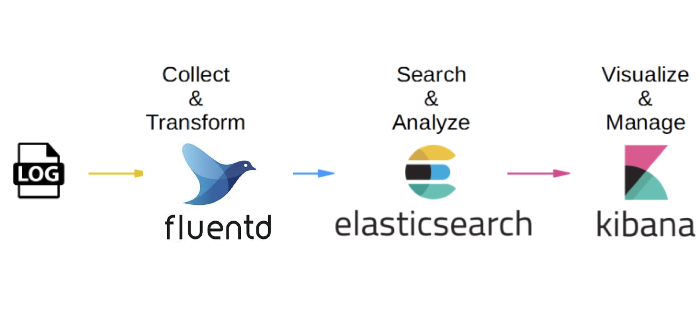
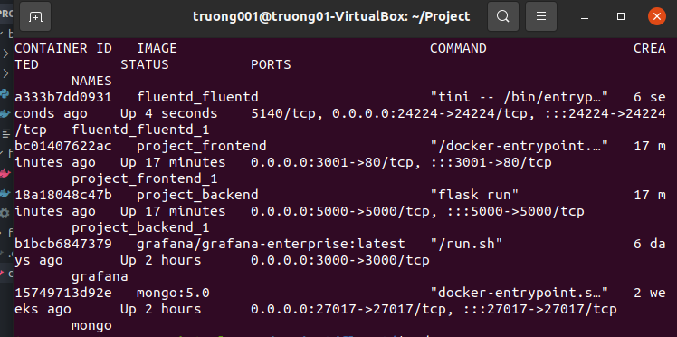
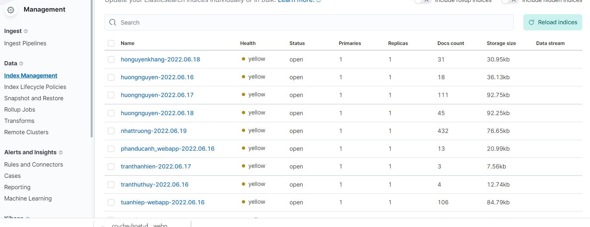

# PRACTICE 5: ELASTICSEARCH + KIBANA + FLUENTD

## Table of contents

- [**I. Overview**](#i-overview)
- [**II. Deploy**](#ii-deploy)

## I. Overview

EFK stack là tập hợp của 3 phần mềm đi chung với nhau bao gồm:

- Elasticsearch: Cơ sở dữ liệu NoSQL dùng để lưu trữ dữ liệu và cung cấp interface để tìm kiếm và query log.
- Fluent-bit: Là phần mềm mã nguồn mở, viết bằng C, được thiết kế nhằm chú trọng đến hiệu suất. Nó cho phép bạn thu thập logs từ nhiều nguồn khác nhau. Fluent bit được phát triển bởi Fluentd team với mục đích tạo ra một phiên bản lightweight trong việc xử lý logs. Sau đó, fluent bit được sử dụng như một giải pháp xử lý dành cho Cloud.
- Kibana: Giao diện để quản lý, thống kê logs. Có nhiệm vụ đọc thông tin từ elasticsearch.

Cơ chế hoạt động của bộ công cụ được mô tả qua hình dưới đây:

1. Đầu tiên, log sẽ được đưa đến Fluent-bit.
2. Fluent-bit sẽ đọc những log này, thêm những thông tin như thời gian, IP, parse dữ liệu từ log (server nào, độ nghiêm trọng, nội dung log) và ghi xuống Elasticsearch.
3. Để xem log, chúng ta truy cập URL của Kibana. Kibana sẽ đọc thông tin log trong Elasticsearch, hiển thị lên giao diện cho người dùng query và xử lý.

## II. Deploy

Để làm bài tập này, chúng ta cần tạo 3 file cho vào 1 thư mục tên là fluentd (tạo trong file project đã được tạo ở trong bài tập 3) bao gồm Dockerfile để build Fluentd Image, fluent.conf là config file của Fluentd, docker-compose để chạy container.

- Dockerfile

        FROM fluent/fluentd:v1.9
        USER root

        RUN apk add --no-cache --update --virtual .build-deps \
            sudo build-base ruby-dev \
            && gem install fluent-plugin-elasticsearch \
            && gem sources --clear-all \
            && apk del .build-deps \
            && rm -rf /tmp/* /var/tmp/* /usr/lib/ruby/gems/*/cache/*.gem

        USER fluent

- fluent.conf

        <source>
        @type forward
        port 24224
        bind 0.0.0.0
        </source>

        <filter nginx.access>
        @type parser
        key_name log
        <parse>
            @type nginx
        </parse>
        </filter>

        <match *.**>
        @type copy
        <store>
            @type elasticsearch
            host 27.71.229.80
            port 9200
            logstash_format true
            logstash_prefix nhattruong
            include_tag_key true
        </store>
        <store>
            @type stdout
        </store>
        </match>

- docker-compose.yml

        version: '3'
        services:
        fluentd:
            build: .
            volumes:
                - ./:/fluentd/etc
            ports:
                - "24224:24224"

- Thêm logging cho các containers của web app

        logging:
            driver: "fluentd"
            options:
                fluentd-address: "0.0.0.0:24224"
                tag: "nginx"/"flask"

- docker-compose up -d, kiểm tra các containers đã build

    

- Truy cập vào địa chỉ 27.71.229.80:5601, vào phần index để kiểm tra việc đẩy log

