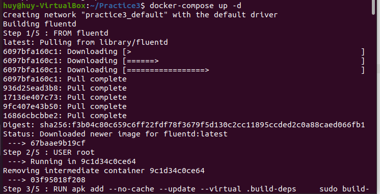
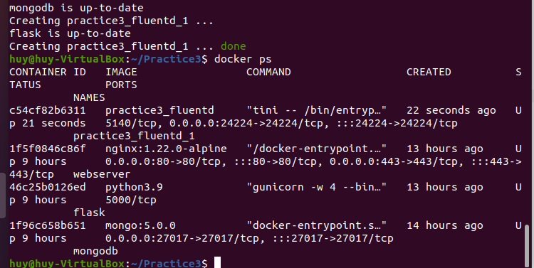
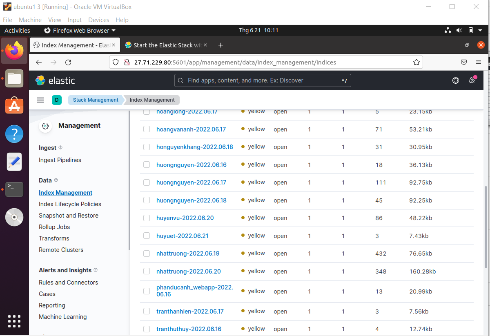

# Bài Thực Hành 5
# Chủ đề: ELASTICSEARCH, KIBANA, FLUENTD 
---
Thực hiện: Nguyễn Tấn Huy 
---

# **Table of Contents:**

## I. Tổng quan

### 1. ELASTICSEARCH

### 2. KIBANA

### 3. FLUENTD

## II. Thực Hành
- ### A. Cài Đặt 
- ### B. Kết Quả

## III. Tài Liệu Tham Khảo
----------
# **I. Tổng quan**
## **1. ELASTICSEARCH** 
- Elasticsearch là một search engine.
- Elasticsearch được kế thừa từ Lucene Apache
- Elasticsearch thực chất hoặt động như 1 web server, có khả năng tìm kiếm nhanh chóng (near realtime) thông qua giao thức RESTful
- Elasticsearch có khả năng phân tích và thống kê dữ liệu
- Elasticsearch chạy trên server riêng và đồng thời giao tiếp thông qua RESTful do vậy nên nó không phụ thuộc vào client viết bằng gì hay hệ thống hiện tại của bạn viết bằng gì. Nên việc tích hợp nó vào hệ thống bạn là dễ dàng, bạn chỉ cần gửi request http lên là nó trả về kết quả.
- Elasticsearch là 1 hệ thống phân tán và có khả năng mở rộng tuyệt vời (horizontal scalability). Lắp thêm node cho nó là nó tự động auto mở rộng cho bạn.
- Elasticsearch là 1 open source được phát triển bằng Java


## **2. KIBANA** 
- Kibana là một công cụ hiển thị trực quan và khám phá dữ liệu được sử dụng trong những trường hợp phân tích nhật ký và chuỗi thời gian, giám sát ứng dụng và thông tin kinh doanh. Công cụ này cung cấp những tính năng mạnh mẽ, dễ sử dụng như biểu đồ tần suất, biểu đồ đường, biểu đồ tròn, biểu đồ nhiệt và hỗ trợ không gian địa lý được tích hợp sẵn. 
- Ngoài ra, công cụ này còn cung cấp khả năng tích hợp chặt chẽ với Elasticsearch, một công cụ phân tích và tìm kiếm phổ biến, khiến Kibana trở thành lựa chọn hàng đầu cho hoạt động hiển thị trực quan dữ liệu được lưu trữ trong Elasticsearch.


## **3. FLUENTD**

- Fluentd là một công cụ thu thập, xử lý và tổng hợp nhật ký mã nguồn mở được tạo ra vào năm 2011 bởi những người tại Treasure Data .
- Được viết bằng Ruby, Fluentd được tạo ra để hoạt động như một lớp ghi nhật ký thống nhất - một thành phần duy nhất có thể tổng hợp dữ liệu từ nhiều nguồn, thống nhất dữ liệu được định dạng khác nhau thành các đối tượng JSON và định tuyến nó đến các đích đầu ra khác nhau.
- Fluentd đã xuất hiện được một thời gian và đã phát triển một hệ sinh thái phong phú bao gồm hơn 700 plugin khác nhau giúp mở rộng chức năng của nó.
- Fluentd là trình tổng hợp nhật ký tiêu chuẩn de-facto được sử dụng để đăng nhập Kubernetes và như đã đề cập ở trên, là một trong những hình ảnh Docker được sử dụng rộng rãi.


# **II. Thực Hành**
## **1. Cài Đặt**
Trong Project bài thực hành 3, ta tạo folder `fluentd`
```
mkdir fluentd
```
Trong folder `fluentd` sẽ chứa flie `Dockerfile` và file configure `fluent.conf`
Nội dung cụ thể như sau:
- Dockerfile
```
FROM fluentd
USER root

RUN apk add --no-cache --update --virtual .build-deps \
    sudo build-base ruby-dev \
    && gem install fluent-plugin-elasticsearch \
    && gem sources --clear-all \
    && apk del .build-deps \
    && rm -rf /tmp/* /var/tmp/* /usr/lib/ruby/gems/*/cache/*.gem

COPY fluent.conf fluentd/etc

USER fluent
```
- fluent.conf
```
<source>
  @type forward
  port 24224
  bind 0.0.0.0
</source>

# <filter nginx>
#   @type parser
#   key_name log
#   <parse>
#     @type nginx
#   </parse>
# </filter>

<match *.**>
  @type copy
  <store>
    @type elasticsearch
    host 27.71.229.80
    port 9200
    logstash_format true
    logstash_prefix huyuet
    include_tag_key true
  </store>
  <store>
    @type stdout
  </store>
</match>
```

Tiếp theo ta thêm nội dung sau vào file `docker-compose.yml`
```
  fluentd:
      build: fluentd
      volumes:
        - ./fluentd:/fluentd/etc
      #   - ./fluentd:/etc/fluentd
      ports:
        - "24224:24224"
```
## **2. Kết Quả**

Tiến hành chạy lại file `ocker-compose.yml` bằng câu lệnh:
```
docker-compose up -d
```


Chạy lệnh `docker ps` để kiểm tra.



Kiểm tra kết quả



# **III. Tài liệu tham khảo**
[ElasticSearch](https://topdev.vn/blog/elasticsearch-la-gi/)

[Kibana](https://aws.amazon.com/vi/opensearch-service/the-elk-stack/kibana/)

[Fluentd](https://hicubex2k.wordpress.com/2016/11/03/tim-hieu-ve-fluentd/)
