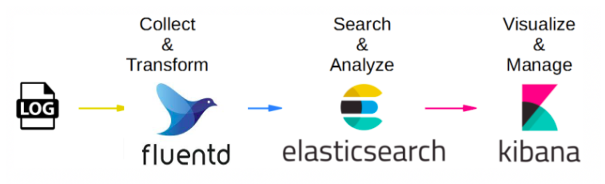
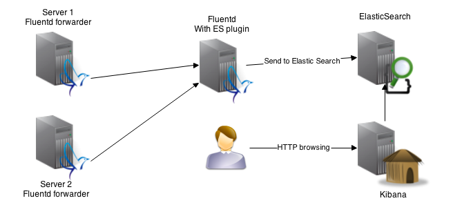
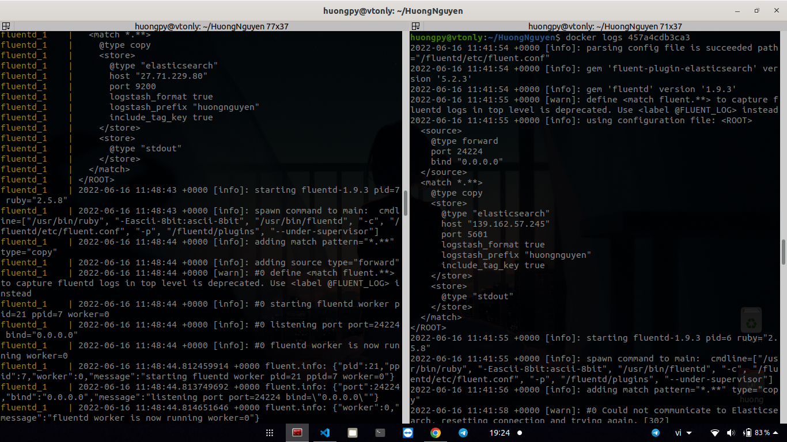
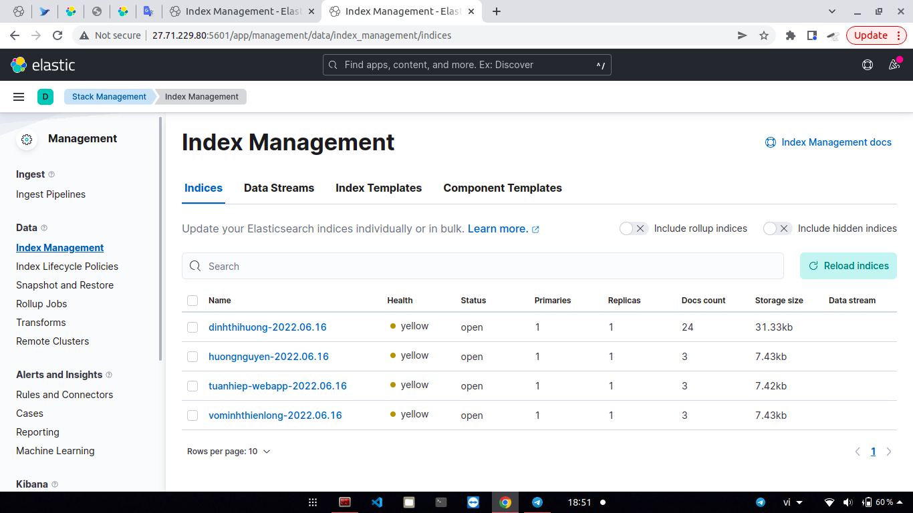

# EFK STACK 

## Content 
  - [Content]()
  - [I. Overview]()
  - [II. Handson]()
  - [III. Results ]()
  - [References]()

---

## I. Overview

Initially, I would like to express my thankfulness to all mentors and other attendees that help me understand this subject as well as fix silly bugs. :kissing_closed_eyes:
This article explains how to collect Docker logs to EFK (Elasticsearch + Fluentd + Kibana) stack. The example uses Docker Compose for setting up multiple containers.

**1. Elasticserach**  

- Elasticsearch is a free and open-source search and analytics engine built on Apache Lucene. Elasticsearch is distributed and supports all data types, including numerical, textual, structured, unstructured, and geospatial data. Elasticsearch comes with simple REST APIs and provides features for scalability and fast search.
- Elasticsearch is an important part of the Elastic Stack, which is a set of open-source tools including data ingestion, storage, enrichment, visualization, and analysis. Notable tools in the stack are Elasticsearch, Logstash, and Kibana (ELK).
- The Elasticsearch architecture leverages the Lucene indexing build and combines it with a distributed model that separates the architecture into small components, called shards, which can be distributed across multiple nodes.
  
- Elasticseach's key components:
  - Elasticsearch Cluster: is composed of a group of nodes that store data. You can specify the number of nodes that start running with the cluster, as well as the IP address of the virtual or physical server. You can specify this information in the config/elasticsearch.yml file, which contains all configuration settings.
  - Elasticsearch Node: Nodes in an Elasticsearch cluster are connected to each other, and each node contains a small chunk of cluster data. There are the three main options to configure an Elasticsearch node: Elasticsearch master node, Elasticsearch client node, Elasticsearch data node
  - The Ports 9200 and 9300: Port 9200—used to filter requests coming from outside the cluster. This process meets requests coming through the REST APIs used for querying, indexing, and more. Port 9300— used for inter-node communication. This occurs in the transport layer.
  - Elasticsearch Shards: Shards are small and scalable indexing units that serve as the building blocks of the Elasticsearch architecture. There is no limit to the number of documents you can store on each index. However, if an index exceeds the storage limits of the hosting server, Elasticsearch might crash. To prevent this issue, indices are split into small pieces called shards.
  - Elasticsearch Documents: The Elasticsearch architecture is designed to support the retrieval of documents, which are stored as JSON objects. Elasticsearch supports nested structures, which helps handle complex data and queries. To track information, Elasticsearch uses keys prepended with an underscore, which represents metadata.

**2. Kibana**  

- Kibana is a data visualization and management tool for Elasticsearch that provides real-time histograms, line graphs, pie charts, and maps. Kibana also includes advanced applications such as Canvas, which allows users to create custom dynamic infographics based on their data, and Elastic Maps for visualizing geospatial data.
 

**3. Fluentd**

- Fluentd is an open-source tool to collect events and logs.
- Fluentd is a great software based on Ruby for reading, processing, and sending logs.
- Fluentd can also be easily extended by writing plugins, many of which are now developed and public.
 

**4.EFK stack**

 

1. First, the log will be sent to Fluentd. (For example log access server nginx/apache, log do develop setting in source php/java etc. as long as log file is logged).
2. Fluentd will read these logs, add information such as time, IP, parse data from the log (which server, severity, log content), then write it down to the database called Elasticsearch.
3. When you want to see the log, the user goes to Kibana's URL. Kibana will read log information in Elasticsearch, display it to the user interface for querying and processing.
3. Logs have many types (tags), defined by the developer such as access_log error_log, peformance_log, api_log. When Fluentd reads the log and classifies each log type and sends it to Elasticsearch, in the Kibana interface we just need to add some filters such as access_log and query.

You can examine the figure below to see how EFL works:

 

## II. Handson

**1. Using Docker to build Fluentd**

First, create a folder namely fluentd, then create a file: Dockerfile to build Fluentd image:

```
FROM fluent/fluentd:v1.9
USER root

RUN apk add --no-cache --update --virtual .build-deps \
    sudo build-base ruby-dev \
    && mkdir -p /fluentd/etc \
    && gem install elasticsearch -v 7.17.0\
    && gem install fluent-plugin-elasticsearch \
    && gem sources --clear-all \
    && apk del .build-deps \
    && rm -rf /tmp/* /var/tmp/* /usr/lib/ruby/gems/*/cache/*.gem

USER fluent

```
Then in fluentd folder, create a config file for fluentd: \fluentd\conf\fluent.conf

```
# fluentd/conf/fluent.conf
<source>
  @type forward
  port 24224
  bind 0.0.0.0
</source>

<match *.**>
  @type copy
  <store>
    @type elasticsearch
    host 27.71.229.80
    port 9200
    logstash_format true
    logstash_prefix huongnguyen
    include_tag_key true
  </store>
  <store>
    @type stdout
  </store>
</match>

```
**2. Using Docker compose to build up fluentd and webapp**

The docker-compose.yml file should be: 

```
version: '3.0'

services:
  fluentd:
    build: fluentd/
    volumes:
      - ./fluentd/conf:/fluentd/etc
    ports:
      - 24224:24224
  mongodb:
    image: mongo:5.0
    container_name: mongo
    ports:
      - 12345:27017
  python:
    build: python/
    ports:
      - 12346:5000
    logging:
      driver: "fluentd"
      options:
        fluentd-address: "0.0.0.0:24224"
        tag: flask
  nginx:
    build: nginx/
    restart: always
    ports:
      - 12347:80
    depends_on:
      - python
    logging:
      driver: "fluentd"
      options:
        fluentd-address: "0.0.0.0:24224"
        tag: nginx.access 
```

## III. Results

Docker-compose up and see the result: 

 

You can also see the logs of fluentd in the right corner of the figure. Now, get access to http://27.71.229.80:5601 to see whether the logs have been pushed yet:

 

It only took us serveral second to push the logs. :smirk: 


## References

- [What is Elasticsearch](https://www.elastic.co/what-is/elasticsearch)


