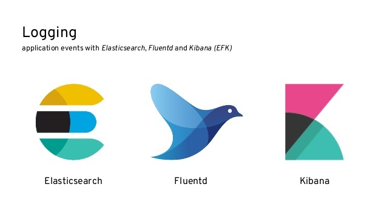
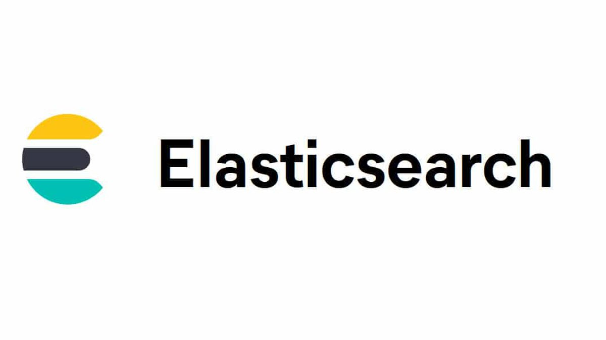
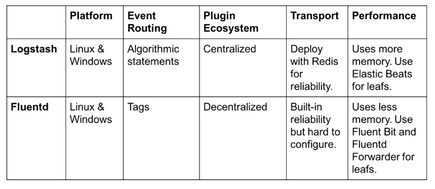
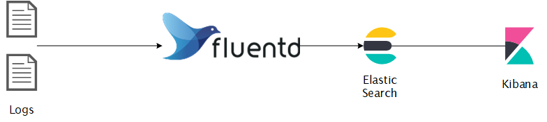
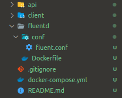
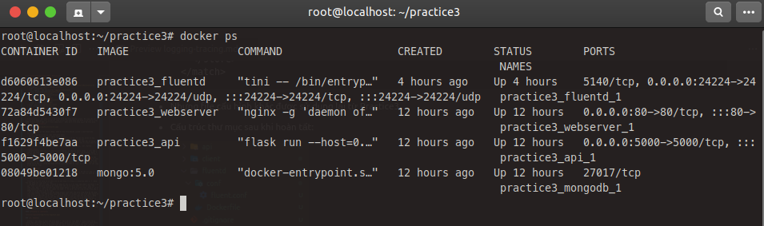
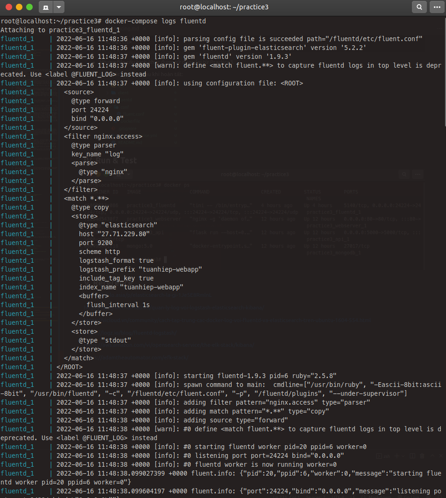
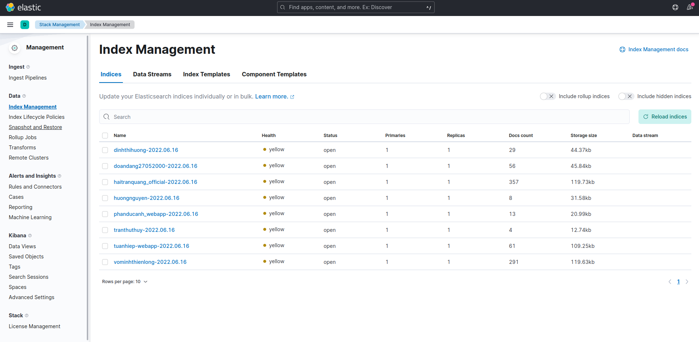
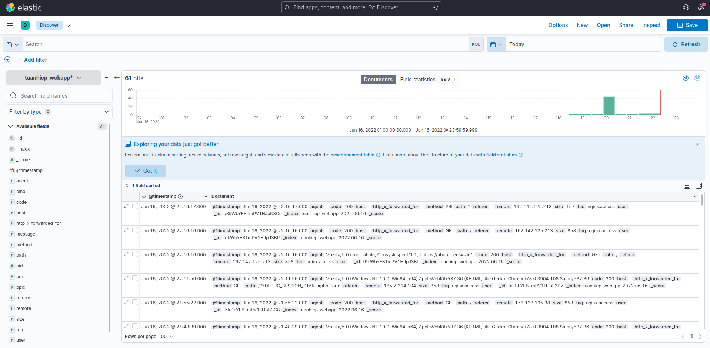

# **Viettel-Digital-Talent-2022: Pratice 5**

## **Logging & Tracing**

## **Mục Lục**

- [**Viettel-Digital-Talent-2022: Pratice 5**](#viettel-digital-talent-2022-pratice-5)
  - [**Logging & Tracing**](#logging--tracing)
  - [**Mục Lục**](#mục-lục)
  - [**I. Logging - EFK Stack**](#i-logging---efk-stack)
    - [**1. Elasticsearch**](#1-elasticsearch)
    - [**2. Fluentd**](#2-fluentd)
      - [**Fluentd vs Logstash**](#fluentd-vs-logstash)
    - [**3. Kibana**](#3-kibana)
  - [**II. Tracing**](#ii-tracing)
  - [**III. Assignment**](#iii-assignment)
    - [**1. Mô hình**](#1-mô-hình)
    - [**2. Cài đặt**](#2-cài-đặt)
  - [**IV. Run & Test**](#iv-run--test)
  - [**V. Reference**](#v-reference)

## **I. Logging - EFK Stack**

<!--  -->

### **1. Elasticsearch**

- Elasticsearch là một công cụ tìm kiếm dựa trên nền tảng Apache Lucene. Nó cung cấp một bộ máy tìm kiếm dạng phân tán, có đầy đủ công cụ với một giao diện web HTTP có hỗ trợ dữ liệu JSON. Elasticsearch được phát triển bằng Java và được phát hành dạng nguồn mở theo giấy phép Apache. (*Wikipedia*)

  

- **Ưu điểm**:
  - Tìm kiếm dữ liệu rất nhanh chóng, mạnh mẽ dựa trên Apache Lucene ( near-realtime searching)
  - Có khả năng phân tích dữ liệu (Analysis data)
  - Khả năng mở rộng theo chiều ngang tuyệt “vòi”
  - Hỗ trợ tìm kiếm mờ (fuzzy), tức là từ khóa tìm kiếm có thể bị sai lỗi chính tả hay không đúng cú pháp thì vẫn có khả năng elasticsearch trả về kết quả tốt.
  - Hỗ trợ Structured Query DSL (Domain-Specific Language ), cung cấp việc đặc tả những câu truy vấn phức tạp một cách cụ thể và rõ ràng bằng JSON.Các bạn có thể tìm hiểu thêm tại đây
  - Hỗ trợ nhiều Elasticsearc client như Java, PhP, Javascript, Ruby, .NET, Python

- **Nhược điểm**:
  - Elasticsearch được thiết kế cho mục đích search, do vậy với những nhiệm vụ khác ngoài search như CRUD thì elastic kém thế hơn so với những database khác như Mongodb, Mysql …. Do vậy người ta ít khi dùng elasticsearch làm database chính, mà thường kết hợp nó với 1 database khác.
  - Trong elasticsearch không có khái niệm database transaction , tức là nó sẽ không đảm bảo được toàn vẹn dữ liệu trong các hoạt độngInsert, Update, Delete.Tức khi chúng ta thực hiện thay đổi nhiều bản ghi nếu xảy ra lỗi thì sẽ làm cho logic của mình bị sai hay dẫn tới mất mát dữ liệu. Đây cũng là 1 phần khiến elasticsearch không nên là database chính.
  Không thích hợp với những hệ thống thường xuyên cập nhật dữ liệu. Sẽ rất tốn kém cho việc đánh index dữ liệu.

### **2. Fluentd**

- Fluentd là một trình thu thập dữ liệu mã nguồn mở để thống nhất cơ sở lưu trữ log của bạn. nó kết hợp các giải pháp đối với việc tính toán, ứng dụng, và dữ liệu với nhau để việc thu thập và lưu trữ log trở nên đơn giản và dễ mở rộng.

  

- Fluentd có 4 tính năng chính khiến nó có khả năng xây dựng các pipeline mượt mà và đang tin cậy dùng cho việc quản lí log:
  - Log được kết hợp với JSON: Fluentd cố gắng để cấu trúc dữ liệu như JSON càng nhiều càng tốt. Điều này cho phép Fluentd để thống nhất tất cả các khía cạnh của xử lý log: thu thập, lọc, đệm, và xuất bản ghi log trên nhiều nguồn và điểm đến khác nhau. Việc xử lý dữ liệu downstream là dễ dàng hơn nhiều với JSON, vì nó có đủ cấu trúc để có thể truy cập mà không làm cứng hóa sơ đồ dữ liệu.
  - Hỗ trợ plugin: Fluentd có một hệ thống plugin linh hoạt cho phép cộng đồng để mở rộng chức năng của nó. Hơn 300 plugin cộng đồng đóng góp các plugin kết nối hàng chục nguồn dữ liệu đến hàng chục đầu ra dữ liệu và cho phép thao tác với dữ liệu khi cần thiết. Bằng cách sử dụng plug-in, bạn có thể tận dụng tốt hơn các bản ghi của mình ngay lập tức.
  - Tối thiểu tài nguyên yêu cầu: Một trình thu thập dữ liệu cần có dung lượng nhẹ để nó chạy thoải mái trên mọi máy. Fluentd được viết bằng C và Ruby, nên đòi hỏi tối thiểu tài nguyên của hệ thống. Bản tiêu chuẩn của nó chiếm 30-40MB bộ nhớ và có thể xử lý 13.000 event / giây / lõi.
  - Độ tin cậy: Data loss sẽ không bao giờ xuất hiện. Fluentd hỗ trợ cả bộ đệm dựa trên bộ nhớ và file để tránh data loss. Nó cũng hỗ trợ chuyển đổi dự phòng mạnh mẽ và có thể được thiết lập cho tính sẵn sàng cao.

#### **Fluentd vs Logstash**



### **3. Kibana**

- Kibana là một công cụ hiển thị trực quan và khám phá dữ liệu được sử dụng trong những trường hợp phân tích nhật ký và chuỗi thời gian, giám sát ứng dụng và thông tin kinh doanh. Công cụ này cung cấp những tính năng mạnh mẽ, dễ sử dụng như biểu đồ tần suất, biểu đồ đường, biểu đồ tròn, biểu đồ nhiệt và hỗ trợ không gian địa lý được tích hợp sẵn. Ngoài ra, công cụ này còn cung cấp khả năng tích hợp chặt chẽ với Elasticsearch, một công cụ phân tích và tìm kiếm phổ biến, khiến Kibana trở thành lựa chọn hàng đầu cho hoạt động hiển thị trực quan dữ liệu được lưu trữ trong Elasticsearch.


- Lợi tích của Kibana:
  - Biểu đồ tương tác: Kibana cung cấp các biểu đồ và báo cáo trực quan mà bạn có thể sử dụng để điều hướng tương tác giữa một lượng lớn dữ liệu nhật ký. Bạn có thể linh hoạt kéo các cửa sổ thời gian, phóng to/thu nhỏ những tập dữ liệu con cụ thể và xem chi tiết các báo cáo để trích xuất thông tin hữu ích từ dữ liệu của mình.
  - Hỗ trợ ánh xạ: Kibana đi kèm với khả năng hỗ trợ không gian địa lý mạnh mẽ để bạn có thể xếp lớp thông tin địa lý một cách liền mạch lên trên dữ liệu của mình và hiển thị trực quan kết quả trên bản đồ.
  - Bộ lọc và dữ liệu tổng hợp được tạo sẵn: Sử dụng bộ lọc và dữ liệu tổng hợp được tạo sẵn của Kibana, bạn có thể chạy hàng loạt các phân tích như biểu đồ tần suất, truy vấn top-N và xu hướng với chỉ vài cú nhấp chuột.
  - Bảng thông tin dễ dàng truy cập: Bạn có thể dễ dàng thiết lập bảng thông tin và báo cáo cũng như chia sẻ chúng với những người khác. Bạn chỉ cần có một trình duyệt để xem và khám phá dữ liệu.

## **II. Tracing**

## **III. Assignment**

- Task: Tìm hiểu về Elasticsearch
  
- Đẩy log của các service đã làm ở Practice-3 vào fluentd, từ fluentd đẩy lên cụm ES: 27.71.229.80:9200, Kibana: 27.71.229.80:5601. Thể hiện được thông tin request từ browser -> webapp.

### **1. Mô hình**



### **2. Cài đặt**

- Dựa trên yêu cầu của assignment là sử dụng Practice3 (Webapp 3-tier đã containerize bằng docker, docker-compose), ta thực hiện triển khai `Fluentd` trên host đã deploy webapp để thu thập log và gửi tới cụm EFK đã được triển khai sẵn tại host (27.71.229.80).

- Cấu hình `docker-compose.yml` :

  ```yml
  version: '3.9'

  services:
      api:
          build:
            context: ./api
            dockerfile: Dockerfile
          volumes:
              - ./api/:/app
          ports:
            - 5000:5000
          environment:
              - FLASK_APP=api.py
          command: flask run --host=0.0.0.0

      webserver:
          build:
            context: ./client
            dockerfile: Dockerfile
          ports:
              - 80:80
          volumes:
              - ./client/nginx/conf.d/:/etc/nginx/conf.d/
              - ./client:/usr/share/nginx/html

          logging:
              driver: "fluentd"
              options:
                  fluentd-address: localhost:24224
                  tag: nginx.access
          depends_on: 
              - fluentd

      mongodb:
          image: mongo:5.0
          volumes:
              - .docker/data/db:/data/db

      fluentd:
          build: ./fluentd
          restart: always
          ports:
          - "24224:24224"
          - "24224:24224/udp"
      #     depends_on:
      #         - elasticsearch

      # elasticsearch:
      #     image: elasticsearch:8.2.2
      #     ports: # Exposes the default port 9200
      #         - 9200:9200
      #     environment:
      #         - discovery.type=single-node # Runs as a single-node
      #         - xpack.security.enabled=false

      # kibana:
      #     image: kibana:7.17.0
      #     links: # Links kibana service to the elasticsearch container
      #         - elasticsearch
      #     depends_on:
      #         - elasticsearch
      #     ports: # Runs kibana service on default port 5601
      #         - 5601:5601
      #     environment: # Defined host configuration
      #         - ELASTICSEARCH_HOSTS=http://elasticsearch:9200
  ```

- Phần comment trong file `docker-compose.yml` sử dụng để triển khai cụm EFK stack (Nếu chưa có sẵn cụm). Ở trong Assigment này, mentor đã tạo sẵn cụm nên ta chỉ cần triển khai fluentd.

- Cấu hình `Dockerfile` để tạo container Fluentd:

  ```yml
  FROM fluent/fluentd:v1.9
  USER root

  RUN apk add --no-cache --update --virtual .build-deps \
      sudo build-base ruby-dev \
      && gem install elasticsearch -v 7.17.0 \
      && gem install fluent-plugin-elasticsearch \
      && gem sources --clear-all \
      && apk del .build-deps \
      && rm -rf /tmp/* /var/tmp/* /usr/lib/ruby/gems/*/cache/*.gem

  # copy fluentd configuration from host image
  COPY ./conf/fluent.conf /fluentd/etc/

  # USER fluent
  ```

- Một lưu ý khi tạo container Fluentd trên các host lấy log là các version cần đồng bộ với cụm EFK đã triển khai, nếu không sẽ có thể gặp lỗi "unsupported".

- Cấu hình cho Fluentd. `/fluentd/conf/fluent.conf`:

  ```config
  <source>
    @type forward
    port 24224
    bind 0.0.0.0
  </source>

  <filter nginx.access>
    @type parser
    key_name log
    <parse>
      @type nginx
    </parse>
  </filter>

  <match *.**>
    @type copy
    <store>
      @type elasticsearch
      host 27.71.229.80
      port 9200
      scheme http
      logstash_format true
      logstash_prefix tuanhiep-webapp
      include_tag_key true
      index_name tuanhiep-webapp
      <buffer>
        flush_interval 1s
      </buffer>
    </store>
    <store>
      @type stdout
    </store>
  </match>
  ```

- Nhưng file cấu hình khác được sử dụng lại từ Practice3.

- Cấu trúc thư mục sau khi hoàn tất:

  

## **IV. Run & Test**

- Kiểm tra container hoạt động trên host triển khai webapp.


- Kiểm tra log container `fluentd`


- Kiểm tra trên Kibana của cụm EFK: (27.71.229.80:5601)




## **V. Reference**

<https://viblo.asia/p/elasticsearch-la-gi-1Je5E8RmlnL>

<https://blog.vietnamlab.vn/quan-ly-log-voi-logstash-elasticsearch-kibana/>

<https://vicloud.vn/community/cach-tap-trung-cac-docker-log-voi-fluentd-va-elasticsearch-tren-ubuntu-1604-554.html>

<https://logz.io/blog/fluentd-logstash/>

<https://aws.amazon.com/vi/opensearch-service/the-elk-stack/kibana/>

<https://adamtheautomator.com/efk-stack/>
