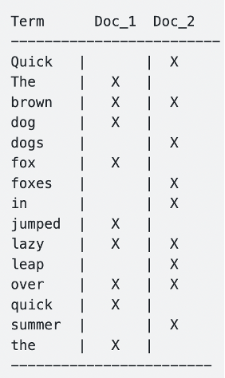
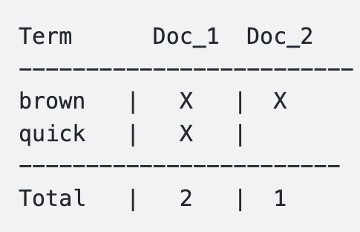
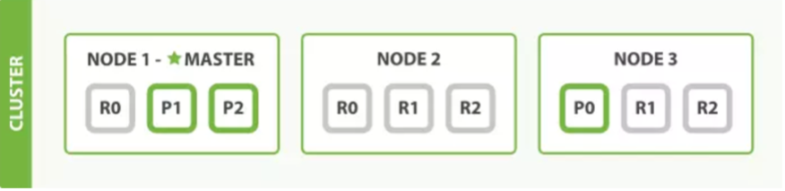
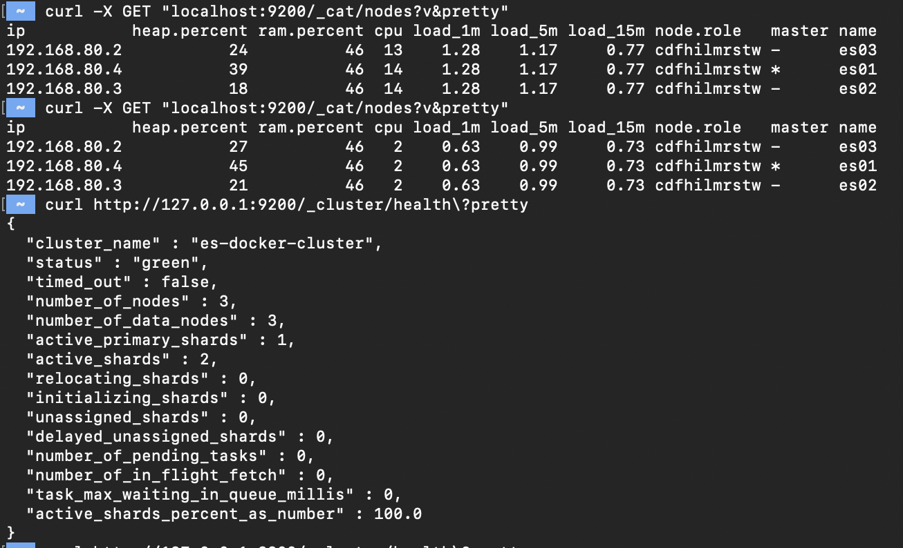
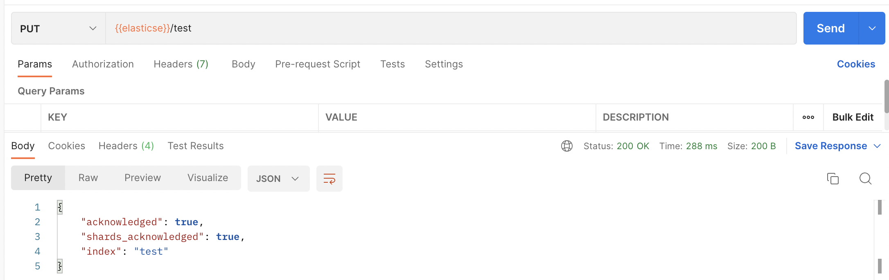
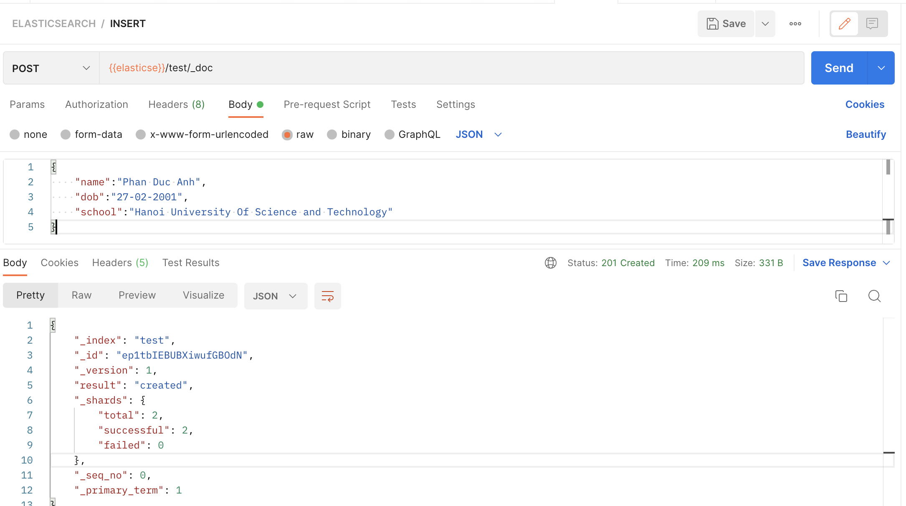
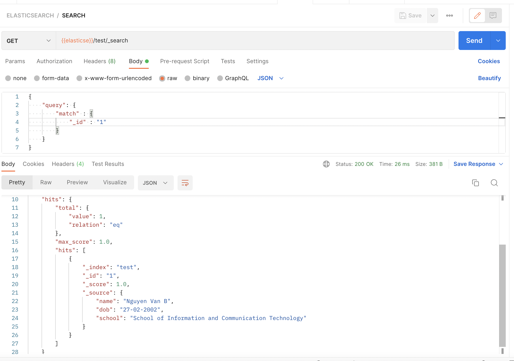

- [1. Tìm hiểu về Elasticsearch](#1-tìm-hiểu-về-elasticsearch)
  - [1.1. Giới thiệu về Elasticsearch](#11-giới-thiệu-về-elasticsearch)
    - [1.1.1. Ưu điểm](#111-ưu-điểm)
    - [1.1.2. Nhược điểm](#112-nhược-điểm)
  - [1.2. Một số khái niệm chính trong Elasticsearch](#12-một-số-khái-niệm-chính-trong-elasticsearch)
    - [1.2.1. Document](#121-document)
    - [1.2.2. Index](#122-index)
    - [1.2.3. Index](#123-index)
    - [1.2.3. Shard](#123-shard)
      - [1.2.3.1. Primary Shard](#1231-primary-shard)
      - [1.2.3.2. Replica Shard](#1232-replica-shard)
    - [1.2.4. Cluster](#124-cluster)
    - [1.2.5. Node](#125-node)
      - [1.2.5.1. Master Node](#1251-master-node)
      - [1.2.5.2. Data Node](#1252-data-node)
      - [1.2.5.3. Coordinating Node](#1253-coordinating-node)
      - [1.2.5.4. Ingest Node](#1254-ingest-node)
      - [1.2.5.5. Tribe Node](#1255-tribe-node)
- [2. Setup Elasticsearch với Docker](#2-setup-elasticsearch-với-docker)
- [3. Query trong Elasticsearch](#3-query-trong-elasticsearch)

# 1. Tìm hiểu về Elasticsearch

## 1.1. Giới thiệu về Elasticsearch

Elasticsearch là một open source full-text search và analytics engine theo thời gian thực. Truy cập elasticsearch được thông qua một RESTful web service interface và nó sử dụng JSON documents để lưu dữ liệu. Elasticsearch được viết bằng Java nên nó có thể chạy được trên nhiều nền tảng. Elasticsearch cho phép truy cập và truy vấn dữ liệu lớn ở một tốc độc cao.

Một số tính năng của Elasticsearch có thể kể đến như:

- Elasticsearch có khả năng scale lên tới petabytes
- Elasticsearch có khả năng phân tích và thống kê dữ liệu
- Elasticsearch có khả năng phân tán và mở rộng
- Elasticsearch lưu dữ liệu dưới dạng JSON

### 1.1.1. Ưu điểm

- Elasticsearch được viết bằng Java giúp cho nó có thể sử dụng trên hầu hết các nền tảng.
- Elasticsearch là một engine thời gian thực, tức là dữ liệu vừa được thêm vào có thể được tìm kiếm ngay lập tức
- Elasticsearch là một server có thể phân tán, điều này giúpc cho việc scale và kết hợp với các nền tảng khác nhau trong một tổ chức lớn trở nên dễ dàng.
- Có thể backups dễ dàng
- Elasticsearch sử dụng JSON để lưu trữ dữ liệu giúp cho nó dẽ dàng được xử lí và phát triển
- Hiệu năng của elasticsearch là tương đối tốt so với các loại database khác trong việc indexing cũng như querying

### 1.1.2. Nhược điểm

- Request cũng như response data chỉ hỗ trợ một dạng, không flexible như một số loại database khác.
- Có thể xuất hiện hiện tượng split brain
- Elasticsearch được thiết kế cho mục đích search, do vậy với những nhiệm vụ khác ngoài search như CRUD thì elastic kém thế hơn so với những database khác như Mongodb, Mysql …. Do vậy người ta ít khi dùng elasticsearch làm database chính, mà thường kết hợp nó với 1 database khác.
- Không thích hợp với những hệ thống thường xuyên cập nhật dữ liệu. Sẽ rất tốn kém cho việc đánh index dữ liệu.

## 1.2. Một số khái niệm chính trong Elasticsearch

### 1.2.1. Document

Document là một JSON object với một số dữ liệu. Đây là basic information unit trong ES. Hiểu 1 cách cơ bản thì đây là đơn vị nhỏ nhất để lưu trữ dữ liệu trong Elasticsearch.

### 1.2.2. Index

Trong Elasticsearch, sử dụng một cấu trúc được gọi là inverted index. Nó được thiết kế để cho phép tìm kiếm full-text search. Cách thức của nó khá đơn giản, các văn bản được phân tách ra thành từng từ có nghĩa sau đó sẽ được map xem thuộc văn bản nào. Khi search tùy thuộc vào loại search sẽ đưa ra kết quả cụ thể.

### 1.2.3. Index

Trong Elasticsearch, sử dụng một cấu trúc được gọi là inverted index. Nó được thiết kế để cho phép tìm kiếm full-text search. Cách thức của nó khá đơn giản, các văn bản được phân tách ra thành từng từ có nghĩa sau đó sẽ được map xem thuộc văn bản nào. Khi search tùy thuộc vào loại search sẽ đưa ra kết quả cụ thể.

Ví dụ:

- The quick brown fox jumped over the lazy dog
- Quick brown foxes leap over lazy dogs in summer

Để tạo ra một inverted index, trước hết chúng ta sẽ phân chia nội dung của từng tài liệu thành các từ riêng biệt (chúng gọi là terms), tạo một danh sách được sắp xếp của tất cả terms duy nhất, sau đó liệt kê tài liệu nào mà mỗi thuật ngữ xuất hiện. Kết quả như sau:

  

Bây giờ, nếu chúng ta muốn tìm kiếm quick brown, chúng ta chỉ cần tìm trong các tài liệu trong đó mỗi thuật ngữ có xuất xuất hiện hay không. Kết quả như sau:

  

Như vậy, cả 2 đoạn văn bản đều thích hợp với từ khóa. Tuy nhiên có thể dễ dàng nhận ra rằng Doc_1 chính xác hơn nhiều.

### 1.2.3. Shard

Shard là là tập con các documents của 1 Index. Một Index có thể được chia thành nhiều shard. Mỗi node bao gồm nhiều Shard. Chính vì thế Shard mà là đối tượng nhỏ nhất, hoạt động ở mức thấp nhất, đóng vai trò lưu trữ dữ liệu. Chúng ta gần như không bao giờ làm việc trực tiếp với các Shard vì Elasticsearch đã support toàn bộ việc giao tiếp cũng như tự động thay đổi các Shard khi cần thiết. Có 2 loại Shard là: primary shard và replica shard.

#### 1.2.3.1. Primary Shard

Dữ liệu được lưu tại 1 primary shard, được đánh index ở đây trước khi chuyển đến replica shard. Mặc định của Elasticsearch là 5 primary shard cho một index (một index trong Elasticsearch tương đương với một database trong MySQL). Một khi đã khởi tạo index thì không thể thay đổi số lượng primary shard cho nó.

#### 1.2.3.2. Replica Shard

Một primary shard có thể không có, hoặc có replica shard. Mặc định Elasticsearch là 1 replica shard trên một primary shard. Vai trò của replica shard cũng giống như slave trong MySQL, đảm bảo khi primary shard có sự cố thì dữ liệu vẫn toàn vẹn và thay thế được primary shard, đồng thời tăng tốc độ đọc vì replica shard có thể là nhiều hơn 1. Trong quá trình hoạt động, bạn được thay thế số lượng replica shard một cách thoải mái (không như primary shard).

Dưới đây là một mô hình đơn giản cho kiến trúc cluster-node-shard của Elasticsearch.

Nhìn vào hình trên chúng ta có thể thấy, dữ liệu được lưu trữ ở cluster với 3 nodes trong đó node 1 là master. Có 3 primary shards, 2 trong số đó được đặt ở node 1, còn lại ở node 3. Mỗi primary shard có 2 replica shard (ví dụ primary shard P0 ở node 3 thì có replica shard R0 ở node 1 và một shard nữa ở Node 2). Việc sắp đặt vị trí primary shard là ngẫu nhiên, còn các replica shard luôn được đảm bảo là nó không nằm cùng node với primary shard (điều này đảm bảo khi 1 node ngưng hoạt động thì đảm bảo dữ liệu không bị mất). Thêm nữa là không bắt buộc primary shard đều nằm ở node master, vì việc phân tán các primary shard giúp phân tán công đoạn ghi dữ liệu, giúp giảm tải cho một node.

### 1.2.4. Cluster

Tập hợp các nodes hoạt động cùng với nhau, chia sẻ cùng thuộc tính cluster.name. Mỗi cluster có một/các node chính (master), được lựa chọn một cách tự động và có thể thay thế nếu sự cố xảy ra. Một cluster có thể gồm 1 hoặc nhiều nodes. Các nodes có thể hoạt động trên cùng 1 server với mục đích test. Tuy nhiên trong thực tế vận hành, một cluster sẽ gồm nhiều nodes hoạt động trên các server khác nhau để đảm bảo nếu 1 server gặp sự cố thì server khác (node khác) có thể hoạt động đầy đủ chức năng so với khi có 2 servers. Các node có thể tìm thấy nhau để hoạt động trên cùng 1 cluster qua giao thức unicast.

### 1.2.5. Node

Là trung tâm hoạt động của Elasticsearch. Là nơi lưu trữ dữ liệu, tham gia thực hiện đánh index của cluster cũng như thực hiện các thao tác tìm kiếm. Mỗi node được định danh bằng 1 unique name.

#### 1.2.5.1. Master Node

Master node phụ trách điều phối hoạt động của cluster. Nó thay đổi, xoá, tạo các index, trường, thêm xoá nodes và phân bổ shard cho các nodes. Mỗi cluster có một/các node master được chọn từ các master eligible nodes bằng một giải thuật đồng thuận và nó sẽ được bình chọn lại nếu master node bị lỗi.

#### 1.2.5.2. Data Node

Data nodes gồm các shards chứa dữ liệu đã được index. Data nodes sẽ xử lí các công việc như CRUD, search và aggregations. Lợi ích của việc có data nodes là có thể phân biệt rõ ràng được các roles của nodes như master hay data.

Ta có thể mô tả cụ thể một data nodes thành các loại: data_content, data_hot, data_warm, data_cold, data_frozen.

#### 1.2.5.3. Coordinating Node

Một số request như request để tìm kiếm có thể gồm data ở các node khác nhau. Ví dụ như search request được thực thi qua 2 giai đoạn và được điều khiển bởi node nhận request từ client ( hay còn gọi là coordinating node). Coordinating node sẽ forwards các request tới data nodes chứa dữ liệu và nhận dữ liệu trả về từ các data nodes rồi tổng hợp để trả về dữ liệu cho người dùng.

#### 1.2.5.4. Ingest Node

Ingest node là node xử lí ingest pipelines. Ingest piplines cho phép thực hiện xử lí dữ liệu trước khi indexing. Chẳng hạn ta sử dụng pipelines để xoá trường, trích xuất dữ liệu. Pipeline bao gồm một chuỗi các task gọi là processors. Mỗi processor được thực hiện theo thứ tự định trước, sau khi hoàn thành thì elasticsearch thêm dữ liệu được biến đổi vào bộ nhớ hoặc dùng để indexing.

  

#### 1.2.5.5. Tribe Node

Hoạt động với chức năng đặc biệt như một Client Node có khả năng giao tiếp với rất nhiều cụm ES Cluster khác nhau để thực hiện các thao tác tìm kiếm hoặc hành vi liên quan đến dữ liệu.

# 2. Setup Elasticsearch với Docker

Ta sẽ setup một cụm ES gồm 3 node cơ bản, với file [docker-compose.yml](elasticsearch/docker-compose.yml) như sau:

    version: "2.2"
    services:
      es01:
        image: docker.elastic.co/elasticsearch/elasticsearch:8.2.3
        container_name: es01
        environment:
          - node.name=es01
          - cluster.name=es-docker-cluster
          - discovery.seed_hosts=es02,es03
          - cluster.initial_master_nodes=es01,es02
          - bootstrap.memory_lock=false
          - "ES_JAVA_OPTS=-Xms512m -Xmx512m"
          - xpack.security.enabled=false
        volumes:
          - data01:/usr/share/elasticsearch/data
        ports:
          - 9200:9200
        networks:
          - elastic
      es02:
        image: docker.elastic.co/elasticsearch/elasticsearch:8.2.3
        container_name: es02
        environment:
          - node.name=es02
          - cluster.name=es-docker-cluster
          - discovery.seed_hosts=es01,es03
          - cluster.initial_master_nodes=es01,es02
          - bootstrap.memory_lock=false
          - "ES_JAVA_OPTS=-Xms512m -Xmx512m"
          - xpack.security.enabled=false
        volumes:
          - data02:/usr/share/elasticsearch/data
        networks:
          - elastic
      es03:
        image: docker.elastic.co/elasticsearch/elasticsearch:8.2.3
        container_name: es03
        environment:
          - node.name=es03
          - cluster.name=es-docker-cluster
          - discovery.seed_hosts=es01,es02
          - cluster.initial_master_nodes=es01,es02
          - bootstrap.memory_lock=false
          - "ES_JAVA_OPTS=-Xms512m -Xmx512m"
          - xpack.security.enabled=false
        volumes:
          - data03:/usr/share/elasticsearch/data
        networks:
          - elastic
      kibana:
        image: docker.elastic.co/kibana/kibana:8.2.3
        environment:
          ELASTICSEARCH_HOSTS: '["http://es01:9200","http://es02:9200","http://es03:9200"]'
        ports:
          - 5601:5601
        networks:
          - elastic
        depends_on:
          - es01
          - es02
          - es03
    volumes:
      data01:
        driver: local
      data02:
        driver: local
      data03:
        driver: local

    networks:
      elastic:
        driver: bridge

Các biến môi trường ở đây khá cơ bản, có 2 trường quan trọng là discovery.seed_hosts dùng để list các eligible master node mà node này sẽ kết nối tới để thực hiện quá trình bình chọn node master. Tiếp theo là biến cluster.initial_master_node dùng để list các eligible master node lần đầu tiên khi mà cluster được khởi động, các node này sẽ là node để thực hiện election lần đầu tiên. Sau khi chạy docker-compose, ta có thể sử dụng các lệnh dưới đây để kiểm tra cluster đã chạy ổn định chưa:

    curl -X GET "localhost:9200/_cat/nodes?v&pretty"
    curl http://127.0.0.1:9200/_cluster/health\?pretty

# 3. Query trong Elasticsearch

Để tạo một index, ta sử dụng:

    PUT /{index_name}

Ta cũng có thể cấu hình số shard và số replica của index bằng 1 JSON object:

    PUT /{index_name}
    {
        "settings" : {
            "index" : {
                "number_of_shards" : 3,
                "number_of_replicas" : 2
            }
        }
    }

Mặc định number_of_shard = 5 và number_of_replicas = 1

Xoá shard, ta sử dụng:

    DELETE /index_name

Thêm dữ liệu vào, ta sử dụng:

    PUT /<target>/_doc/<_id>

    POST /<target>/_doc/

    PUT /<target>/_create/<_id>

    POST /<target>/_create/<_id>

    {
      "field" : "value"
    }

Để query, ta sử dụng GET /{index_name}/\_search. Ví dụ, match query: tìm kiểu doc có \_id là 1

    {
        "query": {
            "match" : {
                "_id" : "1"
            }
        }
    }

Một số dạng query khác có thể kể đến như: Fuzzy, Boolean, Multimatch.

