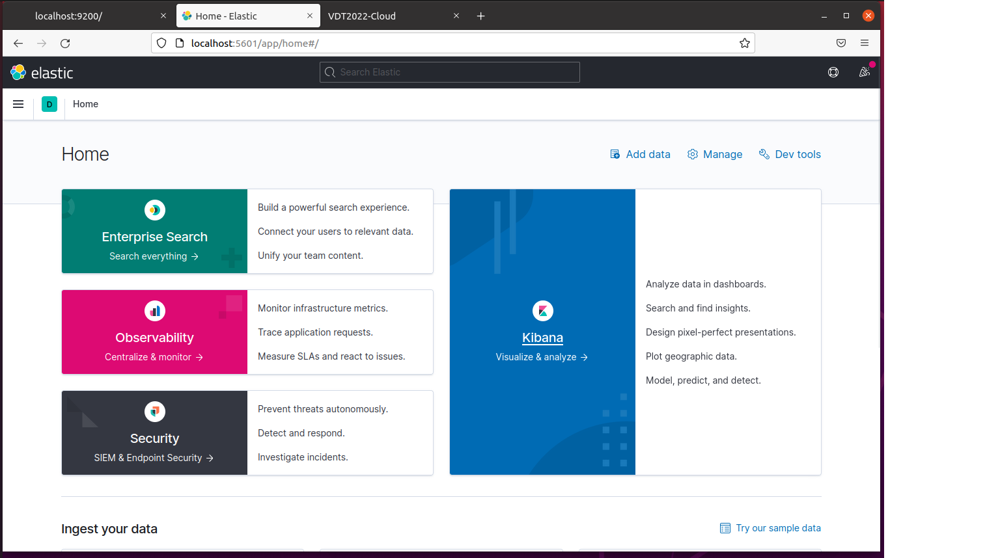
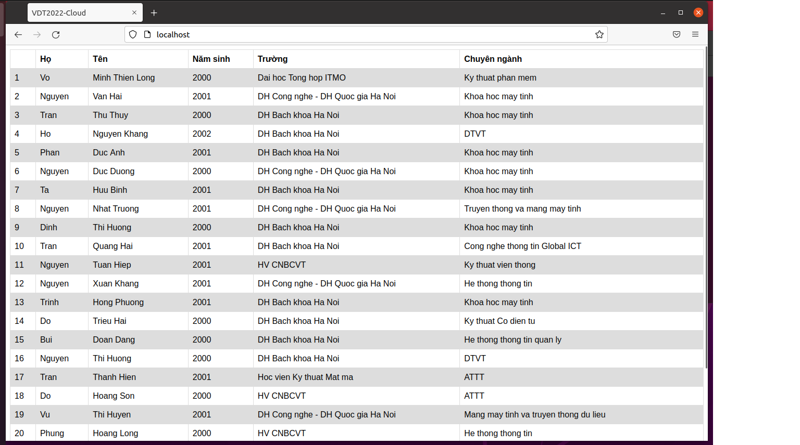
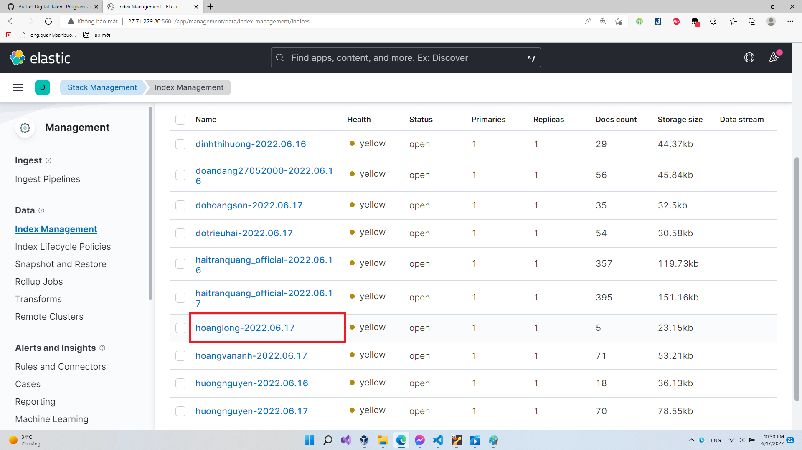

# PRACTICE 5

---

### **Author:** *Phùng Hoàng Long* 

---

# I. Elasticsearch

## 1. Elasticsearch là gì?

- **Elasticsearch** là một kho dữ liệu dựa trên JSON (noSQL JSON based Data store). Nó là một công nghệ mã nguồn mở về tìm kiếm và phân tích dựa trên **Apache lucene**.
- **Elasticsearch** có khả năng giao tiếp thông qua giao thức RESTful và hoạt động như một wevserver có khả năng tìm kiếm nhanh chóng.

## 2. Lợi ích của Elasticsearch

**Elasticsearch** cung cấp các lợi ích mà các lập trình viên luôn tìm kiếm để tạo nhanh một cơ sở dữ liệu và giải pháp full-text search tin cậy.

- **Khả năng mở rộng:** Elasticsearch dễ dàng để mở rộng khi chỉ cần add thêm node cho nó và nó sẽ tự mở rộng.
- **Hỗ trợ đa ngôn ngữ:** Như một giải pháp mã nguồn mở, **Elasticsearch** dễ dàng tương thích với nhiều ngôn ngữ lập trình.
- **Tự động hoàn thiện:** Thiết kế thân thiện với người dùng của nó giúp người dùng dễ dàng cải thiện việc cung cấp tìm kiếm của họ và tìm thấy kết quả có liên quan khi họ nhập các truy vấn của họ.
- **Hỗ trợ plugin và tích hợp:** Một trong những tính năng xác định của **Elasticsearch** là khả năng tương thích với nhiều plugin và tích hợp khác nhau. Điều này bao gồm các tiện ích mở rộng API, công cụ cảnh báo, plugin bảo mật, tích hợp khôi phục dữ liệu và hơn thế nữa. Chức năng dễ mở rộng của **Elasticsearch** giúp nó dễ dàng thích nghi với tất cả các nhu cầu của doanh nghiệp mà không phải hy sinh khả năng cốt lõi của nó.

## 3. EFK Stack

EFK (Eslasticsearch - Fluentd - Kibana) là một tổ hợp các công cụ giúp chúng ta thực hiện thu thập, quản lý logs.

### Cơ chế hoạt động


- Đầu tiên, log sẽ được đưa đến Fluentd. (Ví dụ như log access server nginx/apache, log do develop setting trong source php/java vv. miễn là có ghi ra file log).
- Fluentd sẽ đọc những log này, thêm những thông tin như thời gian, IP, parse dữ liệu từ log (server nào, độ nghiêm trọng, nội dung log) ra, sau đó ghi xuống database là Elasticsearch.
- Khi muốn xem log, người dùng vào URL của Kibana. Kibana sẽ đọc thông tin log trong Elasticsearch, hiển thị lên giao diện cho người dùng query và xử lý.
- Log có nhiều loại (tag), do developer định nghĩa chẳng hạn access_log error_log, peformance_log, api_log. Khi Fluentd đọc log và phân loại từng loại log rồi gửi đến Elasticsearch, ở giao diện Kibana chúng ta chỉ cần add một số filter như access_log chẳng hạn và query.

## 4. So sánh với mySQL

Để dễ hình dung hơn về dữ liệu của **Elasticsearch**, ta sẽ so sánh nhanh với mySQL-một hệ quản trị cơ sở dữ liệu khá phổ biến.

<table>
    <thead>
        <tr>
            <th>mySQL</th>
            <th>Elasticsearch</th>
        </tr>
    </thead>
    <tbody>
        <tr>
            <td>SQL</td>
            <td>no SQL</td>
        </tr>
        <tr>
            <td>Relational DB</td>
            <td>Non-Relational DB</td>
        </tr>
        <tr>
            <td>DB</td>
            <td>Indexes/Indices</td>
        </tr>
        <tr>
            <td>Tables</td>
            <td>Pattens/Types</td>
        </tr>
        <tr>
            <td>Rows</td>
            <td>Documents</td>
        </tr>
        <tr>
            <td>Columns</td>
            <td>Feilds</td>
        </tr>
    </tbody>
</table>

## 5. Deploy eslasticserch và kibana

Ta sẽ sử dụng Docker v3.3 để thực hiện deploy
```
version: "3.3"
services:
```

Tiến hành pull image của eslasticsearch và chạy như một single-node, cổng mặc định của eslasticsearch là 9200
```
  elasticsearch:
    container_name: eslastic
    image: docker.elastic.co/elasticsearch/elasticsearch:7.11.0
    environment:
      - xpack.security.enabled=false
      - "discovery.type=single-node"
    networks:
      - es-net
    ports:
      - 9200:9200

```

Tiến hành pull image của kibana và chỉ định ESLASTICSEARCH_HOST, ở đây ta chạy với node mặc định là `{{your_local_ip}}:9200`
```
  kibana:
    container_name: kibana
    image: docker.elastic.co/kibana/kibana:7.11.0
    environment:
      - ELASTICSEARCH_HOSTS="http://{{your_local_ip}}:9200"
    networks:
      - es-net
    depends_on:
      - elasticsearch
    ports:
      - 5601:5601

```

Để thực hiện kết nối 2 service trong docker, cần thiết lập một network chung cho 2 service đó mô hình như sau

```
networks:
  es-net:
    driver: bridge
```

Chạy `docker-compose up` và xem kết quả thôi:



# II. Tiến hành đẩy log

Ta sẽ tiến hành đẩy logs vào fluentd, từ fluentd đẩy lên cụm ES: `27.71.229.80:9200`, Kibana: `27.71.229.80:5601`. Thể hiện được thông tin request từ browser -> webapp.

## Cài đặt

Sử dụng sẵn file docker-compose.yml ở practice 3.

Ta thực hiện cài đặt thêm Fluentd:
```
  fluentd:
    build: fluentd/.
    restart: always
    ports:
    - "24224:24224"

```

Viết Dockerfile trong folder fluentd
```
FROM fluent/fluentd:v1.9
USER root

RUN apk add --no-cache --update --virtual .build-deps \
    sudo build-base ruby-dev \
    && gem install fluent-plugin-elasticsearch \
    && gem sources --clear-all \
    && apk del .build-deps \
    && rm -rf /tmp/* /var/tmp/* /usr/lib/ruby/gems/*/cache/*.gem

USER fluent
```
Cấu hình cho fluentd trong file fluent.conf
```
<source>
  @type forward
  port 24224
  bind 0.0.0.0
</source>

<match *.**>
  @type copy
  <store>
    @type elasticsearch
    host {{your_host_ip}}
    port 9200
    logstash_format true
    logstash_prefix hoanglong
    include_tag_key true
  </store>
  <store>
    @type stdout
  </store>
</match>
```

Cuối cùng là thêm cấu hình dẩy log cho những container cần đẩy ở:
```
  flask: 
    container_name: my-flaskapp
    build: backend/.
    ports:
      - "8000:5000"
    logging:
      driver: "fluentd"
      options:
        fluentd-address: "0.0.0.0:24224"
        tag: flask

  nginx:
    build: frontend/.
    ports:
      - 80:80
    links:
      - flask
    logging:
      driver: "fluentd"
      options:
        fluentd-address: "0.0.0.0:24224"
        tag: nginx

```

Thực hiện `docker-compose up -d` và xem kết quả:

webapp:


Thành công đẩy lên `27.71.229.80:5601`
