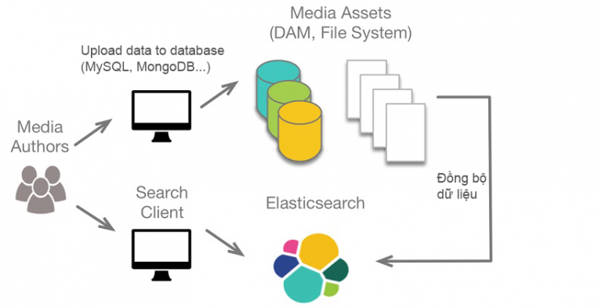

# **ELASTICSEARCH**

## **0. Table of contents**
### [1. Elasticsearch là gì?](#elasticsearch-la-gi)
### [2. Elasticsearch dùng để làm gì?](#elasticsearch-dung-lam-gi)
### [3. Một số khái niệm quan trọng trong elasticsearch](#khai-niem-quan-trong)
### [4. Cài đặt Elasticsearch](#cai-dat-elasticsearch)

### [5. Một số câu lệnh thường dùng trong elasticsearch](#cau-lenh-hay-dung)

<a name='elasticsearch-la-gi'></a>
## **1. Elasticsearch là gì?**

ElasticSEARCH là một công cụ tìm kiếm dựa trên nền Apache Lucene - được phát triển bằng Java và được phát hành dạng nguồn mở theo Apache license.

Elasticsearch hoạt động như một web server thông qua RESTful API, có thể chạy trên server riêng => Tích hợp dễ dàng.

<a name='elasticsearch-dung-lam-gi'></a>
## **2. Elasticsearch dùng để làm gì?**

Elasticsearch nên được dùng như một server riêng biệt chỉ để phục vụ tìm kiếm dữ liệu và thường sẽ dùng song song với một database chính (SQL, NoSQL...)



So với các database SQL thông thường, ES vượt trội ở khả năng tìm kiếm theo từ khóa.

Các database thông thường sẽ sử dụng truy vấn LIKE '%tu-duoc-tim-kiem%' và kết quả trả về bắt buộc phải có 'tu-duoc-tim-kiem' trong nó => Rất hạn chế với tiếng Việt hoặc các ngôn ngữ nhiều ký tự đặc biệt (Unicode). Đồng thời, các truy vấn dạng LIKE '%X%' sẽ không thể sử dụng index => Database sẽ xử lý rất chậm khi có lượng dữ liệu lớn.

Elasticsearch sẽ sử dụng inverted index cho toàn bộ các từ khóa trong văn bản => Sử dụng nhiều bộ nhớ.

<a name='khai-niem-quan-trong'></a>
## **3. Một số khái niệm quan trọng trong elasticsearch**

## **3.1. Document**

Document là một JSON object thông thường. Đây chính là đơn vị nhỏ nhất để lưu trữ dữ liệu trong Elasticsearch.

## **3.2. Index**

Index trong Elasticsearch được thiết kế khác so với các loại index thường thấy trong các database SQL phổ biến.

Các văn bản được phân tách thành từng token (một tiếng) và mỗi tiếng sẽ chính là một entry trong index. Có thể diễn giải một cách nôm na như sau:

Map[token][document] = 1 => token xuất hiện trong document

Map[token][document] = 0 => token không xuất hiện trong document

VD về documents và index:

Chúng ta có 3 văn bản như sau:

1, Làm Dev là một công việc khó khăn  
2, Làm Ops là một công việc khá khó khăn
3, Làm DevOps là một công việc rất khó khăn

=> JSON Objects:
```
[
    {
        "term": "Làm Dev là một công việc khó khăn"
    },
    {
        "term": "Làm Ops là một công việc khá khó khăn"
    },
    {
        "term": "Làm DevOps là một công việc rất khó khăn"
    },
]
```
=> Index:
```
Term      Doc_1  Doc_2  Doc_3
-------------------------------
Làm     |   X   |  X  |   X
Dev     |   X   |     |
Ops     |       |  X  |
DevOps  |       |     |   X
là      |   X   |  X  |   X
một     |   X   |  X  |   X
công    |   X   |  X  |   X
việc    |   X   |  X  |   X
khó     |   X   |  X  |   X
khá     |       |  X  |
rất     |       |     |   X
khăn    |   X   |  X  |   X
-------------------------------
```
Ta sẽ thử tìm kiếm cụm từ "dễ dàng", khi đó, Elasticsearch sẽ tìm trong các tài liệu xem mỗi token có xuất hiện hay không. Kết quả:
```
Term      Doc_1  Doc_2  Doc_3
-------------------------------
dễ      |       |     |    
dàng    |       |     |
-------------------------------
Total   |   0   |  0  |   0
```

Chúng ta có thể thấy, không có công việc nào dễ dàng. Thử với trường hợp tìm kiếm cụm từ "khó khăn"
```
Term      Doc_1  Doc_2  Doc_3
-------------------------------
khó     |   X   |  X  |   X 
khăn    |   X   |  X  |   X
-------------------------------
Total   |   2   |  2  |   2
```
Cả 3 văn bản đều thích hợp với từ khóa => Công việc nào cũng khó khăn

## **3.3. Node**

Là nơi lưu trữ dữ liệu, thực hiện các thao tác tìm kiếm và được định danh bằng một unique name

## **3.4. Shard**

Là một tập con các documents của một index, gồm 2 loại Primary Shard và Replica Shard (bản sao của Primary Shard)

## **3.5. Cluster**

Tập hợp các nodes cùng hoạt động với nhau. Các node trên cùng một cluster có thể tìm thấy nhau để hoạt động qua giao thức [unicast](https://erg.abdn.ac.uk/users/gorry/course/intro-pages/uni-b-mcast.html)

<a name='cai-dat-elasticsearch'></a>
## **4. Cài đặt Elasticsearch**

Việc cài đặt trực tiếp lên máy có thể gây ra các lỗi dẫn đến ảnh hưởng tâm lý không cần thiết và lâu dài cho người sử dụng. Thay vào đó, chúng ta có thể sử dụng docker-compose để khởi tạo elasticsearch:
```
version: '3.0'

services:
  elasticsearch:
    image: elasticsearch:8.2.2
    restart: always
    environment:
      - xpack.security.enabled=false
      - "discovery.type=single-node"
    ports:
      - 9200:9200
```

<a name='cau-lenh-hay-dung'></a>
## **5. Một số câu lệnh thường dùng trong elasticsearch**

## **5.1. Làm việc với index**
```
| To do            | Path*                 | Request Type    |
|------------------|-----------------------|-----------------|
| Create an index  | /<index-name>         | PUT             |
| View all indices | /_cat/indices         | GET             |
| Delete an index  | /<index-name>         | DELETE          |
| Search           | /<index_name>/_search | GET (with body) |

*Thêm url của Elasticsearch vào trước path (VD: http://localhost:9200)
```

## **5.2. Các loại truy vấn phổ biến**

Trong phần này, chúng ta sẽ xét đến body của Request Search trong phần 5.1

## **5.2.1. Match**
```
{
    "query": {
        "match" : {
            "title" : "in action"
        }
    }
}
```
Kết quả sẽ trả về các document mà title chứa cụm "in action"

## **5.2.2. Multi-match**
```
{
    "query": {
        "multi_match" : {
            "query" : "elasticsearch guide",
            "fields": ["title", "summary"]
        }
    }
}
```
Kết quả trả về là các document mà title hoặc summary chứa cụm "elasticsearch guide"

## **5.2.3. Bool**
```
{
    "query": {
        "bool": {
            "must": {
                "bool" : { "should": [
                      { "match": { "title": "Elasticsearch" }},
                      { "match": { "title": "Solr" }} ] }
            },
            "must": { "match": { "authors": "clinton gormely" }},
            "must_not": { "match": {"authors": "radu gheorge" }}
        }
    }
}
```
must = and

should = or

must_not = not

## **5.2.4. Fuzzy Queries**
```
{
    "query": {
        "multi_match" : {
            "query" : "comprihensiv guide",
            "fields": ["title", "summary"],
            "fuzziness": "AUTO"
        }
    }
}
```
Fuzzy Queries được thực hiện dựa trên [khoảng cách Levenshtein giữa 2 xâu](https://people.cs.pitt.edu/~kirk/cs1501/Pruhs/Spring2006/assignments/editdistance/Levenshtein%20Distance.htm) - Số bước ít nhất để biến đổi 1 xâu thành xâu còn lại

## **5.2.5. Wildcard Queries**
```
{
    "query": {
        "wildcard" : {
            "authors" : "t*"
        }
    }
}
```
Kết quả trả ra giống wildcard trong SQL

## **5.2.6. Match Phrase**
```
{
    "query": {
        "multi_match" : {
            "query": "search engine",
            "fields": ["title", "summary"],
            "type": "phrase",
            "slop": 3
        }
    }
}
```
Khác với Match thông thường, Match Phrase yêu cầu các document trả ra có từ khóa khớp cả về mặt thứ tự.

Tham số slop chỉ khoảng cách tối đa giữa 2 token search và engine trong document