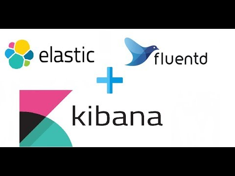
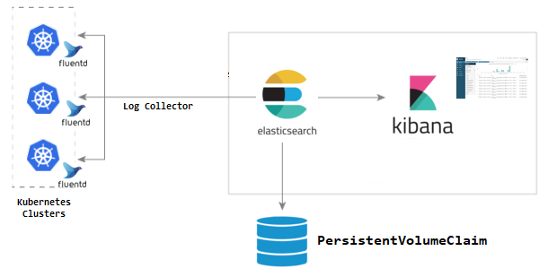
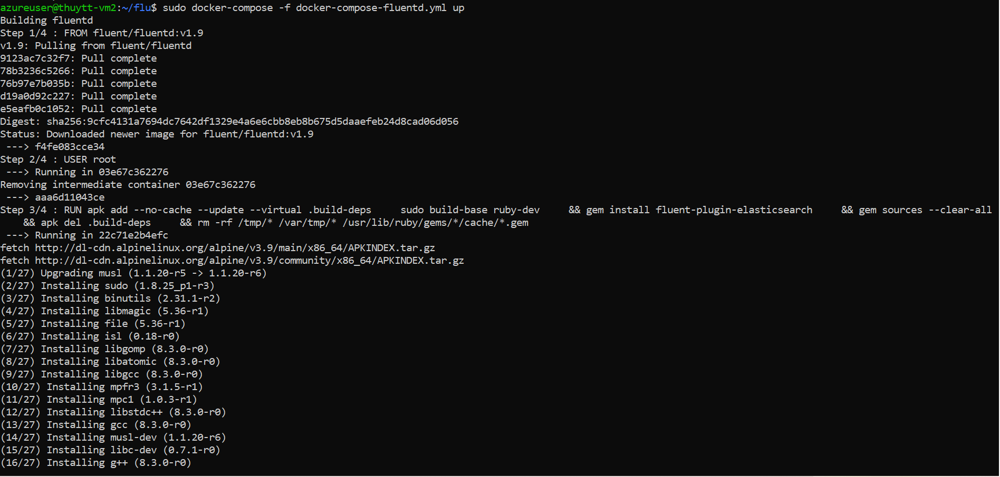
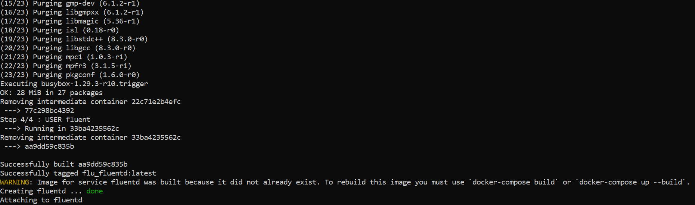
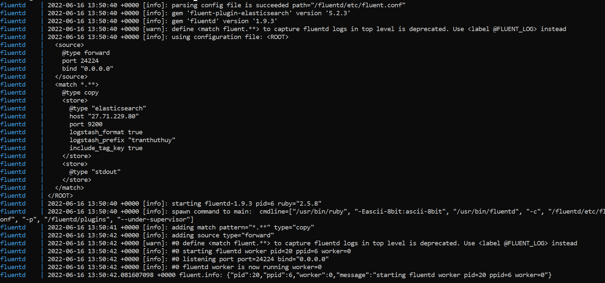
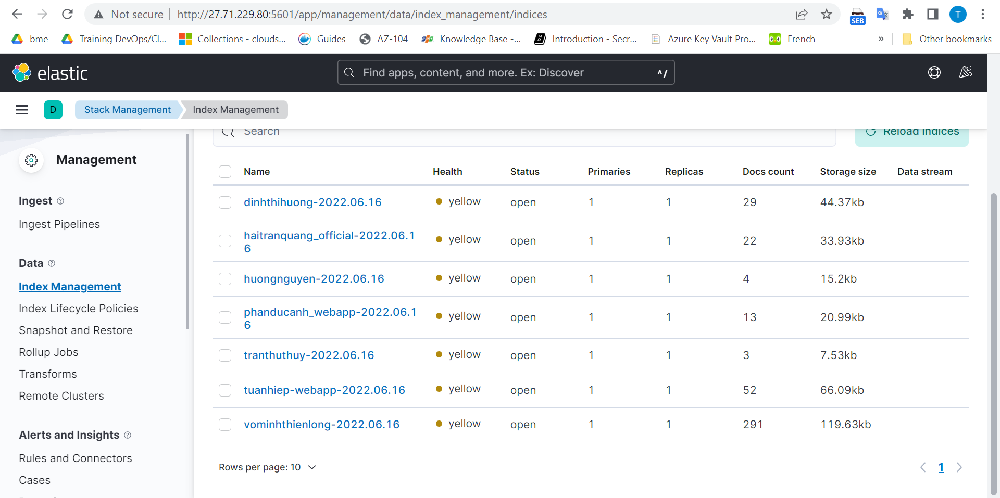

#**EFK STACK**



#Content
#####I/ Homework part 1 
 
#####1.1 ElasticSearch

#####1.2 Fluentd

#####1.3 Kibana

#####1.4 EFK stack

#####II/ Homework part 2

##### References


#I/ Homework part 1 
 
 ##1.1 Elasticsearch

###_1.1.1 What is Elasticsearch?_

- It is fully distributed Enterprised grade Search and Analytics Engine

- Its No SQL, distributed, full text database

- Open Source

- Elastic search is based on Lucene engine build on Java

- Accessible through extensive and elaborative Restfull API 


### _1.1.2 Why do we need elastic search?_

- Implement enterprise search

- Analytics

- Autocomplete and Instant search

### _1.1.3 Fundamental Concepts_

####Node

   - It refers to a single running instance of Elasticsearch. Single physical and virtual server accommodates multiple nodes depending upon the capabilities of their physical resources like RAM, storage and processing power.

####Cluster

- It is a collection of one or more nodes. Cluster provides collective indexing and search capabilities across all the nodes for entire data.

####Index

- It is a collection of different type of documents and their properties. Index also uses the concept of shards to improve the performance. For example, a set of document contains data of a social networking application.

####Document

- It is a collection of fields in a specific manner defined in JSON format. Every document belongs to a type and resides inside an index. Every document is associated with a unique identifier called the UID.

####Shard

- Indexes are horizontally subdivided into shards. This means each shard contains all the properties of document but contains less number of JSON objects than index. The horizontal separation makes shard an independent node, which can be store in any node. Primary shard is the original horizontal part of an index and then these primary shards are replicated into replica shards.

####Replicas

- Elasticsearch allows a user to create replicas of their indexes and shards. Replication not only helps in increasing the availability of data in case of failure, but also improves the performance of searching by carrying out a parallel search operation in these replicas.

When a document is stored, it is indexed. Elasticsearch uses a data structure called an **inverted index** that supports very fast full-text searches. An inverted index lists every unique word that appears in any document and identifies all of the documents each word occurs in.


###_1.1.4 Advantages_

- Elasticsearch is developed on Java, which makes it compatible on almost every platform.

- Elasticsearch is real time, in other words after one second the added document is searchable in this engine

- Elasticsearch is distributed, which makes it easy to scale and integrate in any big organization.

- Creating full backups are easy by using the concept of gateway, which is present in Elasticsearch.

- Handling multi-tenancy is very easy in Elasticsearch when compared to Apache Solr.

- Elasticsearch uses JSON objects as responses, which makes it possible to invoke the Elasticsearch server with a large number of different programming languages.

- Elasticsearch supports almost every document type except those that do not support text rendering.

####_1.1.5 Disadvantages_

- Elasticsearch does not have multi-language support in terms of handling request and response data (only possible in JSON) unlike in Apache Solr, where it is possible in CSV, XML and JSON formats.

- Occasionally, Elasticsearch has a problem of Split brain situations.

##1.2 Fluentd

- Fluentd is an open-source tool to collect events and logs.

- Fluentd is a great software based on Ruby for reading, processing, and sending logs.

- Fluentd can also be easily extended by writing plugins, many of which are now developed and public.

##1.3 Kibana

- Kibana is a data visualization and management tool for Elasticsearch that provides real-time histograms, line graphs, pie charts, and maps. Kibana also includes advanced applications such as Canvas, which allows users to create custom dynamic infographics based on their data, and Elastic Maps for visualizing geospatial data.

##1.4 EFK

EFK Stack is a collection of 3 software together including:

- ElasticSearch

- Fluentd

- Kibana

The mechanism of operation of the toolkit is described in the picture below:



- First, the log will be taken to the fluorine.

- Fluentd will read these logs, add information such as time, IP, parse data from log (server, severity, log content) and write down to elasticSearch.

- To see the log, we access the Kibana URL. Kibana will read the log information in elasticSearch, displayed on the interface for query users and processing.

- Now, I will "have a problem" EFK Stack for Kubernetes

#II/ Homework part 2

Firstly, create Dockerfile to build Fluentd image:

```
FROM fluent/fluentd:v1.9
USER root
RUN apk add --no-cache --update --virtual .build-deps \
    sudo build-base ruby-dev \
    && mkdir -p /fluentd/etc \
    && gem install elasticsearch -v 7.17.0\
    && gem install fluent-plugin-elasticsearch \
    && gem sources --clear-all \
    && apk del .build-deps \
    && rm -rf /tmp/* /var/tmp/* /usr/lib/ruby/gems/*/cache/*.gem
USER fluent
```
Then create a config file for fluentd: fluent.conf

```

<source>
  @type forward
  port 24224
  bind 0.0.0.0
</source>
<match *.**>
  @type copy
  <store>
    @type elasticsearch
    host 27.71.229.80
    port 9200
    logstash_format true
    logstash_prefix tranthuthuy
    include_tag_key true
  </store>
  <store>
    @type stdout
  </store>
</match>
```

Next, create file docker-compose-fluentd.yml with following contents

```

version: '3.3'

services:
  fluentd:
    build: .
    container_name: fluentd
    volumes:
      - ./:/fluentd/etc
    ports:
      - "24224:24224"

```


## Results

Docker-compose up and see the result: 

 
 
 
 
 

 Now, get access to http://27.71.229.80:5601 to see whether the logs have been pushed yet:

 

 # References
 
 - [Records- Mentor Dat](https://drive.google.com/drive/u/1/folders/1py534JsCIIqWlUm7YU-t3Cmmzotar_FQ?fbclid=IwAR3e_LC2LS_Rsd_bv3bjp1hXMiJvtSv_MtpEp5FAW-aozVM5szEPphJ-1Gk)
 - [ElasticSearch Tutorial Series](https://www.youtube.com/watch?v=8r_IMTerZSY)
