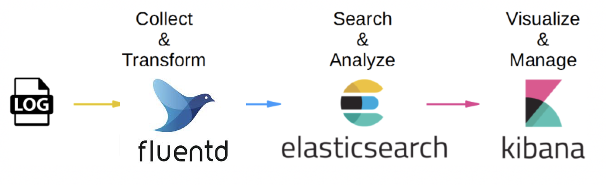

# Push logs using Fluentd, Elasticsearch and Kibana


Author: **Vo Minh Thien Long**

----        
## Table of contents     
[I. Prerequisites knowledge](#knowledge)
- [1. Elasticsearch](#elasticsearch)
- [2. Fluentd](#fluentd)
- [3. Kibana](#kibana)       

[II. Practice homework](#homework)
- [1. Requirements](#requirements)
- [2. Push logs to Elasticsearch](#push-logs)
- [3. Create a Data view in Kibana](#create-data-view)
- [3. Perform query in Kibana server](#query)

[VI. References](#references)

---- 

## I. Prerequisites knowledge 
<a name='knowledge'></a> 

### 1. Elasticsearch
<a name='elasticsearch'></a> 

#### 1.1. Overview

**Elasticsearch** is a _distributed_, _free_ and _open search_ and _analytics engine_ for all types of data, 
including textual, numerical, geospatial, structured, and unstructured. It is built on 
**Apache Lucene** and was first released in `2010` by **Elasticsearch N.V.** (now known as Elastic).

**Elasticsearch** support _a variety_ of programming languages: Java, JavaScript (Node.js), Go, .NET (C#), PHP, Perl,
Python, Ruby.

<div align="center">
  
</div>

<div align="center">
  <i>Elasticsearch logo.</i>
</div>

**Elasticsearch**  also provides a comprehensive and powerful set of **REST APIs** for _checking cluster health_, 
performing _CRUD_ and _search_ operations against indices, and executing advanced search operations such as 
_filtering_ and _aggregations_.

<div align="center">
  
</div>

<div align="center">
  <i>Elasticsearch has a simple REST APIs.</i>
</div>

#### 1.2. Elasticsearch usage

The _speed_ and _scalability_ of **Elasticsearch** and its ability to index many types of content mean that it can be used 
for a number of use cases: Textual Search , JSON Document Storage, Metrics and Analytics, etc.


<div align="center">
  
</div>

<div align="center">
  <i>Elasticsearch usage.</i>
</div>

#### 1.3. Advantages of Elasticsearch 

Compared to other engines, there are **4** reasons why we should use Elasticsearch:

**1. Elasticsearch is fast.** 

**Elasticsearch** is a _near real-time_ search platform, built on top of **Lucene**.

<div align="center">
  
</div>

<div align="center">
  <i>Elasticsearch is built on top of Lucene.</i>
</div>

**2. Elasticsearch is distributed by nature.**

**Shards** are duplicated to provide redundant copies of the data in case of _hardware failure_. The distributed nature
allows it to scale out to thousands of servers and handle petabytes of data.

<div align="center">
  
</div>

<div align="center">
  <i>Replication in Elasticsearch.</i>
</div>

**3. Elasticsearch comes with a wide set of features.**

**Elasticsearch** is not just speed, scalability, and resiliency, it also has _data rollups_, _index 
lifecycle management_, etc.
<div align="center">
  
</div>

<div align="center">
  <i>Elasticsearch features.</i>
</div>

**4. The Elastic Stack simplifies data ingest, visualization, and reporting**

**Beats** and **Logstash** process data before indexing into **Elasticsearch**, then **Kibana** provides 
_real-time_ visualization of Elasticsearch data.

**Note:** We will not use these stack components in this practice, instead we will use **Fluentd** for collecting
and transforming the logs instead. The reason I will indicate later, but **Elastic Stack** is still an advantages of
Elasticsearch.

<div align="center">
  
</div>

<div align="center">
  <i>Component of Elastic Stack for logs processing and visualization.</i>
</div>

#### 1.4. Elasticsearch workflow

1. Raw data flows into **Elasticsearch** from a variety of sources, including _logs_, _metrics_, etc. 
2. Data ingestion is the process by which this raw data is parsed, normalized, and enriched before it is indexed 
in **Elasticsearch**. 
3. Once indexed in **Elasticsearch**, users can run complex queries against their data and use aggregations 
to retrieve complex summaries of their data. 
4. From **Kibana**, users can create powerful visualizations of their data, share dashboards, and manage the 
Elastic Stack.

#### 1.5. Elasticsearch concepts

**1. Elasticsearch document**

Elasticsearch stores data as `JSON` **documents**. Each document correlates a set of **keys** with their 
corresponding **values**. 

In the world of relational databases, **documents** can be compared to **rows** in table, and the set of 
**keys / fields** can be compared to **columns**.

<div align="center">
  
</div>

<div align="center">
  <i>Elasticsearch documents and index.</i>
</div>

Example of an Elasticsearch document: 

```json
{
  "pid" : 21,
  "ppid" : 7,
  "worker" : 0,
  "message" : "starting fluentd worker pid=21 ppid=7 worker=0",
  "@timestamp" : "2022-06-05T03:56:13.473092270+00:00",
  "tag" : "fluent.info"
}
```

**2. Elasticsearch index**

An **Elasticsearch index** is a collection of documents that are related to each other. It is the largest unit of
data in Elasticsearch, are logical _partitions_ of documents and can be compared to a **database** 
in the world of relational databases.


<div align="center">
  
</div>

<div align="center">
  <i>Elasticsearch documents and index.</i>
</div>

**3. Elasticsearch shards**

**Elasticsearch shards** are a single Lucene index. They are the building blocks of Elasticsearch and what 
facilitate its scalability. There are 2 types of shard: **Primary shard** and **Replica shard**.

**Replicas** are Elasticsearch fail-safe mechanisms and are basically copies of index’s shards. 
To ensure high availability, replicas are *not placed on the same nod*e as the original shards from 
which they were replicated.

<div align="center">
  
</div>

<div align="center">
  <i>Elasticsearch with 4 shards.</i>
</div>

**5. Elasticsearch nodes**

**Nodes** are the heart of the Elasticsearch instance, which has the crucial task of _storing_ and _indexing_ data. 
In a cluster, different responsibilities are assigned to the various node types: Data nodes, Master nodes, Client nodes,
etc.

By default, each node is automatically assigned a **unique identifier** – or **name** – that is used for management purposes.

**6. Elasticsearch cluster**

A **cluster** is a collection of one or more servers that together hold entire data. It gives federated indexing 
and search capabilities across all the servers. 

As with _nodes_, each cluster has a **unique identifier** that must be used by any node attempting to join the cluster
(by default it is `elasticsearch`).

<div align="center">
  
</div>

<div align="center">
  <i>Elasticsearch cluster with 2 nodes.</i>
</div>

#### 1.6. Elasticsearch inverted index

**Elasticsearch** uses a data structure called an **inverted index**, which is designed to allow _very fast full-text 
searches_. An inverted index lists every **unique word** that _appears_ in any document and _identifies_ all the 
documents each word occurs in.

<div align="center">
  
</div>

<div align="center">
  <i>Inverted index data structure.</i>
</div>

During the indexing process, Elasticsearch stores documents and builds _an inverted index_ to make the document data
searchable in near **real-time**. 

**Indexing and searching steps:**

1/ When every a new document is added, Elasticsearch will _parse_ every word in it, remove stop words (word which 
is appeared a lots but **doesn't** contain useful information: a, an, the, etc.), normalize, etc.

2/ Because English is **a supported languages** in Elasticsearch, so it could perform some pre-processing before add to
the inverted index lists.

3/ The inverted index lists will contain every uniques word and their appear in document. For example: `best` 
appears in document 2, `blue` appears in document 1 and 3, `sky` appears in document 2 and 3, etc.

4/ Then when we want to search for `blue sky`, because `blue` appear in document 3 and `sky` also appear in document 3,
so our result is document 3 with relevance 100%.

### 2. Fluentd
<a name='fluentd'></a> 

**Fluentd** is an _open source_ data collector, which lets you unify the data collection and consumption for a 
better use and understanding of data. It is originally developed at **Treasure Data** and written primarily 
in the `Ruby` programming language.

<div align="center">
  
</div>

<div align="center">
  <i>Fluentd logo.</i>
</div>

Fluentd tries to structure data as `JSON` as much as possible: this allows Fluentd to **unify** all facets of 
processing log data: _collecting_, _filtering_, _buffering_, and _outputting_ logs across **multiple sources 
and destinations**.

<div align="center">
  
</div>

<div align="center">
  <i>Fluentd architecture.</i>
</div>

Although in Elastic Stack already has **Logstash** for _collecting_, _parsing_ and _transforming_ logs, but in 
this practice we prefer to use **Fluentd**. Here some reasons of our choice:

1. **Fluent-bit** (Fluent) is recommended when using small applications (this is our case here), compare to
**Elastic beats** of Logstash. 

2. **Logstash** can be coded with `JRuby` and Fluentd with `CRuby`. This means Fluentd has an advantage here, 
because no Java runtime is required.

3. **Docker** has a built-in logging driver for **Fluentd**, but doesn’t have one for **Logstash**. 

### 3. Kibana
<a name='kibana'></a> 

**Kibana** is a _free_ and _open_ **user interface** that lets we visualize our Elasticsearch data and navigate the 
Elastic Stack. It does anything from tracking query load to understanding the way requests flow through our apps.

<div align="center">
  
</div>

<div align="center">
  <i>Kibana logo.</i>
</div>

## II. Practice homework
<a name='homework'></a> 

### 1. Requirements
<a name='requirements'></a> 

Push logs of services from Practice-3 to `fluentd`, and then from `fluentd` push logs to **Elasticsearch cluster** 
`tuandat82.vddns.vn:9200` and visualization at `kibana tuandat82.vddns.vn:5601`

<div align="center">
  
</div>

<div align="center">
  <i>Homework requirements for Practice 5.</i>
</div>

### 2. Push logs to Elasticsearch
<a name='push-logs'></a> 

#### 2.1. Create a configuration file `fluent.conf`

I will create a file name `fluent.conf` for configuration **Fluentd** in `fluentd/fluent.conf`:

1. Configurate **Fluentd** input sources by using `<source>` tag - it is where all the data comes from.
We will set **Fluentd** forward from port `24224/tcp` here. 

2. In order to tell **Fluentd**, what to do, I will use `<match>` tag. This tag will look for events with **matching**
tags and processes them. 

    Because by native Fluent doesn't support Elasticsearch, so we need to configure them here. Here the logs 
data will be store in `tuandat82.vddns.vn:9200` (an Elasticsearch host) with prefix is `vominhthienlong`. 
I also use `logstash` format for logs and include the `tag` field in the record.

```text
<source>
  @type forward
  port 24224
  bind 0.0.0.0
</source>

<match *.**>
  @type copy
  <store>
    @type elasticsearch
    host 27.71.229.80
    port 9200
    logstash_format true
    logstash_prefix vominhthienlong
    include_tag_key true
  </store>
  <store>
    @type stdout
  </store>
</match>
```

#### 2.2. Create a `Dockerfile` for Fluentd

Here is `Dockerfile` for **Fluentd** using image `fluent/fluentd:v1.9`. This is an _official image_ for Fluentd.

```dockerfile
FROM fluent/fluentd:v1.9
USER root

RUN apk add --no-cache --update --virtual .build-deps \
    sudo build-base ruby-dev \
    && gem install fluent-plugin-elasticsearch \
    && gem sources --clear-all \
    && apk del .build-deps \
    && rm -rf /tmp/* /var/tmp/* /usr/lib/ruby/gems/*/cache/*.gem

USER fluent
```

#### 2.3. Create Docker compose file for Fluentd in `docker-compose-fluentd.yml`

The **fluentd** service will use the `Dockerfile` and `fluent.conf` in `fluentd` directory. I don't
use a same `docker-compose.ym;` for both web application and `fluentd` because we need **Fluentd** to finish set up first
before create a connection from application.

```yaml
version: '3.9'

services:
  fluentd:
    build: fluentd
    container_name: fluentd
    volumes:
      - ./fluentd/:/fluentd/etc
    ports:
      - "24224:24224"

```

#### 2.4. Set `logging` for web application**

Modify the original `docker-compose.yml` by adding logging configuration for each of services. 
We use `logging` tag here to forward the logs data to driver `fluentd`. To identify logs 
of each service, we will use `tag' here.

```yaml
...
    logging:
      driver: "fluentd"
      options:
        fluentd-address: "0.0.0.0:24224"
        tag: <service-name>
...
```

#### 2.5. Start `docker-compose-fluentd` and `docker-compose`**

Start `fluentd` using `-f` option select a `docker-compose-fluentd.yml` instead of default `docker-compose.yml`
and `-d` option to run in background mode.

```shell
docker compose -f docker-compose-fluentd.yml up -d
```

After `fluentd` finish set up, we will start our web application in background mode using `docker-compose.yml`.

```shell
docker compose up -d
```

### 3. Create a Data view in Kibana
<a name='create-data-view'></a> 

Kibana requires a **data view** to access the Elasticsearch data that you want to explore. 
A data view selects the data to use and allows you to define properties of the fields.

A data view can point to **one or more** indices, data streams, or index aliases. In this practice, I will
create a data view point to all indices start with `vominhthienlong-*`. 

#### 3.1. Go to Kibana UI web application

Use the following link [27.71.229.80:5601](#http://27.71.229.80:5601/) to access Kibana UI web application.

<div align="center">
  
</div>

<div align="center">
  <i>Go to Kibana UI web application.</i>
</div>

#### 3.2. Go to Stack Management board

Open the Menu icon `☰`, scroll down to the end and choose `Stack Management` 
in `Management` section.

<div align="center">
  
</div>

<div align="center">
  <i>Choose Management > Stack Management.</i>
</div>

#### 3.3. Go to Data Views board

In the `Stack Management` menu, choose `Data Views` in `Kibana` section.

<div align="center">
  
</div>

<div align="center">
  <i>Choose Kibana > Data Views.</i>
</div>

#### 3.4. Create a data view

Create a Data View from list of available indexes. In here I create a data view with name `vominhthienlong-*`,
means that it points to all index start with `vominhthienlong-`. Click `Creaete data view` to complete.

<div align="center">
  
</div>

<div align="center">
  <i>Create a new data view with name vominhthienlong-*.</i>
</div>

#### 3.5. View and edit fields in our data views (optional)

Here you can see all fields, their data types, etc. You can also edit them if needed.

<div align="center">
  
</div>

<div align="center">
  <i>Our data view configuration.</i>
</div>

#### 3.6. Go to Discovery and discover our data view

Open the Menu icon `☰` again, choose `Discovery` in `Analytics` section.

<div align="center">
  
</div>

<div align="center">
  <i>Choose Analytics > Discovery.</i>
</div>

#### 3.7. Discover our new data view

Change the data view to `vominhthienlong-*` and see our documents.

<div align="center">
  
</div>

<div align="center">
  <i>Discover our vominhthienlong-* data view.</i>
</div>

### 4. Perform query in Kibana server
<a name='query'></a>

Here I will use `Dev Tools/ Console` in Kibana UI Web application to perform some queries.

#### 4.1. Get all indices 

We will use` /_cat/indices` in the `cat indices` API to get all indices (with HTTP method `GET`):

   ```text
   GET /_cat/indices
   ```

<div align="center">
  
</div>

<div align="center">
  <i>All indices in Elasticsearch server.</i>
</div>

Or we could also get a specific index with `/_cat/indices/<target>`:

   ```text
   GET /_cat/indices
   ```
<div align="center">
  
</div>

<div align="center">
  <i>Get index vominhthienlong-2022.06.16 Elasticsearch server.</i>
</div>

#### 4.2. Count number of documents in an index

Here I will show you 2 ways to get the number of documents. First is using `_search` API
with `match_all`:

   ```text
   GET /vominhthienlong-2022.06.16/_search
   {
       "query": {
           "match_all": {}
       }
   }
   ```

<div align="center">
  
</div>

<div align="center">
  <i>Get all documents in the index with metadata.</i>
</div>

However, this way is slow and consume more resource, because it not just return the number of documents,
but it also return the `_source` and other *metadata*. Luckily, Elasticsearch has supported `_count` API to perform
counting queries:

   ```text
   GET /vominhthienlong-2022.06.16/_count
   ```

<div align="center">
  
</div>

<div align="center">
  <i>Count number of documents in an index.</i>
</div>

#### 4.3. Get a specific documents from an index

To get a specific document from an index, we will use `Get` API `GET <index name>/_doc/<document id>`. In here our
index is `vominhthienlong-2022.06.16` and document id is `a6lZbIEBTmPV1HJpVW1w`.

   ```text
   GET /vominhthienlong-2022.06.16/_doc/a6lZbIEBTmPV1HJpVW1w
   ```

<div align="center">
  
</div>

<div align="center">
  <i>Get all documents in the index with metadata.</i>
</div>

If we just want to get the real document content (`source`) without metadata, we can use 
`GET <index name>/_source/<document id>` to do.

<div align="center">
  
</div>

<div align="center">
  <i>Get all documents in the index with metadata.</i>
</div>

#### 4.4. Get documents with a field matching

Using `match` will return all the documents which have field contains a key word. By default, search in Elasticsearc
is **case-insensitive** and the doesn't take care of order of words. If you need to search for phrase (keep words in order)
you can use `match_phrase` instead.

I will use it to find all the documents that `log` field contains the word `running`:

   ```text
   GET /vominhthienlong-2022.06.16/_search
   {
       "query": {
           "match": {
               "log" : "running"
           }
       }
   }
   ```

<div align="center">
  
</div>

<div align="center">
  <i>Get all documents contains "running" in "log" field.</i>
</div>

We could also find all document by `tag` using `match` for `tag` field:

   ```text
   GET /vominhthienlong-2022.06.16/_search
   {
       "query": {
           "match": {
               "tag" : "mongo"
           }
       }
   }
   ```

<div align="center">
  
</div>

<div align="center">
  <i>Get all documents with tag "mongodb".</i>
</div>

#### 4.4. Get documents with multiple fields matching

Difference from `match`, `multi-match` could use to find matching from multiple fields. In this example, I will 
use `multi-match` to find all documents which `log` or `message` field contains `running`.

   ```text
   GET /vominhthienlong-2022.06.16/_search
   {
      "query": {
          "multi_match": {
              "query" : "running",
              "fields": ["log", "message"]
          }
      }
   }
   ```
<div align="center">
  
</div>

<div align="center">
  <i>Get all documents contains "running" in "log" or "message" field.</i>
</div>

#### 4.5. Perform complex search condition with `bool`

Using `bool`, your can perform a complex search with boolean operation **AND** (`must`), **OR** (`should`), 
**NOT** (`must_not`). Here is a query for finding all documents contain `running` in `log` field **OR**
`worker` in `message` field and **NOT** contains both `/logic_tier` in `container_name` field **AND** 
`http` in `log` field at the same time.

   ```text
   GET /vominhthienlong-2022.06.16/_search
   {
       "query": {
           "bool" : {
               "should": [
                 {
                   "match": {
                     "log": "running"
                   }
                 },
                 {
                   "match": {
                     "message": "worker"
                   }
                 }
               ],
               "must_not": [
                 {
                   "bool": {
                     "must": [
                       {
                         "match": {
                           "container_name": "/logic_tier"
                         }
                       },
                       {
                         "match": {
                           "log": "http"
                         }
                       }
                     ]
                   }
                 }
               ]
           }
       }
   }
   ```
<div align="center">
  
</div>

<div align="center">
  <i>Get all documents by a complex searching.</i>
</div>

#### 4.6. Get documents contain terms matching a wildcard pattern.

A wildcard operator is a placeholder that matches _one or more_ characters. For example, the `*` wildcard
operator matches zero or more characters. In this example, I will find all documents that contain wildcard
pattern `*res*`.

   ```text
   GET /vominhthienlong-2022.06.16/_search
   {
      "query": {
          "wildcard": {
              "log" : "*res*"
          }
      }
   }
   ```
<div align="center">
  
</div>

<div align="center">
  <i>Get all documents contain wildcard pattern "*res*".</i>
</div>


## III. References
<a name='references'></a> 

[1] [Elasticsearch page](https://www.elastic.co/elasticsearch/)

[2] [Elasticsearch documentation](https://www.elastic.co/guide/index.html)

[3] [10 Elasticsearch concepts](https://logz.io/blog/10-elasticsearch-concepts/)

[4] [Scalability and resilience in Elasticsearch](https://www.elastic.co/guide/en/elasticsearch/reference/current/scalability.html)

[5] [How Elasticsearch Search So Fast?](https://medium.com/analytics-vidhya/how-elasticsearch-search-so-fast-248630b70ba4)

[6] [Kibana page](https://www.elastic.co/kibana/)

[7] [Fluentd page](https://www.fluentd.org/)

[8] [Fluentd vs Logstash: A Comparison of Log Collectors](https://logz.io/blog/fluentd-logstash/)

[9] [Kubernetes Logging: Comparing Fluentd vs. Logstash](https://platform9.com/blog/kubernetes-logging-comparing-fluentd-vs-logstash/)