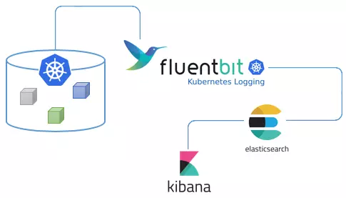
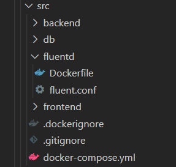
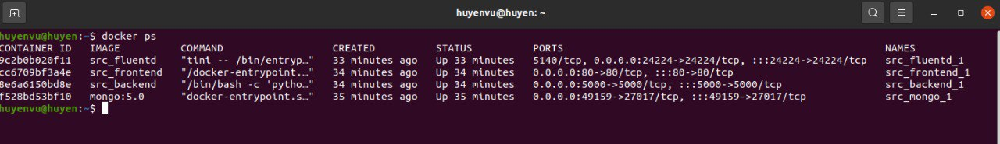
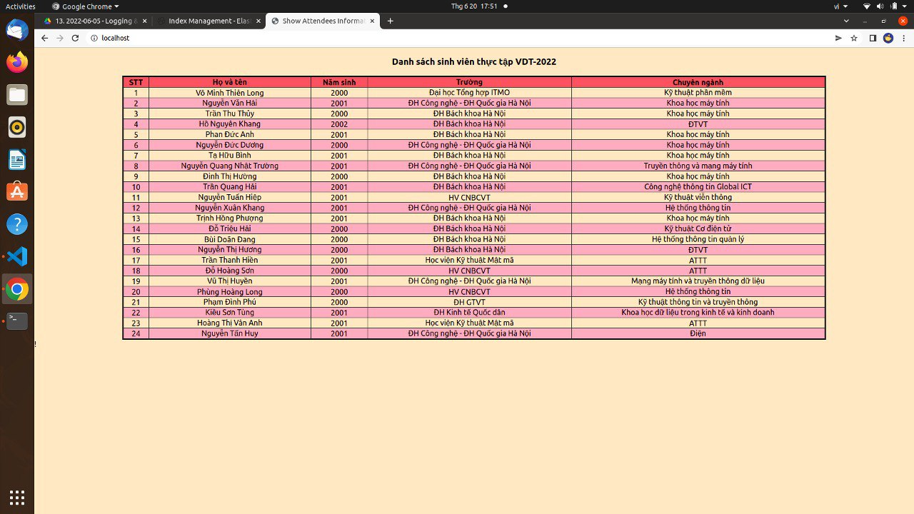
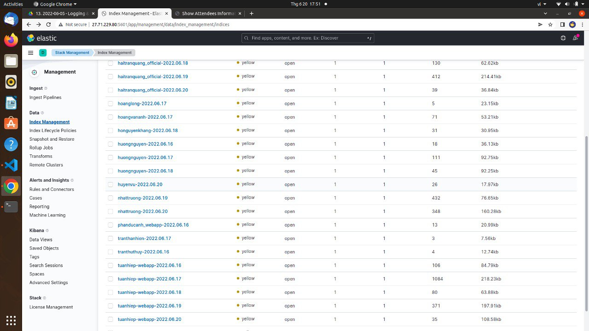

# **Practice 5**

## **1. Tìm hiểu chung về  EFK**

### *1.1 Elasticsearch*

Elasticsearch là một công cụ tìm kiếm dựa trên nền tảng Apache Lucene. Nó cung cấp một bộ máy tìm kiếm dạng phân tán, có đầy đủ công cụ với một giao diện web HTTP có hỗ trợ dữ liệu JSON. Elasticsearch được phát triển bằng Java và được phát hành dạng nguồn mở theo giấy phép Apache.

- Các khái niệm cơ bản
    - Cluster: tập hợp các node chứa tất cả các dữ liệu. Mỗi cluster được định danh bằng một unique name. Mỗi cluster có một node chính (master) được lựa chọn tự động và có thể thay thế khi gặp sự cố.
    - Node: nơi lưu trữ dữ liệu, tham gia vào việc đánh chỉ mục của cluster cũng như thực hiện việc tìm kiếm. Mỗi node được định danh bằng một unique name.
    - Index: Là một tập hợp các document.
    - Shard: Tập con các document của một index. Một index có thể có nhiều shard. Có hay loại shard được sử dụng là Primary Shard và Replica Shard.
    - Document: một JSON object với một số dữ liệu. Đây là đơn vị dữ liệu cơ bản trong Elasticsearch. Đối chiếu các khái niệm lưu trữ của Elasticsearch với một hệ quản trị cơ sở dữ liệu

### *1.2 Fluent-bit*

Là phần mềm mã nguồn mở, viết bằng C, được thiết kế nhằm chú trọng đến hiệu suất. Nó cho phép bạn thu thập logs từ nhiều nguồn khác nhau. Fluent bit được phát triển bởi Fluentd team với mục đích tạo ra một phiên bản lightweight trong việc xử lý logs. Sau đó, fluent bit được sử dụng như một giải pháp xử lý dành cho Cloud.

### *1.3 Kibana*

Kibana là một nền tảng phân tích hiển thị dữ liệu từ Elasticsearch một cách trực quan dễ sử dụng.

### *1.4 EFK STACK*

EFK stack là tập hợp của 3 phần mềm trên đi chung với nhau, hoạt động dựa trên cơ chế:

- Fluent-bit thu thập các logs
- Fluent-bit sẽ đọc những log này, thêm những thông tin như thời gian, IP, parse dữ liệu từ log (server nào, độ nghiêm trọng, nội dung log) và ghi xuống Elasticsearch
- Để xem log, chúng ta truy cập URL của Kibana. Kibana sẽ đọc thông tin log trong Elasticsearch, hiển thị lên giao diện cho người dùng query và xử lý.

## **2. Thực hành**

Đẩy log của các service đã làm ở Practice-3 vào fluentd, từ fluentd đẩy lên cụm ES `27.71.229.80:9200`

Cấu trúc thư mục:

Chạy file `docker-compose.yml` và kiểm tra các containers đã được tạo chưa:

Kiểm tra kết quả:

