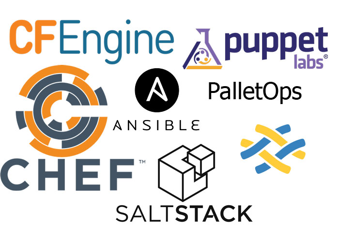
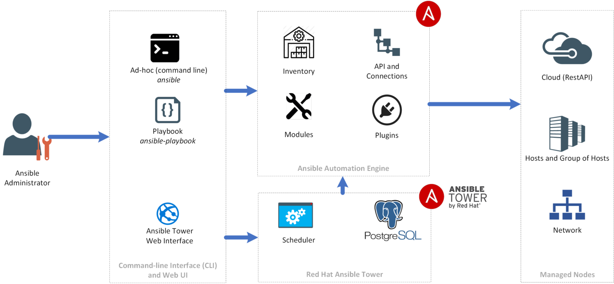

# **Bài cuối khóa VDT 2022**
# **Đề bài: Ansible được viết bằng Python, tìm hiểu luồng hoạt động của Ansible để một playbook được thực thi trên Target Node**
-----
# Mục lục

- [1. Mở đầu](#begin)
- [2. Giới thiệu về Ansible](#introduce_ansible)
	* [2.1 Ansible là gì](#what_is_ansible)
	* [2.2 Lý do sử dụng Ansible](#why_use_ansible)
	* [2.3 Kiến trúc Ansible](#ansible_architecture_and_configuration)
	* [2.4 Cài đặt](#setup_ansible)
- [3. Luồng xử lý trong Ansible](#ansible_workflow)
	* [3.1 Người quản trị](#human)
	* [3.2 Playbook](#playbook)
	* [3.3 Ansible](#ansible)
	* [3.3 SSH](#SSH)
- [Tài liệu tham khảo](#references)

-------

<a name="begin"></a>
## **1. Mở đầu**

Vào thời điểm đầu khi công nghệ tự đống hóa chưa phát triển, để đảm bảo các server được hoạt động ổn định, thông thường cần nhiều system admin cùng điều hành, quản trị một server. Và các cộng việc như cài đặt phần mềm, nâng cấp version,... đều phải thực hiện thủ công nên tốn rất nhiều thời gian và trong quá trình cài đặt còn có thể gây ra lỗi.



Công nghệ ngày càng phát triển, nhu cầu cài đặt, sử dụng servers ngày càng nhiều hơn ít lỗi hơn, việc quản lý các server theo mô hình cũ dần mất đi hiệu quả và gây lãng phí tài nguyên. Để tốn ít chi phí, các công ty đã sử dụng virtualization, tạo ra hàng loạt các servers giống nhau. Vì vậy, mỗi sysadmin phải quản lý rất nhiều servers cùng lúc, nên cần phải có sự xuất hiện của các configuration management tools để thay thế cho các scripts đã được sử dụng trước đó.

CFEngine là tool quản lý cấu hình đầu tiên từ năm 1990, và hiện tại có rất nhiều tools khác hiệu quả và dễ sử dụng hơn như: Puppet, Chef, Salt và Ansible. Sau đây ta sẽ đi tìm hiểu về Ansible.


<a name="introduce_ansible"></a>

## **2. Ansible**

<a name="what_is_ansible"></a>

### **2.1 Ansible là gì**


Ansible là 1 agent-less IT automation tool được phát triển bởi ***Michael DeHaan*** năm 2012. Ansible được tạo ra với mục đích là: minimal, consistent, secure, highly reliable and easy to learn.

Ansible dễ dàng triển khai vì nó không sử dụng bất kỳ tác nhân hoặc cơ sở hạ tầng bảo mật tùy chỉnh nào ở phía máy khách và bằng cách đẩy các modules đến máy khách. Các modules này được thực thi cục bộ ở phía máy khách và đầu ra được đẩy trở lại máy chủ Ansible.
Nó có thể dễ dàng kết nối với máy khách bằng SSH-Keys, đơn giản hóa toàn bộ quy trình. Thông tin chi tiết về ứng dụng khách, chẳng hạn như tên máy chủ hoặc địa chỉ IP và cổng SSH, được lưu trữ trong các tệp, được gọi là tệp inventory.


<a name="why_use_ansible"></a>
### **2.2 Lý do sử dụng Ansible**
Dưới đây là một số lý do quan trọng để sử dụng ```Ansible```, chẳng hạn như:
- ```Ansible``` được sử dụng miễn phí bởi tất cả mọi người.
- ```Ansible``` rất nhất quán và nhẹ và không có bất kỳ ràng buộc nào liên quan đến hệ điều hành hoặc phần cứng cơ bản.
- ```Ansible``` rất an toàn do khả năng không cần tác nhân và các tính năng bảo mật SSH mở.
- ```Ansible``` không cần bất kỳ kỹ năng quản trị hệ thống đặc biệt nào để cài đặt và sử dụng nó.
- ```Ansible``` có một đường cong học tập trơn tru được xác định bởi tài liệu toàn diện và cấu trúc và cấu hình dễ học.
- Tính mô-đun của nó liên quan đến các plugin, kho, mô-đun và sách phát làm cho người bạn đồng hành hoàn hảo của ```Ansible``` điều phối các môi trường rộng lớn.


<a name="ansible_architecture_and_configuration"></a>
#### **2.3 Kiến trúc và cấu hình Ansible**


Như ta đã thấy trong hình trên, ý tưởng chính của ansible đó là có 1 hoặc nhiều các trung tâm điều khiển (command center trong hình) từ nơi mà ta có thể phát ra các lệnh hoặc 1 tập lệnh thông qua playbook để chạy trên các Target Node. Trong đó có một số thành phần quan trọng

- ```Ansible Server``` là nơi mà Ansible được cài đặt và từ đó tất cả các tác vụ và playbook sẽ được thực thi.
- ```Modules``` Ansible có rất nhiều module, ví dụ như moduel yum là module dùng để cài đặt các gói phần mềm qua yum. Ansible hiện có hơn ….2000 module để thực hiện nhiều tác vụ khác nhau, bạn cũng có thể tự viết thêm các module của mình nếu muốn.
- ```Task``` Một block ghi tác vụ cần thực hiện trong playbook và các thông số liên quan. Ví dụ 1 playbook có thể chứa 2 task là: yum update và yum install vim.
- ```Role``` là cơ chế chính giúp ta chia 1 playbook phức tạp ra các phần nhỏ hơn để dễ dàng viết cũng như tái sử dụng.
- ```Fact``` Thông tin của những máy được Ansible điều khiển, cụ thể là thông tin về OS, network, system…
- ```Inventory``` là file chứa các thông tin về hosts mà ta sẽ thực hiện các task trên đó, file hosts ta đang làm việc chính là 1 inventory file.
- ```Play``` là sự thực thi của playbook.
- ```Handler``` có chức năng giống như 1 task nhưng chỉ xảy ra khi có điều kiện nào đó.
- ```Notifier``` Phần được quy cho một tác vụ gọi một trình xử lý nếu kết quả đầu ra bị thay đổi.
- ```Tag``` là tên được đặt cho một task có thể được sử dụng sau này để chỉ đưa ra task hoặc nhóm công việc cụ thể đó.

<a name="setup_ansible"></a>
#### **2.4 Cài đặt Ansible**

Trong tài liệu này sẽ hướng dẫn cài đặt đơn giản ansible trên môi trường Ubuntu version 20.04.

Thông qua Apt:
```sh
$ sudo apt-get install ansible
```

Thông qua pip:

```sh
$ sudo pip install ansible
```

Kiểm tra version đã cài đặt thành công:

```sh
$ ansible --version
```

<a name="ansible_workflow"></a>
## **3. Luồng xử lý trong Ansible**
Ansible hoạt động bằng cách kết nối với các Node và đẩy ra một chương trình nhỏ gọi là modules Ansible cho chúng. Sau đó, Ansible thực thi các modules này và gỡ bỏ chúng sau khi hoàn thành. Thư viện các modules có thể nằm trên bất kỳ máy nào và không yêu cầu daemon, máy chủ hoặc cơ sở dữ liệu.



Như trên biểu đồ, ta có thể thấy cụ thể hơn sẽ bao gồm các thành phần dưới đây.
<a name="human"></a>
### **3.1 Người quản trị**
Nhìn vào biểu đồ trên, bắt đầu từ trái qua phải, đầu tiên ta có thể thấy người quản trị có thể thông qua CLI (Command line interface) để tương tác với Ansible. 

CLI có hai cách tiếp cận khác nhau: Chúng ta có thể gửi lệnh từ dòng lệnh bằng cách sử dụng tệp thực thi ansible và đó được gọi là tương tác Ad-hoc. Cách tiếp cận thứ hai là sử dụng playbook, là tệp YML có chứa hướng dẫn mà con người có thể đọc được để thực hiện các tác vụ trên máy chủ hoặc nhóm máy chủ mong muốn khi gọi playbook và chúng tôi sẽ sử dụng tệp thực thi ansible-playbook.

<a name="playbook"></a>
### **3.2 Playbook**

Như đã giới thiệu ở trên playbook dưới dạng yaml có cú pháp thực hiện các tasks. mức độ cơ bản, 1 task đơn giản chỉ là 1 lời gọi tới 1 ansible module. 

Modules (còn được gọi là 'task plugins' hay 'library plugins') là nơi thực hiện các công việc thực sự trong ansible, chúng là những gì được thực hiện trong mỗi playbook task.

Hầu hết module đều được viết bằng python, mỗi module sẽ có các tham số truyền vào là khác nhau, và hầu như tất cả các module đều có tham số theo dạng key=value, các tham số cách nhau bởi dấu cách. Ngoài ra cũng có 1 số module không có tham số như ping...

Tất cả các modules đều trả về output dưới dạng JSON format. Dưới đây là một số modules cơ bản trong ansible là: 

- **copy**: thực hiện copy 1 file từ máy local tới các máy hosts
- **file**: set các thuộc tính cho 1 file, symlink hay 1 thư mục.
- **service**: start, stop or restart 1 service.
- **template**: generate 1 file từ 1 template và copy file đó tới các máy hosts.
- ...

(Xem tất cả các moduele của ansible tại [đây](http://docs.ansible.com/ansible/latest/list_of_all_modules.html))

<a name="Ansible"></a>
### **3.3 Ansible**
Giống như đa phần các phần mềm quản lý cấu hình tập trung khác. Ansible có 2 loại server là control machine và node. Control machine là máy có trách nhiệm quản lý các node con trong hệ thống. Đây cũng là máy lưu trữ các thông tin về các node, playbook và các script cần dùng để deploy trên các node khác qua giao thức SSH.
Để quản lý các node, ansible sẽ thực hiện các bước sau:
1. Generate các task ra thành 1 Python script để thực hiện (về mặt kĩ thuật có thể là các ngôn ngữ lập trình khác).
2. Tiếp đến đoạn scripts đó bằng SSH, được gửi qua internet đến network và tới các host trong group được config.
3. Thực hiện script trên tất cả các host trong group.
4.  Chờ cho tới khi script được thực hiện xong trên tất cả các host.

<a name="SSH"></a>
### **3.4 SSH**
SSH, hoặc được gọi là Secure Shell, là một giao thức điều khiển từ xa cho phép người dùng kiểm soát và chỉnh sửa server từ xa qua Internet. Dịch vụ được tạo ra nhằm thay thế cho trình Telnet vốn không có mã hóa và sử dụng kỹ thuật cryptographic để đảm bảo tất cả giao tiếp gửi tới và gửi từ server từ xa diễn ra trong tình trạng mã hóa. Nó cung cấp thuật toán để chứng thực người dùng từ xa, chuyển input từ client tới host, và relay kết quả trả về tới khách hàng.


Bằng cách sử dụng SSH, Ansible có thể gửi gửi các đoạn script và thực thi trên Target Node.
<a name="conclusion"></a>
### **4. Kết luận**

Ansible là một trong những công cụ quản lý cấu hình hiện đại, nó tạo điều kiện thuận lợi cho công việc cài đặt, quản lý và bảo trì các server từ xa, với thiết kế tối giản giúp người dùng cài đặt và chạy nhanh chóng.Người dùng viết các tập lệnh cấp phép Ansible trong YAML, một tiêu chuẩn tuần tự hóa dữ liệu thân thiện với người dùng, chúng không bị ràng buộc với bất kỳ ngôn ngữ lập trình nào. Những đắc điểm trên đã giúp Ansible trở thành công cụ automation phổ biến và được sử dụng rộng rãi.

<a name="references"></a>
## **Tài liệu tham khảo**
------
1. [Ansible: From Beginner to Pro - Michael Heap](#)
2. [Learning Ansible 2 - Fabio Alessandro Locati](#)
3. [HaManhDong - Ansible](https://github.com/HaManhDong/ansible/blob/master/ansible.md)
4. [Ansible documentation](http://docs.ansible.com/ansible/latest/index.html)

------
