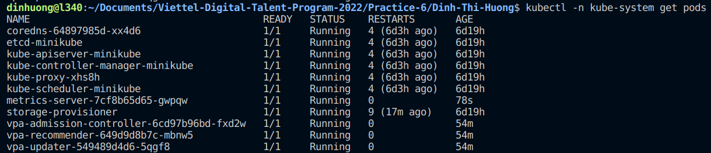

# Autoscaling in Kubernetes

## I. Introduction

### What is Autoscaling in K8S?

As the prefix “auto” suggests, autoscaling is a technique used in cloud computing to dynamically adjust computational resources, such as CPU and memory, more efficiently depending upon the incoming traffic of your application.


Autoscaling is one of the core features of container orchestrator tools like Kubernetes. It was first introduced in Kubernetes 1.3. 

Kubernetes lets you automate many management tasks, including provisioning and scaling. Instead of manually allocating resources, you can create automated processes that save time, let you respond quickly to peaks in demand, and conserve costs by scaling down when resources are not needed. It can be used alongside the cluster autoscaler by allocating only the resources that are needed.


> **"Kubernetes autoscaling helps optimize resource usage and costs by automatically scaling a cluster up and down in line with demand."**

### How does Kubernetes autoscaling work?
Kubernetes has **schedulers**. Their job is to assign pods of containers to cluster nodes. By default, Kubernetes uses **best effort** quality of service (QoS) to schedule pods. That means pod will be treated with lowest priority. They can use all of CPU and memory but will be killed if system runs out of memory. 


To make Kubernetes guarantee high priority QoS, you can controll the entire process by configuration parameters in YAML files. Using those files, Kubernetes administrators can request and set maximum limits for the CPU and memory available for use by each container within a pod (also known as resource request and limits).
This helps K8s make smart decisions about where to place pods if we have more than one node running in the cluster.

### How does kubectl know the metrics of pods and nodes?

[**METRIC SERVER**](https://github.com/kubernetes-sigs/metrics-server) is a component that runs in the K8s control plane.

**Metrics Server** collects resource metrics (CPU, memory,...) from Kubelets and exposes them in Kubernetes API server through Metrics API for use by Horizontal Pod Autoscaler and Vertical Pod Autoscaler. Metrics API can also be accessed by `kubectl top`, making it easier to debug autoscaling pipelines.

### 3 autoscaling methods for Kubernetes
Kubernetes offers *2 levels* of capacity management control for autoscaling
- *Pod*-based scaling—supported by the Horizontal Pod Autoscaler (HPA) and the newer Vertical Pod Autoscaler (VPA).
- *Node*-based scaling—supported by the Cluster Autoscaler.

Administrators can provide instructions for Kubernetes to automatically allocate more CPU and memory to a pod according to CPU and memory usage criteria (also known as *vertical pod autoscaling*). 
Furthermore, they can configure Kubernetes to automatically replicate pods for stateless application workloads (also known as *horizontal pod autoscaling*).
Finally, they can also configure the cluster to add more nodes once the other nodes are fully used or reserved (also known as *cluster autoscaler*).

- **Vertical Pod Autoscaler (VPA)** - Increases and decreases pod CPU and memory
- **Horizontal Pod Autoscaler (HPA)** - Adds and removes pods
- **Cluster Autoscaler (CA)** - Adds and removes cluster nodes

Let’s take a closer look at each and what they do.

## II. Vertical Pod Autoscaler (VPA)

### The Pod Resource Allocation Dilemma
The Kubernetes scheduler does not re-evaluate the pod’s resource needs after a pod is scheduled with a given set of requests. As a result, over-allocated resources are not freed or scaled-down. Conversely, if a pod didn’t request sufficient resources, the scheduler won’t increase them to meet the higher demand.

To summarize:
- If you **over-allocate** resources: you add unnecessary workers, waste unused resources, and increase your monthly bill.
- If you **under-allocate** resources: resources will get used up quickly, application performance will suffer, and the kubelet may start killing pods until resource utilization drops.

The VPA functionality provided in the Kubernetes platform aims to address this problem.

### How it works
The VPA controller observes the resource usage of an application. Then, using that usage information as a baseline, VPA recommends a lower bound, an upper bound, and target values for resource requests for those application pods.

In simple terms, we can summarize the VPA workflow as:

> observe resource usage → recommend resources requests → update resources


There are four modes in which VPAs operate:
- `auto`: VPA assigns resource requests on pod creation as well as updates them on existing pods using the preferred update mechanism. Currently this is equivalent to `recreate` (see below). Once restart free ("in-place") update of pod requests is available, it may be used as the preferred update mechanism by the "Auto" mode. NOTE: This feature of VPA is experimental and may cause downtime for your applications.
- `recreate`: VPA assigns resource requests on pod creation as well as updates them on existing pods by evicting them when the requested resources differ significantly from the new recommendation (respecting the Pod Disruption Budget, if defined). This mode should be used rarely, only if you need to ensure that the pods are restarted whenever the resource request changes. Otherwise prefer the "Auto" mode which may take advantage of restart free updates once they are available. NOTE: This feature of VPA is experimental and may cause downtime for your applications.
- `initial`: VPA only assigns resource requests on pod creation and never changes them later.
- `off`: VPA does not automatically change resource requirements of the pods. The recommendations are calculated and can be inspected in the VPA object.

Depending on how you configure VPA, it can either:
- Apply the recommendations directly by updating/recreating the pods (`updateMode = auto`).
- Store the recommended values for reference (`updateMode = off`).
- Apply the recommended values to newly created pods only (`updateMode = initial`).

Keep in mind that `updateMode = auto` is ok to use in testing or staging environments but not in production. The reason is that the pod restarts when VPA applies the change, which causes a workload disruption.

We should set `updateMode = off` in production, feed the recommendations to a capacity monitoring dashboard such as Grafana, and apply the recommendations in the next deployment cycle.

### Limitations
- *VPA is not aware of Kubernetes cluster infrastructure variables such as node size in terms of memory and CPU.* Therefore, it doesn't know whether a recommended pod size will fit your node. This means that the resource requests recommendation may be too large to fit any node, and therefore pods may go to a pending state because the resource request can’t be met.
- *VPA does not support StatefulSets yet.*
- *In Kubernetes, the pod spec is immutable.* To update or change the pod resource request, VPA needs to evict the pod and re-create it. This will disrupt your workload. As a result, running VPA in auto mode isn’t a viable option for many use cases.
- *VPA won't work with HPA using the same CPU and memory metrics because it would cause a race condition.* If you need to use both HPA and VPA together, you must configure HPA to use a custom metric such as web requests.
- *VPA is not yet ready for JVM-based workloads.*
- *The performance of VPA is untested on large-scale clusters.* 
- *VPA requires configuration for each cluster.*

## III. Horizontal Pod Autoscaler (HPA)
In Kubernetes, you can run multiple replicas of application pods using **ReplicaSet** (Replication Controller) by configuring the number of replica counts in the **Deployment** object. Manually setting the number of pod replicas to a fixed predetermined number might not meet the application workload demand over time. Therefore, to optimize and automate this process, Kubernetes provides a new resource called *horizontal pod autoscaler HPA*.

### How it works
In every Kubernetes installation, there is support for an HPA resource and associated controller by default.

The HPA control loop continuously monitors the configured metric, compares it with the target value of that metric, and then decides to increase or decrease the number of replica pods to achieve the target value.


The diagram shows that the HPA resource works with the deployment resource and updates it based on the target metric value. The pod controller (Deployment) will then either increase or decrease the number of replica pods running.


Without a contingency, one problem that can occur in these scenarios is thrashing. Thrashing is a situation in which the HPA performs subsequent autoscaling actions before the workload finishes responding to prior autoscaling actions. The HPA control loop avoids thrashing by choosing the largest pod count recommendation in the last five minutes.

### Limitations
- HPA can’t be used along with Vertical Pod Autoscaler based on CPU or Memory metrics. VPA can only scale based on CPU and memory values, so when VPA is enabled, HPA must use one or more custom metrics to avoid a scaling conflict with VPA. Each cloud provider has a custom metrics adapter to enable HPA to use custom metrics.
- HPA only works for stateless applications that support running multiple instances in parallel. Additionally, HPA can be used with stateful sets that rely on replica pods. For applications that can’t be run as multiple pods, HPA cannot be used.
- HPA (and VPA) don’t consider IOPS, network, and storage in their calculations, exposing applications to the risk of slowdowns and outages.
- HPA still leaves the administrators with the burden of identifying waste in the Kubernetes cluster created by the reserved but unused requested resources at the container level. Detecting container usage inefficiency is not addressed by Kubernetes and requires third-party tooling powered by machine learning.

## III. Cluster Autoscaler
As new pods are deployed and replica counts for existing pods increase, cluster worker nodes can use up all their allocated resources. As a result, no more pods can be scheduled on existing workers. Some pods can go into a pending state, waiting for CPU and memory and possibly creating an outage. As Kubernetes admin, you can manually solve this problem by adding more worker nodes to the cluster or let Kubernetes Cluster Autoscaler do that for you.

### How it works
Kubernetes scheduler dynamically places pods on worker nodes using a best-effort QoS strategy. For Cluster Autoscaler to work as expected and applications to get the underlying host resources they need, resource requests and limits must be defined on pods. Without resource requests and limits, Cluster Autoscaler can’t make accurate decisions.

Cluster AutoScaler periodically checks the status of nodes and pods and takes action based on node utilization or pod scheduling status. When Cluster Autoscaler detects pending pods on the cluster, it will add more nodes until pending pods are scheduled or the cluster reaches the max node limit. Cluster Autoscaler will remove extra nodes if node utilization is low and pods can move to other nodes.


### Limitations
- Cluster Autoscaler is not supported on on-premise environments until an autoscaler is implemented for on-premise deployments.
- Scaling up is not immediate. Therefore, a pod will be in a pending state for a few minutes until a new worker is added.
- Some cluster workers may have other dependencies, such as local volumes bindings from other pods. As a result, a node may be a candidate for removal but can’t be removed by Cluster Autoscaler.
- Cluster Autoscaler works based on resource requests, not actual usage. This fact can lead to mis-allocating nodes if resource requests and limits are not properly calculated and set. 
- Cluster Autoscaler adds additional nodes but administrators are responsible for defining the right size for each node.

## IV. Demo

### Install Metric Server
- Download YAML manifest file `https://github.com/kubernetes-sigs/metrics-server/releases/latest/download/components.yaml`
- To not verify the CA of serving certificates presented by Kubelets, add flag `--kubelet-insecure-tls` passed to the Metrics Server container (line 140 in components.yaml)
- Deploy
```
kubectl -n kube-system apply -f metric-server/components.yaml
```
- Check whether metric server is running
```
kubectl -n kube-system get pods
```


**1. VPA**
Here is a sample Kubernetes Deployment that uses VPA for resource recommendations.
- Create a Kubernetes cluster using [minikube](https://kubernetes.io/vi/docs/tasks/tools/install-minikube/)
- Install VPA
```
cd /tmp
git clone https://github.com/kubernetes/autoscaler.git
cd autoscaler/vertical-pod-autoscaler/

./hack/vpa-up.sh
```
- After few seconds, we can see the VPA components in:
```
kubectl -n kube-system get pods
```


- Ceate the Deployment resource `deploy.yml` using the following YAML manifest shown below:
```
apiVersion: apps/v1
kind: Deployment
metadata:
  name: nginx-deployment
  labels:
    app: nginx
spec:
  replicas: 2
  selector:
    matchLabels:
      app: nginx
  template:
    metadata:
      labels:
        app: nginx
    spec:
      containers:
      - name: nginx
        image: nginx:1.7.8
        ports:
        - containerPort: 80
```
- Then, create the VPA resources `vpa.yml` using the following manifest:
```
apiVersion: autoscaling.k8s.io/v1
kind: VerticalPodAutoscaler
metadata:
  name: nginx-deployment-vpa
spec:
  targetRef:
    apiVersion: "apps/v1"
    kind:       Deployment
    name:       nginx-deployment
  updatePolicy:
    updateMode: "Off"
```
- Deploy example app
```
kubectl apply -f vpa/deploy.yml
```
- Get metrics
```
kuberctl top pods
```
- Deploy an example VPA
```
kubectl apply -f vpa/vpa.yml
```
- Note that the update mode is set to off. This will just get the recommendations, but not auto-apply them. Once the configuration is applied, get the VPA recommendations by using the command:
```
kubectl describe vpa nginx-deployment-vpa 
```


**2. HPA**
There are two ways to create an HPA resource:
- The kubectl autoscale command
- The HPA YAML resource file
In this lab, I'll create a Kubernetes deployment and HPA object to auto-scale the pods of that deployment based on CPU load.

- Create a namespace for HPA testing
```
kubectl create ns hpa-test
```
- Create a deployment for HPA testing `deploy.yml`
```
apiVersion: apps/v1
kind: Deployment
metadata:
 name: php-apache
 namespace: hpa-test
spec:
 selector:
   matchLabels:
     run: php-apache
 replicas: 1
 template:
   metadata:
     labels:
       run: php-apache
   spec:
     containers:
     - name: php-apache
       image: k8s.gcr.io/hpa-example
       ports:
       - containerPort: 80
       resources:
         limits:
           cpu: 500m
         requests:
           cpu: 200m
---
apiVersion: v1
kind: Service
metadata:
 name: php-apache
 namespace: hpa-test
 labels:
   run: php-apache
spec:
 ports:
 - port: 80
 selector:
   run: php-apache
```
- Deploy example app:
```
kubectl apply -f deploy.yml
```
- Make sure the deployment is created and the pod is running
```
kubectl get deploy -n hpa-test
```


- After the deployment is up and running, create the HPA using kubectl autoscale command. This HPA will maintain minimum 1 and max 5 replica pods of the deployment to keep the overall CPU usage to 50%

```
kubectl -n hpa-test autoscale deployment php-apache --cpu-percent=50 --min=1 --max=5
```

- The declarative form of the same command would be to create the following Kubernetes resource `hpa.yml`

```
apiVersion: autoscaling/v1
kind: HorizontalPodAutoscaler
metadata:
 name: php-apache
 namespace: hpa-test
spec:
 scaleTargetRef:
   apiVersion: apps/v1
   kind: Deployment
   name: php-apache
 minReplicas: 1
 maxReplicas: 10
 targetCPUUtilizationPercentage: 50
```

- Examine the current state of HPA


```
kubectl -n hpa-test get hpa
```


- Currently there is no load on the running application so the current and desired pods are equal to the initial number which is 1


```
kubectl -n hpa-test get hpa php-apache -o yaml
```


- Now run the load test and see the HPA status again


```
kubectl -n hpa-test run -i --tty load-generator --rm --image=busybox --restart=Never -- /bin/sh -c "while sleep 0.01; do wget -q -O- http://php-apache; done"
```


- Stop the load by pressing CTRL-C and then get the hpa status again , this will show things get back to normal and one replica running

- Clean up the resources


```
kubectl delete ns hpa-test --cascade
```

**3. CA**
This section will walk through an example application deployment on Google Cloud Platform using Google Kubernetes Engine (GKE) with Cluster Autoscaler enabled with resource requests and limits defined.


We’ll scale the application by increasing the number of replicas until the autoscaler detects the pending pods. Then we’ll see the autoscaler events with a new node added. Finally, we will scale down the replicas for the autoscaler to remove the extra nodes.


- To begin, create a demo cluster with 3 worker nodes
```
gcloud container clusters create scaling-demo --num-nodes=3
```


- Enable autoscaling on the cluster
```
gcloud beta container clusters update scaling-demo --enable-autoscaling --min-nodes 1 --max-nodes 5
```

- Get the number of initial nodes created
```
kubectl get nodes
```


- Create the example deployment application with resource requests and limits defined so that Kubernetes Scheduler can allocate pods on nodes with required capacity and Cluster Autoscaler can allocate more nodes when needed.
```
apiVersion: v1
kind: Service
metadata:
  name: application-cpu
  labels:
    app: application-cpu
spec:
  type: ClusterIP
  selector:
    app: application-cpu
  ports:
    - protocol: TCP
      name: http
      port: 80
      targetPort: 80
---
apiVersion: apps/v1
kind: Deployment
metadata:
  name: application-cpu
  labels:
    app: application-cpu
spec:
  selector:
    matchLabels:
      app: application-cpu
  replicas: 1
  strategy:
    type: RollingUpdate
    rollingUpdate:
      maxSurge: 1
      maxUnavailable: 0
  template:
    metadata:
      labels:
        app: application-cpu
    spec:
      containers:
      - name: application-cpu
        image: aimvector/application-cpu:v1.0.2
        imagePullPolicy: Always
        ports:
        - containerPort: 80
        resources:
          requests:
            memory: "50Mi"
            cpu: "500m"
          limits:
            memory: "500Mi"
            cpu: "2000m"
```

- Deploy
```
kubectl apply -f deploy.yml
```
- The deployment is up and it has one pod up and running now
```
kubectl get pods
```

- Let’s scale by adding one more replica pod by setting number of replicas to two
```
kubectl scale deploy/application-cpu --replicas 2
```


- The new pod is pending due to insufficient resources. The Cluster Autoscaler will now take action. It detects the event and starts creating and adding a new worker node to the cluster.
```
kubectl get events
```


- Let’s check if a new worker was added by Cluster Autoscaler


- The pod is now allocated and running


- Let's scale up by adding one more pod
```
kubectl scale deploy/application-cpu --replicas 3
```
- Again, a new Pod goes to pending state due to insufficient resources


- We can see the events related to new node creation


- Verify that Cluster Autoscaler creates and adds new worker node in response to pending pod event


- We can see that a new pod is allocated and scheduled successfully


- Now let’s scale the pods back down to one. Scaling down will remove extra pods and trigger Cluster Autoscaler to remove the extra nodes created earlier.
```
kubectl scale deploy/application-cpu --replicas 1
```


- Get the number of nodes , they are still not scaled down yet , as the autoscaler takes time to detect unused nodes


- Let's wait for a few minutes (5–15 minutes) and see the scale down events related to node removal


- Check the number of nodes, latest update


## V. References
- [Kubernetes Autoscaling](https://www.densify.com/kubernetes-autoscaling)
- [Kubernetes autoscaling, explained](https://enterprisersproject.com/article/2021/3/kubernetes-autoscaling-explanation)
- [Kubernetes Autoscaling: 3 Methods and How to Make Them Great](https://spot.io/resources/kubernetes-autoscaling-3-methods-and-how-to-make-them-great/)
- [Kubernetes cluster autoscaling for beginners](https://www.youtube.com/watch?v=jM36M39MA3I)
- [Kubernetes Autoscaling Guide](https://github.com/marcel-dempers/docker-development-youtube-series/tree/master/kubernetes/autoscaling)
