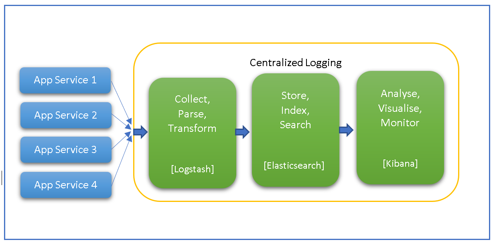
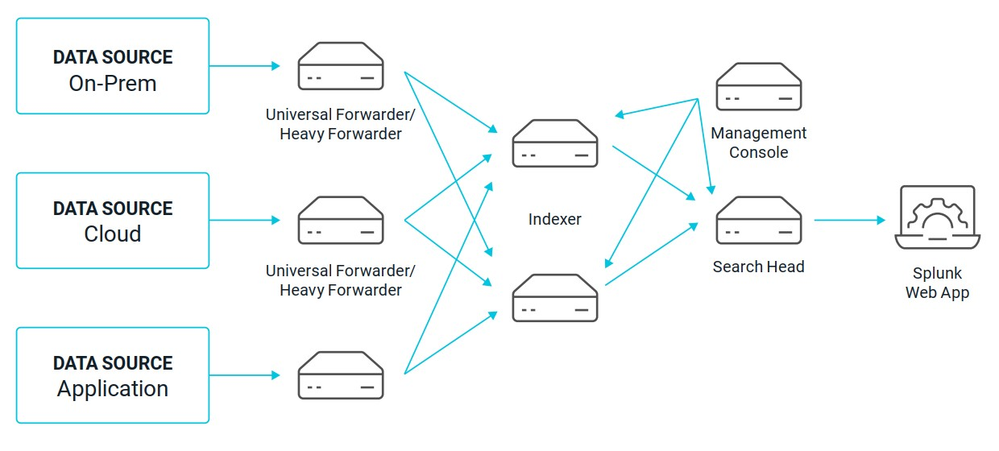
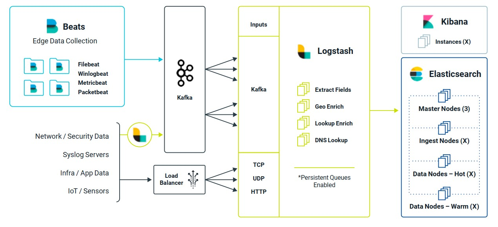
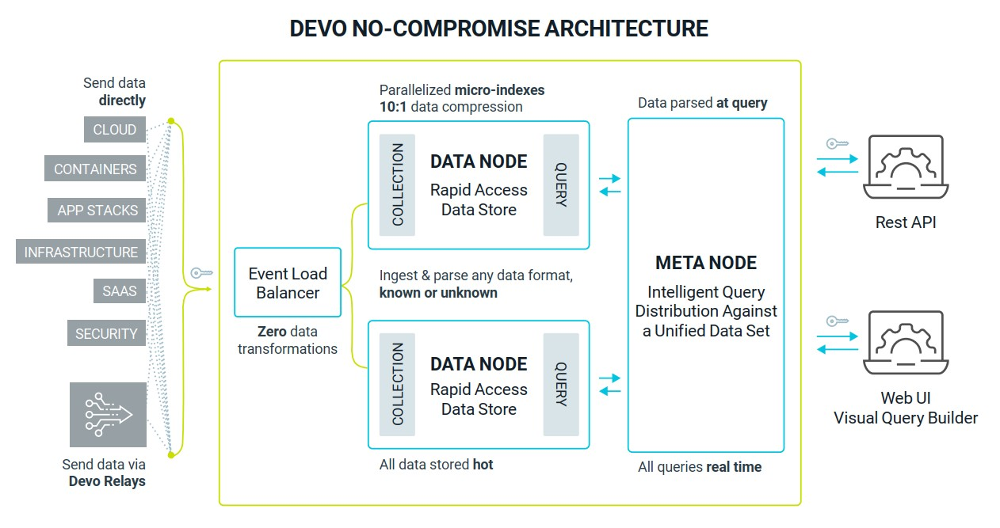

#  **Tìm hiểu và phân tích các mô hình triển khai Centrialized Logging**
##  **Mục lục**
[**I. Tổng quan về Centrialized Logging**]()

[**II. Mô hình triển khai Centrialized Logging**]()
- [**1. On-Premise**]()
- [**2. On Cloud**]()

[**III. Tài liệu tham khảo**]()
##  **I. Tổng quan về Centrialized Logging**
Log đóng một vai trò quan trọng trong bất kỳ ứng dụng nào. Nó cực kỳ hữu ích trong việc điều tra lỗi khi một ứng dụng gặp lỗi hoặc không hoạt động như mong đợi. Log file chứa các bản ghi về các sự kiện và hoạt động được thực hiện trên bất kỳ hệ thống hoặc ứng dụng nào. Nó cung cấp lịch sử các thông báo sự kiện có thể được phân tích để tìm ra nguyên nhân gốc rễ của sự cố với ứng dụng.

Ngày nay, chúng ta đang chuyển từ các phần mềm ứng dụng kiến trúc monolith sang kiến trúc microservices phân tán hơn với tốc độ nhanh hơn. Sự tiến bộ này mang lại nhiều tính linh hoạt cho ứng dụng nhưng đồng thời cũng mang lại sự phức tạp về khả năng bảo trì.
###  **Thách thức của Microservices Logging**
Trong kiến trúc Microservices, nhiều dịch vụ phân tán đang giao tiếp với nhau và mọi dịch vụ ứng dụng đều tạo ra log file của nó. Việc quản lý các log file của nhiều dịch vụ rất tốn thời gian và khó khăn.

Hơn nữa, vì nhiều microservices đang chạy trên các máy chủ khác nhau và tình trạng sức khỏe của chúng phải được theo dõi để tránh lỗi. Nếu bất kỳ dịch vụ nào bị lỗi, thì việc tìm kiếm dịch vụ bị ảnh hưởng do tính chất phân tán của nó sẽ rất khó khăn.

Hơn nữa, để phân tích error log trên microservices, chúng ta cần lọc và kiểm tra từng nhật ký của từng dịch vụ riêng lẻ cho đến khi chúng ta nhận được thông tin liên quan. Điều này có nghĩa là thời gian và nỗ lực đáng kể sẽ được dành cho việc gỡ lỗi và khắc phục sự cố ứng dụng.
###  **Giải pháp Centrialized Logging**
Giải pháp Centrialized Logging cho phép chúng ta tổng hợp tất cả nhật ký từ các dịch vụ ứng dụng phân tán và giám sát chúng từ một giao diện. Nó cung cấp khả năng truy cập dễ dàng vào logs để phân tích trong một bảng điều khiển duy nhất và chúng ta không phải tìm kiếm trên từng máy chủ để khắc phục sự cố.

Giải pháp Centrialized Logging có những ưu, nhược điểm riêng

**_Ưu điểm:_**

-   Tất cả các services và log đều có thể truy cập được từ một Giao diện
-   Một dashboard duy nhất cung cấp cái nhìn toàn cảnh của một ứng dụng
-   Cung cấp khả năng giám sát tốt hơn

**_Nhược điểm:_**

-   Yêu cầu nhiều công sức hơn để set up hệ thống centralized logging
-   Không phù hợp với ứng dụng có kiến trúc Monolith
###  **Thành phần Centrialized Logging**
Một giải pháp Centrialized Logging dựa trên ba thành phần chính.

- **_Thu thập, Phân tích, Chuyển đổi (Collect, Parse, Transform)_**

  Thành phần đầu tiên của cơ chế Centrialized Logging là thu thập dữ liệu log đến và phân tích cú pháp nó thành một định dạng có cấu trúc hơn. Bộ lọc cũng có thể được sử dụng để trích xuất dữ liệu có liên quan.

- **_Lưu trữ, Lập chỉ mục, Tìm kiếm (Store, Index, Search)_**

  Thành phần thứ hai của cơ chế này là lưu trữ dữ liệu được tổng hợp và lọc để nó có thể được xử lý để phân tích. Lập chỉ mục cũng được áp dụng cho dữ liệu để làm cho dữ liệu có thể tìm kiếm được.

- **_Phân tích, Trực quan hóa, Giám sát (Analyse, Visualise, Monitor)_**

  Thành phần thứ ba của cơ chế là cung cấp trực quan hóa dữ liệu đã xử lý có thể được phân tích và giám sát từ một giao diện. Nó cung cấp quyền truy cập một điểm vào log của tất cả các dịch vụ ứng dụng liên quan.

  

  <i>Thành phần Centrialized Logging</i>

 

Tùy vào từng phần mềm mà các thành phần trên có thể có hoặc không hoặc được biến đổi.
##  **II. Mô hình triển khai Centrialized Logging**

### **1. On-Premise**

On-Premise là mô hình triển khai trên cơ sở hạ tầng tại chỗ của khách hàng. Với mô hình sử dụng này, khách hàng thường mua hoặc thuê phần mềm dựa trên máy chủ với tư cách là người được cấp phép, phần mềm này được cài đặt trên máy chủ của chính họ. Một số Centrialized Logging tool được thiết kế cho mô hình triển khai này gồm: ELK Stack, Splunk,...
## Ưu điểm của On-Premise

### Tổng chi phí sở hữu (Total Cost of Ownership)

Vì bạn chỉ trả tiền cho giấy phép người dùng một lần (hoặc có thể miễn phí), nên một giải pháp On-Premise có thể có Tổng chi phí sở hữu (TCO) thấp hơn so với giải pháp đám mây.

### Kiểm soát hoàn toàn

Nền tảng dữ liệu, phần cứng và phần mềm tất cả là của bạn. Bạn quyết định cấu hình, nâng cấp và thay đổi hệ thống.

### Uptime

Với các On-Premise system, bạn không dựa vào kết nối internet hoặc các yếu tố bên ngoài để truy cập dịch vụ của mình.

## Nhược điểm của On-Premise

### Chi phí vốn lớn

On-Premise system thường yêu cầu một khoản mua trả trước khá lớn, điều đó có nghĩa là chi phí vốn (CapEx) sẽ tăng theo. Chưa kể bạn còn phải chi trả cho các chi phí bảo trì để đảm bảo hỗ trợ và nâng cấp chức năng.

### Trách nhiệm bảo trì

Với một On-Premise system, bạn có trách nhiệm phải bảo trì phần cứng và phần mềm, sao lưu dữ liệu, và khắc phục thảm họa. Đây có thể là một vấn đề đối với các công ty nhỏ có ngân sách và nguồn lực kỹ thuật hạn chế.

### Thời gian thực hiện lâu hơn

Việc triển khai On-premise mất nhiều thời gian: thời gian để hoàn tất cài đặt trên máy chủ và từng computer/ laptop.

Sau đây, bài viết sẽ giới thiệu phần mềm Splunk - phần mềm được thiết kế cho mô hình triển khai On-Premise.
## Splunk
Splunk là một phần mềm giám sát mạng dựa trên sức mạnh của việc phân tích Log. Splunk thực hiện các công việc tìm kiếm, giám sát và phân tích các dữ liệu lớn được sinh ra từ các ứng dụng, các hệ thống và các thiết bị hạ tầng mạng. Nó có thể thao tác tốt với nhiều loại dịnh dạng dữ liệu khác nhau (Syslog, csv, apache-log, access_combined…). Splunk được xây dựng dựa trên nền tảng Lucene và MongoDB.

Kiến trúc Splunk tương tự như Elastic - phần mềm sẽ được nhắc tới ỏe phần sau bài viết, nhưng nó đơn giản hơn một chút. Các nguồn dữ liệu gửi thông tin đến bộ chuyển tiếp của Splunk thông qua Rsyslog, NXLog, v.v. Bộ chuyển tiếp sẽ lọc trước dữ liệu trước khi gửi đến bộ chỉ mục của Splunk. Đầu tìm kiếm phân phối các tìm kiếm đến một hoặc nhiều công cụ lập chỉ mục và kết quả tìm kiếm có sẵn trực tiếp từ trình duyệt thông qua giao diện web của Splunk. Một phiên bản đơn giản của kiến trúc này được hiển thị trong sơ đồ dưới đây.

  

  <i>Splunk Architecture</i>

 

**_Ưu điểm:_**
- Giao diện người dùng thân thiện, dễ dàng sử dụng
- Liên kết với hầu hết các nguồn log đang có hiện nay
- Bộ chuyển tiếp có tốc độ xử lý nhanh
- Dễ dàng triển khai

**_Nhược điểm:_**
- Splunk mạnh về khả năng phân tích và cảnh báo tuy nhiên nó lại không mạnh và không đảm bảo về việc thu thập và truyền tải log. Cụ thể là nó chưa có cơ chế bảo mật trên đường truyền, không phù hợp với những hệ thống đòi hỏi bảo mật cao.
- Mỗi bộ chỉ mục không thể nhập quá 250GB một ngày, vì thế khi cần scale hệ thống thì phải tăng số bộ chỉ mục lên. Điều này làm tăng chi phí đáng kể - nhất là trong mô hình On-Premise
- Chi phí vốn ban đầu lớn
- Yêu cầu hiểu biết rõ ngôn ngữ SPL (Search Processing Language)

Vì những lý do trên, mô hình triển khai On-Premise phù hợp
- Với các hệ thống scale nhỏ: sử dụng các giải pháp Open Source
- Với những hệ thống scale vừa và lớn, có đội ngũ IT đông đảo, có những yêu cầu đặc biệt: sử dụng giải pháp từ bên thứ 3 như Splunk,... 
###  **2. On Cloud**
On Cloud là mô hình triển khai đề cập đến các máy chủ được truy cập qua Internet, phần mềm và cơ sở dữ liệu chạy trên các máy chủ đó. Máy chủ đám mây được đặt tại các trung tâm dữ liệu trên toàn thế giới. Bằng cách sử dụng điện toán đám mây, người dùng và các công ty không phải tự quản lý các máy chủ vật lý hoặc chạy các ứng dụng phần mềm trên máy của riêng họ. 

**_Ưu điểm:_**

- **Truy cập bất kỳ lúc nào tại bất cứ đâu**: Bạn có thể truy cập ứng dụng của mình mọi lúc mọi nơi thông qua trình duyệt web từ bất kỳ thiết bị nào.

- **Giá cả phải chăng**: Cloud không yêu cầu các khoản chi phí trả trước, thay vào đó bạn chỉ phải thanh toán chi phí hoạt động (OpEx). Các dịch vụ bảo trì và hỗ trợ cũng được bao gồm cả trong chi phí, bạn không cần phải ký hợp đồng theo năm.

- **Chi phí có thể dự đoán được**: Các khoản thanh toán hàng tháng có thể dự đoán được bao gồm lisence, chi phí nâng cấp, dịch vụ hỗ trợ và sao lưu hàng ngày.

- **Hỗ trợ IT miễn phí**: Bạn không cần phải lo lắng về việc bảo trì. Khả năng tương thích và nâng cấp sẽ do nhà cung cấp dịch vụ đám mây thực hiện.

- **Triển khai nhanh**

- **Tính linh hoạt**: Công nghệ đám mây cung cấp tính linh hoạt cao hơn, bạn chỉ trả tiền cho những gì bạn sử dụng và có thể dễ dàng mở rộng để đáp ứng nhu cầu.

**_Nhược điểm:_**

- **Kết nối**: Các giải pháp đám mây yêu cầu truy cập internet đủ độ tin cậy để duy trì hiệu quả.

- **Chi phí dài hạn**: Mặc dù yêu cầu đầu tư trả trước thấp hơn, các giải pháp đám mây có thể tốn kém hơn trong suốt vòng đời của hệ thống, tăng tổng chi phí sở hữu (TCO).

- **Ít tùy chỉnh hơn**: Điều này đúng với mô hình SaaS (Software-as-a-service).

Sau đây, bài viết sẽ giới thiệu một số phần mềm sử dụng mô hình triển khai On Cloud để triển khai Centralized Logging.

**a. Self-Managed & Open Source: ELK Stack**

ELK Stack là tập hợp 3 phần mềm đi chung với nhau, sử dụng mã nguồn mở, phục vụ cho công việc logging. Ba phần mềm này lần lượt là:

-   **Elasticsearch**: Cơ sở dữ liệu để lưu trữ, tìm kiếm và query log
-   **Logstash**: Tiếp nhận log từ nhiều nguồn, sau đó xử lý log và ghi dữ liệu và Elasticsearch
-   **Kibana**: Giao diện để quản lý, thống kê log. Đọc thông tin từ Elasticsearch

Kiến trúc Elastic sử dụng nhiều phương thức khác nhau (Beats, syslog, v.v.) để chuyển tiếp dữ liệu tới Logstash, nơi xử lý dữ liệu và gửi đến tầng Elasticsearch (dựa trên Apache Lucene) để lập chỉ mục và lưu trữ. Kibana được sử dụng để trực quan hóa dữ liệu. Trong thực tế, Kafka được sử dụng làm message broker giữa Beats và Logstash, và để đảm bảo dữ liệu đến từ Beats không bị mất. Zookeeper được sử dụng để cấu hình và đồng bộ hóa Kafka. Sơ đồ các thành phần này được hiển thị bên dưới.

  

  <i>ELK Stack Architecture</i>

 

**_Ưu điểm:_**
- **Chi phí vốn ban đầu ít**: Một trong những lý do chính cho sự tăng trưởng của ELK Stack là rào cản tài chính thấp để gia nhập. Tất cả các thành phần phần mềm của ELK đều miễn phí và mã nguồn mở - có nghĩa là không cần mua trước và không có phí cấp phép phần mềm liên tục.
- **Có thể được triển khai dưới dạng On-Premise và On Cloud**
- **Có thể customize tính năng dựa trên nhu cầu doanh nghiệp**: Là lợi ích quan trọng nhất khi sử dụng các giải pháp Open Source

**_Nhược điểm:_**
- **Triển khai ELK Stack** là một việc khó khăn mà người dùng cần phải
  + Configure cấu hình phân tích cú pháp log và nhập
  + Xây dựng đường dẫn dữ liệu
  + Theo dõi và xử lý các trường hợp ngoại lệ để tránh mất dữ liệu
  + Định cấu hình bản sao và sharding để tối ưu hóa hiệu suất và tránh mất dữ liệu
  + Kiểm tra cấu hình ghi nhật ký để đảm bảo tính nhất quán của dữ liệu
  + Thực hiện giám sát và cảnh báo bảo mật / ứng dụng / mạng
 
  Để vận hành ELK Stack không phải là một quá trình đơn giản và các tổ chức không có các kỹ năng và nguồn lực cần thiết trong nhà sẽ phải đầu tư vào một chương trình đào tạo hoặc tuyển dụng một chuyên gia ELK Stack để quản lý việc triển khai.
 - **Chi phí sở hữu cao**
   Phần mềm ELK Stack được sử dụng miễn phí, nhưng việc xây dựng, phát triển và duy trì ELK Stack yêu cầu cơ sở hạ tầng và tài nguyên. Cho dù bạn triển khai On-Premise hay On Cloud, chi phí cho tính toán và lưu trữ dữ liệu của bạn sẽ phụ thuộc vào:
   
    + Tổng khối lượng nhật ký mà bạn tổng hợp hàng ngày từ tất cả các ứng dụng, hệ thống và mạng.
    + Bạn sẽ lưu giữ dữ liệu trong bao lâu để lập chỉ mục hoặc lưu trữ.
 
- **Vấn đề về độ ổn định và thời gian hoạt động**

  Người dùng ELK Stack đã báo cáo các vấn đề về độ ổn định và thời gian hoạt động dường như trở nên tồi tệ hơn khi khối lượng dữ liệu tăng lên.

  ELK Stack triển khai trên Cloud là a lift-and-shift của kiến trúc On-Premise nên tất cả những thách thức tương tự của việc triển khai tại chỗ đều chuyển sang đám mây. Vì dữ liệu phải được lập chỉ mục và phân tích cú pháp trước khi có thể tìm kiếm được, nên có thể có độ trễ đáng kể từ khi nhập dữ liệu đến khi dữ liệu có sẵn để tìm kiếm. Vấn đề này trở nên nghiêm trọng hơn trong các đợt bùng nổ dữ liệu lớn ở phía nhập. Độ trễ có thể đặc biệt gây ra vấn đề khi các nhà phân tích đang điều tra các vấn đề về hoạt động hoặc bảo mật có mức độ ưu tiên cao. Vì dữ liệu phải được phân tích cú pháp trước khi nhập, nên định dạng của nó phải được biết. Nếu định dạng thay đổi, dữ liệu phải được lập chỉ mục lại, một quá trình kéo dài ảnh hưởng đến tìm kiếm.
- **Cân bằng lưu giữ dữ liệu**
Khi khối lượng dữ liệu tăng lên, người dùng ELK Stack có xu hướng gặp phải những thách thức về khả năng sử dụng dữ liệu và đánh đổi giữa lưu giữ dữ liệu và chi phí - nhưng tại sao lại như vậy?

  Lý do là do hai tính năng xác định của Elasticsearch: Sharding và Replicas.

  Sharding cho phép người dùng chia chỉ mục theo chiều ngang bằng cách chia nó thành các mảnh. Mỗi phân đoạn là một chỉ mục Lucene độc lập có thể được truy vấn bởi một nút Elasticsearch, vì vậy người dùng có thể song song hóa các hoạt động giữa các nút và giữa các phân đoạn để tăng tốc hoạt động. Replica là bản sao của các mảnh đóng vai trò như một hệ thống sao lưu. Để bảo vệ chống mất dữ liệu trong trường hợp nút bị lỗi, một bản sao và phân đoạn giống hệt của nó sẽ không bao giờ được lưu trữ trên cùng một nút.

  Sharding và bản sao đều là những tính năng hữu ích, nhưng việc tận dụng chúng hoàn toàn đòi hỏi nhiều tài nguyên máy tính hơn, nhiều không gian đĩa hơn và các nút bổ sung. Điều này khiến người dùng phải chịu chi phí hoặc giảm tỷ lệ lưu giữ và lưu trữ dữ liệu để tạo ra sự khác biệt.
- **Khả năng mở rộng quy mô**
  Các thách thức mở rộng quy mô của ELK Stack là kết quả của nhiều vấn đề mà chúng ta đã đề cập: sự không ổn định của các chỉ số lớn, tính kinh tế chi phí thấp của việc Sharding và Replica, và sự tăng trưởng nhanh chóng trong TCO biểu hiện khi các tổ chức tăng việc nhập log file hàng ngày của họ.
  
**b. Third-party: Devo**

Trên thị trường có rất nhiều công cụ Centralized Logging được cung cấp bởi bên thứ 3. Trong khuôn khổ bài viết này, chúng ta sẽ tìm hiểu công cụ Devo - một công cụ được giới thiệu là hoàn toàn cloud-native.

Kiến trúc Devo cung cấp một phương pháp nhập và lưu trữ dữ liệu độc đáo. Điều này mang lại lợi ích hiệu suất đáng kể về tốc độ nhập, hiệu suất tìm kiếm và nén dữ liệu.

Devo sử dụng một thành phần được gọi là Relay để tổng hợp dữ liệu từ các nguồn, gắn thẻ nó và truyền nó qua kết nối an toàn. Dữ liệu từ một hoặc nhiều Relay đi vào bộ cân bằng tải sự kiện trước khi được gửi vào Data Node Devo để lưu trữ. Khi các Data Node mở rộng quy mô, các Meta Node điều phối các tìm kiếm trên nhiều Data Node. Kiến trúc này mở rộng theo chiều ngang, như được hiển thị trong sơ đồ dưới đây.

  

  <i>Devo Architecture</i>

 

Việc gắn thẻ dữ liệu bằng Relay cho Data Node biết cách lưu trữ dữ liệu đó, chẳng hạn như trong web.apache.error. Các thẻ có thể có nhiều lớp để xác định và phân đoạn dữ liệu. Dữ liệu được gắn thẻ được lưu trữ trong hệ thống tệp phân cấp trong Data Node. Điều này giúp loại bỏ nhu cầu lập chỉ mục dữ liệu khi nhập. Lưu trữ dữ liệu trong cấu trúc tệp phân cấp cũng giúp việc nén dữ liệu hiệu quả hơn nhiều, vì các thuật toán nén ngày nay rất hiệu quả.

**_Ưu điểm:_**
- Đầu tiên, dữ liệu không cần được lập chỉ mục khi nhập, có nghĩa là dữ liệu có thể tìm kiếm được ngay lập tức. Điều này cũng cho phép cảnh báo thời gian thực.

- Thứ hai, việc thiếu lập chỉ mục về quá trình nhập có nghĩa là việc nhập dữ liệu trở nên rất hiệu quả. Một Data Node có thể nhập 2TB dữ liệu mỗi ngày. Điều này có nghĩa là Devo yêu cầu ít đám mây hơn đáng kể cơ sở hạ tầng để mở rộng quy mô, so với Elastic và Splunk, trực tiếp chuyển sang tiết kiệm chi phí cho tổ chức của bạn.

- Thứ ba, vì dữ liệu được phân tích cú pháp tại thời điểm truy vấn, không phải khi nhập, nên nó luôn được lưu trữ thô và không bao giờ thay đổi. Các thay đổi về định dạng dữ liệu không ảnh hưởng đến quá trình nhập và tìm kiếm. Dữ liệu không bao giờ yêu cầu lập chỉ mục lại nếu định dạng hoặc nguồn thay đổi. Điều này làm cho kiến ​​trúc Devo dễ thay đổi hơn, so với Elastic.

- Cuối cùng, phương pháp lưu trữ dữ liệu độc đáo của Devo trong các tệp phẳng phân cấp dẫn đến tỷ lệ nén trung bình của dữ liệu được nhập vào là 10: 1 so với kích thước lưu trữ. Điều này dẫn đến việc Devo có thể tìm kiếm được trong 400 ngày. Điều này cung cấp cho bạn dữ liệu có thể lưu trữ lâu hơn đáng kể so với Elastic hoặc Splunk mà vẫn đảm bảo hạ tầng không bị quá tải.

**_Nhược điểm:_**
- Không thể customize tính năng như là Open-Source
- Vì là bên thứ ba nên mọi vấn đề về dữ liệu, bảo mật, đường truyền đều phụ thuộc vào nhà cung cấp dịch vụ

Vì những lý do trên, mô hình triển khai On Cloud phù hợp với tất cả các dạng hệ thống scale từ nhỏ đến lớn.
##  **III. Tài liệu tham khảo**
[Centralized Logging for Microservices — an Overview | by Maaz Silotri | Medium](https://maazs.medium.com/centralized-logging-for-microservices-an-overview-98f5bc4a7dac)

[Cloud Vs On Premise: Cái nào tốt nhất cho doanh nghiệp của bạn? (bizflycloud.vn)](https://bizflycloud.vn/tin-tuc/cloud-vs-on-premise-cai-nao-tot-nhat-cho-doanh-nghiep-cua-ban-20190425113302457.htm#:~:text=So%20s%C3%A1nh%20Cloud%20vs%20On,c%E1%BA%ADp%20qua%20tr%C3%ACnh%20duy%E1%BB%87t%20web.)

[Buyers_Guide_for_Log_Management_EBook](content/uploads/sites/1/2021/01/Buyers_Guide_for_Log_Management_EBook.pdf)

[5 Elk Stack Pros and Cons | ChaosSearch](https://www.chaossearch.io/blog/elk-stack-pros-and-cons)

[Phát hiện xâm nhập với Splunk (viblo.asia)](https://viblo.asia/p/phat-hien-xam-nhap-voi-splunk-OeVKB8MdlkW)

[Splunk Review: Top Features, Pros, And Cons - YouTube](https://www.youtube.com/watch?v=rqPD_TF-zGI)
