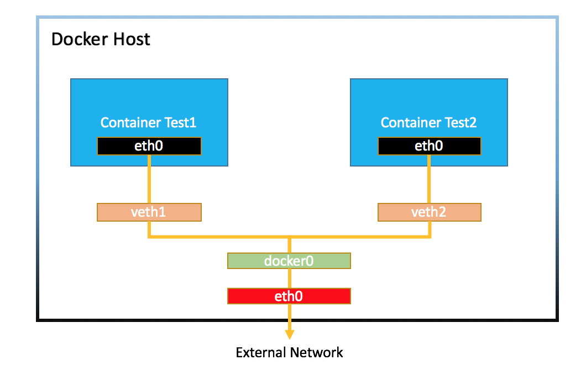

# DOCKER NETWORKING 

## Content 

## I. What are docker network modes?
#### 1. Bridge mode
#### 2. Overplay mode
#### 3. Host mode
#### 4. MACVLAN mode
#### 5. None mode
    
## II. How does docker-compose provide networking for its services
## III. How does docker swarm do multi-host networking
#### 1. What is Docker Swarm
#### 2. Overplay networks operation for swarm sevices
#### 3. Networking with overplay networks
## IV. References

---

## I. What are docker network modes?

- Docker containers and services are so powerful because you can connect them together, or connect them to non-Docker workloads. Docker containers and services do not even need to be aware that they are deployed on Docker, or whether their peers are also Docker workloads or not. Whether your Docker hosts run Linux, Windows, or a mix of the two, you can use Docker to manage them through Docker's networking.
- Docker’s networking subsystem is pluggable, using drivers. There are five docker network drivers: 

1. Bridge mode
2. Overplay mode
3. Host mode
4. MACVLAN mode
5. None mode

### 1. Bridge mode
 
- Bridge mode is the default network driver of docker. If you do not scpecify the driver, bridge networks will be created.
- Default bridge network: is not recommended for production use, is considered a legacy of Docker
- User-defined bridge network: 
    - Provide automatic DNS resolution between containers.
    - Provide better isolation default bridge.
    - Containers can be attached and detached from user-defined networks on the fly.
    - Each user-defined network creates a configurable bridge.

- User-defined bridge networks are best when you need multiple containers to communicate on the same Docker host.

- Connect a container to a user-defined bridge

  - When you create a new container, you can specify one or more --network flags. This example connects a Nginx container to the ```khanghn-net``` network. It also publishes port 80 in the container to port 8080 on the Docker host, so external clients can access that port. Any other container connected to the my-net network has access to all ports on the ```khanghn-nginx``` container, and vice versa.

    ```
    $  docker create --name khanghn-nginx \
    --network khanghn-net \
    --publish 8080:80 \
    nginx:latest
    ```
  - The following command connects an already-running my-nginx container to an already-existing my-net network:
    ```
    docker network connect khanghn-net khanghn-nginx
    ```
- Disconnect a running container from a user-defined bridge
  Disconnects the ```khanghn-nginx``` container from the ```khanghn-net``` network
    ```
    docker network disconnect khanghn-net khanghn-nginx
    ```

- Containers connected to the same user-defined bridge network effectively expose all ports to each other. For a port to be accessible to containers or non-Docker hosts on different networks, that port must be published using the -p or --publish flag.

  


### 2. Overplay mode

- The overlay network driver creates a distributed network among multiple Docker daemon hosts. This network sits on top of (overlays) the host-specific networks, allowing containers connected to it (including swarm service containers) to communicate securely when encryption is enabled. Docker transparently handles routing of each packet to and from the correct Docker daemon host and the correct destination container.

- When you initialize a swarm or join a Docker host to an existing swarm, 02 new networks are created on that Docker host:

  - an overlay network called `ingress`, which handles the control and data traffic related to swarm services. When you create a swarm service and do not connect it to a user-defined overlay network, it connects to the ingress network by default.
  - a bridge network called `docker_gwbridge`, which connects the individual Docker daemon to the other daemons participating in the swarm.

- Overlay networks are best when you need containers running on different Docker hosts to communicate, or when multiple applications work together using swarm services.

  

#### 2.1. Create an overplay network:
- Prerequisites:
  - Firewall rules for Docker daemons using overlay networks
  - Open following ports to traffic to and from each Docker host on an overplay network:
    - TCP port 2377 for cluster management communications
    - TCP and UDP port 7946 for communication among nodes
    - UDP port 4789 for overlay network traffic
    - We define `manger` host as both a manager and a worker, `khanghn-1` and `khanghn-2` are workers only.
    - Initialize Docker daemons as a swarm manager, that is `manager`:
      ```
      $ docker swarm init --advertise-addr=<IP-ADDRESS-OF-MANAGER>
      ```
      Joining `khanghn-1` to docker swarm, `advertise-addr` is optional:
      ```
      $ docker swarm join --token <TOKEN> \
            --advertise-addr <IP-ADDRESS-OF-khanghn-1> \
            <IP-ADDRESS-OF-manger>:2377
      ```
      Similarly, joining `khanghn-2` to the swarm:
      ```
      $ docker swarm join --token <TOKEN> \
            --advertise-addr <IP-ADDRESS-OF-khanghn-2> \
            <IP-ADDRESS-OF-manager>:2377
      ```
- Create an overlay network for use with swarm service
  ```
  $ docker network create -d overlay khanghn-overlay
  ```
- Create the service using overplay network, publishing port 80 and 8080 on Docker host. (user-defined overplay network)
  ```
  $ docker service create \
    --name khanghn-nginx \
    --network khanghn-overlay \
    --replicas 1 \
    --publish published=8080,target=80 \
    nginx:latest
  ```
- Run `docker network inspect khanghn-overlay` and verify that the `khanghn-nginx` service task is connected to it, by looking at the `Containers` section.

#### 2.2. Customize the ingress network

  - Most users never need to configure the ingress network, but Docker allows you to do so.
  - Customizing the ingress network involves removing and recreating it. This is usually done before you create any services in the swarm.
  - Step 1: Inspect the ingress network using docker network inspect ingress, and remove any services whose containers are connected to it
  - Step 2: Remove the existing ingress network:
    ```
    $ docker network rm ingress
    ```
  - Step 3: Create a new overlay network using the --ingress
    ```
    docker network create \
      --driver overlay \
      --ingress \
      --subnet=10.11.0.0/16 \
      --gateway=10.11.0.2 \
      --opt com.docker.network.driver.mtu=1200 \
      my-ingress
    ```
  - Step 4: Restart the services

#### 2.3. Customize the docker_gwbridge interface

  - `docker_gwbridge` is a virtual bridge that connects the overlay networks (including the ingress network) to an individual Docker daemon’s physical network. Docker creates it automatically when you initialize a swarm or join a Docker host to a swarm, but it is not a Docker device. It exists in the kernel of the Docker host. If you need to customize its settings, you must do so before joining the Docker host to the swarm, or after temporarily removing the host from the swarm.
  - Step 1: Stop Docker
  - Step 2: Delete the existing `docker_gwbridge` interface.
    ```
    $ sudo ip link set docker_gwbridge down
    $ sudo ip link del dev docker_gwbridge
    ```
  - Step 3: Start Docker (not initializing or joining Docker swarm)
  - Step 4:  Create `docker_gwbridge`
    ```
    $ docker network create \
      --subnet 10.11.0.0/16 \
      --opt com.docker.network.bridge.name=docker_gwbridge \
      --opt com.docker.network.bridge.enable_icc=false \
      --opt com.docker.network.bridge.enable_ip_masquerade=true \
      docker_gwbridge
    ```
  - Step 5: Now, initialize or join the existing swarm

### 3. Host mode

- When using the host network mode for a container, that container’s network stack is not isolated from the Docker host (the container shares the host’s networking namespace), and the container does not get its own IP-address allocated.
- The host networking driver only works on Linux hosts, and is not supported on Docker Desktop for Mac, Docker Desktop for Windows, or Docker EE for Windows Server.

- Host networks are best when the network stack should not be isolated from the Docker host, but you want other aspects of the container to be isolated.

  

- Following example is to start the `nginx` container which blind  directly to port 80 on Docker host:
#### 3.1. Prerequisites 

  - Port 80 that available on the Docker host.
  - `nginx` image
#### 3.2. Procedure

  - Step 1: Create and start the container as a detached process. 
    ```
    $ docker run --rm -d --network host --name khanghn_nginx nginx
    ```
  - Step 2: Access Nginx in `http://localhost:80/`.
  - Step 3: Examine the network
    - Examine all network interfaces
      ```
      $ ip addr show
      ```
    - Verify which process is bound to port 80
      ```
      $ sudo netstat -tulpn | grep :80
      ```
  - Step 4: Stop the container
    ```
    docker container stop khanghn_nginx
    ```
### 4. MAVLAN mode

- When applications which monitor network traffic, expect to be directly connected to the physical network, can using the `macvlan` network driver to assign a MAC address to each container’s virtual network interface, making it appear to be a physical network interface directly connected to the physical network. 

  

- Noted:
  - It is very easy to unintentionally damage your network due to IP address exhaustion or to “VLAN spread”, which is a situation in which you have an inappropriately large number of unique MAC addresses in your network.

  - Your networking equipment needs to be able to handle “promiscuous mode”, where one physical interface can be assigned multiple MAC addresses.
  
  - If your application can work using a bridge (on a single Docker host) or overlay (to communicate across multiple Docker hosts), these solutions may be better in the long term.

- Macvlan networks are best when you are migrating from a VM setup or need your containers to look like physical hosts on your network, each with a unique MAC address.

### Create a macvlan network 

- Bridge mode

  In `bridge` mode, macvlan traffic goes through a physical device on the host.
  ```
  docker network create -d macvlan \
    --subnet=172.16.86.0/24 \
    --gateway=172.16.86.1 \
    -o parent=eth0 pub_net
  ```
  `parent`: interface the traffic will go through on Docker host

- 802.1q trunk bridge mode

  In `802.1q trunk bridge` mode, traffic goes through an 802.1q sub-interface which Docker creates on the fly. This allows you to control routing and filtering at a more granular level.
  ```
  $ docker network create -d macvlan \
    --subnet=192.168.50.0/24 \
    --gateway=192.168.50.1 \
    -o parent=eth0.50 macvlan50
  ```

### 5. None mode

- In `none` mode, disable all networking. Usually used in conjunction with a custom network driver. 

- `none` mode is not available for swarm services. 

- Can disable completely the networking stack on a container by using the `--network none` flag when starting the container. And only the loopback device is created.
  ```
  $ docker run --rm -dit \
    --network none \
    --name no-net-alpine \
    alpine:latest \
    ash
  ```

## II. How does docker-compose provide networking for its services

### 1. Create default docker-compode network 

- By default Compose create a single network for your app. Each container for a service joins the default network and is both reachable by other containers on that network, and discoverable by them at a hostname identical to the container name.
 
- Example that creating apps is in a directory called `khanghn-app`, `docker-compose.yml` is described below:
  ```
  version: "3.9"
  services:
    web:
      build: .
      ports:
        - "8000:8000"
    db:
      image: postgres
      ports:
        - "8001:5432"
  ```
  
  
### 2. Update containers

If you change configuration to a service and run `docker-compose up` to update it, the old container is removed and the new one joins the network under a different IP address but the same name. Running containers can look up that name and connect to the new address, but the old address stops working.If you make a configuration change to a service and run docker-compose up to update it, the old container is removed and the new one joins the network under a different IP address but the same name. Running containers can look up that name and connect to the new address, but the old address stops working.

If any containers have connections open to the old container, they are closed. It is a container’s responsibility to detect this condition, look up the name again and reconnect.

### 3. Links

- Links allow you to define extra aliases by which a service is reachable from another service. They are not required to enable services to communicate - by default, any service can reach any other service at that service’s name.

- Example, db is reachable from web at the hostnames db and database:
  ```
  version: "3.9"
  services:

    web:
      build: .
      links:
        - "db:database"
    db:
      image: postgres
  ```
### 4. Multi-host networking

- Deploying a Compose application on a Docker Engine with Swarm mode enabled by using of the built-in `overlay` mode to enable multi-host communication.

## III.How does docker swarm do multihost networking?

### 1. What is Docker Swarm?

 

- Docker swarm is a container orchestration tool, meaning that it allows the user to manage multiple containers deployed across multiple host machines. One of the key benefits associated with the operation of a docker swarm is the high level of availability offered for applications.

- Docker swarm connect containers to multiple hosts similar to Kubenetes

- Docker-compose is single-node swarm.

- Docker Swarm architecture: 

  

- Components:
  - Swarm: is a cluster of one or more Docker Engines running (specifically, nodes) in Swarm mode, instead of having to run containers with commands, we will set up services to allocate replicas to nodes.
  - Node: a physical or virtual machine running a Docker Engine instance in Swarm mode. Node will include two types: Manager Node and Worker Node.
  - Manager nodes: perform the orchestration and cluster management functions required to maintain the desired state of the swarm. Manager nodes elect a single leader to conduct orchestration tasks.Manager node is also treated as the Worker node.
  - Worker nodes: receive and execute tasks dispatched from manager nodes. By default, manager nodes are also worker nodes, but you can configure managers to be manager-only nodes.
  - Service: specifies the image of the container and the desired number of replicas to launch in the swarm.
  - Task: a task that the worker node has to perform. This task will be down-allocated by node Manager. A task carries a Docker Container and commands to run inside the container.

- The following port must be opened while working on docker swarm mode:\
      ◦ 2377 (TCP) - Cluster management\
      ◦ 7946 (TCP and UDP) - Nodes communication\
      ◦ 4789 (TCP and UDP) - Overlay network traffic

### 2. Overlay network operations for swarm services:

- Overlays use networking tunnels to deliver communication across hosts. This allows containers to behave as if they are on the same machine by tunneling network subnets from one host to the next; in essence, spanning one network across multiple hosts. Many tunneling technologies exist, such as virtual extensible local area network (VXLAN).

- Docker swarm do multi-host networking by using opverplay network

### 3. Networking in the Swarm

- The swarm manages multi-host networking which supports overlay network services. The cluster manager automatically assigns virtual IP addresses to the containers that join the overlay. The swarm runs an embedded DNS server, which makes it possible for the swarm to also assign each container a unique DNS name that is resolvable from any container within the overlay network. This greatly simplifies service discovery and allows load balancing from the get-go.


- There are 02 network concepts is important to swarm services such as `ingress` and `docker_gwbridge` netowkr which are mentioned above. 

## References

- [Docker network](https://docs.docker.com/network/)
- [Overlay network](https://docs.docker.com/network/network-tutorial-overlay/)
- [Docker compose networking](https://docs.docker.com/compose/networking/)
