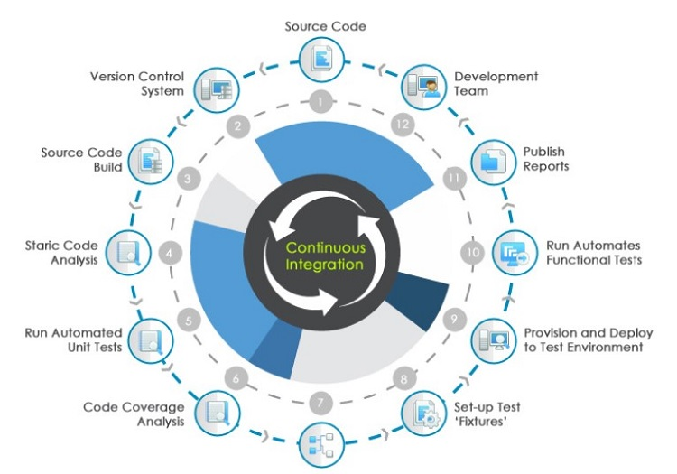
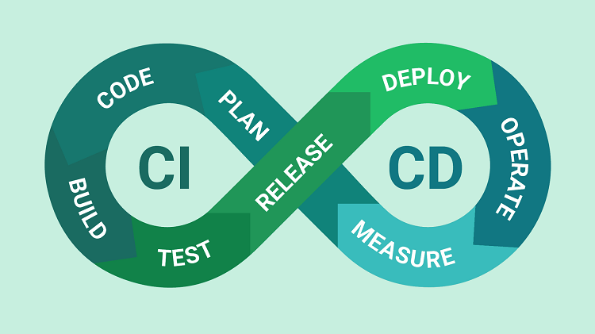
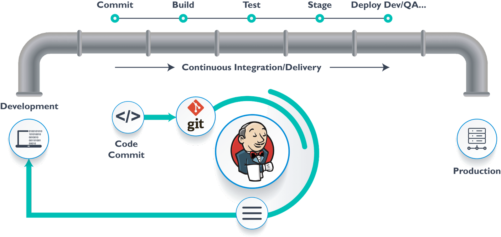
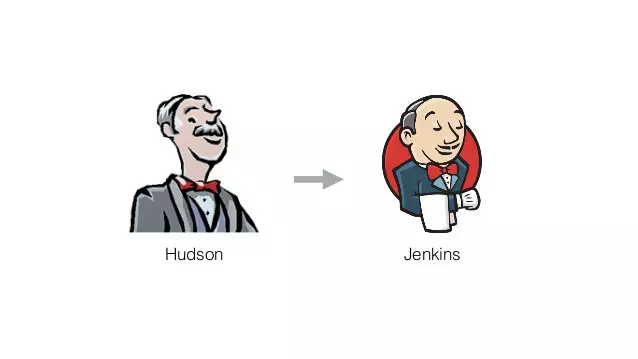
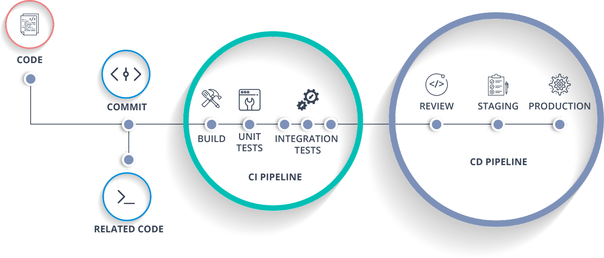
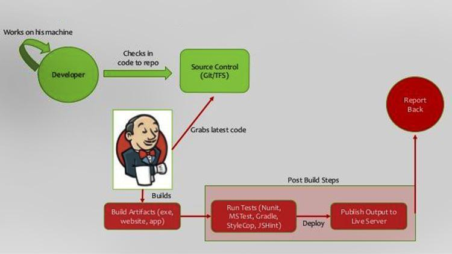
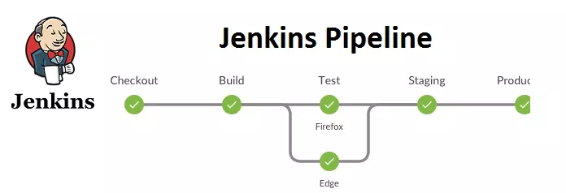

# Practice 6: Phân tích thiết kế cách thức hoạt động và các ưu nhược điểm của giải pháp CI/CD trong Jenkins   
----   
## Mục lục    
  
[1. Giới thiệu về CI/CD](#GioithieuveCICD)     
[2. Giới thiệu về Jenkins](#GioithieuveJenkins)  
[3. Tìm hiểu về CI/CD trong Jenkins](#CI/CDJenkins)     
[4. Jenkins hoạt động như thế nào?](#Jenkinshoatdongntn)  
[5. Ưu nhược điểm của Jenkins](#Uunhuocdiem)               
[6. Tài liệu tham khảo](#tailieuthamkhao)     

-----   
## 1. Giới thiệu về CI/CD
### CI
- Continuous Integration hay CI là một phương pháp phát triển phần mềm. Phương pháp này đòi hỏi các thành viên trong đội cần phải tích hợp công việc với nhau một cách thường xuyên, mỗi ngày cần ít nhất một lần tích hợp. Mỗi lần tích hợp sẽ được xây dựng một cách tự động nhằm mục đích phát hiện ra những lỗi phát sinh một cách nhanh nhất có thể. Khi sử dụng CI sẽ giúp làm giảm những vấn đề về tích hợp và cho phép các developer phát triển phần mềm được nhanh hơn và đúng tiến độ hơn.Quy trình làm việc của -- CI có thể được diễn ra như sau:
  + Các developer sẽ commit code (mã cam kết) có thể lên repo (repository - kho).
  + Tiếp theo, CI server sẽ thực hiện giám sát trên repo và kiểm tra xem có bất kỳ sự thay đổi nào trên repo hay không.

### CD
- Nếu CI đảm nhận nhiệm vụ xây dựng và kiểm tra một cách tự động thì CD lại có nhiệm vụ cao hơn một chút. CD được viết tắt bởi Continuous Delivery - chuyển giao liên tục. Đây là quá trình nâng cao hơn chút đó là kiểm tra tất cả những thay đổi về code đã được build và code trong môi trường kiểm thử. CD cho phép các lập trình viên tự động hóa phần mềm testing, kiểm tra phần mềm qua nhiều thước đo trước khi triển khai.
- Những bài test này có thể bao gồm UI testing, integration testing, API testing,... CD sử dụng Deployment Pipeline giúp chia quy trình chuyển giao thành các giai đoạn. Mỗi giai đoạn có những mục tiêu riêng để xác minh chất lượng của các tính năng từ một góc độ vô cùng khác để có thể kiểm định được chức năng và tránh những lỗi phát sinh ảnh hưởng đến người dùng.
### CI/CD 

- Từ hai khái niệm trên ta có thể hiểu một cách đơn giản thì CI/CD chính là quá trình làm việc liên tục và tự động hóa của phần mềm. Để quá trình kiểm thử được diễn ra liên tục thì CI CD phải được tích hợp vào trong vòng đời phát triển phần mềm. Trong những năm gần đây, CI CD đã trở thành thông lệ trong quá trình phát triển phần mềm, đây là chìa khóa kết hợp các khâu kiểm thử và phát triển phần mềm lại với nhau.Ngoài ra, CI/CD cũng trở thành thông lệ tốt nhất trong ngành công nghệ thông tin để giữ cho ứng dụng có thể được triển khai bất cứ lúc nào cũng như đẩy mã triển khai đó vào kho sản xuất khi có mã mới.
## 2. Giới thiệu về Jenkins   
### Jenkins
- Jenkins là một công cụ tự động hóa có mã nguồn mở được viết bằng Java kết hợp với nhiều Plugin, Jenkins có mục đích chính là tích hợp liên tục (hay còn gọi là CI- Continuous Integration). Công cụ này được sử dụng để xây dựng và kiểm tra các dự án phần mềm liên tục, giúp các nhà phát triển tích hợp các thay đổi vào dự án một cách dễ dàng hơn.

- Jenkins cũng cho phép bạn liên tục cung cấp phần mềm của mình bằng cách tích hợp với một số lượng lớn các công nghệ thử nghiệm hoặc đã triển khai.

- Với Jenkins, các tổ chức có thể đẩy nhanh quá trình phát triển phần mềm thông qua tự động hóa. Jenkins tích hợp các vòng đời phát triển của một quy trình bao gồm xây dựng, tài liệu, thử nghiệm, gói, giai đoạn, triển khai, phân tích tĩnh,…
   
- Bên cạnh đó, các Plugin trong Jenkins cho phép tích hợp các giai đoạn DevOps khác nhau. Nếu bạn muốn tích hợp một công cụ cụ thể, bạn cần cài đặt Plugin cho công cụ đó.
### Lịch sử ra dời
- Đầu tiên, Jenkins có nguồn gốc từ một phần mềm tên là Hudson. Hudson được tạo vào năm 2004 công ty Sun và được phát hành đầu tiên tại java.net.

- Năm 2010, một vấn đề được nảy sinh trong cộng đồng Hudson khi Oracle mua lại Sun. Sau khi Oracle tuyên bố giành thương hiệu và đăng ký nhãn hiệu thì một cuộc biểu quyết kêu gọi đổi tên “Hudson” sang “Jenkins” và đã được phê duyệt.
 
- Năm 2011 thì Oracle tuyên bố họ vẫn tiếp tục phát triển Hudson và coi Jenkins là một dạng pork (phát sinh) chứ không đổi tên. Và cả Hudson và Jenkins đều tồn tại, mặc dù Jenkins có phần nhỉnh hơn.

- Năm 2014, người sáng tạo Kohshuke Kawaguchi trở thành giám đốc công nghệ cho CloudBees (công ty cung cấp các sản phẩm dựa trên nền tảng Jenkins. Đến năm 2016, phiên bản Jenkins 2 được phát hành với tính năng Pipeline. Các plugin cho phép viết mã dựa theo Apache Groovy.
## 3. Tìm hiểu về CI/CD trong Jenkins     
 
### CI (Continuous Integration)
- CI là viết tắt của Continuous Integration, tạm dịch: Tích hợp liên tục. Đây là một quá trình tích hợp các thay đổi code từ nhiều nhà phát triển trong một dự án. Phần mềm được kiểm tra ngay lập tức sau khi code commit. Với mỗi code commit, code sẽ được tiến hành xây dựng và thử nghiệm. Nếu thử nghiệm được thông qua, bản dựng sẽ được thử nghiệm để triển khai. Nếu việc triển khai thành công, mã sẽ được chuyển sang sản xuất.

- Quá trình cam kết, xây dựng, kiểm tra và triển khai này là một quá trình liên tục và do đó mới được gọi là tích hợp/triển khai liên tục.

- Quá trình làm việc của CI gồm:

  + Đầu tiên, tất cả thành viên trong nhóm lập trình tiến hành pull code từ repo về branch nhằm thực hiện một chức năng cụ thể đã được xác định. 

  + Tiếp theo, họ thực hiện lập trình, kiểm tra code để đảm bảo chất lượng toàn bộ mã nguồn, chức năng thực hiện đã đáp ứng yêu cầu.

  + Khi tất cả các thành viên đã hoàn tất code thì việc commit vào branch của nhóm cũng được sẵn sàng. 

  + Thành viên thực hiện cập nhật code mới trên repo về local repo.

  + Tích hợp code và xử lý các vấn đề xung đột.

  + Xây dựng, đảm bảo mã nguồn đạt yêu cầu của các đợt kiểm tra tại local repo.

  + Commit code lên repo.

  + Máy chủ CI thu thập những thay đổi mã nguồn thông qua repository. Sau đó, nó có thể tự động xây dựng hoặc kiểm tra, rồi phát ra thông báo pass hay failure gửi đến các thành viên.

### CD Jenkins là gì?    
- CD là viết tắt của Continuous Delivery, tạm dịch: Chuyển giao liên tục. Đây là quy trình triển khai tất cả thay đổi trong quá trình tự động test và deploy các code lên các môi trường staging và production. 
- Ngoài ra, CD còn hỗ trợ tự động hóa phần testing bên cạnh việc sử dụng units test. Mục đích của CD là thử nghiệm phần mềm liên tục để kiểm tra hệ thống trước khi bàn giao cho khách hàng. 

   

## 4. Jenkins hoạt động như thế nào?  
 
- Để có thể hoạt động, Jenkins cần được cung cấp những gói lưu trữ, cùng gói cài đặt của các hệ điều hành ở dạng Homebrew, và hình ảnh Docker, mã nguồn (chủ yếu là Java, bao gồm một số tệp Ruby, Croovy, Antlr). 

- Khi đã có đầy đủ nguồn lực, bạn cho Jenkins War chạy độc lập, hoặc hoạt động dưới dạng servlet có trong máy chủ ứng dụng Java (ví dụ Tomcat). Dù chạy ở trường hợp nào thì Jenkins đều tạo ra giao diện web cho người dùng, đồng thời, nó chấp nhận những cuộc gọi cho API Rest.

- Trong lần chạy đầu tiên, Jenskin cũng sẽ tạo tài khoản quản trị và cung cấp cho người dùng một mật khẩu ngẫu nhiên. Tất nhiên, bạn được phép dán mật khẩu này vào trang web ban đầu để thực hiện mở khóa trình cài đặt.

- Để Jenskin được vận hành thì một số pipeline được thiết lập. Pipeline là một bước mà máy chủ Jenskins bắt buộc phải thực hiện cho các tác vụ CI/CD. Chúng sẽ được lưu sẵn tại tệp Jenkinsfile. Lúc đó, Jenkinsfile sử dụng cú pháp tương tự JSON (cú pháp ngoặc nhọn {}). Bước này sẽ khai báo pipeline ở dạng câu lệnh chứa tham số.
   

- Sau đó, máy chủ Jenskins sẽ tiến hành đọc tất cả các Jenkinsfile, rồi thực hiện các câu lệnh để đẩy mã từ source code xuống pipeline. Mỗi tệp Jenkinsfile đều được tạo thông qua một GUI, hoặc người dùng tự viết code. 

## 5. Ưu nhược điểm của Jenkins         

### Ưu điểm    
- Có thể được mở rộng bằng cách sử dụng các plugin. Điều này giúp Jenkins có thể thích nghi tốt với những thay đổi trong môi trường CNTT. Đồng thời, plugin cũng giúp Jenkins linh hoạt hơn và cũng phù hợp với hầu hết các môi trường, kể cả các hệ thống phức hợp và đám mây.
- Với thời gian tồn tại lâu, được triển khai rộng rãi. Do đó, Jenkins được tìm hiểu rõ hơn, có nguồn tài liệu phong phú và cộng đồng to lớn. Điều này giúp Jenkins dễ được kiểm soát, cài đặt và các sự cố cũng được dễ dàng khắc phục.
- Jenkins cùng với các plugins được xây dựng dựa trên Java – một doanh nghiệp được thẩm định cùng với một hệ sinh thái rộng lớn. Điều này giúp Jenkins có một nền tảng vững chắc với khả năng mở rộng lớn.
- Jenkins đang được quản lý rất tích cực. Mỗi tháng, công ty phát hành Jenkins sẽ tổ chức các cuộc họp công khai và lấy ý kiến đóng góp từ cộng đồng để phát triển dự án Jenkins.
- Jenkins đã có khoảng 320 Plugin được xuất bản trong cơ sở dữ liệu Plugin của mình.
- Công cụ Jenkins cũng hỗ trợ kiến trúc đám mây để bạn có thể triển khai Jenkins trên các nền tảng dựa trên đám mây.
- Tích hợp với nhiều nền tảng CI/CD và giúp cho team được đồng bộ hóa
- Rất dễ dàng để tìm ra các lỗi trong Jenkins. Nhà phát triển có thể kiểm tra lỗi và giải quyết chúng nhanh chóng.
- Rút ngắn thời gian bàn giao dự án và linh hoạt trong công việc
- Jenkins hỗ trợ các loại kho mã nguồn khác nhau như SVN, Git, v.v. Nhà phát triển có thể đặt các trình kích hoạt khác nhau sau khi thực hiện các thay đổi trong mã.

### Nhược điểm
- Mặc dù việc cài đặt Jenkins là tương đối đơn giản và dễ dàng. Production lại gây khó khăn cho người dùng và việc phát triển các pipeline bằng Jenkinsfile yêu cầu phải lập trình bằng ngôn ngữ khai báo riêng của nó. Đặc biệt, với các pipeline phức tạp thì việc lập trình, debug và bảo trì là tương đối khó khăn.
- Hệ thống open source là một kiến trúc máy chủ đơn, giúp cho việc cài đặt trở nên dễ dàng. Tuy nhiên, nó lại giới hạn tài nguyên của máy tính, máy ảo hoặc container.
- Jenkins không cho phép liên kết giữa các máy chủ nếu nó có thể ảnh hưởng đến hiệu năng. Việc này dẫn đến sự gia tăng số lượng các máy chủ Jenkins độc lập. Từ đó gây khó khăn cho việc quản lý trong một doanh nghiệp lớn.
- Jenkins dựa trên các kiến trúc, công nghệ Java cũ, đặc biệt là các servlet và Maven. Ngay cả việc cài đặt Jenkins Docker vẫn yêu cầu Jenkins code và phần mềm trung gian servlet phải được gộp chung, duy trì kiến trúc của nó.
- Ngoài ra, nó không được thiết kế để triển khai các công nghệ Java mới như Spring Boot hay GraalVM.
## 6. Tài liệu tham khảo  
[1] [What is Jenkins? How to Use Jenkins for CI/CD and Testing](https://applitools.com/blog/what-is-jenkins-how-to-use-jenkins-ci-testing/#:~:text=Jenkins%20is%20a%20popular%20open,by%20automating%20tasks%20like%20testing)   

[2] [Jenkins là gì](https://wiki.tino.org/jenkins-la-gi/)

[3] [What is CI/CD](https://www.redhat.com/en/topics/devops/what-is-ci-cd) 

    
