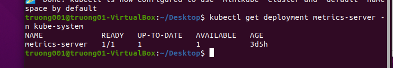
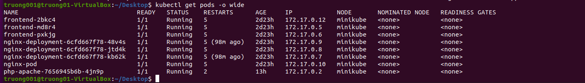
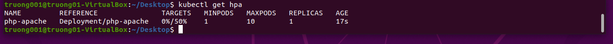
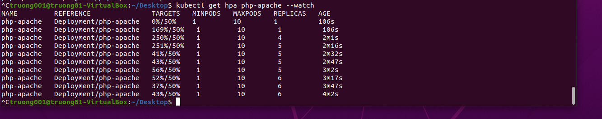
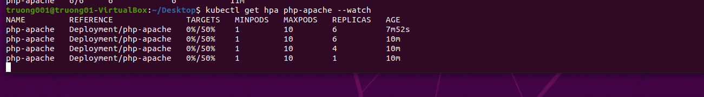
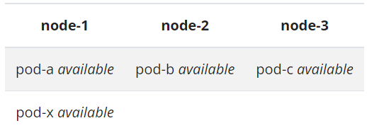
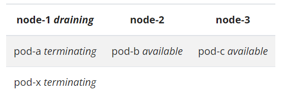
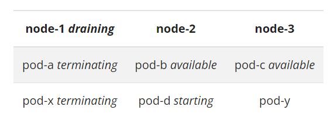
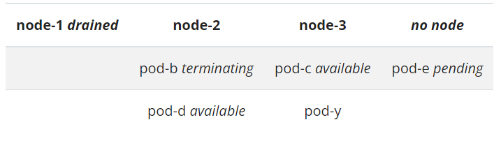

# **PRACTICE 6: TÌM HIỂU VỀ CƠ CHẾ AUTOSCALING TRONG KUBERNETES**

## Table of contents

  - [**I. Một số khái niệm cơ bản cần biết trong kubernetes**](#i-một-số-khái-niệm-cơ-bản-cần-biết-trong-kubernetes)
  - [**II. Autoscale trong Kubernetes**](#ii-autoscale-trong-kubernetes)
    - [**1. VPA**](#1-vpa)
      - [**1-1. Cách hoạt động của VPA**](#1-1-cách-hoạt-động-của-vpa)
      - [**1-2. VPA Benefits**](#1-2-vpa-benefits)
      - [**1-3. VPA Limitations**](#1-3-vpa-limitations)
      - [**1-4. VPA Best Practices**](#1-4-vpa-best-practices)
    - [**2. HPA**](#2-hpa)
      - [**2-1. Cách hoạt động của HPA**](#2-1-cách-hoạt-động-của-hpa)
      - [**2-2. VPA Benefits**](#2-2-vpa-benefits)
      - [**2-3. VPA Limitations**](#2-3-vpa-limitations)
      - [**2-4. VPA Best Practices**](#2-4-vpa-best-practices)
      - [**2-5. Demo HPA**](#2-5-demo-hpa)
    - [**3. CA**](#3-ca)
      - [**3-1. Cách hoạt động của CA**](#3-1-cách-hoạt-động-của-ca)
      - [**3-2. CA Best Practices**](#3-2-ca-best-practices)
  - [**III. Referrences**](#iii-references)

## **I. Một số khái niệm cơ bản cần biết trong kubernetes**

- Pod: Pod là khái niệm cơ bản và quan trọng nhất trên Kubernetes. Bản thân Pod có thể chứa 1 hoặc nhiều hơn 1 container. Pod chính là nơi ứng dụng được chạy trong đó. Pod là các tiến trình nằm trên các Worker Node. Bản thân Pod có tài nguyên riêng về file system, cpu, ram, volumes, địa chỉ network…
- Hệ thống Kubernetes gồm 2 phần chính gọi là Control Plane và Data Plane hay còn gọi là Master Node và Worker Node. Trong đó Master Node sẽ đóng vai trò xử lý các tác vụ quản lý, điều khiển của hệ thống, còn Worker Node sẽ là nơi xử lý các work load của hệ thống. Các pod sẽ được tạo và chạy trên các Worker Node này.
- Trên các Master Node sẽ có 4 thành phần chính gồm:

  - etcd: Là một cơ sở dữ liệu dạng key-value có tính khả dụng và đồng nhất cao. Etcd là nơi K8S lưu trữ toàn bộ các thông tin cấu hình của hệ thống

  - controller: Là một tiến trình chạy nền trên các Master Node. Các tiến trình này chạy liên tục để điều tiết trạng thái của hệ thống Kubernetes. Trong K8S, controller là một vòng lặp điều khiển giám sát trạng thái của cluster được chia sẻ qua qua các api và thực hiện các thay đổi cần thiết để chuyển trạng của cluster tới trạng thái mong muốn.

  - kube api-server: Đây là core của K8S Master, nó mở ra các HTTP API cho phép người dùng cuối cũng như các thành phần khác nhau trong chính K8S cluster có thể trao đổi thông tin với nhau. K8S API cho phép người dùng lấy thông tin về trạng thái của các đối tượng trong hệ thống như Pods, Namespaces, Services... Hầu hết các tác vụ sử dụng kube-api thông qua lệnh kubectl nhưng cũng có thể gọi trực tiếp REST API.

  - kube-scheduler: Scheduler Service có trách nhiệm monitor việc sử dụng tài nguyên trên mỗi máy chủ để đảm bảo rằng hệ thống không bị quá tải. Đây là service mặc định của K8S làm nhiệm vụ phân phối Pod sẽ được chạy trên node nào. Mỗi Container bên trong Pod có thể có những yêu cầu khác nhau, hoặc ngay các Pod cũng có yêu cầu khác nhau. Do đó nhiệm vụ của Scheduler là tìm kiếm các node thỏa mãn các điều kiện trên và lựa chọn node tối ưu nhất để chạy. Tron trường hợp không có node nào thỏa mãn các điều kiện đặt ra thì Pod sẽ ở trạng thái chưa được lên lịch thực hiện cho tới khi Scheduler tìm được node phù hợp.

- Trên các Worker Node sẽ có các thành phần chính gồm:

  - kubelet: Nó đóng vai trò như một "Node Agent" của K8s trên các Worker Node. Nhiệm vụ của nó để Worker Node được đăng ký và quản lý bởi cụm K8S cũng như là nhận nhiệm vụ triển khai các Pod (thường thông qua kube api-server) và đảm báo các container đó chạy ổn định. Lưu ý là kubelet không quản lý các container không được tạo bởi Kubernetes

  - kube-proxy: Quản lý kết nối mạng và duy trì quy tắc mạng giữa các node. Triển khai dịch vụ Kubernetes trên mọi node trong một cụm nhất định.

- Cluster: Kubernetes Cluster (Cụm Kubernetes) là một tập hợp các máy chủ (node) để chạy các ứng dụng được tạo trong Container. Nếu bạn đang chạy Kubernetes, điều đó có nghĩa là bạn đang chạy một Kubernetes Cluster.

  - Trình quản lý bộ điều khiển (Controller): Chạy các quy trình của bộ điều khiển và điều chỉnh trạng thái thực tế của cụm với các thông số kỹ thuật mong muốn của nó. Quản lý các bộ điều khiển như bộ điều khiển node, bộ điều khiển điểm cuối (endpoint),...

  - Kubelet: Đảm bảo rằng các Container đang chạy trong Pod bằng cách tương tác với công cụ Docker. Đây là một chương trình mặc định để tạo và quản lý các Container. Nó sử dụng một bộ PodSpec được cung cấp và đảm bảo rằng các Container tương ứng của chúng hoạt động.

## **II. Autoscale trong Kubernetes**

Nói về Autoscale thì có 3 cách scale là Horizontal Pod Autoscale (HPA), Vertical Pod Autoscale (VPA), Cluster Autoscale.

- Horizontal Pods Autoscaler (HPA) là cách scale mà ta sẽ tăng số lượng pod đang xử lý công việc hiện tại ra nhiều hơn. Một ví dụ điển hình trong cuộc sống hằng ngày, khi chúng ta săn sale ở một web bán hàng vào một ngày đặc biệt, hệ thống sẽ phải nhận một lưu lượng truy cập rất lớn từ client. Do đó, việc mở rộng số pod giúp cho ứng dụng của bạn xử lý được nhiều yêu cầu hơn trong 1 khoảng thời gian nhất định. Và một cái hay nữa là, các pod khi không được sử dụng đến, sẽ tự động xóa để không bị tốn tài nguyên.

- Vertical Pod Autoscaler (VPA) là cách scale thay vì tăng số lượng pod lên, ta sẽ tăng số lượng tài nguyên có thể sử dụng của ứng dụng đó lên, như là tăng số lượng cpu và memory của pod đó.

- Cluster Autoscaler (CA): Khi cluster của bạn sắp hết tài nguyên, Cluster Autoscaler cung cấp một đơn vị tính toán (node) mới và thêm nó vào cluster. Nếu có quá nhiều node trống, Cluster Autoscaler sẽ loại bỏ chúng để giảm chi phí.

Kubernetes hỗ trợ Autoscale rất đa dạng với 3 cách trên, chúng đều mở rộng một cái gì đó nhưng chúng không hề liên quan đến nhau, chúng hoạt động độc lập với các cơ chế khác nhau để đáp ứng nhu cầu mở rộng và thu hẹp theo khối lượng công việc của hệ thống. Tiếp theo chúng ta cùng đi vào tìm hiểu về cách hoạt động của từng kiểu Autoscale.

### **1. VPA**

Trước tiên chúng ta cần tìm hiểu về các component sau đây của VPA

- Recommender: component này sẽ monitor các tài nguyên đã tiêu thụ trước đó tài nguyên hiện tại để cung cấp giá trị cpu và memory requests gợi ý.
- Updater: component này sẽ kiểm tra Pod được quản lý bởi scalable resource có cpu và memory đúng với giá trị của Recommender cung cấp ở trên hay không, nếu không, nó sẽ kill Pod đó và tạo lại Pod mới với cpu và memory requests đã được cập nhật đúng theo Recommender.
- Admission Controller: đây là admission plugin của VPA, dùng để ghi đè các yêu cầu tài nguyên của pods.

Chúng ta cần biết về 2 khái niệm khác sẽ được sử dụng trong VPA, đó là request và limit. Request là lượng tài nguyên tối thiểu mà Pod cần. Và ngược lại, limit sẽ xác định lượng tài nguyên tối đa.

#### **1-1. Cách hoạt động của VPA**

Luồng hoạt động của VPA có thể được tóm tắt như sau: quan sát việc sử dụng tài nguyên → đề xuất các yêu cầu tài nguyên → cập nhật tài nguyên.

VPA không hỗ trợ cho các ứng dụng stateful, do nó cần phải kill pod đi và làm lại cái mới để update. VPA có các thuộc tính lowerbound và upperbound để quyết định xem nên scale up hay scale down theo 2 thuộc tính trên.

Update Policy: Policy này sẽ điều kiển cách VPA áp dụng thay đổi lên cho Pod, được chỉ định thông qua thuộc tính updatePolicy.updateMode. Thuộc tính này có thể được cấu hình theo 3 giá trị khác nhau như sau:

- Off: Ở mode này, VPA chỉ tạo ra một recommendations, mà không áp dụng giá trị recommendations đó lên Pod, ta chọn mode này khi chỉ muốn xem giá trị requests được gợi ý cho chúng ta, và ta sẽ quyết định xem có cập nhật lại cpu và memory requests giống với giá trị gợi ý cho ta hay không.
- Initial: ở mode này, sau khi recommendations được tạo ra, thì chỉ những Pod nào được tạo mới sau khi có giá này recommendations này, thì mới áp dụng giá trị cpu và memory requests được gợi ý, những Pod hiện tại vẫn như cũ.
- Auto: ở mode này, sau khi recommendations được tạo ra, thì không những chỉ những Pod mới được áp dụng giá trị gợi ý này, mà kể cả những Pod hiện tại mà có giá trị không đúng với giá trị của recommendations, thì nó cũng sẽ bị restart lại.

#### **1-2. VPA Benefits**

Đặt các yêu cầu và giới hạn tài nguyên phù hợp cho khối lượng công việc của bạn sẽ cải thiện tính ổn định và hiệu quả chi phí. Bạn sẽ gặp những khó khăn gì nếu như không sử dụng VPA cho ứng dụng của mình: Nếu kích thước tài nguyên Pod của bạn nhỏ hơn workload của bạn yêu cầu, ứng dụng của bạn có thể bị sập, không xử lý workload hoặc có thể bị lỗi do lỗi hết bộ nhớ; nếu quy mô tài nguyên của bạn quá lớn, bạn sẽ lãng phí và do đó, chi phí sẽ lớn hơn.

Các cluster node được sử dụng hiệu quả vì pods sử dụng chính xác những gì nó cần.
Pod được lập lịch trên các node có sẵn các tài nguyên khả dụng
Bạn không cần tốn thời gian để xác định giá trị chính xác cho các request CPU và memory.
Giảm thời gian bảo trì do VPA có thể điều chỉnh CPU và memory requests một cách tự động.

#### **1-3. VPA Limitations**

Cập nhật các pod đang chạy là một tính năng thử nghiệm của VPA. Bất cứ khi nào VPA cập nhật tài nguyên pod, pod sẽ được tạo lại, điều này khiến tất cả các container đang chạy được khởi động lại. Pod có thể phải tạo lại trên một nút khác.
VPA không loại bỏ các pod không được chạy dưới bộ điều khiển. Đối với các Pod như vậy, chế độ Auto tương đương với Initial.
Hiện tại, không nên sử dụng Vertical Pod Autoscaler với Horizontal Pod Autoscaler (HPA) trên CPU hoặc bộ nhớ. Tuy nhiên, bạn có thể sử dụng VPA với HPA trên các chỉ số tùy chỉnh và bên ngoài.
VPA admission controller là một admission webhook. Nếu bạn thêm các admission webhook khác vào cụm của mình, điều quan trọng là phải phân tích cách chúng tương tác và liệu chúng có thể xung đột với nhau hay không.
VPA phản ứng với hầu hết các sự kiện out-of-memory (hết dung lượng), nhưng không phải trong mọi tình huống.
Hiệu suất VPA chưa được kiểm tra trong các cluster lớn.
VPA gợi ý có thể vượt quá các tài nguyên có sẵn mà node có thể cung cấp và khiến các pod vào trạng thái pending. Điều này có thể được giải quyết một phần bằng cách sử dụng VPA cùng với Cluster Autoscaler.

#### **1-4. VPA Best practices**

- Nếu bạn đang sử dụng phiên bản VPA 0.4 thì không nên sử dụng VPA với kubernetes phiên bản cũ hơn 1.11, hoặc nếu bạn dùng phiên bản kubernetes cũ hơn thì hãy sử dụng phiên bản 0.3 của VPA.

- Nên config VPA với updateMode: "Off" trong môi trường thực tế. Sau đó xem các thông số gợi ý thông qua Dashboard Grafana rồi xem xét và áp dụng trong chu kỳ triển khai tiếp theo. Chế độ update tự động (updateMode: "auto") thường được dùng trong môi trường kiểm thử nhiều hơn. Vì trong thực tế, việc restart lại pod trong VPA có thể gây gián đoạn công việc (workload disruption).

- Nếu khối lượng công việc liên tục tăng giảm thất thường (spiky workload), VPA có thể hoạt động năng suất quá mức và nó sẽ liên tục thay thế các pods, điều này làm gián đoạn công việc. Sử dụng HPA sẽ thích hợp hơn với bối cảnh này.

### **2. HPA**

#### **2-1. Cách hoạt động của HPA**

Để có thể thực hiện HPA thì hệ thống của chúng ta cần thực hiện các công việc lần lượt sau:

- Thu thập metrics của tất cả các Pod được quản lý bởi scalable resource mà ta chỉ định trong HPA.
- Tính toán số lượng Pod cần thiết dựa vào metrics thu thập được.
- Cập nhật lại trường replicas của scalable resource nếu như số lượng pod thay đổi.

Ở công việc đầu tiên, chúng ta cần phải cài đặt một công cụ có tên là metrics server. Metrics Server là một server tập hợp lại các metrics (chỉ số đo lường) của các container (các pods) phục vụ cho chu trình autoscaling tích hợp trong K8S. Còn đối với các worker node, sẽ có một công cụ tên là cAdvisor là một component của kubelet, có nhiệm vụ thu thập metric của pod và node, sau đó các metric này sẽ được gửi lên metric servers, và horizontal controller sẽ lấy metric từ metrics server ra.
Bước tiếp theo, horizontal controller sẽ dựa vào metric để tính toán ra lượng pod cần có thông qua công thức:

    desiredReplicas = ceil[currentReplicas * ( currentMetricValue / desiredMetricValue )]

    desiredReplicas là số lượng replica mà hệ thống cần
    currentReplicas là số lượng replica mà hệ thống đang sử dụng
    desiredMetricValue là giá trị cần được đáp ứng
    currentMetricValue là giá trị metric ở thời điểm hiện tại

Ví dụ:
CPU utilization của 1 pod hiện tại là 60%. Nhưng ta mong muốn mức xử lý CPU của mỗi pod không vượt quá 50%. Do đó chúng ta có công thức desiredReplicas = ceil [1*60/50]=2 (ceil là làm tròn lên) Do vậy hệ thống cần có thêm 1 replica nữa.
Trong trường hợp có nhiều tiêu chí để tính toán số lượng replica thì controller sẽ chọn tiêu chí yêu cầu lượng replica lớn nhất.
Khi Scale down, số lượng pod luôn >=1 dù cho Pod đó không phải làm việc. Điều này là cần thiết vì nếu giả sử số lượng pod về 0, thì khi client gửi request, sẽ không có Pod nào đứng ra để nhận yêu cầu xử lý cả.

#### **2-2. HPA Benefits**

So với VPA thì phương pháp scale này, có rất nhiều ưu điểm có thể khắc phục từ VPA
HPA giúp phân tán rủi ro ra thành nhiều module nhỏ hơn, thay vì lên 1 khối duy nhất.
HPA có thể thực hiện scaling thường xuyên mà không có downtime (do nó không phải thay đổi pod hiện có của mình)
Thời gian scaling cũng ngắn, sau mỗi 15s theo mặc định là hệ thống có thể scale ra một pod mới.

#### **2-3. HPA Limitations**

HPA chỉ hoạt động đối với các ứng dụng stateless hỗ trợ chạy nhiều phiên bản song song. Ngoài ra, HPA có thể được sử dụng với các bộ trạng thái dựa trên các replicas. Đối với các ứng dụng không thể chạy dưới dạng nhiều pods, không thể sử dụng HPA.
HPA không hoạt động với DaemonSets. DaemonSet là một dạng dịch vụ quản lý các Pod hoạt động với chức năng khá là riêng biệt bằng cách đảm bảo Pod dịch vụ sẽ được chạy trên toàn bộ các Node trong một Kubernetes Cluster. Khi mà bạn thêm một node mới vào Kubernetes Cluster, thì DaemonSet pod sẽ được tự động add vào node mới đó. Cũng tương tự ở chiều ngược lại, khi bạn xoá một node khỏi Kubernetes Cluster thì pod đó sẽ được xoá khỏi hệ thống Kubernetes. Nếu cluster bị hết sức chứa, HPA sẽ không thể scale thêm pod được ngay. Sẽ có 2 cách để giải quyết trường hợp này. Cách đầu tiên là đợi Cluster Autoscaler sản sinh ra một node mới (Cluster Autoscaler sẽ được trình bày ở phần sau). Và cách thứ 2 là áp dụng cả VPA vào và mở rộng các pod sẵn có của mình. Tuy nhiên việc kết hợp giữa 2 cách này rất phức tạp và cần phải config cẩn thận. Nếu kết hợp thì không nên sử dụng cả HPA và VPA theo dõi CPU và memory, mà nên chọn các metric khác để tránh xung đột lẫn nhau.

#### **2-4. HPA best practices**

Đặt mức CPU target utilization của bạn để dành một bộ đệm có thể xử lý lượng yêu cầu tăng đột biến trong thời gian ngắn.

- Việc xác định mức xử lý CPU để tối ưu là cần thiết. Chúng ta có thể xét 1 trường hợp, với target CPU = 70%, điều đó có nghĩa là công việc của bạn sẽ có bộ đệm là 30% còn lại, để chấp nhận để xử lý yêu cầu, trong lúc chờ đợi các bản sao mới tạo và chạy.
- Một bộ đệm nhỏ sẽ ngăn việc chúng ta có thể scale up sớm, tuy nhiên nó có thể khiến ứng dụng bị quá tải trong 1 khoảng thời gian ngắn.
- Còn trong trường hợp bộ đệm lớn, tài nguyên sẽ bị lãng phí, làm gia tăng chi phí khi thêm pod mới. Do vậy bạn cần cân nhắc để lựa chọn một bộ đệm kích thước bao nhiêu là đủ để xử lý yêu cầu của ứng dụng trong một thời gian ngắn khoảng 2 đến 3 phút.

Xác định kích thước ứng dụng của bạn một cách chính xác bằng cách đặt các yêu cầu và giới hạn tài nguyên thích hợp:

- Khi bạn đã đặt chính xác các yêu cầu tài nguyên, bộ lập lịch Kubernetes có thể sử dụng chúng để quyết định node nào sẽ đặt Pod đó vào. Điều này đảm bảo rằng các Pod đang được đặt trong các node có đủ tài nguyên, có thể làm cho chúng hoạt động bình thường, vì vậy bạn sẽ có trải nghiệm ổn định hơn và giảm lãng phí tài nguyên. Hơn nữa, việc xác định giới hạn tài nguyên giúp đảm bảo rằng các ứng dụng này không bao giờ sử dụng tất cả cơ sở hạ tầng cơ bản có sẵn do các node cung cấp.
- Một ví dụ về việc đặt yêu cầu và giới hạn tài nguyên thích hợp

    apiVersion: apps/v1
    kind: Deployment
    metadata:
      name: wordpress
    spec:
      replicas: 1
      selector:
        matchLabels:
          app: wp
      template:
        metadata:
          labels:
            app: wp
        spec:
          containers:
      - name: wp
        image: wordpress
        resources:
          requests:
            memory: "100Mi"
            cpu: "200m"
          limits:
            memory: "200Mi"  

Đảm bảo rằng ứng dụng của bạn khởi động nhanh nhất có thể và tắt theo mong đợi của Kubernetes.

- Làm cho kích cỡ image nhỏ nhất có thể: Khi chúng ta sử dụng kết hợp HPA và Cluster Autoscale (2 cách thức này có thể kết hợp được, và sẽ được nói ở phần về CA). Khi CA triển khai một node mới cho cụm, nó cần phải tải images để chạy trong node đó. Image càng nhẹ, tải càng nhanh
- Cần phải chạy ứng dụng nhanh nhất có thể: do các ứng dụng mất thời gian để khởi chạy do phải tải các lớp, cache dữ liệu,... Và khi Pod yêu cầu một khoảng thời gian không ngắn để startup, các customer request sẽ bị fail do ứng dụng còn chưa sẵn sàng.

Đảm bảo rằng Metric Server luôn hoạt động.

Thông báo cho khách hàng của ứng dụng của bạn mỗi khi hệ thống của chúng ta có sự cố, họ nên xem xét việc thử lại nhiều lần, gửi request liên tục trong khi hệ thống của chúng ta đang gặp lỗi.  

#### **2-5. Demo HPA**

Chúng ta cần xây dựng máy ảo minikube và cài đặt kubectl để thực hiện việc triển khai cluster trên máy ảo của mình.
Cài đặt bản mới nhất của kubectl bằng câu lệnh sau:

    curl -LO "https://dl.k8s.io/release/$(curl -L -s https://dl.k8s.io/release/stable.txt)/bin/linux/amd64/kubectl"

    sudo install -o root -g root -m 0755 kubectl /usr/local/bin/kubectl

Kiểm tra version của kubectl

    kubectl version --client --output=yaml

Kiểm tra xem kubectl đã được config đúng chưa

    kubectl cluster-info

Cài đặt minikube

    curl -Lo minikube https://storage.googleapis.com/minikube/releases/latest/minikube-linux-amd64 \ && chmod +x minikube

Thêm Minikube vào biến môi trường path của bạn

    sudo mkdir -p /usr/local/bin/
    sudo install minikube /usr/local/bin/

Chạy minikube

    minikube start

Tiếp theo, chúng ta cần cài thêm metric server.

    kubectl apply -f https://github.com/kubernetes-sigs/metrics-server/releases/latest/download/components.yaml

Tuy nhiên, bạn có thể gặp lỗi IP SAN khiến cho Pod Metrics server không thể chuyển trạng thái từ ready sang running. Chúng ta sẽ fix bằng cách thêm '- --kubelet-insecure-tls' vào trong biến args. Vấn đề này xảy ra do những tool phát triển cục bộ ở máy local như minikube đã bỏ qua việc thiết lập chứng chỉ để có kết nối bảo mật tới kubelet. Sử dụng biến trên để bỏ qua việc xác thực chứng chỉ.

Kiểm tra việc cài đặt metric server

Giờ ta sẽ triển khai HPA với app php-apache

- php-apache.yaml

      apiVersion: apps/v1
      kind: Deployment
      metadata:
        name: php-apache
      spec:
        selector:
          matchLabels:
            run: php-apache
        replicas: 1
        template:
          metadata:
            labels:
              run: php-apache
          spec:
            containers:
            - name: php-apache
              image: k8s.gcr.io/hpa-example
              ports:
              - containerPort: 80
              resources:
                limits:
                  cpu: 500m
                requests:
                  cpu: 200m
      ---
      apiVersion: v1
      kind: Service
      metadata:
        name: php-apache
        labels:
          run: php-apache
      spec:
        ports:
        - port: 80
        selector:
          run: php-apache

- index.php

      <?php
        $x = 0.0001;
        for ($i = 0; $i <= 1000000; $i++) {
          $x += sqrt($x);
        }
        echo "OK!";
      ?>

Kiểm tra trạng thái hoạt động của pod

Kích hoạt autoscale cho pod

    kubectl autoscale deployment php-apache --cpu-percent=50 --min=1 --max=10

Sau đó kiểm tra trạng thái sử dụng cpu của pod, và số replicas hiện tại

Chúng ta sẽ sử dụng câu lệnh sau để tăng tải lượng công việc cho CPU của pod. Em sẽ tạo một pod khác làm client pod và liên tục truy vấn đến pod php-apache, và quá trình này là lặp vô tận. Nó chỉ dừng khi chúng ta Ctrl + C

    kubectl run -i --tty load-generator --rm --image=busybox:1.28 --restart=Never -- /bin/sh -c "while sleep 0.01; do wget -q -O- http://php-apache; done"

Dùng câu lệnh sau để xem lượng tải tăng, và cách mà hệ thống xử lý

    kubectl get hpa php-apache --watch

Như ta thấy, hệ thống đang liên tục sản sinh replicas để giữ cho lượng xử lý của CPU không vượt quá 50%. Ctrl + C để dừng quá trình tăng tải, sau đó lại dùng câu lệnh bên trên, để xem diễn biến của hệ thống.

Có vẻ là số lượng Pod đang giảm dần theo thời gian. Pod Client không còn truy vấn nữa. Nhờ đó việc xử lý CPU cũng bị giảm đi. Và hệ thống đã tự động loại bỏ pod, điều này giúp tránh lãng phí tài nguyên.

### **3. CA**

HPA và VPA hoạt động ở Application Layer. Còn CA thì hoạt động ở infrastructure layer. CA điều chỉnh số lượng node trong một cluster. Nó sẽ giải quyết cho việc node hiện tại của ta không thể scale thêm pod nữa, bằng cách tạo ra một worker node mới và thêm pod mới vào trong đó.

#### **3-1. Cách hoạt động của CA**

Scale up:

- Đầu tiên, API của server sẽ tìm kiếm các pods. Nó sẽ kiếm tra xem có pod nào chưa được schedule sau mỗi 10 giây (có thể config bằng --scan-interval flag). Một pod không thể được schedule nếu không có node nào có thể chứa nó. Đó có thể là do pod này yêu cầu lượng CPU nhiều hơn số lượng mà một node bất kỳ trong cluster có thể đáp ứng. Điều này có thể phát hiện thông qua thuộc tính PodCondition. Nó sẽ set "schedulable" PodCondition sang false với lý do là "unschedulable". Do đó CA cần phải tìm 1 vị trí mới cho pod này để cho nó chạy.
- Cluster Autoscaler, có sử dụng các loại template node cho từng loại node group. Một tính năng khá hay khi mà nhờ nó thì việc thêm node mới dựa trên những node sẵn có sẽ dễ dàng hơn. Với nhiều node group thì ta sẽ có nhiều lựa chọn sử dùng template hơn. Hệ thống sẽ kiểm tra pod chưa được lên lịch có phù hợp với template nào không.
- Sẽ mất một khoảng thời gian để một node mới xuất hiện. Nó sẽ phụ thuộc vào nhà cung cấp cloud mà bạn chọn, và tốc độ cung cấp node. Các node có thể được xuất hiện trong một khoảng thời gian ước tính, được config bằng --max-node-supply-time. Nếu sau khoảng thời gian này mà node chưa xuất hiện, nó sẽ cân nhắc để scale sang group node khác.

Scale down:

- Sau khoảng thời gian là 10s (có thể thay đổi bằng --scan-interval-flag), nếu hệ thống không có yêu cầu cần scale-up, cluster sẽ tiến hành kiểm tra những node nào không cần thiết. Một node có thể được loại bỏ nếu nó cùng lúc thỏa mãn 3 điều kiện bên dưới

  - Tổng CPU và memory requests của tất cả các pods chạy trong node này nhỏ hơn 50% khả năng cung cấp của node. Ngưỡng này có thể được config thông qua cờ --scale-down-utilization-threshold flag.
  - Tất cả các pod đang chạy trên node (ngoại trừ những pod chạy trên tất cả các node theo mặc định, như manifest-run pod hoặc pod được tạo bởi daemonsets) có thể được chuyển đến các nút khác. (Xem "Những loại pod nào có thể ngăn CA xóa một node?" để biết thêm chi tiết về những nhóm nào không đáp ứng điều kiện này, ngay cả khi có không gian cho chúng ở nơi khác). Trong khi kiểm tra điều kiện này, vị trí mới của tất cả các pod có thể di chuyển được sẽ được ghi nhớ. Cùng với đó, Cluster Autoscaler biết nơi mỗi nhóm có thể được di chuyển và các nút nào phụ thuộc vào các nút khác về mặt di chuyển nhóm. Tất nhiên, có thể xảy ra trường hợp cuối cùng người lập lịch sẽ đặt các nhóm ở một nơi khác.
  - Nó không có điều kiện ngăn scale-down

- Một node khi không cần sử dụng, sau 10 phút nó sẽ bị xóa (có thể config thời gian thông qua cờ --scale-down-unneeded-time flag). Cluster Autoscaler chỉ chấm dứt một non-empty node tại một thời điểm để giảm nguy cơ tạo các unschedule pods mới.
- Chuyện gì sẽ xảy ra khi 1 non-empty node bị xóa? Nó sẽ dịch chuyển các pod đang có đến mội nơi khác. Sau đó CA sẽ phá hủy node này, khiến cho nó không thể lên lịch được nữa.
Một ví dụ về scale down:
Có 5 node A,B,C,X,Y. Hệ thống kiểm tra thấy A,B,C dưới ngưỡng xử lý (utilization-threshhold flag). Giả sử rằng tất cả pod trong A đủ điều kiện để có thể chuyển tới X, tất cả các pod trong B cũng thế, còn tất cả các pod trong C thì đủ điều kiện chuyển tới Y. Node A sẽ bị xóa đầu tiên. Còn B thì chưa chắc sẽ bị xóa, do node X có thể sẽ không còn đủ chỗ, sau khi mọi node từ A được chuyển đến. Và vì CA không chắc chắn rằng node A được xóa trước bao lâu so với node B, nên node B cần phải được đảm bảo để luôn có chỗ cho pod trong B. Vì vậy điều kiện 2 không đảm bảo => không scale-down được. Còn node C thì sẽ xóa như binh thường. Và nó sẽ thực hiện sau khi A bị xóa, chứ không được thực hiện cùng lúc với A.
- Các loại pod ngăn CA xóa 1 node:

  - Pod được ràng buộc với PodDisruptionBudget (PDB, sẽ được làm rõ ở phần dưới đây)
  - Pod có dòng chú thích sau:
 "cluster-autoscaler.kubernetes.io/safe-to-evict": "false"
  - Pod trong local Storage
  - Các loại kube-system pod mà không chạy trên node theo như mặc định, chưa được thiết lập pod disruption budget (PDB) hoặc là PDB quá nghiêm ngặt  
  - Các Pod không thể được di chuyển đến nơi khác do các ràng buộc khác nhau (thiếu tài nguyên, bộ chọn node không phù hợp hoặc không thích ứng được,...)

PodDisruptionBudget (PDB):

- Là những chính sách mà khi ứng dụng của ta áp dụng vào, nó sẽ ngăn việc bị xóa đồng thời nhiều pod làm ảnh hưởng đến hoạt động của ứng dụng. PDB cung cấp tính khả dụng cao cho hệ thống, nó giúp cho việc scale down của các hệ thống autoscale không gián đoạn việc chạy ứng dụng. Nó sẽ giữ cho lượng replica không thể giảm xuống một lượng nhất định.

- Sau đây là 1 ví dụ về việc sử dụng PDB để chúng ta dễ hình dung hơn. Giả sử một cụm có 3 node, từ node-1 đến node-3. Các node trên lần lượt có các replica là pod-a, pod-b, pod-c dùng để deploy cho ứng dụng của chúng ta. 3 pod này có áp dụng PDB yêu cầu rằng cần phải có 2 trong 3 pods available. Và 1 pod khác xuất hiện ở node 1 là pod-x, pod này chưa được deploy.

Giả sử quản trị viên cụm muốn khởi động lại node-1 vì lý do sửa chữa. Điều này được thực thi ngay lập tức. Cả 2 pod rơi vào trạng thái Terminate như hình dưới

Sau khi thấy được 1 pod của ứng dụng đang bị terminating, nó bắt đầu tạo ra một pod mới thay thế, tên là pod-d. Do node-1 đang được dừng để sửa, nó sẽ nằm ở node khác. Và 1 pod khác được sinh ra tên là pod-y, nhằm thay thế cho pod-x. Cluster sẽ có trạng thái sau

Lúc này, nếu admin cluster muốn xóa node-2 hoặc node-3, câu lệnh sẽ bị block, do chỉ còn 2 pod available trong việc triển khai ứng dụng, pod-d vẫn đang ở trạng thái starting. Sau khi pod-d sang trạng thái available. Lúc này admin thử terminate node-2. Câu lệnh sẽ lần lượt xóa pod-b và pod-d. Pod-b sẽ được xóa thành công, do pod-d đã ở trạng thái available. Nhưng việc xóa pod-d sẽ bị ngăn cản, do chỉ còn 2 pod available. Sau đó node sẽ tạo thêm pod-e để thay thế cho pod-b, và nó sẽ không được nằm ở node nào. Nó sẽ chờ đợi một node mới, hoặc là node-1 đã được khả dụng để nhảy vào.

- Liệu rằng CA có thể hoạt động với PDB trong việc scale down? CA bản 0.5 trở đi sẽ chú trọng đến PDB. Trước khi terminate một node, CA sẽ xem liệu PDB có cho phép xóa ít nhất 1 replica đi không. Sau đó, Pod Eviction API sẽ xóa tất cả pod trong node đó. Trong thời gian đó các hoạt động khác của CA sẽ được tạm dừng. Và nếu việc xóa bị gián đoạn, hoặc fail khi xóa một pod nào đó, node sẽ được lưu lại và sẽ tiến hành xóa trong thời gian gần.

- Kết hợp HPA và CA với nhau như thế nào? Thông qua cơ chế hoạt động của 2 cách scale này, ta có thể hình dung được sự kết hợp rất ăn ý giữa 2 cách. HPA sẽ tăng hoặc giảm số lượng replica dựa trên tải lượng CPU hiện tại. Khi tải tăng, HPA sẽ sản sinh ra nhiều replica hơn, và có thể dẫn đến tình trạng không còn chỗ cho các pod mới sinh ra trong node. Từ đó, CA sẽ tạo ra node mới, nơi sẽ chứa các pod đang chưa được schedule. Khi tải trong hệ thống giảm, HPA sẽ scale down, loại bỏ các replica không dùng đến, và một số node sẽ bị giảm đi utilization-threshhold, và nếu đủ điều kiện thỏa mãn, node đó sẽ bị xóa bỏ bởi CA.

#### **3-2. CA Best Practises**

- Lựa chọn đúng phiên bản CA với kubernetes của bạn: Đã có một số người dùng báo cáo rằng các phiên bản mới của CA khi sử dụng với các cụm cũ hơn, nó cũng có thể sử dụng thành công, nhưng luôn có khả năng nó hoạt động không như mong đợi. Dưới đây, em sẽ để lại danh sách các version của CA và các version của Kubernetes tương ứng. Các cách kết hợp phiên bản này đã được thử nghiệm trên GCP. Và người ta chưa thử nghiệm về sự tương thích chéo nhau giữa các phiên bản. Vì vậy nên chúng ta cần lựa chọn đúng phiên bản của CA với phiên bản Kubernetes bạn đang sử dụng. Link các phiên bản: <https://github.com/kubernetes/autoscaler/tree/master/cluster-autoscaler#releases>

- Không nên sửa đổi trực tiếp các node thuộc node groups: Các node ở trên cùng một node group cần phải có cùng dung lượng, CPU và các system pods chạy trên chúng. Nếu không, Cluster Autoscale sẽ không hoạt động chính xác. Nó giả định rằng mọi node trong group có cùng dung lượng CPU và bộ nhớ. Dựa trên điều này, nó tạo ra các template cho mỗi node group và đưa ra các quyết định tự động thay đổi tỷ lệ trên cơ sở của một template.

- Xác định các yêu cầu tài nguyên cho mỗi pod:
Cluster Autoscale đưa ra quyết định scale dựa trên trạng thái lập lịch của các pod và việc xử lý từng node riêng lẻ. Bạn phải chỉ định các yêu cầu tài nguyên cho từng pod. Nếu không, việc scale sẽ không hoạt động chính xác. Ví dụ: CA sẽ giảm tỷ lệ bất kỳ node nào có mức sử dụng thấp hơn ngưỡng được chỉ định. Nó tính toán việc xử lý (utilization) bằng tổng tài nguyên được yêu cầu chia cho dung lượng. Nếu có bất kỳ pod hoặc container nào mà không có yêu cầu về tài nguyên, thì các quyết định của auto scale sẽ bị ảnh hưởng, dẫn đến hoạt động không tối ưu.

- Sử dụng PodDisruptionBudgets để ngăn các pods bị xóa một cách đột ngột, làm ảnh hưởng đến ứng dụng.

## **III. References**

- [Best practices for running cost-optimized Kubernetes applications on GKE](https://cloud.google.com/architecture/best-practices-for-running-cost-effective-kubernetes-applications-on-gke)

- [Cluster Autoscaler](https://github.com/kubernetes/autoscaler/blob/master/cluster-autoscaler/FAQ.md)

- [Vertical Pod Autoscaler](https://cloud.google.com/kubernetes-engine/docs/concepts/verticalpodautoscaler)

- [Install Metric Server](https://docs.aws.amazon.com/eks/latest/userguide/metrics-server.html)

- [Horizontal Pod Autoscaler](https://docs.aws.amazon.com/eks/latest/userguide/horizontal-pod-autoscaler.html)

- [Pod Disruption Budget](https://kubernetes.io/docs/concepts/workloads/pods/disruptions/)
