# Final Project
# Topic: Autoscaling in Kubernetes

---
Author: Nguyễn Tấn Huy 

---

# **Table of Contents:**

## I. Kubernetes(K8s) Overview

### 1. Kubernetes

### 2. What Kubernetes can do?

### 3. Kubernetes components

## II. Autoscaling in Kubernetes

### 1. Autoscaling

### 2. Autoscaling Methods in K8s

## III. Demo
### 1. Implement HPA.
### 2. Implement VPA.
## IV. References
----------
# **I. Kubernetes (K8s)**
## **1. Kubernetes**
- Kubernetes hay `K8S` is a portable, extensible, open source platform for managing containerized workloads and services, that facilitates both declarative configuration and automation. It has a large, rapidly growing ecosystem. Kubernetes services, support, and tools are widely available.
- The name Kubernetes originates from Greek, meaning helmsman or pilot. K8s as an abbreviation results from counting the eight letters between the "K" and the "s". Google open-sourced the Kubernetes project in 2014. Kubernetes combines over 15 years of Google's experience running production workloads at scale with best-of-breed ideas and practices from the community.

  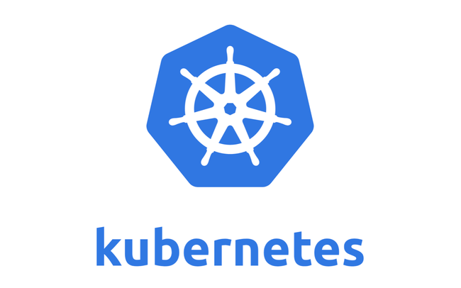


## **2. What Kubernetes can do?**
Kubernetes provides you with a framework to run distributed systems resiliently. It takes care of scaling and failover for your application, provides deployment patterns, and more. 
- Service discovery and load balancing Kubernetes can expose a container using the DNS name or using their own IP address. If traffic to a container is high, Kubernetes is able to load balance and distribute the network traffic so that the deployment is stable.

    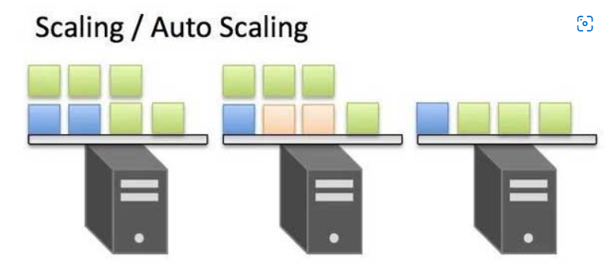

- Storage orchestration Kubernetes allows you to automatically mount a storage system of your choice, such as local storages, public cloud providers, and more.


- Automated rollouts and rollbacks You can describe the desired state for your deployed containers using Kubernetes, and it can change the actual state to the desired state at a controlled rate. For example, you can automate Kubernetes to create new containers for your deployment, remove existing containers and adopt all their resources to the new container.

- Automatic bin packing You provide Kubernetes with a cluster of nodes that it can use to run containerized tasks. You tell Kubernetes how much CPU and memory (RAM) each container needs. Kubernetes can fit containers onto your nodes to make the best use of your resources.

- Self-healing Kubernetes restarts containers that fail, replaces containers, kills containers that don't respond to your user-defined health check, and doesn't advertise them to clients until they are ready to serve.

    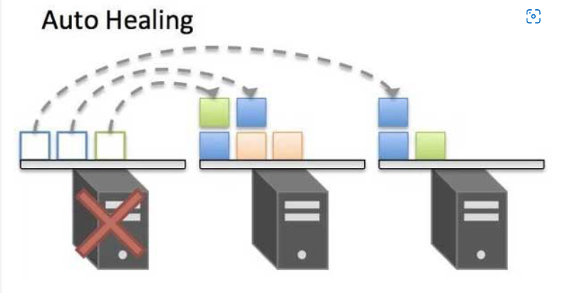

- Secret and configuration management Kubernetes lets you store and manage sensitive information, such as passwords, OAuth tokens, and SSH keys. You can deploy and update secrets and application configuration without rebuilding your container images, and without exposing secrets in your stack configuration.

    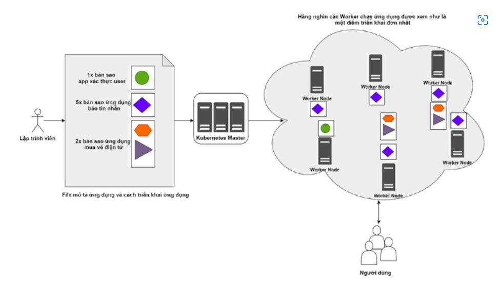

## **3. Kubernetes Components**
When you deploy Kubernetes, you get a cluster.
A Kubernetes cluster consists of a set of worker machines, called nodes, that run containerized applications. Every cluster has at least one worker node.
The worker node(s) host the Pods that are the components of the application workload. The control plane manages the worker nodes and the Pods in the cluster. In production environments, the control plane usually runs across multiple computers and a cluster usually runs multiple nodes, providing fault-tolerance and high availability.

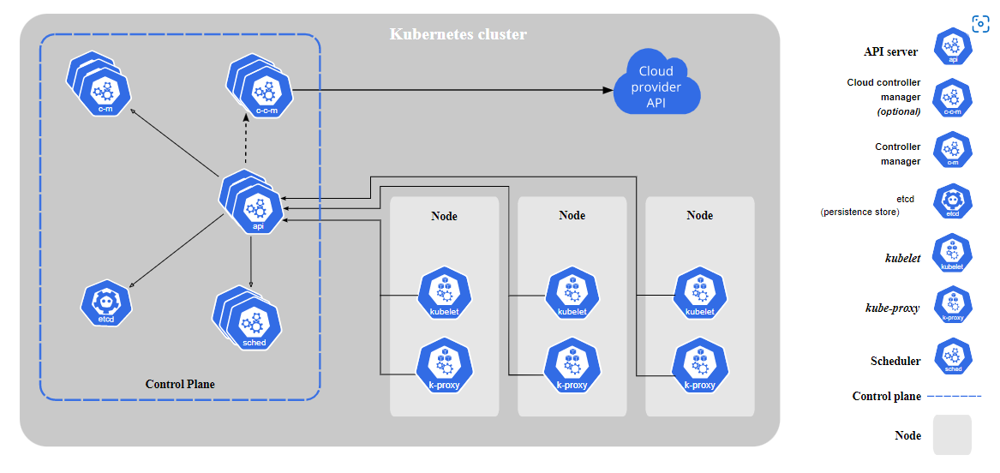

### 3.1 Control Plane Components
- kube-apiserver
    - The API server is a component of the Kubernetes control plane that exposes the Kubernetes API. The API server is the front end for the Kubernetes control plane.
    - The main implementation of a Kubernetes API server is kube-apiserver. kube-apiserver is designed to scale horizontally—that is, it scales by deploying more instances. You can run several instances of kube-apiserver and balance traffic between those instances.
- etcd
    - Consistent and highly-available key value store used as Kubernetes' backing store for all cluster data.
    - If your Kubernetes cluster uses etcd as its backing store, make sure you have a back up plan for those data.
- kube-scheduler
    - Control plane component that watches for newly created Pods with no assigned node, and selects a node for them to run on.
- kube-controller-manager
    - Control plane component that runs controller processes.
    - Logically, each controller is a separate process, but to reduce complexity, they are all compiled into a single binary and run in a single process.
    - Some types of these controllers are:
        - Node controller: Responsible for noticing and responding when nodes go down.
        - Job controller: Watches for Job objects that represent one-off tasks, then creates Pods to run those tasks to completion.
        - Endpoints controller: Populates the Endpoints object (that is, joins Services & Pods).
        - Service Account & Token controllers: Create default accounts and API access tokens for new namespaces.
- cloud-controller-manager: 
    - A Kubernetes control plane component that embeds cloud-specific control logic. The cloud controller manager lets you link your cluster into your cloud provider's API, and separates out the components that interact with that cloud platform from components that only interact with your cluster.
### 3.2 Node Components
- kubelet
    - An agent that runs on each node in the cluster. It makes sure that containers are running in a Pod.

    - The kubelet takes a set of PodSpecs that are provided through various mechanisms and ensures that the containers described in those PodSpecs are running and healthy. The kubelet doesn't manage containers which were not created by Kubernetes.
- kube-proxy
    - kube-proxy is a network proxy that runs on each node in your cluster, implementing part of the Kubernetes Service concept.

    - kube-proxy maintains network rules on nodes. These network rules allow network communication to your Pods from network sessions inside or outside of your cluster.

    - kube-proxy uses the operating system packet filtering layer if there is one and it's available. Otherwise, kube-proxy forwards the traffic itself.
- Container runtime:
    - The container runtime is the software that is responsible for running containers.

    - Kubernetes supports container runtimes such as containerd, CRI-O, and any other implementation of the Kubernetes CRI (Container Runtime Interface).
### 3.3 Addons
Addons use Kubernetes resources (DaemonSet, Deployment, etc) to implement cluster features. Because these are providing cluster-level features, namespaced resources for addons belong within the kube-system namespace.
- DNS 
- Web UI (Dashboard)
- Container Resource Monitoring
- Cluster-level Logging

### *Please refer to this doc for further details [K8s](https://kubernetes.io/docs/concepts/overview/what-is-kubernetes/)*

# **II. Autoscaling in Kubernetes**
## 1. Autoscaling

Autoscaling is one of the key features in Kubernetes cluster. It is a feature in which the cluster is capable of increasing the number of nodes as the demand for service response increases and decrease the number of nodes as the requirement decreases

## 2. Autoscaling Methods in K8s
### 2.1 Horizontal Pod Autoscaler (HPA): "Scaling out"

- When the level of application usage changes, you need a way to add or remove pod replicas. Once configured, the Horizontal Pod Autoscaler manages workload scaling automatically.

- HPA can be useful both for stateless applications and stateful workloads. HPA is managed by the Kubernetes controller manager, and runs as a control loop. The controller manager provides a flag that specifies the duration of the HPA loop, which is 15 seconds by default. The flag is: --horizontal-pod-autoscaler-sync-period

- After each loop period, the controller manager compares actual resource utilization to the metrics defined for each HPA. It obtains these from either the custom metrics API or, if you specify that auto scaling should be based on resources per pod (such as CPU utilization), from the resource metrics API.

- HPA makes use of metrics to determine auto scaling, as follows:

    - For resource metrics, you can either set a target utilization value or a fixed target. 
    - For custom metrics, only raw values are supported, and you cannot define a target utilization.
    - For object metrics and external metrics, scaling is based on a single metric obtained from the object, which is compared to the target value to produce a utilization ratio.

- Limitations:
    - Avoid using HPA alongside vertical pod autoscaling (VPA) on memory or CPU when evaluating CPU or memory metrics. Additionally, when using a Deployment, you cannot configure HPA on a ReplicaSet or Replication Controller, only on the Deployment itself.

  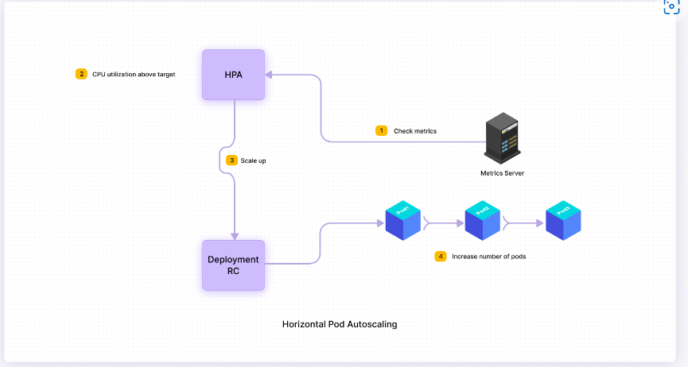

### 2.2 Vertical Pod Autoscaler (VPA): "Scaling up"
- The Vertical Pod Autoscaler uses live data to set limits on container resources. 

- Most containers adhere more closely to their initial requests rather than to upper limit requests. As a result, Kubernetes’ default scheduler overcommits a node’s memory and CPU reservations. To deal with this, the VPA increases and decreases the requests made by pod containers to ensure actual usage is in line with available memory and CPU resources.

- Some workloads can require short periods of high utilization. Increasing request limits by default would entail wasting unused resources, and would limit the nodes that can run those workloads. HPA may help with this in some cases, but in other cases, the application may not easily support distribution of load across multiple instances.

- A VPA deployment calculates target values by monitoring resource utilization, using its recommender component. Its updater component evicts pods that must be updated with new resource limits. Finally, the VPA admission controller overwrites the pod resource requests when they are created, using a mutating admission webhook.

- Limitations:
    - Updating running pods is still experimental in VPA, and performance in large clusters remains untested. VPA reacts to most out-of-memory events, but not all, and the behavior of multiple VPA resources that match the same pod remains undefined. Finally, VPA recreates pods when updating pod resources, possibly on a different node. As a result, all running containers restart.


  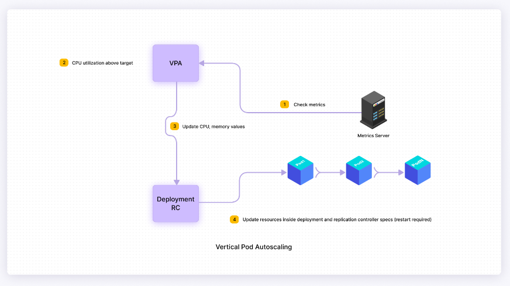

### 2.3 Cluster Autoscaler
- The cluster autoscaler changes the number of cluster nodes, while HPA scales the number of running cluster pods. Cluster autoscaler seeks unschedulable pods and tries to consolidate pods that are currently deployed on only a few nodes. It loops through these two tasks constantly.

- Unschedulable pods are a result of inadequate memory or CPU resources, or inability to match an existing node due to the pod’s taint tolerations (rules preventing a pod from scheduling on a specific node), affinity rules (rules encouraging a pod to schedule on a specific node), or nodeSelector labels. If a cluster contains unschedulable pods, the autoscaler checks managed node pools to see if adding a node may unblock the pod. If so, and the node pool can be enlarged, it adds a node to the pool.

- The autoscaler also scans a managed pool’s nodes for potential rescheduling of pods on other available cluster nodes. If it finds any, it evicts these and removes the node. When moving pods, the autoscaler takes pod priority and PodDisruptionBudgets into consideration.

- When scaling down, the cluster autoscaler allows a 10-minute graceful termination duration before forcing a node termination. This allows time for rescheduling the node’s pods to another node.
- Limitations:
    - Cluster autoscaler only supports certain managed Kubernetes platforms—if your platform is not supported, consider installing it yourself. Cluster autoscaler does not support local PersistentVolumes. You cannot scale up a size 0 node group for pods requiring ephemeral-storage when using local SSDs. 


   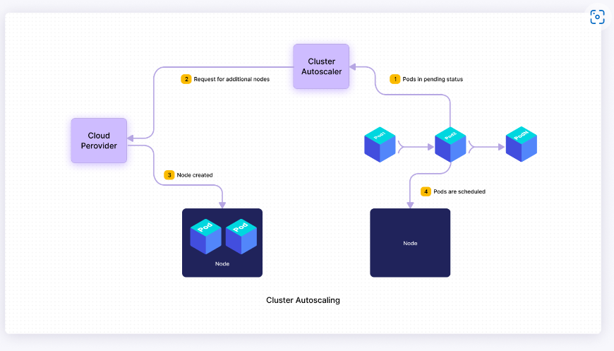
 
### *Please refer to this doc for further details [Autoscaling](https://www.densify.com/kubernetes-autoscaling)*
# **III. Demo**
## 1. Implement HPA.
 I practice on Ubuntu 20.04 VM installed `kubectl` & `minikube`

### Step 1: Check the Metrics Server

To enable metrics-service
```
minikube addons enable metrics-service
```

   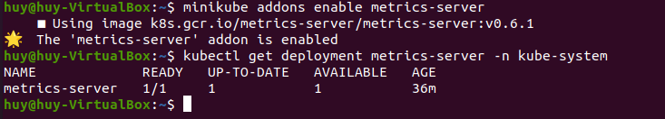

### Step 2: Deploy a sample application

* Create `deployment.yml`

```
apiVersion: apps/v1
kind: Deployment
metadata:
 name: hpa-demo-deployment
spec:
 selector:
   matchLabels:
     run: hpa-demo-deployment
 replicas: 1
 template:
   metadata:
     labels:
       run: hpa-demo-deployment
   spec:
     containers:
     - name: hpa-demo-deployment
       image: k8s.gcr.io/hpa-example
       ports:
       - containerPort: 80
       resources:
         limits:
           cpu: 500m
         requests:
           cpu: 200m
```
Apply it
```
kubectl apply -f deployment.yml
```
 
* Create the Kubernetes service

`service.yaml`
```
apiVersion: v1
kind: Service
metadata:
 name: hpa-demo-deployment
 labels:
   run: hpa-demo-deployment
spec:
 ports:
 - port: 80
 selector:
   run: hpa-demo-deployment
```
Apply it
```
kubectl apply -f service.yaml
```

* Install the Horizontal Pod Autoscaler

HPA configuration file `hpa.yaml`
```
apiVersion: autoscaling/v1
kind: HorizontalPodAutoscaler
metadata:
 name: hpa-demo-deployment
spec:
 scaleTargetRef:
   apiVersion: apps/v1
   kind: Deployment
   name: hpa-demo-deployment
 minReplicas: 1
 maxReplicas: 10
 targetCPUUtilizationPercentage: 50
 ```
 Apply it
 ```
 kubectl apply -f hpa.yaml
 ```
### Step 3: Increase the load
 We will start a container and send an infinite loop of queries to the ‘php-apache’ service, listening on port 8080. Open a new terminal and execute the below command:
```
kubectl run -i --tty load-generator --rm --image=busybox --restart=Never -- /bin/sh -c "while sleep 0.01; do wget -q -O- http://hpa-demo-deployment; done"
```
   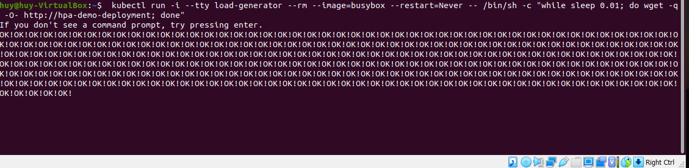

Before we increase the load, the HPA status will look like this:


   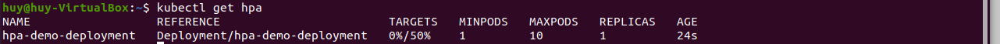

Once you triggered the load test, use the below command, which will show the status of the HPA every 30 seconds:

   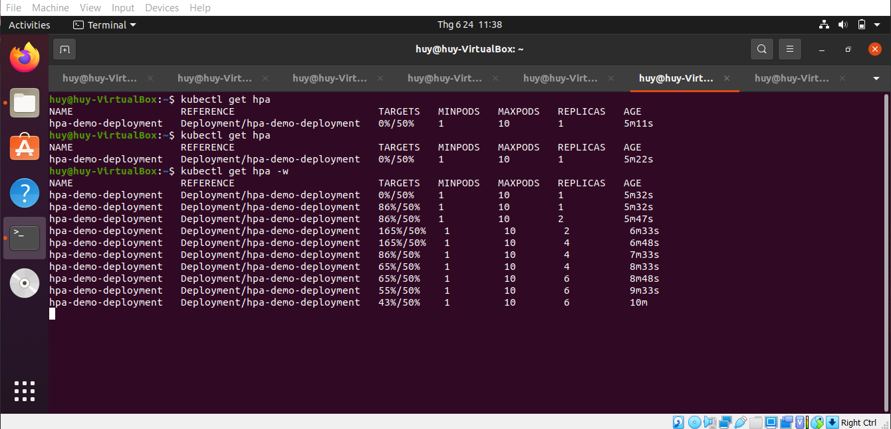

If you want to see what steps HPA is performing while scaling, use this command and check for the events section:

   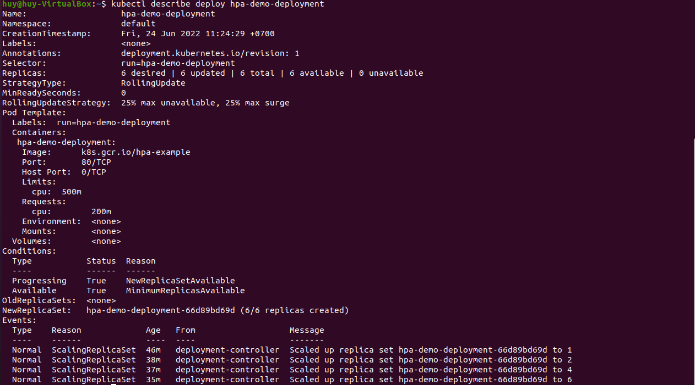

We can see that the pods were scaled up from 1 to 2, then to 4, and finally to 6.

### Step 4: Decrease the load.
Navigate to the terminal where you executed the load test and stop the load generation by entering + C.

## 2. Implement VPA.
### Step 1: Check the Metrics Server

To enable metrics-service
```
minikube addons enable metrics-service
```

   

### Step 2: Install Vertical Pod Autoscaler

- Open Autoscaler GitHub [page](https://github.com/kubernetes/autoscaler/tree/master/vertical-pod-autoscaler)

- Clone VPA repo

```
git clone https://github.com/kubernetes/autoscaler.git

```
- Change directory
```
cd autoscaler/vertical-pod-autoscaler
```
- Install VPA
```
./hack/vpa-up.sh

```
- Tear down VPA
```
./hack/vpa-down.sh
```

### Step 3: Demo
* Create deployment files under vpa-demo directory

- Create file `deployment.yaml`
```
---
apiVersion: apps/v1
kind: Deployment
metadata:
  name: hamster
  namespace: default
spec:
  selector:
    matchLabels:
      app: hamster
  replicas: 1
  template:
    metadata:
      labels:
        app: hamster
    spec:
      containers:
        - name: hamster
          image: k8s.gcr.io/ubuntu-slim:0.1
          resources:
            requests:
              cpu: 180m
              memory: 50Mi
            limits:
              cpu: 600m
              memory: 100Mi
          command: ["/bin/sh"]
          args:
            - "-c"
            - "while true; do timeout 0.2s yes >/dev/null; sleep 0.5s; done"
```
- Create file `vpa.yaml`
```
---
apiVersion: autoscaling.k8s.io/v1
kind: VerticalPodAutoscaler
metadata:
  name: hamster-vpa
  namespace: default
spec:
  targetRef:
    apiVersion: apps/v1
    kind: Deployment
    name: hamster
  updatePolicy:
    updateMode: "Off"
  resourcePolicy:
    containerPolicies:
      - containerName: '*'
        controlledResources: ["cpu", "memory"]
```

- Open two tabs
```
watch -n 1 -t kubectl top pods
```
- Deploy sample app
```
kubectl apply -f vpa-demo
```
- Let's run 5-10 min and in a new tab get VPA
```
kubectl get vpa
```
- Describe VPA
```
kubectl describe vpa hamster-vpa
```
- Update deployment and reapply
```
kubectl apply -f demo/deployment.yaml
```
   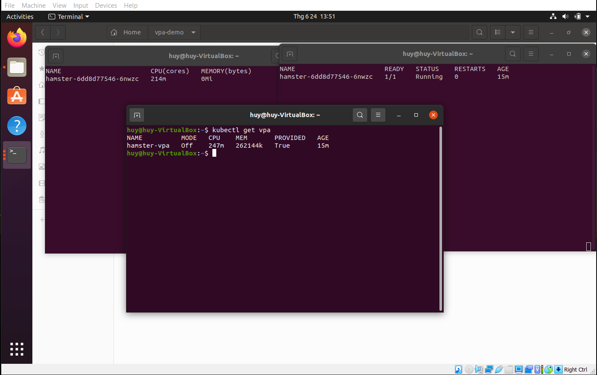

# IV. References

[1] [Kubernetes](https://kubernetes.io/docs/concepts/overview/what-is-kubernetes/)

[2] [Autoscaling](https://www.densify.com/kubernetes-autoscaling)

[3] [Install Minikube](https://kubernetes.io/vi/docs/tasks/tools/install-minikube/)

[4] [Install Kubectl](https://kubernetes.io/docs/tasks/tools/#install-kubectl-on-linux)

[5] [Kubernetes Autoscaling](https://www.kubecost.com/kubernetes-autoscaling)

[6] [Github K8s Autoscaler](https://github.com/kubernetes/autoscaler/tree/master/vertical-pod-autoscaler)