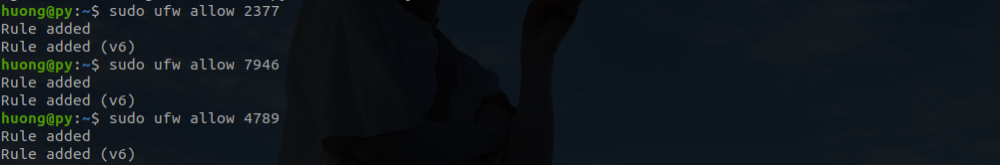
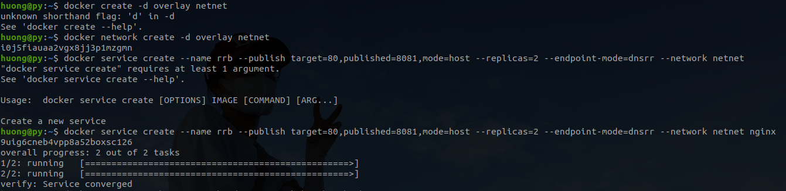

# DOCKER NETWORK 

## Content 

  - [I. What are docker network modes?]()
  - [II. How does docker-compose provide networking for its services ]()
  - [III. How does docker swarm do multi-host networking]()
  - [References]()

---

## I. What are docker network modes?

In order to connect containers, we have to configure the docker network. There are four docker network modes: 

1. Bridge mode
2. Host mode
3. None mode
4. Container mode

### 1. Bridge mode

Below is an example of bridge network mode.

```
huong@py:~$ docker network ls
NETWORK ID     NAME                                                DRIVER    SCOPE
07d4bc0d9391   bridge                                              bridge    local
9de1de6483bc   cf-example-manage-mongodb_default                   bridge    local
3d4c34f26618   composetest_default                                 bridge    local
65373d504780   docker-compose-prometheus-and-grafana_monitor-net   bridge    local

```
 
- Bridge mode is the default network mode of docker. If you do not write the – net parameter, it is the bridge mode. When docker run – P is used, docker actually makes DNAT rules in iptables to realize port forwarding function..
- When the docker process starts, by default, a virtual bridge named docker0 will be created on the host, and the docker container started on this host will be connected to the virtual bridge. The virtual bridge works like a physical switch, so that all containers on the host are connected to a layer-2 network through the switch.
- The Docker bridge driver automatically installs rules in the host machine so that containers on different bridge networks cannot communicate directly with each other.
- The docker then assigns an IP address from the docker 0 subnet to the container, and set the docker 0 IP address as the default gateway of the container. Create a pair of virtual network card Veth pair devices on the host. Docker puts one end of the Veth pair device in the newly created container and names it eth0 (network card of the container). The other end is placed in the host and named after vethxxx. The network device is added to the docker 0 bridge. It can be viewed through the brctl show command.
<div align="center">
  
</div>

I have just build an ubuntu image, then create a container in bridge networking mode. 


- User-defined bridge networks are superior to the default bridge network.

|                                      | _Default bridge network_                                                                                                                                                                                                                                               | _User – defined network_                                                                                                                   |
|--------------------------------------|------------------------------------------------------------------------------------------------------------------------------------------------------------------------------------------------------------------------------------------------------------------------|--------------------------------------------------------------------------------------------------------------------------------------------|
| _DNS_                                | Containers get access to each other only by IP addresses if not use the --link option.                                                                                                                                                                                 | Containers can get access to each other by name or alias because User–defined network provide automatic DNS resolution between containers. |
| _Isolation_                          | It’s obligatory to create links between the containers (using the legacy --link flag) if there are same running application stacks on the default bridge network. Otherwise, unrelated stacks/services/containers are then able to communicate your defined container. | User-defined network provides a scoped network in which only containers attached to that network are able to communicate.                  |
| _Attaching and detaching container_ | Stop the container and recreate it with different network options.                                                                                                                                                                                                     | You only need to use connect and disconnect command.                                                                                       |                                                                                      |


To configure the default bridge network, you specify options in daemon.json. Here is an example daemon.json with several options specified. Only specify the settings you need to customize. Then restart docker. 

```
{
  "bip": "192.168.1.31/24",
  "fixed-cidr": "192.168.1.0/24",
  "mtu": 1500,
  "default-gateway": "192.168.1.254",
  "dns": ["10.20.1.2","10.20.1.3"]
}
```
### 2. Host mode

```
huong@py:~$ docker network ls
NETWORK ID     NAME                                                DRIVER    SCOPE
ce05b1b269f3   host                                                host      local
```

- If the container is started in host mode, the container will not get a separate network namespace, but share a network namespace with the host. The container will not virtual out its own network card, configure its own IP, etc., but use the host’s IP and port. However, other aspects of the container, such as the file system, process list, and so on, are isolated from the host. When using host mode networking, port-mapping does not take effect.
- The container using the host mode can use the host’s IP address to communicate with the outside world, and the service port inside the container can also use the host’s port without NAT. The biggest advantage of host is that the network performance is better, but the ports already used on docker host can’t be used again, and the network isolation is not good.

<div align="center">
  
</div>

> **_NOTE:_** <em>The host networking driver only works on Linux hosts, and is not supported on Docker Desktop for Mac, Docker Desktop for Windows, or Docker EE for Windows Server.</em>

### 3. None mode

```
huong@py:~$ docker network ls
NETWORK ID     NAME                                                DRIVER    SCOPE
d2e1ce5085e8   none                                                null      local
```
- Using the none mode, the docker container has its own network namespace. However, there is no network configuration for the docker container. In other words, the docker container does not have network card, IP, routing and other information. We need to add network card and configure IP for docker container.
- In this network mode, the container only has a lo loopback network and no other network card. The none mode can be specified by – network = none when the container is created. This type of network has no way to network, closed network can ensure the security of the container.
- none mode is not available for swarm services.

<div align="center">
  
</div>

### 4. Container mode

- This pattern specifies that the newly created container shares a network namespace with an existing container, rather than with the host. The newly created container will not create its own network card and configure its own IP. Instead, it will share IP and port range with a specified container. Similarly, the two containers are isolated from each other, such as file system, process list, and so on. The processes of the two containers can communicate through the lo network card device.

<div align="center">
  
</div>

To consolidate the 4 modes, see the following table: 

| _Docker network mode_ | _How to configure_           | _Explain_                                                                                                                                                                         | _When using_                                                                                                                                                                                                                                                                                   |
|-----------------------|------------------------------|-----------------------------------------------------------------------------------------------------------------------------------------------------------------------------------|------------------------------------------------------------------------------------------------------------------------------------------------------------------------------------------------------------------------------------------------------------------------------------------------|
| **Bridge mode**       | --net = bridge               | (default to this mode)                                                                                                                                                            | when you need multiple containers to communicate on the same Docker host.                                                                                                                                                                                                                      |
| **Host mode**         | --net = host                 | The container and the host share the network namespace.                                                                                                                           | when the network stack should not be isolated from the Docker host, but you want other aspects of the container to be isolated.                                                                                                                                                                |
| **None mode**         | --net= none                  | The container has an independent network namespace, but it does not have any network settings for it, such as assigning the Veth pair and bridge connection, configuring IP, etc. | - Run batch jobs<br>- Testing containers<br>- Preparing a container for network connection<br>- Containers that do not need external network                                                                                                                                                   |
| **Container mode**    | --net = container:name or ID | The container shares the network namespace with another container.                                                                                                                | - Perform diagnostics on a running container and the container is missing the necessary diagnostic tools (e.g., curl or dig). <br>- A temporary container with the necessary diagnostics tools may be created and attached to the first container’s network.<br>- Emulate pod-style networking |

I have found in some document that "<em> there are 2 other modes: overlay and underlay </em>", but I think, they are only two types of network used in User-defined network mode. We will shed light on these later.

## II. How does docker-compose provide networking for its services

### 1. Create default docker-compode network 
- By default Compose create a single network for your app. All your containers for all services connect to the default network and can access other containers on this network, as well as are discoverable by them at a hostname identical to the container name. 
- Your app’s network by default is given a name based on the “project name”, which is based on the name of the directory it lives in. The project name can be overrided with either the --project-name flag or the COMPOSE_PROJECT_NAME environment variable.
 
<div align="center">
  
</div>  

In previous example, I run a compose file in folder Building_web and I do not write any code lines to define a new network, so the network will be created by default with the name: building_web_default, the driver is <em> Bridge</em>, as well.
Any container that gets connected to this network will get an IP in the range from 172.30.0.2 to 172.30.255.254. 

Compose also allows defining your own network definition. This would include options for the subnet mask, IPv6 addresses, among other things. The way it is done is that we have top-level networks just like services or versions are top-level keys. For instance:

```
# services declarations...

networks:
  my-network:
    driver: bridge
```
### 2. Update docker-compose network

If you change configuration to a service and run docker-compose up to update it, the old container is removed and the new one joins the network under a different IP address but the same name. Running containers can look up that name and connect to the new address, but the old address stops working.If you make a configuration change to a service and run docker-compose up to update it, the old container is removed and the new one joins the network under a different IP address but the same name. Running containers can look up that name and connect to the new address, but the old address stops working.

If any containers have connections open to the old container, they are closed. It is a container’s responsibility to detect this condition, look up the name again and reconnect.

## III.How does docker swarm do multihost networking?

### 1. Overlay network

Overlays use networking tunnels to deliver communication across hosts. This allows containers to behave as if they are on the same machine by tunneling network subnets from one host to the next; in essence, spanning one network across multiple hosts. Many tunneling technologies exist, such as virtual extensible local area network (VXLAN).

Overlay networks could be private ones, or even public infrastructure on Cloud. The essential point is, if there are two hosts, each running Docker, then the Overlay network helps create a subnet which is overlaid on top of these two hosts and each Docker container connected to this overlay network can communicate with every other container using their own block of IP address, subnet and default gateway. As though they are part of the same network.


<div align="center">
  
</div> 

The figure above illustrates an example about overlay network that I imagined. The two host are running docker, with containers attached to overlay network. The overlay network is “overlaid” and containers will get IP address like 172.18.0.2, 172.18.0.3, etc on this network. Regardless of the host running them or the host's own network configuration.

When you initialize a swarm or join a Docker host to an existing swarm, two new networks are created on that Docker host:

  - an overlay network called ingress, which handles the control and data traffic related to swarm services. When you create a swarm service and do not connect it to a user-defined overlay network, it connects to the ingress network by default.
  - a bridge network called docker_gwbridge, which connects the individual Docker daemon to the other daemons participating in the swarm.


### 2. What is Docker Swarm?

<div align="center">
  
</div>   


Docker Swarm is the docker native clustering solution that turns a pool of Docker hosts into a single virtual server allowing clustering with the built-in Swarm orchestration.The Docker Swarm follows a decentralised design where nodes can handle any role in the cluster. The node specialisations to managers and workers are chosen at runtime. As the cluster must have at least one manager, the first node initializing the cluster is assigned as such. 
> **_NOTE:_** <em>Docker Engine Swarm mode and Docker Swarm are two different projects, with different installation steps despite they both work in a similar way.</em>
Swarm architecture:
<div align="center">
  
</div> 


      ◦ Swarm: is a cluster of one or more Docker Engines running (specifically, nodes) in Swarm mode, instead of having to run containers with commands, we will set up services to allocate replicas to nodes.
      ◦ A node is a physical or virtual machine running a Docker Engine instance in Swarm mode. Node will include two types: Manager Node and Worker Node.
      ◦ Manager node: perform the orchestration and cluster management functions required to maintain the desired state of the swarm. Manager nodes elect a single leader to conduct orchestration tasks.Manager node is also treated as the Worker node.
      ◦ Worker nodes: receive and execute tasks dispatched from manager nodes. By default, manager nodes are also worker nodes, but you can configure managers to be manager-only nodes.
      ◦ Service: specifies the image of the container and the desired number of replicas to launch in the swarm.
      ◦ Task: a task that the worker node has to perform. This task will be down-allocated by node Manager. A task carries a Docker Container and commands to run inside the container.

Subsequent nodes joining the cluster are usually added as workers but can be assigned as either. The flexibility means that the entire swarm can be built from a single disk image with little differentiation.

The following port must be opened while working on docker swarm mode:\
      ◦ 2377 (TCP) - Cluster management\
      ◦ 7946 (TCP and UDP) - Nodes communication\
      ◦ 4789 (TCP and UDP) - Overlay network traffic\
Docker swarm seems to be the same as Kuberetes because both platforms allow you to manage containers and scale application deployment, but kubernetes is much more comlplex. In Swarm, a service provides both scheduling and networking facilities, creating containers and providing tools for routing traffic to them. In Kubernetes, scheduling and networking are handled separately: deployments (or other controllers) handle the scheduling of containers as pods, while services are responsible only for adding networking features to those pods.
 
 Docker-compose is single-node swarm.

 The swarm nodes enforce TLS authentication and encryption to secure communication between nodes. All of this is done by default and requires no additional attention. It is also possible to use self-signed root certificates, but for most cases, it is fine to go with the default implementation. 

<div align="center">
  
</div> 

Using TLS authentication to secure communication between nodes is an efficient security solution on doing networking. 

To understand how to create a cluster, I use 2 laptop running docker engine, with IP address: 192.168.1.31 and 192.168.146, respectively.

  

My laptop which has IP address: 192.168.1.31 will work as manager node. Before adding a new worker node to this cluster, I open essential ports in all laptops that I mentioned.

  

  

To join the newly-created cluster, use the token after docker swarm init, as figure below:

<div align="center">
  
</div> 

Now, you can check whether you added the worker node successfully or not by using command: <em>docker node ls</em>

<div align="center">
  
</div> 

Afterwards, I created a service to test the docker swarm mode, using command: 
```
docker service create --name final_demo alpine ping docker.com
```
      ◦ docker service create: creates the service.
      ◦ --name flag: names the service
      ◦ alpine ping docker.com: define the service as an Alpine Linux container that executes the command ping docker.com.
 

<div align="center">
  
</div>

Use can see the network list created. The ingress_network and gw_bridge are automatically created as mentioned. Let's examine the ingress network to see its specifications: 
<div align="center">
  
</div>

In the above output, notice that the driver is overlay and that the scope is swarm, rather than local, host, or global scopes you might see in other types of Docker networks. This scope indicates that only hosts which are participating in the swarm can access this network. We will talk about ingress network in later part. 

Then I tried on create another container in worker node and ping to the container in manager node, but unfortunatelty, I remove the overlay network before capture the screen :pig_nose: . So, I create a new overlay network named my_demo with container <em>ahii</em> in manager node and <em>ahuu</em> in worker node. 


  


From ahii ping to ahuu to check network connection: 


  


### 3. Networking in the Swarm

The reason why I delination Overlay network in former part is that docker swarm uses overlay network to do multi-host networking.

The swarm manages multi-host networking which supports overlay network services. The cluster manager automatically assigns virtual IP addresses to the containers that join the overlay. The swarm runs an embedded DNS server, which makes it possible for the swarm to also assign each container a unique DNS name that is resolvable from any container within the overlay network. This greatly simplifies service discovery and allows load balancing from the get-go.

<div align="center">
  
</div> 


I reuse the cluster, overlay network created in part 2, but create new service. I created an nginx service to connect to <em>my_demo</em> network. Nginx service published port 8080 to external network and mapped the port 80 in nginx container. 

```
docker service create \\
--name demo
--publish target=80,published=8080 \\
--replicas=2\\
--network my_demo\\
```
The figure below indicates the newly created services are running in each node of cluster: manager node and worker node. 
<div align="center">
  
</div>

Now, let do some tasks to understand more about the network. Change the index.html file, for example. 

```
# docker exec -it my-nginx.1.opdskafvlrclhc38t0tcw5uup /bin/bash
echo "..." > /usr/share/nginx/html/index.html
# docker exec -it my-nginx.2.6gtue1osr897u5i8fafdtoc3u /bin/bash
echo '..." > /usr/share/nginx/html/index.html
```
Then, curl to 192.168.1.31:8080 to see the result. Though I access to only one IP, I received different result in each access.
The reponse from nginx server is the result from <em>demo1</em> and <em>demo2</em>, respectively. Even if you access any servers with port 8080 (even if the nginx service is not running on that server), you will receive a response from the nginx service.(figure below)

<div align="center">
  
</div>


The following two network concepts is also important to swarm services:

- ingress network is a special overlay network that facilitates load balancing among a service’s nodes. When any swarm node receives a request on a published port, it hands that request off to a module called IPVS. IPVS keeps track of all the IP addresses participating in that service, selects one of them, and routes the request to it, over the ingress network. The ingress network is created automatically when you initialize or join a swarm. Most users do not need to customize its configuration, but Docker allows you to do so.

- docker_gwbridge is a bridge network that connects the overlay networks (including the ingress network) to an individual Docker daemon’s physical network. By default, each container a service is running is connected to its local Docker daemon host’s docker_gwbridge network. The docker_gwbridge network is created automatically when you initialize or join a swarm. Most users do not need to customize its configuration, but Docker allows you to do so.


#### 1. Ingress network

Let's check the docker inspect demo container in manager host:

```
        "NetworkSettings": {
            "Bridge": "",
            "SandboxID": "1bab7757e4edfc3f48d25f5a186cf61e9870c9dd34796303a6d8b45391dab47d",
            "HairpinMode": false,
            "LinkLocalIPv6Address": "",
            "LinkLocalIPv6PrefixLen": 0,
            "Ports": {
                "80/tcp": null
            },
            "SandboxKey": "/var/run/docker/netns/1bab7757e4ed",
            "SecondaryIPAddresses": null,
            "SecondaryIPv6Addresses": null,
            "EndpointID": "",
            "Gateway": "",
            "GlobalIPv6Address": "",
            "GlobalIPv6PrefixLen": 0,
            "IPAddress": "",
            "IPPrefixLen": 0,
            "IPv6Gateway": "",
            "MacAddress": "",
            "Networks": {
                "ingress": {
                    "IPAMConfig": {
                        "IPv4Address": "10.0.0.201"
                    },
                    "Links": null,
                    "Aliases": [
                        "779ad592fe13"
                    ],
                    "NetworkID": "u0n0b7shbo3yhwxegkimnwkf9",
                    "EndpointID": "d1a40c748a21edfd9c862f95b53bc869a021234bebf58d3e9c079a1f82bbeed2",
                    "Gateway": "",
                    "IPAddress": "10.0.0.201",
                    "IPPrefixLen": 24,
                    "IPv6Gateway": "",
                    "GlobalIPv6Address": "",
                    "GlobalIPv6PrefixLen": 0,
                    "MacAddress": "02:42:0a:00:00:c9",
                    "DriverOpts": null
                },

```
The demo1 is attached to ingress network because we published port to nginx service and it has IP address: 10.0.0.201.

Let's check the <em>docker networkk inspect ingress</em>:

```
        "Containers": {
            "779ad592fe13a52ad918f1fa772152e613fd247f4c9d8a25ee45b256ca161f5c": {
                "Name": "demo.1.2e4ru8y4cu0bl47cxj7iylusb",
                "EndpointID": "d1a40c748a21edfd9c862f95b53bc869a021234bebf58d3e9c079a1f82bbeed2",
                "MacAddress": "02:42:0a:00:00:c9",
                "IPv4Address": "10.0.0.201/24",
                "IPv6Address": ""
            },
            "ingress-sbox": {
                "Name": "ingress-endpoint",
                "EndpointID": "187aa3f24b69b56da68bb741b76d6016b4b1d8594408032eaec53010e7817dc4",
                "MacAddress": "02:42:0a:00:00:02",
                "IPv4Address": "10.0.0.2/24",
                "IPv6Address": ""
            }
```
You can see that, there is a new container that is also attached to the ingress network. This is a hidden container created by default (checked on all servers see this container even though docker ps can't see them). It i created with network namespace and configs, purely for service discovery and load balancing.

Ingress-sbox acts as an intermediary between the host machine and the ingress network, requests from this container will be further forwarded to the VIP address (10.0.0.198) on the ingress network (Docker Swarm uses IPVS for load balancing.).

The VIP address will be generated corresponding to a deployment service that has an outbound port, meaning that each deployment service will have a corresponding VIP address for IPVS to load balance the replica containers in that service (demo service).

Using  <em>nsenter</em> to switch the namespace out of the host machine, and we can exce inside to check ingress-sbox(it's hidden so we cannot exec as usual).


<div align="center">
  
</div>

You can see in figure above, line 12, packets, whose destination IP is 10.0.0.198 with 0x1e0 (480 in decimal) will be marked. These marked packets will be forward to 10.0.0.201 (manager node's IP) and 10.0.0.202(worker node's IP) to perform load balance. 


<div align="center">
  
</div>

Futhermore, look iptable again , in line 6 from the bottom, you will se the line:

```
-A POSTROUTING -d 10.0.0.0/24 -m ipvs -j SNAT --to -source 10.0.0.2
```
NAT is established here. All packets sent out successfully will receive external reponses. However, these reponses will be tranferred to ingress-sbox(10.0.0.2) before being forwarded to internal client.

To sum up: 

<div align="center">
  
</div>


- docker_gwbridge is the default auto-generated network on each node, this network plays a role as docker0 (bridge network): help host communicate with containers, 
- we access the address of host with port 8080, the access request will be NATed to the IP address 172.18.0.2:8080. 
- Because there is a docker_gwbridge network, requests from users can go into the hidden container as ingress-sbox and then reach the target service in the Docker Swarm cluster through the ingress network.

#### 2. Internal overlay network

- Internal overlay network is the same to ingress network (applying routing mesh using IPVS to balance load to replica containers), but it is private network, so only internall service can connect to each other.

#### 3. DNS round robin 

Docker Swarm also supports DNS Round Robin (DNSRR) mode by configuring -endpoint-mode=dnsrr.

Delpoy another service using DNSRR mode: 

<div align="center">
  
</div>

The result is the same as to VIP mode:

<div align="center">
  
</div>

You can check the IP resolved: 
```
➜  nslookup rrb
Server:         127.0.0.11
Address:        127.0.0.11#53
Non-authoritative answer:
Name:   rrb
Address: 10.0.3.3
Name:   user-api
Address: 10.0.3.2
```

Load Balancing for DNSRR mode does not forwards packets, it returns a list of IP addresses of the destination container. 
DNSRR mode only returns a list of IPs, connecting and exchanging packets will take place directly with the destination container without having to go through the LB.


## References

- [Docker Swarm](https://docs.docker.com/engine/swarm/swarm-tutorial/)
- [Handson Docker Swarm](https://docs.docker.com/get-started/swarm-deploy/#prerequisites)
- [Overlay network](https://docs.docker.com/network/network-tutorial-overlay/)
- [Docker compose networking](https://docs.docker.com/compose/networking/)

