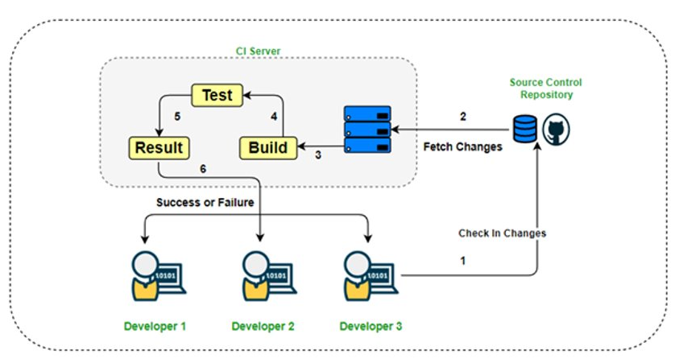
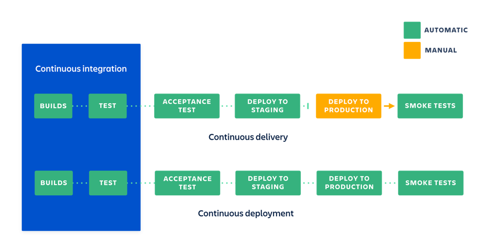
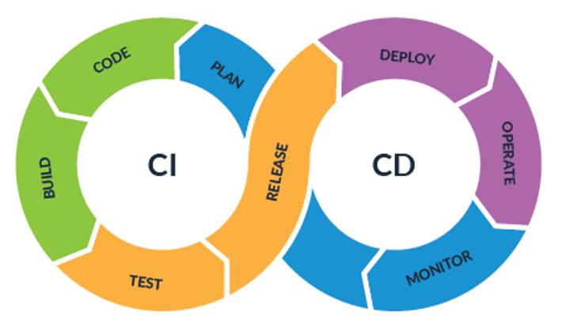
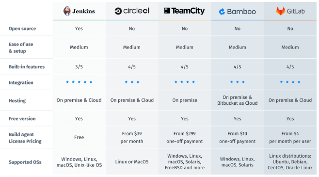
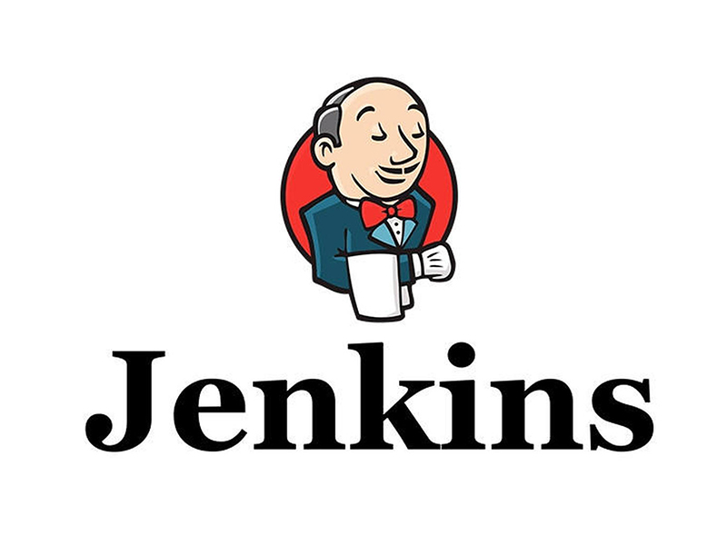
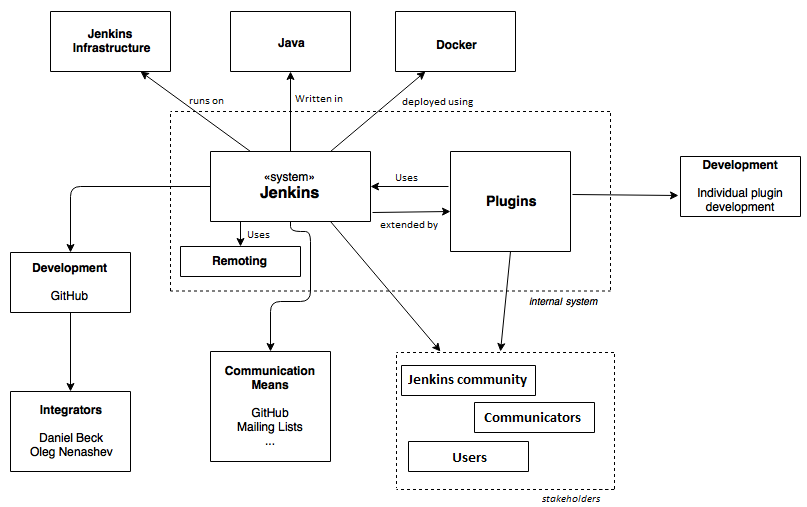

# **Viettel-Digital-Talent-2022: Final Assignment - Phase 1**

## **Topic 1: CI/CD - Jenkins**

- *Phân tích thiết kế, cách thức hoạt động và các ưu nhược điểm của giải pháp CI/CD mã nguồn mở Jenkins*

## **Mục Lục**

- [**Viettel-Digital-Talent-2022: Final Assignment - Phase 1**](#viettel-digital-talent-2022-final-assignment---phase-1)
  - [**Topic 1: CI/CD - Jenkins**](#topic-1-cicd---jenkins)
  - [**Mục Lục**](#mục-lục)
  - [**I. Tìm hiểu về CI/CD**](#i-tìm-hiểu-về-cicd)
    - [**1. CI là gì?**](#1-ci-là-gì)
    - [**2. CD là gì?**](#2-cd-là-gì)
    - [**3. Vậy CI/CD là gì?**](#3-vậy-cicd-là-gì)
  - [**II. Jenkins**](#ii-jenkins)
    - [**1. Jenkins là gì?**](#1-jenkins-là-gì)
    - [**2. Thiết kế Jenkins**](#2-thiết-kế-jenkins)
      - [**a. Context View**](#a-context-view)
      - [**b. Functional View**](#b-functional-view)
      - [**c. Development View**](#c-development-view)
    - [**3. Các thức hoạt động**](#3-các-thức-hoạt-động)
    - [**4. Ưu nhược điểm**](#4-ưu-nhược-điểm)

## **I. Tìm hiểu về CI/CD**

### **1. CI là gì?**

- Theo `Martin Fowler`:

  ```text
  Continuous Integration (CI) is a software development practice where members of a team integrate their work frequently, usually each person integrates at least daily - leading to multiple integrations per day. Each integration is verified by an automated build (including test) to detect integration errors as quickly as possible. Many teams find that this approach leads to significantly reduced integration problems and allows a team to develop cohesive software more rapidly
  ```

- <`Continuous Integration`> hay còn gọi là *Tích hợp liên tục* là một phương pháp phát triển phần mềm đòi hỏi các thành viên trong nhóm phải tích hợp công việc với nhau một cách thường xuyên. Từ đó có thể tăng tốc việc cho ra đời những tính năng mới, cập nhật và sửa lỗi cho phần mềm.

  <!--    -->
  <center>
    
  </center>

### **2. CD là gì?**

- Theo <https://continuousdelivery.com/>:

  ```text
  Continuous Delivery is the ability to get changes of all types—including new features configuration changes, bug fixes and experiments—into production, or into the hands of users, safely and quickly in a sustainable way.
  ```

- <`Continuous Delivery`> hay còn gọi là *Chuyển giao liên tục* là giai đoạn triển khai những thay đổi về code đã được phát triển và kiểm thử vào môi trường Testing hoặc Staging.

- *Chuyển giao liên tục* giúp các nhà phát triển phần mềm tự động hóa quá trình testing, kiểm tra phần mềm qua nhiều thước đo như Unit test, UI test, Load Test, API test,...

  <!--  -->
  
  <center>
    
  </center>

### **3. Vậy CI/CD là gì?**

- Dựa trên các định nghĩa về *CI* và *CD*, ta có thể hiểu *CI/CD* là quá trình làm việc liên tục và tự động hóa của phần mềm.
  
  <center>
    
  </center>

- Trong những năm trở lại đây, *CI/CD* đã trở thành thông lệ trong quá trình phát triển phần mềm, là chìa khóa kết hợp các khâu kiểm thử và phát triển phần mềm lại với nhau. Ngoài ra, *CI/CD* cũng trở thành thông lệ tốt nhất trong ngành công nghệ thông tin để giữ cho ứng dụng có thể được triển khai bất cứ lúc nào cũng như đẩy mã triển khai đó vào kho sản xuất khi có mã mới.

- Điều này dẫn tới nhu cầu về các công cụ *CI/CD* thích hợp. Hiện nay trên thị trường có một số những đại diện tiêu biểu cho *CI/CD Tools* có thể kể đến như:

  <center>
    
  </center>

- Trong số những đại diện trên, tiêu biểu nhất và có lẽ cũng chiếm thị phần nhiều nhất là `Jenkins` - một giải pháp CI/CD open source với rất nhiều những tính năng mạnh mẽ và một cộng đồng phát triển lớn.

## **II. Jenkins**

  <center>
    
  </center>

### **1. Jenkins là gì?**

  ```text
  Jenkins® is an open source automation server. With Jenkins, organizations can accelerate the software development process by automating it. Jenkins manages and controls software delivery processes throughout the entire lifecycle, including build, document, test, package, stage, deployment, static code analysis and much more.
  
  - jenkins.io -
  ```

- `Jenkins` là một công cụ tích hợp liên tục, với hàng trăm Plugin được cung cấp hỗ trợ tự động hóa các tác vụ như xây dựng, thử nghiệm, phân phối và triển khai các dự án của người dùng.

- `Jenkins` được viết bằng ngôn ngữ Java với các gói dành cho Windown, Mac OS X và các hệ điều hành dựa trên Unix khác. Nó hoạt động cùng với Docker (Container-virtualisation software) và JRE (Java Runtime Environment). Cả 2 thứ trên đều cần phải được cài đặt trước khi cài đặt và triển khai Jenkins.

- `Jenkins` thực hiện thông qua các files đặc biệt (Jenkinsfile) hoặc giao diện Blue Cloud (Trong gói Plugin cơ bản).

- Kiến trúc Plugin cho phép *có thể* tích hợp vô hạn các chức năng cho Jenkins. Ngoài ra, Jenkins có thể chạy trên một PC hoặc một hệ thống phân tán, để phân tán tải tính toán, cải thiện tốc độ xử lý.

- `Jenkins` là một dự án mã nguồn mở, mặc dù nó có nhóm phát triển chính thực hiện hầu hết các công việc lập trình, nhưng mọi người đều có thể tham gia đóng góp và tạo các pull request cho dự án. Không chỉ code, mọi người còn có thể tham gia dịch, viết tài liệu và kiểm tra code cho dự án.

### **2. Thiết kế Jenkins**

#### **a. Context View**

- *Context Diagram* :

  <center>
    
  </center>

- `Jenkins` (Jenkins Core) hoạt động cần phải tương tác với nhiều thực thể, đó là các hệ thống bên trong và bên ngoài (Internal/External System).

- ***Internal System :***
  
  - Đối với hệ thống bên trong, thực thể quan trọng nhất mà *Jenkins Core* cần tương tác đó là *Plugins*. Gần như tất cả các tác vụ chính của Jenkins đều liên quan đến ít nhất một số Plugin cơ bản.
  
  - Sự tương tác giữa *Core* và *Plugins* diễn ra thường xuyên trong khi hệ thống hoạt động và tất cả đều được quản lý tự động bằng code (Thể hiện tính minh bạch đối với người dùng/ người quản trị).
  
  - Các *Plugins* hoạt động giống như các dịch vụ mở rộng vì chúng cần *Core* cho các chức năng của mình và ngược lại, các plugins cũng mở rộng khả năng cũng như tính năng của *Core*, đem lại khả năng tùy biến cao cho Jenkins.

  - Một thực thể bên trong khác là *Jenkins Remoting* - là một thư viện và kho lưu trữ Java (Java Archive) có thể thực thi. Thực hiện thực thi lớp giao tiếp (Communication Layer) trong Jenkins.

  - *Remoting* là một thực thể quan trọng cần thiết cho các hoạt động của *Core* vì nó cung cấp tất cả các thủ tục và giao thức cho phép giao tiếp giữa tất cả các thành phần của hệ thống thông qua một mạng. *Core* và *Remoting* tương tác thường xuyên và tất cả đều minh bạch với người dùng/người quản trị.

- ***External System :***

  - *[Jenkins Infrastructure]*: Vì Jenkins là một dự án mã nguồn mở và độc lập, nên nó cần có một cơ sở hạ tầng được duy trì cùng với dự án. Cơ sở hạ tầng được coi là hệ thống bên ngoài bởi vì nó không trực tiếp là một phần chính của *Core*, nhưng *Core* cần có cơ sở hạ tầng để hoạt động. Cơ sở hạ tầng là thực thể cần thiết trong tất cả các trường hợp yêu cầu sử dụng Jenkins dưới dạng phân phối. Cơ sở hạ tầng có thể có các biện pháp dự phòng để duy trì các chức năng của Jenkins khi nó xảy ra lỗi.

#### **b. Functional View**

#### **c. Development View**

### **3. Các thức hoạt động**

### **4. Ưu nhược điểm**
