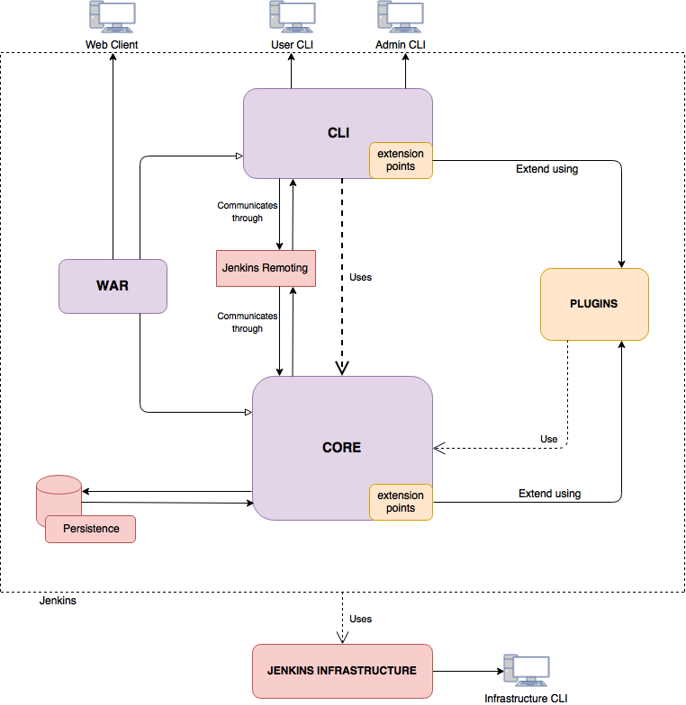
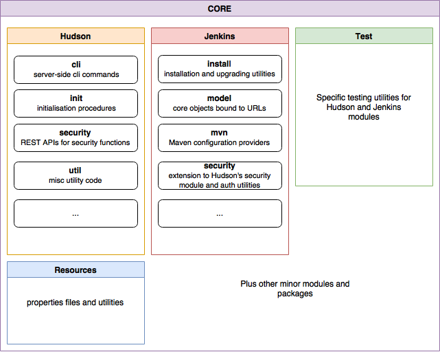
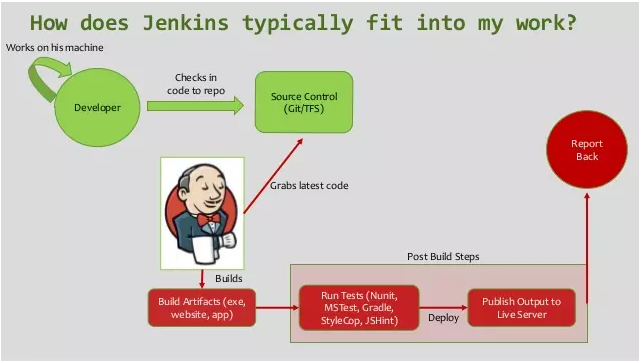
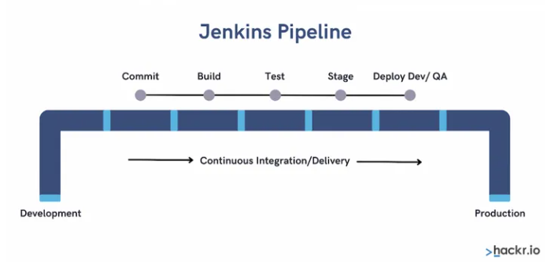

# **Viettel-Digital-Talent-2022: Final Assignment - Phase 1**

- *Author: Nguyen Tuan Hiep*

## **Topic 1: CI/CD - Jenkins**

- *Phân tích thiết kế, cách thức hoạt động và các ưu nhược điểm của giải pháp CI/CD mã nguồn mở Jenkins*

## **Mục Lục**

- [**Viettel-Digital-Talent-2022: Final Assignment - Phase 1**](#viettel-digital-talent-2022-final-assignment---phase-1)
  - [**Topic 1: CI/CD - Jenkins**](#topic-1-cicd---jenkins)
  - [**Mục Lục**](#mục-lục)
  - [**I. Tìm hiểu về CI/CD**](#i-tìm-hiểu-về-cicd)
    - [**1. CI là gì?**](#1-ci-là-gì)
    - [**2. CD là gì?**](#2-cd-là-gì)
    - [**3. Vậy CI/CD là gì?**](#3-vậy-cicd-là-gì)
  - [**II. Jenkins**](#ii-jenkins)
    - [**1. Jenkins là gì?**](#1-jenkins-là-gì)
    - [**2. Thiết kế Jenkins**](#2-thiết-kế-jenkins)
      - [**a. Context View**](#a-context-view)
      - [**b. Functional View**](#b-functional-view)
      - [**c. Development View**](#c-development-view)
    - [**3. Các thức hoạt động**](#3-các-thức-hoạt-động)
    - [**4. Ưu nhược điểm**](#4-ưu-nhược-điểm)
  - [**III. Kết luận**](#iii-kết-luận)
  - [**IV. Reference**](#iv-reference)

## **I. Tìm hiểu về CI/CD**

### **1. CI là gì?**

  > 📘 Theo `Martin Fowler`:
  >
  > Continuous Integration (CI) is a software development practice where members of a team integrate their work frequently, usually each person integrates at least daily - leading to multiple integrations per day. Each integration is verified by an automated build (including test) to detect integration errors as quickly as possible. Many teams find that this approach leads to significantly reduced integration problems and allows a team to develop cohesive software more rapidly.

- <`Continuous Integration`> hay còn gọi là *Tích hợp liên tục* là một phương pháp phát triển phần mềm đòi hỏi các thành viên trong nhóm phải tích hợp công việc với nhau một cách thường xuyên. Từ đó có thể tăng tốc việc cho ra đời những tính năng mới, cập nhật và sửa lỗi cho phần mềm.

  <!--    -->
  

    
  

### **2. CD là gì?**

  > 📘 <https://continuousdelivery.com/> :
  >
  >Continuous Delivery is the ability to get changes of all types—including new features configuration changes, bug fixes and experiments—into production, or into the hands of users, safely and quickly in a sustainable way.

- <`Continuous Delivery`> hay còn gọi là *Chuyển giao liên tục* là giai đoạn triển khai những thay đổi về code đã được phát triển và kiểm thử vào môi trường Testing hoặc Staging.

- *Chuyển giao liên tục* giúp các nhà phát triển phần mềm tự động hóa quá trình testing, kiểm tra phần mềm qua nhiều thước đo như Unit test, UI test, Load Test, API test,...

  <!--  -->
  
  

    
  

### **3. Vậy CI/CD là gì?**

- Dựa trên các định nghĩa về *CI* và *CD*, ta có thể hiểu *CI/CD* là quá trình làm việc liên tục và tự động hóa của phần mềm.
  
  

    
  

- Trong những năm trở lại đây, *CI/CD* đã trở thành thông lệ trong quá trình phát triển phần mềm, là chìa khóa kết hợp các khâu kiểm thử và phát triển phần mềm lại với nhau. Ngoài ra, *CI/CD* cũng trở thành thông lệ tốt nhất trong ngành công nghệ thông tin để giữ cho ứng dụng có thể được triển khai bất cứ lúc nào cũng như đẩy mã triển khai đó vào kho sản xuất khi có mã mới.

- Điều này dẫn tới nhu cầu về các công cụ *CI/CD* thích hợp. Hiện nay trên thị trường có một số những đại diện tiêu biểu cho *CI/CD Tools* có thể kể đến như:

  

    
  

- Trong số những đại diện trên, tiêu biểu nhất và có lẽ cũng chiếm thị phần nhiều nhất là `Jenkins` - một giải pháp CI/CD open source với rất nhiều những tính năng mạnh mẽ và một cộng đồng phát triển lớn.

## **II. Jenkins**

  

    
  

### **1. Jenkins là gì?**

  > 📘 `- jenkins.io -`:
  >
  >Jenkins® is an open source automation server. With Jenkins, organizations can accelerate the software development process by automating it. Jenkins manages and controls software delivery processes throughout the entire lifecycle, including build, document, test, package, stage, deployment, static code analysis and much more.
  
- `Jenkins` là một công cụ tích hợp liên tục, với hàng trăm Plugin được cung cấp hỗ trợ tự động hóa các tác vụ như xây dựng, thử nghiệm, phân phối và triển khai các dự án của người dùng.

- `Jenkins` được viết bằng ngôn ngữ Java với các gói dành cho Windown, Mac OS X và các hệ điều hành dựa trên Unix khác. Nó hoạt động cùng với Docker (Container-virtualisation software) và JRE (Java Runtime Environment). Cả 2 thứ trên đều cần phải được cài đặt trước khi cài đặt và triển khai Jenkins.

- `Jenkins` thực hiện thông qua các files đặc biệt (Jenkinsfile) hoặc giao diện Blue Cloud (Trong gói Plugin cơ bản).

- Kiến trúc Plugin cho phép *có thể* tích hợp vô hạn các chức năng cho Jenkins. Ngoài ra, Jenkins có thể chạy trên một PC hoặc một hệ thống phân tán, để phân tán tải tính toán, cải thiện tốc độ xử lý.

- `Jenkins` là một dự án mã nguồn mở, mặc dù nó có nhóm phát triển chính thực hiện hầu hết các công việc lập trình, nhưng mọi người đều có thể tham gia đóng góp và tạo các pull request cho dự án. Không chỉ code, mọi người còn có thể tham gia dịch, viết tài liệu và kiểm tra code cho dự án.

### **2. Thiết kế Jenkins**

#### **a. Context View**

- *Context Diagram* :

  

    
  

- `Jenkins` (Jenkins Core) hoạt động cần phải tương tác với nhiều thực thể, đó là các hệ thống bên trong và bên ngoài (Internal/External System).

- ***Internal System :***
  
  - Đối với hệ thống bên trong, thực thể quan trọng nhất mà *Jenkins Core* cần tương tác đó là *Plugins*. Gần như tất cả các tác vụ chính của Jenkins đều liên quan đến ít nhất một số Plugin cơ bản.
  
  - Sự tương tác giữa *Core* và *Plugins* diễn ra thường xuyên trong khi hệ thống hoạt động và tất cả đều được quản lý tự động bằng code (Thể hiện tính minh bạch đối với người dùng/ người quản trị).
  
  - Các *Plugins* hoạt động giống như các dịch vụ mở rộng vì chúng cần *Core* cho các chức năng của mình và ngược lại, các plugins cũng mở rộng khả năng cũng như tính năng của *Core*, đem lại khả năng tùy biến cao cho Jenkins.

  - Một thực thể bên trong khác là *Jenkins Remoting* - là một thư viện và kho lưu trữ Java (Java Archive) có thể thực thi. Thực hiện thực thi lớp giao tiếp (Communication Layer) trong Jenkins.

  - *Remoting* là một thực thể quan trọng cần thiết cho các hoạt động của *Core* vì nó cung cấp tất cả các thủ tục và giao thức cho phép giao tiếp giữa tất cả các thành phần của hệ thống thông qua một mạng. *Core* và *Remoting* tương tác thường xuyên và tất cả đều minh bạch với người dùng/người quản trị.

- ***External System :***

  - *[Jenkins Infrastructure]*: Vì Jenkins là một dự án mã nguồn mở và độc lập, nên nó cần có một cơ sở hạ tầng được duy trì cùng với dự án. Cơ sở hạ tầng được coi là hệ thống bên ngoài bởi vì nó không trực tiếp là một phần chính của *Core*, nhưng *Core* cần có cơ sở hạ tầng để hoạt động. Cơ sở hạ tầng là thực thể cần thiết trong tất cả các trường hợp yêu cầu sử dụng Jenkins dưới dạng phân phối. Cơ sở hạ tầng có thể có các biện pháp dự phòng để duy trì các chức năng của Jenkins khi nó xảy ra lỗi.

  - *[Java & Docker]*: Jenkins yêu cầu java và docker để có thể hoạt động, vì vậy hai thực thể này cũng có thể được đề cấp đến như hai hệ thống bên ngoài chính mà Jenkins tương tác. Java cung cấp khung và ngôn ngữ lập trình, trong khi Docker cung cấp phương tiện ảo hóa. Cả hai đều quan trọng để hệ thống hoạt động và các tương tác giữa chúng đều không hiện thị với người dùng (Tất cả đều tự động bằng code).

  - *Github and other Communication*: Github là công cụ chính để quản lý dự án, quản lý version và giao tiếp được Jenkins sử dụng. Github cũng là nguồn chính cho code và tất cả những đóng góp của cộng đồng đều được thực hiện trên đó. Github cũng được sử dụng để tích hợp CI. Ngoài Github, một số kênh giao tiếp khác bao gồm Mail, Forums và cả trang web Tracker chuyên dụng.

- Như đã đề cập, Jenkins và các Plugins của nó hoạt động tương tác với nhau. Vì hầu hết người dùng dựa vào Plugins để làm việc nên Team phát triển *Core* của Jenkins rất cẩn thận để không phá vỡ khả năng tương thích của Plugin trong khi nâng cấp *Core*. Bản thân Plugin tất nhiên cũng cần dựa vào Jenkins vì nếu như không có *Core*, plugins cũng trở nên vô dụng.

- Việc phát triển Jenkins được thực hiện bởi cộng đồng mã nguồn mở, trong khi đó việc phát triển Plugins là riêng lẻ cho từng Plugins. Một số Plugins lớn thường có kênh liên lạc riêng như trang web, diễn đàn, ..

#### **b. Functional View**

- Trong phần này sẽ đề cập đến yếu tố kiến trúc của Jenkins - Thứ cung cấp các chức năng cho Jenkins khi nó hoạt động.

- Những tính năng chính mà `Jenkins` cung cấp: (Theo <https://www.jenkins.io/> )
  - *Continuous integration and delivery*
  - *Extensibility*
  - *Ease of configuration*
  - *Maintaining backwards compatibility*
  - *Dedicated CLI for different types of users*

- Theo đó, Jenkins được kì vọng sẽ cung cấp một dịch vụ hiệu quả giúp các nhà phát triển xây dựng, thử nghiệm và triển khai các dự án. Để cung cấp trải nghiệm người dùng tốt hơn và giúp người dùng cá nhân hóa các quy trình xây dựng, `Jenkins` được thiết kế để có thể mở rộng (Theo nghĩa có thể cài đặt nhiều Plugins và cấu hình chúng dễ dàng để đáp ứng nhu cầu sử dụng). Một số nguyên tắc kiến trúc có thể đã được sử dụng trong thiết kế `Jenkins`:

  - *Ease of extension* : Dễ dàng mở rộng.
  - *High separation of functionalities and concerns*: Sự tách biệt rõ ràng giữa các chức năng và nhu cầu sử dụng.
  - *Loose coupling for core functionalities*:

- Mô hình các giao diện chức năng và thực thể cho `Jenkins`:

  

    
  

- *Extension Point*: Các điểm mở rộng được sử dụng để mở rộng chức năng của *Core* và *CLI* và tạo các Plugins mới, các Plugins này sẽ cần *Core* để hoạt động và cung cấp các chức năng, công cụ mới. Hiểu một cách đơn giản, điểm mở rộng là các giao diện và các lớp (hoặc phương thức) trừu tượng có thể được mở rộng cho bất kì mục đích sử dụng nào.

- *Jenkins Remoting*: Được sử dụng làm cầu nối giao tiếp giữa *Core* và *CLI*, đặc biệt là trong môi trường phân tán. *Remoting* như đã đề cập trong Context View, nó không phải là một phần chính của dự án Jenkins mà nó chỉ cung cấp các thủ tục và API giao tiếp giữa các thực thể.

- Ngoài ra còn một yếu tố quan trọng trong mô hình giao diện chức năng của Jenkins đó là tồn tại nhiều giao diện người dùng, mỗi giao diện trong số chúng được thiết kế để sử dụng cho các mục đích cụ thể: *web client, user CLI* được người dùng bình thường sử dụng để cài đặt, nâng cấp, quản lý và làm việc trên Jenkins, *admin CLI* được sử dụng bởi hệ thống quản trị để giám sát Jenkins và các Plugins của nó, *Infrastructure CLI* được sử dụng bởi nhân viên bảo trì, giúp giám sát tất cả các thành phần giúp Jenkins hoạt động.

#### **c. Development View**

- `Jenkins` là một dự án lớn, có kiến trúc phức tạp vì vậy để có thể hiểu rõ hơn về kiến trúc, cũng như để dễ dàng kiểm tra và bảo trì, mà nguồn của Jenkins được tổ chức dưới dạng module, bao gồm 4 module khác nhau, cung cấp các chức năng cụ thể:
  
  - `cli`: cung cấp giao diện dòng lệnh cho Jenkins
  - `core`: mã nguồn lõi của dự án
  - `test`: đơn vị thử nghiệm các chức năng trên lõi
  - `war`: chịu trách nhiệm tạo tệp .war

- 3 module `cli`, `core` và `test` đều có thể chia được thành các module con.

- Cả modul `cli` và module `core` đều có các đơn vị test riêng ở bên trong các module, cung cấp các chức năng thử nghiệm cụ thể (Trái ngược với các đơn vị thử nghiệm tổng quát được cung cấp trong module `test`)

- Ngoài ra, module `core` được chia thành 2 module logic là `Jenkins` và `Hudson`, bên trong 2 module này lại được chia thành các module nhỏ hơn cung cấp các chức năng các nhau cho `core`.

- Hình minh họa về các sub-module trong module `core` :
  
  

    
  

- Module dependencies trong Jenkins

  

    
  

- Danh sách về tất cả các dependencies có thể tìm thấy trong file `pom.xml` chứa trong mỗi module, đó là các tệp Maven liên quan đến các thuộc tính của dự án, cũng như thuộc tính của các module đơn lẻ. Đặc biệt, mỗi module có một danh sách chi tiết các module (Nội bộ dự án hoặc các thư viện bên ngoài) mà một module nhất định phụ thuộc vào.

- Một điểm quan trọng cần phải chỉ ra đó là mối quan hệ giữa 2 module con trong module `core` là `jenkins` và `hudson`. Rất nhiều hàm trong module `jenkins` được gọi ra từ trong `hudson`.

### **3. Các thức hoạt động**

- Mô hình hoạt động của Jenkins:

  

    
  

- Các lập trình viên thực hiện phát triển mã nguồn trên local sau đó thực hiện đẩy mã nguồn lên các dịch vụ quản lý mã nguồn chung.

- Jenkins sẽ trigger các thay đổi trên mã nguồn, khi có sự thay đổi, máy chủ Jenkins sẽ thực hiện pull chúng về và đóng gói.

- Sau khi đóng gói, các thay đổi trong mã nguồn sẽ được đưa vào các bước kiểm tra, nếu như không thể vượt qua các bài kiểm tra, Jenkins sẽ gửi thông báo ngay lập tức đến các nhà phát triển để thực hiện các thay đổi phù hợp.

- Nếu vượt qua bài kiểm ta, các thay đổi lúc này đã sẵn sàng để được triển khai trên môi trường thử nghiêm (Hoặc môi trường Production).

- Các hoạt động của Jenkins được thực hiện thành một vòng lặp khép kín và theo chu kỳ mỗi khi có sự thay đổi mới trong mã nguồn của sản phẩm. Vì vậy ta có thể khái quát hoạt động của Jenkins qua khái niệm về `Jenkins Pipeline`.

  

    
  

- Mỗi một thay đổi được pull từ mã nguồn sẽ được đưa vào 1 pipeline.

- Để xây dựng pipeline, Jenkins sử dụng `Jenkinsfile`.

- Có 2 cú pháp được sử dụng để định nghĩa `Jenkinsfile` là:
  
  - *Scripted pipeline syntax*:
  - *Declarative pipeline syntax*

- Dựa vào Jenkins pipeline, rất nhiều các mô hình giải pháp CI/CD dựa trên Jenkins được tạo ra, mang lại hiệu quả cao, phù hợp với nhiều mục đích cũng như nhu cầu sử dụng của doanh nghiệp và nhà phát triển.

### **4. Ưu nhược điểm**

- *Ưu điểm*:

  - `Jenkins` là `platform-independent`, ta có thể sử dụng Jenkins trên nhiều nền tàng và hệ điều hành như Windows, Linux, OS X, ..
  
  - Dễ dàng cấu hình, sửa đổi hay mở rộng hệ thống Jenkins.
  
  - Giúp các nhà phát triển phát hiễn lỗi trong mã sớm, giúp tiết kiệm thời gian và chi phí.
  
  - `Jenkins` đang được quản lý bởi cộng đồng rất cởi mở. Hàng tháng, họ tổ chức các cuộc họp công khai và lý ý kiến từ cộng đồng để phát triển dự án Jenkins.

  - Cho đến nay đã có hàng trăm ticket được đóng và dự án phát hành ổn định ba tháng một lần.

  - Hiện nay Jenkins có khoảng gần 2000 Plugins được xuất bản (<https://plugins.jenkins.io/ui/search?query>), đem lại khả năng tùy biến mạnh mẽ cũng như nhiều tính năng phù hợp với nhiều dự án phần mềm khác nhau.

  - Jenkins cũng hỗ trợ kiến trúc dựa trên đám mây để có thể triển khai Jenkins trên các nền tảng dựa trên đám mây.

- *Nhược điểm*:

  - Công việc duy trì vận hành và nâng cấp hệ thống Jenkins không dễ dàng. Lý do bởi vì Jenkins hoạt động dựa trên tương tác giữa core và plugins, khi nâng cấp core có thể dẫn tới sự mất đồng bộ giữa core và plugins, gây ra nhiều vấn đề cho hệ thống.

  - Cấu trúc của Jenkins yêu cầu một số kỹ năng quản trị cũng như kinh nghiệm vận hành đối với hệ thống để có thể giám sát nó, điều này gây khó khăn về tài chính cho những công ty cũng như dự án nhỏ tiếp cận với Jenkins vì họ không có đủ kinh tế để chi trả cho các kỹ sư giỏi.

## **III. Kết luận**

- Jenkins là một công cụ phổ biến trên toàn cầu với hàng triệu lượt cài đặt và con số này vẫn tăng lên từng ngày theo nhu cầu ngày càng lớn của các nhà phát triển.

- Với Jenkins, các nhà phán triển cũng như các công ty, doanh nghiệp có cơ hội nâng cao quy trình phát triển phần mềm. Có thể tự động hóa, xây dựng và kiểm tra các quy trình với tốc độ nhanh chóng.

- Tóm lại, nếu bạn muốn xây dựng một mô hình CI/CD với chi phí thấp nhất, với một cộng đồng mã nguồn mở lớn mạnh và một công cụ quản lý mạnh mẽ với độ tùy biến cao, hãy chọn `Jenkins`.

## **IV. Reference**

[1] <https://www.jenkins.io/doc/developer/architecture/>

[2] <https://delftswa.gitbooks.io/desosa2018/content/jenkins/chapter.html>

[3] <https://www.cloudbees.com/jenkins/what-is-jenkins>

[4] <https://comdy.vn/ci-cd/tich-hop-lien-tuc-ci-su-dung-jenkins/>

[5] <https://hackr.io/blog/what-is-jenkins>
