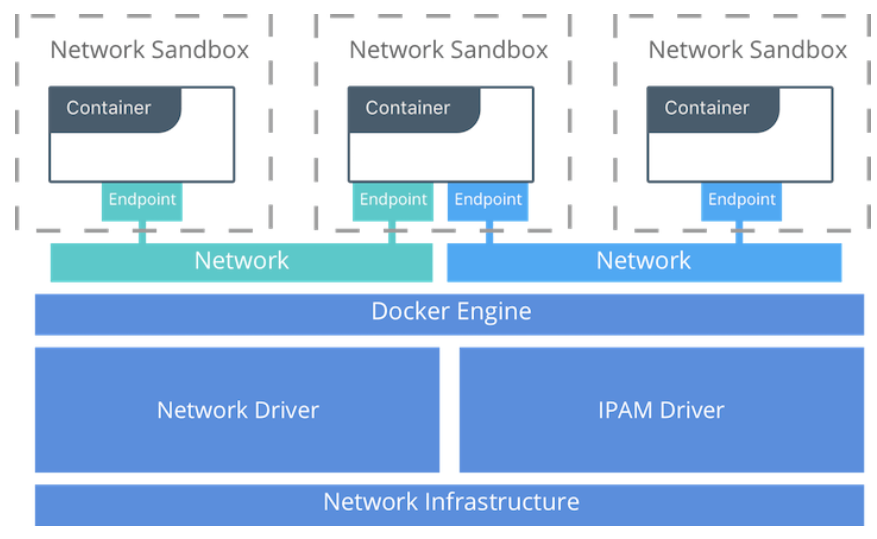
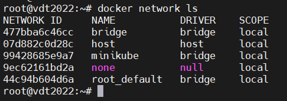
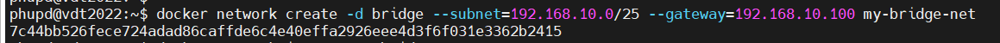
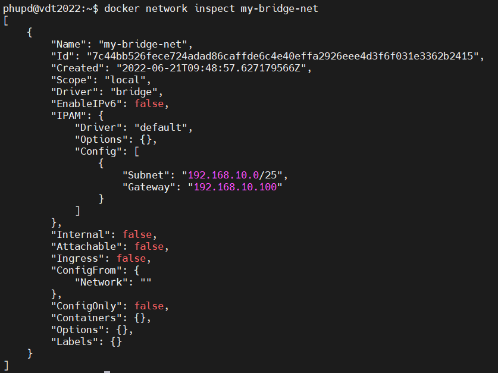
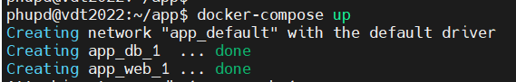
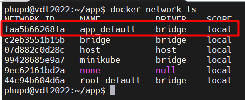
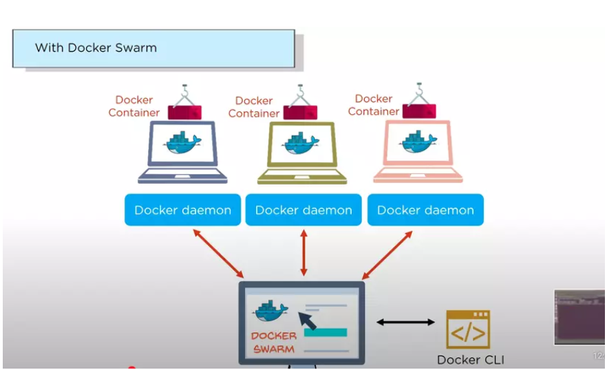
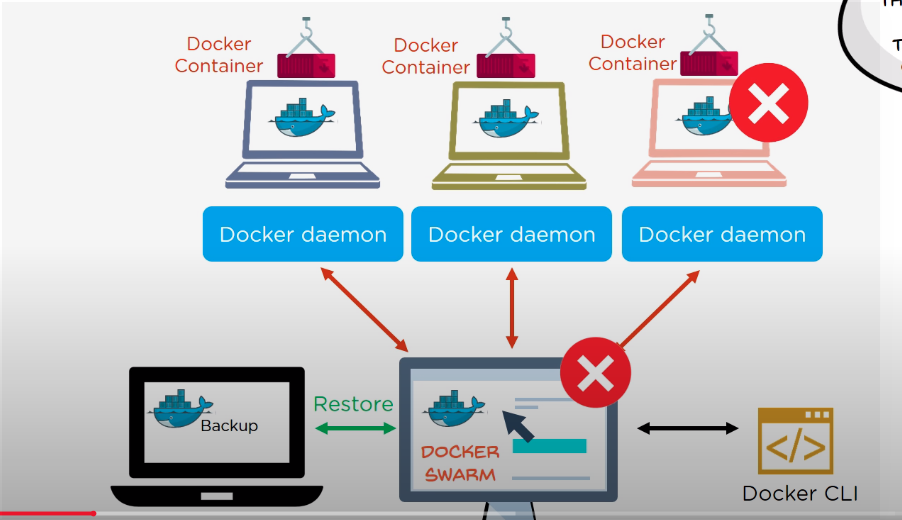

# Practice 6: Docker Networking    
----   
## Mục lục    
  
[1. Container Networking Model_CNM](#containernetworkingmodel_CNM)     
[2. Các loại Native Network Driver của Docker](#cacloainativenetworkdrivercuadocker)     
[3. Networking in Compose](#networkingincompose)        
[4. How does docker-swarm do multi host networking ?](#howdoesdocker-swarmdomultihostnetworking?)               
   
### [5. Tài liệu tham khảo](#tailieuthamkhao)     

-----  
## Mục đích  
- Docker network sẽ đảm nhiệm nhiệm vụ kết nối mạng giữa các `container` với nhau, kết nối giữa `container` với bên ngoài, cũng như kết nối giữa các cụm (swarm) docker container. Với `container` và service của Docker, bạn có thể kết nối chúng lại với nhau hoặc kết nối chúng với các mạng khác nằm ngoài `docker`.    

<a name='containernetworkingmodel_CNM'></a>   

## 1. Container Networking Model   
- Kiến trúc của mạng Docker được xây dựng dựa trên một tập interface được gọi là `Container Networking Model (CNM)`.  
- Mục đích: cung cấp khả năng luân chuyển ứng dụng trên nhiều nền tảng.  
- Mô hình này cân bằng được tính luân chuyển cho ứng dụng và cũng tận dụng được khả năng đặc trưng của các nền tảng. 

   
- Trong đó:   
    - `Sandbox`: chứa cấu hình mạng của container. 
        - Bao gồm cấu hình quản trị các interface mạng, bảng routing, các cấu hình DNS ...  
        - Một sandbox có thể chứa nhiều endpoint kết nối đến nhiều network.   
    - `Endpoint`: kết nối Sandbox với một Network (block cuối trong CNM)   
        - Là một virtual network interface, nhiệm vụ của nó là tạo ra kết nối mạng.   
        - `EP` giống như là các `network adapter`.
    - `Network`: dùng để chỉ kết nối giữa các endpoint.  
        - Network là một tập hợp các endpoint mà có kết nối giữa chúng.     
### CNM - Driver Interface    
- CNM mở hai interface dạng cắm/rút là `Network Driver` và `IPAM Driver`.    
   - `Network Driver`
      - Cung cấp, triển khai để network có thể hoạt động.   
      - Vì có dạng cắm/rút nên có thể thay thế lâm thời một cách dễ dàng tùy vào mục đích sử dụng khác nhau.    
      - Nhiều trình điều khiển có thể có trong một Docker Engine hay Cluster, nhưng mỗi `Network` chỉ có thể cắm một trình điều khiển duy nhất.     
   - Hai dạng chính của `CNM Network Driver`:  
      - `Native Network Driver`       
         - Các trình điều khiển cơ bản, đã có sẵn trong Docker Engine, được cung cấp bởi Docker.   
         - Như là: overlay network, local bridge,...    
      - `Remote Network Driver`     
         - Các trình điều khiển được phát triển bởi cộng đồng và các nhà cung cấp khác.   
         - Người dùng có thể tạo ra driver của họ khi cần các chức năng đặc biệt.     
   - `IPAM Driver`    
      - Là các IP Address Management (trình quản lý địa chỉ IP)  
      - Cung cấp các địa chỉ hay subnet mặc định cho network và endpoint trong trường hợp chúng không được xác định.    
      - Địa chỉ IP có thể được gán thủ công khi tạo network, container, hay service.    

   


<a name='cacloainativenetworkdrivercuadocker'></a>  

## 2. Các loại Native Network Driver của Docker      
- `Docker Native Network Driver` là một phần của Docker Engine, không yêu cầu bất kỳ module nào khác.    
    - Sử dụng thông qua câu lệnh `docker network`.      

### Types   
- `Bridge` là network driver mặc định khi bạn khởi tạo.     
   - Nó thì thường được sử dụng khi ứng dụng của bạn chạy trong container độc lập (standalone) cần giao tiếp với nhau.   [Sử dụng bridge networks](https://docs.docker.com/network/bridge/)   
 

***User-defined mạng `bridge` là tốt nhất khi bạn cần multiple containers để giao tiếp trong cùng Docker host***  
- `Host` Đối với các container độc lập, không có nhu cầu giao tiếp với bên ngoài thì có thể remove mạng cô lập giữa container và Docker host, sau đó sử dụng trực tiếp mạng của host.   [Sử dụng host networking](https://docs.docker.com/network/host/)    


- `Overlay` 
   - Mạng overlay kết nối đa Docker daemons cùng nhau và bật dịch vụ `swarm` để giao tiếp lẫn nhau.   
   - Ngoài ra, có thể sử dụng để tạo điều kiện giao tiếp giữa một dịch vụ `swarm` và một container độc lập, hoặc giữa hai container độc lập trong Docker daemon khác.   [Sử dụng overlay networks](https://docs.docker.com/network/overlay/)      


***Dùng để container đang chạy trong Docker hosts khác để giao tiếp với nhau hoặc khi multiple application làm việc cùng nhau đang sử dụng dịch vụ `swarm`***
- `ipvlan`: mạng IPvlan cung cấp người dùng tất cả quyền kiểm soát đối với cả địa chỉ IPv4 và IPv6.  [Sử dụng IPvlan networks](https://docs.docker.com/network/ipvlan/)     
- `macvlan`: Mạng Macvlan cho phép bạn gán một địa chỉ MAC đến một container, điều này làm cho mỗi container như là một thiết bị vật lý trong mạng. Docker daemon định tuyến lưu lượng đến containers bởi địa chỉ MAC.   [Sử dụng Macvlan networks](https://docs.docker.com/network/macvla)    
- `none`: tắt tất cả networking, thường được sử dụng trong kết hợp với một driver mạng tùy chỉnh. Driver này không thể dùng trong cụm `swarm`.  [Tắt networking for a container](https://docs.docker.com/network/none/)     

- `Network plugins`: Bạn có thể install và sử dụng bổ sung mạng bên thứ ba với Docker. Bổ sung này có sẵn từ [Docker Hub](https://hub.docker.com/search?q=&type=plugin) hoặc từ người cung cấp bên thứ ba.        

    

### Một vài cách sử dụng docker network    
- Khởi tạo một docker network   
```   
$ docker network create [OPTIONS] NETWORK  
$ docker network create -d bridge my-network   
```    
- Trong đó:    
   - `[OPTIONS]`      
       - `-d` là driver     
       - `-d overlay`: để tạo mạng overlay   
       - `--gateway`: địa chỉ IP của gateway (IPv4 hay IPv6) cho mạng con. 
       - `--ip-range`: để xác định một dải IPs sử dụng trong mạng.  
       - `--internal`: hạn chế access từ bên ngoài vào mạng.   
       - `--ipv6`: bật ipv6   
       - `--subnet`: cho mạng con   

VD: Khởi tạo mạng với driver bridge có subnet 192.168.10.0/25, ip gateway là 192.168.10.100     

   

     

- ***Một lưu ý vô cùng quan trọng là `standalone container` ~ được hiểu trong ngữ cảnh so sánh với chuỗi các container (như trong docker swarm hay kubernets) chứ không có nghĩa là độc lập, không giao tiếp với ai.***      

<a name='networkingincompose'></a>   

## 3. Networking in Compose    

- ***Note: Tính năng Networking thì không hỗ trợ cho định dạng file Compose `version 1`, chỉ hỗ trợ định dạng `version 2` and `higher`.***   

- Khi dùng docker-compose thì nếu không khai báo network, docker sẽ tự động tạo một network cho app và driver sẽ là birdge.   

- VD: Tạo một file docker-compose.yml trong thư mục `app`         
```  
version: "3.3"  
services:  
   web:  
     image: nginx:1.22.0-alpine
     ports:  
       - "8000:8000"    
   db:   
     image: postgres  
     ports:  
       - "8001:5432"     
```    
- Khi chạy `docker-compose up`, điều gì sẽ xảy ra ?      

     

   - Một network có tên là `app_default` được tạo ra với driver default `bridge`.         
   - Một container thì được tạo ra đang sử dụng cấu hình `web`. Nó sẽ tham gia network `app_default` dưới tên `web`.    
   - Một container thì được tạo ra đang sử dụng cấu hình `db`. Nó sẽ tham gia network `app_default` dưới tên `db`.    

- Check danh sách network sẽ có network mà docker-compose vừa tạo   

    

- Và khi dừng app thì docker sẽ xóa mạng    

    

- Nếu muốn khai báo mạng cho từng containers trong một cụm chúng ta có thể dùng 2 cách sau:  
   - Khai báo `driver host` cho container app qua `network_mode`, cách khai báo này có thể thay đổi driver cho container.     
- Trường hợp, chúng ta muốn app sử dụng luôn mạng của host mà không dùng mạng docker, hãy khai báo như sau:    
```  
services:  
   app:   
     network_mode: host    
```    

   - Khai báo qua `networks` trong docker-compose.yml      

```  
services:  
   app:  
      networks:   
        - api-net     
networks:   
   api-net:   
      driver: host
```   

### Update containers   
- Khi bạn thay đổi cấu hình đến một service và chạy `docker-compose up` để update nó, thì container cũ sẽ bị xóa và mạng mới sẽ được join dưới một địa chỉ ip khác nhưng vẫn cùng tên.   

### Links  
- Links cho phép bạn để xác định thêm alias bởi một service có thể tiếp cận đến service khác.   
- Trong ví dụ sau đây, `db` thì có thể tiếp cận đến `web` tại hostname `db` and `database`   
```    
version: "3.9"  
services:   
    web:   
       build: .  
       links:  
          - "db:database"  
    db:  
       image: postgres    
```     
 
<a name='howdoesdocker-swarmdomultihostnetworking ?'></a>   

## 4. How does docker-swarm do multi host networking ?      

<a name='docker-swarmlagi?'></a>     

### Docker-swarm là gì ?     
- Khi một cụm các máy (cluster) cùng chạy Docker Engine tập hợp lại kết nối với nhau nó hình thành nên một Docker Swarm, mỗi máy này có thể là một máy vật lý thật, VPS hay máy ảo tự tạo.  
- Cách thức hoạt động:    
    - Một máy trong cụm máy ra lệnh chuyển nó chạy ở chế độ Swarm (swarm mode), lập tức nó trở thành một nút `node` trong swarm, do máy này khởi tạo đầu tiên trên swarm nên nó nắm quyền kiểm soát toàn bộ swarm và nó gọi là `manager`, vì là manager nên chỉ có nó mới có quyền khởi tạo các dịch vụ (ứng dụng) chạy trên swarm, quyền xóa một node khác ra khỏi swarm.            
    - Các máy chạy Docker Engine khác gia nhập vào swarm nhờ một lệnh xin gia nhập, và khi trở thành một `node` của swarm nó gọi là các `worker node`. Nó chỉ có khả năng cung cấp chạy các dịch vụ chứ không có quyền quản lý các dịch vụ chạy trên node này do node `manager` quản lý.      
    - Khi sử dụng swarm, chủ yếu làm việc ở `node manager` để tạo và chạy các dịch vụ (ứng dụng), các dịch vụ khởi tạo từ node manager sẽ tạo ra nhiều container ở nhiều node worker (kể cả chạy ở node manager) khác nhau.    
  
         

- Việc xảy ra lỗi trong quá trình thực hiện là điều không thể tránh khỏi vì vậy khi một container bị build lỗi, thì với một backup folder sẵn có trong node ta có thể sử dụng để restore data trên một swarm mới.     
- Với Docker-swarm bạn có thể rollback bản build trước một cách easy.   

        
 
- Docker Swarm có nhiều tính năng nổi bật:  
   - Cluster management integrated with Docker Engine       
   - Decentralized design   
   - Declarative service model    
   - Scaling  
   - Desired state reconciliation   
   - Multi-host networking  
   - Service discovery  
   - Load balancing  
   - Secure by default   
   - Rolling updates   


- Ba khái niệm mạng quan trọng trong docker-swarm.        
   - `Overlay network` quản lý giao tiếp giữa Docker-daemon tham gia vào swarm. Overlay networks là Docker networks sử dụng driver `overlay network`     
   - `Ingress network` là một mạng overlay đặc biệt tạo điều kiện cân bằng tải (load balancing) giữa các nút (nodes) service.      
       - Mạng `ingress` thì được tạo tự động khi bạn khởi tạo hoặc join một swarm. Hầu hết không cần tùy chỉnh cấu hình nó, nhưng Docker cho bạn quyền đó.   
   - `docker_gwbridge` là một mạng bridge kết nối mạng overlay (bao gồm mạng ingress) đến một mạng vật lý Docker daemon cá nhân.             

<a name='tailieuthamkhao'></a>    

## 5. Tài liệu tham khảo  
[1] https://viblo.asia/p/docker-networking-nhung-khai-niem-va-cach-su-dung-co-ban-gGJ59P2JlX2    
[2] https://docs.docker.com/network/   
[3] https://docs.docker.com/network/network-tutorial-overlay/    
[4] https://docs.docker.com/engine/swarm/   


    
