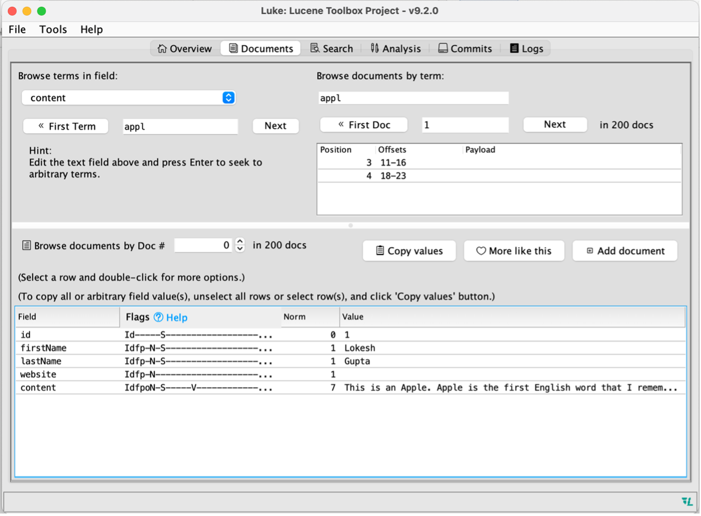

# TABLE OF CONTENT

- [TABLE OF CONTENT](#table-of-content)
- [AN OVERVIEW OF APACHE LUCENE](#an-overview-of-apache-lucene)
  - [1. Kiến trúc tổng quan](#1-kiến-trúc-tổng-quan)
  - [2. Indexing](#2-indexing)
  - [3. Searching](#3-searching)
    - [3.1. TermQuery](#31-termquery)
    - [3.2. BooleanQuery](#32-booleanquery)
    - [3.3. PhraseQuery](#33-phrasequery)
    - [3.4. WildcardQuery](#34-wildcardquery)
    - [3.5. FuzzyQuery](#35-fuzzyquery)
  - [4. Kết luận](#4-kết-luận)
    - [4.1. Tối ưu query](#41-tối-ưu-query)
    - [4.2. Elasticsearch và Lucene](#42-elasticsearch-và-lucene)
    - [4.3. Tìm hiểu về FSM ứng dụng vào trong Lucene](#43-tìm-hiểu-về-fsm-ứng-dụng-vào-trong-lucene)
    - [4.4. Lucene và Distributed System](#44-lucene-và-distributed-system)
- [TÀI LIỆU THAM KHẢO](#tài-liệu-tham-khảo)

# AN OVERVIEW OF APACHE LUCENE

“Apache Lucene™ is a high-performance, full-featured search engine library written entirely in Java. Apache Lucene is an open-source project available for free download.”

Apache Lucene™ features: Scalable, High-Performance Indexing, Powerful, Accurate and Efficient Search Algorithms, Cross-Platform Solution

## 1. Kiến trúc tổng quan


*https://www.researchgate.net/publication/260282732_Apache_Lucene_4*

Trong một search engine thì hai hoạt động chính sẽ luôn là indexing và searching. Lucene cũng không ngoại lệ, kiến trúc của Lucene cũng được chia làm 2 luồng hoạt động chính là indexing và searching. Bây giờ, ta sẽ phân tích cấu trúc từ trên xuống dưới để thấy được một cách chính xác về cấu trúc của Lucene.

## 2. Indexing

Trong Lucene, đơn vị dữ liệu nhỏ nhất được gọi là document. Lucene sẽ modeling document theo dạng một list các field (trường) không bị nested (hay nó flat, tức là value của trường không thể là một document hay một list các trường khác). Mỗi field gồm 3 phần: name, type và value. Value có thể là string, reader, pre-analyzed TokenStream, binary hoặc numeric. Ngoài ra, field có thể được lưu lại giá trị để trả về khi search tuỳ vào mục đích của ta. Document sẽ gồm các field được implement IndexableField ( IndexableField giúp Lucene index, tokenized, stores field này). Một số field có thể kể đến như:

- TextField: String hoặc Reader, field này sẽ được index cho full-text search
- StringField: String, field này khác với TextField là nó sẽ không bị tokenized mà sẽ coi cả trường đó là một token
- Các numeric field (IntPoint, LongPoint, FloatPoint): được index sử dụng cho query khoảng giá trị/ giá trị chính xác. (Cơ chế indexing cho các trường numeric này sẽ khác so với các field sử dụng cho full-text search, cụ thể là k-demensional Tree, ta có thể tham khảo thêm paper triển khai cây này tại [đây](https://users.cs.duke.edu/~pankaj/publications/papers/bkd-sstd.pdf))

Ta cần phải nhấn mạnh rằng, với mỗi field thì cơ chế indexing sẽ có sự khác biệt (chẳng hạn như KD-Trê cho numeric field). Tuy nhiên, do Lucene là một full-text search engine nên ta sẽ chủ yếu tập trung vào tính năng này của Lucene (TextField) với cơ chế indexing đặc biệt cho tính năng này.

Như vậy sau khi có document, document sẽ được chuyển tiếp sang giai đoạn analysis. Tại giai đoạn này, tuỳ vào type của field mà các field sẽ được xử lí khác nhau, chẳng hạn như StringField thì sẽ không làm gì mà chuyển tới thẳng luôn IndexWriter. Ngược lại, TextField sẽ qua một bước analysis rồi mới đưa vào IndexWriter.

Trước hết, ta cần phải hiểu được cơ chế index của Lucene và tại sao ta cần analysis. Lucene sử dụng cơ chế được gọi là inverted indexing (cơ chế này đã được [đề cập tại đây](https://github.com/anhphantq/Viettel-Digital-Talent-Program-2022/tree/Pratice-5/Practice-5/Phan%20Duc%20Anh#123-index) nên ta sẽ không trình bày lại). Tức là thay vì duyệt từng document để xem có thoả mãn, thì các field sẽ được break ra thành các token, sau đó, mỗi token sẽ được lưu một số thông tin như số lần xuất hiện của nó trong các document và vị trí của nó trong các document đó. Khi đó, khi query ta thay vì scan document rồi so sánh với key word ta có thể tìm kiếm key word đấy bằng các token mà ta đã index. Đây là lý do vì sao giúp Lucence search nhanh như vậy.

Vậy quá trình analysis sẽ thực hiện như thế nào? Đầu tiên, dữ liệu sẽ được đưa vào tokenizer, đơn giản là nó sẽ chia nhỏ đoạn text ra thành các token (hay các từ). Tiếp theo các token sẽ được chuyển đến Token Filter để modify chẳng hạn như: deletion (xoá bỏ token vô nghĩa, chẳng hạn như a, an, the….), case-folding, synonym injection (với một token chẳng hạn như beautiful, Token Filter có thể inject thêm pretty với đúng vị trí và số lần xuất hiện như beautiful, đây là một điểm thú vị, vì khi ta query, thì có thể tìm được cả những câu có nghĩa tương đồng).


Ta sẽ thử sử dụng một Analyzer của built-in của Lucene là EnglishAnalyzer để xem cách thức hoạt động của nó như thế nào:

```java
package lucene;

import org.apache.lucene.analysis.Analyzer;
import org.apache.lucene.analysis.TokenStream;
import org.apache.lucene.analysis.en.EnglishAnalyzer;
import org.apache.lucene.analysis.tokenattributes.OffsetAttribute;

import java.io.IOException;
import java.io.StringReader;

public class analyzer {
    public static void main(String[] args) throws IOException {
        System.out.println("Analyzer test");
        Analyzer analyzer = new EnglishAnalyzer(); // or any other analyzer
        TokenStream ts = analyzer.tokenStream("myfield", new StringReader("This is an ApPLe"));
        // The Analyzer class will construct the Tokenizer, TokenFilter(s), and CharFilter(s),
        //   and pass the resulting Reader to the Tokenizer.
        OffsetAttribute offsetAtt = ts.addAttribute(OffsetAttribute.class);

        try {
            ts.reset(); // Resets this stream to the beginning. (Required)
            while (ts.incrementToken()) {
                // Use AttributeSource.reflectAsString(boolean)
                // for token stream debugging.
                System.out.println("token: " + ts.reflectAsString(true));

                System.out.println("token start offset: " + offsetAtt.startOffset());
                System.out.println("  token end offset: " + offsetAtt.endOffset());
            }
            ts.end();   // Perform end-of-stream operations, e.g. set the final offset.
        } catch (IOException e) {
            e.printStackTrace();
        } finally {
            ts.close(); // Release resources associated with this stream.
        }

    }
}
```

Với EnglishAnalyzer, với string ban đầu là “This is an ApPle” sau khi tokenize kèm theo filter nó chỉ còn 1 token duy nhất là “appl”. EnglishAnalyzer chỉ tập trung vào nội dung cụ thể của câu, loại bỏ các mạo từ, chủ ngữ dạng this, that, those, đồng thời tối ưu việc lưu trữ term khi bỏ chữ “e” trong “apple” vì rõ ràng khi ta viết “appl” thì ta cũng đã hiểu được nó chính là “apple” (bản chất của việc này do sự dư thừa ngôn ngữ, một chủ đề khá thú vị, chính việc dư thừa này gây ra sự phân bố không đồng đều của chữ trong một văn bản, từ đó ta có các phương pháp tấn công sử dụng thống kê):


Như vậy, sau khi các document được đưa vào analyzer và ouput ra được các token với mỗi field, các token sẽ được tập hợp lại để đánh index cho field đó. Vậy với mỗi field, inverted index sẽ được lưu trữ như thế nào?

Trước hết, ta sẽ tìm hiểu một số khái niệm trong việc index:

- **IndexWriter**: nhiệm vụ chính là tạo index, add, update và delete documents.
- **IndexReader**: nhiệm vụ chính dùng để đọc index.
- **Segments**: Lucene index gồm các segments, mỗi segment gồm một tập con các document trong index và với mỗi segment, ta có thể thực hiện search trên subset đó. Mỗi khi document được đưa vào index, nó sẽ thuộc một segment cụ thể. Segment sau đó được buffer (rồi đưa vào codec để encode), cuối cùng là được đưa vào disk. Segment có tính chất immutable; update và delete là tạo ra một segments mới. Nếu segment nhỏ đi do bị xoá hoặc update document, IndexWriter có thể merge các segment nhỏ này lại thành segment lớn để dễ maintain, search.

Tiếp theo ta sẽ tìm hiểu về cấu trúc của một segment


Với mỗi component trong segment sẽ được lưu trên các file trên disk, cụ thể:

| Type                  | Nội dung                                                                                                                                                                                             | ext            |
| --------------------- | ---------------------------------------------------------------------------------------------------------------------------------------------------------------------------------------------------- | -------------- |
| Segment info          | Metadata của segment như là: số documents, files nó sử dụng, thông tin về việc segment sẽ sort như thế nào                                                                                           | .si            |
| Field names           | Thông tin về tên của các fields trong index                                                                                                                                                          | .fnm           |
| Stored Field values   | Với mỗi document, nó là một list attribute-value pair, trong đó attributes là tên của field                                                                                                          | .fdt .fdx .fdm |
| Term dictionary       | Một dictionary gồm tất cả các term trong các indexed field của tất cả các document kèm theo một số thông tin như DocFreq (số document chưa term), pointer trỏ tới term's frequency và proximity data | .tim .tmd .tip |
| Term Frequency data   | Với mỗi term trong dictionary, ta có số lượng documents chưa term, frequency của term trong document này                                                                                             | .doc           |
| Term Proximity data   | Với mỗi term trong dictionary, ta lưu các vị trị mà term này xuất hiện trong từng document                                                                                                           | .pos .pay      |
| Term vectors          | Với mỗi field trong mỗi document, term vector có thể được lưu lại. Một term vector gồm term text và term frequency                                                                                   | .tvm .tvd .tvx |
| Normalization factors | Với mỗi field trong mỗi document, một giá trị được lưu lại để tham gia vào tính score                                                                                                                | .nvd .nvm      |
| Per-document values   | Tương tự như Stored Field values nhưng thiết kế với mục đích để load nhanh vào memory phục vụ scoring                                                                                                | .dvd .dvm      |

Về cấu trúc chi tiết của từng file, ta có thể tham khảo [tại đây](https://github.com/mocobeta/lucene-postings-format/).

Ta còn một khái niệm nữa trong Lucene được gọi là PostingFormat (là một inverted index), thực ra là tập hợp của Term dictionary, Term Frequency data và Term Proximity data.

Bây giờ, ta sẽ thử sử dụng Apache Lucene để đánh index cho các document. Trước hết, ta tạo Document được cung cấp sẵn bởi Lucene:

```java
private static Document createDocument(Integer id, String firstName, String lastName, String website, String content)
{
    Document document = new Document();
    document.add(new StringField("id", id.toString() , Field.Store.YES));
    document.add(new TextField("firstName", firstName , Field.Store.YES));
    document.add(new TextField("lastName", lastName , Field.Store.YES));
    document.add(new TextField("website", website , Field.Store.NO));
    document.add(new TextField("content", content , Field.Store.YES));
    return document;
}
```

Như vậy, ta đã viết 1 hàm tạo document với 4 trường: 3 trường TextField và 1 trường StringField, đồng thời trường “website” ta sẽ cấu hình không lưu giá trị trường này mà chỉ đánh index. Tiếp theo, ta viết hàm khởi tạo IndexWriter:

```java
private static IndexWriter createWriter() throws IOException
{
    FSDirectory dir = FSDirectory.open(Paths.get(INDEX_DIR));
    IndexWriterConfig config = new IndexWriterConfig(new EnglishAnalyzer());
    IndexWriter writer = new IndexWriter(dir, config);
    return writer;
}

```

Ta tạo 1 directory để lưu các file dữ liệu trên disk, tạo config cho IndexWriter sử dụng EnglishAnalyzer.

Cuối cùng ta chỉ cần tạo một list các Document rồi add vào IndexWriter, sau đó commit. Ở đây ta sẽ commit 2 lần và sẽ tạo ra 2 segment:

```java
IndexWriter writer = createWriter();
List<Document> documents = new ArrayList<>();

Document document1 = createDocument(1, "Lokesh", "Gupta", "howtodoinjava.com", "This is an Apple. Apple is the first English word that I remembered");
documents.add(document1);

Document document2 = createDocument(2, "Brian", "Schultz", "example.com", "This is another Apple");
documents.add(document2);

//Let's clean everything first
writer.deleteAll();

for (int i = 1; i < 100; i++) {
    writer.addDocuments(documents);
}
writer.commit();

writer.addDocuments(documents);

writer.commit();

writer.close();
```

Ta thử run và kết quả trả về trong directory INDEX_DIR như sau:


Ở đây, ta có thể thấy không xuất hiện các file như ta đã list ra ở bảng (chỉ có duy phất file .si). Thực ra các file này đã được nén vào trong file .cfe và .cfs.

Lucene cũng cung cấp Luke, một tool dùng để ta có thể đọc và phân tích các index này, ta có thể tại xuống bản binary release của Lucene [tại đây](https://www.apache.org/dyn/closer.lua/lucene/java/9.2.0/lucene-9.2.0.tgz), cd vào lucene-9.2.0/bin và chạy ./luke.sh

Ta sẽ đọc thử directory này và xem nó gồm những gì, tại overview ta có:


Như vậy, ta có 200 document từ 2 lần commit, và có 5 fields, ta show term của content thì ta thấy chỉ có 2 term là appl và anoth, tức là cụm “This is another apple” đã được tách thành “appl”, “anoth”, còn cụm "This is an Apple. Apple is the first English word that I remembered" được tách thành “appl”, “word”, “rememb”, ”i”, “first”, “English”, “anoth” đúng như ta đã phân tích ở bước Analysis. Tiếp đến ta chuyển sang cửa sổ Documents:


Các trường của document được lưu value, tuy nhiên đối với trường website thì ta đã config ngày từ đầu là không lưu trường này mà chỉ đánh index (S flag tượng trưng cho lưu hay không lưu). Ta sẽ xét thử trường content và xét term appl, ở đây do ta chỉ đánh index cho frequency, position nên trường offset và payload sẽ không được index và không xuất hiện mà chỉ có trường position tại vị trí 3,4 (từ appl xuất hiện ở vị trí thứ 3 và thứ 4 trong content). Ta cũng thấy rằng các trường ở đây cũng không có term vetor. Ta có thể config lại để đánh index cả offsets hoặc payload đồng thời lưu term vector của trường content như sau:

```java
FieldType customFieldType = new FieldType();

customFieldType.setIndexOptions(IndexOptions.DOCS_AND_FREQS_AND_POSITIONS_AND_OFFSETS);
customFieldType.setStoreTermVectors(true);
customFieldType.setStored(true);

document.add(new Field("content", content , customFieldType));
```

Kiểm tra lại Luke, ta được:



Như vậy, content đã có thêm offset, chẳng hạn như term “appl” có offset là [11-16] và [18-23], tương ứng với vị trí của “Apple” trên value của trường content. Tiếp theo, ta có thể xem được term vector của content (tại document #0):


> **_NOTE:_** Ta cũng có thể config được term vector để lấy được positions và offsets

> **_NOTE:_** Tại sao lại phải có term vector trong khi ta đã index các document? Ta có thể đọc thêm [tại đây](https://livebook.manning.com/book/lucene-in-action-second-edition/chapter-5/312). Phần leveraging term vectors. Điểm khác biệt cơ bản là: “Term vectors are an advanced means of storing the equivalent of an inverted index **_per document_**”. Chính vì thế, ta có thể sử dụng để tìm các document giống nhau hoặc catagorize chúng như trong tài liệu trên.

Ta cũng có thể thấy, có 2 segment được liệt kê tương ứng 2 với 2 commit mà ta thực hiện:


Như vậy, ta đã đi qua sơ bộ quy trình đánh index, cách Lucene lưu index trên disk. Tiếp theo ta sẽ tìm hiểu xem, bằng cách nào Lucence có thể tận dụng được các index này thể thực hiện việc tìm kiếm.

## 3. Searching

Để thực hiện một query, tương tự như indexing, ta cần một IndexReader để đọc được các các file của IndexWriter đã tạo ra, từ đó sử dụng các file này để thực hiện query. Query thì sẽ được đưa qua query parser và có thể đi qua analyzer để đưa dữ liệu query về cùng một hệ quy chiếu với document sau khi được đánh index. Kết quả được trả về và có thể được ranking về trả về theo kết quả phù hợp nhất với dựa trên việc scoring.

    search(Query q, Sort sort){
        Collector collector = sort.getCollector();
        DocIterator di = search(q); // tra ve cac document thoa man
        While(di.hasNext()){
            collector.collect(di.next());
        }

        return collector.topDocs(); // tra ve top document theo score
    }

Sau đây, ta sẽ thử tìm hiểu một số query đơn giản để xem cách chúng sẽ hoạt động như thế nào. Trước tiên ta sẽ tạo một hàm để tạo một IndexSearcher thực hiện query:

```java
private static IndexSearcher createSearcher() throws IOException {
    Directory dir = FSDirectory.open(Paths.get(INDEX_DIR));
    IndexReader reader = DirectoryReader.open(dir);
    IndexSearcher searcher = new IndexSearcher(reader);
    return searcher;
}
```

### 3.1. TermQuery

TermQuery là một dạng query đơn giản nhất (tốn ít tài nguyên nhất) và cũng là query được sử dụng nhiều nhất trong các application. Một TermQuery sẽ match toàn bộ document mà chứa một Term. Cách thực hiện của TermQuery khá đơn giản, nó sẽ lookup các term trong index, trả về tất cả các document có chưa term này. Ranking document theo BM25 (Elasticsearch cũng sử dụng thuật toán tính điểm này). Bây giờ ta sẽ thử query term “appl” từ index trước:

```java
// TermQuery
System.out.println("TermQuery: ");
TermQuery tq = new TermQuery(new Term("content", "appl"));
TopDocs topDocs_tq = searcher.search(tq, 1);
ScoreDoc[] docs_tq = topDocs_tq.scoreDocs;
for (int i = 0; i < docs_tq.length; i++){
    System.out.println(i + " " + docs_tq[i].score + " " + searcher.doc
```

Kết quả trả về là document có trường content là “This is another apple”. Sử dụng Luke, ta có thể thấy được điểm của “appl” trong “This is another apple” cao hơn trong “This is an Apple. Apple is the first English word that I remembered”.
Điều này là do công thức tính điểm của BM25 dẫn tới việc chưa chắc 1 document có term đó xuất hiện nhiều lần chưa chắc đã nhiều điểm hơn document có term xuất hiện ít lần hơn. Một số yếu tố khác ngoài DocFreq như: độ dài document length, hệ số term saturation,... Cụ thể:


Sử dụng Luke ta có thể xem chi tiết cách tính điểm của term "appl" trong "This is another apple":

    0.0014650949 weight(content:appl in 1) [BM25Similarity], result of:
    0.0014650949 score(freq=1.0), computed as boost * idf * tf from:
        0.0024906613 idf, computed as log(1 + (N - n + 0.5) / (n + 0.5)) from:
        200 n, number of documents containing term
        200 N, total number of documents with field
        0.58823526 tf, computed as freq / (freq + k1 * (1 - b + b * dl / avgdl)) from:
        1.0 freq, occurrences of term within document
        1.2 k1, term saturation parameter
        0.75 b, length normalization parameter
        2.0 dl, length of field
        4.5 avgdl, average length of field

> **_NOTE:_** Elasticsearch cũng sử dụng BM25 để scoring, vì thế ta cũng có thể config được các tham số trong công thức tính điểm để đạt được mục đích mong muốn. Khi sử dụng Lucene, ta hoàn toàn có thể tạo ra một cách tính điểm theo cách của mình phù hợp với ứng dụng (sử dụng Similarity).

> **_NOTE:_** Để có thể search được từ “apple” thay vì “appl” thì ta phải sử dụng QueryParser, tức là ta đưa “apple” vào Analyzer để tokenize rồi mới tìm kiếm.

> **_NOTE:_** Ta có thể đọc thêm [bài viết này](https://www.elastic.co/blog/practical-bm25-part-2-the-bm25-algorithm-and-its-variables) để hiểu rõ về BM25 và ảnh hưởng của các tham số lên việc scoring.

### 3.2. BooleanQuery

Ở đây ta xét một dạng BooleanQuery là Must BooleanQuery, tức là ở dạng này một document phải chứa tất cả các term đưa ra. Để tìm kiếm, Lucene thực hiện chọn ra term có DocFreq nhỏ nhất duyệt lần lượt qua từng term còn lại xem có thoả mãn document đó hay không. (Nếu sử dụng thuật toán như thế thì sẽ rất chậm, Lucene có sử dụng một giải thuật khác là Two Phase Iterator, cũng khá giống với thuật toán ta vừa đề cập nhưng có thêm bước quét để loại bỏ các doc không thoả mãn trước).


### 3.3. PhraseQuery

Với PhraseQuery, ta tìm kiếm một chuỗi kí tự, slop factor trong PhraseQuery được hiểu là khoảng cách lớn nhất giữa 2 kí tự trong chuỗi mà ta vẫn coi là liên tiếp nhau (default slop fator là 0). Ví dụ: “em đẹp” sẽ không match “em rất đẹp” với slop factor là 0, tuy nhiên, với slop factor là 1, thì nó sẽ match.
PhraseQuery hoạt động bằng cách xét các vị trí của của từng term trong từng doc, nếu chúng thoả mã slop thì sẽ match:


Như hình trên, Doc1 sẽ match PhraseQuery term1, term2 do có vị trí 1, 2 liền nhau.

Bây giờ ta sẽ thử tạo PhraseQuery để tìm kiếm cụm “word that I remembered”. Một điểm lưu ý là do sau khi đưa qua Analyzer, “word that I remembered” -> “word”, “rememb” nên PharseQuery của ta sẽ có 2 term cạnh nhau là “word” và “rememb” (Ta có thể sử dụng QueryParser của Lucene để query luôn “word that I remembered”, QueryParser sẽ tự động sử dụng Analyzer mà ta config để chuyển về dạng query cơ bản của Lucene):

```java
int slop = 0;
System.out.println("PhraseQuery (slop: "+ slop +"): ");
PhraseQuery fq = new PhraseQuery(slop,"content", "word", "rememb");
TopDocs topDocs_fq = searcher.search(fq, 1);
ScoreDoc[] docs_fq = topDocs_fq.scoreDocs;
for (int i = 0; i < docs_fq.length; i++){
    System.out.println(i + " " + docs_fq[i].score + " " + searcher.doc(docs_fq[i].doc).get("content"));
}
```

Kết quả trả về sẽ là không có document nào match vì từ word và remembered cách nhau 2 vị trí:


Do đó, nếu ta chỉnh slop lên 2 thì kết quả sẽ trả về được document mà ta cần:


> **_NOTE:_** với BooleanQuery và PhraseQuery, srcore sẽ là tổng score của từng term cộng lại.

> **_NOTE:_** PhraseQuery có tốc độ chậm.

### 3.4. WildcardQuery

WildcardQuery là những query mà term là chưa xác định rõ ràng do chứa wildcard \* (match 0 hoặc nhiều kí tự) và ? (match duy nhất một kí tự). Cơ chế của wildcard sẽ là iterate qua tất cả các term và kiểm tra có match hay không. Vì lí do đó mà WildcardQuery khá chậm.

### 3.5. FuzzyQuery

FuzzyQuery là những query mà term được match khi nó thoả mãn khoảng cách [Damerau-Levenshtein](https://en.wikipedia.org/wiki/Damerau%E2%80%93Levenshtein_distance) (ta có thể config để sử dụng classic Levenshtein) với query nhỏ hơn một mức nhất định (maxEdits). FuzzyQuery cũng tương đối chậm so với TermQuery, vì thế ta phải cực kỳ lưu ý khi sử dụng các loại query này. Cách hoạt động của FuzzyQuery vô cùng phức tạp: paper sử dụng FSM mà FuzzyQuery implement là [một paper 69 trang](http://citeseerx.ist.psu.edu/viewdoc/download?doi=10.1.1.16.652&rep=rep1&type=pdf). Một số keyword để có thể hiểu được implement được FuzzyQuery như: Finite State Machine, FSA, FST.

> **_NOTE:_** với việc sử dụng concept của Finite State Machine, Lucene đã tăng được tốc độ của query lên rất nhiều, đây là bài trình bày về chủ đề này: https://www.youtube.com/watch?v=pd2jvy2IbJE

Còn một vấn đề nữa ta cần nói tới ở đây là việc caching, ta có hiểu một cách khái quát là khi đọc index ở file thì Lucene sẽ thường cache các index mà thường xuyên gặp (giúp tăng tốc độq query) chính vì lí do đó mà khi cấu hình Elasticsearch, ta luôn phải cấu hình dung lượng RAM cho JVM để Elasticsearch không ăn hết tài nguyên của hosts cho việc caching.

## 4. Kết luận

Như vậy ta đã tìm hiểu cơ bản về các cơ chế của Apache Lucene. Elasticsearch là một trong vô vàn các engine được xây dựng trên Lucene. Sau đây, em xin đề xuất một số vấn đề có thể mở rộng sau khi tìm hiểu về Apache Lucene.

### 4.1. Tối ưu query

Đây là một chủ đề rất thú vị. Như ta đã đề cập ở trên thì một phương án để tối ưu được query đó chính là tối đa hoá việc sử dụng các câu query nhanh như TermQuery và hạn chế sử dụng các query nặng như PhraseQuery hay FuzzyQuery.

Một số kĩ thuật nâng cao ta có thể học trong [bài presentation này](https://www.youtube.com/watch?v=ToC-HM7VI7g&list=PLU2OcwpQkYCyjeQ-a3GGjkStL5CyqJ3OS).

Lucence có cung cấp một trang thông tin về [performance của Lucene qua các năm](https://home.apache.org/~mikemccand/lucenebench/) và lí do khiến chúng tăng/giảm performance, ta có thể tham thảo để có những quyết định riêng về các query ta sử dụng trong từng use case.

### 4.2. Elasticsearch và Lucene

Vì được xây dựng trên Lucene, nên ta hoàn toàn có thể sử dụng các tính chất của Lucene để tận dụng được tối đa Elasticsearch, chẳng hạn như:

- Config scoring như ta đã đề cập
- Tối ưu câu truy vấn dựa trên đặc điểm của Lucene

### 4.3. Tìm hiểu về FSM ứng dụng vào trong Lucene

Đây là một tính năng rất đặc biệt của Lucene, giúp [tăng tốc độ query đáng kể](https://blog.mikemccandless.com/2011/03/lucenes-fuzzyquery-is-100-times-faster.html) (như commiter của Apache Lucene nói thì nó như là một revolution của Lucence).

### 4.4. Lucene và Distributed System

Sau khi tìm hiểu về Lucene và Elasticsearch thì em thấy Elasticsearch hiện đang sử dụng model distributed system để sharding đảm bảo HA. Tuy nhiên việc đánh index thì vẫn chưa tận dụng được tài nguyên của các node đang rảnh. Em có nghĩ đến việc sử dụng thuật toán MapReduce sử dụng Lucene vào việc đánh index một cách hiệu quả. Sau khi tìm kiếm xem liệu hệ thống này có khả thi hay không thì em có tìm được một [slide đề cập đến vấn đề này](https://docs.huihoo.com/big-data/hic2011/using-hadoop-lucene-solr-for-large-scale-search.pdf).

Mô hình của họ cũng dựa trên MapReduce một cách thuần tuý với việc Lucene sẽ chạy trên từng Reduce Node hoặc sử dụng Map Side indexing như sau:


Và case study của họ cũng là một system với lượng log thu thập hằng ngày lên tới 20TB. Đồng thời với việc khách hàng yêu cầu có thể sử dụng được dữ liệu đó để phân tích thì việc đánh index là điều bắt buộc. System này họ đã sử dụng MapReduce để thực hiện đánh index:


Với việc MR là một mô hình distributed rất dễ triển khai và phổ biến nên em nghĩ hệ thống này hoàn toàn dễ dàng triển khai được.

Như vậy, em đã trình bày xong về phần tìm hiểu về Apache Lucene. Source code được em để [tại mục này](./apache-lucene/).

# TÀI LIỆU THAM KHẢO

- [Apache Lucene 9.2.0 document](https://lucene.apache.org/core/9_2_0/index.html)
- [Grokking Lab - Giới thiệu về engine Lucene](https://www.youtube.com/watch?v=hlCRTAsUdPU)
- [Lucene Postings Format](https://github.com/mocobeta/lucene-postings-format)
- [Lucene Tutorial – Index and Search Examples](https://howtodoinjava.com/lucene/lucene-index-search-examples/)
- [Apache Lucene 4](https://www.researchgate.net/publication/260282732_Apache_Lucene_4)
- [Bkd-Tree: A Dynamic Scalable kd-Tree](https://users.cs.duke.edu/~pankaj/publications/papers/bkd-sstd.pdf)
- [Using Hadoop, Lucene, and Solr for large scale search](https://docs.huihoo.com/big-data/hic2011/using-hadoop-lucene-solr-for-large-scale-search.pdf)
