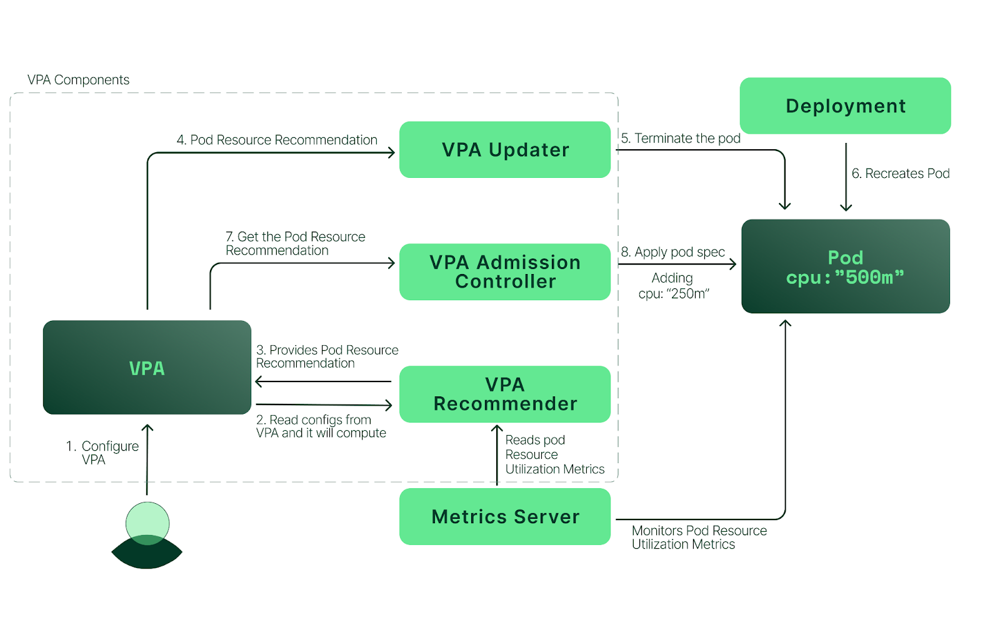

# FINAL REPORT: Tìm hiểu về cơ chế Autoscaling trong Kubernetes

---

### **Author:** *Phùng Hoàng Long* 

---

`Autoscaling` là cách thức tự động tăng/giảm tài nguyên máy tính mà được cấp cho app của chúng ta bất kì thời điểm nào khi cần. Điều này giúp tạo ra những hệ thống trên cloud có khả năng mở rộng 24/24 nhằm đáp ứng nhu cầu sử dụng.

Autoscaling trong Kubernetes có 3 khả năng:

- `Horizontal Pod Autoscaler`: điều chỉnh số lượng replicas của ứng dụng
- `Cluster Autoscaler`: điều chỉnh số lượng Nodes và cluster
- `Vertical Pod Autoscaler`: điều chỉnh giới hạn tài nguyên của container

Trong đó, HPA và CPA là điều chỉnh ở `Pod level` tức là việc scale chỉ ảnh hưởng đến pod.
Còn Cluster Autoscaler sẽ thực hiện scale ở mức `Cluster level`

# I. kiến trúc của Kubernetes

Trước hết cùng tìm hiểu qua về cấu trúc của Kubernetes nhé.


Trong `Kubernetes` cơ bản sẽ chứa các thành phần:
- `Pods`: là một tập hợp các `Containers` đang chạy, đây là đơn vị sẽ yêu cầu được phân các tài nguyên của máy tính như CPU, RAM hay bộ nhớ.
- `Nodes`: là khái niệm dùng để chỉ các máy công nhân dùng để chạy các Container trong Kubernetes.
- `Control plane`: đây là nơi đầu não của `Kubernetes cluster`, nó sẽ là nơi đưa ra quyết định để quản lý vòng đời của các Containers.
- `Cluster`: Một `cluster` bao gồm `Control plane` và một hay nhiều `Nodes`.

Đó là các thành phần cơ bản liên quan đến `Autoscaling`, ngoài ra bạn có thể tìm hiểu thêm tại <a href="https://kubernetes.io/docs/concepts/overview/components/">Đây</a> nhé.

# II. Horizontal Pod Autoscale (HPA)

Trong Kubernetes, HPA sẽ tự động cập nhập tài nguyên của workload để phù hợp với nhu cầu.
`Horizontal scaling` nghĩa là chúng ta phải triển khai nhiều pods hơn để phản ứng với việc tăng tải.Nếu như lượng tải giảm và số lượng Pods nhiều hơn số lượng tối thiểu thì HPA sẽ thực hiện scale down.
HPA được triển khai như một Kubernetes API resource và một controller. HPA controller chạy trong `control plane` sẽ định kỳ điều chỉnh tài nguyên của pods để phù hợp với những thông số thu thập được của CPU, RAM, bộ nhớ hay bất kỳ metric tùy chọn nào được cài đặt.

## Cách thức hoạt động

### 1. Thu thập Metrics

HPA sẽ thực hiện tăng số lượng Pods trong workload của bạn dựa vào một hay nhiều loại metrics sau:
- Tài nguyên sử dụng thực tế: khi thông số CPU, RAM, bộ nhớ của Pod vượt qua một ngưỡng. 
- Số liệu tùy chỉnh: dựa vào bất kỳ metric nào được báo cáo bởi Kubernetes. Điều này hay được áp dụng trong trường hợp ngăn chặn sự kiện nghẽn cổ chai của network.
- Số liệu bên ngoài: dựa vào các metric được cung cấp bới các ứng dụng hay dịch vụ từ bên thứ 3 cho cluster của bạn.

Tất cả những metrics này sẽ được tổng hợp về một `Metrics server`.


Bạn có thể hình dung các bước thu thập metric như sau:
- Các metrics được thu thập bởi các exporter
- Các metrics này được đẩy đến `kubelet`
- `Metrics Server` thu thập metrics thông qua `kubelet`
- Metrics được đẩy đến API server, HPA sẽ gọi API này để lấy các metrics, tính toán để scale pods

### 2. Chu trình scale


Một chu trình hoàn chỉnh để scale được thực hiện như sau:
- [1] Metrics server tổng hợp các thông số từ các pods hiện tại
- [2] Sau mỗi khoảng thời gian nhất định HPA sẽ check các thông số một lần, nếu giá trị rơi vào khoảng thiết lập trong HPA thì nó sẽ tiến hành tăng/ giảm số lượng pods
- [3] Trong trường hợp scale-up, `Kubernetes scheduler` sẽ tạo một pods vào node mà có đủ tài nguyên mà pod yêu cầu
- [4] Nếu không đủ tài nguyên, Cluster auto-scaler sẽ tăng số node lên để đáp ứng với lượng pod mà đang được dự định tạo mới
- [5] Trong trường hợp scale-down, HPA sẽ giảm số lượng pod
- [6] Cluster scaler nếu thấy các node đang "rảnh", và pods của 1 node X nào đó có thể chuyển sang một node khác để tận dụng tài nguyên thì pod sẽ chuyển sang, và node X đó sẽ được xóa (scale-down) đi.

Chúng ta có thể nhận thấy, việc scale-up cũng không chỉ làm tăng số lượng pods mà trong trường hợp nhất định khi các node hiện tại không còn đủ tài nguyên đế scale up nữa thì node mới sẽ được tạo để sử dụng. Việc tạo node mới này do `Cluster Autoscaler` đảm nhận.

### 3. Thuật toán

Câu hỏi của chúng ta ở đây là HPA đã tính toán tài nguyên để thực hiện scale như thế nào?
Để scale một pod thì đầu tiên HPA sẽ dựa vào cấu hình tài nguyên của pod đó. Mỗi một pod sẽ được cấu hình để duy trì lượng tài nguyên mong muốn.
Để scale phù hợp với tình hình hiện tại thì tất nhiên thông số tài nguyên yêu cầu trên các pods hiện tại là rất quan trọng. Công thức để tính số lượng pod cần thiết như sau:

```
Số_Pods_cần_thiết = ceil(Số_pods_hiện_tại * (Thông_số_hiện_tại / Thông_số_mong_muốn))
```

Ví dụ: khi bạn đang sử dụng 2 Pods, bạn muốn duy trì RAM 500MB/Pod nhưng yêu cầu hiện tại là 1300MB, vậy thì:
```
Số_Pods_cần_thiết = ceil(2 * (1300 / 500)) = 4
```
Sau đó HPA sẽ thực hiện scale lên thành 4 Pods cho bạn.

Đó là ví dụ cho việc scale theo cấu hình chỉ có một metric. Việc cấu hình theo nhiều metrics cũng không phức tạp hơn là bao, HPA sẽ tính toán theo nhiều metrics và lấy ra số pods lớn nhất tính toán được.

Trước khi có quyết định về giá trị cuối cùng, control plane cũng sẽ xem sét xem có metrics nào bị mất hay không và bao nhiêu Pods đã sẵn sàng. Toàn bộ những Pods đang trong quá trình bị tắt hoặc loại bỏ sẽ bị loại trừ.

Nếu một Pod bị mất metrics, nó sẽ được xem xét sau. Chúng sẽ được dùng để quyết định lượng điều chỉnh cuối cùng.

Khi scale CPU, nếu Pod chưa sẵn sàng do vẫn đang được khởi tạo hoặc unhealthy cũng sẽ được xem xét sau.

Do hạn chế kỹ thuật, HPA không thể xác định chính xác pod đã sẵn sàng hay chưa khi nó mới được mở. Thay vào đó, HPA sẽ xét Pod là chưa sẵn sàng trong một khoảng thời gian ngắn sau khi Pod được mở. trạng thái chưa sẵn sàng này được biểu diễn bằng một cờ và mặc định tồn tại trong khoảng 30s.

# III. Cluster Autoscaler (CA)

Cluster Autoscaler tự động thêm hoặc loại bỏ các nút trong một cụm dựa trên các yêu cầu tài nguyên từ các pod. Cluster Autoscaler không trực tiếp đo lường các giá trị sử dụng CPU và bộ nhớ để đưa ra quyết định scale up. Thay vào đó, nó kiểm tra cứ sau 10 giây để phát hiện bất kỳ vỏ nào ở trạng thái đang chờ xử lý, cho thấy bộ lập lịch không thể gán chúng cho một nút do không đủ dung lượng cụm.

## Cách thức hoạt động


Trong kịch bản scale up, CA tự động khởi động khi số lượng vỏ đang chờ xử lý (không thể lên lịch) tăng lên do thiếu tài nguyên và hoạt động để thêm các nút bổ sung vào cụm.

- [1] Đầu tiên, có một số pods đang trong trạng thái pending và gửi yêu cầu đến CA.
- [2] CA nhận yêu cầu tăng Nodes và tiến hành triển khai node mới.
- [3] Node mới được tạo ra
- [4] Cuối cùng Kubernetes scheduler sẽ xếp các pod đang pending vào node mới.

# IV. Veticalal Pod Autoscale (VPA)

Khác với HPA, VPA không scale số lượng pods hoạt động mà tăng chính tài nguyên sử dụng của pod đó.

Với VPA, có 2 loại resource configuration mà ta có thể quản lý trên từng container của pods: request, limit.

`request` định nghĩa lượng tài nguyên nhỏ nhất mà container cần sử dụng. Ví dụ như chúng ta cần ít nhất 256MB bộ nhớ để chạy thì Kubernetes sẽ cung cấp tối thiểu là 256MB cho chúng ta.

`limit` định nghĩa lượng tài nguyên tối đa mà container có thể được cấp. Ví dụ như chúng ta cần ít nhất 256MB bộ nhớ để chạy nhưng bạn không muốn container sử dụng quá 512Mb bộ nhớ thì Kubernetes sẽ cung cấp tối đa 512Mb bộ nhớ cho container.

## VPA vs HPA

VPA và HPA khác nhau ở cách mà chúng thực hiện scale.

<table>
    <thead>
        <tr>
            <th>Yêu cầu</th>
            <th>HPA</th>
            <th>VPA</th>
        </tr>
    </thead>
    <tbody>
        <tr>
            <th>Tăng tài nguyên</th>
            <th>Tăng số lượng pods</th>
            <th>Tăng cấu hình tài nguyên của pods</th>
        </tr>
        <tr>
            <th>Giảm tài nguyên</th>
            <th>Giảm số lượng pods</th>
            <th>Giảm cấu hình tài nguyên của pods</th>
        </tr>
    </tbody>
</table>

## Thành phần của VPA
VPA sẽ có 3 thành phần sau:
- VPA Recommender: component này sẽ monitor các tài nguyên đã tiêu thụ trước đó tài nguyên hiện tại để cung cấp giá trị cpu và memory requests gợi ý.
- VPA Updater: component này sẽ kiểm tra Pod được quản lý bởi scalable resource có cpu và memory đúng với giá trị của Recommender cung cấp ở trên hay không, nếu không, nó sẽ kill Pod đó và tạo lại Pod mới với cpu và memory requests đã được cập nhật đúng theo Recommender.
- VPA Admission Controller: thực hiện thay đổi cấu hình của pod trong quá trình pod được khởi tạo.

## Lợi ích
VPA cung cấp những lợi ích sau:
- Thiết lập được giới hạn tài nguyên phù hợp cho khối lượng công việc của bạn, cải thiện sự ổn định và hiệu quả chi phí.
- Các Nodes được sử dụng hiệu quả vì các pod sử dụng chính xác những gì chúng cần.
- Pods được lập lịch trên những node mà có đủ tài nguyên sử dụng.
- Bạn không phải chạy những tác vụ benchmarking  tốn thời gian đề xác định giá trị chính xác cho yêu cầu CPU và bộ nhớ.
- Giảm thời gian bảo trì do autoscaler có thể điều chỉnh CPU và RAM tự động theo thời gian mà bạn không cần can thiệp.

## Cách thức hoạt động

Tổng quan về hoạt động của VPA được biểu diễn như sau:



- [1] Người dùng cấu hình cho VPA.
- [2] VPA Recommender đọc cấu hình VPA và các metrics từ Metrics server.
- [3] VPA Recommender cung cấp cấu hình gợi ý cho pod.
- [4] VPA Updater đọc cấu hình gợi ý
- [5] VPA Updater kết thúc pod
- [6] Khi Deployment nhận ra pod đã bị kết thúc, nó sẽ tái khởi tạo pod để phù hợp với cấu hình replica
- [7] Khi pod đang trong quá trình khởi tạo, VPA Admission Controller sẽ lấy cấu hình được gợi ý bởi VPA Recommender. Vì Kubernetes không hỗ trợ tự động thay đổi giới hạn tài nguyên của pod đang chạy, VPA không thể cập nhật các pod hiện có với các cấu hình mới. Nó chấm dứt các pod đang sử dụng các cấu hình cũ. Khi bộ điều khiển của pod yêu cầu thay thế từ dịch vụ API Kubernetes, VPA Admission Controller sẽ đưa yêu cầu tài nguyên cập nhật và giới hạn giá trị vào đặc điểm kỹ thuật của pod mới. 
- [8] Cuối cùng, VPA Admission Controller thực hiện thêm tài nguyên cho pod.

VPA sử dụng 3 chế độ:
- `updateMode=auto`: Áp dụng trực tiếp gợi ý bằng cách cập nhập hoặc tái tại pods.
- `updateMode=off`: Lưu trữ các gợi ý để tham khảo.
- `updateMode=initial`: Áp dụng gợi ý cho những pods được tạo mới.

## Hạn chế của VPA

VPA có thể hữu ích với nhiều ứng dụng, tuy nhiên có một vài lưu ý cần để ý:
- Không sử dụng VPA cùng với HPA khi cùng sử dụng chung nguồn metrics. Đó là vì khi tài nguyên sử dụng đến một ngưỡng nhất định thì HPA và VPA sẽ cùng xảy ra, điều này sẽ dẫn đến nhiều kết quả không mong muốn và dẫn đến các vấn đề.
- VPA có thể đề xuất nhiều tài nguyên hơn có sẵn trong cluster, do đó khiến pod không được gán cho một nút (do không đủ tài nguyên) và do đó không bao giờ chạy. Để khắc phục hạn chế này, bạn nên đặt LimitRange ở mức tối đa có sẵn. Điều này sẽ đảm bảo rằng các vỏ không yêu cầu nhiều tài nguyên hơn LimitRange định nghĩa.

