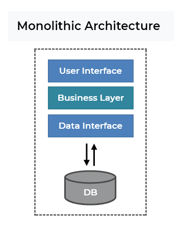

# **MICROSERVICES OR MONOLITHIC ARCHITECTURE?**

### 
*Author: Tran Quang Hai*

## **Table of contents**
<!-- TOC start -->
- [**I. INTRODUCTION**](#i-introduction)
- [**II. THEORETICAL BACKGROUND**](#ii-theoretical-background)
  * [**1. Monolithic architecture** ](#1-monolithic-architecture)
  * [**2. Microservices**](#2-microservices)
- [**III. PRACTICAL EXPERIENCE**](#iii-practical-experience)
  * [**1. Monolithic architecture**](#1-monolithic-architecture-1)
  * [**2. Microservices**](#2-microservices-1)
- [**IV. COMPARISON**](#iv-comparison)
- [**V. REMARKS**](#v-remarks)
<!-- TOC end -->

# **I. INTRODUCTION**

### Microservices, a term that any person who is currently working in IT field, would have heard of at least a few times. So what exactly are people talking about, where are they moving to microservices architecture from, and why people choose microservices?

### My article, despite being relatively short - just like my experience, should give you a brief look about both the trend - microservices and the past - monolithic architecture.

# **II. THEORETICAL BACKGROUND**

## **1. Monolithic architecture** 
<figure>

<figcaption align="center"><i>Monolithic architecture common diagram</i> <i>Source: Monolithic & Microservices Architecture
- Henrique Siebert Domareski</i></figcaption>
</figure>
 

## **Definition**

### *"A monolithic architecture is a traditional model of a software program, which is built as a unified unit that is self-contained and independent from other applications. The word “monolith” is often attributed to something large and glacial, which isn’t far from the truth of a monolith architecture for software design. A monolithic architecture is a singular, large computing network with one code base that couples all of the business concerns together.  To make a change to this sort of application requires updating the entire stack by accessing the code base and building and deploying an updated version of the service-side interface. This makes updates restrictive and time-consuming."*
<b>[Chandler Harris - Microservices vs. monolithic architecture](https://www.atlassian.com/microservices/microservices-architecture/microservices-vs-monolith)</b>

### *"The monolithic architecture is considered to be a traditional way of building applications. A monolithic application is built as a single and indivisible unit. Usually, such a solution comprises a client-side user interface, a server side-application, and a database. It is unified and all the functions are managed and served in one place."*

<b>[Romana Gnatyk - Microservices vs Monolith: which architecture is the best choice for your business?](https://www.n-ix.com/microservices-vs-monolith-which-architecture-best-choice-your-business/)</b>

### => **Main points about monolithic architecture and monolithic applications:**

### - Monolithic architecture is considered to be the traditional way to build applications.
### - An application is built as a single unit.
### - All functionalities are developed in a single codebase and they are usually tightly coupled.

## **2. Microservices**
<figure>

<figcaption align="center"><i>A common diagram for microservice architecture. Source: microservices.io</i></figcaption>
</figure>

## **Definition**

### *"Microservices are an architectural and organizational approach to software development where software is composed of small independent services that communicate over well-defined APIs. These services are owned by small, self-contained teams."*

<b>[Amazon - What are microservices?](https://aws.amazon.com/microservices/)</b>

### *"Microservices are an architectural approach to building applications. As an architectural framework, microservices are distributed and loosely coupled, so one team’s changes won’t break the entire app. The benefit to using microservices is that development teams are able to rapidly build new components of apps to meet changing business needs"*

<b>[Red Hat - What are microservices?](https://www.redhat.com/en/topics/microservices/what-are-microservices#overview)</b>

### => **Main points about microservices architecture:**

### - A system is now composed of multiple small independent services that communicate over well-defined APIs
### - Each microservice can be developed by a small team.
### - Microservices in a system are loosely coupled, each mind their own business.

# **III. PRACTICAL EXPERIENCE**

### For the past few years, I have participated in several projects that use those architectures. Even though my experience is not as much as any senior developers, I still believe that it can be helpful at least for my own and hopefully it can help anyone who reads this article.

## **1. Monolithic architecture**

### Every projects I participated in that used monolithic architecture are classroom-level, but they still give me some invaluable experience.

## 1.1. First Project - Working example
### For the first project, my team and I developed an application that visualize graph algorithms:

<figure>
</img>
<figcaption align="center"><i>UI</i></figcaption>
</figure>

<figure>
</img>
<figcaption align="center"><i>Use Case Diagram</i></figcaption>
</figure>

### This application did not require any database to run, so it was still fine for us to put everything in one single codebase and got away with it. The whole project was written in Java, so the User Interface was not very fancy, but the app worked.

### However, the project only required us to illustrate 3 algorithms. If the requirements had been wider (10 - 20 algorithms maybe?), it would have been a lot more difficult to expand.

## 1.2. Second Project - Bad practice

### The honeymoon with monolithic architecture ended when I participated in the second project - still classroom-level, but for this one we needed to use a database and a friendly UI, and this time, things were messy.

### Our naive team did what IT college students usually do when they do a project at the university: Bundle everything in one single codebase - Frontend, Backend, Authentication,... EVERYTHING! and we took system designing process for granted 

|||
|:-:|:-:|
|</img>|</img>

<figcaption align="center"><i>A single package</i></figcaption>

### Literally, everything was there, from CSS files, fxml files (kinda like HTML, but worse) to Java code.

### With this level of organization, there were no surprise that the project became a mess.

### - Completely impossible to isolate errors
### - Git workflow became difficult to manage

## **2. Microservices**

### Life with monolithic architecture was hard, but that does not mean microservices would be a pinky world.

## 2.1. First Project - Bad Practice

### I was very excited to participate in a start-up project that used microservice architecture, especially when I saw the GitLab organization page which had like 20+ repositories. I was naive, still...

<figure>
</img>
<figcaption align="center"><i>GitLab organization page - 26 repositories</i></figcaption>
</figure>

### Despite having 20+ repositories, there still exists several services that are not really "micro", for example:

<figure>

</img>

<figcaption align="center"><i>ERD with 80+ entities</i></figcaption>
</figure>

### One single "microservice" that managed 80+ tables in a database which made me - a new team member found it very difficult to understand the code. Also, with 80+ entities, it is completely impossible to have any kind of UML diagram or document that can explain the application, especially for a miserable fresher like me.

|||
|:-:|:-:|
|</img>|</img>|
<figure>

<figcaption align="center"><i>80+ Java classes for entities</i></figcaption>
</figure>

### 20+ of them have the names "Quarter..." and were used for statistical queries. They should appear in another microservice instead.

### Looking back at the diagram still gives me nightmares, but for now, after having a better understanding of the architecture, I am pretty confident that if I am able to redesign this project, I would do a lot better than the one I had to work with before.

### Despite having 80+ tables, as we all can see from the ERD, those entities are loosely coupled, so it should be totally fine to separate them into several more microservices, at least for authentication and statistics-related entities.

### Even though the first experience was not very good, I still find the elegance in this architecture and then apply it to two other projects that I participate, one as a leader and one as the only developer (my graduation research project).

## 2.2. Second and Third Project - Working example

### The second one, which I led:

|   |  |
|:-------------------------:|:-------------------------:|
|<figure></img></figure>|<figure></img></figure>|

<figcaption align="center"><i>List of repositories</i></figcaption>

### Each microservice can be developed by one single developer, and he/she can use whatever language that he/she feels confident about.

### Also, for microservice projects that are developed by a team, communication becomes very important (in my case there are 10 people), so we need to use a different way to distribute the tasks and track the progress, and Jira was the chosen one.

<figure>
</img>
<figcaption align="center"><i>Jira EPIC</i></figcaption>
</figure>

### The third one - my graduation research project:

<figure>
</img>
<figcaption align="center"><i>Component Diagram</i></figcaption>
</figure>

### This project, even though is being developed by me alone, things are still going pretty well.

### Each microservice is pretty small in terms of codebase, so any new member should be able to understand and contribute after a short time.

<figure>
</img>
<figcaption align="center"><i>An example - Only two files and the code is relatively short</i></figcaption>
</figure>

### Why do those boundaries between services exist so that we can divide them?

### Let's revisit a famous and familiar concept, Separation of Concerns, which was first coined by Dijkstra:

### *"Let me try to explain to you, what to my taste is characteristic for all intelligent thinking. It is, that one is willing to study in depth an aspect of one's subject matter in isolation for the sake of its own consistency, all the time knowing that one is occupying oneself only with one of the aspects. [...]* 

### *It is what I sometimes have called "the separation of concerns", which, even if not perfectly possible, is yet the only available technique for effective ordering of one's thoughts, that I know of. This is what I mean by "focusing one's attention upon some aspect": it does not mean ignoring the other aspects, it is just doing justice to the fact that from this aspect's point of view, the other is irrelevant. It is being one- and multiple-track minded simultaneously."*

### <b>Edsger W. Dijkstra, 1974, "On the role of scientific thought"</b>

### "From this aspect's point of view, the other is irrelevant", ask this question when facing a sub-problem that needs to be resolve. For example:

### - Do we need to know anything about a store's customers when we authorize the owner of it? No? Then let the authentication API and customer information API belongs to two different microservices.

### - Do we really need to know anything about user's information to show them a news on a news site (vnexpress for example)? No? Then let the user's details API and news API belongs to two different microservices.

# **IV. COMPARISON**

| Monoliths      | Microservices |
| :-----------: | :-----------: |
| Single codebase      | Multiple services - multiple codebases       |
| Scaling by adding replica nodes with the whole application | Each service can be scaled independently |
| Difficult to understand for new team members      | Easier for new members to start working on a small service      |
| Barrier to new technologies | Newer technologies |
| Faster communication between functions | Slow communication between services* |
| Usually use only one programming language | Flexible in terms of language |
| Easy for testing | Difficult to test (needs to create mock services to test one service) |
| Easy to trace errors and exceptions      | Tracing errors and exceptions is difficult      |
| Easier deployment (single packaged application)*  | Difficult to deploy (have to run all microservices to make the system function as expected)        |
| Updating a function requires redeploying again the whole application | Only need to redeploy the updated service |
| Lower initial costs | Higher initial costs* |

<b>*</b> Microservices usually use communication via network interfaces while Monoliths application functions communicate internally. Read/Write speed of hardware (RAM or SSD) should always be faster than communication over the Internet.

<b>*</b> Even though deployment for monoliths is easier, it requires downtime for the whole system for an update. [Rolling updates](https://cloud.google.com/kubernetes-engine/docs/how-to/updating-apps) can be performed, but still a larger portion of computing power needs to be "down" for an update. E.g: With 4 identical servers, we only have 75% computing power left during update time with monolithic structure, while for microservices, it would only affect one single service and one single server at a time with rolling updates.

<b>*</b> If we take [opportunity cost](https://www.investopedia.com/terms/o/opportunitycost.asp#:~:text=our%20editorial%20policies-,What%20Is%20Opportunity%20Cost%3F,choosing%20one%20alternative%20over%20another.) into consideration, it would be favourable for microservices. Although monoliths are easier to deploy, that does not mean those applications can be deployed frequently as each redeployment requires a longer testing process. Faster updates => More new features come out and more bugs are fixed.

# **V. REMARKS**

### Both architectures have their own strengths and drawbacks. But we can only utilize their strengths with <b>a clear system design and a cohesive way to manage and communicate between team members</b>, otherwise <b>no architectures</b> can save <b>a badly managed and poorly designed project</b>.

 

### **For monolithic projects**:

### - Be very careful when choosing monolithic architecture for any project. This architecture should only be applied to small and simple applications that serve a very narrow purpose.

### - Monolithic architecture also limits the choice about technology stack, including programming languages => frameworks and tools. Narrow range of technology also means you can only hire developers with very specific experience, and it can also limit their potential to contribute.

### - If an application reaches a point where the codebase starts to become confusing, it's a good sign to move to microservices architecture.

### **For microservices projects**:

### - Pay attention to the size of those microservices, otherwise they will be too large which make the architecture's benefits disappear.

### - A "microservice" can still reach a point where it becomes "macro", and that's when we need to divide it into multiple smaller services.

### - It is known as a "luxury" solution which would be very suitable for large projects. However, as it inherits the characteristics of ["Divide and Conquer"](https://www.slideshare.net/danieljacobson/netflix-api-separation-of-concerns) motto, small teams or even individuals are still able to implement microservices as long as their system design process returns a clear picture about those components. 

### - It is relatively rare to see a project moving back to monolithic architectures after applying microservices.

### - Microservices architecture is more prone to security threats since there are more servers to pay attention to and developers also need to configure access matrix for each service properly