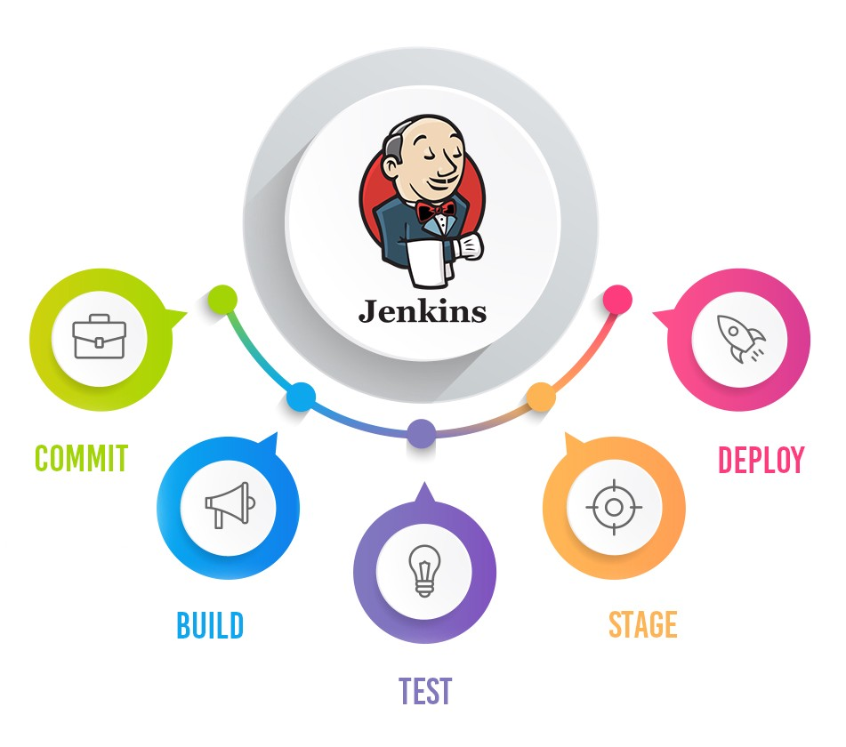
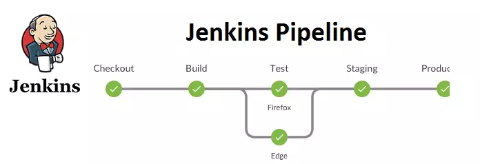
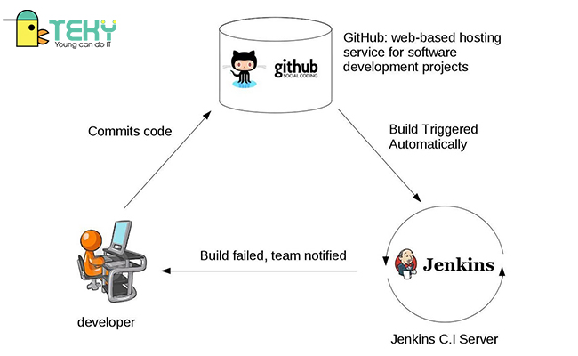
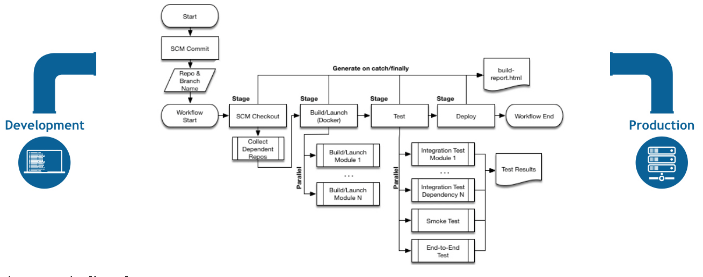
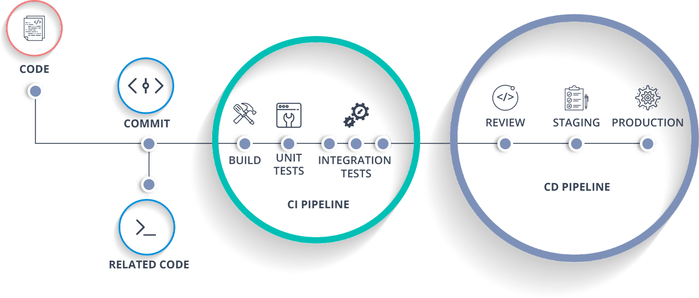
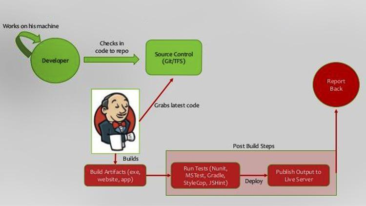
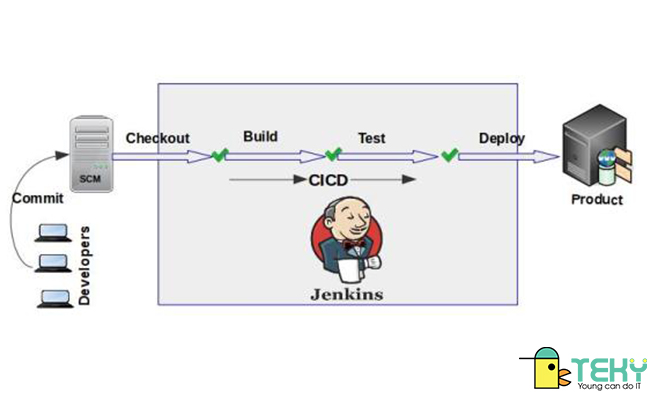

# Practice 6: Phân tích thiết kế cách thức hoạt động và các ưu nhược điểm của giải pháp CI/CD trong Jenkins   
----   
## Mục lục    
  
[1. Giới thiệu về Jenkins](#GioithieuveJenkins)     
[2. CI/CD trong Jenkins là gì](#CI/CDJenkinslagi)     
[3. Cách thức hoạt động của  Jenkins](#PTTKcachthuchoatdongJenkins)  
[4. Ưu nhược điểm của Jenkins](#Uunhuocdiem)               
[5. Tài liệu tham khảo](#tailieuthamkhao)     

-----   

## 1. Giới thiệu về Jenkins   
- Jenkins là một mã nguồn mở có khả năng thực hiện tích hợp liên tục (Continuous Integration, viết tắt là CI), và xây dựng những tác vụ tự động hóa. Nó được sử dụng để triển khai Tích hợp liên tục (CI) và Chuyển giao liên tục (CD) cho bất kì dự án nào.

- Nó có thể tích hợp nhiều mã nguồn của tất cả các thành viên trong nhóm một cách nhanh chóng, liên tục, theo dõi quá trình thực thi, trạng thái triển khai bằng các bước kiểm tra (như Integration test, và units test). Điều này góp phần hoàn thiện sản phẩm, giúp chúng hoạt động ổn định.
- Nó được sử dụng để thực hiện các workflow CI/CD (gọi là các pipelines).
   
- Các pipelines tự động hóa quá trình test, report những thay đổi độc lập trong code base lớn. Ngoài ra, nó còn hỗ trợ việc tích hợp các nhánh riêng biệt của code thành một nhánh chính. Pipelines còn liên tục phát hiện các lỗi, build, tự động test, chuẩn bị code base cho việc deploy. Cuối cùng, các code được deploy đến container và máy ảo, cũng như bare metal và các server cloud.

- Jenkins giúp tự động hóa các quy trình trong phát triển phần mềm, hiện nay được gọi theo thuật ngữ tích hợp liên tục. Jenkins là một phần mềm dạng server, chạy trên nền serlver với sự hỗ trợ của Apche Tomcat. Nó hỗ trợ hầu hết các phần mềm quản lý mã nguồn phổ biến hiện nay như Git, Maven, Gradle,…

- Việc kích hoạt build dự án phần mềm bằng Jenkins có thể thực hiện bằng nhiều cách: dựa trên các lần commit trên mã nguồn theo các khoảng thời gian, kích hoạt qua các URL.
## 2. CI/CD trong Jenkins là gì          
### CI Jenkins là gì?
- CI viết tắt của Continuous Integration là phương pháp phát triển phần mềm yêu cầu các thành viên trong team tích hợp công việc thường xuyên, mỗi ngày ít nhất một lần. Mỗi tích hợp được build tự động (gồm cả test) nhằm mục đihcs phát triển lỗi nhanh chóng. Và nó giúp cho quá trình làm việc được tích hợp và phát triển hiệu quả.
  
- Quy trình làm việc của CI:

  + Tất cả các thành viên trong team dev sẽ bắt đầu pull code từ repo về branch để có thể thực hiện được các yêu cầu chức năng nhất định.
  + Quá trình lập trình và test code để đảm bảo được chất lượng toàn bộ source code.
  + Sau khi thành viên code xong có thể làm việc commit vào branch của team.
  + Sau đó, các thành viên thực hiện cập nhật code mới từ repo về local repo.
  + Merge code sẽ sẽ giải quyết được conflict.
  + Xây dựng và đảm bảo code pass thông qua các tests ở local.
  + Commit code lên repo.
  + Các server CI sẽ theo dõi các thay đổi code từ repository và có thể tự động build/test. Sau đó, sẽ thông báo lại cho các thành viên trong team.
-   
### CD Jenkins là gì?    
- CD viết tắt của Continuous Delivery hay gọi đơn giản “chuyển giao liên tục” là quá trình triển khai tất cả thay đổi trong quá trình tự động test và deloy các code lên các môi trường staging và production. Ngoài ra, CD còn cho phép tự động hóa phần testing bên cạnh việc sử dụng units test. Với mục đích là thử nghiệm phần mềm liên tục để kiểm tra hệ thống trước khi public cho khách hàng.  
- Các lỗi được giảm thiểu vì các bước kiểm tra đã được tích hợp vào Jenkins. Jenkins mô tả một trạng thái mong muốn và máy chủ tự động đảm bảo việc thực hiện nó. Ngoài ra, tốc độ release có thể được cải thiện khi mà quá trình deploy không còn bị hạn chế bởi việc giới hạn nhân sự. Cuối cùng, Jenkins giảm thiểu áp lực cho các nhóm phát triển và điều hành. Bởi vì họ không còn phải cho ra sản phẩm của mình vào giữa đêm hay cuối tuần nữa.    

    

## 3. Cách thức hoạt động của Jenkins    
  
- Jenkins là một ứng dụng dựa trên máy chủ và đòi hỏi phải có một máy chủ web như Apache Tomcat để chạy trên các nền tảng khác nhau như Windows, Linux, macOS, Unix,..
-  Jenkins yêu cầu Java 8 VM trở lên và có thể chạy trên Oracle JRE hay OpenJDK. Thông thường, Jenkins vận hành như một Java servlet trong một máy chủ ứng dụng Jetty. Không những vậy, nó còn có thể chạy trên các ứng dụng Java khác như Apacha Tomcat. Gần đây, Jenkins đã được điều chỉnh để có thể vận hành trong một Docker Container.
- Để sử dụng Jenkins, bạn cần tạo các đường dẫn gồm một loạt các bước mà một máy chủ Jenkins sẽ nhận. Tích hợp liên tục là một công cụ mạnh mẽ bao gồm một bộ công cụ được thiết kế để lưu trữ, giám sát, biên dịch và kiểm tra mã hoặc các thay đổi mã.
  + Máy chủ tích hợp liên tục, ví dụ như: Jenkins, Bamboo, CruiseControl, TeamCity,..
  + Công cụ kiểm soát nguồn, ví dụ như: CVS, SVN, GIT, Mercurial, Perforce, ClearCase và các công cụ khác
  + Công cụ xây dựng, ví dụ như: Make, ANT, Maven, Ivy, Gradle và các công cụ khác
  + Framework kiểm tra tự động hóa, ví dụ như: Selenium, Appium, TestComplete, UFT và những thứ khác
- Để vận hành Jenkins, các pipeline sẽ được tạo ra. Pipeline là một chuỗi các bước server Jenkins cần thực hiện cho các tác vụ của CI/CD. Chúng được lưu trữ trong một file văn bản Jenkinsfile. Jenkinfiles sử dụng cú pháp ngoặc nhọn, tương tự như JSON. Các bước trong pipline được khai báo dưới dạng câu lệnh có chứa tham số. Chúng được “chứa” trong các dấu ngoặc nhọn “{}”. Sau đó, máy chủ Jenkins đọc các Jenkinsfile và thực hiện các câu lệnh, đẩy mã xuống pipeline từ source code. Một tệp Jenkinsfile có thể được tạo thông qua một GUI hoặc trực tiếp viết code. 

  
## 4. Ưu nhược điểm của Jenkins     
### Ưu điểm    
- Jenkins đang được quản lý rất tích cực. Mỗi tháng, công ty phát hành Jenkins sẽ tổ chức các cuộc họp công khai và lấy ý kiến đóng góp từ cộng đồng để phát triển dự án Jenkins.
- Jenkins đã có khoảng 320 Plugin được xuất bản trong cơ sở dữ liệu Plugin của mình.
- Công cụ Jenkins cũng hỗ trợ kiến trúc đám mây để bạn có thể triển khai Jenkins trên các nền tảng dựa trên đám mây.
- Tích hợp với nhiều nền tảng CI/CD và giúp cho team được đồng bộ hóa
- Rất dễ dàng để tìm ra các lỗi trong Jenkins. Nhà phát triển có thể kiểm tra lỗi và giải quyết chúng nhanh chóng.
- Rút ngắn thời gian bàn giao dự án và linh hoạt trong công việc
- Jenkins hỗ trợ các loại kho mã nguồn khác nhau như SVN, Git, v.v. Nhà phát triển có thể đặt các trình kích hoạt khác nhau sau khi thực hiện các thay đổi trong mã.

### Nhược điểm
- Giao diện của Jenkins đã lỗi thời và không thân thiện với người dùng so với xu hướng hiện tại.
- Việc quản lý bảng điều khiển Jenkins khá khó khăn khi chúng ta có quá nhiều công việc phải thực hiện.
- Việc bảo trì Jenkins không dễ dàng vì phần mềm này chạy trên một máy chủ và yêu cầu một số kỹ năng như quản trị viên máy chủ để giám sát hoạt động của nó.
- Gặp một số khó khăn trong việc cài đặt và cấu hình Jenkins.
- Bạn phải tự mình bảo trì cơ sở hạ tầng.
- Tích hợp liên tục thường xuyên bị hỏng do một số thay đổi nhỏ trong cài đặt.
- Các thay đổi do một nhà phát triển thực hiện sẽ được không hiển thị với một nhà phát triển khác trong nhóm và chỉ có người quản lý mới có quyền truy cập. Điều này làm cho việc theo dõi dự án lớn gặp khó khăn.
## 5. Tài liệu tham khảo  
[1] https://vietnix.vn/jenkins-la-gi/    
[2] https://applitools.com/blog/what-is-jenkins-how-to-use-jenkins-ci-testing/#:~:text=Jenkins%20is%20a%20popular%20open,by%20automating%20tasks%20like%20testing.   
[3] https://wiki.jenkins-ci.org/display/JENKINS/Use+Jenkins

    
