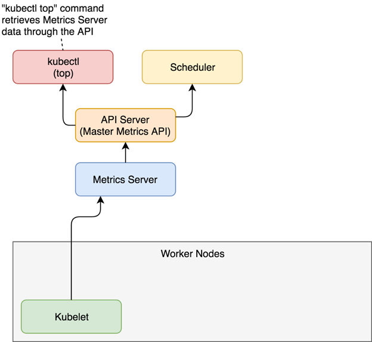

#Contents

####I/ Kubernetes(k8s) Overview.

#####1.	Definitions.

#####2.	Who will need Kubernetes?	

#####3.	Architecture.

#####3.1 Master node.

#####3.2 Node Server.

####II/ Scalability/ HA and AutoScaling.

#####1. Scalability/ HA.

#####1.1 Vertical Scalability.

#####1.2 Horizontal Scalability.

#####2. AutoScaling.

#####3.	HPA.

#####4. Metrics Server.

#####5.	Cluster Auto-Scaler.

#####6. Scaling process in details

#####7. Alogorithm details

####III/ Demo

#####1. Install metrics server

#####2. Run and expose php-apacher server and HPA

#####3. Increase load

#####4. Custom metrics

####IV/ References

#I/ Kubernetes(k8s) Overview

 

##1.	Definitions: 

This is what I found on Wikipedia:

 *"Kubernetes is an open-source container-orchestration system for automating computer application deployment, scaling, and management"*

So, Kubernetes works with containers, which are replacement for Virtual Machines (VMs) and they make it more efficient to use the resources of your hardware infrastructure. 

However, the architecture has its challenges that processes and applications still need to be properly separated, which is more difficult with Kubernetes than VMs.

 Another problem is that you have too many containers to manage in manual way. K8s is designed to work a set of independent applications, to help when there are large numbers of independent applications that need to be set up and scaled together.

##2.	Who will need Kubernetes?

- Big enterprises who in need of scaling quickly and have used containers (docker). 

- Projects need to run more than 5 containers of the same type for 1 service.  

- The smaller is the best not to used. As they say, “The benefits outweigh the costs is small”, Kubernetes will only cause more expenditure, both in time and resources.

- Modern startups that invested in technology, just in case their companies might grow very fast.

##3.	Architecture:

K8S Cluster consists of many nodes, each node will need to run a "kubelet", the program to run K8S. 

 

So, we need a server to "own" cluster, called master node, which install API server, scheduler ... The remaining nodes will run Kubelet to produce containers.
 
###3.1 Master node:

####3.1.1 API Server

True to its name, API Server provide K8s API. It is responsible for placing POD in node, synchronizing POD information with Rest API and receiving the installation of POD/Service or Replication Controller.

####3.1.2 Service

Scheduler Service is responsible for supervising the resources used on each server. Thus, it makes sure that the system is not overloaded. Scheduler Service knows the total resources available on each server, as well as the resources which are allocated to assign workloads on each server.

####3.1.3 Controller Manager Service

It manages all controllers to handle common tasks in the cluster including Node Controller, Replication Controller, Endpoints Controller, Service Account and Token Controllers. Details of these tasks are recorded in etcd, where the controller manager follows the change through the server API.

####3.1.4 Etcd

Consistent and highly-available key value store used as Kubernetes' backing store for all cluster data. Có thể liên kết cài đặt với từng node thông qua etcd.

###3.2 Node Server 

####3.2.1 Pod

 

POD is a group (more than 1) containers that do a certain job, like running a software. This group shares storage space, IP address together. POD is created or deleted depending on the requirements of the project.  
 
####3.2.2 Service 

 

Because the POD has a short life, it does not guarantee that the IP address is always fixed. This makes communication between microservice difficult. Therefore, K8S introduces a service, it is a layer located on some pod groups. It is fixed with a static IP address and can point to this service. Here we can perform the load balance. Each service will be assigned a domain selected by users

####3.2.3 Persistent Volumes

Anyone who works with container needs to understand that we do not save data on the container but somewhere else. The reason is that when container restart or die, the data will also lose. 

The K8S solution used is the "network" storage system ~ saving data into another storage system like NFS, Glusterfs, Ceph ... 

PV is a virtual concept, giving a necessary capacity, which the application requires. When a PV satisfies the requirements of a PVC, they "match" each other, then "bound" and connect to each other.  

####3.2.4 Namespaces

This is a tool used to group or separate object groups. Namespaces is used to control access to Network access, resource management and quoting.

####3.2.5 Ingress rules

Manage inbound /outbound network into services and pods.

####3.2.6 Network policies

Define network access rules between pod inside cluster.

####3.2.7 ConfigMaps and Secrets

A software rarely runs without configuration. Configmap is the solution to stuff a config file / set environment variable or set argument when calling the command. Configmap is a config lump, which pod needs, it is easy to share configuration files.

Secret is to store passwords, tokens, ... or what you need to keep secret.

####3.2.8 Controllers

-  Deployment

-  DaemonSet: The service needed to run on every nodes. 

-  StatefulSet: A “manifest file” place in a folder which indicated by kubelet, these PODs will be running when Kubelet runs.

#II/ Scalability/ HA and AutoScaling

##1.	Scalability/ HA

**Scalability** is an ability of application/system that can handle greater loads by adapting. 

**High Availability (HA)** is the ability of application remains available with no interruption.

 *=> HA usually goes with horizontal scaling*


###1.1	Vertical Scalability 

It is the ability to increase the size of the instance

 
 
Mostly used for non-distributed system like DATABASE, RDS

###1.2 Horizontal Scalability 
 
It is the ability to increase the number of instances/system for your application

 

Used for microservices based application - distributes applications

##2. AutoScaling

Auto-scaling is a way to automatically increase/decrease computer resources that are granted to our app at any time when needed. This helps create systems on Cloud with the ability to expand 24/24 to meet the needs of use.

##3. HPA 

Horizontal Pod Autoscaler (HPA) – True to the name, this is a pod horizontal scaling operator.

Compared to the traditional model of “hard-fixed” number of Pods, HPA brings up many benefits in economic. HPA can automatically increase/ decrease the system configuration to adapt with the workload (the level of the end-user) which usually changes dramatically and very difficult to predict.

When the number of traffic on the night system decreases, the pods can be set into the Sleep Mode (Sleep Mode to turn on immediately to deal with the abnormal increase from traffic).

##4. Metrics Server

Metrics Server is a scalable, efficient source of container resource metrics for Kubernetes built-in autoscaling pipelines.
  
   
  
The process on diagram are described as below:

- Metrics (RAM, CPU) are collected from Pods 

- These metrics are then pushed to kubelet

- Metrics Server collects the metrics via Kubelet 

- Metrics are pushed to the API server, HPA will call this API to get the metrics, calculated to Scale Pods.

*Note : Metrics Server is not meant for non-autoscaling purposes or horizontal autoscaling based on other resources than CPU/Memory*

##5. Cluster Auto-Scaler

Cluster Autoscaler is a tool that automatically adjusts the size of the Kubernetes cluster when one of the following conditions is true:
  
- There are pods that failed to run in the cluster due to insufficient resources.

- There are nodes in the cluster that have been underutilized for an extended period of time and their pods can be placed on other existing nodes.

Basically, when the HPA increases the number of pods, the number of nodes also needs to be increased to meet this new number of pods. Cluster Auto-Scaler take responsibility for this work.

The CA version is recommended to match with K8s version

##6. Scaling process in details


- Metrics Server summarizes parameters from current pods

- HPA will check the parameters each 15 seconds, if the value falls into the threshold in HPA, it will increase/ decrease the number of Pods

- In the case of scale-up, Kubernetes Scheduler will create a pods into the node that has enough resources that POD requires

- If there is not enough resources, Cluster Auto-Scaler will increase the number of nodes to meet the amount of POD that is being planned to create a new.

- In the case of scale-down, HPA will reduce the number of pods
Cluster scaler, if it see the nodes are "free", and the pods of a certain node X can move to another node to take advantage of the resource, the POD will switch and that X will be deleted (scale-down).

##7. Alogorithm details

HPA will (by default) every 15 seconds check the CPU/ Memory parameters used on current Pods, and compare with its configuration.

The specific formula is as follows

    desiredReplicas = ceil[currentReplicas * ( currentMetricValue / desiredMetricValue )]

In this calculation, CEIL is a rounded math.

For example, you want RAM to maintain at 500MB, but currently the demand increases to 700MB, the current Pods is 1, then

DesiredPods = ceil [1 * (700/500)]

Obviously, the number of PODs will need to be proportional to the current parameters, the current parameters are measured but higher than the desired level, the system is overloaded, need to scale up, and vice versa.
 
Howerver, before checking the tolerance and deciding on the final values, the control plane also considers whether any metrics are missing, and how many Pods are Ready. All Pods with a deletion timestamp set (objects with a deletion timestamp are in the process of being shut down / removed) are ignored, and all failed Pods are discarded.
 
 
#III/ Demo

I do this lab with the following rerequisite:

- Kubernetess ver 1.22.6 (Running in Azure platform)

- 1 node pool: Standard_D2_v2  (CPU:2, RAM 7 GB, SSD: 100 GB)

## 1. Install metrics server

To install the latest Metrics Server release from the components.yaml manifest, run the following command.

    kubectl apply -f https://github.com/kubernetes-sigs/metrics-server/releases/latest/download/components.yaml

After that run that command to check if metrics server are deployed

     kubectl get deployment
     

 
 
## 2. Run and expose php-apacher server and HPA

Create a Dockerfile. In this dockerfile I make a custom container image that uses the php-apache image from Docker Hub.
 

    FROM php:5-apache
    COPY index.php /var/www/html/index.php
    RUN chmod a+rx index.php


 Next, create a simple index.php. You can understand this text defines a loop which helps in our simulation about increase the workload.
 
    <?php
     $x = 0.0001;
     for ($i = 0; $i <= 1000000; $i++) {
       $x += sqrt($x);
     }
     echo "OK!";
    ?>

Then, after you have the container image, we gonna start the deployment using container running on that image.

And I also deploy the HPA with that manifest.

Let create the php-apache.yaml


    apiVersion: apps/v1

    kind: Deployment

    metadata:

      name: php-apache

    spec:

      selector:

        matchLabels:

          run: php-apache

      replicas: 1

      template:

        metadata:

          labels:

            run: php-apache

        spec:

          containers:

          - name: php-apache

            image: k8s.gcr.io/hpa-example

            ports:

            - containerPort: 80

                resources:

              limits:

                cpu: 500m

              requests:

                cpu: 200m

    ---

    apiVersion: v1

    kind: Service

    metadata:

      name: php-apache

      labels:

        run: php-apache

    spec:

      ports:

      - port: 80

      selector:

        run: php-apache
        
    ---
    apiVersion: autoscaling/v1

    kind: HorizontalPodAutoscaler

    metadata:

      name: php-apache

    spec:

      scaleTargetRef:

        apiVersion: apps/v1

        kind: Deployment

        name: php-apache

      minReplicas: 1

      maxReplicas: 10

      targetCPUUtilizationPercentage: 50
      
      
  So in this yaml file, I define the php-apache deployment and service running on port 80, starting with 1 replicas.
  
  The HPA was also set up for php-apache service with the number of replicas minPod =1 and maxPod =10. The conditions for scaling is CPU percentage >50%.
  
 Result:
   
   
   
   We can see that the current CPU consumption is 0% as there are no clients sending requests to the server
   
   
   
   
  
 ##3. Increase load 
 
 To increase load, I make the Pod runs in an infinite loop, sending queries to the php-apache service.
 
 The command is recommended to run in another terminal. So that we can observe the increase process and follows next steps
 
     kubectl run -i --tty load-generator --rm --image=busybox:1.28 --restart=Never -- /bin/sh -c "while sleep 0.01; do wget -q -O- http://php-apache; done" 
    
 
 
 Then check the current status of the newly-made HorizontalPodAutoscaler, by running:
 
     kubectl get hpa
         
     kubectl get rs
 
 and watch the number of pods scaled
 
 
 
 It might takes a few minutes for waiting. Here, CPU consumption has increased to 228% of the request. As a result, the Deployment was resized to 5 replicas.
 
 Then stop the loading in the other terminal by press Ctrl+C, waiting for a few minutes and check it again to make sure the system is scaled down.
 
  
 
##4. Custom metrics

In this part, I'm gonna use the very common Requests per Second (RPS) Custom Metric for scaling

First for the hpa.yaml

```
apiVersion: autoscaling/v2
kind: HorizontalPodAutoscaler
metadata:
  name: rps-sample
spec:
  scaleTargetRef:
    apiVersion: extensions/v1beta1
    kind: Deployment
    name: rps-sample
  minReplicas: 2
  maxReplicas: 10
  metrics:
  - type: Pods
    pods:
      metricName: rps
      targetAverageValue: 10
```
This file have the same format with previous version but using array *metrics* instead of *targetCPUUtilizationPercentage*. 
The CPU utilization metric is a resource metric, since it is represented as a percentage of a resource specified on pod containers.

There are 3 types of metrics: *resource*, *pod metrics* and *object metrics* and 2 types of *target.type* : *AverageValue* and *Utilization* 

In this case, we use pod metrics. These metrics describe Pods, and are averaged together across Pods and compared with a target value to determine the replica count. They work much like resource metrics, except that they only support a target type of AverageValue.

The deployment and service rps-deployment.yaml

```
apiVersion: apps/v1
kind: Deployment
metadata:
  name: rps-sample
spec:
  selector:
    matchLabels:
      app: rps-sample
  template:
    metadata:
      labels:
        app: rps-sample
    spec:
      containers:
      - name: rps-sample
        image: jsturtevant/metric-rps-example
        env:
          - name: INSTRUMENTATION_KEY
            valueFrom:
              secretKeyRef:
                name: appinsightskey
                key: instrumentation-key
---
kind: Service
apiVersion: v1
metadata:
  name: rps-sample
spec:
  selector:
    app: rps-sample
  ports:
  - port: 80
    targetPort: 8080
  type: LoadBalancer

---
apiVersion: azure.com/v1alpha2
kind: CustomMetric
metadata:
  name: rps
spec:
  metric:
    metricName: performanceCounters/requestsPerSecond
``` 

Results:

 
 
 
 
  

So, the load balancer has a external IP as 40.88.51.203 as the picture show.

To increse the load in http tool, run this command to pushing some load. Same as previous part, this is recommended to run in another terminal.

  

 Then check the hpa and watch it scale. It may takes few minutes
 
   
   
 The threshold is 10, so when targets is 36/10, number of replicas = 4.
   
   
   
III/ References

 - [Kubernetess](https://viblo.asia/p/phan-1-gioi-thieu-ve-kubernetes-924lJO6m5PM)
 - [Autoscaling in k8s](https://viblo.asia/p/hieu-co-ban-khai-niem-auto-scale-cua-k8s-maGK73rbKj2)
 - [Kubernetess docs - HPA](https://kubernetes.io/docs/tasks/run-application/horizontal-pod-autoscale/)
 - [Demo source](https://kubernetes.io/docs/tasks/run-application/horizontal-pod-autoscale-walkthrough/)
 - [Custom metrics - Tutorial Video](https://www.youtube.com/watch?v=XcKcxh3oHxA)

 
