# Final phase 1
## Topic: Docker security

Author: **Vo Minh Thien Long**

----        
## Table of contents
[I. Overview](#overview)

- [1. Container isolation versus Virtual machine isolation](#docker-vm)
- [2. Docker security](#docker-security)

[II. Secure aspects of core components](#secure-aspects)

- [1. Host operating system (layer 1)](#host-os)
- [2. Docker daemon (layer 2)](#docker-daemon)
- [3. Docker registries (layer 2)](#docker-registries)
- [4. Docker images (layer 3)](#docker-images)
- [5. Docker containers (layer 3)](#docker-containers)
- [6. Inter-container security (layer 4)](#docker-inter-containers)

[III. Security vulnerabilities of Docker could be exploited](#security-vulnerabilities)

- [1. Application running on a Docker container](#application)
- [2. Docker container](#container)
- [3. Container host](#host)

[IV. Best practices](#best-practices)

- [Securing the host OS](#best-practices-host)
- [Securing the container images](#best-practices-images)
- [Securing the container runtime](#best-practices-runtime) 


[V. Conclusion](#conclusion)

[VI. References](#references)

---- 

## I. Overview
<a name='overview'></a>

> Docker containers are, by default, quite secure;

This quote is quoted from the official document of Docker. In this report, we find out is the statement current
follow 3 questions:

1/ Which core components participate in which security aspects of Docker, and how?

2/ What are the security vulnerabilities of Docker that could be exploited to attack the application running on a 
Docker container, the container itself or the container host?

3/ What practices should be done to reduce security risks when using Docker container?

### 1. Container isolation versus Virtual machine isolation
<a name='docker-vm'></a>

In Docker containers, each application or container is isolated from others, may make you think that is more security.
In fact, they still use the same root. This provides the advantage of simplified management, although it also leads to a 
few disadvantages. For instance, if the root is compromised, the host containers could be at risk. 

Compare to Virtual machine, Docker does have a lower level of isolation than a virtual machine due to the way it shares 
the kernel with the host.  So if the code you are running contains a kernel or physical hardware exploit, that could
access the host. 

<div align="center">
  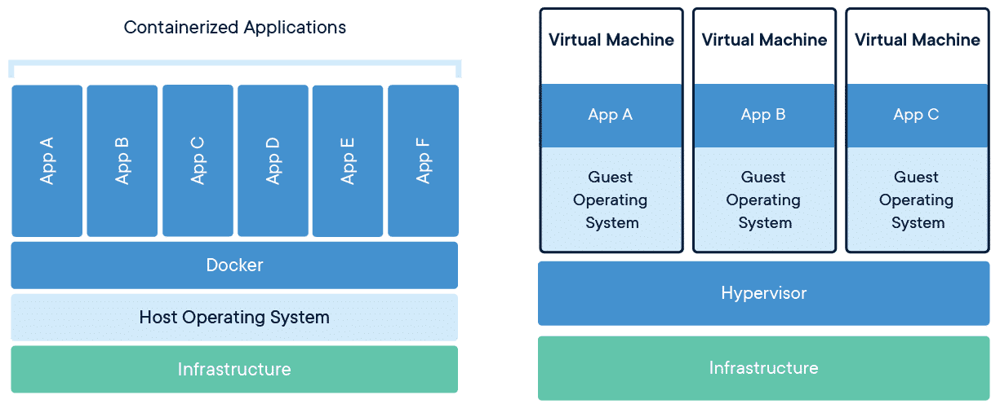
</div>

<div align="center">
  <i>Docker architecture and Virtual machine architecture.</i>
</div>

### 2. Docker security
<a name='docker-security'></a>

**Docker** security refers to the **build**, **runtime**, and **orchestration aspects** of Docker containers. It 
includes the _Dockerfile_ security aspects of Docker base images, as well as the _Docker container_ security 
runtime aspects—such as user privileges, Docker daemon, proper CPU controls for a container, and further 
concerns around the orchestration of Docker containers at scale.

Because Docker has a lot of moving parts. This makes it more complex to secure than other deployment technologies. 
You need to take a comprehensive approach, because a Docker vulnerability can come from anywhere.

## II. Secure aspects of Docker core components
<a name='secure-aspects'></a>

Compared to virtual machines or bare-metal servers, securing a Docker container is more difficult because Docker
environment has much more moving layer. Due to their moving parts, securing containers is complicated,
and it requires a high level of vigilance.

<div align="center">
  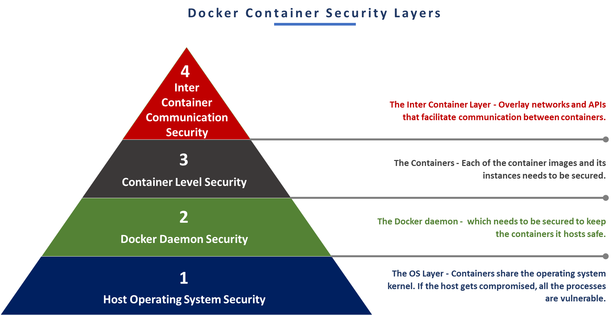
</div>

<div align="center">
  <i>4 layers of Docker container security.</i>
</div>

In order to understand about Docker security, first we will start to delve into the security aspects for each of the
Docker components. 

### 1. Host operating system (layer 1)
<a name='host-os'></a>

As the Docker containers share the OS kernel, host OS security is also a part of Docker security. All the processes
will be vulnerable in case the host get compromised, because processes running inside the Docker container are just 
`namespaced` processes inside a shared host. 

<div align="center">
  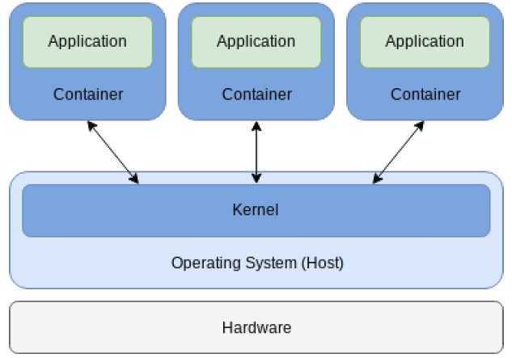
</div>

<div align="center">
  <i>Docker containers share the host OS kernel.</i>
</div>

### 2. Docker daemon (layer 2)
<a name='docker-daemon'></a>

**Docker daemon** listens for Docker API requests and manages Docker. After listening to the incoming request, 
Docker daemon interacts with the underlying **host kernel** do the job. It can also communicate with other daemons to
manage Docker services. 

Because the Docker daemon can interact with the host kernel, this can be dangerous, especially when _running as root_.
The Docker daemon acts as the brain of the Docker behind the whole operation, so any impact on the Docker daemon will
increase both container and host threats.

<div align="center">
  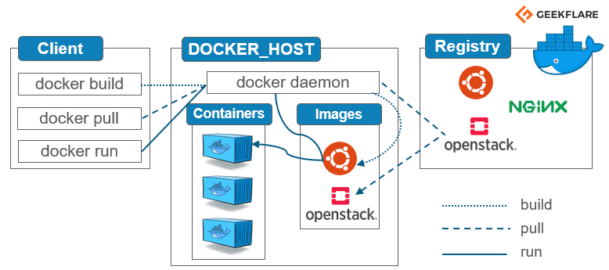
</div>

<div align="center">
  <i>Docker daemon is the brain of Docker.</i>
</div>

#### 2.1. Docker daemon socket

**Docker daemon socket** is a unique socket which acts as the backbone for managing containers. If others has access to 
our Docker socket, they could **call** Docker daemon, **manage** our containers, images, etc. This is especially
dangerous, so protect our Daemon socket is very important.

By default, Docker daemon creates a **non-networked** Unix domain socket at `/var/run/docker.sock` and only processes 
with `root` permission. This is fine for the basic use case of the default behavior of only accessing the Docker API
on the local machine via the socket as the `root` user. However, if we want to use the Docker demon remotely, it is
a difference story.

<div align="center">
  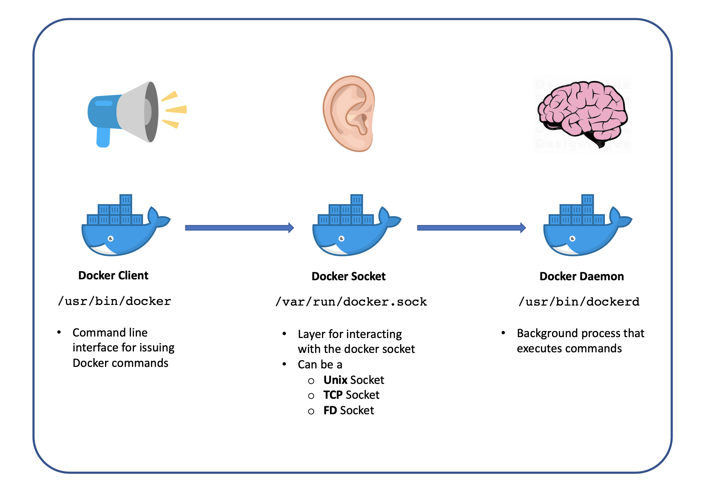
</div>

<div align="center">
  <i>Docker daemon socket is the intermediate step between Client and Daemon.</i>
</div>

##### 2.1.1. Use TLS (HTTPS) to protect the Docker daemon socket

If a client needs to access a Docker daemon remotely, Docker daemon can open a TCP socket and listens on port 2375 for 
REST API requests. However, default TCP socket provides **unencrypted** and **unauthenticated** access to the 
Docker daemon. This could lead to many security problems, when the `root` access will give to everyone e who poke us into the TCP port.
In this case, Docker support **TLS certificates** for _identity verification_. 

<div align="center">
  
</div>

<div align="center">
  <i>Authorization service with Docker daemon.</i>
</div>

##### 2.1.1. Use SSH to protect the Docker daemon socket

The another solution to protect Docker daemon socket remotely is using **SSH**. As SSH is widely used, and is often one 
of the protocols allowed by default, it could be convenient to access the Docker daemon directly via SSH. SSH also
uses encryption to secure the connection between a client and a server.

#### 2.2. Mounting volumes

Docker allows **mounting** to sensitive host directories, and even **modify** the contents of the host file system 
directly from the container. For application containers with access to the Internet, it is important to be 
especially careful when mounting important host directories (`/etc`, `/usr`). Any breach can result in data leak or 
data loss.

<div align="center">
  
</div>

<div align="center">
  <i>Docker volumes can mount host file system.</i>
</div>

### 3. Docker registries (layer 2)
<a name='docker-registries'></a>

**Docker registries** store images and allow Docker to easily set _up a central repository_ from which we can download 
images. However, the simplicity and convenience of registries can become a security risk if we fail to evaluate the
security context of the registry.

The **Docker Trusted Registry** (_DTR_) is a registry that can be installed behind our _firewall_. It gives us the 
ability to verify both the integrity and the publisher of all the data received from a registry over any channel. And
even if the registry is only accessible through a firewall, we must also _resist_ the temptation to let anyone upload
or download images.

<div align="center">
  
</div>

<div align="center">
  <i>Docker Trusted Registry.</i>
</div>

### 4. Docker images (layer 3)
<a name='docker-images'></a>

The Docker images do possess _vulnerabilities_ and are **not secure** by default. The vulnerabilities might because 
of the packages installed in the image, libraries used by the user, or even the base image. Even **Docker Official 
images** still have vulnerabilities. Sometimes the unstructured base images from Docker Hub may have _backdoor_, or 
contain dangerous _malware_. 

The ease of pushing and pulling images, while making developers lives easier, has also made it easy for malicious
actors to spread malware. An analysis in December 2020 by Prevasio show that **51%** of the images had _exploitable 
vulnerabilities_ over around **4 million** Docker Hub images.

<div align="center">
  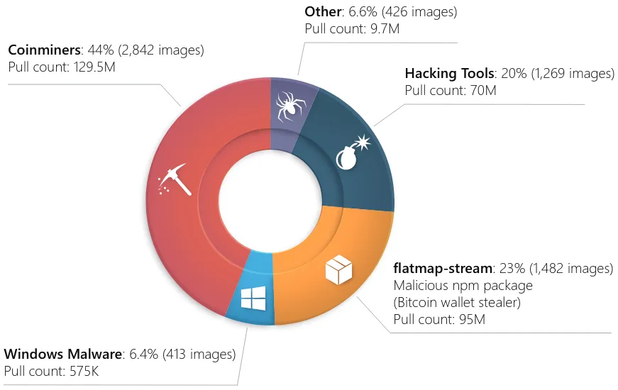
</div>

<div align="center">
  <i>Half of 4 million public Docker Hub images found to have critical vulnerabilities (12/2020).</i>
</div>

Although Docker have some mechanisms (which I will list later) to _restrict_ the **access back to host**, a malicious
image still can use up all CPU cycles, it can exhaust memory, it can fill drive, and it can send network traffic out 
from our machine. These vulnerable images that make their way into production environments pose significant threats
that can be costly to remediate and can damage our reputation.

In the other hand, if you write a bad Docker image, it may leak your _sensitive information_ or _private file_, which
could become a dangerous security problem later. 

### 5. Docker containers (layer 3)
<a name='docker-containers'></a>

Securing a Docker container requires an _end-to-end_ approach that provides protection everywhere from the host
to the network and everything in between. Because containers are **accessible**, there are many difficulties in 
security.

Docker container technology increases the default security by creating the isolation layers between the application
and between the application and hosts. **Isolation** is a powerful mechanism in controlling what containers 
can see or access or what resources they can use.

<div align="center">
  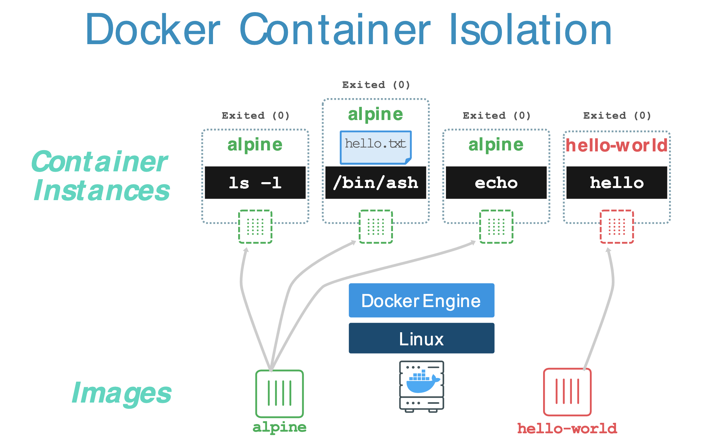
</div>

<div align="center">
  <i>Isolation in Docker container.</i>
</div>

When you start a container with `docker run`, behind the scenes Docker creates a set of `namespaces` and `cgroups`
to provide basic isolation across **containers**. Advanced isolation can be achieved like `capabilities`, `seccomp`, 
`AppArmor`, `SELinux`, .etc.

<div align="center">
  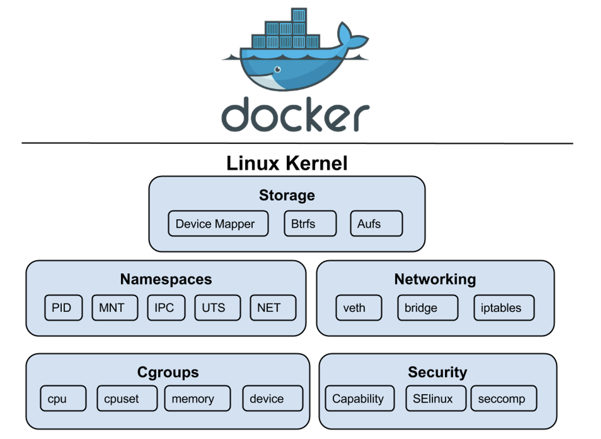
</div>

<div align="center">
  <i>Linux kernel features using in Docker container.</i>
</div>

#### 5.1 Kernel namespaces

`namespaces` are a feature of the Linux kernel that **partitions kernel resources** such that each set of processes
see difference set of resources. The feature works by having the same namespace for a set of resources and processes,
but those namespaces refer to **distinct resources** (resources can exist in multiple spaces).

<div align="center">
  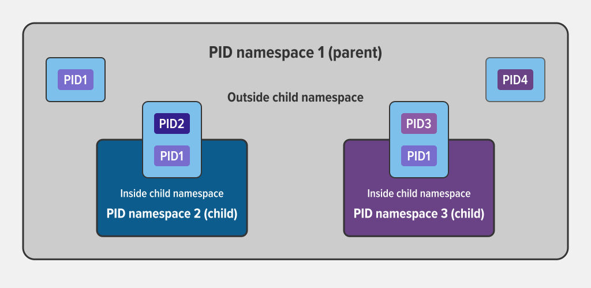
</div>

<div align="center">
  <i>Isolation between processes within different namespaces.</i>
</div>

Docker takes advantage of Linux namespaces to provide the **isolated workspace** - _container_. A set of namespaces are
created when we deploy a new container, _isolating_ it from all the other containers. This is an isolation of what
process can **see** inside a container.

With namespaces, Docker container:

- **Is provided process isolation**: Processes running within a container **cannot see**, and even less affect, processes
running in another container, or in the host system.

- **Has own network stack**: Each container by default gets its own network stack and _does not_ get **privileged access** 
to the sockets or interfaces of another container.

<div align="center">
  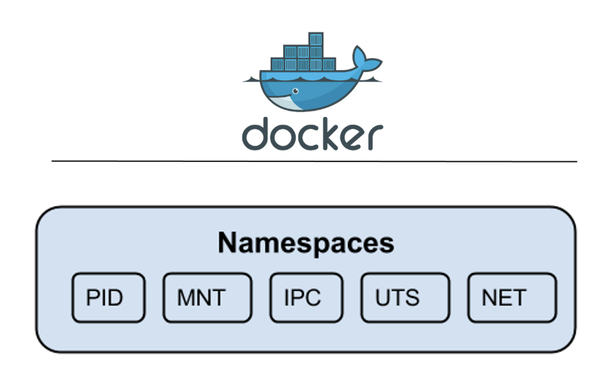
</div>

<div align="center">
  <i>Namespaces created for a Docker container.</i>
</div>

There are **5** namespaces created for a Docker container: 

1/ **PID Namespace**: An _unique ID number_ is assigned to the namespace (different from the host system). Each 
container has its own set of PID namespaces for its processes.

2/ **MNT Namespace**: Container is provided its own namespace for _mount directory paths_.

3/ **NET Namespace**: Each container is provided its own view of the network stack avoiding _privileged access_ to the 
sockets or interfaces of another container. 

4/ **UTS Namespace**: This provides isolation between the _system identifiers_; the _hostname_ and the 
_NIS domain name_. 

5/ **IPC Namespace**: The inter-process communication (IPC) namespace creates a grouping where containers can only 
see and communicate with other processes in _the same IPC namespace_.

#### 5.2. Control groups

**Control groups** (or `cgroups`)  are a Linux kernel feature that **limits**, **accounts** for, and 
**isolates** the resource usage (CPU, memory, disk I/O, network, etc.) of a collection of processes.

<div align="center">
  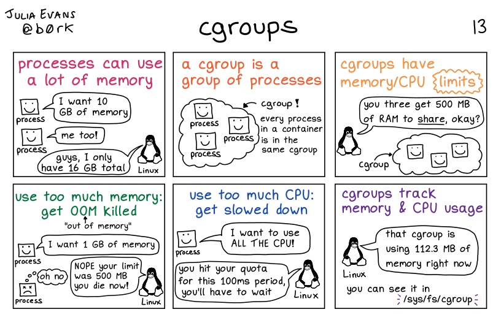
</div>

<div align="center">
  <i>cgroups in Linux.</i>
</div>

`cgroups` allows Docker control which resources each container **can access**, providing good container _multi-tenancy_. 
They allow Docker to share available hardware resources, and set up **limits** and **constraints** for containers. This 
help us to ensure that the whole system will not down just because a resources exhausted container.

Compare to `namespaces`, which is an isolation of what the processes **can see**, `cgroups` is an isolation of what the
processes **can access** inside a Docker container. `namespaces` limit what you can see (and therefore use) while 
`cgroups` limit how much you can use.

<div align="center">
  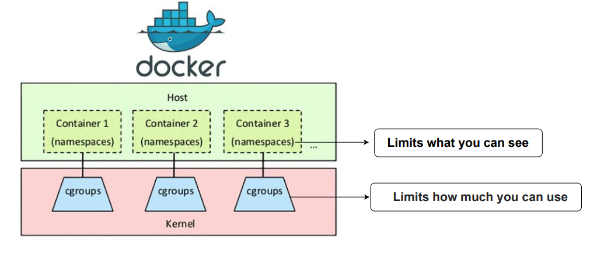
</div>

<div align="center">
  <i>Namespaces and cgroups in Docker.</i>
</div>

Docker Engine uses the following `cgroups`:

1. **Memory cgroup** for managing accounting, limits and notifications.
2. **HugeTBL cgroup** for accounting usage of huge pages by process group.
3. **CPU group** for managing user / system CPU time and usage.
4. **CPUSet cgroup** for binding a group to specific CPU. 
5. **BlkIO cgroup** for measuring & limiting amount of blckIO by group.
6. **net_cls** and **net_prio** cgroup for tagging the traffic control.
7. **Devices cgroup** for reading / writing access devices.
8. **Freezer cgroup** for freezing a group.

`cgroups` are essential to prevent **denial-of-service** attacks and guarantee a consistent uptime and performance
in multi-tenancy platforms, even when some applications start to misbehave.

#### 5.3. Seccomp

`seccomp` (_secure computing mode_) is a computer security facility in the Linux kernel. We can understand it
as a _firewall for syscalls_, to restrict the system calls that process may make. From this view, **seccomp** 
_isolates_ the process from the system's resources entirely.

<div align="center">
  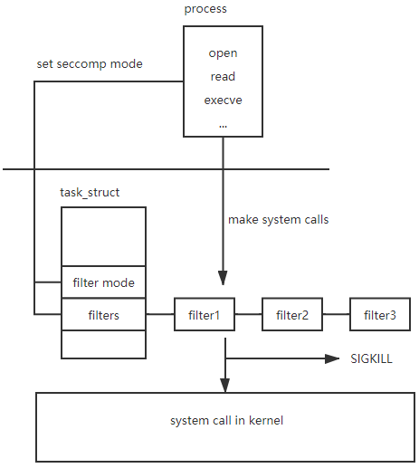
</div>

<div align="center">
  <i>Secure computing mode diagram.</i>
</div>

Docker Engine supports the use of `seccomp`, allows us to _limit_ the actions within the container to the level of 
**system call**. However, feature is available only if Docker has been built with `seccomp` and the kernel is configured 
with `CONFIG_SECCOMP` enabled.

With `seccomp` we can _restrict_ our application's access to the host system. While Docker has 
[default seccomp profile](https://github.com/docker/labs/blob/master/security/seccomp/seccomp-profiles/default.json),
we can also customize it ourselves to improve security and adapt to our purpose.

<div align="center">
  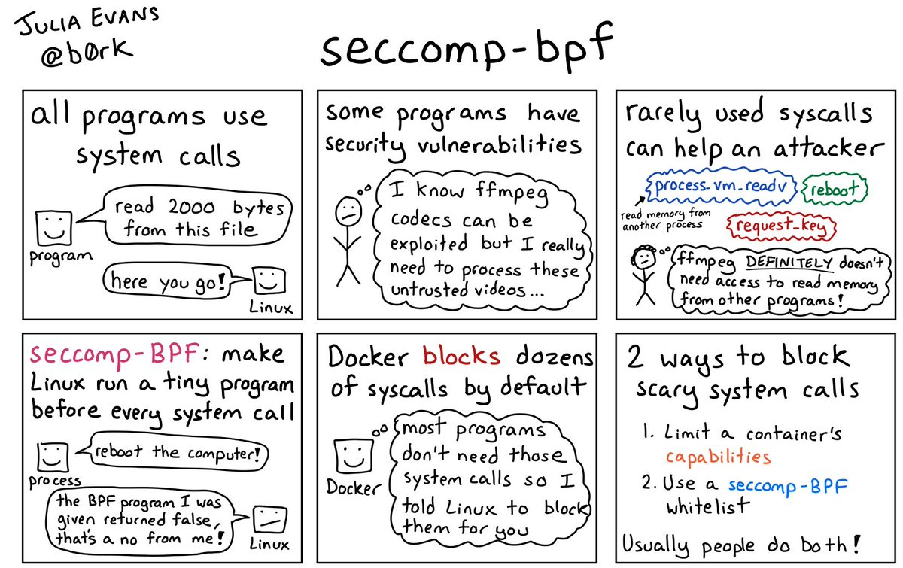
</div>
<div align="center">
  <i>Seccomp is used in container security.</i>
</div>

```text
// Add a system call to whitelist
...
    {
        "name": "mkdir",            // system call's name
        "action": "SCMP_ACT_ALLOW", // action if system call's name is matched
         "args": []                 // additional arguments
    },
... 
```

#### 5.4. Linux kernel capabilities

Before `capabilities`, Linux considers OS security in terms of `root` privileges versus `user` privileges. With
`capabilities` Linux now has a more nuanced privilege model. Restricting both **access** and **capabilities** 
reduces the amount of surface area potentially vulnerable to attack. 

Although `capabilities` allow granular specification of user access, but there still have the option to elevate 
their access to root level through the use of `sudo` or `setuid` binaries. Doing this may constitute a security
risk. Docker’s default settings are designed to **limit Linux capabilities** and reduce this risk. 

<div align="center">
  
</div>

<div align="center">
  <i>Linux kernel features using in Docker container.</i>
</div>

In most cases, containers don't need _true_ root privileges at all. Therefore, containers can work with a **limited**
set of capabilities. The Docker default bounding set of capabilities is _less than half_ of the total capabilities 
assigned to a Linux process. This reduces the possibility that application level vulnerabilities could be exploited
to allow escalation to a fully-privileged `root` user. 

<div align="center">
  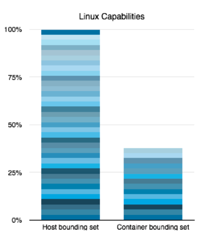
</div>

<div align="center">
  <i>Linux capabilities for host and container.</i>
</div>

#### 5.5. Other Linux kernel security features

Modern Linux kernels have many additional security constructs in addition to the concepts of `capabilities`, 
`namespaces` and `cgroups`. Docker can leverage existing systems like `TOMOYO`, `SELinux` and `GRSEC`, some 
of which come with security model templates which are available out of the box for Docker containers. We can
further define custom policies using any of these access control mechanisms.

Linux hosts can be hardened in many other ways and while deploying Docker enhances the host
security, it also does not preclude the use of additional security tools. Specifically, Docker
recommend users run Linux kernels with GRSEC and PAX. These patch sets add several kernel level safety checks, 
both at compile-time and run-time, that attempt to defeat or make some
common exploitation techniques more difficult. While not Docker-specific, these configurations
can provide system-wide benefits without conflicting with Docker. 

### 6. Inter-container security (layer 4)
<a name='docker-inter-containers'></a>

The Docker containers typically rely heavily on APIs and networks to communicate with each other. That’s why it’s 
essential to make sure that our network architectures are designed securely, and that we monitor the APIs and 
network activity for anomalies that could indicate an intrusion.

#### 6.1. AppArmor

AppArmor (_Application Armor_) is a Linux kernel security module that allows the system administrator to **restrict** 
programs' capabilities with _per-program_ profiles. In contrast to managing `capabilities` and `seccomp`,
AppArmor allows for much finer-grained control. To use it, we will associate an AppArmor security profile with 
**each program**. Profiles can allow capabilities like folder access, network access, and the permission(or not) 
to read, write, or execute files.

<div align="center">
  
</div>

<div align="center">
  <i>Application Armor logo.</i>
</div>

AppArmor _proactively_ protects the operating system and applications from external or internal threats and even 
zero-day attacks by enforcing a specific rule set on a _per-application_ basis. Security policies completely define what
system resources individual applications can access, and with what privileges.

By default, Docker automatically generates and loads containers profile named `docker-default`. The default profile
`docker-default` is moderately protective while providing wide application compatibility. You can also modify the
profile following this [template](https://github.com/moby/moby/blob/master/profiles/apparmor/template.go).

#### 6.2. Communication between containers on same hosts

By default, **inter-container communication** (`icc`) is enabled - all network traffic is allowed between containers 
on the same host (using `docker0` bridged network). This may increase disclosure of information to other containers.
We can disable `icc` by running Docker daemon with `--icc=false` flag and using`--link=CONTAINER_NAME_or_ID:ALIAS`
option to tell which containers can communicate.

#### 6.3. Communication between containers across hosts

For security reasons, Docker configures the `iptables` to prevent containers from forwarding traffic from outside 
the host machine, on Linux hosts. Docker sets the default policy of the `FORWARD` chain to `DROP`. If we need a 
container running on `host1` the ability to communicate directly with a container on `host2`, we need a route from 
`host1` to `host2`. After the route exists, we need to adjust this policy on `host2` to be able to accept packets 
destined for its running container.

## III. Security vulnerabilities of Docker could be exploited
<a name='security-vulnerabilities'></a>

In this section, we will consider 3 attacker surfaces that the hackers could exploit from Docker.

### 1. Application running on a Docker container
<a name='application'></a>

There are a lot of security vulnerabilities an application could have, including injection, broken authentication,
sensitive date exposure, etc. However, we now just focus on vulnerabilities of Docker could be exploited. 

#### 1.1. Malicious plugins 

The Panama Papers are one of the largest high-profile data leaks. It causes by a plugin with vulnerabilities in 
WordPress. Beside WordPress, our other application still could be exposed to malicious plugins. From these 
vulnerabilities, the hackers will be able to steal our data, or even take the control of our application. Fortunately,
we can prevent malicious plugins from being uploaded and installed on our application using **AppArmor**.

#### 1.2. Leak sensitive data

Docker images often require _sensitive data_ for their normal operations, such as credentials, tokens, SSH keys, TLS
certificates, database names or connection strings. In other cases, applications running in a container may generate
or store sensitive data. Using these data, the hacker could access and control our application.

### 2. Docker container
<a name='container'></a>

In this section, we just consider the attacks from container itself, from application to container and between containers.
The attacks from container to host or vice versa will be discussed in the next section.

#### 2.1. Malicious Docker image

The malicious Docker image might contain malware, coin miners or even backdoor. The attacker could exploit these 
backdoor to attack our container. This is why we should only use images from trusted sources and perform security
scan to identify vulnerabilities within container images.

#### 2.2.  Vulnerabilities from application

Because our application is running inside the container, so if the application is attacked, the hackers could
use it to access and control the container. In order to prevent

#### 2.2. Unrestricted network traffic

By default, all network traffic is allowed between containers on the same host. This increases the risk of _unintended_
and _unwanted_ **disclosure** of information to other containers. We should only allow intercommunication that is 
necessary by linking specific containers. This will significantly reduce attack surfaces by restricting container
access.

It is a good practice to disable `icc` and using link to specific which containers to communicate with.

#### 2.3. Unsecured communication

The unsecured communications Docker registries could be attacked by Man-in-the-Middle attack or the data could be
leaked. To protect confidentiality and integrity of all network traffic, communications with Docker registries should
be encrypted.

#### 2.4. Unrestricted access of files or process

An attacker who gains access to one container may have the capability to gain access to other containers. 
For example, a container may have the ability to access system file directory on the host via remounting,
which is critical to security enforcement.

The `namespaces` feature in will allow developers to avoid `root` access by giving isolated containers separate user 
accounts, and mandate resource constraints, so users from one container do not have the capability to access 
other containers or exhaust all resources on the host.

#### 2.5. Outdated Docker version

Running an older version of Docker can expose higher risks and have more vulnerabilities. Developers are not perfect,
and it is impossible to create a perfect code the first time. That is why most software, includes Docker,
developers release regular updates. Using updated and patching of Docker is a good practice to follow.

### 3. Container host
<a name='host'></a>

#### 3.1. Container with capabilities over needed

When you grant a container over needed capabilities, it could perform dangerous system call to the container host.
Especially when using `--privileged` flag, this will add **ALL** Linux kernel capabilities to the container. 

The container may accidentally remove or change sensitive data, or even do some actions that affect our host kernel.
And in case there is someone else takes control of the container, he could do anything to our host.

#### 3.2. Exploiting privileged container 

By default, Docker containers run as `root`. That root user is the same root user of the host machine, with `UID 0`.
This fact can enable hackers to perform various types of attacks on your app if they get hold of your vulnerable 
container, they can

- Copy _sensitive files_ from the host to the container and access them;
- Perform remote command execution;
- Access mounted sensitive root-owned file from the container as they’re `root`.

Fortunately, we could run Docker container in `rootless` mode or use `USER` in Docker image to restrict the
privileges of the container.

#### 3.3. Vulnerabilities from containers' kernel 

Because containers' kernel share the same kernel as the host, so if the kernel has an exploitable flaw, it could be 
used to break out of the container and into the host. We could prevent this by setting `capabilities` to prevent
the threats from containers.

#### 3.4. Exploiting the Docker daemon socket

Docker socket is the unix socket that Docker is listening to. This is the primary entry point for the Docker API with 
owner is root. Giving someone access to it is equivalent to giving unrestricted root access to your host. In case you
need to enable Docker daemon socket remotely, please usp TLS for HTTPS or SSH, instead of exposing un-encrypted and
unauthenticated direct access to the Docker daemon.

#### 3.5. Exploiting the mounted host filesystem

If a container that mounts a host filesystem, it can probably modify things in that filesystem to escalate
privileges to the host. The hackers can use it to escalate privileges and then have the privileges to control our
host.

#### 3.6. Unlimited resource containers

A container without a resource limit is vulnerable to a DoS attack. When the Dos attack take place, the host will
consume more resource and could make the whole system down.

## IV. Best practices
<a name='best-practices'></a>

### 1. Securing the host OS
<a name='best-practices-host'></a>

#### 1.1. Choosing an OS

Docker works base on Linux kernel, so it is better to using a Linux distribution like Ubuntu, RedHat, Alpine Linux,
RancherOS, etc. In Windows and MacOS, Docker required additional Linux virtual machine, so it could decrease Docker
performance. Better to use trusted OS, which have a strong community to fix and patch the vulnerabilities regularly.

You could decide which OS is suitable for you base on your purpose:

- Use Docker with other software - Ubuntu, Redhat, etc.
- With pre-installed Docker tools and configurations - Rancher OS, etc.
- ...

#### 1.2. OS vulnerabilities and updates

To prevent from known, container escapes vulnerabilities, which typically end in escalating to root/administrator
privileges, patching Docker Engine and Docker Machine is crucial. In addition, containers (unlike in virtual machines)
share the kernel with the host, therefore kernel exploits executed inside the container will directly hit host kernel. 

#### 1.3. User access rights

All authentication directly to the OS should be audited and logged. You should only grant access to the appropriate 
users and use keys for remote logins. The created user should follow the **Least Privileged User** rule - with the 
minimum permissions, just enough to perform required task.

#### 1.4. Host file system

Make sure containers are run with the minimal required set of file system permissions. Containers should not be able
to mount sensitive directories on a host’s file system, especially when they contain configuration settings for the OS.

#### 1.5. Docker Runtime environments checking

Check the container daemon activities regularly. You could find other information about Docker Runtime environments
int `/var/lib/docker`, `/etc/docker/`, `docker.service`, etc.

### 2. Securing the container images
<a name='best-practices-images'></a>

#### 2.1. Use minimal base images

Docker images are commonly built on top of **base images**. While this is convenient, because it avoids having to 
configure an image from scratch, it raises security concerns. You may use a base image with components that are not
really required for your purposes, but there will have more vulnerabilities to concern. Therefore, it is a common
practice to use `alpine` based image, thanks to is small size.

#### 2.2. Image vulnerabilities scan

Docker container images must be tested for vulnerabilities before use, especially if they were pulled from _public 
repositories_. Remember that a vulnerability in any component of your image will exist **in all containers** you create 
from it. If you use a base image to create new images, any vulnerability in the base image will **extend** to your 
new images.

**Container image scanning** is the process of analyzing the content and composition of images to detect security issues,
misconfigurations or vulnerabilities. There are many open source and proprietary image scanners available, for example:
anchore, Snyk, Clair, etc.

#### 2.3. Create a user

Configuring the container to use an unprivileged user is the best way to prevent privilege escalation attacks. 
Containers should be run as a non-root user whenever possible, using `USER` instruction within the Dockerfile.

#### 2.4. Use Trusted Base Images

Ensure that the container image is based on another established and trusted base image downloaded over a secure channel. 
Official repositories are Docker images curated and optimized by the Docker community or associated vendor. It may seem 
convenient to simply download container images available to the public; however, it is extremely important to ensure
the source of the download is trusted or verified. 

Docker Trusted Registry is a legit registry. It is installed behind your firewall to mitigate the risks and breaches 
on the internet.

#### 2.5. Only install verified packages in containers

Download and install verified packages from trusted sources, for example Debian repository, PyPi repository, etc.

#### 2.6. Do not install unnecessary packages

To reduce container size and minimize the attack surface, do not install packages outside the scope and 
purpose of the container. Remember that any additional component added to your images expands the attack surface. 

#### 2.7. Use COPY instead of ADD when writing Dockerfile

The `COPY` instruction copies files from the local host machine to the container file system. The `ADD` instruction can 
potentially retrieve files from remote URLs and perform unpacking operations. Since `ADD` could bring in files remotely,
the risk of malicious packages and vulnerabilities from remote URLs is increased.

#### 2.8. Do not expose unused ports

The **Dockerfile** defines which ports will be opened by default on a running container. Only the ports that are needed 
and relevant to the application should be open. Look for the `EXPOSE` instruction to determine if there is access
to the **Dockerfile**.

#### 2.9. Do not store secrets in Dockerfile

Docker images often require sensitive data for their normal operations, such as credentials, tokens, SSH keys, 
TLS certificates, database names or connection strings. In other cases, applications running in a container may 
generate or store sensitive data. 

Sensitive information should never be hardcoded into the Dockerfile, it will be copied to Docker containers, 
and may be cached in intermediate container layers, even if we attempt to delete them later. Instead, we can 
use **Docker secrets** to manage sensitive data a container needs at runtime.

#### 2.10. Use multi-stage builds

To build containerized applications in a consistent manner, it is common to use multi-stage builds. This has both 
operational and security advantages. A well-designed multi-stage build contains only the minimal binary files and
dependencies required for the final image, with no build tools or intermediate files. This will reduce the attack
surface. 

#### 2.11. Lint the Dockerfile at build time

Many issues can be prevented by following some best practices when writing the **Dockerfile**. Some issues that 
can be checked are: 
- `USER` is specified;
- Base image version is pinned;
- OS packages versions are pinned;
- `COPY` instead of `ADD`;

#### 2.12. Sign and verify image to mitigate Man-in-the-middle attacks

Less than 1% of the Docker images are said to be inherently secure. So, while pulling, we have to make of the 
publisher’s authenticity. Hence, it is advisable to sign our images and verify them while we pull them.

#### 2.13. Find and fix our image vulnerabilities

Scan our image again using image scan tools, then fix these vulnerabilities and monitor them.

#### 2.14. Use fixed tags

Tags are commonly used to manage versions of Docker images. Everytime push a new images, we should use a fixed tags.
The reason is that using the same tag, resulting in inconsistent images during builds, and the vulnerabilities
become hard to track.

### 3. Securing the container runtime
<a name='best-practices-runtime'></a>

#### 3.1. Limit resources

The best way to avoid DoS attacks is by limiting resources. You can limit memory, CPU, maximum number of restarts 
`--restart=on-failure:<number_of_restarts>`, maximum number of file descriptors `--ulimit nofile=<number>` and 
maximum number of processes `--ulimit nproc=<number>`.

#### 3.2. Prevent escalate privilege

Using` --security-opt=no-new-privileges` flag in order to prevent escalate privileges using `setuid` or `setgid` 
binaries. We need to prevent escalate privileges because once an attacker accesses the host system, they can
escalate their privilege to access other containers running in the machine or run harmful code on the host.

#### 3.3. Disable inter-container communication

Using `--icc=false` to disable inter-container communication between containers in the same host. By default, all
the containers can communicate with each other through `docker0` bridged network. It could lead to the unwanted data
leak between containers. 

After disable inter-container communication, you can use `--link` to set up the communication between containers
later.

#### 3.4. Run containers as a non-root user

Running containers as a non-root helps to mitigate security vulnerabilities. Running our containers on `rootless` mode 
will verify that your application environment is safe. It also prevents malicious content from accessing the host 
container. This means not everyone who has pulled our container from Docker can get access to server.

#### 3.5. Limit capabilities 

We will grant only specific capabilities, needed by a container using Linux kernel `capabilities`.

#### 3.6. Use Linux security module

We should use Linux security module such as `seccomp`, `AppArmor`, `SELinux`, etc. to improve the Docker container
runtime security.

In order to use `seccomp`, we need to configurate the kernel with `CONFIG_SECCOMP` enabled. By default, it will use
Docker [default seccomp profile](https://github.com/docker/labs/blob/master/security/seccomp/seccomp-profiles/default.json).
It is a _whitelist_ of allowed calls and blocks **over 50** different `syscalls`. Although the default profile is 
basically enough to use, but we could also improve it based on our purpose using `json` format (instead of 
**Berkeley packet filter** - _BPF_). It is a good practice to only write white list in `seccomp` profile, to prevent missing `syscalls` when we want to
block.

`AppArmor` has a default security profile, we could modify the profile but do not disable it. In short, it is 
important that we **do not disable** Docker’s default AppArmor profile or **create our own** customer security 
profile for containers specific to our purpose.

`SELinux` is an application security system that provides an access control system that greatly augments the 
**Discretionary Access Control** model. If it’s available on host OS, we just start Docker with `SELinux` enabled. 

#### 3.7. Set filesystem and volumes to Read-only

Run containers with a read-only filesystem can prevent malicious activity such as deploying malware on the container 
or modifying configuration. In order to run container in read-only mode, we can use `--read-only` flag.

#### 3.7. Don't expose the Docker daemon socket

Do not enable TCP Docker daemon socket or expose` /var/run/docker.sock` to other containers. The reason is that
if some other have access to the Docker daemon socker, they can have the access to our container or even our
host kernel. If you need to expose the TCP Docker deamon socket, please use it with **TLS over HTTPS**.

## V. Conclusion
<a name='conclusion'></a>

Docker applications and environments present additional security concerns that was not present with non-containerized 
applications. But by using to the fundamentally basic concepts for host and application security outlined above, we
can achieve a stronger security posture. Still, a lot of the same principles around Docker security apply for 
protecting container-based applications, but I don't have enough time to indicate them all.

In conclusion, **I believe that Docker is quite security**. Docker containers are secure or not depends on our 
Docker security strategy. They’re not inherently unsecure, and they do enable developers to build, ship, and run 
applications quickly and safely. 

However, Docker isn’t **infallible**. Not having an effective Docker security strategy could leave you open to attack.
Applied all the best practices, combine with our careful mindset will help us to build security containers.

## VI. References
<a name='references'></a>

[1] [Docker security documents](https://docs.docker.com/engine/security/)

[2] [Seccomp in Wikipedia](https://en.wikipedia.org/wiki/Seccomp)

[3] [AppArmor in Wikipedia](https://en.wikipedia.org/wiki/AppArmor)

[4] [How to Stop Container Escape and Prevent Privilege Escalation](https://goteleport.com/blog/stop-container-escape-privilege-escalation/)

[5] [Half of 4 Million Public Docker Hub Images Found to Have Critical Vulnerabilities](https://www.infoq.com/news/2020/12/dockerhub-image-vulnerabilities/)

[6] [Docker Security Best Practices: A Complete Guide](https://anchore.com/blog/docker-security-best-practices-a-complete-guide/#securing-runtime-1)

[7] [10 Docker Security Best Practices](https://snyk.io/blog/10-docker-image-security-best-practices/)

[8] [Top 20 Docker Security Best Practices: Ultimate Guide](https://blog.aquasec.com/docker-security-best-practices)

[9] [Docker Security Cheat Sheet](https://cheatsheetseries.owasp.org/cheatsheets/Docker_Security_Cheat_Sheet.html)