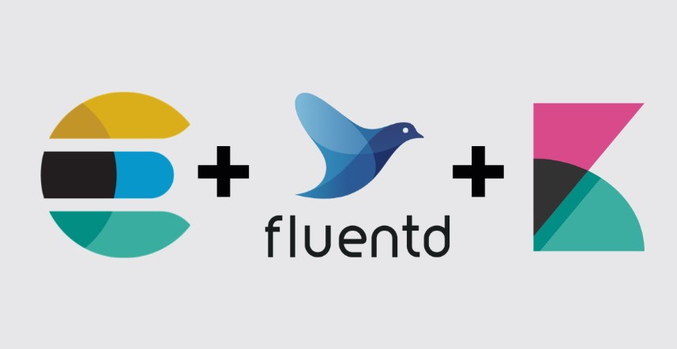
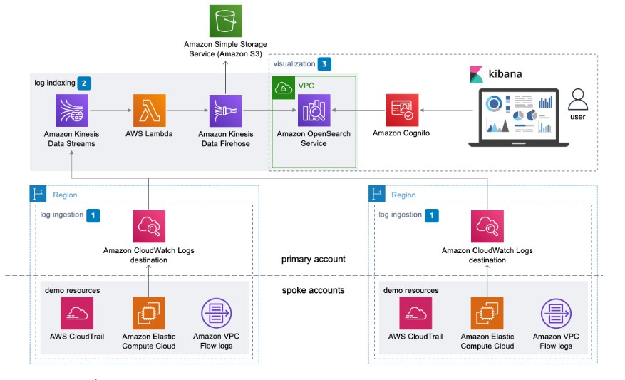
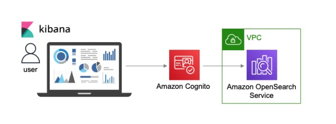

# **Final Practice: Tìm hiểu và phân tích các mô hình triển khai Centrialized Logging**

## **A . Tìm hiểu về Centrialized logging**

### **I. Centrialized logging là gì ?**

**Centrialized logging** là 1 giải pháp hệ thống, tập hợp tất cả các `log data` và đẩy nó về 1 nơi tập trung có giao diện, có thể truy cập và dễ sử dụng. `Centrialized logging `không chỉ cung cấp 1 nơi chứa `log` tập trung mà còn cung cấp cho bạn các công cụ đánh giá, phân tích và xem thông tin đó 1 cách nhanh chóng và rõ ràng.

`Centrialized logging` rất cần thiết trong các dịch vụ `microservices` nơi có thể có hàng trăm services nhỏ mà việc thu thập log và quản lý log phức tạp theo hệ thống.

### **II. Tại sao Centrialized logging**

Tất cả các ứng dụng hiện giờ đều chủ động tự thu gom `log` của bản thân nó về chính máy chủ đang chạy ứng dụng đó. `Log` của hệ thống rất quan trọng, chúng cung cấp thông tin cần thiết về cách 1 hệ thống đang hoạt động và đã hoạt động trong quá khứ. Bằng cách tìm kiếm dữ liệu `log` chúng ta có thể tìm được các vấn đề xảy ra của ứng dụng. Tuy nhiên , việc tra cứu thủ công 1 lỗi cụ thể trên hàng trăm máy chủ và hàng nghìn tệp `log` có thể rất mất thời gian và gây khó chịu làm giảm hiệu suất vận hành hệ thống.

Ưu điểm của **Centrialized logging**:
- Lưu trữ `log` từ nhiều nguồn về 1 nơi
- Thực hiện yêu cầu lưu giữ `log` trong một khoảng thời gian cụ thể
- Dễ dàng tìm kiếm 
- Tạo cảnh báo dựa trên các thông số đã thiết lập
- Chia sẻ thông tin `log` với những người khác một cách đơn giản và nhanh chóng
- Chi phí thấp và tăng khả năng lưu trữ và sao lưu cho lịch sử `log`
- Thiết lập cảnh báo bảo mật và cấp quyền truy cập đăng nhập cho người dùng cụ thể mà không cấp quyền truy cập root máy chủ

## **B . Các mô hình Centrialized logging**

### **I. Centralized logging sử dụng EFK Stack**

**EFK** là lựa chọn phổ biến và tốt nhất hiện nay để tổng hợp, hiển thị và phân tích log. `EFK` bao gồm một số thành phần, cụ thể là:

**Elasticsearch**

`Elasticsearch` là một công cụ tìm kiếm phân tán và có thể mở rộng thường được sử dụng để sàng lọc một lượng lớn dữ liệu nhật ký.

**Fluentd**

`Fluentd` là một công cụ thu thập dữ liệu thống nhất để ghi log, cho phép bạn thu thập log từ nhiều nguồn và lưu chúng ở những nơi khác nhau như `elasticsearch`.

**Kibana**

`Kibana` là một công cụ truy vấn cho phép bạn tạo hình ảnh trực quan cho sự kiện của log và thực hiện các truy vấn để lọc thông tin nhằm phát hiện sự cố. `Kibana` thường được sử dụng cùng với `Elasticsearch`.

**Cách thức hoạt động:**

 > *Fluentd sẽ đi thu thập log từ các services chuyển về    elasticsearch để thực hiện truy vấn, phân loại và sàng  lọc rồi được thể hiện trực quan trên Kibana.*

**Mô hình kiến trúc:**

### **II. Mô hình Centralized logging của AWS**

Giải pháp tập trung log của AWS cũng nhằm mục đích chung của việc tập trung log giống các mô hình khác là tổ chức thu thập phân tích và hiển thị trên 1 bảng thông tin duy nhất. Giải pháp này sử dụng `Amazon CloudWatch Logs`, `Amazon OpenSearch` và `Kibana`.

**Kiến trúc cơ bản** 

**Các thành phần trong kiến trúc này:**

 Giải pháp `Centralized Logging` của AWS bao gồm các thành phần sau: `log ingestion`, `log indexing`, và `visualization`.

**Log ingestion:** 

- Đối với thành phần log ingestion , `AWS CloudFormation template` triển khai các điểm đến của `Amazon CloudWatch Logs` trong tài khoản chính của mình .

- Các luồng log từ các nơi sẽ đổ về `CloudWatch Logs`. Các vùng được lấy log được yêu cầu cung cấp quyền cho nơi chứa `CloudWatch Logs`. Từ đó `Cloud Watch Logs` có thể tùy chỉnh để phân loại, lọc tạo thành các `grouplog` để hiển thị trong tài khoản ghi log tập trung.

**Note**: *Chúng ta có thể kiểm soát log nào sẽ được thông báo đến tài khoản chính bằng cách cung cấp các tham số cho các log của từng khu vực lấy log.*

**Log indexing:** 

Luồng dữ liệu sẽ được đẩy qua `Amazon Kinesis Data Streams`, qua hàm `AWS lambda`, `Amazon Kinesis Data Firehose` để tìm kiếm và truy vấn dễ dàng hơn bằng `OpenSearch Service`:

- `CloudWatch Logs` sau khi đã tập trung log, lọc từ các nguồn sẽ chuyển đến `Kinesis Data Streams`.

- Sau khi đến `Kinesis Data Streams`, sẽ có dịch vụ gọi hàm` AWS lambda` để chuyển đổi luồn dữ liệu thành định dạng mà `Amazon OpenSearch Service` có thể sử dụng được.

- `Kinesis Data Firehose` đánh số dữ liệu trên miền `Amazon OpenSearch Service`.

- Ngoài ra còn có thành phần `Kinesis Data Firehose` ghi lại các lỗi trong `CloudWatch` và chuyển các bản ghi tới `Amazon Simple Storage Service` (Amazon S3) để lưu trữ với chi phí thấp.

**Note:**
*Bạn cũng có thể giám sát luôn cả quá trình đánh dấu của Kinesis Data Firehose vì nó cũng có thể gửi vào luồng log đẩy về CloudWatch Logs.*

**Visualization:**

Giải pháp này cung cấp công cụ trực quan hóa dữ liệu bằng cách sử dụng `Kibana` và `OpenSearch Service`. `Opensearch Service` được tạo bên trong `VPC `của `Amazon`, ngăn quyền truy cập công khai vào trang tổng quan `Kibana`(Dashboard Kibana). Việc truy cập vào trang tổng quan `Kibana` sẽ được quản lý định danh và nhóm bảo mật` VPC` từ đó đảm bảo tính bảo mật dữ liệu. 

## **C . Tham khảo**

**https://www.missioncloud.com/blog/what-is-centralized-log-management-clm**

**https://thelazy.engineer/centralized-kubernetes-logging-using-efk-stack/**

**https://aws.amazon.com/vi/solutions/implementations/centralized-logging/**

**https://docs.aws.amazon.com/solutions/latest/centralized-logging/overview.html**