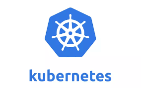
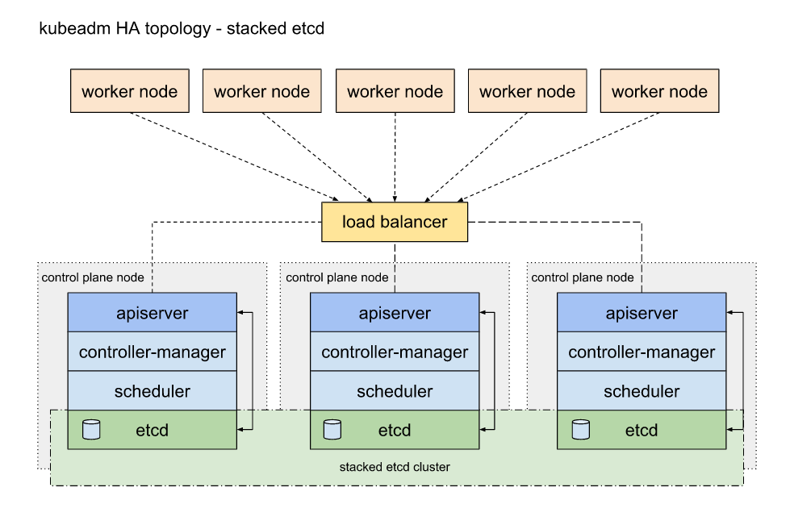
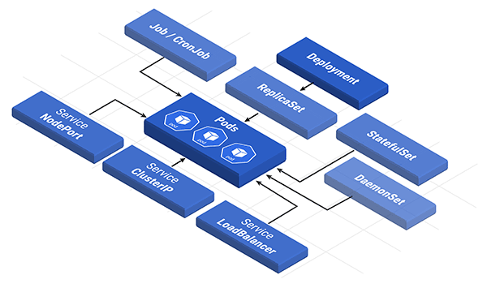
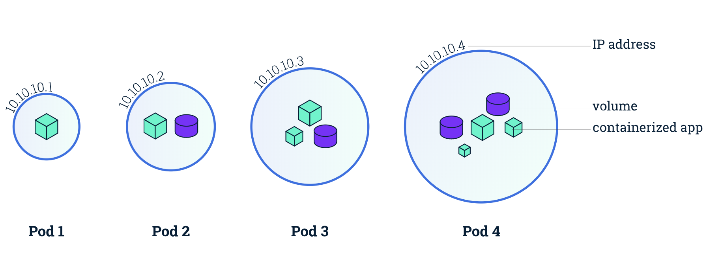
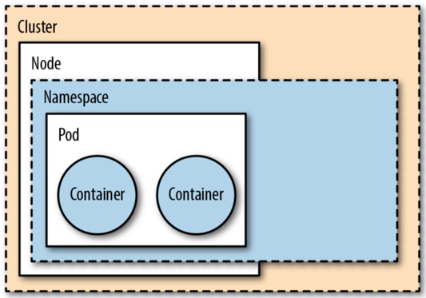
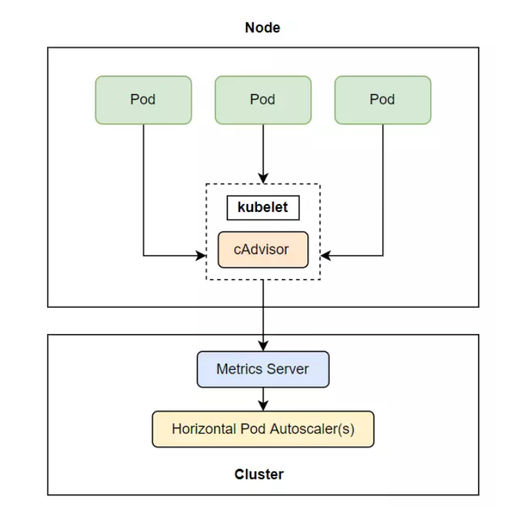
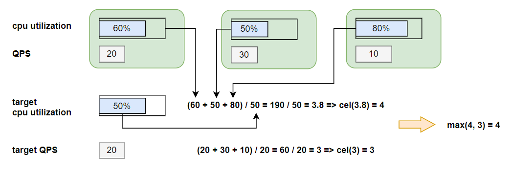
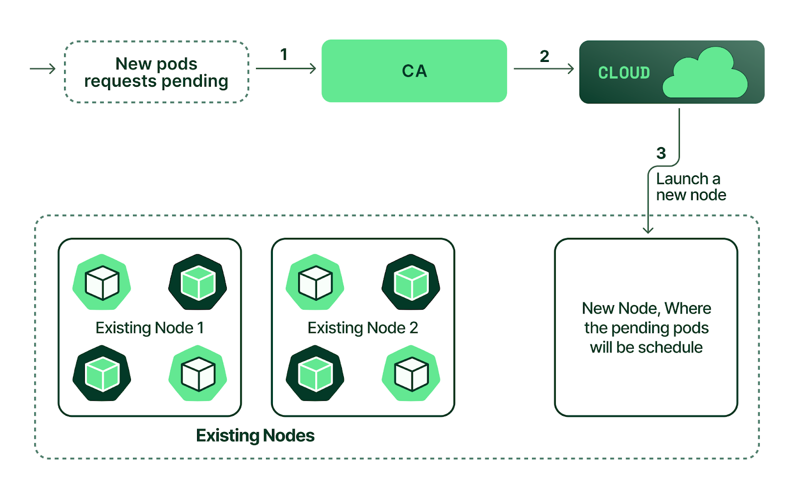

# **Tìm hiểu về cơ chế autoscaling trong Kubernetes**

## **1. Kubernetes**

### *1.1. Kubernetes là gì?*



Kubernetes (k8s) là một hệ thống mã nguồn mở giúp tự động hóa việc triển khai, quản lý, điều phối các ứng dụng được container hóa. K8s còn được gọi là Container Orchestration Engine (hiểu nôm na là công cụ điều phối container).

* Một số tính năng của K8s

    * *Rollouts và rollbacks tự động*: k8s có thể cập nhật những thay đổi cho ứng dụng đang chạy mà vẫn đảm bảo các pod không bị kill hết cùng lúc (zero downtime), nếu xảy ra lỗi thì có thể rollback lại phiên bản trước đó ngay lập tức.

    * *Horizontal scaling*: ứng dụng có thể được scale up/down bằng cách thủ công (qua command line/UI) hoặc tự động dựa trên mức sử dụng CPU.

    * *Service discovery & load balancing*: Kubernetes gán cho mỗi pod một địa chỉ IP và một DNS name cho một tập hợp pod để hỗ trợ việc cân bằng tải giữa chúng.

    * *Self-healing*: k8s tự động thay thế và lên lịch lại cho containers ở các node bị lỗi, sau đó restart những container không phản hồi lại health check đồng thời ngăn cản traffic tới các container đó cho tới khi chúng hoạt động trở lại

    * *Có thể mở rộng*: Một cluster có thể mở rộng thêm các tính năng mà không làm thay đổi upstream source code

### *1.2. Kiến trúc các thành phần trong Kubernetes*

Một Kubernetes cluster là một tập hợp nhiều node để chạy các ứng dụng. Mỗi node là một máy ảo hay máy vật lý. Mỗi cluster bao gồm một thành phần điều khiển (master node) và các worker node.


* Các thành phần được cài đặt trên Master node bao gồm:

    * **API server**: Cung cấp REST API cho Kubernetes Cluster dùng để xác thực và thiết lập configuration data cho các objects như Pods, Services.

    * **Cluster store**: Lưu trữ thông tin của toàn bộ Kubernetes Cluster. Mặc định sử dụng là `etcd` lưu trữ dưới dạng key-value

    * **Controller manager**: Là một tập hợp các controller khác nhau để theo dõi các cập nhật trạng thái của Kubernetes Cluster thông qua API và thực hiện các thay đổi đối với Cluster. Có rất nhiều controller nhỏ hơn bên trong như Replication controller, Node controller, Endpoints controller,…

    * **Scheduler**: Sử dụng Kubernetes API để tìm các pod chưa được lên lịch, sau đó thực hiện việc lập lịch để đặt các pod này lên các Worker node.

* Các thành phần trên Worker node bao gồm:

    * **Kubelet**: Kubelet có trách nhiệm giám sát giao tiếp với master node và quản lý các Pod. Kubelet sử dụng CRI (Container Runtime Interface) giao tiếp với container runtime trên cùng một Node đó để quản trị vòng đời ứng dụng chạy trong container.

    * **Kube-proxy**: Tương tác với iptables để thiết lập các chính sách truy cập

    * **Container runtime**: Thực hiện pull image, start và stop container theo chỉ thị từ kubelet

Mô hình kiến trúc hạ tầng Kubernetes Cluster có đảm bảo tính HA:



### *1.3. Kubernetes Objects & Workloads*

Trong khi container là cơ chế cơ bản để deploy các ứng dụng, k8s sử dụng thêm các mức trừu tượng trên giao diện container để cung cấp các tính năng quản lý quy mô, khả năng phục hồi và vòng đời. Khi đó, người dùng không quản lý trực tiếp containers mà sẽ xác định và tương tác với các instance bao gồm các thực thể được cung cấp bởi **Kubernetes Object Model**.



* Pod

    

    Kubernetes không chạy các container một cách trực tiếp, thay vào đó nó bọc một hoặc vài container vào với nhau trong một cấu trúc gọi là Pod. Các container cùng một pod thì chia sẻ với nhau tài nguyên và mạng cục bộ của pod.

    Mỗi POD được gán một địa chỉ IP, các container trong Pod chia sẻ cùng địa chỉ IP này. Các container trong cùng một Pod có thể liên lạc với nhau qua localhost. Một Pod có thể có nhiều ổ đĩa được chia sẻ để các container có thể truy cập đọc/ghi dữ liệu.

    Pod là thành phần đơn vị (nhỏ nhất) để Kubernetes thực hiện việc nhân bản (replication), có nghĩa là khi cần thiết thì Kubernetes có thể cấu hình để triển khai nhân bản ra nhiều pod có chức năng giống nhau để tránh quá tải, thậm chí nó vẫn tạo ra nhiều bản copy của pod khi không quá tải nhằm phòng lỗi (ví dụ node bị die).

* ReplicaSet và Replication controller

    Replication controller là một resource giúp đảm bảo số lượng pod (giống nhau) trong cluster được ổn định tại mọi thời điểm. Tức là số lượng pod luôn được duy trì như trong cấu hình định nghĩa, nếu một pod nào die thì pod mới sẽ được tạo bù vào, nếu có sự thay đổi về số lượng pod thì Replication controller sẽ thêm hoặc giết bớt pod để match với cấu hình mới.

    ReplicaSet cũng có chức năng tương tự, sự khác biệt lớn nhất giữa chúng là khi quản lý ReplicaSet hỗ trợ lựa chọn theo set (set-based selector) còn Replication controller lựa chọn kiểu đơn (equality-based selector). Thêm nữa là Rc còn có thể trực tiếp thực hiện rolling updates trong khi Rs cần làm điều đó thông qua Deployment

* Deployment

    Deployment là một mức trừu tượng cao hơn giúp quản lý các ReplicaSet đồng thời cung cấp thêm tính năng rollout và rollback một cách dễ dàng hơn (chú ý là Deployment không tương tác trực tiếp với các pod mà thông qua ReplicaSet). 

* StatefulSet

    Giống với ReplicaSet nhưng:
    * Mỗi bản sao của Pod có một tên cố định và không thay đổi
    * Mỗi bản sao của Pod được tạo hoặc scale up theo thứ tự từ index thấp nhất đến cao nhất
    * Mỗi bản sao của Pod được xóa hoặc scale down theo thứ tự từ index cao nhất về index thấp nhất

    => thường sử dụng cho statefull application (dữ liệu của application sẽ được lưu lại trong mỗi session).

* DaemonSet

    DaemonSet là một controller khác giúp đảm bảo tất cả (hoặc một vài) các node trong cluster đều chạy một bản sao của Pod. Khi một node được đưa vào cluster, các pod cũng được thêm vào node đó; khi node bị loại khỏi cluster, các pod trong nó cũng được đưa vào thùng rác. 

    Khi xóa một DaemonSet thì các pod mà nó tạo ra cũng được xóa theo.

* Job/CronJob

    Job có chức năng tạo các POD đảm bảo nó chạy và kết thúc thành công. Khi các POD do Job tạo ra chạy và kết thúc thành công thì Job đó hoàn thành. Sử dụng Job khi muốn thi hành một vài chức năng hoàn thành xong thì dừng lại (ví dụ backup, kiểm tra ...), khi bạn xóa Job thì các Pod nó tạo cũng xóa theo.

    CronJob cung cấp interface để chạy các jobs đã được lập lịch sẵn.
    
* Service

    Service là một đối tượng trừu tượng nó xác định ra một nhóm các pod và chính sách để truy cập đến pod đó. Nhóm các pod mà Service xác định thường dùng kỹ thuật `Selector`(chọn các pod thuộc về Service theo `label` của pod).

    Cũng có thể hiểu Service là một dịch vụ mạng, tạo cơ chế cân bằng tải (load balancing) truy cập đến các điểm cuối (thường là các Pod) mà Service đó phục vụ.

* Một số các resouces khác
    
    * Namespaces

        

        Namespaces là một thành phần logic được Kubernetes sử dụng để xác định phạm vi quản lý các resource, bản thân namespace cũng là một resource. 

        Mọi ứng dụng khi triển khai trong Kubernetes phải thuộc vào một namespace nào đó. Một resource trong cùng một namespace không thể đặt tên giống nhau.

    * Volumes & Persistent Volumes

        K8s sử dụng volumes cho phép các container trong cùng pod có thể chia sẻ dữ liệu với nhau và luôn duy trì cho tới khi pod bị loại bỏ. 

        PersistentVolume (pv) là một phần không gian lưu trữ dữ liệu tronnng cluster, các PersistentVolume giống với Volume bình thường tuy nhiên nó tồn tại độc lập với POD (pod bị xóa thì PV vẫn tồn tại)

        Khi một người dùng muốn sử dụng không gian lưu trữ (PV) thì cần tạo một PersistentVolumeClaim (PVC) - yêu cầu sử dụng PV

    * Labels and Annotations

        Label cung cấp metadata nhận dạng cho các object trong Kubernetes. Labels cho phép người dùng tổ chức và nhóm các object trong Cluster. Một object có thể có nhiều Label và mỗi Label có thể được gán cho nhiều object khác nhau.

        Annotations khá giống với Label nhưng nhằm mục đích cung cấp metadata để máy tính sử dụng chứ không phải con người. Annotations không dùng để truy vấn cũng như đối sánh các object.

## **2. Cơ chế autoscaling trong Kubernetes**

### *2.1. Autoscaling* 

Khối lượng công việc của các app/service không cố định mà luôn dao động tại các thời điểm khác nhau, do đó việc cân bằng giữa tài nguyên cấp phát và performance là một vấn đề rất này nọ. Để tối ưu hóa việc sử dụng tài nguyên và chi phí thì chúng ta cần scale up/down khi cần thiết. Có thể thực hiện việc scale thủ công nhưng sẽ gặp nhiều khó khăn và quan trọng là không thể ngồi canh 24/7 rồi ngồi gõ các câu lệnh để scale được. Do đó cần thứ gì đó để thực hiện việc này một cách tự động.

Autoscaling trong k8s là cách thức tự động tăng/giảm tài nguyên máy tính cấp cho các application tại bất kì thời điểm nào khi nhu cầu sử dụng thay đổi (theo em hiểu tài nguyên ở đây là số lượng các pod, node hoặc CPU/Memory).

Kubernetes autoscaling muốn hiệu quả cần có sự phối hợp của 2 lớp:

* Pod-based scaling: scale tài nguyên có sẵn bên trong cluster, bao gồm 2 cách thức là **Horizontal pod autoscaling** và **Vertical pod autoscaling**

* Node-based scaling: scale số lượng node trong cluster, sử dụng **Cluster Autoscaler** 

### *2.2. Horizontal pod autoscaling*

Horizontal pod autoscaling là cách ta tăng giá trị replicas ở trong các scalable resource (Deployment, ReplicaSet, ReplicationController, hoặc StatefulSet) để scale số lượng pod một cách hợp lý. Nếu tải giảm và số lượng pods đang lớn hơn `minReplicas` thì `HorizontalPodAutoscaler` (HPA) sẽ làm các resource trên scale down lại. 

HPA được triển khai như một Kubernetes API resource và một controller. Cách mỗi khoảng thời gian đã chỉ định, nó sẽ kiểm tra metric của Pod, và tính toán số lượng pod replicas phù hợp dựa vào metric của Pod hiện tại với giá trị metric mà ta đã chỉ định ở trong HPA resource, sau đó sẽ thay đổi trường replicas của các scalable resource nếu cần thiết.


Như vậy, quá trình autoscaling bao gồm các giai đoạn chính:

1. Thu thập metrics từ tất cả các pod của resource được chỉ định trong HPA

    Số lượng pod tăng hay giảm có thể được cấu hình phụ thuộc vào một số loại metrics:
    * Sử dụng tài nguyên thực tế: ví dụ CPU, RAM
    * Custom metrics: ví dụ Queries-Per-Second (QPS)
    * External Metrics: các metrics tới từ ứng dụng hoặc dịch vụ phía ngoài cluster

    

    Quá trình thu thập metrics sẽ bắt đầu như sau: các exporter trong `kubelet` thu thập metrics từ các pod, Horizontal controller không lấy metrics trực tiếp mà thông qua một thành phần gọi là Metrics server. 
    
    Metrics server là một add-ons (không có sẵn trong k8s cluster mà cần cài thêm vào để có thể sử dụng).

2. Dựa vào metrics thu thập được tính toán số lượng pod

    Sau khi thu thập được metrics, số lượng pod sẽ được tính toán dựa vào công thức sau:

    ```
    desiredReplicas = ceil[currentReplicas * ( currentMetricValue / desiredMetricValue )]
    ```

    * Cấu hình một metric

        Khi một HPA cấu hình chỉ có một metric (chỉ có cpu hoặc memory) thì việc tính toán số lượng Pod chỉ có một bước là sử dụng công thức trên.

        Ví dụ số lượng replicas hiện tại là 2, giá trị current metric là 1000MB, giá trị desired metric là 500MB, ta sẽ có:
        
        ```
        desiredReplicas = ceil[2*(1000/500)]=4
        ```

        => số lượng replicas sẽ scale từ 2 lên 4 replicas.

        Horizontal controller sẽ bỏ qua việc scale up khi giá trị của `currentMetricValue / desiredMetricValue` xấp xỉ 1.

    * Cấu hình nhiều metrics

        Khi HPA có cấu hình sử dụng nhiều metric, ví dụ có cả cpu và Queries-Per-Second (QPS), horizontal controller sẽ lấy giá trị replicas lớn nhất trong tập giá trị replicas của các mectric đơn lẻ. Tức là:

        ```
        desiredReplicas = max([desiredReplicas_metric_1, desiredReplicas_metric_1, ...n])
        ```

        Ví dụ, ta có số replicas sau khi tính ra của cpu là 4, của Queries-Per-Second là 3, thì max(4, 3) = 4, số lượng replicas sẽ được scale lên là 4.

        

    Hiện tại thì HPA không cho phép ta chỉ định trường `minReplicas` xuống là 0, kể cả khi Pod ta không xài tài nguyên nào cả, thì số lượng Pod ít nhất vẫn là 1. Bên cạnh đó, chúng ta có thể thêm các scale policies thông qua phần `behavior` để chỉ định tỉ lệ pod tối đa/tối thiểu được phép scale cho mỗi khoảng thời gian. 

    Ví dụ: cho phép mỗi lần scale down thì số lượng pod tối đa bị giảm trong 1 phút là 4 pods.

    Khi có nhiều policies được chỉ định, policy nào cho phép mức độ thay đổi lớn nhất sẽ là policy được áp dụng mặc định.

3. Update lại trường `replicas` của resource và thực hiện scale

    Horizontal controller sẽ cập nhật lại giá trị replicas của resoucre ta chỉ định trong HPA, và để resoucre đó tự động thực hiện việc tăng số lượng Pod hoặc giảm số lượng Pod. Do đó HPA không áp dụng cho resource mà không thể scale được vd DaemonSet.

> Ngăn ngừa *thrashing*: *Thrashing* là một tình huống khi mà HPA cố gắng thực hiện việc autoscaling mới trong khi quá trình scaling trước đó vẫn chưa kết thúc. Để ngăn ngừa điều này, HPA thường đợi 3 phút sau khi scale up và chờ 5 phút sau khi scale down để cho phép các số liệu ổn định.

* Best practice
    * Đảm bảo tất cả các pod đều được cấu hình resource request
    * Nếu có thể thì ưu tiên custom metrics hơn externel metrics
    * Sử dụng chung với **Cluster Autoscaler**

### *2.3. Vertical pod autoscaling*

Ta đã thấy horizontal scaling giúp ta giải quyết được nhiều vần đề performance của ứng dụng, nhưng không phải ứng dụng nào ta cũng có thể scale theo kiểu horizontal được. Khi đó chúng ta cần scale theo kiểu vertical, tức là thay vì điều chỉnh số lượng pod như horizontal scale thì chúng ta sẽ điều chỉnh lượng tài nguyên (CPU/Memory) cung cấp cho mỗi pod. Việc này được thực hiện bởi `VerticalPodAutoscaler` (VPA) cũng là một add-ons của K8s.

* Với VPA, có 2 loại cấu hình tài nguyên mà chúng ta có thể trên các container của pod:

    * *Requests*: lượng tài nguyên tối thiểu mà container cần
    * *Limits*: lượng tài nguyên tối đa mà container có thể tiêu thụ

* VPA gồm 3 components như sau:

    * **Recommender**: monitor các tài nguyên đã tiêu thụ trước đó và tài nguyên hiện tại để cung cấp giá trị cpu và memory requests gợi ý

    * **Updater**: component này sẽ kiểm tra Pod được quản lý bởi scalable resource có cpu và memory đúng với giá trị của **Recommender** cung cấp ở trên hay không, nếu không, nó sẽ kill Pod đó và tạo lại Pod mới với cpu và memory requests đã được cập nhật đúng theo **Recommender**.

    * **Admission Plugin**:  đây là admission plugin của VPA thêm vào các **Admission Plugin** có sẵn của **API server**, có nhiệm vụ sẽ thay đổi resource requests của Pod khi nó được tạo để đúng với giá trị của **Recommender**.


* VPA phân bổ tài nguyên theo quy trình như sau:

    1. Người quản trị cấu hình VPA

    2. **VPA Recommender** đọc cấu hình VPA và metrics từ Metrics server và thực hiện tính toán

    3. **VPA Recommender** cung cấp recommendations phân tài nguyên cho các pod

    4. **VPA Updater** đọc recommendations 

    5. VPA bắt đầu kết thúc pod đó 

    6. **Deployment** phát hiện pod đã bị kết thúc, tạo lại pod mới có cấu hình match với replicas khác

    7. Khi pod mới đang trong quá trình được tạo,**VPA Admission Controller** lấy được recommendations phân phối tài nguyên

    8. **VPA Admission Controller** inject yêu cầu cập nhật phân phối tài nguyên (*request* và *limits*) cho pod mới (Do k8s không hỗ trợ thay đổi giới hạn tài nguyên của pod đang chạy, do đó phải kill nó rồi tạo mới pod phù hợp yêu cầu).

* Update policy

    Policy này sẽ điều kiển cách VPA áp dụng thay đổi lên cho Pod, được chỉ định thông qua thuộc tính `updatePolicy.updateMode`. Có 4 giá trị là:

    * **Off**: Ở mode này, VPA chỉ tạo ra một recommendations, mà không áp dụng giá trị recommendations đó lên Pod, ta chọn mode này khi chỉ muốn xem giá trị requests được gợi ý cho chúng ta, và ta sẽ quyết định xem có cập nhật lại cpu và memory requests giống với giá trị gợi ý cho ta hay không.

    * **Initial**: ở mode này, sau khi recommendations được tạo ra, thì chỉ những Pod nào được tạo mới sau khi có giá này recommendations này, thì mới áp dụng giá trị cpu và memory requests được gợi ý, những Pod hiện tại vẫn như cũ.

    * **Recreate**: Những pod hiện tại bị kill và được tạo lại kèm với cập nhật tài nguyên mới

    * **Auto**: ở mode này, sau khi recommendations được tạo ra, thì không những chỉ những Pod mới được áp dụng giá trị gợi ý này, mà kể cả những Pod hiện tại mà có giá trị không đúng với giá trị của recommendations, thì nó cũng sẽ bị restart lại.

* Best practice
    * Tránh sử dụng HPA và VPA song song: HPA và VPA không tương thích với nhau nên không thể dùng chung trên cùng một pod, trừ khi HPA được cấu hình với custom metrics hoặc external metrics
### *2.4. Cluster Autoscaler*

Chúng ta không thể tiếp tục scale up khi không còn đủ nodes cho các pod chạy nữa, khi đó cần sử dụng Cluster Autoscaler để tự động thêm hoặc xóa các node trong một cluster dựa trên các yêu cầu tài nguyên từ pods. 

CA không trực tiếp đo mức độ sử dụng CPU hay Ram để đưa ra quyết định scale. Thay vào đó, cứ mỗi 10s nó sẽ check xem có pod nào đang ở trạng thái *pending* (chờ xử lý để được thêm vào node) và `scheduler` không thể gán chúng cho một node nào nữa.

* Quá trình CA quyết định scale up cho cluster

    

    1. Khi CA được active, nó sẽ kiểm tra số lượng pending pod (mặc định là 10s 1 lần)

    2. Nếu CA thấy đang có pending pods và cluster cần nhiều tài nguyên hơn, CA sẽ khởi chạy một node mới miễn là nó nằm trong các ràng buộc được cấu hình bởi admin. Một số nhà cung cấp public cloud như AWS, Azure, GCP hay GKE có cung cấp tính năng K8S Cluster Autoscaler có thể tự động tạo node mới

    3. Cuối cùng, `scheduler` sẽ phân phối các pending pod khi nãy vào node mới

* Quá trình scale down 

    Trong một khoảng thời gian nhất định, nếu node nào đó thỏa mãn tất cả các điều kiện sau thì nó sẽ bị xóa khỏi cluster:

    * Cộng tất cả request CPU và memory của Pod lại nhỏ hơn 50%
    * Tất cả các pod hiện tại của node đó, có thể được di chuyển qua node khác mà không gặp vấn đề gì
    * Không có gì có thể ngăn chặn việc node đó bị xóa đi
    * Không còn pod nào mà không thể di chuyển còn ở trên node đó.

    Quá trình xóa node khỏi cluster: CA đánh dấu node đó là `unschedulable` và chuyển toàn bộ pod qua node khác, sau đó node mới chính thức bay màu.

* Best practice
    * Đảm bảo tài nguyên có sẵn cho CA pod
    * Đảm bảo tất cả các pod đều được định nghĩa resource request


